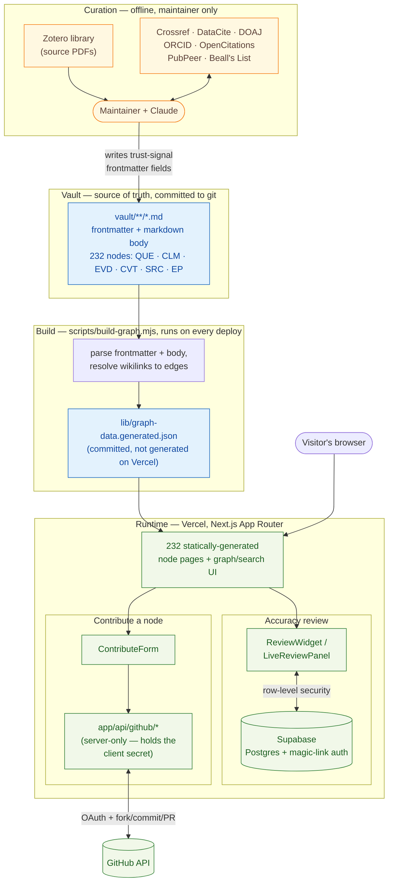

# Living Evidence Synthesis (LIVES): AI-assisted Appraisal of Research

A discourse-graph explorer built from the `living-synthesis` Obsidian vault
(232 nodes: Questions, Claims, Evidence, Caveats, Sources, and a
cross-paper "Evidence Pattern" extension), styled after the
oasisresearchlab `language-and-health-open-synthesis` reference site
(Cream + Forest design system) and following its `discourse-extraction`
node spec/methodology.

## System architecture

Three separate phases, each with a different trust model: an offline
**curation** pass that only the maintainer runs (writes to the vault), a
**build** pass that turns the vault into static pages (runs on every
deploy), and a **runtime** layer for the two features that need a live
visitor identity (accuracy review, contributing a new node).



- **Curation** produces the trust-signal fields documented in
  [`REVIEW.md`](./REVIEW.md) (DOI resolution, retraction/critique status,
  author track record, predatory-publisher screening, citation counts, and
  so on) by hand-verifying results from free/open APIs before writing them
  into vault frontmatter. Nothing in this phase runs automatically or on a
  schedule — see `REVIEW.md`'s runbook section for the actual procedure.
- **Build** is pure, deterministic, and offline: `scripts/build-graph.mjs`
  never makes a network call. It parses every file under `vault/`, resolves
  `[[wikilink]]`-style cross-references into typed graph edges, and writes
  the result to `lib/graph-data.generated.json`. That JSON is committed to
  git (not regenerated by Vercel's build), so a deploy is just "build the
  Next.js app from whatever JSON is already in the repo."
- **Runtime** is where the only two *live*, per-visitor features happen,
  each isolated from the other: Supabase handles sign-in and stores
  accuracy-review verdicts (client talks to Supabase directly, gated by
  Postgres row-level security); GitHub OAuth handles the "Contribute a
  node" flow through server-only API routes, so the OAuth client secret
  never reaches the browser. Both degrade gracefully to "hidden/disabled"
  if their environment variables aren't set — the 232 static node pages
  work with neither configured.

## Getting started

```bash
nvm use          # or: check .nvmrc; this project is pinned to Node 22
npm install
npm run dev       # http://localhost:3000
```

`npm run build` produces the production build; `npm run start` serves it.

Data comes from `scripts/build-graph.mjs`, which parses the vault committed
at `vault/` into `lib/graph-data.generated.json`. Re-run it
(`node scripts/build-graph.mjs`) after editing the vault, and commit both
the vault change and the regenerated JSON together.

Note: `vault/source/pdfs/` (the full source paper PDFs) is deliberately
excluded from this repo; publishing entire copyrighted articles publicly
isn't something this project does. The embedded screenshot crops of
individual tables/figures inside node markdown files are committed.

## Review backend

Live, sign-in-gated accuracy review is backed by Supabase (Postgres + auth),
unlike the read-only reference site's frozen curation-status export. Auth
model: **open sign-in**. Any email can request a one-time code and start
reviewing; there's no invite-only roster (see `supabase/schema.sql` for the
alternative if you want to lock it down later).

Setup (once):
1. Create a project at [supabase.com](https://supabase.com).
2. SQL Editor → run `supabase/schema.sql`.
3. Authentication → Providers → Email → enable, with signups allowed.
4. Project Settings → API → copy the Project URL + anon public key into
   `.env.local` (see `.env.example`).

Each reviewer's verdict (✓ correct · ✎ edit · ✗ wrong · ⟳ missing · — n/a,
per `node-spec.md`'s vocabulary) is one row in `node_reviews`, submitted from
the widget on every node's detail page. `/review` shows the live aggregate
plus each submission, gated behind sign-in via Postgres row-level security
(`lib/supabase.ts`, `components/ReviewWidget.tsx`, `components/LiveReviewPanel.tsx`).

If `NEXT_PUBLIC_SUPABASE_URL`/`NEXT_PUBLIC_SUPABASE_ANON_KEY` are unset, the
review UI degrades gracefully (hidden/disabled) rather than erroring; the
rest of the site works fine without them.

## Build reliability

This project's first production build took an unreasonably long debugging
session to get green. The root causes, and what's now in place to stop them
recurring:

1. **Node version drift.** The system had Node 25 installed, newer than
   what Next.js 16.3.1's webpack build worker was tested against, which
   manifested as builds that looked hung (near-zero CPU for many minutes)
   rather than erroring cleanly. `.nvmrc` + `package.json#engines` now pin
   Node 22. `npm run dev`/`build` also run a preflight check that warns if
   you're on a newer major version.

2. **`outputFileTracingRoot` misconfiguration.** A stray lockfile one
   directory up made Next infer the workspace root as the whole home
   folder, so it tried to trace file output across an enormous unrelated
   tree. Fixed explicitly in `next.config.mjs`; don't remove it.

3. **Concurrent builds racing on `.next`.** Two build processes running at
   once (e.g. two terminals, or an agent + a human) both doing a clean
   build against the same directory caused real, hard-to-diagnose
   failures. `npm run dev`/`build` are now wrapped in `scripts/with-lock.sh`,
   an atomic `mkdir`-based lock; a second concurrent run fails fast with a
   clear message instead of racing silently. If a stale lock is left behind
   after a crash, remove it: `rm -rf .build.lock`.

4. **Resource contention from other apps.** A browser with hundreds of open
   tabs was starving the build of CPU/RAM. `scripts/preflight.mjs` (run
   automatically before `dev`/`build`) checks free memory and flags any
   process using >50% CPU before the build even starts.

5. **Don't trust `ps` CPU%/RSS alone to judge "hung" vs "slow."** `ps`'s
   coarse, decayed CPU% reading can look like ~0% even while a process is
   genuinely, busily compiling. This caused a real misdiagnosis (a
   throttling "fix" was applied that made a working build slower and look
   even more stuck). If a build looks frozen, use a real profiler before
   changing anything:
   ```bash
   sample <pid> 5      # macOS: 5-second stack sample, shows exactly what it's doing
   ```

6. **Build caching.** Repeated `rm -rf .next` before every retry (useful
   for a truly clean-room test, bad as a habit) means you always pay the
   worst-case cold-build cost. Let `.next/cache` persist between local
   builds unless you have a specific reason to nuke it.

7. **Test early, not just at the end.** The first real `next build` attempt
   happened only after the whole app (232 static pages, all routes) was
   already scaffolded, so every failure was slow and expensive to iterate
   on. For future feature work, run `npm run build` after small increments,
   not just once at the end.

8. **Escalate diagnostic method, not just the fix, after repeated failures.**
   If the same class of failure happens 2-3 times in a row, that's a signal
   to change *how* you're diagnosing it (e.g. jump to `sample`/a profiler)
   rather than trying another plausible-sounding config flag.
