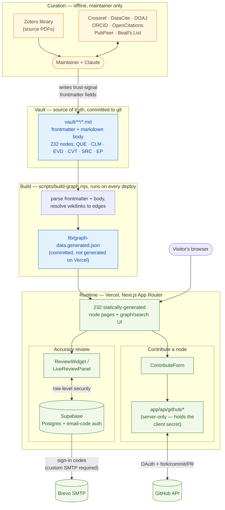
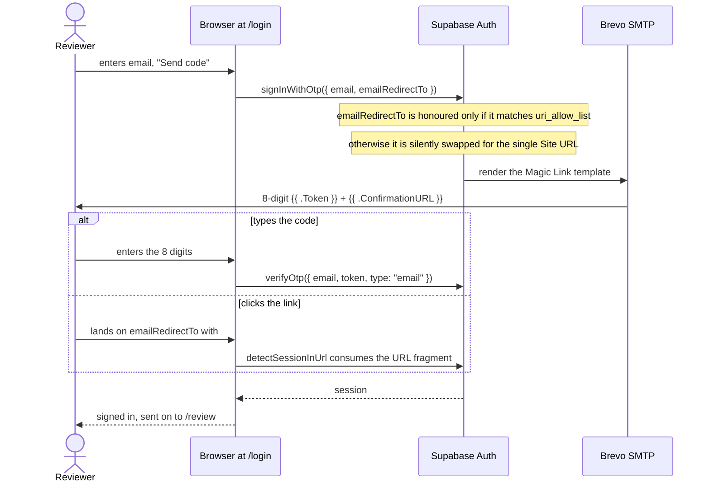

# Living Evidence Synthesis (LIVES): AI-assisted Appraisal of Research

A discourse-graph explorer built from the `living-synthesis` Obsidian vault
(232 nodes: Questions, Claims, Evidence, Caveats, Sources, and a
cross-paper "Evidence Pattern" extension), styled after the
oasisresearchlab `language-and-health-open-synthesis` reference site
(Cream + Forest design system) and following its `discourse-extraction`
node spec/methodology.

## System architecture

Three separate phases, each with a different trust model: an offline
**curation** pass that only the maintainer runs (writes to the vault), a
**build** pass that turns the vault into static pages (runs on every
deploy), and a **runtime** layer for the two features that need a live
visitor identity (accuracy review, contributing a new node).



- **Curation** produces the trust-signal fields documented in
  [`REVIEW.md`](./REVIEW.md) (DOI resolution, retraction/critique status,
  author track record, predatory-publisher screening, citation counts, and
  so on) by hand-verifying results from free/open APIs before writing them
  into vault frontmatter. Nothing in this phase runs automatically or on a
  schedule — see `REVIEW.md`'s runbook section for the actual procedure.
- **Build** is pure, deterministic, and offline: `scripts/build-graph.mjs`
  never makes a network call. It parses every file under `vault/`, resolves
  `[[wikilink]]`-style cross-references into typed graph edges, and writes
  the result to `lib/graph-data.generated.json`. That JSON is committed to
  git (not regenerated by Vercel's build), so a deploy is just "build the
  Next.js app from whatever JSON is already in the repo."
- **Runtime** is where the only two *live*, per-visitor features happen,
  each isolated from the other: Supabase handles sign-in and stores
  accuracy-review verdicts (client talks to Supabase directly, gated by
  Postgres row-level security, with sign-in codes delivered over custom
  SMTP rather than Supabase's test-only built-in sender); GitHub OAuth
  handles the "Contribute a node" flow through server-only API routes, so
  the OAuth client secret never reaches the browser. Both degrade
  gracefully to "hidden/disabled" if their environment variables aren't
  set — the 232 static node pages work with neither configured.

## Getting started

```bash
nvm use          # or: check .nvmrc; this project is pinned to Node 22
npm install
npm run dev       # http://localhost:3000
```

`npm run build` produces the production build; `npm run start` serves it.

Data comes from `scripts/build-graph.mjs`, which parses the vault committed
at `vault/` into `lib/graph-data.generated.json`. Re-run it
(`node scripts/build-graph.mjs`) after editing the vault, and commit both
the vault change and the regenerated JSON together.

Note: `vault/source/pdfs/` (the full source paper PDFs) is deliberately
excluded from this repo; publishing entire copyrighted articles publicly
isn't something this project does. The embedded screenshot crops of
individual tables/figures inside node markdown files are committed, under
`vault/**/Attachments/`. Next only serves `public/`, so
`scripts/sync-attachments.mjs` (run from `preflight`, i.e. before both `dev`
and `build`) copies the referenced crops into `public/vault-img/`, which is
gitignored — the originals stay in the vault and the repo does not carry two
copies. It also prints any embed whose file is missing.

## How a node body is rendered

`lib/markdown.ts` turns each node's markdown into the page you see. Beyond
callouts and mermaid, it does seven things worth knowing about:

- **Figure and table crops.** Obsidian `![[crop.png]]` embeds become real
  images pointing at `/vault-img/`, each in a collapsed `<details>` captioned
  from the filename's own `<citekey>-<what>-p<page>` convention ("Evidence
  excerpt · p. 3"). Collapsed because an EVD embeds three or four full-width
  screenshots and inline they push the prose that cites them off screen. An
  embed whose file was never committed renders as a named placeholder rather
  than a broken image.
- **Maths.** `$…$` and `$$…$$` render through KaTeX at build time; no maths
  runtime ships to the browser. The delimiter rule requires no whitespace
  immediately inside the `$`, which is what separates real LaTeX from the
  corpus's many dollar amounts (`$0.038 per paper versus o3 at $0.321`).
- **Field lists.** Runs of `**Label:**` (EVD Methods Context) or `**Label.**`
  (SRC structured abstracts) become a description list with the labels
  aligned, instead of a stack of paragraphs that reads as one block.
- **Long quotes.** Verbatim quotes inside Methods Context run to a median of
  ~336 characters, several per subsection, so past 200 characters they
  collapse to their opening words plus citation. Quotes in Description stay
  visible — there, the quote *is* the evidence.
- **Table captions.** An italic line directly above a table becomes its
  `<caption>`, so a table lifted from a paper says whose it is. Do not use
  this on the Quality-appraisal or TRIPOD tables: those are ours.
- **Interactive mermaid diagrams.** After a diagram renders (client-side
  only, since mermaid needs a browser — `components/NodeArticle.tsx`), it's
  wrapped in a toolbar with a "Fit to view" toggle (scales a diagram wider
  than the article column down to fit) and a "Full screen" toggle, also
  triggered by clicking the diagram itself, which defaults to Fit to view on
  entry. Mermaid's own light-page background is stripped from the rendered
  SVG so the diagram matches the site's theme instead of showing through as
  a mismatched rectangle.
- **Nested evidence on Questions.** A Question's supporting Claims keep their
  evidence folded behind a count — QUE-001 has 8 claims and 32 evidence
  nodes, and the claims are the answer.

## Prompt tactics (`/prompts`)

A cross-corpus view of *how* each source paper prompted its model, coded across
eleven dimensions: shot count (and whether it was varied), whether input or
output type was iterated, role-playing, detailed procedure, repeated runs, and
three properties of the run itself — disclosed temperature, reasoning/thinking
model, retrieval augmentation. Each row expands to the prompt the paper reports
verbatim, its TRIPOD locator, and a link to the Source node.

The coding lives in `lib/promptTactics.ts` as committed data, not derived from
frontmatter: it is a curator judgement per paper, read off TRIPOD-LLM items 9a,
6c and 6d plus the Methods section. If a source's prompt description changes,
that file has to be updated by hand alongside it — there is no build step that
would notice the drift.

Two findings the page is built around: only three of the 27 sources vary shot
count as an experimental condition, and the 27 produce 23 distinct combinations
of tactics, so there is no shared methodology to speak of.

The prompts themselves are available wherever the question comes up, not only on
that page. `components/PromptDetail.tsx` renders every prompt fragment a paper
reports — 76 across the corpus, one entry per TRIPOD-LLM row (9a prompt design,
6d output instruction, 9b prompt development, and 6c only where that row quotes
prompt text rather than sampling parameters) — behind one collapsed disclosure,
plus (Woelfle only, so far) the full system/user prompt Box 1 prints verbatim on
p.6, above the TRIPOD excerpts as the more readable record. It appears on
Evidence pages showing the parent paper's prompts, since "what did they
actually type at the model" is the same question a reader has when weighing a
finding — inline in Methods Context right after the Procedure entry it belongs
beside, not stacked above the abstract. The fragments were already on the page,
spread across four rows of a TRIPOD table that is itself collapsed: recoverable,
but not findable.

On a Source page the same disclosure is inline too, as its own "Prompt" entry
in the Methods field list, placed directly before "At a glance" — next to the
flowchart's own "Prompt template" step, rather than at the top of the page.
(Every source in the corpus currently has an "At a glance" diagram; one
without it falls back to the top-of-page placement, rendered by the same
`<PromptDetail>` used on Evidence pages.) Node bodies are injected via
`dangerouslySetInnerHTML`, so neither inline placement can host a React
component directly — `lib/promptBlock.ts` renders the identical markup as a
server-side HTML string, reading the same `lib/promptTactics.ts` data as
`PromptDetail.tsx` so the two can differ in placement but never in content.
The nesting itself (finding the right spot in the field list and, for
Sources, folding the diagram into its own "At a glance" entry so the two line
up on the same left edge) is `lib/markdown.ts`'s `insertAfterProcedure`,
`insertBeforeAtAGlance`, and `nestAtAGlanceDiagram`.

## Review backend

Live, sign-in-gated accuracy review is backed by Supabase (Postgres + auth),
unlike the read-only reference site's frozen curation-status export. Auth
model: **open sign-in**. Any email can request a one-time code and start
reviewing; there's no invite-only roster (see `supabase/schema.sql` for the
alternative if you want to lock it down later).

The email carries both halves of a sign-in: an 8-digit code to type into
`/login`, and a link to click. Either works.



Setup (once):
1. Create a project at [supabase.com](https://supabase.com).
2. SQL Editor → run `supabase/schema.sql`.
3. Authentication → Providers → Email → enable, with signups allowed.
4. Project Settings → API → copy the Project URL + anon public key into
   `.env.local` (see `.env.example`).
5. **Configure custom SMTP — this is not optional.** Authentication → Emails →
   SMTP Settings, pointed at any transactional provider (this project uses
   Brevo's free tier: `smtp-relay.brevo.com`, port `587`, and note the
   Management API wants `smtp_port` as a *string*, not a number). Until you
   do, step 6 fails with:

   > Email template modification is not available for free tier projects using
   > the default email provider. Please upgrade your plan or configure a custom
   > SMTP provider.

   Supabase's built-in email sender is test-only and rate-limited to a couple
   of messages an hour, so this is needed for real reviewers regardless.
6. Authentication → Emails → **Magic Link** template → make sure it contains
   `{{ .Token }}`. The stock template only has `{{ .ConfirmationURL }}` (a
   link), but `/login` asks for a code, so with the stock template that form
   has nothing to type into it. Keeping both placeholders lets a reviewer use
   whichever half they prefer:

   ```html
   <h2>Sign in to the review site</h2>
   <p>Enter this code on the sign-in page:</p>
   <p style="font-size:28px;letter-spacing:6px"><strong>{{ .Token }}</strong></p>
   <p>Or <a href="{{ .ConfirmationURL }}">click here to sign in</a>.</p>
   ```

   The code's length is the project's `mailer_otp_length` (**8** here, not
   Supabase's stock 6). `app/login/page.tsx` hard-codes that length in its
   label, placeholder and `maxLength` — change both together or the form will
   describe a code that never arrives.
7. Authentication → URL Configuration:
   - **Redirect URLs** — add every origin the site runs on, as both the bare
     origin and a `/**` wildcard (`http://localhost:3000`,
     `http://localhost:3000/**`, and the same pair for production).
     `signInWithOtp` sends an explicit `emailRedirectTo` built from
     `NEXT_PUBLIC_SITE_URL` or the browser's origin, and Supabase honours it
     only if it matches this list. An empty list is not a no-op: it means
     *every* redirect silently falls back to Site URL.
   - **Site URL** — the public production address. On Vercel, take care to use
     the alias that is actually reachable without logging in
     (`living-evidence-synthesis.vercel.app`), not the team-suffixed or
     per-deployment hostnames, which sit behind Vercel's SSO wall and will show
     reviewers a Vercel login screen.

   To check both without sending an email, hand `/auth/v1/verify` a junk token
   and read where it redirects — an allow-listed `redirect_to` is echoed back,
   anything else reveals the current Site URL:

   ```bash
   curl -sD - -o /dev/null "$SUPABASE_URL/auth/v1/verify?token=junk&type=magiclink&redirect_to=https%3A%2F%2Fexample.com" | grep -i '^location:'
   ```

Each reviewer's verdict (✓ correct · ✎ edit · ✗ wrong · ⟳ missing · — n/a,
per `node-spec.md`'s vocabulary) is one row in `node_reviews`, submitted from
the widget on every node's detail page. `/review` shows the live aggregate
plus each submission, gated behind sign-in via Postgres row-level security
(`lib/supabase.ts`, `components/ReviewWidget.tsx`, `components/LiveReviewPanel.tsx`).

If `NEXT_PUBLIC_SUPABASE_URL`/`NEXT_PUBLIC_SUPABASE_ANON_KEY` are unset, the
review UI degrades gracefully (hidden/disabled) rather than erroring; the
rest of the site works fine without them.

## Build reliability

This project's first production build took an unreasonably long debugging
session to get green. The root causes, and what's now in place to stop them
recurring:

1. **Node version drift.** The system had Node 25 installed, newer than
   what Next.js 16.3.1's webpack build worker was tested against, which
   manifested as builds that looked hung (near-zero CPU for many minutes)
   rather than erroring cleanly. `.nvmrc` + `package.json#engines` now pin
   Node 22. `npm run dev`/`build` also run a preflight check that warns if
   you're on a newer major version.

2. **`outputFileTracingRoot` misconfiguration.** A stray lockfile one
   directory up made Next infer the workspace root as the whole home
   folder, so it tried to trace file output across an enormous unrelated
   tree. Fixed explicitly in `next.config.mjs`; don't remove it.

3. **Concurrent builds racing on `.next`.** Two build processes running at
   once (e.g. two terminals, or an agent + a human) both doing a clean
   build against the same directory caused real, hard-to-diagnose
   failures. `npm run dev`/`build` are now wrapped in `scripts/with-lock.sh`,
   an atomic `mkdir`-based lock; a second concurrent run fails fast with a
   clear message instead of racing silently. If a stale lock is left behind
   after a crash, remove it: `rm -rf .build.lock`.

4. **Resource contention from other apps.** A browser with hundreds of open
   tabs was starving the build of CPU/RAM. `scripts/preflight.mjs` (run
   automatically before `dev`/`build`) checks free memory and flags any
   process using >50% CPU before the build even starts.

5. **Don't trust `ps` CPU%/RSS alone to judge "hung" vs "slow."** `ps`'s
   coarse, decayed CPU% reading can look like ~0% even while a process is
   genuinely, busily compiling. This caused a real misdiagnosis (a
   throttling "fix" was applied that made a working build slower and look
   even more stuck). If a build looks frozen, use a real profiler before
   changing anything:
   ```bash
   sample <pid> 5      # macOS: 5-second stack sample, shows exactly what it's doing
   ```

6. **Build caching.** Repeated `rm -rf .next` before every retry (useful
   for a truly clean-room test, bad as a habit) means you always pay the
   worst-case cold-build cost. Let `.next/cache` persist between local
   builds unless you have a specific reason to nuke it.

7. **Test early, not just at the end.** The first real `next build` attempt
   happened only after the whole app (232 static pages, all routes) was
   already scaffolded, so every failure was slow and expensive to iterate
   on. For future feature work, run `npm run build` after small increments,
   not just once at the end.

8. **Escalate diagnostic method, not just the fix, after repeated failures.**
   If the same class of failure happens 2-3 times in a row, that's a signal
   to change *how* you're diagnosing it (e.g. jump to `sample`/a profiler)
   rather than trying another plausible-sounding config flag.

9. **iCloud Drive "Optimize Mac Storage" can evict `node_modules` files to
   zero-byte stubs.** `ls`/`stat` still report the correct logical size, so
   this looks like a genuine code or dependency bug (missing export,
   silent exit, `undefined` where a module should be). `du -k` on the
   specific file reports `0` when it's actually a stub; `brctl download
   <path>` re-materializes it. See `FIXES.md` §9 for the full story — it
   cost an entire session before being correctly diagnosed.

## Source page design (SRC nodes)

Each `SRC` node page (`vault/source/*.md`) renders its trust signals as a
**nutrition-style panel** behind the "Show Quality Signals" button
(`components/QualitySignalsTable.tsx`): one row per signal, grouped under
Transparency / Openness / Rigor / Integrity, with Rigor's bands (Validity,
Design, Analyses, Interpretation) nested under a single heading rather than
repeating it. Each row carries a colour dot in its own column, so the dots
form a rule you can run an eye down, and a status word beside it — colour is
never the only encoding. Hovering a signal name opens the **whole scale** it
is drawn from, every level with its colour and meaning, the paper's own value
marked (`components/ScaleTooltip.tsx`, scales defined once in
`lib/scales.ts`). Pages also use muted single-color status icons instead of
categorical emoji, and — for papers with a TRIPOD-LLM appraisal table — a
quote-plus-locator citation in the final column (`*"quote"* \`§/page\`` or
literal `Not reported`) instead of a paraphrase.

A Source page opens with only the **Question** expanded; Methods, Findings,
Claim supported, Caveats and the appraisal tables start collapsed, and the
Abstract's subsections are indented under it so the hierarchy reads at a
glance. Other node types keep every section open, because their bodies *are*
the content rather than chapters around it (`AccordionPolicy` in
`lib/markdown.ts`). The chip/icon/table styling lives in `lib/markdown.ts`,
`components/TopBadges.tsx`, and `app/globals.css`; the underlying signals
are parsed from `tags:` frontmatter (`rigor/*`, `top/*`, `appraisal/*`,
etc.) by small getters in `lib/data.ts`. Page footers cite the TRIPOD-LLM
guideline (Gallifant et al. 2025, *Nature Medicine*) and, when present,
the LLM model/version/date used to curate that page's trust signals
(`curatedWithModel`/`curatedWithModelDate` frontmatter).

This treatment has been piloted on one source
(`@louAAAR10AssessingAIs2025.md`, SRC-011) and not yet rolled out to the
other source files.

### AI Writing Check (Pangram)

Since 2026-08, sources meeting either of two triggers — a "Statistic
Accuracy: Issues found" verdict, or a Data Repo Check / Code Check of "No
repository claimed" — also get an independent AI-generated-text recheck of
their own full PDF prose via [Pangram](https://www.pangram.com) (model
v3.3.2, bulk file-upload endpoint), run from `misc/scripts/pangram_check.py`
in the vault repo. This is not a full-corpus sweep and is unrelated to the
TOP "AI disclosure" transparency signal (whether authors *say* they used
AI) — it's a forensic check of whether the prose itself reads as
AI-generated. Results are tagged `integrity/ai-writing-check/*` on the
source, surfaced as an "AI writing check" row alongside every
other trust signal, and cited with the paper's own Pangram dashboard link
rather than a quote from the paper (see `getAiWritingCheck` in
`lib/data.ts`). Pangram's AI-*image* detector is a research preview with
no documented stable API and is not used here.

### Code Quality (howfairis)

Since 2026-08, every source whose data-availability statement links to a
GitHub or GitLab repository gets that repo checked against the
[fair-software.eu](https://fair-software.eu) 5-criteria checklist — open
repository, license, package-registry listing (PyPI/npm/Conda/etc.),
citation metadata (CITATION.cff/Zenodo), and a quality-checklist badge —
via [`howfairis`](https://github.com/fair-software/howfairis), a local
CLI tool requiring no API key. This is a different question from the
existing Dataset/Code availability rows (which only ask "does the
link still resolve"): Code Quality asks whether the repo follows
baseline open-source-software hygiene once you're there. As of 2026-08,
13 of 27 sources have a GitHub/GitLab repo to check (the rest host code
on HuggingFace/OSF, which howfairis doesn't support, or release no code
at all) — every one of the 13 scored 1/5 or 2/5, with none reaching a
package-registry listing, citation file, or quality badge. Tagged
`top/code-quality-fair/{0-5}` on the source (see `getCodeQualityFair` in
`lib/data.ts`), surfaced as a **Code FAIRness** row alongside every other trust signal.

### Data Quality (FAIR-Checker, hybrid-scored)

Since 2026-08, every source with a checkable, released dataset gets a
"Data Quality" score on a 0-24 scale, via
[FAIR-Checker](https://fair-checker.france-bioinformatique.fr) (a
semantic-web/schema.org-based FAIR assessor, 12 metrics scored 0-2 each).
Unlike Code Quality, FAIR-Checker's REST API works against any platform —
GitHub, OSF, HuggingFace — on one consistent scale, which is why it was
chosen over `howfairis` for this signal. But a raw FAIR-Checker score is
uninformative for GitHub-hosted data: GitHub pages carry none of the
schema.org metadata the tool looks for, so every GitHub-hosted dataset
tested flatlined at an identical 4/24 regardless of actual content. To
keep the scale meaningful across platforms, GitHub/GitLab-hosted datasets
get a documented **+2 top-up** if the repo has a real LICENSE file — reusing
the license-detection result already computed for Code Quality, since
`howfairis` reads repo content directly in a way FAIR-Checker's
page-metadata approach cannot. OSF and HuggingFace datasets, which do carry
real structured metadata, keep their native FAIR-Checker score unchanged.
As of 2026-08, 14 of 27 sources have a checkable dataset: two OSF projects
scored 16/24, two HuggingFace dataset cards scored 9/24, and ten
GitHub-hosted datasets split between 4/24 (no license) and 6/24 (license
present). Full per-source breakdown in `misc/data_quality_2026-08.md` in
the vault. Tagged `top/data-quality-fair/{0-24}` on the source (see
`getDataQualityFair` in `lib/data.ts`), surfaced as a **Dataset FAIRness**
row alongside every other trust signal.

Availability and FAIRness are shown as separate rows — **Dataset** / **Dataset
FAIRness** and **Code** / **Code FAIRness** — and both always render. The
FAIRness row distinguishes three states rather than two: a score (`16 of 24`),
`unscored` when the link resolves but nothing has been scored yet, and `NA`
only when the authors claim no artifact at all. That distinction matters:
nine artifact pairs in the corpus are live-but-unscored, and reporting those
as "not applicable" made a working, scoreable repository look like an absent
one.
