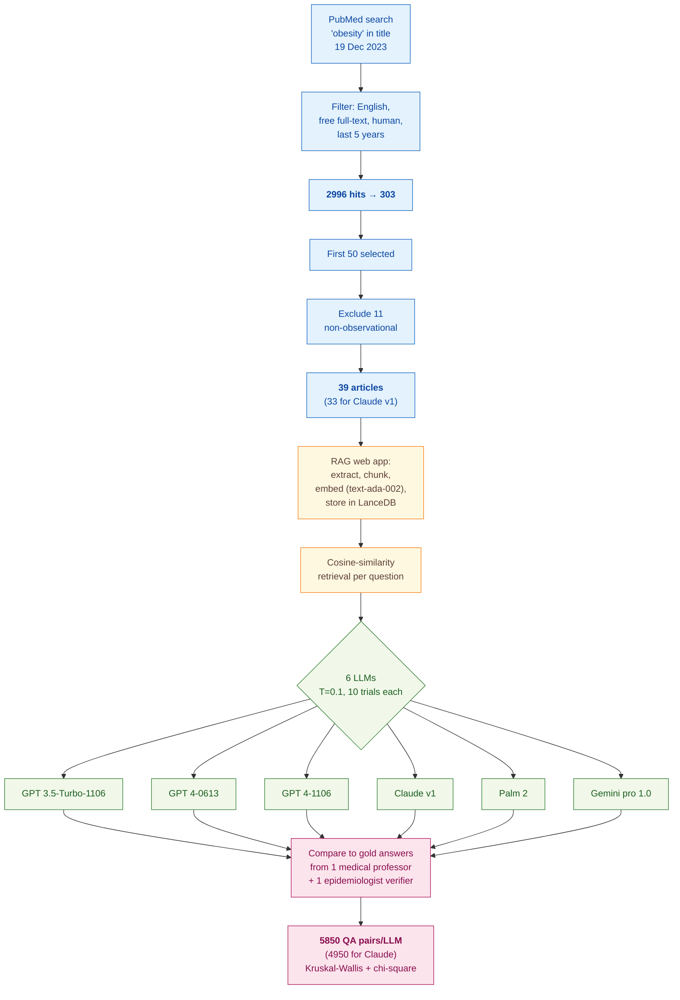

> [!success] **TL;DR**
> The headline ranking, GPT 3.5-Turbo at the top, GPT 4-0613 at the bottom, is real but not interpretable as a comprehension ranking, because training-data coverage, access restrictions, and a single-expert gold standard all confound the comparison. The most defensible finding is the item-level pattern: across all six models, discussion-section items are easy and technical-detail items are hard, which is consistent with how LLMs handle interpretive vs. extractive tasks generally.

## Abstract

### Question

Can today's general-purpose chatbots read a medical research paper and reliably answer the kinds of structured questions a human reviewer would ask about it? The authors zoom in on observational studies and use the STROBE checklist (Strengthening the Reporting of Observational Studies in Epidemiology, a standard reporting guideline) as the structured task. They run six commercial large language models (LLMs) head-to-head against an expert physician's answers on the same 39 papers, with each question asked ten times to gauge consistency. See [[QUE - How accurately can LLMs assess or understand medical research papers compared to human experts?]].

### Methods

**Design.** The authors built a cross-sectional benchmark, scoring six commercial LLMs against a single expert's gold-standard answers on a STROBE-style question set, with statistical comparisons across models.

**Tools.** The team built a custom retrieval-augmented generation web app called "AI Research Assistant". Retrieval-augmented generation (RAG) is the trick of letting the model look up relevant passages from a paper before answering, instead of relying only on its training data. Their pipeline used LanceDB (an open-source vector database) plus OpenAI's text-ada-embedding-002 model to turn each chunk of the paper into a numeric fingerprint, then cosine similarity to pick the most relevant chunks per question. The six models tested were GPT 3.5-Turbo-1106, GPT 4-0613, GPT 4-1106 (all OpenAI), Claude v1 (Anthropic), Palm 2 / chat-bison (Google), and Gemini pro 1.0 (Google). Statistics ran in SPSS 29.0.

**Procedure.** The authors searched PubMed on 19 December 2023 for "obesity" in the title, filtered to English open-access human-subject papers from the last five years, then kept the first 50 hits. They threw out 11 non-observational papers, leaving 39. They uploaded each PDF to the RAG app, which extracted text, broke it into chunks, embedded the chunks, and stored them. For each of 15 STROBE-derived questions (13 yes-or-no plus 2 multiple-choice), the pipeline retrieved the most relevant chunks and fed them to each LLM along with a fixed system prompt that cast the model as a pediatric-gastroenterology professor. Each question was asked 10 times per article per LLM at temperature 0.1 (low temperature reduces randomness). A response counted as "correct" only if it exactly matched the gold answer and followed the format. Comparisons used Kruskal-Wallis tests (a non-parametric test for differences across groups) and chi-square at alpha = 0.05.

**Sample.** The PubMed search returned 2,996 hits, narrowed to 303 by filters, then to the first 50, then to 39 observational papers after excluding 11. Claude v1 was further restricted to 33 papers because of access limits. The unit of analysis was the question-answer pair: 39 articles times 15 questions times 10 trials gives 5,850 pairs per LLM (4,950 for Claude v1). The reference standard came from a single experienced medical professor in pediatric gastroenterology, with answers verified by one epidemiologist.

**At a glance.**

---

### Findings

- **GPT 3.5-Turbo edged out the newer models on this task.** GPT 3.5-Turbo-1106 got 66.9% of answers right, narrowly beating GPT 4-1106 at 65.6% (the gap was not statistically meaningful, p = 0.061). Palm 2 followed at 62.1%, then Claude v1 at 58.3%, Gemini pro at 49.2%, and GPT 4-0613 at the bottom with 44.1%. Differences across models overall were unlikely to be chance (p < 0.001). [[EVD - GPT 3.5-turbo achieved the highest correct answer rate of 66.9% on STROBE checklist questions across 39 medical articles - @akyonEvaluatingCapabilitiesGenerative2024]]

- **The older GPT-4 snapshot performed worst of the six.** GPT 4-0613 (the June 2023 GPT-4 release) answered only 44.1% correctly, significantly below Gemini pro at 49.2% (p < 0.001) and well below the newer GPT 4-1106. The authors note that 28 of the 39 articles (71.8%) were published before GPT 4-0613's September 2021 training cutoff, while all 39 came before GPT 4-1106's April 2023 cutoff. They also speculate that compression techniques in newer model snapshots (such as quantization, which lowers numeric precision to save memory) may have degraded the 0613 release. [[EVD - GPT 4-0613 achieved the lowest correct answer rate of 44.1% among all tested LLMs on STROBE questions - @akyonEvaluatingCapabilitiesGenerative2024]]

- **Models did best on discussion items and worst on technical-detail items.** Averaged across all six LLMs, the easiest STROBE items were Q12 (whether the discussion summarises key results) at 68.3%, Q13 (whether limitations are discussed) at 62.8%, and Q10 (presence of a flowchart) at 60.5%. The hardest items were Q8 (which statistical software was used) at 33.5%, Q15 (funding source) at 35.8%, and Q1 (study design stated in the title or abstract) at 36.5%. Q8 and Q15 were multiple-choice with 7 and 2 options respectively, which may explain part of the gap. [[EVD - LLMs showed lowest accuracy on questions about statistical software used and study funding across all models - @akyonEvaluatingCapabilitiesGenerative2024]]

### Claim supported

Together these findings support the broader claim that [[CLM - LLMs achieve moderate accuracy on structured quality appraisal tasks but cannot yet substitute for expert human judgment]] and that [[CLM - LLM performance on structured checklist tasks varies substantially by item type with simpler factual items showing higher agreement than items requiring methodological judgment]]. For anyone considering plugging an LLM into a real review workflow, the practical takeaway is sobering: even the best model here misses a third of STROBE items, and performance flips unpredictably across model versions, so an LLM is at most an assistant that still needs a human checker.

### Caveats

- **The gold standard came from one expert.** A single medical professor wrote the reference answers and one epidemiologist verified them, so the "ground truth" reflects the views of a small panel rather than a broad consensus. [[CVT - The benchmark gold standard relied on a single medical professor limiting reference standard validity]]

- **Model training cutoffs were not equal.** GPT 4-1106 saw all 39 papers before its April 2023 cutoff; GPT 3.5-Turbo and GPT 4-0613 saw only 28 of them; cutoffs for Claude, Palm, and Gemini were not disclosed. Performance gaps between models could partly reflect training-data coverage rather than actual comprehension ability. [[CVT - Training data cutoff differences across LLM versions confounded performance comparisons in the STROBE benchmark study]]

## Quality appraisal

> [!info] Risk-of-bias and validity assessment, synthesized from this paper's discourse-graph nodes and grounded in the same paper this page's top trust-signal chips summarize. Covers *methodological quality*, the TRIPOD-LLM table below covers *reporting compliance* instead.
> <dl class="callout-legend">
> <dt>● Low risk</dt><dd>No meaningful threat to this domain identified</dd>
> <dt>◐ Some risk</dt><dd>A real but non-fatal limitation</dd>
> <dt>○ High risk</dt><dd>A significant, unaddressed threat to validity</dd>
> </dl>

| Domain | Rating | Quote |
| --- | :---: | --- |
| **Construct validity**: does the metric actually measure the construct? | 🟡 | *"Q15, related to funding, tests the LLMs' attentiveness to specific yet crucial details that could influence the interpretation of research findings."* `p.10`, a funding-mention lookup item is scored on the same "correct answer" scale as interpretive items like discussion-summary quality |
| **Internal validity**: could the comparison be biased? | 🔴 | *"28 (71.8%) were published before the training data cutoff date for GPT-3.5-turbo and GPT-4-0613, while all 39 articles (100%) were published before the cutoff date for GPT-4-1106. Explicit cutoff dates for the remaining LLMs (Claude, Palm 2, and Gemini Pro) were not publicly available"* `Results, p.15`, unequal and partly undisclosed pretraining exposure to the test articles across the six compared models |
| **External validity**: do findings generalize? | 🔴 | *"we relied on the expertise of an experienced medical professor and an epidemiology expert doctor"* `Benchmark Development, p.9`, gold standard drawn from a single specialty pair on 39 obesity-titled PubMed papers |
| **Statistical conclusion validity**: appropriate uncertainty + comparisons? | 🟡 | *"The power analysis, conducted using GPower, indicated that all analyses exceeded 95% power."* `Article Selection, p.8`, power was checked, but no confidence intervals on accuracy or multiple-comparison correction across six models × 15 questions are reported |
| **Reproducibility**: code, data, determinism? | 🔴 | *"For this study, we opted for a low-temperature parameter setting of 0.1 to minimize the impact of randomness."* `p.13`, temperature is disclosed but top_p, seed, retrieval-k, and chunk size are not, and the "AI Research Assistant" web app code is not released |
| **Data leakage**: could models have seen this data pretraining? | 🔴 | *"28 (71.8%) were published before the training data cutoff date for GPT-3.5-turbo and GPT-4-0613, while all 39 articles (100%) were published before the cutoff date for GPT-4-1106"* `Results, p.15` |
| **Baseline adequacy**: is there a meaningful floor to beat? | 🔴 | Not reported: no naive or majority-class baseline is scored alongside the six LLMs for comparison |
| **Train/dev/test hygiene**: are data splits kept separate? | 🔴 | Not reported: no train/dev/test split is described; all 39 articles are used directly as the evaluation set |
| **Multiple-comparisons correction**: controlled for repeated testing? | 🔴 | Not reported: six models × 15 questions are compared via Kruskal-Wallis and chi-square with no stated correction |
| **Human-baseline comparability**: is there a human reference point? | 🟡 | *"The experienced medical professor's answers to these questions are assigned as the golden standard."* `Abstract, p.6`, a human answers the questions, but only as the gold-standard target, not as a scored comparator alongside the LLMs |
| **Statistical power**: was the sample sized to detect the claimed effect? | 🟢 | *"A post-hoc power analysis was conducted to assess the statistical power of our study based on the total correct responses across all repetitions... indicated that all analyses exceeded 95% power."* `Article Selection, p.8` |
| **Confidence Intervals**: are point estimates accompanied by an interval? | 🔴 | Not reported: the six-model STROBE comparison uses Kruskal-Wallis and chi-square significance tests only; no confidence interval accompanies the per-model accuracy figures `Statistical Analysis, p.13` |
| **Chance-Corrected Metrics**: does agreement/accuracy correct for chance? | 🔴 | Not reported: model comparisons use raw percent-correct scores with chi-square/Kruskal-Wallis significance tests, not a chance-corrected agreement statistic `Statistical Analysis, p.13` |
| **Non-Significant Result Spin**: are null or negative findings framed plainly? | 🔴 | Not applicable: GPT 4-0613's worst-performer result (44.1%) is stated plainly in the abstract alongside the top performer, with no apparent reframing |
| **Ablation Experiment(s)**: does the paper isolate a component's contribution? | 🔴 | Not reported: comparisons are only across six different LLMs on the same benchmark; no pipeline component (e.g., RAG vs. no-RAG, prompt variants) is removed or varied and re-measured |
| **AI writing check**: does the paper's own prose read as AI-generated? | 🟢 | Independent recheck run because this source's Dataset check and Code check both returned "No repository claimed". Pangram v3.3.2 AI-text detector: *"We believe that this document is fully human-written"* (0% AI-generated, 0% AI-assisted). [Dashboard](https://www.pangram.com/history/988f13aa-623b-4941-8d18-0c836c53009a) |

**Bottom line.** The headline ranking, GPT 3.5-Turbo at the top, GPT 4-0613 at the bottom, is real but not interpretable as a comprehension ranking, because training-data coverage, access restrictions, and a single-expert gold standard all confound the comparison. The most defensible finding is the item-level pattern: across all six models, discussion-section items are easy and technical-detail items are hard, which is consistent with how LLMs handle interpretive vs. extractive tasks generally. Before any LLM here is fit for STROBE-style screening at scale, the field needs a multi-expert gold standard, matched training-cutoff models, public code, and confidence intervals on accuracy.

> [!tip] **Applicable external appraisal frameworks beyond TRIPOD-LLM** (already covered by the table below): **MI-CLAIM** (Norgeot et al. 2020) for clinical-AI minimum information · **MINIMAR** (Hernandez-Boussard et al. 2020) for medical-AI reporting · **PROBAST+AI** (Wolff et al. 2019 base; AI extension in development) for prediction-model risk of bias

---

## TRIPOD-LLM reporting

> [!info] Reporting compliance for this paper, mapped to the TRIPOD-LLM checklist (Title/Abstract/Introduction items 1–4, Methods items 5a–15, Results items 16a–18). Item 17 (Performance) is reported per-EVD; see each EVD's `## Other Notes`.
> 

> ●Fully reported
> ◐Partial / unclear
> ○Not reported
> –Not applicable
> 

| # | Item | ✓ | Quote |
| --- | --- | :---: | --- |
| **1** | Title | ✅ | *"Evaluating the Medical Article Understanding Capabilities of Generative Artificial Intelligence Tools"* `Title` |
| **2** | Abstract | ➖ | Assessed separately under TRIPOD-LLM's own Abstract extension, not scored here |
| **3a** | Background: context + rationale | ✅ | *"Reading medical articles is a challenging and time-consuming task for doctors, especially when the articles are long and complex. This poses a significant barrier to efficient knowledge acquisition and evidence-based decision making in healthcare."* `Introduction, p.7` |
| **3b** | Background: target population | ✅ | *"The results of our study will provide valuable information for medical professionals, researchers, and developers seeking to leverage the potential of LLMs for improving medical literature comprehension and ultimately enhance patient care and research efficiency."* `Introduction, p.7` |
| **4** | Objectives | ✅ | *"This study aims to critically assess and compare the comprehension capabilities of Large Language Models (LLMs) in accurately and efficiently understanding medical research articles using the STROBE checklist which provides a standardized framework for evaluating key elements of observational study."* `Abstract, p.6` |
| **5a** | Data sources | ✅ | *"We included the first 50 observational studies conducted within the past five years that were retrieved through an advanced search on PubMed on December 19, 2023, using ''obesity'' in the title as the search term."* `Article Selection, p.8` |
| **5b** | Data points + distribution | ✅ | *"In this study, 15 questions selected from the STROBE checklists were posed 10 times each for 39 articles to six different LLMs."* `Results, p.13` |
| **5c** | Date range of data | ⚠️ | *"We included the first 50 observational studies conducted within the past five years... retrieved through an advanced search on PubMed on December 19, 2023"* `Article Selection, p.8`, search date given; specific oldest/newest publication dates of the 39 articles not enumerated |
| **5d** | Pre-processing / quality checks | ✅ | *"Text Extraction and Chunking: Each retrieved PubMed article was converted to PDF format and then processed through our web application. The application extracts all text content from the article and divides it into smaller text chunks of manageable size."* `Benchmark Pipeline, p.11` |
| **5e** | Missing / imbalanced data | ⚠️ | *"Access issues with Claude v1, specifically restrictions on its ability to process certain medical information, resulted in the exclusion of data from six articles, limiting the study's scope to 33 articles."* `Results, p.13` |
| **6a** | LLM name + version | ✅ | *"we compared the answers of the generative AI tools, which are ChatGPT 3.5-turbo 1106 (11th June version), ChatGPT 4-0613 (6th November version), ChatGPT 4-1106 (11th June version), Palm 2 (chat-bison), Claude v1, Gemini pro"* `LLMs, p.12` |
| **6b** | Development process | ➖ | *"The methodology incorporated a novel web application specifically designed for this purpose to assess the understanding capabilities of generative AI tools in medical research articles"* `p.10`, no LLM training or fine-tuning; models used off-the-shelf via the RAG pipeline |
| **6c** | Inference settings / prompting | ⚠️ | *"For this study, we opted for a low-temperature parameter setting of 0.1 to minimize the impact of randomness."* `p.13`, top-p, max tokens, seed, retrieval k, and chunk size not reported |
| **6d** | Output | ✅ | *"Only the answers that were correct and followed the instructions provided in the question text were considered ''correct''. Ambiguous answers, evident mistakes, and responses with an excessive number of candidates were considered incorrect."* `Statistical Analysis, p.13` |
| **6e** | Classification thresholds | ➖ | Not applicable: output is a categorical option, not a probability |
| **7a** | Quality metrics | ⚠️ | *"Various descriptive statistical tests were used to assess the data presented as numbers and percentages... The Kruskal-Wallis and Pearson chi-square tests were employed in the statistical analysis."* `Statistical Analysis, p.13` |
| **7b** | Relevance to downstream use | ⚠️ | *"The results of our study will provide valuable information for medical professionals, researchers, and developers seeking to leverage the potential of LLMs for improving medical literature comprehension and ultimately enhance patient care and research efficiency."* `Introduction, p.7` |
| **7c** | Outcome definition | ✅ | *"The accuracy of each LLMs' response was then evaluated by comparing it to the benchmark answers provided by a medical professor."* `Benchmark Pipeline, p.12` |
| **7d** | Subjective interpretation | ⚠️ | *"The epidemiology expert doctor, with their specialized knowledge in statistical analysis and epidemiological methods, provided verification and validation of the professor's answers, ensuring the rigor of the benchmark."* `Benchmark Development, p.9` |
| **7e** | Comparison | ✅ | *"Each LLM was compared with another LLM that provided a lower percentage of correct answers. Statistical analysis using the Kruskal-Wallis test revealed statistically significant differences between the LLMs (P<.001)."* `Results, p.14` |
| **8a** | Annotation guidelines | ✅ | *"This list of fifteen questions, two multiple-choice, and thirteen yes/no questions has been prepared by selecting the STROBE Checklist items that can be answered definitively and have clear, non-subjective responses."* `p.10` |
| **8b** | Annotators + IAA | ⚠️ | *"The epidemiology expert doctor... provided verification and validation of the professor's answers"* `Benchmark Development, p.9`, no quantitative inter-annotator agreement (κ) reported |
| **8c** | Annotator background | ✅ | *"we relied on the expertise of an experienced medical professor and an epidemiology expert doctor."* `Benchmark Development, p.9` |
| **9a** | Prompt design | ⚠️ | *"You are an expert medical professor specialized in pediatric gastroenterology hepatology and nutrition, with a detailed understanding of various research methodologies, study types, ethical considerations, and statistical analysis procedures."* `p.12` |
| **9b** | Prompt-development data | ❌ | Not reported |
| **10** | Summarization | ➖ | Not applicable: task is QA, not summarization |
| **11** | Instruction tuning / alignment | ➖ | Not applicable: no fine-tuning; all models used off-the-shelf via API |
| **12** | Compute | ❌ | Not reported |
| **13** | Ethical approval | ✅ | *"Ethical approval was not required for this study since it did not involve any human or animal research participants."* `Ethical Considerations, p.13` |
| **14a** | Funding | ❌ | Not reported |
| **14b** | Conflicts of interest | ✅ | *"None declared."* `Conflicts of Interest, p.21` |
| **14c** | Protocol | ❌ | Not reported |
| **14d** | Registration | ➖ | Not applicable: not a clinical study |
| **14e** | Data availability | ⚠️ | *"Multimedia Appendix 1: [Percentages of Correct Answers by Large Language Models for Each Question]"* `p.21` |
| **14f** | Code availability | ❌ | Not reported |
| **15** | Patient/public involvement | ➖ | Not applicable |
| **16a** | Flow of data | ✅ | *"The articles included in the study were statistically examined in detail, and a total of 11 of them were excluded because they were not observational studies. The study was completed with 39 articles."* `Article Selection, p.8` |
| **16b** | Characteristics | ✅ | *"The included studies were limited to those written in English, available as free full-text, and focusing specifically on human subjects"* `Article Selection, p.8` |
| **16c** | Distribution comparison | ➖ | Not applicable: no clinical-outcome subgroup comparison |
| **16d** | N per analysis | ✅ | *"ChatGPT 3.5 Turbo-1106 5850 3916 66.9"* `Table 3, p.14` |
| **17** | Performance | `per-EVD` | Reported per-EVD. See each EVD's `## Other Notes`. |
| **18** | LLM updating | ➖ | Not applicable: no model updating reported |
