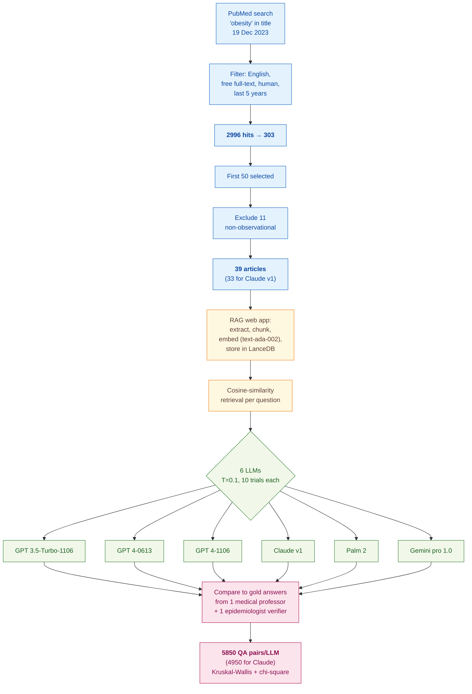

> [!success] **TL;DR**
> The headline ranking — GPT 3.5-Turbo at the top, GPT 4-0613 at the bottom — is real but not interpretable as a comprehension ranking, because training-data coverage, access restrictions, and a single-expert gold standard all confound the comparison. The most defensible finding is the item-level pattern: across all six models, discussion-section items are easy and technical-detail items are hard, which is consistent with how LLMs handle interpretive vs. extractive tasks generally.

## Structured abstract

> [!info] A plain-language summary built from this paper's discourse-graph nodes. Numbers and findings link back to specific EVD nodes — click any link to drill in.

### Question

Can today's general-purpose chatbots read a medical research paper and reliably answer the kinds of structured questions a human reviewer would ask about it? The authors zoom in on observational studies and use the **STROBE** checklist (Strengthening the Reporting of Observational Studies in Epidemiology — a standard reporting guideline) as the structured task. They run six commercial large language models (LLMs) head-to-head against an expert physician's answers on the same 39 papers, with each question asked ten times to gauge consistency. See [[QUE - How accurately can LLMs assess or understand medical research papers compared to human experts?]].

### Methods

**Design.** The authors built a cross-sectional benchmark, scoring six commercial LLMs against a single expert's gold-standard answers on a STROBE-style question set, with statistical comparisons across models.

**Tools.** The team built a custom retrieval-augmented generation web app called "AI Research Assistant". Retrieval-augmented generation (RAG) is the trick of letting the model look up relevant passages from a paper before answering, instead of relying only on its training data. Their pipeline used **LanceDB** (an open-source vector database) plus OpenAI's **text-ada-embedding-002** model to turn each chunk of the paper into a numeric fingerprint, then **cosine similarity** to pick the most relevant chunks per question. The six models tested were GPT 3.5-Turbo-1106, GPT 4-0613, GPT 4-1106 (all OpenAI), Claude v1 (Anthropic), Palm 2 / chat-bison (Google), and Gemini pro 1.0 (Google). Statistics ran in **SPSS 29.0**.

**Procedure.** The authors searched **PubMed** on 19 December 2023 for "obesity" in the title, filtered to English open-access human-subject papers from the last five years, then kept the first 50 hits. They threw out 11 non-observational papers, leaving 39. They uploaded each PDF to the RAG app, which extracted text, broke it into chunks, embedded the chunks, and stored them. For each of 15 STROBE-derived questions (13 yes-or-no plus 2 multiple-choice), the pipeline retrieved the most relevant chunks and fed them to each LLM along with a fixed system prompt that cast the model as a pediatric-gastroenterology professor. Each question was asked **10 times per article per LLM** at temperature 0.1 (low temperature reduces randomness). A response counted as "correct" only if it exactly matched the gold answer and followed the format. Comparisons used **Kruskal-Wallis tests** (a non-parametric test for differences across groups) and chi-square at alpha = 0.05.

**Sample.** The PubMed search returned 2,996 hits, narrowed to 303 by filters, then to the first 50, then to 39 observational papers after excluding 11. Claude v1 was further restricted to 33 papers because of access limits. The unit of analysis was the question-answer pair: 39 articles times 15 questions times 10 trials gives 5,850 pairs per LLM (4,950 for Claude v1). The reference standard came from a single experienced medical professor in pediatric gastroenterology, with answers verified by one epidemiologist.

### Findings

- **GPT 3.5-Turbo edged out the newer models on this task.** GPT 3.5-Turbo-1106 got 66.9% of answers right, narrowly beating GPT 4-1106 at 65.6% (the gap was not statistically meaningful, p = 0.061). Palm 2 followed at 62.1%, then Claude v1 at 58.3%, Gemini pro at 49.2%, and GPT 4-0613 at the bottom with 44.1%. Differences across models overall were unlikely to be chance (p < 0.001). [[EVD - GPT 3.5-turbo achieved the highest correct answer rate of 66.9% on STROBE checklist questions across 39 medical articles - @akyonEvaluatingCapabilitiesGenerative2024]]

- **The older GPT-4 snapshot performed worst of the six.** GPT 4-0613 (the June 2023 GPT-4 release) answered only 44.1% correctly, significantly below Gemini pro at 49.2% (p < 0.001) and well below the newer GPT 4-1106. The authors note that 28 of the 39 articles (71.8%) were published before GPT 4-0613's September 2021 training cutoff, while all 39 came before GPT 4-1106's April 2023 cutoff. They also speculate that compression techniques in newer model snapshots (such as quantization, which lowers numeric precision to save memory) may have degraded the 0613 release. [[EVD - GPT 4-0613 achieved the lowest correct answer rate of 44.1% among all tested LLMs on STROBE questions - @akyonEvaluatingCapabilitiesGenerative2024]]

- **Models did best on discussion items and worst on technical-detail items.** Averaged across all six LLMs, the easiest STROBE items were Q12 (whether the discussion summarises key results) at 68.3%, Q13 (whether limitations are discussed) at 62.8%, and Q10 (presence of a flowchart) at 60.5%. The hardest items were Q8 (which statistical software was used) at 33.5%, Q15 (funding source) at 35.8%, and Q1 (study design stated in the title or abstract) at 36.5%. Q8 and Q15 were multiple-choice with 7 and 2 options respectively, which may explain part of the gap. [[EVD - LLMs showed lowest accuracy on questions about statistical software used and study funding across all models - @akyonEvaluatingCapabilitiesGenerative2024]]

### Claim supported

Together these findings support the broader claim that [[CLM - LLMs achieve moderate accuracy on structured quality appraisal tasks but cannot yet substitute for expert human judgment]] and that [[CLM - LLM performance on structured checklist tasks varies substantially by item type with simpler factual items showing higher agreement than items requiring methodological judgment]]. For anyone considering plugging an LLM into a real review workflow, the practical takeaway is sobering: even the best model here misses a third of STROBE items, and performance flips unpredictably across model versions, so an LLM is at most an assistant that still needs a human checker.

### Caveats

- **The gold standard came from one expert.** A single medical professor wrote the reference answers and one epidemiologist verified them, so the "ground truth" reflects the views of a small panel rather than a broad consensus. [[CVT - The benchmark gold standard relied on a single medical professor limiting reference standard validity]]

- **Model training cutoffs were not equal.** GPT 4-1106 saw all 39 papers before its April 2023 cutoff; GPT 3.5-Turbo and GPT 4-0613 saw only 28 of them; cutoffs for Claude, Palm, and Gemini were not disclosed. Performance gaps between models could partly reflect training-data coverage rather than actual comprehension ability. [[CVT - Training data cutoff differences across LLM versions confounded performance comparisons in the STROBE benchmark study]]

### Methods at a glance

---

## Critical appraisal

> [!info] A risk-of-bias and validity assessment across five domains, synthesized from this paper's discourse-graph nodes. Each domain gets a rating (🟢 Low risk · 🟡 Some concerns · 🔴 High risk) plus a brief, EVD-grounded justification. The TRIPOD-LLM table below covers *reporting compliance*; this section covers *methodological quality*.

| Domain                                                                   | Rating | Justification                                                                                                                                                                                                                                                                                                                                                                                                                                                                                                                                                                                                                   |
| ------------------------------------------------------------------------ | :----: | ------------------------------------------------------------------------------------------------------------------------------------------------------------------------------------------------------------------------------------------------------------------------------------------------------------------------------------------------------------------------------------------------------------------------------------------------------------------------------------------------------------------------------------------------------------------------------------------------------------------------------- |
| **Construct validity** — does the metric actually measure the construct? |   🟡   | "Correct-answer percentage" against a single expert's gold key collapses 13 yes/no items and 2 multiple-choice items into one headline number, masking item-level difficulty. The deployment-relevant construct ("does this model actually understand the methods of an observational paper?") maps poorly to questions like "is funding mentioned?" — Q15 is closer to a string-matching task than a comprehension test, yet it weighs equally with Q12 on the discussion.                                                                                                                                                     |
| **Internal validity** — could the comparison be biased?                  |   🔴   | Three confounds compound. (1) Training-data cutoffs differ across the six models, so GPT 4-1106 saw all 39 articles in pretraining while older snapshots saw only 28, and Claude/Palm/Gemini cutoffs are unknown — see [[CVT - Training data cutoff differences across LLM versions confounded performance comparisons in the STROBE benchmark study]]. (2) The system prompt names a "pediatric gastroenterology" persona, which advantages models trained on that style. (3) Claude v1 was scored on only 33 of the 39 articles for access reasons, breaking the paired-comparison design.                                    |
| **External validity** — do findings generalize?                          |   🔴   | The 39 papers are obesity-titled observational studies from the last five years on PubMed, with non-observational and non-open-access papers excluded — a slice that does not represent the broader medical literature. The gold standard came from one pediatric-gastroenterology professor verified by one epidemiologist, so findings reflect that pair's interpretive style — see [[CVT - The benchmark gold standard relied on a single medical professor limiting reference standard validity]]. No human-rater baseline is reported, so we cannot say how an LLM's 66.9% compares with a typical human reviewer's score. |
| **Statistical rigor** — appropriate uncertainty + comparisons?           |   🟡   | Kruskal-Wallis is appropriate for comparing repeated-trial accuracy across models on the same items, and the authors do report per-pair p-values (TRIPOD-LLM 7e ✅). But there are no confidence intervals on accuracy, no correction for the many comparisons across six models and 15 questions, no agreement statistics (kappa) between LLM and gold key, and no sample-size justification for the 39-article corpus.                                                                                                                                                                                                         |
| **Reproducibility** — code, data, determinism?                           |   🔴   | Source articles are public on PubMed and per-article responses sit in Multimedia Appendix 2 (TRIPOD-LLM 14e ⚠️), but the "AI Research Assistant" web app code is not released (TRIPOD-LLM 14f ❌). Inference settings beyond temperature 0.1 (top_p, seed, max_tokens, retrieval k, chunk size) are not reported (TRIPOD-LLM 6c ⚠️), and four of the six models are closed-source commercial APIs whose snapshots may have been silently updated since the December 2023 run. A reader could not rerun this study and expect the same numbers.                                                                                   |

**Bottom line.** The headline ranking — GPT 3.5-Turbo at the top, GPT 4-0613 at the bottom — is real but not interpretable as a comprehension ranking, because training-data coverage, access restrictions, and a single-expert gold standard all confound the comparison. The most defensible finding is the item-level pattern: across all six models, discussion-section items are easy and technical-detail items are hard, which is consistent with how LLMs handle interpretive vs. extractive tasks generally. Before any LLM here is fit for STROBE-style screening at scale, the field needs a multi-expert gold standard, matched training-cutoff models, public code, and confidence intervals on accuracy.

> [!tip] **Applicable external appraisal frameworks beyond TRIPOD-LLM** (already covered by the table below): **MI-CLAIM** (Norgeot et al. 2020) for clinical-AI minimum information · **MINIMAR** (Hernandez-Boussard et al. 2020) for medical-AI reporting · **PROBAST+AI** (Wolff et al. 2019 base; AI extension in development) for prediction-model risk of bias

---

## TRIPOD-LLM reporting summary

> [!info] Reporting compliance for this paper, mapped to the TRIPOD-LLM checklist (Methods items 5a–15 and Results items 16a–18). Compliance icons: ✅ fully reported · ⚠️ partially reported / unclear · ❌ should be reported but not reported · ➖ not applicable to this study. Item 17 (Performance) is reported per-EVD; see each EVD's `## Other Notes`.

| # | Item | ✓ | Reported in this study |
| --- | --- | :---: | --- |
| **5a** | Data sources | ✅ | PubMed, advanced search on 19 December 2023 with "obesity" in the title; first 50 of 303 eligible articles selected. |
| **5b** | Data points + distribution | ✅ | 39 observational PubMed articles × 15 STROBE-derived questions × 10 trials × 6 LLMs = 5850 QA pairs per LLM (4950 for Claude v1, restricted to 33 articles). 13 yes/no + 2 multiple-choice items (Q8 with 7 options, Q15 with 2). |
| **5c** | Date range of data | ⚠️ | Articles restricted to "the last 5 years" (Dec 2018–Dec 2023). Specific oldest/newest publication dates not enumerated. LLM training cutoffs reported only for OpenAI models (Sep 2021 / Apr 2023). |
| **5d** | Pre-processing / quality checks | ✅ | Each PDF processed by the RAG web app: text extraction → chunking → text-ada-embedding-002 vector representation → LanceDB storage → cosine-similarity retrieval per query. |
| **5e** | Missing / imbalanced data | ⚠️ | 11 non-observational articles excluded after detailed examination; 6 additional articles excluded for Claude v1 due to access restrictions (study scope reduced to 33 for Claude). Class imbalance per question (e.g., gold-standard yes-rate per item) not reported. |
| **6a** | LLM name + version | ✅ | GPT 3.5-Turbo-1106 (6 Nov 2023, OpenAI, cutoff Sep 2021); GPT 4-0613 (13 Jun 2023, OpenAI, cutoff Sep 2021); GPT 4-1106 (6 Nov 2023, OpenAI, cutoff Apr 2023); Claude v1 (Anthropic); Palm 2/chat-bison (Google); Gemini pro 1.0 (Google). Cutoff dates for Claude/Palm/Gemini not publicly disclosed. |
| **6b** | Development process | ➖ | No model development; all 6 LLMs used off-the-shelf via API. |
| **6c** | Inference settings / prompting | ⚠️ | Temperature = 0.1 reported. Each question asked 10 times per article. Top_p, max_tokens, seed, retrieval k (number of chunks), chunk size, and per-LLM API endpoint details not reported. |
| **6d** | Output | ✅ | One option chosen from the question's answer set (yes/no for 13 items; multiple-choice for Q8 and Q15). Free-text reasoning not solicited. |
| **6e** | Classification thresholds | ➖ | Not applicable — output is a categorical option, not a probability. |
| **7a** | Quality metrics | ⚠️ | Per-LLM correct-answer percentage; per-question correct-answer percentage; medians + min–max per LLM × question. No precision/recall/F1, no confidence intervals around accuracy, no agreement statistics with the gold standard. |
| **7b** | Relevance to downstream | ⚠️ | STROBE-checklist comprehension framed as a proxy for "doctors processing medical articles efficiently"; no formal downstream-task evaluation (e.g., review time savings). |
| **7c** | Outcome definition | ✅ | "Correct" = response exactly matches the gold-standard option AND follows instructions; ambiguous answers, evident mistakes, and responses with too many candidates marked incorrect. |
| **7d** | Subjective interpretation | ⚠️ | Single grader applied the correctness rule; no inter-grader agreement reported. Gold standard itself derived from a single medical professor + 1 epidemiologist verifier. |
| **7e** | Comparison | ✅ | All 6 LLMs compared pairwise (each LLM vs. next-lower performer) via Kruskal-Wallis (P<.001 overall; per-pair P-values reported). Per-question Kruskal-Wallis across LLMs in Table 4. No human or non-LLM baseline. |
| **8a** | Annotation guidelines | ⚠️ | 15 STROBE-derived questions and their answer options listed in Table 1 with the rationale for each item-group (title/abstract, methods, results, discussion, funding). No detailed annotator instructions for handling ambiguous gold answers. |
| **8b** | Annotators + IAA | ⚠️ | Gold standard authored by 1 medical professor (pediatric gastroenterology) and verified by 1 epidemiologist (Dr. Hilal Duzel). No quantitative IAA (κ or % agreement) reported. |
| **8c** | Annotator background | ✅ | Annotator: experienced medical professor specialized in pediatric gastroenterology, hepatology, and nutrition. Verifier: epidemiologist with expertise in statistical analysis and epidemiological methods. |
| **9a** | Prompt design | ⚠️ | Single fixed system prompt verbatim quoted ("You are an expert medical professor specialized in pediatric gastroenterology hepatology and nutrition..."). User prompt = retrieved chunks + question + options. No prompt iteration or sensitivity analysis. |
| **9b** | Prompt-development data | ❌ | No development/validation split for prompt design. The same prompt was applied to all evaluation items. |
| **10** | Summarization | ➖ | Not applicable (task is QA, not summarization). |
| **11** | Instruction tuning / alignment | ➖ | No fine-tuning; all models used as released. |
| **12** | Compute | ❌ | Not reported. No GPU/CPU usage, API call count, latency, or cost figures. |
| **13** | Ethical approval | ✅ | Authors state ethical approval not required because the study used already-published internet content with no human or animal participants. |
| **14a** | Funding | ❌ | Funding statement absent from the manuscript. |
| **14b** | Conflicts of interest | ✅ | "None declared." |
| **14c** | Protocol | ❌ | No published protocol. |
| **14d** | Registration | ➖ | Not registered (not a clinical study). |
| **14e** | Data availability | ⚠️ | Source articles are public on PubMed; per-article LLM responses tabulated in Multimedia Appendix 2. Raw response logs not released as a separate data file. |
| **14f** | Code availability | ❌ | RAG web application ("AI Research Assistant") referenced and screenshotted (Fig. 2) but no public code repository or DOI provided. |
| **15** | Patient/public involvement | ➖ | Not applicable. |
| **16a** | Flow of data | ✅ | Reported in narrative + Figure 1 flowchart: 2996 PubMed hits → 303 after filters → first 50 → 39 final (11 excluded as non-observational); Claude v1 further reduced to 33 due to access restrictions. |
| **16b** | Characteristics | ⚠️ | Articles restricted to "obesity"-titled, English, free full-text, human, last 5 years, observational. No table of per-article characteristics (study type breakdown, sample sizes, journals). |
| **16c** | Distribution comparison | ➖ | Not applicable (no train/test split or subgroup distribution comparison). |
| **16d** | N per analysis | ✅ | 5850 QA pairs per LLM (4950 for Claude v1) reported in Table 3 ("Total questions asked"). Per-question per-LLM denominators implied as 390 (or 330 for Claude v1). |
| **17** | Performance | (per-EVD) | Reported per-EVD. See each EVD's `## Other Notes`. |
| **18** | LLM updating | ➖ | Not applicable (no model updating reported). |
