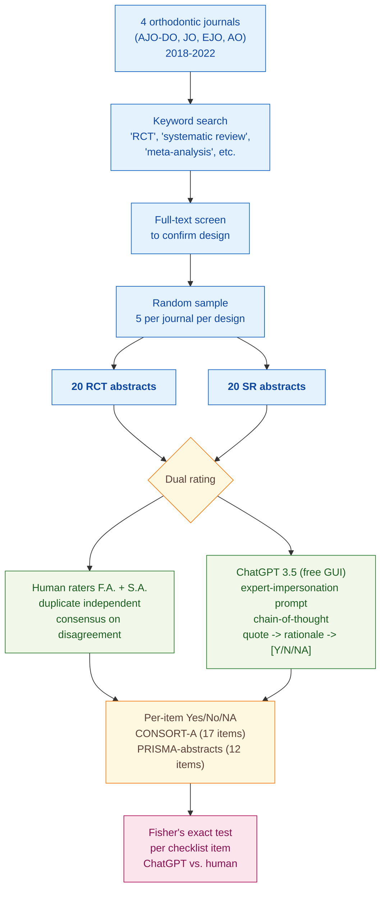

> [!success] **TL;DR**
> The paper's headline pattern, that ChatGPT matches humans on surface items but over-credits abstracts on methodological ones, is plausible and consistent with related work, but the evidence here is weak: a tiny single-specialty sample, a self-rating author panel, no agreement statistic, no multiple-comparison correction, and a non-reproducible chat-GUI pipeline. Treat this as a hypothesis-generating pilot rather than a benchmark.

## Abstract

### Question

Can ChatGPT do the job of a methodologist who checks whether a published abstract reports everything it is supposed to? The authors test this on orthodontic journal abstracts, comparing ChatGPT's checklist ratings against two human reviewers working in duplicate. The two reporting checklists they use are CONSORT-A (the 17-item Consolidated Standards of Reporting Trials extension for abstracts of randomized controlled trials) and PRISMA-for-abstracts (the 12-item Preferred Reporting Items for Systematic Reviews and Meta-Analyses for abstracts). See [[QUE - How accurately can LLMs measure reporting guideline compliance in clinical trial reports?]].

### Methods

**Design.** The authors ran a single cross-sectional observational study on orthodontic journal abstracts, scoring each abstract twice (once by humans in duplicate, once by ChatGPT) and comparing the two raters item-by-item.

**Tools.** The authors used ChatGPT 3.5 through OpenAI's free chat website (not the paid API), accessed on 30 May 2024. They scored each abstract against two reporting checklists: CONSORT-A for randomized controlled trials and PRISMA-for-abstracts for systematic reviews. They tracked ratings in an Excel spreadsheet and ran statistics in R (version 2.4.6.26) using the `gtsummary` package. They did not fine-tune the model or use any other LLM as a comparison.

**Procedure.** The authors searched four orthodontic journals for trial and review abstracts from 2018 to 2022, then drew a balanced random sample. Two authors (F.A. and S.A.) read each abstract and independently rated each checklist item as Yes, No, or Not Applicable, then resolved disagreements by discussion until they agreed. For ChatGPT, one author pasted each abstract into the chat window with a prompt that told the model to act as an expert in clinical trials or systematic reviews. The prompt asked the model to do three things for each item: pull a supporting quote, explain its reasoning, and assign a bracketed [Yes], [No], or [NA]. This is called chain-of-thought prompting, where the model is asked to think step-by-step before answering. If the model skipped items or invented content, the author re-ran the prompt up to three times. The authors then used Fisher's exact test to check whether ChatGPT and humans differed on each item by more than chance.

**Sample.** The authors searched four leading orthodontic journals (AJO-DO, JO, EJO, AO) and confirmed each candidate's design by full-text screening. They then drew a random sample of 20 RCT abstracts and 20 systematic-review abstracts (40 total), with five abstracts per journal per design. The unit of analysis is the abstract. The two human raters were the authors themselves, both from the Department of Pediatric Dentistry at Prince Sattam Bin Abdulaziz University.

**At a glance.**

---

### Findings

- **ChatGPT matched humans on the easy CONSORT items but missed the methodological ones.** ChatGPT and human raters agreed perfectly on 6 of 17 CONSORT-A items, title, author details, trial design, interventions per group, objectives, and conclusions. They diverged sharply on two items: ChatGPT said all 20 abstracts reported randomization details (humans said only 11 did, p=0.001) and all 20 reported recruitment details (humans flagged all 20 as Not Applicable, p<0.001). Across 14 of the 17 items, ChatGPT rated more abstracts as "Reported" than humans did, suggesting it tends to over-credit abstracts for items they only partially address. [[EVD - ChatGPT achieved perfect agreement with human raters on 6 of 17 CONSORT-A RCT checklist items and significant discrepancy on randomization (p=0.001) - @alharbiAutomatedAssessmentReporting2024]]

- **The same over-reporting pattern showed up on PRISMA.** ChatGPT and humans agreed perfectly on 3 of 12 PRISMA items, identifying the report as a systematic review, objectives, and interpretation. Only one item showed a significant disagreement: ChatGPT said 18 of 20 abstracts reported their eligibility criteria, while humans said only 12 did (p=0.028, unlikely to be chance). On 9 of 12 items, ChatGPT marked at least as many abstracts "Reported" as humans did. On funding, ChatGPT credited 6 of 20 abstracts versus humans' 1 of 20, a six-fold gap on a checkable factual item, though the difference fell just short of statistical significance (p=0.091). [[EVD - ChatGPT achieved perfect agreement with human raters on 3 of 12 PRISMA checklist items for systematic reviews but significant discrepancy on eligibility criteria (p=0.028) - @alharbiAutomatedAssessmentReporting2024]]

### Claim supported

These findings support two related claims: that [[CLM - LLM performance on structured checklist tasks varies substantially by item type with simpler factual items showing higher agreement than items requiring methodological judgment]], and more broadly that [[CLM - LLMs achieve moderate accuracy on structured quality appraisal tasks but cannot yet substitute for expert human judgment]]. For anyone considering ChatGPT as a screening tool: the model is reasonable for surface checks like "does the title say randomized?" but unreliable for the items that matter most in methodological appraisal, like whether randomization is actually described or whether eligibility criteria are spelled out.

### Caveats

- **Only one model and one access route were tested.** The authors used ChatGPT 3.5 through the free chat interface on a single date, with no API access, no temperature control, and no comparison to GPT-4 or other LLMs. The findings describe the behavior of one consumer product at one moment in time, not LLMs in general. [[CVT - Only a single LLM version was tested via free chat GUI rather than API limiting reproducibility and prompt control]]

- **The sample is small and narrow.** Twenty RCT abstracts and twenty systematic-review abstracts from four orthodontic journals do not give enough statistical power to detect moderate disagreements on most items, and the orthodontics-only scope limits how far the findings generalize to other medical fields. [[CVT - The small sample of 20 RCTs and 20 systematic reviews limited statistical power to detect differences in checklist item performance]]

## Quality appraisal

> [!info] Risk-of-bias and validity assessment, synthesized from this paper's discourse-graph nodes and grounded in the same paper this page's top trust-signal chips summarize. Covers *methodological quality*, the TRIPOD-LLM table below covers *reporting compliance* instead.
> <dl class="callout-legend">
> <dt>● Low risk</dt><dd>No meaningful threat to this domain identified</dd>
> <dt>◐ Some risk</dt><dd>A real but non-fatal limitation</dd>
> <dt>○ High risk</dt><dd>A significant, unaddressed threat to validity</dd>
> </dl>

| Domain | Rating | Quote |
| --- | :---: | --- |
| **Construct validity**: does the metric actually measure the construct? | 🟡 | *"Total Score = (Total 'Yes' Items/[19 - Total 'NA' Items]) × 100"* `§2.4, p.3`, a single aggregate percentage collapses 17 CONSORT (or 12 PRISMA) items of varying difficulty into one headline number, and no paired per-abstract agreement statistic (e.g., kappa) is computed alongside it |
| **Internal validity**: could the comparison be biased? | 🔴 | *"a single researcher (F.A.) formulated and submitted all prompts to language models... The two authors independently assessed the accuracy of the collected responses by directly referencing the full CONSORT guidelines"* `§2.6-2.4, p.3-4`, the same two authors serve as human raters, ChatGPT prompt operator, and result adjudicators |
| **External validity**: do findings generalize? | 🔴 | *"Twenty randomized controlled trials (RCTs) were independently evaluated by human raters and ChatGPT 3.5 using a 17-item checklist."* `§3.1, p.4`, forty abstracts from four orthodontic journals with a single free-GUI ChatGPT 3.5 snapshot |
| **Statistical conclusion validity**: appropriate uncertainty + comparisons? | 🔴 | *"the sample size, while sufficient for a preliminary investigation, may not be large enough to draw definitive conclusions. A larger sample size would provide greater statistical power"* `§4 Limitations, p.7-8`, authors themselves flag underpowering; no kappa, no confidence intervals, and no multiple-comparison correction across the 29 tested items are reported |
| **Reproducibility**: code, data, determinism? | 🔴 | *"The text from the abstracts was then pasted into ChatGPT version 3.5 on 30 May 2024."* `§2.6, p.3`, the free chat GUI exposes no temperature/top-p/seed control and the exact underlying snapshot is not fixed or disclosed |
| **Data leakage**: could models have seen this data pretraining? | 🔴 | *"ChatGPT's training data likely lack sufficient examples of high-quality, detailed reporting in orthodontic research... reporting guidelines like CONSORT and PRISMA are periodically updated, and ChatGPT's training data might not reflect the most current versions"* `Discussion, p.7` |
| **Baseline adequacy**: is there a meaningful floor to beat? | 🟡 | *"The alignment between human and ChatGPT ratings was lower for the remaining seven items, with statistically significant discrepancies identified for two items: randomization and recruitment details."* `§3.1, p.4`, the human rating serves as an implicit comparator, but no explicit naive/chance baseline (e.g., always-"Reported") is computed and reported alongside ChatGPT |
| **Train/dev/test hygiene**: are data splits kept separate? | 🔴 | Not applicable: no model training, fine-tuning, or prompt-development split is described; off-the-shelf ChatGPT 3.5 is evaluated directly on all 40 abstracts |
| **Multiple-comparisons correction**: controlled for repeated testing? | 🔴 | Not reported: Fisher's exact test is run separately on each of 29 items (17 CONSORT + 12 PRISMA) with no stated correction |
| **Human-baseline comparability**: is there a human reference point? | 🟢 | *"Two independent reviewers (F.A. and S.A.) assessed the reporting quality of RCT abstracts in duplicate using the CONSORT for the Abstract checklist."* `§2.4, p.3`, human raters directly score the same abstracts as ChatGPT and are statistically compared item-by-item |
| **Confidence Intervals**: are point estimates accompanied by an interval? | 🔴 | Not reported: Fisher's exact/chi-square tests are used per item with no accompanying interval on the agreement percentages `§3.1, p.4` |
| **Chance-Corrected Metrics**: does agreement/accuracy correct for chance? | 🔴 | Not reported: item-level agreement is assessed via Fisher's exact/chi-square tests on raw Yes/No/NA categories, not kappa or another chance-corrected statistic |
| **Non-Significant Result Spin**: are null or negative findings framed plainly? | 🟢 | *"The alignment between human and ChatGPT ratings was lower for the remaining seven items, with statistically significant discrepancies identified for two items: randomization and recruitment details."* `§3.1, p.4`; the divergence is stated plainly, not downplayed |
| **Ablation Experiment(s)**: does the paper isolate a component's contribution? | 🔴 | Not reported: only RCT-vs-systematic-review checklist comparisons and item-level accuracy are reported; no pipeline component is removed or varied and re-measured |
| **AI writing check**: does the paper's own prose read as AI-generated? | 🟡 | Independent recheck run because this source's Dataset check and Code check both returned "No repository claimed". Pangram v3.3.2 AI-text detector: *"We believe that this document is primarily human-written, with some AI-generated and AI-assisted content detected"* (13.7% AI-generated, 5.8% AI-assisted). [Dashboard](https://www.pangram.com/history/a8f06dc4-65dc-480a-b777-561dd4ebba0b) |

**Bottom line.** The paper's headline pattern, that ChatGPT matches humans on surface items but over-credits abstracts on methodological ones, is plausible and consistent with related work, but the evidence here is weak: a tiny single-specialty sample, a self-rating author panel, no agreement statistic, no multiple-comparison correction, and a non-reproducible chat-GUI pipeline. Treat this as a hypothesis-generating pilot rather than a benchmark. To be deployment-ready, future work needs paired per-abstract agreement (kappa or similar), API access with logged inference parameters, blinded external raters, and a sample large enough to support a multiple-comparison-corrected per-item analysis.

> [!tip] **Applicable external appraisal frameworks beyond TRIPOD-LLM** (already covered by the table below): **MI-CLAIM** (Norgeot et al. 2020) for clinical-AI minimum information · **MINIMAR** (Hernandez-Boussard et al. 2020) for medical-AI reporting · **PROBAST+AI** (Wolff et al. 2019 base; AI extension in development) for prediction-model risk of bias

---

## TRIPOD-LLM reporting

> [!info] Reporting compliance for this paper, mapped to the TRIPOD-LLM checklist (Title/Abstract/Introduction items 1–4, Methods items 5a–15, Results items 16a–18). TRIPOD-LLM is a clinical-ML guideline being applied here to a non-clinical AI-research-appraisal study, where an item's own wording says "healthcare context" or "care pathway," it's read as "reporting-appraisal context" / "checklist-rating workflow" instead. Item 17 (Performance) is reported per-EVD; see each EVD's `## Other Notes`.
> 

> ●Fully reported
> ◐Partial / unclear
> ○Not reported
> –Not applicable
> 

| # | Item | ✓ | Quote |
| --- | --- | :---: | --- |
| **1** | Title | ⚠️ | *"Automated Assessment of Reporting Completeness in Orthodontic Research Using LLMs: An Observational Study"* `Title` |
| **2** | Abstract | ➖ | Assessed separately under TRIPOD-LLM's own Abstract extension, not scored here |
| **3a** | Background: context + rationale | ✅ | *"LLMs can also be valuable assets in research projects, such as systematic reviews, where they can aid in tasks such as preparing Boolean search terms, screening abstracts, classifying articles, and performing content analysis"* `§1, p.2` |
| **3b** | Background: target population | ⚠️ | *"This study aims to assess the usability of LLMs, particularly ChatGPT, in assessing the completeness of reporting in two key areas of orthodontic research: abstracts of randomized controlled trials (RCTs) and abstracts of systematic reviews."* `§1, p.2` |
| **4** | Objectives | ✅ | *"a secondary objective of this investigation was to identify areas where the assessments performed by LLMs differ from those conducted by human reviewers for both RCT and systematic review abstracts."* `§1, p.2` |
| **5a** | Data sources | ✅ | *"abstracts of randomized controlled trials (RCTs) and systematic reviews published in four leading orthodontic journals: (1) American Journal of Orthodontics and Dentofacial Orthopedics (AJO-DO), (2) Journal of Orthodontics (JO), (3) European Journal of Orthodontics (EJO), and (4) The Angle Orthodontist (AO)"* `§2.1, p.2` |
| **5b** | Data points + distribution | ✅ | *"a random sample of 20 RCTs and 20 systematic reviews was selected for further analysis. This resulted in a balanced representation, with each of the four journals contributing five publications on RCTs and five publications on systematic reviews."* `§2.3, p.2` |
| **5c** | Date range of data | ⚠️ | *"The timeframe included publications published between 2018 and 2022."* `§2.1, p.2`, exact retrieval date for the source articles not given (ChatGPT inference performed 30 May 2024) |
| **5d** | Pre-processing / quality checks | ⚠️ | *"'briefing information' was provided in the form of the included systematic review or RCT abstract, manually copied from PubMed (Supplementary File S1)"* `§2.6, p.3`, no tokenization/formatting checks reported |
| **5e** | Missing / imbalanced data | ⚠️ | *"Items marked 'NA' were excluded from the analysis, and the denominator in the calculation was adjusted accordingly."* `§2.5, p.3`, class imbalance per item not addressed analytically |
| **6a** | LLM name + version | ⚠️ | *"This study utilized the large language model GPT-3.5 (OpenAI, San Francisco, CA, USA), which is currently offered at no cost."* `§2.6, p.3`, exact model snapshot/build not reported because GUI was used |
| **6b** | Development process | ➖ | Not applicable: off-the-shelf consumer ChatGPT used as-is, no model training/fine-tuning performed |
| **6c** | Inference settings / prompting | ⚠️ | *"We employed a common prompt engineering strategy known as in-context expert impersonation to enhance model performance."* `§2.6, p.3`, temperature, top_p, seed, and full system-prompt verbatim not reported (free chat GUI used) |
| **6d** | Output | ✅ | *"the model assigned a bracketed rating for each item: '[Yes]' if reported, '[No]' if not reported, or '[NA]' if not applicable owing to the study design"* `§2.7, p.3` |
| **6e** | Classification thresholds | ➖ | Not applicable: categorical Yes/No/NA output, no probability thresholding |
| **7a** | Quality metrics | ✅ | *"Comparisons were made using chi-square or Fisher's exact tests, as appropriate."* `§2.9, p.4` |
| **7b** | Relevance to downstream use | ❌ | Not reported |
| **7c** | Outcome definition | ✅ | *"Total Score = (Total 'Yes' Items/[19 - Total 'NA' Items]) × 100"* `§2.4, p.3` |
| **7d** | Subjective interpretation | ⚠️ | *"Two independent reviewers (F.A. and S.A.) assessed the reporting quality of RCT abstracts in duplicate using the CONSORT for the Abstract checklist... Disagreements were resolved through discussion until consensus was reached."* `§2.4, p.3`, raters were the paper's own authors, no quantified inter-rater agreement |
| **7e** | Comparison | ✅ | *"The alignment between human and ChatGPT ratings was lower for the remaining seven items, with statistically significant discrepancies identified for two items: randomization and recruitment details."* `§3.1, p.4` |
| **8a** | Annotation guidelines | ✅ | *"Reviewers directly referred to the full CONSORT guidelines and associated explanations for clarification."* `§2.4, p.3` |
| **8b** | Annotators + IAA | ⚠️ | *"Two independent reviewers (F.A. and S.A.) assessed the reporting quality of RCT abstracts in duplicate"* `§2.4, p.3`, no quantitative inter-annotator agreement (κ) reported |
| **8c** | Annotator background | ⚠️ | *"Fahad Alharbi * and Saeed Asiri ... Department of Pediatric Dentistry, College of Dentistry, Prince Sattam Bin Abdulaziz University"* `p.1`, orthodontic/methodological expertise level of the raters not further detailed |
| **9a** | Prompt design | ✅ | *"System prompts were initiated by introducing GPT-3.5 as an 'expert in systematic reviews' for PRISMA guidelines and an 'expert in clinical trial design' for CONSORT-A guidelines"* `§2.6, p.3` |
| **9b** | Prompt-development data | ❌ | Not reported |
| **10** | Summarization | ➖ | Not applicable: no summarization endpoint evaluated as a primary outcome |
| **11** | Instruction tuning / alignment | ➖ | Not applicable: off-the-shelf consumer ChatGPT, no fine-tuning or alignment performed |
| **12** | Compute | ❌ | Not reported |
| **13** | Ethical approval | ➖ | *"Institutional Review Board Statement: Not applicable."* `p.8` |
| **14a** | Funding | ✅ | *"This research received no external funding."* `p.8` |
| **14b** | Conflicts of interest | ✅ | *"The authors declare no conflicts of interest."* `p.8` |
| **14c** | Protocol | ❌ | Not reported |
| **14d** | Registration | ➖ | Not applicable: not a registered clinical study |
| **14e** | Data availability | ⚠️ | *"The original contributions presented in the study are included in the article/Supplementary Materials, further inquiries can be directed to the corresponding author."* `p.8`, raw ChatGPT outputs and per-rater scoring spreadsheets not deposited |
| **14f** | Code availability | ❌ | Not reported |
| **15** | Patient/public involvement | ➖ | Not applicable |
| **16a** | Flow of data | ⚠️ | *"Articles containing at least one of these keywords were retrieved for a full-text review to confirm that they truly represented a systematic review or RCT."* `§2.2, p.2`, numeric flow diagram (n at each stage) not provided |
| **16b** | Characteristics | ✅ | *"each of the four journals contributing five publications on RCTs and five publications on systematic reviews"* `§2.3, p.2` |
| **16c** | Distribution comparison | ➖ | Not applicable: no clinical-outcome subgroup comparison |
| **16d** | N per analysis | ✅ | *"Twenty randomized controlled trials (RCTs) were independently evaluated by human raters and ChatGPT 3.5 using a 17-item checklist."* `§3.1, p.4` |
| **17** | Performance | `per-EVD` | Reported per-EVD. See each EVD's `## Other Notes`. |
| **18** | LLM updating | ➖ | Not applicable: no model updating reported; single ChatGPT 3.5 snapshot used |

