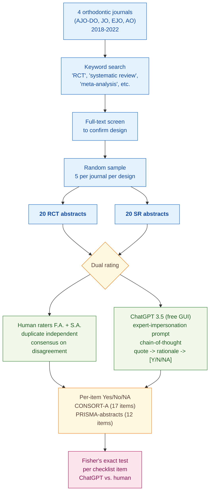

> [!success] **TL;DR**
> The paper's headline pattern — that ChatGPT matches humans on surface items but over-credits abstracts on methodological ones — is plausible and consistent with related work, but the evidence here is weak: a tiny single-specialty sample, a self-rating author panel, no agreement statistic, no multiple-comparison correction, and a non-reproducible chat-GUI pipeline. Treat this as a hypothesis-generating pilot rather than a benchmark.

## Structured abstract

> [!info] A plain-language summary built from this paper's discourse-graph nodes. Numbers and findings link back to specific EVD nodes — click any link to drill in.

### Question

Can ChatGPT do the job of a methodologist who checks whether a published abstract reports everything it is supposed to? The authors test this on orthodontic journal abstracts, comparing ChatGPT's checklist ratings against two human reviewers working in duplicate. The two reporting checklists they use are CONSORT-A (the 17-item Consolidated Standards of Reporting Trials extension for abstracts of randomized controlled trials) and PRISMA-for-abstracts (the 12-item Preferred Reporting Items for Systematic Reviews and Meta-Analyses for abstracts). See [[QUE - How accurately can LLMs measure reporting guideline compliance in clinical trial reports?]].

### Methods

**Design.** The authors ran a single cross-sectional observational study on orthodontic journal abstracts, scoring each abstract twice — once by humans in duplicate, once by ChatGPT — and comparing the two raters item-by-item.

**Tools.** The authors used **ChatGPT 3.5** through OpenAI's free chat website (not the paid API), accessed on 30 May 2024. They scored each abstract against two reporting checklists: **CONSORT-A** for randomized controlled trials and **PRISMA-for-abstracts** for systematic reviews. They tracked ratings in an Excel spreadsheet and ran statistics in **R** (version 2.4.6.26) using the `gtsummary` package. They did not fine-tune the model or use any other LLM as a comparison.

**Procedure.** The authors searched four orthodontic journals for trial and review abstracts from 2018 to 2022, then drew a balanced random sample. Two authors (F.A. and S.A.) read each abstract and independently rated each checklist item as Yes, No, or Not Applicable, then resolved disagreements by discussion until they agreed. For ChatGPT, one author pasted each abstract into the chat window with a prompt that told the model to act as an expert in clinical trials or systematic reviews. The prompt asked the model to do three things for each item: pull a supporting quote, explain its reasoning, and assign a bracketed [Yes], [No], or [NA]. This is called chain-of-thought prompting, where the model is asked to think step-by-step before answering. If the model skipped items or invented content, the author re-ran the prompt up to three times. The authors then used **Fisher's exact test** to check whether ChatGPT and humans differed on each item by more than chance.

**Sample.** The authors searched four leading orthodontic journals (AJO-DO, JO, EJO, AO) and confirmed each candidate's design by full-text screening. They then drew a random sample of **20 RCT abstracts and 20 systematic-review abstracts** (40 total), with five abstracts per journal per design. The unit of analysis is the abstract. The two human raters were the authors themselves, both from the Department of Pediatric Dentistry at Prince Sattam Bin Abdulaziz University.

### Findings

- **ChatGPT matched humans on the easy CONSORT items but missed the methodological ones.** ChatGPT and human raters agreed perfectly on 6 of 17 CONSORT-A items — title, author details, trial design, interventions per group, objectives, and conclusions. They diverged sharply on two items: ChatGPT said all 20 abstracts reported randomization details (humans said only 11 did, p=0.001) and all 20 reported recruitment details (humans flagged all 20 as Not Applicable, p<0.001). Across 14 of the 17 items, ChatGPT rated more abstracts as "Reported" than humans did, suggesting it tends to over-credit abstracts for items they only partially address. [[EVD - ChatGPT achieved perfect agreement with human raters on 6 of 17 CONSORT-A RCT checklist items and significant discrepancy on randomization (p=0.001) - @alharbiAutomatedAssessmentReporting2024]]

- **The same over-reporting pattern showed up on PRISMA.** ChatGPT and humans agreed perfectly on 3 of 12 PRISMA items — identifying the report as a systematic review, objectives, and interpretation. Only one item showed a significant disagreement: ChatGPT said 18 of 20 abstracts reported their eligibility criteria, while humans said only 12 did (p=0.028 — unlikely to be chance). On 9 of 12 items, ChatGPT marked at least as many abstracts "Reported" as humans did. On funding, ChatGPT credited 6 of 20 abstracts versus humans' 1 of 20 — a six-fold gap on a checkable factual item, though the difference fell just short of statistical significance (p=0.091). [[EVD - ChatGPT achieved perfect agreement with human raters on 3 of 12 PRISMA checklist items for systematic reviews but significant discrepancy on eligibility criteria (p=0.028) - @alharbiAutomatedAssessmentReporting2024]]

### Claim supported

These findings support two related claims: that [[CLM - LLM performance on structured checklist tasks varies substantially by item type with simpler factual items showing higher agreement than items requiring methodological judgment]], and more broadly that [[CLM - LLMs achieve moderate accuracy on structured quality appraisal tasks but cannot yet substitute for expert human judgment]]. For anyone considering ChatGPT as a screening tool: the model is reasonable for surface checks like "does the title say randomized?" but unreliable for the items that matter most in methodological appraisal, like whether randomization is actually described or whether eligibility criteria are spelled out.

### Caveats

- **Only one model and one access route were tested.** The authors used ChatGPT 3.5 through the free chat interface on a single date, with no API access, no temperature control, and no comparison to GPT-4 or other LLMs. The findings describe the behavior of one consumer product at one moment in time, not LLMs in general. [[CVT - Only a single LLM version was tested via free chat GUI rather than API limiting reproducibility and prompt control]]

- **The sample is small and narrow.** Twenty RCT abstracts and twenty systematic-review abstracts from four orthodontic journals do not give enough statistical power to detect moderate disagreements on most items, and the orthodontics-only scope limits how far the findings generalize to other medical fields. [[CVT - The small sample of 20 RCTs and 20 systematic reviews limited statistical power to detect differences in checklist item performance]]

### Methods at a glance

---

## Critical appraisal

> [!info] A risk-of-bias and validity assessment across five domains, synthesized from this paper's discourse-graph nodes. Each domain gets a rating (🟢 Low risk · 🟡 Some concerns · 🔴 High risk) plus a brief, EVD-grounded justification. The TRIPOD-LLM table below covers *reporting compliance*; this section covers *methodological quality*.

| Domain | Rating | Justification |
| --- | :---: | --- |
| **Construct validity** — does the metric actually measure the construct? | 🟡 | Per-item Fisher's exact test compares "Reported" proportions, but the deployment-relevant construct ("does ChatGPT agree with a human on this specific abstract?") would require a paired agreement statistic like Cohen's kappa. The authors do not report kappa or any per-abstract agreement metric, so two raters could disagree on every abstract individually and still produce identical marginal proportions — the test could not detect it. |
| **Internal validity** — could the comparison be biased? | 🔴 | The two human raters are also the paper's authors and the same author who ran the ChatGPT prompts. Inter-rater agreement between the two humans was not quantified — disagreements were "resolved by discussion" only. Major ChatGPT deviations triggered up to three prompt re-runs while humans got one shot, an asymmetric scoring rule that favors ChatGPT. See [[CVT - Only a single LLM version was tested via free chat GUI rather than API limiting reproducibility and prompt control]]. |
| **External validity** — do findings generalize? | 🔴 | Forty abstracts from four orthodontic journals in one five-year window — findings cannot be extended to other medical specialties, longer abstracts, or full papers. Only ChatGPT 3.5 via the free GUI was tested, so nothing here speaks to GPT-4, Claude, or any API-accessible model. See [[CVT - The small sample of 20 RCTs and 20 systematic reviews limited statistical power to detect differences in checklist item performance]]. |
| **Statistical rigor** — appropriate uncertainty + comparisons? | 🔴 | Fisher's exact test was run separately on each of 29 items (17 CONSORT + 12 PRISMA) with no multiple-comparison correction, so the "significant" findings could include false positives. With n=20 per design, power to detect meaningful disagreements on rare-reported items is very low. No confidence intervals on proportions, no kappa, and no per-abstract score comparison are reported. |
| **Reproducibility** — code, data, determinism? | 🔴 | The free ChatGPT GUI exposes no temperature, top-p, or seed control, and the exact gpt-3.5-turbo snapshot is unknown. Inference parameters are not reported, the verbatim prompt text is not included, raw model outputs and per-rater spreadsheets are not deposited, and no analysis code is shared. Independent replication of any specific number in the paper is effectively impossible. |

**Bottom line.** The paper's headline pattern — that ChatGPT matches humans on surface items but over-credits abstracts on methodological ones — is plausible and consistent with related work, but the evidence here is weak: a tiny single-specialty sample, a self-rating author panel, no agreement statistic, no multiple-comparison correction, and a non-reproducible chat-GUI pipeline. Treat this as a hypothesis-generating pilot rather than a benchmark. To be deployment-ready, future work needs paired per-abstract agreement (kappa or similar), API access with logged inference parameters, blinded external raters, and a sample large enough to support a multiple-comparison-corrected per-item analysis.

> [!tip] **Applicable external appraisal frameworks beyond TRIPOD-LLM** (already covered by the table below): **MI-CLAIM** (Norgeot et al. 2020) for clinical-AI minimum information · **MINIMAR** (Hernandez-Boussard et al. 2020) for medical-AI reporting · **PROBAST+AI** (Wolff et al. 2019 base; AI extension in development) for prediction-model risk of bias

---

## TRIPOD-LLM reporting summary

> [!info] Reporting compliance for this paper, mapped to the TRIPOD-LLM checklist (Methods items 5a–15 and Results items 16a–18). Compliance icons: ✅ fully reported · ⚠️ partially reported / unclear · ❌ should be reported but not reported · ➖ not applicable to this study. Item 17 (Performance) is reported per-EVD; see each EVD's `## Other Notes`.

| # | Item | ✓ | Reported in this study |
| --- | --- | :---: | --- |
| **5a** | Data sources | ✅ | Abstracts of RCTs and systematic reviews from four leading orthodontic journals: AJO-DO, Journal of Orthodontics, European Journal of Orthodontics, The Angle Orthodontist. Articles retrieved from PubMed and full-text screened to confirm design. |
| **5b** | Data points + distribution | ✅ | 20 RCT abstracts + 20 systematic-review abstracts (40 total), balanced 5 per journal per design. |
| **5c** | Date range of data | ⚠️ | Publication window 2018–2022 reported; exact retrieval date for the source articles is not given (ChatGPT inference performed 30 May 2024). |
| **5d** | Pre-processing / quality checks | ⚠️ | Abstracts manually copied from PubMed into ChatGPT (Supplementary File S1 lists included articles). No tokenization / formatting checks reported. |
| **5e** | Missing / imbalanced data | ⚠️ | NA category handled by adjusting denominator (formulas given for both checklists). Class imbalance per item not addressed analytically. |
| **6a** | LLM name + version | ⚠️ | ChatGPT 3.5 (OpenAI, San Francisco, CA, USA), free chat interface, accessed 30 May 2024. Exact model snapshot / build (e.g., gpt-3.5-turbo-XXXX) not reported because GUI was used. |
| **6b** | Development process | ➖ | No model training/fine-tuning; off-the-shelf consumer ChatGPT used as-is. |
| **6c** | Inference settings / prompting | ⚠️ | In-context expert impersonation + chain-of-thought described qualitatively; temperature, top_p, seed, system prompt verbatim, and other inference parameters not reported (free chat GUI used). |
| **6d** | Output | ✅ | Three-step output per item: extracted quote → rationale → bracketed [Yes] / [No] / [NA] rating. |
| **6e** | Classification thresholds | ➖ | Not applicable — categorical Yes/No/NA output, no probability thresholds. |
| **7a** | Quality metrics | ⚠️ | Per-item proportion "Reported" + Fisher's exact / chi-square p-value. No accuracy, F1, kappa, or Cohen's-style agreement metric reported between ChatGPT and humans. |
| **7b** | Relevance to downstream | ⚠️ | Authors discuss implications for automated literature appraisal but do not formally evaluate downstream utility (time saved, screening yield). |
| **7c** | Outcome definition | ✅ | Outcome = whether each CONSORT-A / PRISMA-for-abstracts item is reported in the abstract; per-abstract total score = (Yes / [denominator − NA]) × 100. |
| **7d** | Subjective interpretation | ⚠️ | Two human raters used as gold standard; raters were the authors themselves (potential bias) and inter-rater agreement was not quantified — only "disagreements resolved through discussion until consensus was reached." |
| **7e** | Comparison | ⚠️ | Comparison is ChatGPT vs. human consensus only; no baseline NLP model, no GPT-4, no other LLM. |
| **8a** | Annotation guidelines | ✅ | Reviewers used the full CONSORT and PRISMA guidelines and associated explanations as the annotation reference. |
| **8b** | Annotators + IAA | ⚠️ | Two annotators (F.A. and S.A.) in duplicate; disagreements resolved by consensus. No κ / agreement statistic reported. |
| **8c** | Annotator background | ⚠️ | Both annotators are authors from Department of Pediatric Dentistry, Prince Sattam Bin Abdulaziz University; orthodontic / methodological expertise level not detailed. |
| **9a** | Prompt design | ⚠️ | Strategy described (in-context expert impersonation + chain-of-thought + 3-step output template); full verbatim prompt text not included. |
| **9b** | Prompt-development data | ❌ | No held-out prompt-development set described; prompt structure adopted from cited prior work [33,34]. |
| **10** | Summarization | ➖ | Not applicable (rating task, not summarization). |
| **11** | Instruction tuning / alignment | ➖ | Not applicable — off-the-shelf consumer ChatGPT, no fine-tuning. |
| **12** | Compute | ❌ | Not reported (free ChatGPT GUI). |
| **13** | Ethical approval | ➖ | Authors state "Institutional Review Board Statement: Not applicable" — analysis on published abstracts only. |
| **14a** | Funding | ✅ | "This research received no external funding." |
| **14b** | Conflicts of interest | ✅ | "The authors declare no conflicts of interest." |
| **14c** | Protocol | ❌ | No protocol referenced. |
| **14d** | Registration | ➖ | Not applicable (not a clinical study). |
| **14e** | Data availability | ⚠️ | Supplementary File S1 lists the included RCTs and systematic reviews; raw ChatGPT outputs and per-rater scoring spreadsheets not deposited. |
| **14f** | Code availability | ❌ | No code repository released; analysis used Excel + R `gtsummary`, scripts not shared. |
| **15** | Patient/public involvement | ➖ | Not applicable. |
| **16a** | Flow of data | ⚠️ | Search → keyword screen → full-text confirmation → random sample of 20 per design described in prose; numeric flow diagram (n at each stage) not provided. |
| **16b** | Characteristics | ⚠️ | Source-journal balance reported (5 per journal × 4 journals × 2 designs); no abstract-level characteristics (word count, year distribution within window, topic) tabulated. |
| **16c** | Distribution comparison | ➖ | Not applicable (no clinical-outcome subgroups). |
| **16d** | N per analysis | ✅ | N = 20 RCT abstracts per CONSORT-A item (40 total ratings: 20 ChatGPT + 20 human); N = 20 SR abstracts per PRISMA item (40 ratings). Reported in Tables 1–2 column headers. |
| **17** | Performance | (per-EVD) | Reported per-EVD. See each EVD's `## Other Notes`. |
| **18** | LLM updating | ➖ | Not applicable (no model updating reported; single ChatGPT 3.5 snapshot used). |

