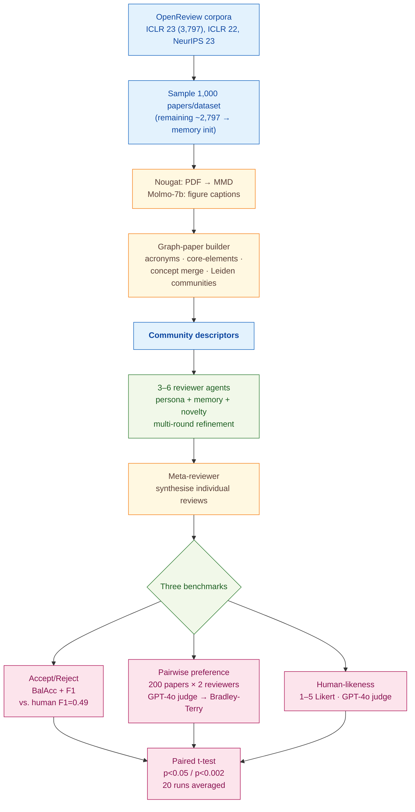

> [!success] **TL;DR**
> GAR is the strongest reviewer-agent benchmark to date and convincingly outperforms prior LLM reviewer systems on three independent tasks. But the two largest claims — beating humans on accept/reject prediction and on review preference — rest on a same-family LLM judge and on test conferences likely seen in pretraining; either could account for a meaningful share of the gap.

## Structured abstract

> [!info] A plain-language summary built from this paper's discourse-graph nodes. Numbers and findings link back to specific EVD nodes — click any link to drill in.

### Question

Can an LLM-powered review agent — built with memory, persona, and novelty modules — write peer reviews that are as good as, or better than, the ones humans write at top machine-learning conferences? The authors introduce GAR (Generative Adversarial Reviews), a multi-module agent built on top of GPT-4o-mini (a smaller, cheaper version of OpenAI's GPT-4o model), and pit it against four prior LLM reviewer systems plus the original human reviewers from OpenReview. They benchmark across three tasks: predicting accept or reject decisions, head-to-head review preferences, and how human-like each review reads. See [[QUE - Can LLM-based agents simulate high-quality peer review comparable to human expert reviewers?]].

### Methods

**Design.** The authors run a three-task benchmark on three OpenReview corpora: a binary accept-or-reject classification benchmark, a pairwise preference contest scored by a Bradley-Terry ranking model, and an LLM-as-a-judge human-likeness rating on a 5-point scale. All three tasks compare the same six reviewer systems on the same papers.

**Tools.** GAR is the new system: it builds a graph representation of each paper, then runs four modules (profile, memory, novelty, review) plus a meta-reviewer that synthesizes individual reviews into a final decision. The reviewer agents run on GPT-4o-mini in the main experiment; ablations swap in GPT-4o, Mistral-7b Instruct, and Llama-3.1 (8b and 70b). Baselines are four published LLM reviewer systems — AI-Scientist, OpenReviewer, ReviewerGPT, and AI-Review. The judge is GPT-4o for the automated experiments; five human experts replicate the preference task. Auxiliary tools: Nougat (PDF-to-Markdown extraction) and Molmo-7b (figure captioning).

**Procedure.** For each paper, Nougat pulls the text and Molmo captions the figures. The graph builder runs acronym extraction, then concept merging, then Leiden community detection (a graph-clustering algorithm), then writes a short descriptor of each community. Three to six reviewer agents — each given a different persona derived from historical OpenReview data — read the descriptors, draft a review, then refine it across multiple rounds using retrieved memory. The meta-reviewer combines the individual reviews into one accept/reject label. For preference scoring, the authors randomly pair two of the six reviewer types per paper and ask GPT-4o to pick its preferred review; they fit a Bradley-Terry model (a standard ranking method that turns pairwise wins into a single coefficient per competitor) anchored at zero for ReviewerGPT. Significance is tested with paired t-tests at p<0.05 or p<0.002, and every result is averaged over 20 independent runs.

**Sample.** The authors start with the ICLR 2023 OpenReview dataset of 3,797 papers, each with at least 3 reviews. They sample 1,000 papers per dataset as the evaluation set across three corpora — ICLR 2023, ICLR 2022, and NeurIPS 2023 — for a total of 3,000 evaluation papers. The remaining ~2,797 ICLR 23 reviews bootstrap the memory module. The preference task uses a smaller subset of 200 papers with two reviewer types randomly assigned per paper. Five expert human evaluators replicate the preference task; their backgrounds and recruitment are not described.

### Findings

- **GAR beats human reviewers on accept/reject prediction.** GAR scored F1 = 0.66 on ICLR 2023 (F1 runs from 0 to 1; higher is better; it balances precision and recall). The human reviewer baseline from the NeurIPS 2023 consistency study was F1 = 0.49. The threshold-based variant GAR^> climbed to F1 = 0.69 on ICLR 23. The next-best LLM baseline (AI-Scientist) reached only 0.54. GAR's lead over the human baseline held at p<0.002 across all three datasets. [[EVD - GAR achieved F1 score of 0.66 on ICLR 23 paper acceptance prediction significantly exceeding human baseline of 0.49 - @bougieGenerativeAdversarialReviews2024a]]

- **GAR also wins the head-to-head preference contest.** GPT-4o, acting as judge, picked GAR's review over the alternative more often than any other reviewer — yielding a Bradley-Terry coefficient of 0.684, ahead of human reviewers at 0.523. GAR won 56% of direct matchups against humans, 80% against OpenReviewer, and 77% against AI-Review. When five human experts replaced GPT-4o as judge, the GAR > Human ordering held (0.143 vs 0.112), though the absolute scores compress. [[EVD - GAR achieved a Bradley-Terry preference score of 0.684 outperforming human reviewers at 0.523 in GPT-4 preference evaluation - @bougieGenerativeAdversarialReviews2024a]]

- **GAR reviews read as the most human-like.** On a 1-to-5 Likert scale where 5 means "reads like a human reviewer", GAR scored 3.89 to 4.02 across the three datasets — significantly higher than every LLM baseline at p<0.05. AI-Scientist sat near 3.4, ReviewerGPT and AI-Review near 3.3, and OpenReviewer trailed at 2.4. Swapping GAR's backbone to the larger GPT-4o pushed the score to 4.11 on ICLR 23; open-weight backbones (Llama-3.1, Mistral) landed in the 3.6 range. [[EVD - GAR achieved a human-likeness score of 3.89 to 4.02 across three datasets significantly outperforming all LLM baselines - @bougieGenerativeAdversarialReviews2024a]]

### Claim supported

These findings collectively support [[CLM - LLM-based peer review agents equipped with memory and persona modules can match or exceed human reviewer quality in providing feedback and predicting paper acceptance]]. For someone considering using GAR in practice, the takeaway is cautious: GAR is the strongest reviewer-agent benchmark to date, but the headline numbers depend on a same-family LLM acting as judge, and the evaluation conferences likely overlap with the underlying model's pretraining data. The authors themselves frame GAR as augmentation, not replacement, of human reviewers.

### Caveats

- **Test papers may live inside the LLM's training data.** ICLR 2022 and 2023 papers are widely circulated preprints that almost certainly appeared in GPT-4o's pretraining corpus. The model may be recognizing rather than reviewing — inflating accept/reject F1 and human-likeness scores. [[CVT - Evaluated papers may have been present in LLM training data introducing potential contamination bias in GAR performance estimates]]

- **The judge and the contestant are the same model family.** GAR's reviewer agents run on GPT-4o-mini and the automated evaluator is GPT-4o. LLM judges tend to favor outputs that match their own style, so GAR's Bradley-Terry lead and human-likeness lead may partly reflect in-family preference bias rather than genuine quality. The five-human replication mitigates this for the preference task only. [[CVT - GPT-4 was used as both reviewer backbone and preference evaluator introducing circular evaluation in the GAR preference ranking experiment]]

### Methods at a glance

---

## Quality appraisal

> [!info] Risk-of-bias and validity assessment, synthesized from this paper's discourse-graph nodes and grounded in the same paper this page's top trust-signal chips summarize. Covers *methodological quality* — the TRIPOD-LLM table below covers *reporting compliance* instead.
> <dl class="callout-legend">
> <dt>● Low risk</dt><dd>No meaningful threat to this domain identified</dd>
> <dt>◐ Some risk</dt><dd>A real but non-fatal limitation</dd>
> <dt>○ High risk</dt><dd>A significant, unaddressed threat to validity</dd>
> </dl>

| Domain | Rating | Quote |
| --- | :---: | --- |
| **Construct validity**: does the metric actually measure the construct? | 🟡 | *"This f1 score is significantly higher than the 0.49 achieved by human reviewers in the NeurIPS 2023 consistency study"* `§5.3, p.10`, the ground-truth accept/reject labels themselves are known to be noisy, so beating a 0.49 human F1 is not the same as writing a *useful* review |
| **Internal validity**: could the comparison be biased? | 🔴 | *"we use GPT-4o to evaluate the generated reviews"* `§5.1, p.9`, combined with *"All agents are powered by the GPT-4o-mini version of ChatGPT"* `§5, p.9` — the reviewer backbone and the automated preference judge are the same model family |
| **External validity**: do findings generalize? | 🟡 | *"we also conducted experiments on the ICLR 2022, and NeurIPS 2023 Beygelzimer et al. (2021) datasets"* `§5, p.9`, all three evaluation corpora are top-tier English-language ML conferences, narrowing generalization to other fields or venues |
| **Statistical Conclusion Validity**: appropriate uncertainty + comparisons? | 🟡 | *"all results reported are averaged over 20 independent runs"* `§5, p.9`, repeated-run averaging and paired t-tests are used, but no multiple-comparison correction across the seven systems × three datasets × multiple metrics is reported |
| **Reproducibility**: code, data, determinism? | 🔴 | *"The prompts and other implementation details can be found in the Appendix."* `§5, p.9`, no code repository link, curated evaluation subsets, or decoding parameters (temperature/top_p/seed) are given in the cached preprint text |
| **Data leakage**: could models have seen this data pretraining? | 🔴 | *"Are we certain that these papers are not already part of the LLMs' training corpus? If such overlap exists, it could inadvertently introduce bias, as the model may demonstrate familiarity with the content, concepts, or style of certain papers"* `Ethics/Limitations, p.19` |
| **Baseline adequacy**: is there a meaningful floor to beat? | 🟢 | *"Random Decision 0.50 0.33 ... Always Reject 0.50 0.00"* `Table 3, p.11`, explicit random-decision and always-reject floors are reported alongside GAR and all LLM baselines |
| **Train/dev/test hygiene**: are data splits kept separate? | 🟡 | *"we compared its decisions against a ground truth dataset comprised of 1,000 papers from the NeurIPS 23, ICLR 22, and ICLR 23 submissions. The remaining reviews (e.g., 2,797 for ICLR 23) in each dataset were utilized to initialize the memory module."* `§5.3, p.10`, evaluation papers are kept separate from memory-initialization reviews, but no held-out split isolates prompt-tuning from evaluation |
| **Multiple-comparisons correction**: controlled for repeated testing? | 🔴 | Not reported — seven reviewer systems are compared across three datasets and multiple metrics with no stated correction |
| **Human-baseline comparability**: is there a human reference point? | 🟢 | *"This f1 score is significantly higher than the 0.49 achieved by human reviewers in the NeurIPS 2023 consistency study"* `§5.3, p.10`, human reviewers appear as a directly scored comparator on both the accept/reject and preference tasks |
| **Confidence Intervals**: are point estimates accompanied by an interval? | 🔴 | Not reported — Balanced Accuracy and F1 are reported as point estimates only, with no interval `Table 3, p.9` |
| **Chance-Corrected Metrics**: does agreement/accuracy correct for chance? | 🔴 | Not reported — Balanced Accuracy and F1 are reported against a "Random Decision" baseline row for context, but no chance-corrected statistic (e.g. kappa/MCC) is computed `Table 3, p.9` |
| **Non-Significant Result Spin**: are null or negative findings framed plainly? | 🔴 | Not applicable — no null/negative finding about the paper's own proposed method (GAR) requires spinning; baseline weaknesses are stated plainly as a point of comparison, not something GAR itself needs to explain away |
| **Ablation Experiment(s)**: does the paper isolate a component's contribution? | 🟢 | *"Table 4: Ablation study of GAR on three datasets... Line 6 highlights the performance without memory module."* `p.12` — a "GAR (w/o memory)" condition is directly compared against full GAR |

**Bottom line.** GAR is the strongest reviewer-agent benchmark to date and convincingly outperforms prior LLM reviewer systems on three independent tasks. But the two largest claims — beating humans on accept/reject prediction and on review preference — rest on a same-family LLM judge and on test conferences likely seen in pretraining; either could account for a meaningful share of the gap. Before treating GAR as deployment-ready, future work needs: a held-out test set published *after* the model snapshot date, an out-of-family judge (or all-human judging), released code and prompts, and a downstream utility study (do real authors find GAR's feedback useful and accurate?).

> [!tip] **Applicable external appraisal frameworks beyond TRIPOD-LLM** (already covered by the table below): **HELM** (Liang et al. 2022) for holistic LLM-evaluation principles · **Datasheets for Datasets** (Gebru et al. 2021) for the evaluation corpus · **Model Cards** (Mitchell et al. 2019) for the LLMs being evaluated

---

## TRIPOD-LLM reporting summary

> [!info] Reporting compliance for this paper, mapped to the TRIPOD-LLM checklist (Title/Abstract/Introduction items 1–4, Methods items 5a–15, Results items 16a–18). TRIPOD-LLM is a clinical-ML guideline being applied here to a non-clinical AI-research benchmark — where an item's own wording says "healthcare context" or "care pathway," it's read as "research-evaluation context" / "research workflow" instead. Item 17 (Performance) is reported per-EVD; see each EVD's `## Other Notes`.
> 

> ●Fully reported
> ◐Partial / unclear
> ○Not reported
> –Not applicable
> 

| # | Item | ✓ | Quote |
| --- | --- | :---: | --- |
| **1** | Title | ⚠️ | *"GENERATIVE ADVERSARIAL REVIEWS: WHEN LLMS BECOME THE CRITIC"* `Title, p.1` |
| **2** | Abstract | ➖ | Assessed separately under TRIPOD-LLM's own Abstract extension, not scored here |
| **3a** | Background — context + rationale | ✅ | *"The peer review process is fundamental to scientific progress, determining which papers meet the quality standards for publication. Yet, the rapid growth of scholarly production and increasing specialization in knowledge areas strain traditional scientific feedback mechanisms."* `Abstract, p.1` |
| **3b** | Background — target population | ⚠️ | *"GAR is designed to address two key challenges in the peer review process: (1) providing researchers with early-stage, high-quality feedback across several aspects, such as novelty, significance, technical soundness, and clarity, and (2) predicting acceptance likelihood at major conferences."* `§1, p.2` |
| **4** | Objectives | ✅ | *"We present Generative Agent Reviewers (GAR), a novel framework that simulates peer reviewers through LLM-based agents."* `§1, p.2` |
| **5a** | Data sources | ✅ | *"We primary conduct the experiments on the ICLR 2023 dataset, which consists of 3,797 papers obtained from Openreview. ... we also conducted experiments on the ICLR 2022, and NeurIPS 2023 Beygelzimer et al. (2021) datasets."* `§5, p.9` |
| **5b** | Data points + distribution | ⚠️ | *"which consists of 3,797 papers obtained from Openreview. Each paper was retrieved by at least three reviewers."* `§5, p.9` — NeurIPS 23 and ICLR 22 dataset sizes and accept/reject base rates not stated |
| **5c** | Date range of data | ❌ | Not reported — OpenReview snapshot date and GPT-4o/GPT-4o-mini training cutoffs not disclosed |
| **5d** | Pre-processing / quality checks | ✅ | *"we utilize Nougat Blecher et al. (2023) to extract the Markdown (MMD) version of each manuscript, maintaining structural and formatting fidelity."* `§5, p.9` |
| **5e** | Missing / imbalanced data | ❌ | Not reported — conference accept/reject class imbalance is not characterized or addressed anywhere in the text |
| **6a** | LLM name + version | ✅ | *"All agents are powered by the GPT-4o-mini version of ChatGPT OpenAI et al. (2024). In some experiments, we also use ... GPT-4o OpenAI et al. (2024) and Llama-3.1 (8b and 70b) Grattafiori et al. (2024)."* `§5, p.9` |
| **6b** | Development process | ✅ | *"Each agent is initialized using real-world datasets and equipped with four core modules: profile, memory, novelty, and review modules."* `§1, p.2` |
| **6c** | Inference settings / prompting | ⚠️ | *"The prompts and other implementation details can be found in the Appendix."* `§5, p.9` — decoding parameters (temperature/top_p/seed) and full prompt text not in the main body (appendix not present in the cached preprint) |
| **6d** | Output | ✅ | *"a reviewer r ∈ R, let yrp = 1 denote that reviewer r has reviewer the paper p, and subsequently assigned a score srp with srp ∈ {1, 2, 3, 4, 5, 6, 7, 8, 9, 10}."* `§3, p.4` |
| **6e** | Classification thresholds | ✅ | *"we set the decision threshold at a score of 6, aligned with the 'Weak Accept' category from ICLR's review standards, and compare this threshold-based reviewers with vanilla GAR."* `§5.3, p.12` |
| **7a** | Quality metrics | ✅ | *"Table 3 summarizes the performance metrics. Our method outperforms previous state-of-the-art methods, including AI-Scientist (0.54) with an average f1 score of 0.66."* `§5.3, p.11` |
| **7b** | Relevance to downstream use | ⚠️ | *"By offering early expert-level feedback, typically restricted to a limited group of researchers, GAR democratizes access to transparent and in-depth evaluation."* `Abstract, p.1` — no formal utility, cost, or time-saving analysis |
| **7c** | Outcome definition | ✅ | *"The final acceptance decision consists of the last review produced at the last round, choosing from the following options: ACCEPT (ORAL), ACCEPT (POSTER), or REJECT."* `§3.4, p.8` |
| **7d** | Subjective interpretation | ⚠️ | *"five expert evaluators were given 200 papers, each with two anonymous reviews."* `§5.1, p.9` — no inter-annotator agreement statistic reported |
| **7e** | Comparison | ✅ | *"Human*, Random Decision, Always Reject, AI-Scientist, OpenReviewer, ReviewerGPT, AI-Review, GAR, GAR>"* `Table 3, p.12` |
| **8a** | Annotation guidelines | ⚠️ | *"Human annotation was performed a randomly sampled subset of feedback, following established research in machine learning peer review Birhane et al. (2022); Smith et al. (2022)."* `§5.10, p.16` — rubric/guideline text not reproduced |
| **8b** | Annotators + IAA | ⚠️ | *"five expert evaluators were given 200 papers, each with two anonymous reviews."* `§5.1, p.9` — no IAA/kappa reported |
| **8c** | Annotator background | ❌ | Not reported — "five expert evaluators" / "human annotators" backgrounds and recruitment are not described |
| **9a** | Prompt design | ⚠️ | *"An example prompt block is provided below:"* `§3.3, p.8` — a single example block is shown; full prompt text deferred to an appendix not present in the cached preprint |
| **9b** | Prompt-development data | ❌ | Not reported |
| **10** | Summarization | ✅ | *"the score, accompanied by a summary of supporting arguments, is formatted into plain text and passed on to subsequent review stages."* `§3.4, p.8` |
| **11** | Instruction tuning / alignment | ➖ | *"In this work, we use pre-trained LLMs without further finetuning them."* `§3, p.4` |
| **12** | Compute | ⚠️ | *"For each experimental run with Llama-3.1 (8b), we utilize a single NVIDIA A100 40G GPU. Each run on Llama-3.1 (8b) takes approximately 20 minutes, and all results reported are averaged over 20 independent runs"* `§5, p.9` — GPT-4o/GPT-4o-mini API token/dollar cost not reported |
| **13** | Ethical approval | ➖ | Not applicable — analysis of published/preprint manuscripts, no human-subject clinical data |
| **14a** | Funding | ❌ | Not reported |
| **14b** | Conflicts of interest | ❌ | Not reported |
| **14c** | Protocol | ❌ | Not reported |
| **14d** | Registration | ➖ | Not applicable — not a registered clinical study |
| **14e** | Data availability | ❌ | Not reported — no data-release statement or repository link in the cached preprint |
| **14f** | Code availability | ❌ | Not reported — no code repository link in the cached preprint |
| **15** | Patient/public involvement | ➖ | Not applicable |
| **16a** | Flow of data | ⚠️ | *"the remaining reviews (e.g., 2,797 for ICLR 23) in each dataset were utilized to initialize the memory module."* `§5.3, p.11` — sampling rule for the 1,000-paper evaluation subset not stated |
| **16b** | Characteristics | ⚠️ | *"Each paper was retrieved by at least three reviewers."* `§5, p.9` — topic distribution, length, and modality breakdown not reported |
| **16c** | Distribution comparison | ➖ | Not applicable — no clinical-subgroup analysis |
| **16d** | N per analysis | ✅ | *"five expert evaluators were given 200 papers, each with two anonymous reviews."* `§5.1, p.9` |
| **17** | Performance | `per-EVD` | Reported per-EVD. See each EVD's `## Other Notes`. |
| **18** | LLM updating | ➖ | Not applicable — no online learning or model updating reported; future work mentions a "closed-loop, self-improving system" but it is not implemented |
