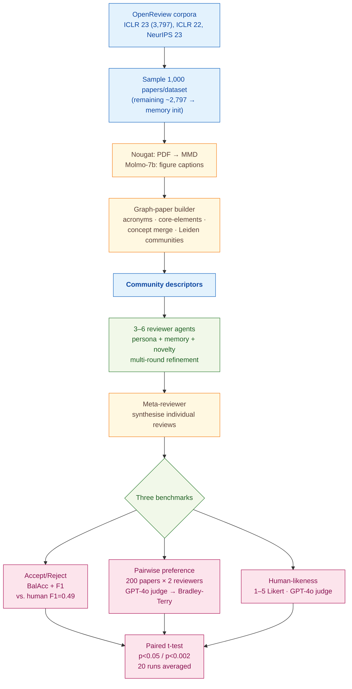

> [!success] **TL;DR**
> GAR is the strongest reviewer-agent benchmark to date and convincingly outperforms prior LLM reviewer systems on three independent tasks. But the two largest claims — beating humans on accept/reject prediction and on review preference — rest on a same-family LLM judge and on test conferences likely seen in pretraining; either could account for a meaningful share of the gap.

## Structured abstract

> [!info] A plain-language summary built from this paper's discourse-graph nodes. Numbers and findings link back to specific EVD nodes — click any link to drill in.

### Question

Can an LLM-powered review agent — built with memory, persona, and novelty modules — write peer reviews that are as good as, or better than, the ones humans write at top machine-learning conferences? The authors introduce **GAR** (Generative Adversarial Reviews), a multi-module agent built on top of **GPT-4o-mini** (a smaller, cheaper version of OpenAI's GPT-4o model), and pit it against four prior LLM reviewer systems plus the original human reviewers from OpenReview. They benchmark across three tasks: predicting accept or reject decisions, head-to-head review preferences, and how human-like each review reads. See [[QUE - Can LLM-based agents simulate high-quality peer review comparable to human expert reviewers?]].

### Methods

**Design.** The authors run a three-task benchmark on three OpenReview corpora: a binary accept-or-reject classification benchmark, a pairwise preference contest scored by a Bradley-Terry ranking model, and an LLM-as-a-judge human-likeness rating on a 5-point scale. All three tasks compare the same six reviewer systems on the same papers.

**Tools.** **GAR** is the new system: it builds a graph representation of each paper, then runs four modules (profile, memory, novelty, review) plus a meta-reviewer that synthesizes individual reviews into a final decision. The reviewer agents run on **GPT-4o-mini** in the main experiment; ablations swap in GPT-4o, Mistral-7b Instruct, and Llama-3.1 (8b and 70b). Baselines are four published LLM reviewer systems — **AI-Scientist**, **OpenReviewer**, **ReviewerGPT**, and **AI-Review**. The judge is **GPT-4o** for the automated experiments; five human experts replicate the preference task. Auxiliary tools: **Nougat** (PDF-to-Markdown extraction) and **Molmo-7b** (figure captioning).

**Procedure.** For each paper, Nougat pulls the text and Molmo captions the figures. The graph builder runs acronym extraction, then concept merging, then **Leiden community detection** (a graph-clustering algorithm), then writes a short descriptor of each community. Three to six reviewer agents — each given a different persona derived from historical OpenReview data — read the descriptors, draft a review, then refine it across multiple rounds using retrieved memory. The meta-reviewer combines the individual reviews into one accept/reject label. For preference scoring, the authors randomly pair two of the six reviewer types per paper and ask GPT-4o to pick its preferred review; they fit a **Bradley-Terry model** (a standard ranking method that turns pairwise wins into a single coefficient per competitor) anchored at zero for ReviewerGPT. Significance is tested with paired t-tests at p<0.05 or p<0.002, and every result is averaged over 20 independent runs.

**Sample.** The authors start with the **ICLR 2023** OpenReview dataset of **3,797 papers**, each with at least 3 reviews. They sample **1,000 papers per dataset** as the evaluation set across three corpora — ICLR 2023, ICLR 2022, and NeurIPS 2023 — for a total of 3,000 evaluation papers. The remaining ~2,797 ICLR 23 reviews bootstrap the memory module. The preference task uses a smaller subset of **200 papers** with two reviewer types randomly assigned per paper. Five expert human evaluators replicate the preference task; their backgrounds and recruitment are not described.

### Findings

- **GAR beats human reviewers on accept/reject prediction.** GAR scored **F1 = 0.66** on ICLR 2023 (F1 runs from 0 to 1; higher is better; it balances precision and recall). The human reviewer baseline from the NeurIPS 2023 consistency study was **F1 = 0.49**. The threshold-based variant **GAR^>** climbed to F1 = 0.69 on ICLR 23. The next-best LLM baseline (AI-Scientist) reached only 0.54. GAR's lead over the human baseline held at p<0.002 across all three datasets. [[EVD - GAR achieved F1 score of 0.66 on ICLR 23 paper acceptance prediction significantly exceeding human baseline of 0.49 - @bougieGenerativeAdversarialReviews2024a]]

- **GAR also wins the head-to-head preference contest.** GPT-4o, acting as judge, picked GAR's review over the alternative more often than any other reviewer — yielding a Bradley-Terry coefficient of **0.684**, ahead of human reviewers at **0.523**. GAR won 56% of direct matchups against humans, 80% against OpenReviewer, and 77% against AI-Review. When five human experts replaced GPT-4o as judge, the GAR > Human ordering held (0.143 vs 0.112), though the absolute scores compress. [[EVD - GAR achieved a Bradley-Terry preference score of 0.684 outperforming human reviewers at 0.523 in GPT-4 preference evaluation - @bougieGenerativeAdversarialReviews2024a]]

- **GAR reviews read as the most human-like.** On a 1-to-5 Likert scale where 5 means "reads like a human reviewer", GAR scored **3.89 to 4.02** across the three datasets — significantly higher than every LLM baseline at p<0.05. AI-Scientist sat near 3.4, ReviewerGPT and AI-Review near 3.3, and OpenReviewer trailed at 2.4. Swapping GAR's backbone to the larger GPT-4o pushed the score to 4.11 on ICLR 23; open-weight backbones (Llama-3.1, Mistral) landed in the 3.6 range. [[EVD - GAR achieved a human-likeness score of 3.89 to 4.02 across three datasets significantly outperforming all LLM baselines - @bougieGenerativeAdversarialReviews2024a]]

### Claim supported

These findings collectively support [[CLM - LLM-based peer review agents equipped with memory and persona modules can match or exceed human reviewer quality in providing feedback and predicting paper acceptance]]. For someone considering using GAR in practice, the takeaway is cautious: GAR is the strongest reviewer-agent benchmark to date, but the headline numbers depend on a same-family LLM acting as judge, and the evaluation conferences likely overlap with the underlying model's pretraining data. The authors themselves frame GAR as augmentation, not replacement, of human reviewers.

### Caveats

- **Test papers may live inside the LLM's training data.** ICLR 2022 and 2023 papers are widely circulated preprints that almost certainly appeared in GPT-4o's pretraining corpus. The model may be recognizing rather than reviewing — inflating accept/reject F1 and human-likeness scores. [[CVT - Evaluated papers may have been present in LLM training data introducing potential contamination bias in GAR performance estimates]]

- **The judge and the contestant are the same model family.** GAR's reviewer agents run on GPT-4o-mini and the automated evaluator is GPT-4o. LLM judges tend to favor outputs that match their own style, so GAR's Bradley-Terry lead and human-likeness lead may partly reflect in-family preference bias rather than genuine quality. The five-human replication mitigates this for the preference task only. [[CVT - GPT-4 was used as both reviewer backbone and preference evaluator introducing circular evaluation in the GAR preference ranking experiment]]

### Methods at a glance

---

## Critical appraisal

> [!info] A risk-of-bias and validity assessment across five domains, synthesized from this paper's discourse-graph nodes. Each domain gets a rating (🟢 Low risk · 🟡 Some concerns · 🔴 High risk) plus a brief, EVD-grounded justification. The TRIPOD-LLM table below covers *reporting compliance*; this section covers *methodological quality*.

| Domain | Rating | Justification |
| --- | :---: | --- |
| **Construct validity** — does the metric actually measure the construct? | 🟡 | The accept/reject F1 task uses official conference decisions as ground truth, but those decisions are themselves noisy (the NeurIPS 2023 consistency study put the human reviewer F1 at 0.49). Beating 0.49 is a meaningful headline, but it isn't the same as "writes a useful review." Human-likeness on a 5-point Likert tracks surface style rather than review *correctness* or *usefulness*. The Bradley-Terry preference is a "which review do you like more" judgment, not a measure of factual accuracy. |
| **Internal validity** — could the comparison be biased? | 🔴 | Two compounding circularities. (1) GAR uses GPT-4o-mini and the automated judge is GPT-4o — the same model family — which is exactly the LLM-judge-of-LLM problem (see [[CVT - GPT-4 was used as both reviewer backbone and preference evaluator introducing circular evaluation in the GAR preference ranking experiment]]). (2) The ICLR 2022/2023 evaluation corpora overlap with GPT-4o pretraining, so GAR may recall rather than review (see [[CVT - Evaluated papers may have been present in LLM training data introducing potential contamination bias in GAR performance estimates]]). The five-human preference replication partially defuses (1) for one task; nothing in the paper defuses (2). |
| **External validity** — do findings generalize? | 🟡 | The benchmark covers three top-tier ML conferences (ICLR 22/23, NeurIPS 23) — narrow in domain (ML papers in English) and venue (high-prestige). Results may not transfer to medical, social-science, or non-English review settings, or to less-prestigious venues with different acceptance bases. The persona module is initialized from historical OpenReview data, so the agent's review style is already conditioned on this exact distribution. |
| **Statistical rigor** — appropriate uncertainty + comparisons? | 🟡 | Strengths: 20-run averaging with mean ± SE; paired t-tests; multiple datasets. Gaps: no multiple-comparison correction across the seven systems × three datasets × multiple metrics; no confidence intervals on F1 or Bradley-Terry coefficients; class-imbalance characterization missing (the actual accept rate at each conference isn't reported); the human F1=0.49 baseline is borrowed from a separate study rather than computed on the same papers. |
| **Reproducibility** — code, data, determinism? | 🔴 | The v1 preprint releases no code, no curated 1,000-paper evaluation subsets, no contrastively-derived persona traits, and no full prompt text (only Q_review / Q_meta / Q_comp variable names). GPT-4o-mini and GPT-4o are closed-source API endpoints with undisclosed temperature/seed settings, so even with the prompts, exact replication is impossible. Funding and conflict-of-interest disclosures are absent (TRIPOD 14a/14b ❌). |

**Bottom line.** GAR is the strongest reviewer-agent benchmark to date and convincingly outperforms prior LLM reviewer systems on three independent tasks. But the two largest claims — beating humans on accept/reject prediction and on review preference — rest on a same-family LLM judge and on test conferences likely seen in pretraining; either could account for a meaningful share of the gap. Before treating GAR as deployment-ready, future work needs: a held-out test set published *after* the model snapshot date, an out-of-family judge (or all-human judging), released code and prompts, and a downstream utility study (do real authors find GAR's feedback useful and accurate?).

> [!tip] **Applicable external appraisal frameworks beyond TRIPOD-LLM** (already covered by the table below): **HELM** (Liang et al. 2022) for holistic LLM-evaluation principles · **Datasheets for Datasets** (Gebru et al. 2021) for the evaluation corpus · **Model Cards** (Mitchell et al. 2019) for the LLMs being evaluated

---

## TRIPOD-LLM reporting summary

> [!info] Reporting compliance for this paper, mapped to the TRIPOD-LLM checklist (Methods items 5a–15 and Results items 16a–18). Compliance icons: ✅ fully reported · ⚠️ partially reported / unclear · ❌ should be reported but not reported · ➖ not applicable to this study. Item 17 (Performance) is reported per-EVD; see each EVD's `## Other Notes`.

| # | Item | ✓ | Reported in this study |
| --- | --- | :---: | --- |
| **5a** | Data sources | ✅ | OpenReview submissions for ICLR 2023 (primary), ICLR 2022, and NeurIPS 2023; Beygelzimer et al. (2021) NeurIPS consistency study used for the human F1=0.49 baseline. |
| **5b** | Data points + distribution | ⚠️ | ICLR 2023 = 3,797 papers, each retrieved by ≥3 reviewers. NeurIPS 23 and ICLR 22 sizes not stated; 1,000-paper evaluation subsets per dataset; remaining ~2,797 ICLR 23 reviews initialise memory. Accept/reject base rates not reported. |
| **5c** | Date range of data | ❌ | Submission dates not reported; OpenReview snapshot date and GPT-4o/GPT-4o-mini training cutoffs not disclosed. |
| **5d** | Pre-processing / quality checks | ✅ | Nougat extracts MMD-formatted text from PDFs (preferred over plain-text conversion as in AI-Scientist); Molmo-7b generates figure captions grafted into the manuscript representation; the graph builder runs Acronym Extraction → Core-Element Extraction → Concept Merging → Leiden community detection → community-descriptor summarisation. |
| **5e** | Missing / imbalanced data | ❌ | Conference accept/reject class imbalance not characterised or addressed; balanced accuracy reported as a partial mitigation but no resampling or weighting discussed. |
| **6a** | LLM name + version | ✅ | Main agents: GPT-4o-mini (OpenAI, 2024). Ablation backbones: GPT-4o, Mistral-7b Instruct, Llama-3.1 (8b), Llama-3.1 (70b) — open-weight models served via Ollama. Auxiliary: Nougat (PDF→MMD), Molmo-7b (figure captioning), mxbai-embed-large (descriptor embeddings). Judge: GPT-4o. |
| **6b** | Development process | ✅ | Four-module agent architecture (profile / memory / novelty / review) plus a meta-reviewer; profile module uses contrastive comparison to derive 8 reviewer traits; memory module is community-descriptor-keyed with paper-level and community-level retrieval; review module uses chain-of-thought + multi-round refinement. No fine-tuning ("we use pre-trained LLMs without further finetuning them"). |
| **6c** | Inference settings / prompting | ⚠️ | Prompt structures formalised (Q_review, Q_novelty, Q_style, Q_check, Q_meta, Q_comp, Q_focus, Q_sum, Q_merge); appendix promised. Decoding parameters (temperature, top_p, seed, max tokens) and exact prompt text not in the main body. |
| **6d** | Output | ✅ | Per-reviewer numerical scores (soundness, presentation, contribution, overall ∈ {1..10}, confidence), free-text strengths/weaknesses/suggestions, preliminary binary accept/reject; meta-reviewer outputs final ∈ {ACCEPT (ORAL), ACCEPT (POSTER), REJECT}; novelty module outputs s_nov ∈ {1..4} + explanation. |
| **6e** | Classification thresholds | ✅ | GAR meta-reviewer uses no fixed threshold (synthesises decision). GAR^> applies a fixed score-≥6 threshold ("Weak Accept" in ICLR scale). Final 3-way label collapsed to binary {ACCEPT, REJECT} for evaluation. |
| **7a** | Quality metrics | ✅ | Balanced Accuracy and F1 score (acceptance prediction); Bradley-Terry coefficients from win matrices (preference); 5-point Likert mean ± SE (human-likeness); Pearson correlation (alignment with human criteria scores in §5.8). |
| **7b** | Relevance to downstream | ⚠️ | Authors frame downstream use as "early, on-demand" reviewer assistance and explicitly advise against replacement of human reviewers (§6); no formal utility / cost / time-saving analysis. |
| **7c** | Outcome definition | ✅ | Outcome = official conference accept/reject decision (acceptance task) and human-vs-AI-likeness rating (style task) and pairwise preference among reviewers (BT task). |
| **7d** | Subjective interpretation | ⚠️ | Five expert human evaluators in §5.2 LLM-vs-human preference and an 11-aspect human annotation in §5.10; no inter-annotator agreement statistics reported for either. |
| **7e** | Comparison | ✅ | Baselines: AI-Scientist, OpenReviewer, ReviewerGPT, AI-Review, plus Random Decision and Always Reject; human reviewer baseline from Beygelzimer et al. (2021); paired t-tests at p<0.05 (and p<0.002 vs. human). |
| **8a** | Annotation guidelines | ⚠️ | §5.10 mentions an 11-aspect feedback-comment annotation "following established research" (Birhane et al. 2022; Smith et al. 2022); the rubric and guideline text are not reproduced. |
| **8b** | Annotators + IAA | ⚠️ | Five expert evaluators participate in §5.2 preference rating; §5.10 uses unnamed human annotators on a randomly sampled subset. No IAA / kappa reported. |
| **8c** | Annotator background | ❌ | "Five expert evaluators" / "expert human evaluators" — backgrounds, recruitment, and qualifications not described. |
| **9a** | Prompt design | ⚠️ | Prompts described compositionally (variables and roles defined: Q_comp for contrastive comparison, Q_review for review, Q_novelty, Q_check, Q_meta, etc.); a single example "Prompt Block" shown for community-level retrieval (p. 8); full prompt text deferred to the appendix. |
| **9b** | Prompt-development data | ❌ | No prompt-tuning protocol or held-out prompt-development split disclosed. |
| **10** | Summarization | ✅ | Community-Based Descriptor (Q_sum) summarises each Leiden community of the manuscript graph; meta-reviewer also performs summarisation across reviewers' outputs. |
| **11** | Instruction tuning / alignment | ➖ | "we use pre-trained LLMs without further finetuning them" — no fine-tuning / RLHF performed by the authors. |
| **12** | Compute | ⚠️ | Llama-3.1 (8b) runs on a single NVIDIA A100 40G ≈20 min per run; results averaged over 20 runs. GPT-4o / GPT-4o-mini accessed via OpenAI API; total token / dollar cost not reported. |
| **13** | Ethical approval | ➖ | Not applicable — analysis on published / preprint manuscripts; no human-subject clinical data. |
| **14a** | Funding | ❌ | Not stated in the preprint. (Both authors affiliated with Woven by Toyota.) |
| **14b** | Conflicts of interest | ❌ | Not stated. |
| **14c** | Protocol | ❌ | No pre-registered protocol. |
| **14d** | Registration | ➖ | Not applicable (not a clinical study). |
| **14e** | Data availability | ⚠️ | OpenReview is publicly accessible (URL implied); the curated 1,000-paper evaluation subsets and the contrastively-derived persona traits are not released with the preprint. |
| **14f** | Code availability | ❌ | No code repository link in the v1 preprint; appendix promised for prompts/implementation details. |
| **15** | Patient/public involvement | ➖ | Not applicable. |
| **16a** | Flow of data | ⚠️ | ICLR 23: 3,797 → 1,000 evaluation + ~2,797 memory-init. Sampling rule (random / first-N / criteria) and any paper-level exclusions not stated. NeurIPS 23 and ICLR 22 splits implied analogous but not detailed. |
| **16b** | Characteristics | ⚠️ | Conferences and review-count-per-paper given (≥3); paper topic distribution, length, modality, year-by-year breakdown not reported. |
| **16c** | Distribution comparison | ➖ | Not applicable (no clinical-subgroup analysis). |
| **16d** | N per analysis | ✅ | BT preference: 200 papers × 2 reviewers; human-likeness and acceptance: 1,000 papers per dataset × 5 reviewer agents (× 20 runs); §5.4 ablation, §5.7 expertise, §5.11/§5.12 foundation-model variants all on the 1,000-paper subset. |
| **17** | Performance | (per-EVD) | Reported per-EVD. See each EVD's `## Other Notes` for the EVD-specific BT scores, F1 / Balanced Accuracy, and human-likeness Likert means. |
| **18** | LLM updating | ➖ | Not applicable — no online learning or model updating reported; future work mentions a "closed-loop, self-improving system" but it is not implemented. |
