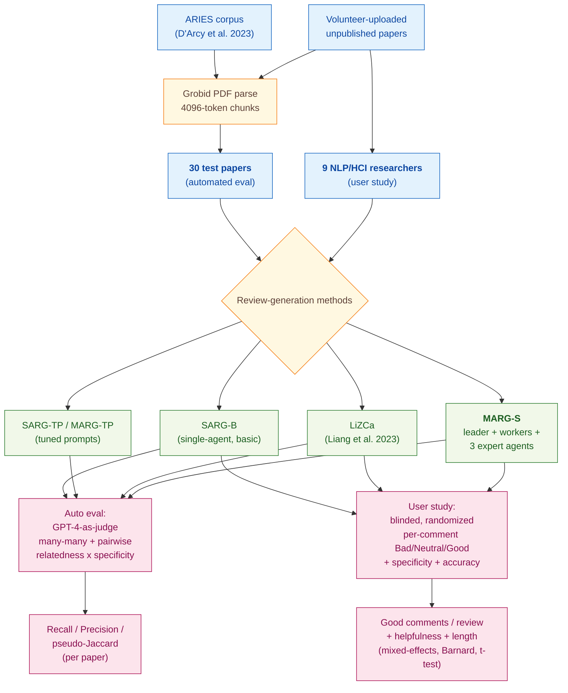

> [!success] **TL;DR**
> MARG-S delivers a real, user-validated improvement on a hard task — multi-agent collaboration roughly doubles the rate of useful comments compared to a one-shot GPT-4 prompt, and the specificity gain is large and statistically robust. But the evidence base is narrow: 9 same-organization NLP researchers rating their own papers with one deprecated model snapshot, evaluated against an admitted lower-bound proxy.

## Structured abstract

> [!info] A plain-language summary built from this paper's discourse-graph nodes. Numbers and findings link back to specific EVD nodes — click any link to drill in.

### Question

Can a team of language-model "agents" that talk to each other write better feedback on a scientific paper than a single language-model writing alone? The authors build **MARG** (Multi-Agent Review Generation), which splits the job across a leader agent, several worker agents that each see one chunk of the paper, and three expert agents tuned for different review angles. They then test the best variant, **MARG-S**, against simpler one-shot baselines on both an automatic benchmark and a real user study. See [[QUE - Can multi-agent LLM systems improve the specificity and helpfulness of scientific paper feedback?]].

### Methods

**Design.** The authors run two studies on the same system: a held-out automated benchmark that scores generated review comments against real reviewer comments, and a within-subjects user study where 9 researchers rated three review styles on their own unpublished papers.

**Tools.** Every condition runs on **GPT-4** (`gpt-4-0613`, the June-2023 snapshot with an 8,192-token context window). PDFs are parsed with **Grobid**, an open-source tool that pulls structured text out of academic PDFs. The benchmark draws (paper, real-reviewer-comment) pairs from the **ARIES corpus** (D'Arcy et al. 2023). The authors compare MARG-S against **SARG-B** (single-agent, basic prompt), **SARG-TP** (single-agent, tuned prompt), **MARG-TP** (multi-agent, tuned prompt), and **LiZCa** (the prior-art prompt from Liang et al. 2023). Statistical analysis uses R packages **lme4** and **ordinal** for mixed-effects logistic and cumulative-link models.

**Procedure.** The pipeline parses each PDF, splits it into 4,096-token paragraph-aligned chunks, and feeds the chunks to worker agents who report back to a leader. The leader passes drafts to three expert agents (experiments, clarity, and impact) for refinement. For automated scoring, the authors generate review comments from each method, then use GPT-4 as a judge in two stages: a fast "many-many" matching step that lists all plausible pairs (kept if they appear in at least 2 of 5 random-permutation passes), and a slower pairwise step that labels each pair on relatedness (none and then weak, medium, high) and relative specificity (less, same, more). A pair counts as a match only if relatedness is medium or high and the generated comment is at least as specific as the human one. The authors compute recall, precision, and a pseudo-Jaccard score per paper. For the user study, participants uploaded a paper, received three reviews in random order with method labels hidden, and rated every comment on a 3-level Bad and then Neutral and Good scale plus 4-level specificity and 3-level accuracy. Significance was tested with paired t-tests, Barnard's exact test, and mixed-effects regression.

**Sample.** The automated benchmark used **30 papers** from the ARIES corpus, picked because GPT could extract real reviewer comments for them. The user study recruited **9 NLP and HCI researchers** from one large research organization, all of whom completed the task. Each participant rated about 17 comments per method across 3 methods, producing roughly 333 rated comments. The unit of analysis is the comment for benchmark and rating models, the review for length and helpfulness ratings, and the paper for some aggregate counts.

### Findings

- **MARG-S beat the prior state-of-the-art on automatic recall.** MARG-S scored a recall of 15.84 on the ARIES benchmark, beating the previous best (LiZCa at 9.67) by 6.17 points (recall is the share of real reviewer comments the system reproduced; higher is better). Precision dropped though, because MARG-S generates roughly five times as many comments as LiZCa (19.8 vs. 4.0 per paper), so its pseudo-Jaccard score (3.53) trailed LiZCa's (5.58). The authors argue recall matters more in practice because users can filter out bad comments, but high comment volume may overwhelm authors. [[EVD - MARG-S outperformed all baselines by 6.1 recall points in automated evaluation on ARIES corpus - @darcyMARGMultiAgentReview2024]]

- **Real users rated MARG-S more than twice as helpful as the single-agent baseline.** Across 9 participants reviewing their own papers, MARG-S produced 3.7 "good" comments per review compared to 1.7 for the single-agent SARG-B baseline and 0.3 for LiZCa. MARG-S also slashed the share of generic comments from about 60 percent (SARG-B) down to 29 percent. The good-comment gap over SARG-B was significant per-comment (Barnard's exact test, p=0.02 — unlikely to be chance) but not significant per-user (paired t-test, p=0.12 — could plausibly be chance with only 9 raters). The MARG-S share of "very specific" comments was 39.0 percent vs. 11.7 percent for SARG-B (p=0.002, very unlikely to be chance). [[EVD - MARG-S generated 3.7 good comments per paper rated by users compared to 1.7 for single-agent GPT-4 baseline - @darcyMARGMultiAgentReview2024]]

### Claim supported

These findings together support the claim that [[CLM - Multi-agent LLM systems produce more specific and helpful scientific paper feedback than single-agent approaches]]. For someone considering an LLM review-helper today, MARG-S offers a clear quality lift over a one-shot prompt, but it costs about 1.24 million input tokens per paper (roughly 167x LiZCa) and 6 of 9 users called its reviews "way too long" — so the practical question is whether downstream filtering or summarization can keep that quality lift without burying authors in comments.

### Caveats

- **The automated metric is a lower bound, not a truth.** The benchmark scores generated comments by overlap with real human reviewer comments, but real reviewers miss valid critiques and sometimes raise unreasonable ones. A generated comment can be genuinely useful yet score zero because no human reviewer happened to write the same thing. [[CVT - The MARG automated evaluation used overlap-based matching which is an imperfect proxy for review quality]]

### Methods at a glance

---

## Critical appraisal

> [!info] A risk-of-bias and validity assessment across five domains, synthesized from this paper's discourse-graph nodes. Each domain gets a rating (🟢 Low risk · 🟡 Some concerns · 🔴 High risk) plus a brief, EVD-grounded justification. The TRIPOD-LLM table below covers *reporting compliance*; this section covers *methodological quality*.

| Domain | Rating | Justification |
| --- | :---: | --- |
| **Construct validity** — does the metric actually measure the construct? | 🟡 | The deployment-relevant construct is "useful feedback to a real author," and the user-study "good comments per review" measure maps to it well. The automated recall metric is explicitly a lower-bound proxy because real reviewers miss reasonable critiques (see [[CVT - The MARG automated evaluation used overlap-based matching which is an imperfect proxy for review quality]]), and using GPT-4 as both generator and judge ("LLM-judging-LLM") risks rewarding stylistic similarity rather than substantive merit. |
| **Internal validity** — could the comparison be biased? | 🟡 | The user study did blind participants to method ID and randomized review order, which is good practice. But each comment was rated by a single annotator (the paper's own author), prompts were tuned over "several hundred rounds" on an ARIES subset that overlaps in distribution with the held-out 30 papers, and the GPT-4 judge could reward MARG-S simply because its outputs share GPT-4's style. The compliment-detection probe ruled out flattery bias, but other LLM-judge biases were not tested. |
| **External validity** — do findings generalize? | 🔴 | Three serious limits. (1) The user study has only 9 participants, all from one large research organization in NLP/HCI, rating their own ML-adjacent papers — so the "good-comment" signal may not extend to other fields. (2) Figures, tables, and most equations are excluded from the model input, so reviews can't critique a large class of real paper content. (3) Everything runs on a single fixed model snapshot (`gpt-4-0613`); MARG-S's gains may not transfer to newer or smaller models, and the system has not been tested in a real conference review pipeline. |
| **Statistical rigor** — appropriate uncertainty + comparisons? | 🟡 | The authors used appropriate paired tests (related-sample t-test, Barnard's exact, mixed-effects logistic, cumulative-link models) and reported per-comment and per-user p-values separately — a strength. But with only 9 participants, the per-user tests are underpowered (MARG-S vs. SARG-B: per-user p=0.12 despite per-comment p=0.02), no confidence intervals are given on recall or good-comment counts, and there is no multiple-comparison correction across the many method-by-metric comparisons in Tables 2 and 5. |
| **Reproducibility** — code, data, determinism? | 🟡 | Code is public at github.com/allenai/marg-reviewer and ARIES is openly available, which is strong. But GPT-4 inference settings (temperature, top_p, seed, system message for the alignment GPT call) are not reported (TRIPOD-LLM 6c marked partial), and `gpt-4-0613` is a deprecated OpenAI snapshot — so exact numerical replication is no longer possible even with the public code. The 30-paper alignment outputs and the user-study survey responses were not released. |

**Bottom line.** MARG-S delivers a real, user-validated improvement on a hard task — multi-agent collaboration roughly doubles the rate of useful comments compared to a one-shot GPT-4 prompt, and the specificity gain is large and statistically robust. But the evidence base is narrow: 9 same-organization NLP researchers rating their own papers with one deprecated model snapshot, evaluated against an admitted lower-bound proxy. Before treating MARG-style multi-agent review as a settled win, future work needs broader user pools, head-to-head testing against newer models, evaluation on papers outside ML, and a deployment-aware cost-quality study given the 167x token overhead vs. LiZCa.

> [!tip] **Applicable external appraisal frameworks beyond TRIPOD-LLM** (already covered by the table below): **HELM** (Liang et al. 2022) for holistic LLM-evaluation principles · **Datasheets for Datasets** (Gebru et al. 2021) for the evaluation corpus · **Model Cards** (Mitchell et al. 2019) for the LLMs being evaluated

---

## TRIPOD-LLM reporting summary

> [!info] Reporting compliance for this paper, mapped to the TRIPOD-LLM checklist (Methods items 5a–15 and Results items 16a–18). Compliance icons: ✅ fully reported · ⚠️ partially reported / unclear · ❌ should be reported but not reported · ➖ not applicable to this study. Item 17 (Performance) is reported per-EVD; see each EVD's `## Other Notes`.

| # | Item | ✓ | Reported in this study |
| --- | --- | :---: | --- |
| **5a** | Data sources | ✅ | ARIES corpus (D'Arcy et al. 2023) — scientific-paper edits with paired peer-review comments — used for both prompt tuning and the 30-paper automated evaluation. User study used participants' own unpublished scientific papers uploaded via a web interface. |
| **5b** | Data points + distribution | ⚠️ | Automated eval: 30 ARIES papers; per-method comments-per-paper reported (Table 2: range 4.0–19.8). User study: 9 participants, ~17 comments/review × 3 methods. Total per-paper real-reviewer comment counts not reported. |
| **5c** | Date range of data | ❌ | ARIES paper-edit dates and reviewer-comment dates not reported; user-study collection window not disclosed. |
| **5d** | Pre-processing / quality checks | ✅ | PDFs parsed with Grobid (note: Liang et al. 2023 originally used pikepdf — re-run with Grobid for consistency). Paper split on paragraph boundaries into 4096-token chunks; each paragraph annotated with its position and section name. Figures, tables, and many equations excluded due to text-only parsing. |
| **5e** | Missing / imbalanced data | ⚠️ | Acknowledged that figures, tables, and garbled equations are missing from input. No imbalance handling for review-comment categories beyond the three-way specialised-agent split. |
| **6a** | LLM name + version | ✅ | OpenAI GPT-4 (gpt-4-0613, 8192-token capacity) for review generation, alignment scoring, and compliment-detection probes. |
| **6b** | Development process | ✅ | No fine-tuning. Prompts iterated "several hundred rounds" on a small ARIES subset using deliberately injected severe errors (e.g., "the proposed method achieves AGI") to probe blind-spots. Multi-agent architecture (leader + N workers + experts) described in Section 4. |
| **6c** | Inference settings / prompting | ⚠️ | Chunk size (4096 tokens), 8k context, communication protocol described in detail; full prompts in Appendix A. Temperature, top_p, seed, system message wording for the alignment GPT call not explicitly reported. Five-pass random-permutation strategy for many-many matching reported. |
| **6d** | Output | ✅ | Output is a list of free-text review comments per paper; alignment GPT outputs labels from 4-level relatedness × 3-level relative-specificity scales; many-many stage outputs candidate pair lists; compliment detector outputs JSON with boolean has_compliment. |
| **6e** | Classification thresholds | ✅ | Match threshold = relatedness ∈ {medium, high} AND relative specificity ∈ {same, more}. Many-many candidate pairs require ≥2/5 random-permutation passes. Thresholds swept in Figure 3. |
| **7a** | Quality metrics | ✅ | Automated: Recall, Precision, pseudo-Jaccard (with directional intersection operators defined), and average # comments. User study: per-comment Bad/Neutral/Good, 3-level Accuracy, 4-level Specificity, 5-point review length, 5-point review helpfulness. |
| **7b** | Relevance to downstream | ⚠️ | Authors argue recall matters more than precision because users can filter bad comments; user study explicitly chosen as a "more reliable" downstream proxy. No measurement of actual paper improvement, time saved, or whether authors acted on suggestions. |
| **7c** | Outcome definition | ✅ | "Actionable feedback comments that could help authors improve the paper" — same definition as D'Arcy et al. 2023 ARIES; positive remarks excluded. |
| **7d** | Subjective interpretation | ✅ | Survey rubrics for Specificity / Accuracy / Overall provided to participants in survey preamble (quoted in paper). Participant blinding to method ID and review-order randomisation reported. Failure-mode taxonomy (Section 8) annotated by one author with disclosed expertise. |
| **7e** | Comparison | ✅ | Five generation methods compared (SARG-B, SARG-TP, MARG-TP, LiZCa, MARG-S) plus four MARG-S ablations and a Human-Human baseline; per-user related-sample t-test, per-comment Barnard's exact test, mixed-effects logistic regression (Tables 6–8). |
| **8a** | Annotation guidelines | ✅ | Survey-question rubrics fully quoted in Section 7.1 (Specificity / Accuracy / Overall rating). Failure-mode taxonomy defined in Section 8. |
| **8b** | Annotators + IAA | ❌ | No inter-annotator agreement reported. Each comment rated by a single participant (the paper author); failure analysis done by a single author. |
| **8c** | Annotator background | ✅ | User-study participants: 9 NLP / HCI researchers from a "large research organization." Failure analyst: "an author of this work with several publications in the field of machine learning and natural language processing." |
| **9a** | Prompt design | ✅ | Final prompts in Appendix A (~9 pages of prompts: leader / worker / experts × 3 specialisations + refinement + SARG-B / SARG-TP / MARG-TP). Iterative manual prompt-engineering process described, including injecting severe errors to surface blind-spots. |
| **9b** | Prompt-development data | ✅ | Prompts tuned on a small ARIES subset disjoint from the 30-paper test set; "several hundred rounds of manual iteration." |
| **10** | Summarization | ➖ | Not applicable (task is review-comment generation, not summarisation). |
| **11** | Instruction tuning / alignment | ➖ | No model training or alignment performed; off-the-shelf gpt-4-0613 used throughout. |
| **12** | Compute | ⚠️ | Per-paper input + generated tokens reported per method (Table 4: e.g., MARG-S consumes ~1.24M input + 51k generated tokens/paper). Wall-clock noted only as "roughly an hour longer per review" for MARG-S. No GPU/CPU spec, no $ cost. |
| **13** | Ethical approval | ❌ | No mention of IRB / ethics review for the 9-participant user study collecting unpublished papers and ratings. |
| **14a** | Funding | ✅ | NSF grant IIS-2006851 and Tencent AI Lab Rhino-Bird Gift Fund. |
| **14b** | Conflicts of interest | ❌ | Not declared in the paper. |
| **14c** | Protocol | ❌ | No pre-registered protocol reported. |
| **14d** | Registration | ➖ | Not a clinical study. |
| **14e** | Data availability | ⚠️ | ARIES is publicly available (cited). User-study survey responses and the 30-paper alignment outputs not explicitly released. Code repo at github.com/allenai/marg-reviewer (footnote 1). |
| **14f** | Code availability | ✅ | github.com/allenai/marg-reviewer (linked in footnote 1 on p. 1). |
| **15** | Patient/public involvement | ➖ | Not applicable (no patients; "public" in the LLM-research sense is the paper-author user-study cohort). |
| **16a** | Flow of data | ⚠️ | Automated eval: ARIES → 30 test papers (no exclusion diagram). User study: 9 volunteers recruited → 9 analysed (no exclusions noted). |
| **16b** | Characteristics | ⚠️ | Participant characteristics: NLP / HCI researchers at a "large research organization"; their submitted papers are unpublished ML-related works (inferred from failure-analysis examples). No demographics, seniority, or reviewing experience breakdown. |
| **16c** | Distribution comparison | ➖ | Not applicable (no clinical-outcome subgroup analysis). |
| **16d** | N per analysis | ⚠️ | Automated eval N=30 papers stated; user-study N=9 participants stated. Total comment count per cell (e.g., "comments rated as good by participant i for method j") not tabulated explicitly. |
| **17** | Performance | (per-EVD) | Reported per-EVD. See each EVD's `## Other Notes` for the EVD-specific recall/precision/Jaccard or Good-comment-count numbers. |
| **18** | LLM updating | ➖ | Not applicable (no model updating; one fixed gpt-4-0613 snapshot used throughout). |
