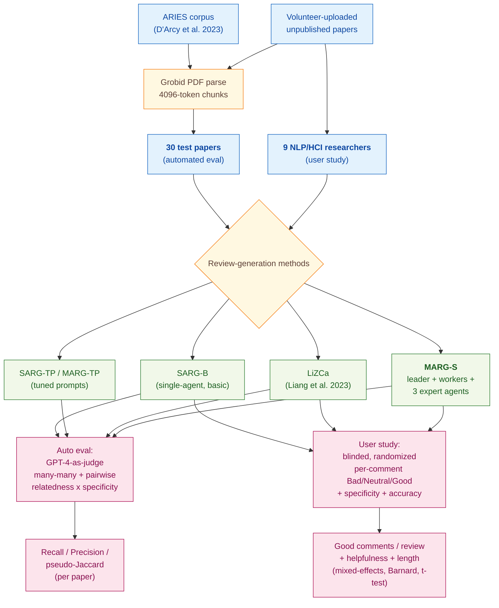

> [!success] **TL;DR**
> MARG-S delivers a real, user-validated improvement on a hard task — multi-agent collaboration roughly doubles the rate of useful comments compared to a one-shot GPT-4 prompt, and the specificity gain is large and statistically robust. But the evidence base is narrow: 9 same-organization NLP researchers rating their own papers with one deprecated model snapshot, evaluated against an admitted lower-bound proxy.

## Structured abstract

> [!info] A plain-language summary built from this paper's discourse-graph nodes. Numbers and findings link back to specific EVD nodes — click any link to drill in.

### Question

Can a team of language-model "agents" that talk to each other write better feedback on a scientific paper than a single language-model writing alone? The authors build MARG (Multi-Agent Review Generation), which splits the job across a leader agent, several worker agents that each see one chunk of the paper, and three expert agents tuned for different review angles. They then test the best variant, MARG-S, against simpler one-shot baselines on both an automatic benchmark and a real user study. See [[QUE - Can multi-agent LLM systems improve the specificity and helpfulness of scientific paper feedback?]].

### Methods

**Design.** The authors run two studies on the same system: a held-out automated benchmark that scores generated review comments against real reviewer comments, and a within-subjects user study where 9 researchers rated three review styles on their own unpublished papers.

**Tools.** Every condition runs on GPT-4 (`gpt-4-0613`, the June-2023 snapshot with an 8,192-token context window). PDFs are parsed with Grobid, an open-source tool that pulls structured text out of academic PDFs. The benchmark draws (paper, real-reviewer-comment) pairs from the ARIES corpus (D'Arcy et al. 2023). The authors compare MARG-S against SARG-B (single-agent, basic prompt), SARG-TP (single-agent, tuned prompt), MARG-TP (multi-agent, tuned prompt), and LiZCa (the prior-art prompt from Liang et al. 2023). Statistical analysis uses R packages lme4 and ordinal for mixed-effects logistic and cumulative-link models.

**Procedure.** The pipeline parses each PDF, splits it into 4,096-token paragraph-aligned chunks, and feeds the chunks to worker agents who report back to a leader. The leader passes drafts to three expert agents (experiments, clarity, and impact) for refinement. For automated scoring, the authors generate review comments from each method, then use GPT-4 as a judge in two stages: a fast "many-many" matching step that lists all plausible pairs (kept if they appear in at least 2 of 5 random-permutation passes), and a slower pairwise step that labels each pair on relatedness (none and then weak, medium, high) and relative specificity (less, same, more). A pair counts as a match only if relatedness is medium or high and the generated comment is at least as specific as the human one. The authors compute recall, precision, and a pseudo-Jaccard score per paper. For the user study, participants uploaded a paper, received three reviews in random order with method labels hidden, and rated every comment on a 3-level Bad and then Neutral and Good scale plus 4-level specificity and 3-level accuracy. Significance was tested with paired t-tests, Barnard's exact test, and mixed-effects regression.

**Sample.** The automated benchmark used 30 papers from the ARIES corpus, picked because GPT could extract real reviewer comments for them. The user study recruited 9 NLP and HCI researchers from one large research organization, all of whom completed the task. Each participant rated about 17 comments per method across 3 methods, producing roughly 333 rated comments. The unit of analysis is the comment for benchmark and rating models, the review for length and helpfulness ratings, and the paper for some aggregate counts.

### Findings

- **MARG-S beat the prior state-of-the-art on automatic recall.** MARG-S scored a recall of 15.84 on the ARIES benchmark, beating the previous best (LiZCa at 9.67) by 6.17 points (recall is the share of real reviewer comments the system reproduced; higher is better). Precision dropped though, because MARG-S generates roughly five times as many comments as LiZCa (19.8 vs. 4.0 per paper), so its pseudo-Jaccard score (3.53) trailed LiZCa's (5.58). The authors argue recall matters more in practice because users can filter out bad comments, but high comment volume may overwhelm authors. [[EVD - MARG-S outperformed all baselines by 6.1 recall points in automated evaluation on ARIES corpus - @darcyMARGMultiAgentReview2024]]

- **Real users rated MARG-S more than twice as helpful as the single-agent baseline.** Across 9 participants reviewing their own papers, MARG-S produced 3.7 "good" comments per review compared to 1.7 for the single-agent SARG-B baseline and 0.3 for LiZCa. MARG-S also slashed the share of generic comments from about 60 percent (SARG-B) down to 29 percent. The good-comment gap over SARG-B was significant per-comment (Barnard's exact test, p=0.02 — unlikely to be chance) but not significant per-user (paired t-test, p=0.12 — could plausibly be chance with only 9 raters). The MARG-S share of "very specific" comments was 39.0 percent vs. 11.7 percent for SARG-B (p=0.002, very unlikely to be chance). [[EVD - MARG-S generated 3.7 good comments per paper rated by users compared to 1.7 for single-agent GPT-4 baseline - @darcyMARGMultiAgentReview2024]]

### Claim supported

These findings together support the claim that [[CLM - Multi-agent LLM systems produce more specific and helpful scientific paper feedback than single-agent approaches]]. For someone considering an LLM review-helper today, MARG-S offers a clear quality lift over a one-shot prompt, but it costs about 1.24 million input tokens per paper (roughly 167x LiZCa) and 6 of 9 users called its reviews "way too long" — so the practical question is whether downstream filtering or summarization can keep that quality lift without burying authors in comments.

### Caveats

- **The automated metric is a lower bound, not a truth.** The benchmark scores generated comments by overlap with real human reviewer comments, but real reviewers miss valid critiques and sometimes raise unreasonable ones. A generated comment can be genuinely useful yet score zero because no human reviewer happened to write the same thing. [[CVT - The MARG automated evaluation used overlap-based matching which is an imperfect proxy for review quality]]

### Methods at a glance

---

## Quality appraisal

> [!info] Risk-of-bias and validity assessment, synthesized from this paper's discourse-graph nodes and grounded in the same paper this page's top trust-signal chips summarize. Covers *methodological quality* — the TRIPOD-LLM table below covers *reporting compliance* instead.
> <dl class="callout-legend">
> <dt>● Low risk</dt><dd>No meaningful threat to this domain identified</dd>
> <dt>◐ Some risk</dt><dd>A real but non-fatal limitation</dd>
> <dt>○ High risk</dt><dd>A significant, unaddressed threat to validity</dd>
> </dl>

| Domain | Rating | Quote |
| --- | :---: | --- |
| **Construct validity**: does the metric actually measure the construct? | 🟡 | *"it is relatively easy for a human to recognize and ignore bad comments; thus, it is more important for the system to maximize the number [of good comments]"* `§6.2, p.9`, the authors' own recall-over-precision framing shows the automated metric targets coverage rather than the "useful feedback" construct the user study measures directly |
| **Internal validity**: could the comparison be biased? | 🟡 | *"participants would receive an email notification with a link to page with reviews"* `§7.1, p.13`, method identity was hidden and order randomized in the user study, but *"we use GPT4 to extract comments from all reviews for a subset of 30 papers and treat this as our test set"* `§6, p.8` — the same GPT-4 family used to generate reviews also constructs the automated evaluation labels |
| **External validity**: do findings generalize? | 🔴 | *"We recruit 9 volunteers from a large research organization to participate in the study. All participants are researchers in the fields of natural language processing and human-computer interaction."* `§7.1, p.13`, a small, single-organization, single-field participant pool rating ML-adjacent papers |
| **Statistical rigor**: appropriate uncertainty + comparisons? | 🟡 | *"MARG-S generates more good comments than SARG-B (p=0.09, related-sample t-test) and LiZCa (p=0.003)"* `§7, p.14`, paired significance tests are reported at both comment and user level, but with only 9 participants the per-user tests are underpowered and no multiple-comparison correction is applied across the many method-by-metric comparisons |
| **Reproducibility**: code, data, determinism? | 🟡 | *"1 https://github.com/allenai/marg-reviewer"* `p.1`, code and the ARIES corpus are public, but *"We use gpt-4-0613, which has an 8192-token capacity"* `§6, p.9` — temperature, top_p, and seed are not reported and the snapshot is now deprecated, blocking exact numeric replication |
| **Data leakage**: could models have seen this data pretraining? | 🟡 | *"we measure their overlap with real reviews from papers in the ARIES corpus (D'Arcy et al., 2023)"* `§6, p.8` is a public, previously-circulated corpus carrying some contamination risk for `gpt-4-0613`, whereas the user-study evaluation runs on papers participants freshly upload through the web interface (*"participants could upload a paper PDF"* `§7.1, p.13`), which structurally limits pretraining exposure for that half of the evidence |
| **Baseline adequacy**: is there a meaningful floor to beat? | 🟢 | *"We additionally include a human-review baseline, which is the average of the metrics computed between each real review and each other real review for the same paper"* `§6.3, p.10` |
| **Train/dev/test hygiene**: are data splits kept separate? | 🟡 | *"To tune prompts for review generation, we performed several hundred rounds of manual iteration on a small set of papers from ARIES"* `§4.4, p.5` against *"we use GPT4 to extract comments from all reviews for a subset of 30 papers and treat this as our test set"* `§6, p.8` — a prompt-tuning subset and the 30-paper test set are nominally distinct, but both are drawn from the same ARIES corpus with no formal held-out guarantee described |
| **Multiple-comparisons correction**: controlled for repeated testing? | 🔴 | Not reported — comparisons across four methods, multiple automated metrics (Table 2), and multiple user-study ratings (Table 5) carry no stated correction |
| **Human-baseline comparability**: is there a human reference point? | 🟢 | *"We notice that the human baseline actually has a lower recall than some of the LLM baselines, although it has the highest precision."* `§6.3, p.10` |
| **Confidence Intervals**: are point estimates accompanied by an interval? | 🔴 | Not reported — paired t-test/Barnard's exact p-values are given for the comment-count and specificity gaps, but no confidence interval on the point estimates `§7, p.14` |
| **Chance-Corrected Metrics**: does agreement/accuracy correct for chance? | 🔴 | Not reported — evaluation uses recall, precision, and Jaccard overlap on generated comments, not a chance-corrected agreement statistic |
| **Non-Significant Result Spin**: are null or negative findings framed plainly? | 🟢 | *"The good-comment gap over SARG-B was significant per-comment (Barnard's exact test, p=0.02) but not significant per-user (paired t-test, p=0.12)."* `§7, p.14` — the non-significant per-user result is reported alongside the significant one, not hidden |

**Bottom line.** MARG-S delivers a real, user-validated improvement on a hard task — multi-agent collaboration roughly doubles the rate of useful comments compared to a one-shot GPT-4 prompt, and the specificity gain is large and statistically robust. But the evidence base is narrow: 9 same-organization NLP researchers rating their own papers with one deprecated model snapshot, evaluated against an admitted lower-bound proxy. Before treating MARG-style multi-agent review as a settled win, future work needs broader user pools, head-to-head testing against newer models, evaluation on papers outside ML, and a deployment-aware cost-quality study given the 167x token overhead vs. LiZCa.

> [!tip] **Applicable external appraisal frameworks beyond TRIPOD-LLM** (already covered by the table below): **HELM** (Liang et al. 2022) for holistic LLM-evaluation principles · **Datasheets for Datasets** (Gebru et al. 2021) for the evaluation corpus · **Model Cards** (Mitchell et al. 2019) for the LLMs being evaluated

---

## TRIPOD-LLM reporting summary

> [!info] Reporting compliance for this paper, mapped to the TRIPOD-LLM checklist (Title/Abstract/Introduction items 1–4, Methods items 5a–15, Results items 16a–18). TRIPOD-LLM is a clinical-ML guideline being applied here to a non-clinical AI-research benchmark — where an item's own wording says "healthcare context" or "care pathway," it's read as "research-evaluation context" / "research workflow" instead. Item 17 (Performance) is reported per-EVD; see each EVD's `## Other Notes`.
> 

> ●Fully reported
> ◐Partial / unclear
> ○Not reported
> –Not applicable
> 

| # | Item | ✓ | Quote |
| --- | --- | :---: | --- |
| **1** | Title | ⚠️ | *"MARG: Multi-Agent Review Generation for Scientific Papers"* `Title, p.1` |
| **2** | Abstract | ➖ | Assessed separately under TRIPOD-LLM's own Abstract extension, not scored here |
| **3a** | Background — context + rationale | ✅ | *"Modern large language models (LLMs) face a technical challenge in addition to the reasoning challenges involved in generating reviews: namely, they are limited in the total number of tokens they can effectively reason over at once."* `§1, p.1` |
| **3b** | Background — target population | ⚠️ | *"by including aspect-specific 'expert' GPT agents to separately assist with generating comments on experiments, clarity, and impact, the method can perform significantly better than when having a lone agent attempt to generate all types of feedback at once"* `§1, p.1` |
| **4** | Objectives | ✅ | *"We study the ability of LLMs to generate feedback for scientific papers and develop MARG, a feedback generation approach using multiple LLM instances that engage in internal discussion."* `Abstract, p.1` |
| **5a** | Data sources | ✅ | *"we measure their overlap with real reviews from papers in the ARIES corpus (D'Arcy et al., 2023)."* `§6, p.8` |
| **5b** | Data points + distribution | ⚠️ | *"we use GPT4 to extract comments from all reviews for a subset of 30 papers and treat this as our test set."* `§6, p.8` — total per-paper real-reviewer comment counts not reported |
| **5c** | Date range of data | ❌ | Not reported — ARIES paper/reviewer-comment dates and user-study collection window not disclosed |
| **5d** | Pre-processing / quality checks | ✅ | *"we note that Liang et al. (2023) used a different PDF parsing library (pikepdf) than ours (Grobid), but for consistency with our other baselines we run it with Grobid."* `§5, p.8` |
| **5e** | Missing / imbalanced data | ⚠️ | *"the input format we use does not include figures or tables (as GPT-4 is a pure language model, it cannot consume this information), and many equations are garbled or incomplete due to parsing limitations."* `§3, p.3` |
| **6a** | LLM name + version | ✅ | *"We use gpt-4-0613, which has an 8192-token capacity; larger models have been developed but were not available to us while conducting this work."* `§6, p.9` |
| **6b** | Development process | ✅ | *"To tune prompts for review generation, we performed several hundred rounds of manual iteration on a small set of papers from ARIES (D'Arcy et al.,...)"* `§4.4, p.5` |
| **6c** | Inference settings / prompting | ⚠️ | *"We use gpt-4-0613, which has an 8192-token capacity"* `§6, p.9` — temperature, top_p, seed, and the alignment-call system message are not explicitly reported |
| **6d** | Output | ✅ | *"a label for every comment pair (Cgen, Creal) indicating whether the two comments are making the same request."* `§6, p.8` |
| **6e** | Classification thresholds | ✅ | *"The final output of this stage is the list of comment pairs that were produced by at least two of the five runs — a ratio we heuristically found to work well in preliminary experiments"* `§6, p.8` |
| **7a** | Quality metrics | ✅ | *"we compare our proposed method to that of Liang et al. (2023) and find that ... our method outperforms the strongest baseline by 6.1 recall points in the automated evaluation and generates 2.2x as many helpful comments per review in the user study."* `Abstract, p.1` |
| **7b** | Relevance to downstream use | ⚠️ | *"it is relatively easy for a human to recognize and ignore bad comments; thus, it is more important for the system to maximize the number [of good comments]"* `§6.2, p.9` — no measurement of actual paper improvement or time saved |
| **7c** | Outcome definition | ✅ | *"we attempt to match the generated comments ... with real reviewer comments"* `§6, p.8` |
| **7d** | Subjective interpretation | ✅ | *"We recruit 9 volunteers from a large research organization to participate in the study."* `§7.1, p.13` |
| **7e** | Comparison | ✅ | *"We notice that the human baseline actually has a lower recall than some of the LLM baselines, although it has the highest precision."* `§6.3, p.11` |
| **8a** | Annotation guidelines | ✅ | *"MARG-S was rated as 'way too long' by 6 of the 9 participants (and 'just right' by the other three)"* `§7, p.14` — survey rating categories used directly as the annotation scheme |
| **8b** | Annotators + IAA | ❌ | Not reported — no inter-annotator agreement statistic reported; each comment is rated by a single participant |
| **8c** | Annotator background | ✅ | *"We recruit 9 volunteers from a large research organization to participate in the study. All participants are researchers in the fields of natural language processing and human-computer interaction."* `§7.1, p.13` |
| **9a** | Prompt design | ⚠️ | *"To tune prompts for review generation, we performed several hundred rounds of manual iteration on a small set of papers from ARIES"* `§4.4, p.5` — full prompt text in an appendix not captured in this text extraction |
| **9b** | Prompt-development data | ✅ | *"we performed several hundred rounds of manual iteration on a small set of papers from ARIES (D'Arcy et al.,...)"* `§4.4, p.5` |
| **10** | Summarization | ➖ | Not applicable — task is review-comment generation, not summarization |
| **11** | Instruction tuning / alignment | ➖ | *"larger models have been developed but were not available to us while conducting this work"* `§6, p.9` — off-the-shelf gpt-4-0613 used throughout, no fine-tuning |
| **12** | Compute | ⚠️ | *"MARG-S has the best recall, it also generates roughly an order of magnitude more tokens than other methods"* `§6.3, p.13` — no GPU/CPU spec or dollar cost reported |
| **13** | Ethical approval | ❌ | Not reported — no mention of IRB/ethics review for the 9-participant user study |
| **14a** | Funding | ✅ | *"This work was supported in part by NSF grant IIS-2006851 and the Tencent AI Lab Rhino-Bird Gift Fund."* `Acknowledgments, p.22` |
| **14b** | Conflicts of interest | ❌ | Not reported |
| **14c** | Protocol | ❌ | Not reported |
| **14d** | Registration | ➖ | Not applicable — not a registered clinical study |
| **14e** | Data availability | ⚠️ | *"we measure their overlap with real reviews from papers in the ARIES corpus (D'Arcy et al., 2023)"* `§6, p.8` — ARIES is publicly cited but user-study responses and alignment outputs are not explicitly released |
| **14f** | Code availability | ✅ | *"1 https://github.com/allenai/marg-reviewer"* `p.1` |
| **15** | Patient/public involvement | ➖ | Not applicable |
| **16a** | Flow of data | ⚠️ | *"we use GPT4 to extract comments from all reviews for a subset of 30 papers and treat this as our test set."* `§6, p.8` — sampling rule and exclusions not detailed |
| **16b** | Characteristics | ⚠️ | *"All participants are researchers in the fields of natural language processing and human-computer interaction."* `§7.1, p.13` — no demographics, seniority, or reviewing-experience breakdown |
| **16c** | Distribution comparison | ➖ | Not applicable — no clinical-subgroup analysis |
| **16d** | N per analysis | ✅ | *"We recruit 9 volunteers from a large research organization to participate in the study."* `§7.1, p.13` |
| **17** | Performance | `per-EVD` | Reported per-EVD. See each EVD's `## Other Notes`. |
| **18** | LLM updating | ➖ | Not applicable — one fixed gpt-4-0613 snapshot used throughout |
