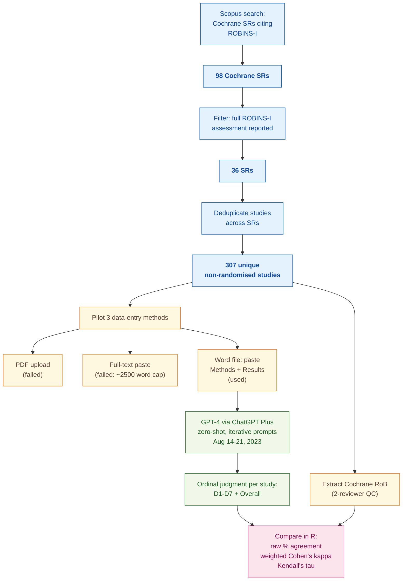

> [!success] **TL;DR**
> GPT-4 reaches a fair but uneven level of agreement with Cochrane reviewers on ROBINS-I — strong enough to consider as an extra independent reviewer in a human-in-the-loop workflow, nowhere near strong enough to replace one.

## Structured abstract

> [!info] A plain-language summary built from this paper's discourse-graph nodes. Numbers and findings link back to specific EVD nodes — click any link to drill in.

### Question

Can a general-purpose chatbot (GPT-4) judge how trustworthy a non-randomised medical study is, the same way a trained Cochrane reviewer would? The authors test this on **ROBINS-I** (Risk Of Bias In Non-randomised Studies of Interventions), a structured tool that grades each study across seven specific concerns and gives an overall verdict. They feed the same studies to GPT-4 and to the published Cochrane judgments, then measure how often the two agree. They also propose a four-part protocol for using LLMs (large language models — AI systems trained to read and write text) inside systematic reviews. See [[QUE - How does LLM performance vary across specific structured tasks in systematic review and evidence appraisal workflows?]].

### Methods

**Design.** This is a single-case methodological study that benchmarks zero-shot GPT-4 risk-of-bias judgments against the published Cochrane reviewers' judgments on the same primary studies. Zero-shot means the model is never shown worked examples — it just gets the task description and the study text.

**Tools.** The authors used **GPT-4** through the **ChatGPT Plus** consumer interface, first via Code Interpreter and then via standard chat. They graded studies with the **ROBINS-I** tool, which has seven domains (D1 confounding, D2 participant selection, D3 classification of interventions, D4 deviations from intended interventions, D5 missing data, D6 measurement of outcomes, D7 selective reporting) plus an Overall judgment. They computed agreement statistics in **R**, a free statistical-analysis language.

**Procedure.** The authors searched **Scopus** for every Cochrane systematic review that cited the original ROBINS-I paper, then kept only fully-published medical reviews that actually used ROBINS-I. They piloted three ways to feed each study into ChatGPT. Direct PDF upload through Code Interpreter failed because the text came back fragmented. Pasting the entire full text failed because it ran past an estimated 2500-word ceiling. The workaround that finally worked was converting each PDF to a Word file and pasting in only the Methods and Results sections, which are the parts a human reviewer leans on for risk-of-bias judgments. The authors note plainly that these prompt and data-entry choices "were not prespecified" — they were tuned on the fly. One reviewer pulled the published Cochrane judgment for each study and a second reviewer double-checked it. They then compared GPT-4 against Cochrane using three agreement statistics: raw percent agreement, weighted Cohen's kappa, and Kendall's tau.

**Sample.** The Scopus search returned **98 Cochrane systematic reviews**. Of these, **36** included a complete ROBINS-I assessment. After dropping studies that appeared in more than one review, the analytic sample landed at **307 unique non-randomised primary studies**. Each study contributed eight ordinal judgments (seven domains plus Overall). The unit of analysis was a single study-by-domain judgment.

### Findings

- **GPT-4 agrees with Cochrane only at a fair level overall.** Across all 307 studies and all eight ROBINS-I judgments, GPT-4 and the Cochrane reviewers landed on the same answer 61% of the time. Kendall's tau (a 0-to-1 correlation where 1 means perfect agreement) was 0.35, which the authors' own scale calls "fair." Weighted Cohen's kappa (another 0-to-1 agreement statistic that adjusts for chance and partial credit on close calls) was much weaker at 0.13, putting it in the "slight" band. Domain-by-domain, raw agreement ranged from 31% on D4 (deviations from intended interventions) up to 71% on D3 (classification of interventions). Confounding (D1) was where GPT-4 struggled most, agreeing only 47% of the time. [[EVD - GPT-4 achieved 61% raw percent agreement with Cochrane reviewers on ROBINS-I overall risk of bias with Kendall coefficient of 0.35 - @hasanIntegratingLargeLanguage2024]]

### Claim supported

These findings support two related claims. The headline result — fair-to-moderate agreement that varies sharply by domain — backs [[CLM - LLMs achieve moderate accuracy on structured quality appraisal tasks but cannot yet substitute for expert human judgment]]. The authors' practical response to that result, a four-part framework covering rationale, protocol, execution, and reporting for LLM use in reviews, backs [[CLM - A structured protocol for integrating LLMs into systematic reviews must specify rationale, model selection, prompt engineering, human verification procedures, and reporting standards]]. For someone weighing whether to plug GPT-4 into a real Cochrane workflow, the message is simple: today, GPT-4 can serve as one independent reviewer alongside a human, but it cannot replace the human. The authors say so directly — "pairing artificial intelligence with an independent human reviewer remains required at present."

### Caveats

- **The prompts and data-entry steps were tuned on the fly.** The authors openly state their prompt wording and the Word-paste workflow were refined iteratively until the system produced "sensical output," with no pre-registration. That means the reported 61% agreement may reflect a polished, optimised pipeline rather than typical zero-shot performance, and someone trying to replicate it from scratch could land on different numbers. [[CVT - Prompts and data entry processes for GPT-4 ROBINS-I assessment were developed iteratively without prespecification limiting replicability]]

### Methods at a glance

---

## Critical appraisal

> [!info] A risk-of-bias and validity assessment across five domains, synthesized from this paper's discourse-graph nodes. Each domain gets a rating (🟢 Low risk · 🟡 Some concerns · 🔴 High risk) plus a brief, EVD-grounded justification. The TRIPOD-LLM table below covers *reporting compliance*; this section covers *methodological quality*.

| Domain | Rating | Justification |
| --- | :---: | --- |
| **Construct validity** — does the metric actually measure the construct? | 🟡 | Raw percent agreement is intuitive but inflated when one ordinal class dominates, which is why the authors also report weighted kappa and Kendall's tau. The three statistics tell different stories — 61% raw, 0.13 kappa, 0.35 tau — and the paper's headline framing leans on the most flattering one. The deployment construct ("can GPT-4 stand in for a Cochrane reviewer?") maps better to kappa, which is mostly "slight." |
| **Internal validity** — could the comparison be biased? | 🔴 | The authors explicitly state that prompts and data-entry methods were not prespecified and were refined iteratively until the system produced "sensical output" — see [[CVT - Prompts and data entry processes for GPT-4 ROBINS-I assessment were developed iteratively without prespecification limiting replicability]]. There is no held-out evaluation set. The reference standard is a single Cochrane reviewer team's published judgment with no de novo independent re-rating, so reference-standard reliability for this corpus is unknown. Translation of foreign-language studies and truncation of long studies were both done by ChatGPT itself. |
| **External validity** — do findings generalize? | 🟡 | The 307 studies are diverse (drawn from 36 Cochrane SRs across medicine), which is a strength. But the test was run only on GPT-4 via the consumer ChatGPT Plus interface in a one-week window in August 2023, with no comparison to GPT-3.5, Llama, Claude, or any non-LLM baseline. The 2500-word workaround and the Methods-and-Results-only paste mean any study whose risk-of-bias signal lives in tables, supplementary appendices, or other sections is systematically underserved. |
| **Statistical rigor** — appropriate uncertainty + comparisons? | 🟡 | Three complementary agreement statistics are reported per domain and overall, which is appropriate for ordinal data. But there are no confidence intervals on any of the kappa or tau values, no significance test for differences across domains, and no multiple-comparison correction across the 8 judgments x 3 statistics matrix. The class distribution of ROBINS-I ordinal judgments is not reported, so the reader cannot assess how much chance agreement is doing the work in the 61% raw figure. |
| **Reproducibility** — code, data, determinism? | 🔴 | No code released; analysis described as conducted in R but no scripts shared (TRIPOD-LLM 14f ❌). Data available "upon reasonable request" rather than publicly (14e ⚠️). The specific GPT-4 snapshot is not reported (6a ⚠️) and inference parameters such as temperature, top-p, and seed are not disclosed (6c ❌), so the same prompts run again could produce different judgments. Combined with the unprespecified prompt-development workflow, this makes faithful replication essentially impossible. |

**Bottom line.** GPT-4 reaches a fair but uneven level of agreement with Cochrane reviewers on ROBINS-I — strong enough to consider as an extra independent reviewer in a human-in-the-loop workflow, nowhere near strong enough to replace one. The biggest threats to the result are not the headline numbers themselves but the unprespecified prompt pipeline, the missing GPT-4 snapshot and inference settings, and the absence of a held-out evaluation set; before this approach could be deployed, those would all need to be fixed and the experiment rerun against a frozen, named GPT-4 version with confidence intervals on every reported statistic.

> [!tip] **Applicable external appraisal frameworks beyond TRIPOD-LLM** (already covered by the table below): **MI-CLAIM** (Norgeot et al. 2020) for clinical-AI minimum information · **MINIMAR** (Hernandez-Boussard et al. 2020) for medical-AI reporting · **PROBAST+AI** (Wolff et al. 2019 base; AI extension in development) for prediction-model risk of bias

---

## TRIPOD-LLM reporting summary

> [!info] Reporting compliance for this paper, mapped to the TRIPOD-LLM checklist (Methods items 5a–15 and Results items 16a–18). Compliance icons: ✅ fully reported · ⚠️ partially reported / unclear · ❌ should be reported but not reported · ➖ not applicable to this study. Item 17 (Performance) is reported per-EVD; see each EVD's `## Other Notes`.

| # | Item | ✓ | Reported in this study |
| --- | --- | :---: | --- |
| **5a** | Data sources | ✅ | Cochrane systematic reviews citing the original ROBINS-I publication, identified via Scopus; restricted to fully-published Cochrane SRs in medicine that used ROBINS-I to assess included non-randomised studies. |
| **5b** | Data points + distribution | ⚠️ | 307 unique non-randomised studies, each scored on 7 ROBINS-I domains + Overall (= 8 ordinal judgments per study). Distribution of judgments across ordinal categories (low/moderate/serious/critical/no information) not reported. |
| **5c** | Date range of data | ⚠️ | Time stamp of AI use reported as "between 14 August 2023 and 21 August 2023" (table 2). Date range of the underlying primary studies / Cochrane SRs not reported; GPT-4 training cutoff not disclosed. |
| **5d** | Pre-processing / quality checks | ✅ | Three data-entry methods piloted (PDF upload via Code Interpreter, full-text paste, Word-converted Methods + Results paste); only the third worked. Foreign-language studies translated by ChatGPT; long studies truncated. One reviewer extracted Cochrane RoB judgments; a second reviewer verified. |
| **5e** | Missing / imbalanced data | ⚠️ | Truncation of long studies and translation of non-English studies acknowledged as potential affecters of RoB judgements, but no quantification of how many studies were truncated/translated. Distribution of ordinal RoB classes (likely imbalanced) not reported. |
| **6a** | LLM name + version | ⚠️ | "GPT-4" via ChatGPT Plus (Code Interpreter then standard chat). Specific GPT-4 snapshot/version (e.g., gpt-4-0613) not reported. |
| **6b** | Development process | ➖ | No model development/training; off-the-shelf zero-shot use of GPT-4. |
| **6c** | Inference settings / prompting | ❌ | Inference parameters (temperature, top_p, max tokens, system prompt) not reported. Prompts described as "iteratively tested and refined" with examples in the appendix; main text states "these processes were not prespecified." |
| **6d** | Output | ✅ | Ordinal ROBINS-I judgement per domain (D1–D7) and Overall. |
| **6e** | Classification thresholds | ➖ | Not applicable (ordinal LLM output mapped directly to ROBINS-I categories; no probability cutoffs). |
| **7a** | Quality metrics | ✅ | Raw per cent agreement, weighted Cohen's kappa, Kendall's τ — reported per domain and Overall in Table 1. Magnitude bands defined (slight/fair/moderate/substantial/almost perfect). |
| **7b** | Relevance to downstream | ⚠️ | Authors discuss practical implications (LLMs as duplicate independent reviewer) but no formal downstream-utility analysis (time saved, error tolerance, screening throughput). |
| **7c** | Outcome definition | ✅ | Agreement with the published Cochrane reviewer's ROBINS-I judgment, treated as the reference standard at the per-study × per-domain level. |
| **7d** | Subjective interpretation | ⚠️ | Cochrane reviewers' judgments treated as a single reference standard; no de novo independent human re-rating, so reference-standard reliability for this corpus is not established. Authors acknowledge ROBINS-I "can be quite poor for some domains such as confounding." |
| **7e** | Comparison | ⚠️ | GPT-4 compared only against the published Cochrane reviewers; no comparison to other LLMs (GPT-3.5, Llama 2), to a non-LLM RoB classifier, or to a naive baseline. |
| **8a** | Annotation guidelines | ➖ | No de novo annotation; reference labels are the published Cochrane RoB judgments. Cochrane SRs follow ROBINS-I guidance. |
| **8b** | Annotators + IAA | ⚠️ | Two reviewers extracted/verified Cochrane judgments from the SRs (extraction QC, not RoB re-annotation). No IAA reported because no independent re-rating was performed. |
| **8c** | Annotator background | ❌ | Background/expertise of the two extraction reviewers not described. |
| **9a** | Prompt design | ❌ | Prompts described as iteratively tested and refined; appendix referenced but main text explicitly states the prompt-development process "was not prespecified" — no systematic prompt-engineering search reported. |
| **9b** | Prompt-development data | ❌ | Not reported which studies (if any from the 307) were used during prompt iteration vs. held out for evaluation; no train/test split disclosed. |
| **10** | Summarization | ➖ | Not applicable (judgement task, not summarization). |
| **11** | Instruction tuning / alignment | ➖ | Off-the-shelf GPT-4; no fine-tuning or RLHF beyond OpenAI's defaults. |
| **12** | Compute | ❌ | Not reported. Authors note token-limit issues ("estimated 2500-word limit for GPT-4 prompts") motivated the Word-conversion workaround. |
| **13** | Ethical approval | ✅ | "Ethics approval Not applicable." Stated explicitly. |
| **14a** | Funding | ✅ | "The authors have not declared a specific grant for this research from any funding agency in the public, commercial or not-for-profit sectors." |
| **14b** | Conflicts of interest | ✅ | "Competing interests None declared." |
| **14c** | Protocol | ❌ | No protocol for the case study reported or referenced; authors explicitly state prompt and data-entry processes "were not prespecified." |
| **14d** | Registration | ➖ | Not applicable (methodological case study, not a clinical trial). |
| **14e** | Data availability | ⚠️ | "Data are available upon reasonable request. Search strategy, selection process flowchart, prompts and boxes containing included SRs and studies are available in the appendix. Analysed datasheet is available upon request." Not a public release. |
| **14f** | Code availability | ❌ | No code released. Analysis described as conducted in R but no scripts shared. |
| **15** | Patient/public involvement | ✅ | "Patients and/or the public were not involved in the design, or conduct, or reporting, or dissemination plans of this research." Stated explicitly. |
| **16a** | Flow of data | ✅ | 98 SRs identified → 36 SRs with full ROBINS-I assessment → 307 unique non-randomised studies after deduplication (online supplemental figure; box 1, box 2). |
| **16b** | Characteristics | ❌ | No characteristics of the 307 studies or 36 SRs reported (clinical area, study designs, publication years, geographic distribution, etc.). |
| **16c** | Distribution comparison | ➖ | No subgroup analysis (e.g., by clinical area or study design). |
| **16d** | N per analysis | ✅ | N=307 studies for each of the 7 ROBINS-I domains and Overall agreement (Table 1). |
| **17** | Performance | (per-EVD) | Reported per-EVD. See each EVD's `## Other Notes` for the EVD-specific raw agreement / kappa / Kendall τ numbers. |
| **18** | LLM updating | ➖ | Not applicable (single-shot evaluation; no model updating planned or reported). Authors do note that "the AI model and interface used need to be explicitly reported along with a timestamp of when AI was used because the output may vary over time for the same input and prompts." |
