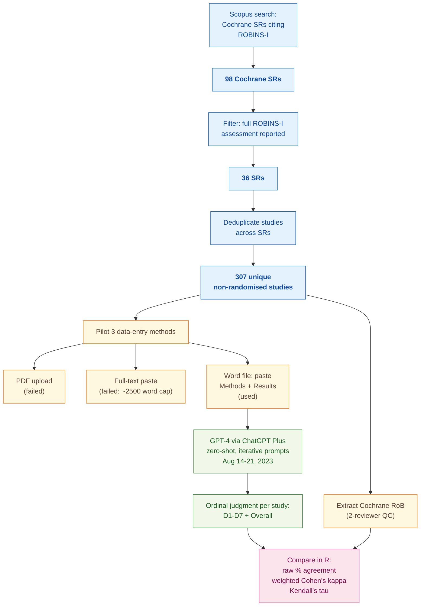

> [!success] **TL;DR**
> GPT-4 reaches a fair but uneven level of agreement with Cochrane reviewers on ROBINS-I — strong enough to consider as an extra independent reviewer in a human-in-the-loop workflow, nowhere near strong enough to replace one.

## Structured abstract

> [!info] A plain-language summary built from this paper's discourse-graph nodes. Numbers and findings link back to specific EVD nodes — click any link to drill in.

### Question

Can a general-purpose chatbot (GPT-4) judge how trustworthy a non-randomised medical study is, the same way a trained Cochrane reviewer would? The authors test this on ROBINS-I (Risk Of Bias In Non-randomised Studies of Interventions), a structured tool that grades each study across seven specific concerns and gives an overall verdict. They feed the same studies to GPT-4 and to the published Cochrane judgments, then measure how often the two agree. They also propose a four-part protocol for using LLMs (large language models — AI systems trained to read and write text) inside systematic reviews. See [[QUE - How does LLM performance vary across specific structured tasks in systematic review and evidence appraisal workflows?]].

### Methods

**Design.** This is a single-case methodological study that benchmarks zero-shot GPT-4 risk-of-bias judgments against the published Cochrane reviewers' judgments on the same primary studies. Zero-shot means the model is never shown worked examples — it just gets the task description and the study text.

**Tools.** The authors used GPT-4 through the ChatGPT Plus consumer interface, first via Code Interpreter and then via standard chat. They graded studies with the ROBINS-I tool, which has seven domains (D1 confounding, D2 participant selection, D3 classification of interventions, D4 deviations from intended interventions, D5 missing data, D6 measurement of outcomes, D7 selective reporting) plus an Overall judgment. They computed agreement statistics in R, a free statistical-analysis language.

**Procedure.** The authors searched Scopus for every Cochrane systematic review that cited the original ROBINS-I paper, then kept only fully-published medical reviews that actually used ROBINS-I. They piloted three ways to feed each study into ChatGPT. Direct PDF upload through Code Interpreter failed because the text came back fragmented. Pasting the entire full text failed because it ran past an estimated 2500-word ceiling. The workaround that finally worked was converting each PDF to a Word file and pasting in only the Methods and Results sections, which are the parts a human reviewer leans on for risk-of-bias judgments. The authors note plainly that these prompt and data-entry choices "were not prespecified" — they were tuned on the fly. One reviewer pulled the published Cochrane judgment for each study and a second reviewer double-checked it. They then compared GPT-4 against Cochrane using three agreement statistics: raw percent agreement, weighted Cohen's kappa, and Kendall's tau.

**Sample.** The Scopus search returned 98 Cochrane systematic reviews. Of these, 36 included a complete ROBINS-I assessment. After dropping studies that appeared in more than one review, the analytic sample landed at 307 unique non-randomised primary studies. Each study contributed eight ordinal judgments (seven domains plus Overall). The unit of analysis was a single study-by-domain judgment.

### Findings

- **GPT-4 agrees with Cochrane only at a fair level overall.** Across all 307 studies and all eight ROBINS-I judgments, GPT-4 and the Cochrane reviewers landed on the same answer 61% of the time. Kendall's tau (a 0-to-1 correlation where 1 means perfect agreement) was 0.35, which the authors' own scale calls "fair." Weighted Cohen's kappa (another 0-to-1 agreement statistic that adjusts for chance and partial credit on close calls) was much weaker at 0.13, putting it in the "slight" band. Domain-by-domain, raw agreement ranged from 31% on D4 (deviations from intended interventions) up to 71% on D3 (classification of interventions). Confounding (D1) was where GPT-4 struggled most, agreeing only 47% of the time. [[EVD - GPT-4 achieved 61% raw percent agreement with Cochrane reviewers on ROBINS-I overall risk of bias with Kendall coefficient of 0.35 - @hasanIntegratingLargeLanguage2024]]

### Claim supported

These findings support two related claims. The headline result — fair-to-moderate agreement that varies sharply by domain — backs [[CLM - LLMs achieve moderate accuracy on structured quality appraisal tasks but cannot yet substitute for expert human judgment]]. The authors' practical response to that result, a four-part framework covering rationale, protocol, execution, and reporting for LLM use in reviews, backs [[CLM - A structured protocol for integrating LLMs into systematic reviews must specify rationale, model selection, prompt engineering, human verification procedures, and reporting standards]]. For someone weighing whether to plug GPT-4 into a real Cochrane workflow, the message is simple: today, GPT-4 can serve as one independent reviewer alongside a human, but it cannot replace the human. The authors say so directly — "pairing artificial intelligence with an independent human reviewer remains required at present."

### Caveats

- **The prompts and data-entry steps were tuned on the fly.** The authors openly state their prompt wording and the Word-paste workflow were refined iteratively until the system produced "sensical output," with no pre-registration. That means the reported 61% agreement may reflect a polished, optimised pipeline rather than typical zero-shot performance, and someone trying to replicate it from scratch could land on different numbers. [[CVT - Prompts and data entry processes for GPT-4 ROBINS-I assessment were developed iteratively without prespecification limiting replicability]]

### Methods at a glance

---

## Quality appraisal

> [!info] Risk-of-bias and validity assessment, synthesized from this paper's discourse-graph nodes and grounded in the same paper this page's top trust-signal chips summarize. Covers *methodological quality* — the TRIPOD-LLM table below covers *reporting compliance* instead.
> <dl class="callout-legend">
> <dt>● Low risk</dt><dd>No meaningful threat to this domain identified</dd>
> <dt>◐ Some risk</dt><dd>A real but non-fatal limitation</dd>
> <dt>○ High risk</dt><dd>A significant, unaddressed threat to validity</dd>
> </dl>

| Domain | Rating | Quote |
| --- | :---: | --- |
| **Construct validity** — does the metric actually measure the construct? | 🟡 | *"Kappa coefficient was low across all domains."* `Results, p.2`, weighted kappa (0.13 overall) diverges sharply from the 61% raw-agreement headline figure — the three reported statistics tell different stories about the same underlying construct |
| **Internal validity** — could the comparison be biased? | 🔴 | *"The processes of data entry and prompt development were done iteratively until data were appropriately uploaded and a sensical output was obtained (ie, these processes were not prespecified)."* `Methods, p.2` |
| **External validity** — do findings generalize? | 🟡 | *"Time stamp of AI use: between 14 August 2023 and 21 August 2023."* `Table 2, p.3`, a single GPT-4 snapshot tested in a one-week window via the consumer ChatGPT Plus interface, with no comparison to another model or a non-LLM baseline |
| **Statistical rigor** — appropriate uncertainty + comparisons? | 🟡 | *"A recent comparison of reliability coefficients for ordinal rating scales suggested that the differences between these measures can vary at different agreement levels."* `Discussion, p.4`, three agreement statistics are reported but none carries a confidence interval or significance test |
| **Reproducibility** — code, data, determinism? | 🔴 | *"Data are available upon reasonable request... Analysed datasheet is available upon request."* `Data availability statement, p.4`, no code released and no public data release |
| **Data leakage**: could models have seen this data pretraining? | 🔴 | Not reported |
| **Baseline adequacy**: is there a meaningful floor to beat? | 🔴 | Not reported, no naive or non-LLM baseline is compared against GPT-4's agreement rate |
| **Train/dev/test hygiene**: are data splits kept separate? | 🔴 | Not applicable, zero-shot GPT-4 evaluation with no training, development, or test split described |
| **Multiple-comparisons correction**: controlled for repeated testing? | 🔴 | Not reported, 8 ROBINS-I domains × 3 agreement statistics are compared with no stated correction |
| **Human-baseline comparability**: is there a human reference point? | 🟢 | *"While their RoB assessment is certainly not a reference standard and can be quite poor for some domains such as confounding, the rigorous and multidomain evaluation conducted by pairs of independent reviewers in these reviews makes them a reasonable comparison for novel LLM application."* `Discussion, p.4` |

**Bottom line.** GPT-4 reaches a fair but uneven level of agreement with Cochrane reviewers on ROBINS-I — strong enough to consider as an extra independent reviewer in a human-in-the-loop workflow, nowhere near strong enough to replace one. The biggest threats to the result are not the headline numbers themselves but the unprespecified prompt pipeline, the missing GPT-4 snapshot and inference settings, and the absence of a held-out evaluation set; before this approach could be deployed, those would all need to be fixed and the experiment rerun against a frozen, named GPT-4 version with confidence intervals on every reported statistic.

> [!tip] **Applicable external appraisal frameworks beyond TRIPOD-LLM** (already covered by the table below): **MI-CLAIM** (Norgeot et al. 2020) for clinical-AI minimum information · **MINIMAR** (Hernandez-Boussard et al. 2020) for medical-AI reporting · **PROBAST+AI** (Wolff et al. 2019 base; AI extension in development) for prediction-model risk of bias

---

## TRIPOD-LLM reporting summary

> [!info] Reporting compliance for this paper, mapped to the TRIPOD-LLM checklist (Title/Abstract/Introduction items 1–4, Methods items 5a–15, Results items 16a–18). TRIPOD-LLM is a clinical-ML guideline being applied here to a non-clinical methodological case study — where an item's own wording says "healthcare context" or "care pathway," it's read as "review-workflow context" instead. Item 17 (Performance) is reported per-EVD; see each EVD's `## Other Notes`.
> 

> ●Fully reported
> ◐Partial / unclear
> ○Not reported
> –Not applicable
> 

| # | Item | ✓ | Quote |
| --- | --- | :---: | --- |
| **1** | Title | ⚠️ | *"Integrating large language models in systematic reviews: a framework and case study using ROBINS-I for risk of bias assessment"* `Title` |
| **2** | Abstract | ➖ | Assessed separately under TRIPOD-LLM's own Abstract extension, not scored here |
| **3a** | Background — context + rationale | ✅ | *"Systematic reviews are the key initial step in decision-making in healthcare. However, they are costly, require a long time to complete and become outdated, especially in areas of rapidly evolving evidence."* `Introduction, p.1` |
| **3b** | Background — target population | ⚠️ | *"All original non-randomised studies included in the identified SRs were included as long as the ROBINS-I tool was used for their RoB assessment in the SR."* `Methods, p.2` |
| **4** | Objectives | ✅ | *"In this exposition, we propose a framework for incorporating LLMs into systematic reviews and employ GPT-4 for RoB assessment in a case study using the Cochrane Collaboration's Risk Of Bias In Non-randomised Studies of Interventions (ROBINS-I) tool."* `Introduction, p.2` |
| **5a** | Data sources | ✅ | *"We searched Scopus to identify all systematic reviews (SRs) from the Cochrane Collaboration that cited the original publication of the ROBINS-I tool."* `Methods, p.2` |
| **5b** | Data points + distribution | ⚠️ | *"After deduplicating studies that appeared in multiple SRs, we finalised our sample with 307 unique individual studies (online supplemental figure; box 1 and box 2)."* `Results, p.2` — distribution across ordinal RoB categories not reported |
| **5c** | Date range of data | ⚠️ | *"Time stamp of AI use: between 14 August 2023 and 21 August 2023."* `Table 2, p.3` — date range of the underlying primary studies/SRs and GPT-4 training cutoff not disclosed |
| **5d** | Pre-processing / quality checks | ✅ | *"we converted the PDF to a Word file and extracted only the Methods and Results sections from each study for RoB assessment because these are the sections on which human reviewers focus for RoB assessments."* `Methods, p.2` |
| **5e** | Missing / imbalanced data | ⚠️ | *"We also had to use ChatGPT to translate a few studies published in languages other than English, truncate text when it was too lengthy and convert files format, all may have affected RoB judgements."* `Discussion, p.4` |
| **6a** | LLM name + version | ⚠️ | *"GPT-4 model accessed via the ChatGPT plus version."* `Table 2, p.3` — specific snapshot/version not reported |
| **6b** | Development process | ➖ | Not applicable — no model development/training; off-the-shelf zero-shot use of GPT-4 |
| **6c** | Inference settings / prompting | ❌ | Not reported |
| **6d** | Output | ✅ | *"This study evaluates GPT-4 agreement with human reviewers in assessing the risk of bias using the Risk Of Bias In Non-randomised Studies of Interventions (ROBINS-I) tool"* `Abstract, p.1` |
| **6e** | Classification thresholds | ➖ | Not applicable — ordinal LLM output mapped directly to ROBINS-I categories, no probability cutoffs |
| **7a** | Quality metrics | ✅ | *"We measured the agreement between Cochrane reviewers and GPT-4 comparing the ordinal judgements about RoB using raw per cent agreement, weighted Cohen's kappa and Kendall's τ for correlation."* `Methods, p.2` |
| **7b** | Relevance to downstream use | ❌ | Not reported |
| **7c** | Outcome definition | ✅ | *"The magnitude of agreement based on values of a correlation or kappa coefficient was considered to be slight (0-0.20), fair (0.21-0.40), moderate (0.41-60), substantial (0.61-0.80) and almost perfect (0.81-1.0)."* `Methods, p.2` |
| **7d** | Subjective interpretation | ⚠️ | *"While their RoB assessment is certainly not a reference standard and can be quite poor for some domains such as confounding, the rigorous and multidomain evaluation conducted by pairs of independent reviewers in these reviews makes them a reasonable comparison for novel LLM application."* `Discussion, p.4` |
| **7e** | Comparison | ⚠️ | *"The current case study suggests an overall fair agreement between Cochrane reviewers and ChatGPT-4 in using ROBINS-I for assessing RoB in non-randomised studies of intervention."* `Discussion, p.3` — no comparison to other LLMs or a non-LLM baseline |
| **8a** | Annotation guidelines | ➖ | *"One reviewer extracted RoB judgements from each Cochrane SR and a second reviewer verified the extraction."* `Methods, p.2` — no de novo annotation guidelines; reference labels are the published Cochrane judgments |
| **8b** | Annotators + IAA | ⚠️ | *"One reviewer extracted RoB judgements from each Cochrane SR and a second reviewer verified the extraction."* `Methods, p.2` — no quantitative IAA reported (no independent re-rating performed) |
| **8c** | Annotator background | ❌ | Not reported |
| **9a** | Prompt design | ❌ | *"The processes of data entry and prompt development were done iteratively until data were appropriately uploaded and a sensical output was obtained (ie, these processes were not prespecified)."* `Methods, p.2` |
| **9b** | Prompt-development data | ❌ | Not reported |
| **10** | Summarization | ➖ | Not applicable — judgement task, not summarization |
| **11** | Instruction tuning / alignment | ➖ | Not applicable — off-the-shelf GPT-4, no fine-tuning or RLHF beyond OpenAI's defaults |
| **12** | Compute | ❌ | *"this was unsuccessful due to the current estimated 2500-word limit for GPT-4 prompts."* `Methods, p.2` — GPU/API compute, cost, and wall-clock time not reported |
| **13** | Ethical approval | ✅ | *"Ethics approval Not applicable."* `Declarations, p.4` |
| **14a** | Funding | ✅ | *"The authors have not declared a specific grant for this research from any funding agency in the public, commercial or not-for-profit sectors."* `Declarations, p.4` |
| **14b** | Conflicts of interest | ✅ | *"Competing interests None declared."* `Declarations, p.4` |
| **14c** | Protocol | ❌ | *"these processes were not prespecified"* `Methods, p.2` — no protocol document referenced |
| **14d** | Registration | ➖ | Not applicable — methodological case study, not a registered clinical trial |
| **14e** | Data availability | ⚠️ | *"Data are available upon reasonable request. Search strategy, selection process flowchart, prompts and boxes containing included SRs and studies are available in the appendix. Analysed datasheet is available upon request."* `Declarations, p.4` — not a public release |
| **14f** | Code availability | ❌ | Not reported |
| **15** | Patient/public involvement | ✅ | *"Patients and/or the public were not involved in the design, or conduct, or reporting, or dissemination plans of this research."* `Declarations, p.4` |
| **16a** | Flow of data | ✅ | *"The initial search yielded 98 SRs, from which 36 provided full ROBINS-I assessment. After deduplicating studies that appeared in multiple SRs, we finalised our sample with 307 unique individual studies (online supplemental figure; box 1 and box 2)."* `Results, p.2` |
| **16b** | Characteristics | ❌ | Not reported |
| **16c** | Distribution comparison | ➖ | Not applicable — no subgroup analysis by clinical area or study design reported |
| **16d** | N per analysis | ✅ | *"Agreement measures are summarised in table 1 for each ROBINS-I domain and for overall judgements."* `Results, p.2` |
| **17** | Performance | `per-EVD` | Reported per-EVD. See each EVD's `## Other Notes`. |
| **18** | LLM updating | ➖ | *"Importantly, the AI model and interface used need to be explicitly reported along with a timestamp of when AI was used because the output may vary over time for the same input and prompts."* `Results, p.3` — not applicable, single-shot evaluation, no model updating reported |
