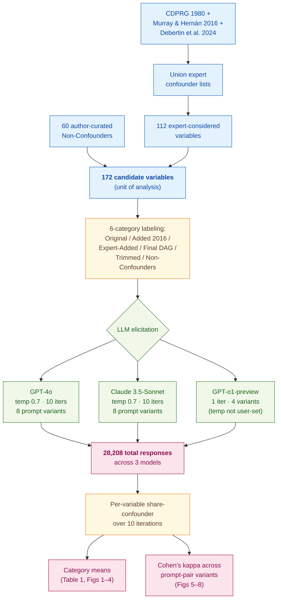

> [!success] **TL;DR**
> The headline finding — that GPT-4o and Claude flag expert-rejected variables as confounders at 65 to 74 percent rates and flip 16 percent of their answers on option-order alone — is methodologically credible and lands the central claim cleanly. The biggest open question is generalization: a single famous case study, deliberately chosen because it is in the training data, is the easiest possible test, and the models still fail it.

## Structured abstract

> [!info] A plain-language summary built from this paper's discourse-graph nodes. Numbers and findings link back to specific EVD nodes — click any link to drill in.

### Question

Can today's large language models (LLMs) reliably tell a researcher which variables to control for when studying cause and effect from observational data — what statisticians call *confounders*? The authors test this on a famous medical case study where experts have already worked out the right answer, the Coronary Drug Project (CDP). They ask three off-the-shelf models the same confounder question 13,760 times each, varying how the question is phrased, and compare the answers to expert opinion. See [[QUE - Can LLMs act as repositories of causal knowledge for selecting confounders in observational research?]].

### Methods

**Design.** The authors run a ground-truth-anchored benchmark on a single causal-inference case study, with a built-in robustness check that compares each model's answers across eight different prompt phrasings.

**Tools.** They query three generalist LLMs: GPT-4o and Claude 3.5-Sonnet (each called 10 times per prompt at temperature 0.7 — the temperature setting controls how varied the model's answers are, with 0 meaning identical every time and higher values introducing more variability), plus GPT-o1-preview (called once because OpenAI does not let users change its temperature). Calls go through the standard `openai` and `anthropic` Python packages. The "ground truth" comes from three published expert sources on the Coronary Drug Project: CDPRG (1980), Murray and Hernán (2016), and Debertin et al. (2024). They explicitly skip medical-specialist LLMs (such as MedLLaMA-3 and BioMedLM) and explain why in the paper.

**Procedure.** The authors first build a list of 172 candidate variables by combining expert confounder lists with 60 hand-picked "non-confounders" (administrative variables, drug side effects, general physical-exam findings, sub-study-only measurements). For each variable they prompt the LLM with a fixed system message, three worked examples, and one multiple-choice question about whether the variable is a confounder. They test two prompting styles: a *direct* style that asks the question outright, and an *indirect* style that asks two separate cause-and-effect questions and only labels something a confounder if both come back positive. They also vary whether the model is asked to reason step-by-step, and they swap the order of the answer options to test for order sensitivity. Finally, they aggregate the 10 calls per prompt into a per-variable share, compare to expert labels, and compute Cohen's kappa across prompt variants.

**Sample.** The unit of analysis is a candidate confounder variable in the Coronary Drug Project. The 172 variables come from unioning three expert confounder lists (112 variables) plus 60 author-curated non-confounders. No variables are excluded. Across all three models this produces 28,208 LLM responses (13,760 each for GPT-4o and Claude, 688 for GPT-o1-preview). There are no human annotators — the "ground truth" labels come straight from the cited expert papers.

### Findings

- **The models flag wrong variables almost as often as right ones.** The fraction of expert-confirmed confounders that each model called a confounder ran 80 to 86 percent, but the fraction of expert-rejected variables (the "Trimmed" and "Non-Confounders" categories) that each model still wrongly called a confounder ran 65 to 74 percent. In the direct-prompt setting, all three models even flagged "Trimmed" expert-rejected variables as confounders *more* often than they flagged the "Added in 2016" expert-approved set. Claude labeled 40 percent of pure non-confounders as confounders 100 percent of the time. GPT-o1-preview was the worst offender, calling 73 percent of non-confounders confounders and 95 percent of Trimmed variables confounders. [[EVD - LLMs designated expert-selected confounders in CDP as confounders at similar rates to variables trimmed from causal diagrams - @huntington-kleinLLMsActRepositories2024]]

- **The same model gives different answers when you reword the question.** Cohen's kappa, which measures agreement between two raters on a scale where 1.0 is perfect agreement and 0 is chance, came out at only 0.16 to 0.24 when comparing each model's direct-prompt answers to its indirect-prompt answers. Even more strikingly, when the authors simply shuffled the order of the multiple-choice options (A/B/C versus C/B/A), 36.7 percent of Claude's variable designations changed (kappa = 0.41) and 65.7 percent of GPT-4o's changed (kappa = 0.13). In the most damning robustness number, 16.3 percent of GPT-4o variables flipped from "never a confounder" to "always a confounder" — or vice versa — based on option order alone. [[EVD - LLM confounder designation was highly inconsistent with Cohen kappa as low as 0.16 across prompt variations - @huntington-kleinLLMsActRepositories2024]]

### Claim supported

These findings together support the broader claim that [[CLM - LLMs do not yet serve as reliable repositories of causal knowledge for confounder selection]]. The practical takeaway: a researcher who hands their variable list to GPT-4o or Claude today will get a confounder shortlist that hits most of the right answers but also pulls in roughly two-thirds of the wrong ones, and that shortlist will change if they reword the prompt. That is not yet a tool that can replace — or even reliably triage — expert causal-graph work.

### Caveats

- **One famous case study limits how far the conclusions reach.** The Coronary Drug Project was deliberately chosen because the expert ground truth is likely in the LLMs' training data, which is exactly the easiest test case. Results may look worse — or differently bad — on causal questions whose answers are not already well-documented online. [[CVT - The Huntington-Klein study used a single causal dataset limiting the scope of conclusions about LLM causal knowledge]]

### Methods at a glance

---

## Quality appraisal

> [!info] Risk-of-bias and validity assessment, synthesized from this paper's discourse-graph nodes and grounded in the same paper this page's top trust-signal chips summarize. Covers *methodological quality* — the TRIPOD-LLM table below covers *reporting compliance* instead.
> <dl class="callout-legend">
> <dt>● Low risk</dt><dd>No meaningful threat to this domain identified</dd>
> <dt>◐ Some risk</dt><dd>A real but non-fatal limitation</dd>
> <dt>○ High risk</dt><dd>A significant, unaddressed threat to validity</dd>
> </dl>

| Domain | Rating | Quote |
| --- | :---: | --- |
| **Construct validity** — does the metric actually measure the construct? | 🟢 | *"expert-selected covariates had an 80-86% chance of being correctly designated as confounders, but expert-rejected covariates had an 65-74% chance of being incorrectly designated as confounders."* `Conclusion, p.18`, the metric maps directly onto the deployment-relevant question of whether an LLM's confounder shortlist is trustworthy |
| **Internal validity** — could the comparison be biased? | 🟡 | *"it is possible that the LLMs are in fact not recalling expert opinion from its text data and instead are doing a better job of applying causal reasoning to identify confounders than the experts; we cannot prove that in the case of a deviation the experts are more correct than the LLMs, only that they are not the same."* `Conclusion, p.18`, the "ground truth" is itself expert opinion with no independent oracle |
| **External validity** — do findings generalize? | 🔴 | *"One could reasonably believe that LLM confounder selection in a less well-studied case would be less effective."* `Conclusion, p.18`, a single, deliberately well-documented case study |
| **Statistical rigor** — appropriate uncertainty + comparisons? | 🟡 | *"Chi-square tests of a statistically significant relationship between the two prompting methods are not included here since these tests are not identified when one of the rows or columns contains only zero values, which happens frequently in this case."* `p.14, footnote 6`, formal significance testing is explicitly foregone |
| **Reproducibility** — code, data, determinism? | 🟡 | *"our code, which can be easily revised to test future LLM tools, will be available at https://osf.io/spzbu/."* `Conclusion, p.19`, code is released, but temperature 0.7 was deliberately chosen for variability, making the closed-model runs non-deterministic |
| **Data leakage**: could models have seen this data pretraining? | 🔴 | *"the prominent role of the CDP means that studies concerning confounding in the CDP are likely to be in the LLM training data... If discussion of confounding in the CDP is in the training data, then we know that discussions of expert opinions on causal links for the variables relevant to the CDP are in the training data."* `p.3`, the leakage is knowingly built into the design rather than mitigated |
| **Baseline adequacy**: is there a meaningful floor to beat? | 🟡 | *"we have a set of 60 variables that are in the CDP dataset but are very unlikely to be confounders, which we call 'Non-Confounders'."* `Methods, p.4`, a curated negative-baseline set exists, but no naive or random-guess baseline rate is explicitly reported alongside it |
| **Train/dev/test hygiene**: are data splits kept separate? | 🔴 | Not applicable, no training, development, or test split is described; all 172 candidate variables are queried directly at inference time |
| **Multiple-comparisons correction**: controlled for repeated testing? | 🔴 | Not reported, 3 models × 8 prompt variants × 6 confounder categories are compared with no stated correction |
| **Human-baseline comparability**: is there a human reference point? | 🔴 | Not applicable, the "ground truth" comes from previously published expert confounder lists (CDPRG 1980; Murray and Hernán 2016; Debertin et al. 2024) rather than a live human panel run alongside the LLMs in this study |

**Bottom line.** The headline finding — that GPT-4o and Claude flag expert-rejected variables as confounders at 65 to 74 percent rates and flip 16 percent of their answers on option-order alone — is methodologically credible and lands the central claim cleanly. The biggest open question is generalization: a single famous case study, deliberately chosen because it is in the training data, is the easiest possible test, and the models still fail it. Before any researcher acts on an LLM's confounder shortlist in practice, this benchmark would need to be replicated on causal questions where the answer is *not* already documented online.

> [!tip] **Applicable external appraisal frameworks beyond TRIPOD-LLM** (already covered by the table below): **HELM** (Liang et al. 2022) for holistic LLM-evaluation principles · **Datasheets for Datasets** (Gebru et al. 2021) for the evaluation corpus · **Model Cards** (Mitchell et al. 2019) for the LLMs being evaluated · **PROBAST** for the underlying causal-inference / confounder-selection framing.

---

## TRIPOD-LLM reporting summary

> [!info] Reporting compliance for this paper, mapped to the TRIPOD-LLM checklist (Title/Abstract/Introduction items 1–4, Methods items 5a–15, Results items 16a–18). TRIPOD-LLM is a clinical-ML guideline being applied here to a non-clinical AI-research benchmark — where an item's own wording says "healthcare context" or "care pathway," it's read as "research-evaluation context" / "research workflow" instead. Item 17 (Performance) is reported per-EVD; see each EVD's `## Other Notes`.
> 

> ●Fully reported
> ◐Partial / unclear
> ○Not reported
> –Not applicable
> 

| # | Item | ✓ | Quote |
| --- | --- | :---: | --- |
| **1** | Title | ⚠️ | *"Do LLMs Act as Repositories of Causal Knowledge?"* `Title, p.1` |
| **2** | Abstract | ➖ | Assessed separately under TRIPOD-LLM's own Abstract extension, not scored here |
| **3a** | Background — context + rationale | ✅ | *"Large language models (LLMs) offer the potential to automate a large number of tasks that previously have not been possible to automate, including some in science. There is considerable interest in whether LLMs can automate the process of causal inference"* `Abstract, p.1` |
| **3b** | Background — target population | ⚠️ | *"We use the case of confounding in the Coronary Drug Project (CDP), for which there are several studies listing expert-selected confounders that can serve as a ground truth."* `Abstract, p.1` |
| **4** | Objectives | ✅ | *"Our general approach to checking LLM capabilities to designate variables as confounders involves taking a set of confounders identified by experts, and for each having the LLM designate whether or not it is a confounder."* `Methods, p.4` |
| **5a** | Data sources | ✅ | *"We use confounder sets from three different studies. Confounders included in the original CDPRG (1980) study are referred to as the 'Original' confounder set."* `Methods, p.4` |
| **5b** | Data points + distribution | ✅ | *"we query the LLM ten times each for a total of 13,760 LLM-generated responses each. For the GPT-o1-preview model, we only query the LLM once, and only use four of the prompt variations ... for a total of 688 LLM-generated responses."* `Data, p.7` |
| **5c** | Date range of data | ⚠️ | *"Responses for all confounder categories other than 'Non-Confounders' were gathered between October 9 and 15, 2024 ... 'Non-confounder' responses were collected between November 23 and December 8, 2024."* `Data, p.7` — LLM training-data cutoffs not disclosed |
| **5d** | Pre-processing / quality checks | ⚠️ | *"we take several different approaches to designing prompts to query LLMs about whether a given variable is a confounder in this context. First, we distinguish between a 'direct' prompting approach and an 'indirect' prompting approach."* `Methods, p.4` |
| **5e** | Missing / imbalanced data | ⚠️ | *"we were unable to find a way to adjust the Indirect-method prompt that would avoid content flagging. As such, for GPT-o1-preview, 'Non-confounders' were queried using this additional line in the prompt"* `Methods, p.6` — category-size imbalance (Non-Confounders n=60 vs. smaller expert sets) not rebalanced |
| **6a** | LLM name + version | ✅ | *"Given our list of candidate confounders, we give these prompts to generalist LLM models, specifically GPT-4o, GPT-o1-preview (which is designed to engage in multi-step reasoning), and Claude 3.5 Sonnet."* `Methods, p.5` |
| **6b** | Development process | ➖ | Not applicable — no model training or fine-tuning; off-the-shelf inference only |
| **6c** | Inference settings / prompting | ✅ | *"GPT-4o and Claude 3.5 Sonnet are run using a temperature of 0.7, and each prompt is given ten times ... GPT-o1-preview does not allow users to raise the temperature."* `Methods, p.6` |
| **6d** | Output | ✅ | *"A. Not a confounding variable / B. A confounding variable / C. Not sure."* `Methods, p.5` |
| **6e** | Classification thresholds | ✅ | *"The confounder designation is determined for each pair of responses, and averaged to give the share of the time that the LLM designates the variable as a confounder."* `Methods, p.7` (footnote 3) |
| **7a** | Quality metrics | ✅ | *"Table 1: Share of Variables Designated as Confounders"* `Table 1, p.7` |
| **7b** | Relevance to downstream use | ✅ | *"expert-selected covariates had an 80-86% chance of being correctly designated as confounders, but expert-rejected covariates had an 65-74% chance of being incorrectly designated as confounders."* `Discussion, p.18` |
| **7c** | Outcome definition | ✅ | *"we use confounder sets from three different studies"* `Methods, p.4` — confounder status as labeled by CDPRG (1980), Murray & Hernán (2016), and Debertin et al. (2024) is used as ground truth |
| **7d** | Subjective interpretation | ➖ | Not applicable — no human raters of the LLM output; the designation is mechanically derived from the LLM's letter response |
| **7e** | Comparison | ✅ | *"For GPT o1-preview, there was fair agreement across methods, with 87.7% of the variables designated the same way; however, this was driven partially by the model's tendency to label everything a confounder, so the Cohen's kappa was still low at .16."* `Results, p.14` |
| **8a** | Annotation guidelines | ➖ | Not applicable — no human annotation phase; variable-category assignments inherit directly from the cited source papers |
| **8b** | Annotators + IAA | ➖ | Not applicable |
| **8c** | Annotator background | ➖ | Not applicable |
| **9a** | Prompt design | ✅ | *"In the direct approach, we ask the LLM whether a given variable is a confounder, in the following format: I have a data set consisting only of people who have been assigned to take a certain medication X..."* `Methods, p.4` |
| **9b** | Prompt-development data | ⚠️ | *"Full prompts are shown in Appendix B."* `Methods, p.5` — few-shot exemplars are fixed and used for all queries; no held-out prompt-development split described |
| **10** | Summarization | ➖ | Not applicable — not a summarization task |
| **11** | Instruction tuning / alignment | ➖ | Not applicable — off-the-shelf models only, no fine-tuning or RLHF performed by the authors |
| **12** | Compute | ❌ | Not reported — API costs and token counts not disclosed |
| **13** | Ethical approval | ➖ | Not applicable — no human-subjects data; CDP variable lists are public |
| **14a** | Funding | ❌ | Not reported — the only acknowledgment is *"Thanks to Phuong Nguyen and Meet Panjwani for research assistance."* `p.1` |
| **14b** | Conflicts of interest | ❌ | Not reported |
| **14c** | Protocol | ❌ | Not reported |
| **14d** | Registration | ➖ | Not applicable — not a registered clinical study |
| **14e** | Data availability | ⚠️ | *"our code, which can be easily revised to test future LLM tools, will be available at https://osf.io/spzbu/."* `Conclusion, p.19` — code availability confirmed, raw LLM response release not separately confirmed |
| **14f** | Code availability | ✅ | *"our code, which can be easily revised to test future LLM tools, will be available at https://osf.io/spzbu/."* `Conclusion, p.19` |
| **15** | Patient/public involvement | ➖ | Not applicable |
| **16a** | Flow of data | ✅ | *"list of 172 potential confounders to consider across eight different prompt variations. For the Claude 3.5-Sonnet and GPT-4o models, we query the LLM ten times each for a total of 13,760 LLM-generated responses each."* `Data, p.7` |
| **16b** | Characteristics | ✅ | *"fall into four main categories: administrative variables; anticipated side-effects, or known metabolites, of active CDP treatments; general medical information collected from routine physical examination; and sub-study data collected only on a sample of patients."* `Methods, p.4` |
| **16c** | Distribution comparison | ➖ | Not applicable — no clinical-outcome subgroups |
| **16d** | N per analysis | ✅ | *"list of 172 potential confounders to consider across eight different prompt variations"* `Data, p.7` |
| **17** | Performance | `per-EVD` | Reported per-EVD. See each EVD's `## Other Notes`. |
| **18** | LLM updating | ➖ | Not applicable — authors note their code is designed to be re-run on future LLM releases, but no within-paper updating is performed |
