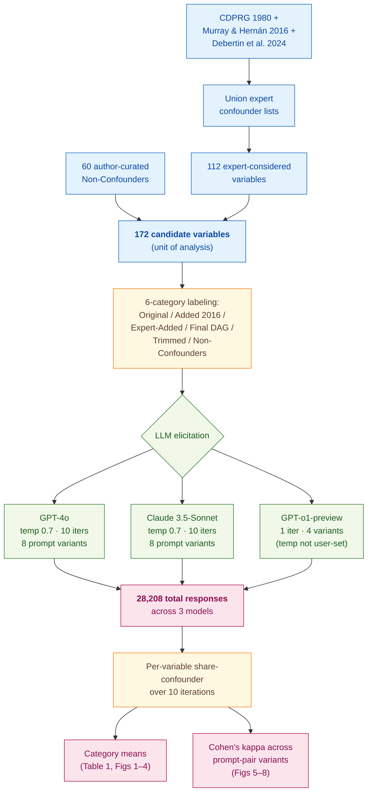

> [!success] **TL;DR**
> The headline finding — that GPT-4o and Claude flag expert-rejected variables as confounders at 65 to 74 percent rates and flip 16 percent of their answers on option-order alone — is methodologically credible and lands the central claim cleanly. The biggest open question is generalization: a single famous case study, deliberately chosen because it is in the training data, is the easiest possible test, and the models still fail it.

## Structured abstract

> [!info] A plain-language summary built from this paper's discourse-graph nodes. Numbers and findings link back to specific EVD nodes — click any link to drill in.

### Question

Can today's large language models (LLMs) reliably tell a researcher which variables to control for when studying cause and effect from observational data — what statisticians call *confounders*? The authors test this on a famous medical case study where experts have already worked out the right answer, the Coronary Drug Project (CDP). They ask three off-the-shelf models the same confounder question 13,760 times each, varying how the question is phrased, and compare the answers to expert opinion. See [[QUE - Can LLMs act as repositories of causal knowledge for selecting confounders in observational research?]].

### Methods

**Design.** The authors run a ground-truth-anchored benchmark on a single causal-inference case study, with a built-in robustness check that compares each model's answers across eight different prompt phrasings.

**Tools.** They query three generalist LLMs: **GPT-4o** and **Claude 3.5-Sonnet** (each called 10 times per prompt at temperature 0.7 — the temperature setting controls how varied the model's answers are, with 0 meaning identical every time and higher values introducing more variability), plus **GPT-o1-preview** (called once because OpenAI does not let users change its temperature). Calls go through the standard `openai` and `anthropic` Python packages. The "ground truth" comes from three published expert sources on the Coronary Drug Project: CDPRG (1980), Murray and Hernán (2016), and Debertin et al. (2024). They explicitly skip medical-specialist LLMs (such as MedLLaMA-3 and BioMedLM) and explain why in the paper.

**Procedure.** The authors first build a list of 172 candidate variables by combining expert confounder lists with 60 hand-picked "non-confounders" (administrative variables, drug side effects, general physical-exam findings, sub-study-only measurements). For each variable they prompt the LLM with a fixed system message, three worked examples, and one multiple-choice question about whether the variable is a confounder. They test two prompting styles: a *direct* style that asks the question outright, and an *indirect* style that asks two separate cause-and-effect questions and only labels something a confounder if both come back positive. They also vary whether the model is asked to reason step-by-step, and they swap the order of the answer options to test for order sensitivity. Finally, they aggregate the 10 calls per prompt into a per-variable share, compare to expert labels, and compute Cohen's kappa across prompt variants.

**Sample.** The unit of analysis is a candidate confounder variable in the Coronary Drug Project. The 172 variables come from unioning three expert confounder lists (112 variables) plus 60 author-curated non-confounders. No variables are excluded. Across all three models this produces 28,208 LLM responses (13,760 each for GPT-4o and Claude, 688 for GPT-o1-preview). There are no human annotators — the "ground truth" labels come straight from the cited expert papers.

### Findings

- **The models flag wrong variables almost as often as right ones.** The fraction of expert-confirmed confounders that each model called a confounder ran 80 to 86 percent, but the fraction of expert-rejected variables (the "Trimmed" and "Non-Confounders" categories) that each model still wrongly called a confounder ran 65 to 74 percent. In the direct-prompt setting, all three models even flagged "Trimmed" expert-rejected variables as confounders *more* often than they flagged the "Added in 2016" expert-approved set. Claude labeled 40 percent of pure non-confounders as confounders 100 percent of the time. GPT-o1-preview was the worst offender, calling 73 percent of non-confounders confounders and 95 percent of Trimmed variables confounders. [[EVD - LLMs designated expert-selected confounders in CDP as confounders at similar rates to variables trimmed from causal diagrams - @huntington-kleinLLMsActRepositories2024]]

- **The same model gives different answers when you reword the question.** Cohen's kappa, which measures agreement between two raters on a scale where 1.0 is perfect agreement and 0 is chance, came out at only 0.16 to 0.24 when comparing each model's direct-prompt answers to its indirect-prompt answers. Even more strikingly, when the authors simply shuffled the order of the multiple-choice options (A/B/C versus C/B/A), 36.7 percent of Claude's variable designations changed (kappa = 0.41) and 65.7 percent of GPT-4o's changed (kappa = 0.13). In the most damning robustness number, 16.3 percent of GPT-4o variables flipped from "never a confounder" to "always a confounder" — or vice versa — based on option order alone. [[EVD - LLM confounder designation was highly inconsistent with Cohen kappa as low as 0.16 across prompt variations - @huntington-kleinLLMsActRepositories2024]]

### Claim supported

These findings together support the broader claim that [[CLM - LLMs do not yet serve as reliable repositories of causal knowledge for confounder selection]]. The practical takeaway: a researcher who hands their variable list to GPT-4o or Claude today will get a confounder shortlist that hits most of the right answers but also pulls in roughly two-thirds of the wrong ones, and that shortlist will change if they reword the prompt. That is not yet a tool that can replace — or even reliably triage — expert causal-graph work.

### Caveats

- **One famous case study limits how far the conclusions reach.** The Coronary Drug Project was deliberately chosen because the expert ground truth is likely in the LLMs' training data, which is exactly the easiest test case. Results may look worse — or differently bad — on causal questions whose answers are not already well-documented online. [[CVT - The Huntington-Klein study used a single causal dataset limiting the scope of conclusions about LLM causal knowledge]]

### Methods at a glance

---

## Critical appraisal

> [!info] A risk-of-bias and validity assessment across five domains, synthesized from this paper's discourse-graph nodes. Each domain gets a rating (🟢 Low risk · 🟡 Some concerns · 🔴 High risk) plus a brief, EVD-grounded justification. The TRIPOD-LLM table below covers *reporting compliance*; this section covers *methodological quality*.

| Domain | Rating | Justification |
| --- | :---: | --- |
| **Construct validity** — does the metric actually measure the construct? | 🟢 | Share-of-confounder-designations and Cohen's kappa map cleanly to the deployment-relevant constructs ("does the model agree with experts?" and "does the model give the same answer twice?"). The authors explicitly tie performance to the downstream task of building a causal diagram and explain why current accuracy falls short (TRIPOD-LLM 7b ✅). |
| **Internal validity** — could the comparison be biased? | 🟡 | The three models are queried on the same variable list with prompts reproduced verbatim in Appendix B, and significance comes from within-model prompt-pair comparisons rather than cross-model comparisons. But the "ground truth" is itself expert opinion, and the authors flag (p. 18) that an LLM could disagree with experts and still be right — there is no independent oracle. The non-confounders subgroup also required a content-flagging workaround for GPT-o1-preview that slightly changed the prompt for that subgroup. |
| **External validity** — do findings generalize? | 🔴 | The study uses one causal case study, and the authors deliberately picked CDP because its expert ground truth is likely in LLM training data (see [[CVT - The Huntington-Klein study used a single causal dataset limiting the scope of conclusions about LLM causal knowledge]]). Generalist LLMs only — medical-specialist models excluded by design. Findings on a single, well-documented epidemiology case do not tell us how LLMs would do on causal questions with sparser online discussion. |
| **Statistical rigor** — appropriate uncertainty + comparisons? | 🟡 | Ten iterations per prompt give within-variable variability, and Cohen's kappa is the right metric for cross-prompt agreement on categorical labels. But the paper reports point estimates without confidence intervals on category-level shares, and there is no multiple-comparison correction across the many model × prompt-variant × category cells. Class imbalance across the 6 categories (Original n=18; Non-Confounders n=60) is acknowledged but not handled. |
| **Reproducibility** — code, data, determinism? | 🟡 | Code is public at osf.io/spzbu (TRIPOD-LLM 14f ✅) and intended to be re-runnable on future LLMs; the 60-item Non-Confounder list is in Appendix A; prompts are in Appendix B. But the closed-source LLM calls carry irreducible run-to-run variance (temperature 0.7 explicitly chosen for variability), the LLM training-data cutoffs are not disclosed (TRIPOD-LLM 5c ⚠️), and re-running today against newer model snapshots will not reproduce the exact numbers. |

**Bottom line.** The headline finding — that GPT-4o and Claude flag expert-rejected variables as confounders at 65 to 74 percent rates and flip 16 percent of their answers on option-order alone — is methodologically credible and lands the central claim cleanly. The biggest open question is generalization: a single famous case study, deliberately chosen because it is in the training data, is the easiest possible test, and the models still fail it. Before any researcher acts on an LLM's confounder shortlist in practice, this benchmark would need to be replicated on causal questions where the answer is *not* already documented online.

> [!tip] **Applicable external appraisal frameworks beyond TRIPOD-LLM** (already covered by the table below): **HELM** (Liang et al. 2022) for holistic LLM-evaluation principles · **Datasheets for Datasets** (Gebru et al. 2021) for the evaluation corpus · **Model Cards** (Mitchell et al. 2019) for the LLMs being evaluated · **PROBAST** for the underlying causal-inference / confounder-selection framing.

---

## TRIPOD-LLM reporting summary

> [!info] Reporting compliance for this paper, mapped to the TRIPOD-LLM checklist (Methods items 5a–15 and Results items 16a–18). Compliance icons: ✅ fully reported · ⚠️ partially reported / unclear · ❌ should be reported but not reported · ➖ not applicable to this study. Item 17 (Performance) is reported per-EVD; see each EVD's `## Other Notes`.

| # | Item | ✓ | Reported in this study |
| --- | --- | :---: | --- |
| **5a** | Data sources | ✅ | Confounder lists from CDPRG (1980), Murray & Hernán (2016), and Debertin et al. (2024); plus 60 author-curated "Non-Confounder" variables from the CDP variable book (administrative / drug side-effects / general physical exam / sub-study-only). |
| **5b** | Data points + distribution | ✅ | 172 candidate confounders × 8 prompt variants × 10 iterations = 13,760 LLM responses each for Claude 3.5-Sonnet and GPT-4o; 172 × 4 × 1 = 688 for GPT-o1-preview. Distribution across 6 categories: Original, Added in 2016, Expert-Added, Final Expert DAG, Trimmed, Non-Confounders (counts in Appendix A). |
| **5c** | Date range of data | ⚠️ | LLM querying dates reported (Oct 9–15 2024 for non-Non-Confounder categories; Nov 23–Dec 8 2024 for Non-Confounders). Underlying CDP data range (1965–1985) noted. LLM training-data cutoffs not disclosed. |
| **5d** | Pre-processing / quality checks | ⚠️ | Variables hand-categorized into 6 expert sets; "as-measured-at-baseline vs. follow-up" distinction handled per-variable. Sanity check that CDP discussions are in LLM training data (asked GPT-4o and Claude about CDP confounding before main experiments). No formal data-quality check beyond that. |
| **5e** | Missing / imbalanced data | ⚠️ | Class imbalance across categories (Original n=18; Non-Confounders n=60) acknowledged; not rebalanced. GPT-o1-preview content-flagging required prompt edits for the Non-Confounders subgroup; the workaround is documented but creates a small subgroup-specific prompt difference. |
| **6a** | LLM name + version | ✅ | GPT-4o, Claude 3.5-Sonnet, GPT-o1-preview (generalist models). Justification for excluding medical-specialist LLMs (MedLLaMA-3, Galactica, BioMedLM) given. |
| **6b** | Development process | ➖ | No model training or fine-tuning; off-the-shelf inference only. |
| **6c** | Inference settings / prompting | ✅ | Temperature = 0.7 for GPT-4o and Claude 3.5; 10 iterations per prompt. GPT-o1-preview: single call (temperature not user-controllable). Eight prompt variants (direct/indirect × with/without reasoning × standard/alternate option order). API access via `openai` and `anthropic` Python packages. |
| **6d** | Output | ✅ | Multiple-choice letter response (A/B/C for direct; A/B/C/D for indirect) plus optional step-by-step reasoning. Per-variable share-of-confounder-designations across 10 iterations. |
| **6e** | Classification thresholds | ✅ | Direct method: variable = confounder iff response is "B" (or, in alternate ordering, "C"). Indirect method: variable = confounder iff *both* adherence and mortality questions return "A" or "B." Per-variable categorization for consistency analyses uses 0% / Mixed / 100% bins on the 10-call share. |
| **7a** | Quality metrics | ✅ | % of variables designated as confounder (mean over 10 iterations); Cohen's κ across prompt variants; % agreement; within-variable SD across iterations; bin distributions in 10pp bins. |
| **7b** | Relevance to downstream | ✅ | Authors explicitly map performance to the downstream task (building a DAG for CDP causal inference) and explain why current accuracy is insufficient: "expert-selected covariates had an 80–86% chance of being correctly designated as confounders, but expert-rejected covariates had an 65–74% chance of being incorrectly designated as confounders" (p. 18). |
| **7c** | Outcome definition | ✅ | Confounder status as labeled by published expert sources (CDPRG 1980; Murray & Hernán 2016; Debertin et al. 2024) — taken as ground truth for the recall-based hypothesis. |
| **7d** | Subjective interpretation | ➖ | No human raters of the LLM output; outcome is mechanically derived from the LLM letter response. The "ground truth" itself is expert opinion from cited papers — the authors explicitly flag (p. 18) that LLMs could in principle disagree with experts and still be right. |
| **7e** | Comparison | ✅ | Three models compared head-to-head; eight prompt variants compared; explicit comparison to prior recall-based studies (Long et al. 2023; Zečević et al. 2023) in the Introduction. |
| **8a** | Annotation guidelines | ➖ | No human annotation. Variable-category assignments inherit from the cited source papers; the rule is documented (e.g., footnote 1 on p. 4: no distinction between baseline-measured and theoretically-determined confounders). |
| **8b** | Annotators + IAA | ➖ | Not applicable (no human annotation phase). |
| **8c** | Annotator background | ➖ | Not applicable. |
| **9a** | Prompt design | ✅ | Full prompts for all 4 base templates (direct + reasoning, indirect + reasoning, direct no-reasoning, indirect no-reasoning) reproduced verbatim in Appendix B (pp. 22–25). System prompt, three few-shot exemplars, and the option-ordering variant all shown. |
| **9b** | Prompt-development data | ⚠️ | Three few-shot exemplars (SES/HRT, low-dose aspirin/ACE inhibitors, vitamin D/headache) are fixed and used for all queries; not derived from a held-out development set. Authors do not describe iterative prompt tuning beyond the four named variants. |
| **10** | Summarization | ➖ | Not a summarization task. |
| **11** | Instruction tuning / alignment | ➖ | No fine-tuning or RLHF performed by the authors; off-the-shelf models only. |
| **12** | Compute | ❌ | Not reported. API costs / token counts not disclosed. |
| **13** | Ethical approval | ➖ | Not applicable (no human-subjects data; CDP variable lists are public). |
| **14a** | Funding | ❌ | Not reported. Only acknowledgment is "Thanks to Phuong Nguyen and Meet Panjwani for research assistance" (p. 1 footnote). |
| **14b** | Conflicts of interest | ❌ | Not reported. |
| **14c** | Protocol | ❌ | Not reported. No pre-registration or protocol document referenced. |
| **14d** | Registration | ➖ | Not applicable (not a clinical study). |
| **14e** | Data availability | ⚠️ | Underlying CDP variable lists are public (NHLBI BioLINCC); the 60-item Non-Confounder list is given in Appendix A. Raw LLM responses promised to be released alongside code at https://osf.io/spzbu/ (status of raw responses not separately confirmed in the manuscript). |
| **14f** | Code availability | ✅ | Code at https://osf.io/spzbu/ (p. 19), explicitly intended to be re-runnable on future LLMs. |
| **15** | Patient/public involvement | ➖ | Not applicable. |
| **16a** | Flow of data | ✅ | 172 variables → 8 prompt variants × 10 iterations → 13,760 responses per model (Claude / GPT-4o); 4 variants × 1 iteration → 688 for GPT-o1. Aggregated to per-variable share, then to per-category mean (Table 1; Figs 1–4). |
| **16b** | Characteristics | ✅ | 6 variable categories enumerated in Appendix A (full lists); reasons for Non-Confounder status broken into 4 sub-categories in Appendix C. |
| **16c** | Distribution comparison | ➖ | Not applicable (no clinical-outcome subgroups). |
| **16d** | N per analysis | ✅ | n=172 variables consistent across all aggregate analyses; n=112 if Non-Confounders excluded (footnote 5, p. 11). Iteration counts per prompt clearly stated. |
| **17** | Performance | (per-EVD) | Reported per-EVD. See each EVD's `## Other Notes` for category-level confounder-designation shares (EVD on expert vs. trimmed) and Cohen's κ across prompt variants (EVD on inconsistency). |
| **18** | LLM updating | ➖ | Not applicable; authors note their code is designed to be re-run on future LLM releases, but no within-paper updating performed. |
