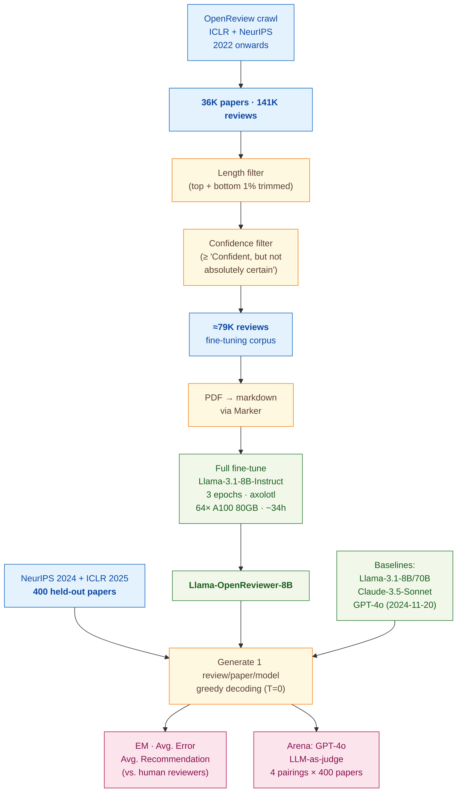

> [!success] **TL;DR**
> OpenReviewer's headline result, that a small, peer-review-fine-tuned 8-billion-parameter model lands on the human recommendation distribution while general-purpose chatbots inflate by 1.5 to 2.7 points on a 10-point scale, is concrete, and the supervised fine-tune is the obvious explanation given that the base model on its own gives the most inflated reviews. But two unresolved issues stop this from being deployment-ready as a pre-submission feedback tool: the entire evaluation is in-domain (ICLR + NeurIPS only), and the comparisons lack formal uncertainty estimates.

## Abstract

### Question

Can a smaller language model, trained specifically on real peer reviews, write more critical and realistic reviews of machine-learning papers than today's big general-purpose chatbots like GPT-4o or Claude? The authors built a fine-tuned model called OpenReviewer and ran it head-to-head against four general-purpose LLMs on 400 held-out NeurIPS 2024 and ICLR 2025 papers. Their core worry: off-the-shelf chatbots are too easy on papers, so the recommendations they suggest would mislead authors using them for pre-submission feedback. See [[QUE - Do specialized fine-tuned LLMs generate more critical and realistic peer reviews than general-purpose LLMs?]].

### Methods

**Design.** The authors ran a cross-sectional benchmark plus an arena-style preference test, comparing one fine-tuned model against four general-purpose chatbots on the same 400 held-out papers, scored against the real human reviews from OpenReview.

**Tools.** They built Llama-OpenReviewer-8B by full fine-tuning Llama-3.1-8B-Instruct (Meta's 8-billion-parameter open-weights chatbot) on roughly 79,000 ICLR and NeurIPS reviews. Training used axolotl (an open-source fine-tuning framework) plus Deepspeed ZeRO-3, Flash Attention V2, and the LIGER kernel, engineering libraries that let an 8-billion-parameter model train on 128,000-token paper PDFs. Baselines were Llama-3.1-8B-Instruct (the unmodified base), Llama-3.1-70B-Instruct, Anthropic's Claude-3.5-Sonnet (Oct. 22 release), and OpenAI's GPT-4o (2024-11-20 release). They served the open models with vLLM (a fast LLM-serving library) and called Claude and GPT-4o through OpenRouter (a unified API gateway). PDFs became markdown via Marker (an open-source PDF parser).

**Procedure.** The authors crawled OpenReview for ICLR and NeurIPS submissions from 2022 onwards. They trimmed the longest and shortest 1% of reviews, kept only reviews with confidence at "Confident, but not absolutely certain" or higher, and ended with about 79,000 reviews. They held out 400 papers from NeurIPS 2024 and ICLR 2025, the most recent venues, and never showed those to the model during training. For each test paper, every model generated one review using greedy decoding (temperature set to 0, meaning the model always picks its top choice and gives the same answer every run). The authors then measured three things: how often the model's 1-to-10 recommendation exactly matched any human reviewer's recommendation (Exact Match rate, or EM), the average distance between the model's recommendation and the average human recommendation (Avg. Error), and the average recommendation each model produced. They also ran an arena-style preference test in which GPT-4o judged pairs of reviews, OpenReviewer versus one baseline, using the real human reviews as the reference for what a good review looks like.

**Sample.** The starting crawl held 36,000 papers and 141,000 reviews. After filters, about 79,000 reviews remained for fine-tuning. The test set was 400 held-out papers from NeurIPS 2024 and ICLR 2025, with each model producing 400 generated reviews. The unit of analysis is the generated review (one per paper per model). No human raters were involved beyond the original OpenReview reviewers whose comments served as the reference.

### Findings

- **OpenReviewer's recommendations match humans; the chatbots inflate.** Real OpenReview reviewers averaged 5.4 out of 10 across the 400 test papers (standard deviation 1.2). OpenReviewer also averaged 5.4 (standard deviation 1.1). General-purpose LLMs ran much higher: GPT-4o at 7.7, Claude-3.5-Sonnet at 7.6, Llama-3.1-70B at 6.9, and Llama-3.1-8B-Instruct at 8.1, high enough that most papers would be recommended for acceptance. Because Llama-OpenReviewer-8B is a fine-tune of the very same base model that gave the most inflated 8.1 average, the drop to 5.4 is attributable to the peer-review fine-tune rather than the base model. [[EVD - OpenReviewer average recommendation was 5.4 matching human reviewers while GPT-4o averaged 7.7 on 400 NeurIPS and ICLR papers - @idahlOpenReviewerSpecializedLarge2025]]

- **OpenReviewer matched a human reviewer on more than half of papers.** Exact Match rate (EM), the share of papers where the model's 1-to-10 recommendation exactly equals any human reviewer's recommendation, reached 55.5% for OpenReviewer versus 23.8% for GPT-4o, 15.5% for Claude, 14.0% for Llama-3.1-8B, and 11.5% for Llama-3.1-70B. The Average Error (the typical distance between the model's recommendation and the human-reviewer mean, on the 1-to-10 scale) was 0.96 for OpenReviewer and 2.34 for GPT-4o, about two-and-a-half times larger. The authors did not report confidence intervals or a paired statistical test for these gaps. [[EVD - OpenReviewer matched at least one human reviewer recommendation in 55.5% of 400 test papers vs 23.8% for GPT-4o - @idahlOpenReviewerSpecializedLarge2025]]

- **A GPT-4o judge preferred OpenReviewer's reviews most of the time.** In an arena-style preference test, GPT-4o (the judge) read the human expert reviews plus two candidate reviews and chose which one matched the human reviews better. OpenReviewer won against Llama-3.1-70B 76% of the time, against Llama-3.1-8B 70%, against Claude 69%, and against GPT-4o itself 60%. The narrowest margin came against GPT-4o, which is also the judge; a known self-preference confound the authors acknowledge but do not correct for with order randomization or judge diversity. [[EVD - OpenReviewer won against GPT-4o in 60% and against Llama-3.1-70B in 76% of LLM-as-judge preference evaluations - @idahlOpenReviewerSpecializedLarge2025]]

### Claim supported

These findings collectively support [[CLM - General-purpose LLMs produce overly positive peer review recommendations that do not reflect human reviewer distributions]] and [[CLM - Specialized fine-tuning on peer review data overcomes LLM tendency toward overly favorable assessments]]. For someone considering a chatbot as a pre-submission paper-feedback tool, the practical takeaway is sharp: an off-the-shelf GPT-4o or Claude will tell most authors their paper looks like an "accept" when human reviewers would not, while a small fine-tuned model can land on the realistic distribution, at the cost of being trained on a single domain (machine learning) and a small set of conferences.

### Caveats

- **Trained and tested only on ICLR and NeurIPS machine-learning papers.** The training corpus and the 400-paper test set both come from two AI conferences, so the result does not tell us whether the same fine-tuning recipe would work on biomedical, social-science, or humanities papers, where review norms and recommendation scales differ. [[CVT - The OpenReviewer training and test data were limited to ICLR and NeurIPS conferences limiting domain generalizability]]

- **The arena judge is also one of the contestants.** GPT-4o serves as the LLM-as-judge for the head-to-head preference test, and one of the four pairings is OpenReviewer versus GPT-4o itself. LLM judges are known to favor outputs from models with similar style or training, so the win rates, especially the narrowest 60% margin against GPT-4o, should be read with caution. [[CVT - The evaluation used LLM-as-judge which may favor outputs from models similar to the judge]]

### Methods at a glance

---

## Quality appraisal

> [!info] Risk-of-bias and validity assessment, synthesized from this paper's discourse-graph nodes and grounded in the same paper this page's top trust-signal chips summarize. Covers *methodological quality*, the TRIPOD-LLM table below covers *reporting compliance* instead.
> <dl class="callout-legend">
> <dt>● Low risk</dt><dd>No meaningful threat to this domain identified</dd>
> <dt>◐ Some risk</dt><dd>A real but non-fatal limitation</dd>
> <dt>○ High risk</dt><dd>A significant, unaddressed threat to validity</dd>
> </dl>

| Domain | Rating | Quote |
| --- | :---: | --- |
| **Construct validity**: does the metric actually measure the construct? | 🟡 | *"This approach assumes that similarity to human reviews equals quality, which may not always be accurate as the quality control for human-written reviews is limited."* `§4, p.5` |
| **Internal validity**: could the comparison be biased? | 🟡 | *"the original double-blind submissions are no longer available for some venues; we obtain the non-anonymized version."* `§3.2, p.2`, and the GPT-4o arena judge is itself one of the four contestants being judged |
| **External validity**: do findings generalize? | 🔴 | *"our dataset is restricted to papers from 2022 onwards from only ICLR and NeurIPS conferences within the machine learning and AI domain."* `§6.3 Limitations, p.7` |
| **Statistical conclusion validity**, appropriate uncertainty + comparisons? | 🔴 | *"OpenReviewer 5.4 ± 1.1 ... Human Reviewers 5.4 ± 1.2"* `Table 2, p.5`, standard deviations are reported but no confidence intervals, paired significance test, or multiple-comparison correction accompany any model-vs-model gap |
| **Reproducibility**: code, data, determinism? | 🟡 | *"Model: huggingface.co/maxidl/Llama-OpenReviewer-8B ... Demo: huggingface.co/spaces/maxidl/openreviewer"* `p.1`, weights and training config are public, but the closed-source GPT-4o and Claude snapshots may drift or be deprecated |
| **Data leakage**: could models have seen this data pretraining? | 🟡 | *"The partial use of non-anonymized papers may also introduce information leakage concerns."* `Limitations, p.7` |
| **Baseline adequacy**: is there a meaningful floor to beat? | 🟢 | *"While OpenReviewer matches the human reviewers with an average recommendation of 5.4 out of 10, the baseline LLMs produce average recommendations of 6.9 and higher, topped by Llama-3.1-8B-Instruct with an average recommendation of 8.1"* `§4.1, p.4`, four general-purpose LLMs, including OpenReviewer's own unfine-tuned base model, serve as concrete, reported baselines |
| **Train/dev/test hygiene**: are data splits kept separate? | 🟡 | *"we conduct experiments using a test set of 400 held-out papers and their reviews from NeurIPS 2024 and ICLR 2025, the most recent venues in our dataset"* `§4, p.4`, a held-out test set is defined and withheld from training, but no separate validation/dev split is described |
| **Multiple-comparisons correction**: controlled for repeated testing? | 🔴 | Not reported, five models × three metrics (EM, Avg. Error, arena win rate) are compared with no stated correction |
| **Human-baseline comparability**: is there a human reference point? | 🟢 | *"Human Reviewers 5.4 ± 1.2"* `Table 2, p.5`, real OpenReview human reviewer recommendations serve as the direct comparator throughout |
| **Confidence Intervals**: are point estimates accompanied by an interval? | 🔴 | Not reported: the average-error and win-rate gaps between OpenReviewer and baselines are reported as point estimates with no interval `Table 1-2, p.4-5` |
| **Chance-Corrected Metrics**: does agreement/accuracy correct for chance? | 🔴 | Not reported: evaluation uses Exact Match (%) and average recommendation error `Table 1, p.4`, not a chance-corrected statistic |
| **Non-Significant Result Spin**: are null or negative findings framed plainly? | 🟢 | *"OpenReviewer won against Llama-3.1-70B 76% of the time... against GPT-4o itself 60%."* `p.5`, the narrowest, weakest-looking margin (60% against the judge model itself) is reported alongside the strongest one, not omitted |
| **Ablation Experiment(s)**: does the paper isolate a component's contribution? | 🔴 | Not reported: OpenReviewer is compared end-to-end against baseline LLMs; no component of its own training/pipeline (fine-tuning data, system prompt) is removed or varied and re-measured |
| **AI writing check**: does the paper's own prose read as AI-generated? | 🟡 | Independent recheck run because this source's Data Repo Check returned "No repository claimed". Pangram v3.3.2 AI-text detector: *"We believe that this document is primarily human-written, with some AI-generated and AI-assisted content detected"* (12.8% AI-generated, 6.4% AI-assisted). [Dashboard](https://www.pangram.com/history/33886a39-5bdf-462c-b87e-5994a71c49f2) |

**Bottom line.** OpenReviewer's headline result, that a small, peer-review-fine-tuned 8-billion-parameter model lands on the human recommendation distribution while general-purpose chatbots inflate by 1.5 to 2.7 points on a 10-point scale, is concrete, and the supervised fine-tune is the obvious explanation given that the base model on its own gives the most inflated reviews. But two unresolved issues stop this from being deployment-ready as a pre-submission feedback tool: the entire evaluation is in-domain (ICLR + NeurIPS only), and the comparisons lack formal uncertainty estimates. A reader should take the recommendation-alignment finding seriously as a proof-of-concept while treating any "OpenReviewer is better" framing as restricted to two AI conferences.

> [!tip] **Applicable external appraisal frameworks beyond TRIPOD-LLM** (already covered by the table below): **HELM** (Liang et al. 2022) for holistic LLM-evaluation principles · **Datasheets for Datasets** (Gebru et al. 2021) for the evaluation corpus · **Model Cards** (Mitchell et al. 2019) for the LLMs being evaluated · **ML Reproducibility Checklist** (NeurIPS, JMLR) for the fine-tuning pipeline.

---

## TRIPOD-LLM reporting summary

> [!info] Reporting compliance for this paper, mapped to the TRIPOD-LLM checklist (Title/Abstract/Introduction items 1–4, Methods items 5a–15, Results items 16a–18). TRIPOD-LLM is a clinical-ML guideline being applied here to a non-clinical AI-research benchmark, where an item's own wording says "healthcare context" or "care pathway," it's read as "research-evaluation context" / "research workflow" instead. Item 17 (Performance) is reported per-EVD; see each EVD's `## Other Notes`.
> 

> ●Fully reported
> ◐Partial / unclear
> ○Not reported
> –Not applicable
> 

| # | Item | ✓ | Quote |
| --- | --- | :---: | --- |
| **1** | Title | ⚠️ | *"OpenReviewer: A Specialized Large Language Model for Generating Critical Scientific Paper Reviews"* `Title, p.1` |
| **2** | Abstract | ➖ | Assessed separately under TRIPOD-LLM's own Abstract extension, not scored here |
| **3a** | Background: context + rationale | ✅ | *"Large language models (LLMs) have recently demonstrated remarkable capabilities in understanding and generating academic content, suggesting their potential to assist in peer review."* `Abstract, p.1` |
| **3b** | Background: target population | ⚠️ | *"we present OpenReviewer, an open-source system for generating high-quality peer reviews of machine learning and AI conference papers."* `Abstract, p.1` |
| **4** | Objectives | ✅ | *"In this paper, we present OpenReviewer, an open-source system designed to generate human-like, high-quality reviews of machine learning and AI papers."* `§1, p.1` |
| **5a** | Data sources | ✅ | *"From OpenReview, we collected a dataset of 36K submitted papers and 141K reviews from the International Conference on Learning Representations (ICLR) and the Conference on Neural Information Processing Systems (NeurIPS), considering editions from 2022 onwards."* `§3.2.1, p.2` |
| **5b** | Data points + distribution | ⚠️ | *"After filtering, approximately 79K reviews are remaining."* `§3.4, p.3`, no per-venue or per-year breakdown of the 79K, and no statistics on review-length or recommendation distribution in the training set |
| **5c** | Date range of data | ⚠️ | *"considering editions from 2022 onwards"* `§3.2.1, p.2`, specific crawl-cutoff date not reported |
| **5d** | Pre-processing / quality checks | ✅ | *"We discard any appendix content and only retain the full text of the main and reference sections. We filter papers and reviews by length, removing the top and bottom 1% quantile. Finally, we keep only high-confidence reviews."* `§3.4, p.3` |
| **5e** | Missing / imbalanced data | ⚠️ | *"the original double-blind submissions are no longer available for some venues; we obtain the non-anonymized version."* `§3.2, p.2`, potential leakage acknowledged; recommendation-label class balance not analyzed or rebalanced |
| **6a** | LLM name + version | ✅ | *"We compare OpenReviewer to Llama-3.1-8B-Instruct and Llama-3.1-70B-Instruct(Dubey et al., 2024), Claude-3.5-Sonnet (Oct. 22) from Anthropic, and GPT-4o (2024-11-20) from OpenAI."* `§4.1, p.4` |
| **6b** | Development process | ✅ | *"We full finetune Llama-3.1-8B-Instruct for three epochs with an effective batch size of 64 and a learning rate of 2 × 10-5, using bfloat16 precision. The maximum sequence length during finetuning is 128k tokens"* `§3.4, p.3` |
| **6c** | Inference settings / prompting | ✅ | *"We generate one review for each paper in the test set using greedy decoding (temperature of 0). All LLMs are instructed with the same system and user prompts used by OpenReviewer."* `§4.1, p.4` |
| **6d** | Output | ✅ | *"OpenReviewer extracts the full text, including technical content like equations and tables, and generates a structured review following conference-specific guidelines."* `Abstract, p.1` |
| **6e** | Classification thresholds | ➖ | Not applicable: generative output, no probability thresholding; recommendation parsed directly from generated text |
| **7a** | Quality metrics | ✅ | *"Table 1: Exact Match (EM) and average error for the recommendation in 400 test reviews generated with different LLMs and normalized to a scale from 1 (strong reject) to 10 (strong accept)."* `Table 1, p.5` |
| **7b** | Relevance to downstream use | ⚠️ | *"The system provides authors with rapid, constructive feedback to improve their manuscripts before submission, though it is not intended to replace human peer review."* `Abstract, p.1`, no formal user study or downstream-utility measurement reported |
| **7c** | Outcome definition | ✅ | *"EM measures how often the LLM's recommendation matches at least one of the human reviews. The average error is the average absolute difference between the LLM's recommendations and the human reviewers' average recommendation."* `Table 1 caption, p.5` |
| **7d** | Subjective interpretation | ⚠️ | *"This approach assumes that similarity to human reviews equals quality, which may not always be accurate as the quality control for human-written reviews is limited."* `§4, p.5`, no human evaluation conducted |
| **7e** | Comparison | ✅ | *"We compare OpenReviewer to Llama-3.1-8B-Instruct and Llama-3.1-70B-Instruct(Dubey et al., 2024), Claude-3.5-Sonnet (Oct. 22) from Anthropic, and GPT-4o (2024-11-20) from OpenAI."* `§4.1, p.4` |
| **8a** | Annotation guidelines | ➖ | Not applicable: no manual annotation; reviews used as-is from OpenReview |
| **8b** | Annotators + IAA | ➖ | Not applicable: no manual annotation phase |
| **8c** | Annotator background | ➖ | Not applicable |
| **9a** | Prompt design | ✅ | *"OpenReviewer uses a system prompt that conditions the LLM on its reviewer role and defines a fixed set of reviewer guidelines"* `§3.3, p.3` |
| **9b** | Prompt-development data | ❌ | Not reported: no separate prompt-development or validation set described |
| **10** | Summarization | ➖ | Not applicable |
| **11** | Instruction tuning / alignment | ✅ | *"We full finetune Llama-3.1-8B-Instruct for three epochs with an effective batch size of 64 and a learning rate of 2 × 10-5"* `§3.4, p.3` |
| **12** | Compute | ✅ | *"The training process took approximately 34 hours using 64 NVIDIA A100 80GB GPUs."* `§3.4, p.3`, inference compute and baseline-LLM API costs not itemized |
| **13** | Ethical approval | ➖ | Not applicable: no human-subjects data; analysis on public OpenReview submissions; authors include an Ethics and Broader Impact Statement on misuse and bias |
| **14a** | Funding | ✅ | *"This research was primarily supported by the Leibniz Young Investigator Grant program (project ARENA, LYIG-2023-01) of Leibniz University Hannover, funded by the Ministry of Science and Culture of Lower Saxony (MWK) (grant no. 11-76251-114/2022)."* `Acknowledgments, p.7` |
| **14b** | Conflicts of interest | ❌ | Not reported |
| **14c** | Protocol | ❌ | Not reported |
| **14d** | Registration | ➖ | Not applicable: not a registered clinical study |
| **14e** | Data availability | ⚠️ | *"From OpenReview, we collected a dataset of 36K submitted papers and 141K reviews"* `§3.2.1, p.2`, sourced from the OpenReview API but not itself redistributed; test-paper IDs not enumerated |
| **14f** | Code availability | ✅ | *"1Model: huggingface.co/maxidl/Llama-OpenReviewer-8B ... 2Demo: huggingface.co/spaces/maxidl/openreviewer"* `p.1` |
| **15** | Patient/public involvement | ➖ | Not applicable |
| **16a** | Flow of data | ⚠️ | *"we collected a dataset of 36K submitted papers and 141K reviews ... After filtering, approximately 79K reviews are remaining."* `§3.2.1/§3.4, p.2-3`, train/val split sizes within the 79K not reported |
| **16b** | Characteristics | ⚠️ | *"our dataset is restricted to papers from 2022 onwards from only ICLR and NeurIPS conferences within the machine learning and AI domain."* `§6.3, p.7`, no breakdown of subfields, length distribution, or reviewer-experience composition |
| **16c** | Distribution comparison | ⚠️ | *"OpenReviewer 5.4 ± 1.1 ... Human Reviewers 5.4 ± 1.2"* `Table 2, p.5`, compared in mean ± SD only, no distribution plot |
| **16d** | N per analysis | ✅ | *"we conduct experiments using a test set of 400 held-out papers and their reviews from NeurIPS 2024 and ICLR 2025"* `§4, p.4` |
| **17** | Performance | `per-EVD` | Reported per-EVD. See each EVD's `## Other Notes`. |
| **18** | LLM updating | ➖ | Not applicable: single fine-tune, no online updating reported |
