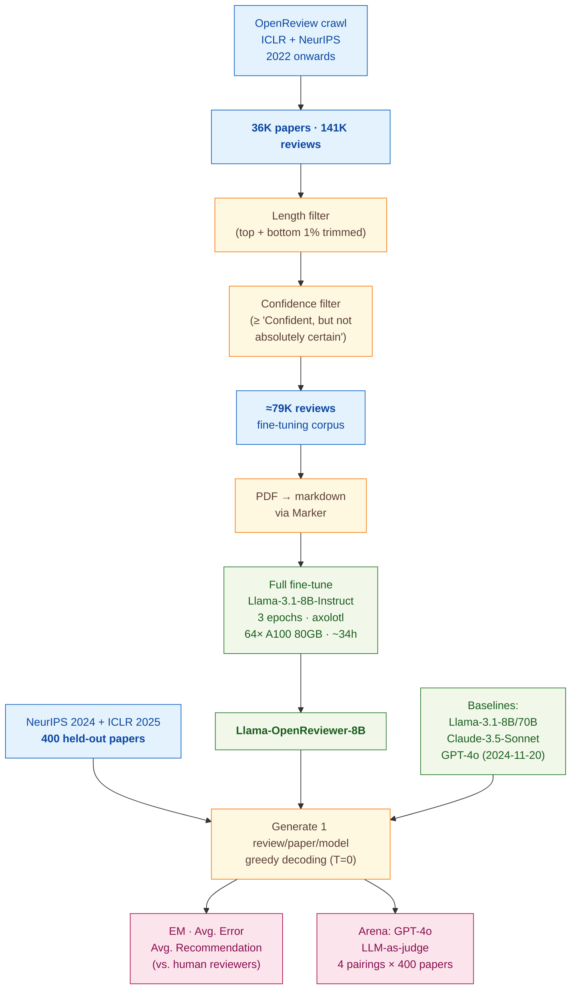

> [!success] **TL;DR**
> OpenReviewer's headline result — that a small, peer-review-fine-tuned 8-billion-parameter model lands on the human recommendation distribution while general-purpose chatbots inflate by 1.5 to 2.7 points on a 10-point scale — is concrete, and the supervised fine-tune is the obvious explanation given that the base model on its own gives the most inflated reviews. But two unresolved issues stop this from being deployment-ready as a pre-submission feedback tool: the entire evaluation is in-domain (ICLR + NeurIPS only), and the comparisons lack formal uncertainty estimates.

## Structured abstract

> [!info] A plain-language summary built from this paper's discourse-graph nodes. Numbers and findings link back to specific EVD nodes — click any link to drill in.

### Question

Can a smaller language model, trained specifically on real peer reviews, write more critical and realistic reviews of machine-learning papers than today's big general-purpose chatbots like GPT-4o or Claude? The authors built a fine-tuned model called OpenReviewer and ran it head-to-head against four general-purpose LLMs on 400 held-out NeurIPS 2024 and ICLR 2025 papers. Their core worry: off-the-shelf chatbots are too easy on papers, so the recommendations they suggest would mislead authors using them for pre-submission feedback. See [[QUE - Do specialized fine-tuned LLMs generate more critical and realistic peer reviews than general-purpose LLMs?]].

### Methods

**Design.** The authors ran a cross-sectional benchmark plus an arena-style preference test, comparing one fine-tuned model against four general-purpose chatbots on the same 400 held-out papers, scored against the real human reviews from OpenReview.

**Tools.** They built **Llama-OpenReviewer-8B** by full fine-tuning **Llama-3.1-8B-Instruct** (Meta's 8-billion-parameter open-weights chatbot) on roughly 79,000 ICLR and NeurIPS reviews. Training used **axolotl** (an open-source fine-tuning framework) plus **Deepspeed ZeRO-3**, **Flash Attention V2**, and the **LIGER kernel** — engineering libraries that let an 8-billion-parameter model train on 128,000-token paper PDFs. Baselines were Llama-3.1-8B-Instruct (the unmodified base), Llama-3.1-70B-Instruct, Anthropic's Claude-3.5-Sonnet (Oct. 22 release), and OpenAI's GPT-4o (2024-11-20 release). They served the open models with **vLLM** (a fast LLM-serving library) and called Claude and GPT-4o through **OpenRouter** (a unified API gateway). PDFs became markdown via **Marker** (an open-source PDF parser).

**Procedure.** The authors crawled OpenReview for ICLR and NeurIPS submissions from 2022 onwards. They trimmed the longest and shortest 1% of reviews, kept only reviews with confidence at "Confident, but not absolutely certain" or higher, and ended with about 79,000 reviews. They held out 400 papers from NeurIPS 2024 and ICLR 2025 — the most recent venues — and never showed those to the model during training. For each test paper, every model generated one review using greedy decoding (temperature set to 0, meaning the model always picks its top choice and gives the same answer every run). The authors then measured three things: how often the model's 1-to-10 recommendation exactly matched any human reviewer's recommendation (Exact Match rate, or EM), the average distance between the model's recommendation and the average human recommendation (Avg. Error), and the average recommendation each model produced. They also ran an arena-style preference test in which GPT-4o judged pairs of reviews — OpenReviewer versus one baseline — using the real human reviews as the reference for what a good review looks like.

**Sample.** The starting crawl held 36,000 papers and 141,000 reviews. After filters, about 79,000 reviews remained for fine-tuning. The test set was 400 held-out papers from NeurIPS 2024 and ICLR 2025, with each model producing 400 generated reviews. The unit of analysis is the generated review (one per paper per model). No human raters were involved beyond the original OpenReview reviewers whose comments served as the reference.

### Findings

- **OpenReviewer's recommendations match humans; the chatbots inflate.** Real OpenReview reviewers averaged 5.4 out of 10 across the 400 test papers (standard deviation 1.2). OpenReviewer also averaged 5.4 (standard deviation 1.1). General-purpose LLMs ran much higher: GPT-4o at 7.7, Claude-3.5-Sonnet at 7.6, Llama-3.1-70B at 6.9, and Llama-3.1-8B-Instruct at 8.1 — high enough that most papers would be recommended for acceptance. Because Llama-OpenReviewer-8B is a fine-tune of the very same base model that gave the most inflated 8.1 average, the drop to 5.4 is attributable to the peer-review fine-tune rather than the base model. [[EVD - OpenReviewer average recommendation was 5.4 matching human reviewers while GPT-4o averaged 7.7 on 400 NeurIPS and ICLR papers - @idahlOpenReviewerSpecializedLarge2025]]

- **OpenReviewer matched a human reviewer on more than half of papers.** Exact Match rate (EM) — the share of papers where the model's 1-to-10 recommendation exactly equals any human reviewer's recommendation — reached 55.5% for OpenReviewer versus 23.8% for GPT-4o, 15.5% for Claude, 14.0% for Llama-3.1-8B, and 11.5% for Llama-3.1-70B. The Average Error (the typical distance between the model's recommendation and the human-reviewer mean, on the 1-to-10 scale) was 0.96 for OpenReviewer and 2.34 for GPT-4o — about two-and-a-half times larger. The authors did not report confidence intervals or a paired statistical test for these gaps. [[EVD - OpenReviewer matched at least one human reviewer recommendation in 55.5% of 400 test papers vs 23.8% for GPT-4o - @idahlOpenReviewerSpecializedLarge2025]]

- **A GPT-4o judge preferred OpenReviewer's reviews most of the time.** In an arena-style preference test, GPT-4o (the judge) read the human expert reviews plus two candidate reviews and chose which one matched the human reviews better. OpenReviewer won against Llama-3.1-70B 76% of the time, against Llama-3.1-8B 70%, against Claude 69%, and against GPT-4o itself 60%. The narrowest margin came against GPT-4o, which is also the judge — a known self-preference confound the authors acknowledge but do not correct for with order randomization or judge diversity. [[EVD - OpenReviewer won against GPT-4o in 60% and against Llama-3.1-70B in 76% of LLM-as-judge preference evaluations - @idahlOpenReviewerSpecializedLarge2025]]

### Claim supported

These findings collectively support [[CLM - General-purpose LLMs produce overly positive peer review recommendations that do not reflect human reviewer distributions]] and [[CLM - Specialized fine-tuning on peer review data overcomes LLM tendency toward overly favorable assessments]]. For someone considering a chatbot as a pre-submission paper-feedback tool, the practical takeaway is sharp: an off-the-shelf GPT-4o or Claude will tell most authors their paper looks like an "accept" when human reviewers would not, while a small fine-tuned model can land on the realistic distribution — at the cost of being trained on a single domain (machine learning) and a small set of conferences.

### Caveats

- **Trained and tested only on ICLR and NeurIPS machine-learning papers.** The training corpus and the 400-paper test set both come from two AI conferences, so the result does not tell us whether the same fine-tuning recipe would work on biomedical, social-science, or humanities papers, where review norms and recommendation scales differ. [[CVT - The OpenReviewer training and test data were limited to ICLR and NeurIPS conferences limiting domain generalizability]]

- **The arena judge is also one of the contestants.** GPT-4o serves as the LLM-as-judge for the head-to-head preference test, and one of the four pairings is OpenReviewer versus GPT-4o itself. LLM judges are known to favor outputs from models with similar style or training, so the win rates — especially the narrowest 60% margin against GPT-4o — should be read with caution. [[CVT - The evaluation used LLM-as-judge which may favor outputs from models similar to the judge]]

### Methods at a glance

---

## Critical appraisal

> [!info] A risk-of-bias and validity assessment across five domains, synthesized from this paper's discourse-graph nodes. Each domain gets a rating (🟢 Low risk · 🟡 Some concerns · 🔴 High risk) plus a brief, EVD-grounded justification. The TRIPOD-LLM table below covers *reporting compliance*; this section covers *methodological quality*.

| Domain | Rating | Justification |
| --- | :---: | --- |
| **Construct validity** — does the metric actually measure the construct? | 🟡 | Exact Match and Average Error on a 1-to-10 recommendation field measure recommendation alignment, not review quality — a model could output a great recommendation number alongside a useless rationale. The authors themselves acknowledge that "similarity to human reviews equals quality" is a strong assumption (TRIPOD 7d ⚠️) and that no formal user study was done (TRIPOD 7b ⚠️). The arena LLM-as-judge does score per-section alignment, partially closing the gap. |
| **Internal validity** — could the comparison be biased? | 🟡 | All models received identical prompts, identical test papers, and the same greedy decoding settings — a clean comparison. But two real concerns remain: (1) the GPT-4o judge in the arena is itself one of the four contestants, a known self-preference confound flagged in [[CVT - The evaluation used LLM-as-judge which may favor outputs from models similar to the judge]]; and (2) for some venues the original double-blind submissions are unavailable, so the authors used the de-anonymized version, which the closed-source baselines may have seen during pretraining (acknowledged in TRIPOD 5e ⚠️). |
| **External validity** — do findings generalize? | 🔴 | The training corpus and test set are entirely ICLR and NeurIPS papers from 2022 onwards in machine learning and AI, as flagged in [[CVT - The OpenReviewer training and test data were limited to ICLR and NeurIPS conferences limiting domain generalizability]]. The recommendation alignment finding cannot be extrapolated to biomedical, social-science, or humanities reviewing — and the authors do not test even a single out-of-domain venue. |
| **Statistical rigor** — appropriate uncertainty + comparisons? | 🔴 | Standard deviations are reported alongside means, but no confidence intervals on EM, Avg. Error, or win rate; no paired statistical test (e.g., bootstrap, McNemar) for any model-vs-model comparison; no multiple-comparison correction across the five models × multiple metrics. With N=400 the gaps look large, but the paper does not formally rule out chance for any single comparison. |
| **Reproducibility** — code, data, determinism? | 🟡 | The fine-tuned model weights and the full axolotl training config are released on HuggingFace (TRIPOD 14f ✅), and greedy decoding makes the open-model outputs deterministic (TRIPOD 6c ✅). But the training corpus is not redistributed, the test 400-paper IDs are not enumerated (TRIPOD 14e ⚠️), and the closed-source GPT-4o and Claude APIs are dated snapshots that may drift or be deprecated. |

**Bottom line.** OpenReviewer's headline result — that a small, peer-review-fine-tuned 8-billion-parameter model lands on the human recommendation distribution while general-purpose chatbots inflate by 1.5 to 2.7 points on a 10-point scale — is concrete, and the supervised fine-tune is the obvious explanation given that the base model on its own gives the most inflated reviews. But two unresolved issues stop this from being deployment-ready as a pre-submission feedback tool: the entire evaluation is in-domain (ICLR + NeurIPS only), and the comparisons lack formal uncertainty estimates. A reader should take the recommendation-alignment finding seriously as a proof-of-concept while treating any "OpenReviewer is better" framing as restricted to two AI conferences.

> [!tip] **Applicable external appraisal frameworks beyond TRIPOD-LLM** (already covered by the table below): **HELM** (Liang et al. 2022) for holistic LLM-evaluation principles · **Datasheets for Datasets** (Gebru et al. 2021) for the evaluation corpus · **Model Cards** (Mitchell et al. 2019) for the LLMs being evaluated · **ML Reproducibility Checklist** (NeurIPS, JMLR) for the fine-tuning pipeline.

---

## TRIPOD-LLM reporting summary

> [!info] Reporting compliance for this paper, mapped to the TRIPOD-LLM checklist (Methods items 5a–15 and Results items 16a–18). Compliance icons: ✅ fully reported · ⚠️ partially reported / unclear · ❌ should be reported but not reported · ➖ not applicable to this study. Item 17 (Performance) is reported per-EVD; see each EVD's `## Other Notes`.

| # | Item | ✓ | Reported in this study |
| --- | --- | :---: | --- |
| **5a** | Data sources | ✅ | OpenReview.net submissions + reviews from ICLR and NeurIPS, 2022 onwards. Test venues: NeurIPS 2024 + ICLR 2025. PDF→markdown via Marker. |
| **5b** | Data points + distribution | ⚠️ | Crawl: 36K papers, 141K reviews. After length-filter (top + bottom 1% trimmed) and confidence-filter (≥ "Confident, but not absolutely certain"): ≈79K reviews. No per-venue or per-year breakdown of the 79K, no statistics on review length or recommendation distribution in the training set. |
| **5c** | Date range of data | ⚠️ | "From 2022 onwards" stated for the crawl; test set is NeurIPS 2024 + ICLR 2025. Specific crawl-cutoff date not reported. |
| **5d** | Pre-processing / quality checks | ✅ | PDF→markdown via Marker (chosen over Nougat for higher per-page accuracy on equations and tables); appendix discarded; only main text + references kept. Reviews filtered by length (top + bottom 1% removed) and reviewer-confidence threshold. |
| **5e** | Missing / imbalanced data | ⚠️ | Authors note original double-blind submissions are unavailable for some venues and they fall back to the non-anonymized version (potential leakage acknowledged in Limitations). Class-balance of recommendation labels not analyzed or rebalanced. |
| **6a** | LLM name + version | ✅ | Llama-OpenReviewer-8B (full-finetune of meta-llama/Llama-3.1-8B-Instruct). Baselines: Llama-3.1-8B-Instruct, Llama-3.1-70B-Instruct, Claude-3.5-Sonnet (Oct. 22), GPT-4o (2024-11-20). Judge: GPT-4o (2024-11-20). |
| **6b** | Development process | ✅ | 3 epochs of full fine-tuning, effective batch size 64, learning rate 2×10⁻⁵, bfloat16, max sequence length 128K tokens, axolotl + Deepspeed ZeRO-3 + Flash Attention V2 + LIGER kernel. Full axolotl config in Figure 8. |
| **6c** | Inference settings / prompting | ✅ | Greedy decoding (temperature=0) for all models. System + user prompts shown verbatim in Figures 3–4 (OpenReviewer) and Figures 5–6 (LLM judge). vLLM serving for OpenReviewer/Llama; OpenRouter for Claude/GPT-4o. |
| **6d** | Output | ✅ | Free-text markdown review following a venue-specific template that includes a numerical recommendation field (1–10 normalized). |
| **6e** | Classification thresholds | ➖ | Not applicable — generative output, no probability thresholds; recommendation parsed directly from generated text. |
| **7a** | Quality metrics | ✅ | Exact Match rate (EM, %); Average Error ± SD on 1–10 normalized recommendation scale; Average Recommendation ± SD; LLM-as-judge win/tie/loss rates. |
| **7b** | Relevance to downstream | ⚠️ | Authors argue that recommendation alignment matters for pre-submission feedback (overly positive scores would mislead authors), but no formal user-study or downstream-utility measurement reported. |
| **7c** | Outcome definition | ✅ | Recommendation alignment (EM and Avg. Error vs. human reviewers); pairwise preference alignment with expert reviews (LLM-as-judge). |
| **7d** | Subjective interpretation | ⚠️ | Authors acknowledge "similarity to human reviews equals quality… may not always be accurate as the quality control for human-written reviews is limited" and that human judgments would be more meaningful but were too expensive. No human evaluation conducted. |
| **7e** | Comparison | ✅ | OpenReviewer compared against 4 general-purpose LLM baselines (Llama-3.1-8B/70B-Instruct, Claude-3.5-Sonnet, GPT-4o) on identical prompts and test set. |
| **8a** | Annotation guidelines | ➖ | Not applicable — no manual annotation; reviews used as-is from OpenReview. |
| **8b** | Annotators + IAA | ➖ | Not applicable — no manual annotation. (Original OpenReview reviews were written by conference reviewers; their IAA is not analyzed here.) |
| **8c** | Annotator background | ➖ | Not applicable. |
| **9a** | Prompt design | ✅ | System prompt derived from the ICLR 2024 reviewer guide; user prompt is minimalistic ("Review the following paper:" + full text). LLM-judge prompt described and shown in Figures 5–6. No systematic prompt-engineering search reported. |
| **9b** | Prompt-development data | ❌ | Not reported — no separate prompt-development / validation set described. |
| **10** | Summarization | ➖ | Not applicable. |
| **11** | Instruction tuning / alignment | ✅ | Llama-3.1-8B-Instruct full-finetuned for 3 epochs on the ≈79K filtered review set (axolotl, llama3 chat template). |
| **12** | Compute | ✅ | "approximately 34 hours using 64 NVIDIA A100 80GB GPUs." Inference compute and baseline-LLM API costs not itemized. |
| **13** | Ethical approval | ➖ | Not applicable (no human-subjects data; analysis on public OpenReview submissions). Authors include an Ethics and Broader Impact statement on misuse and bias. |
| **14a** | Funding | ✅ | Leibniz Young Investigator Grant (project ARENA, LYIG-2023-01) of Leibniz University Hannover, funded by MWK (grant 11-76251-114/2022). Additional compute via AI service center KISSKI (BMBF grant 01IS22093C). |
| **14b** | Conflicts of interest | ❌ | Not reported. |
| **14c** | Protocol | ❌ | Not reported. |
| **14d** | Registration | ➖ | Not registered (not a clinical study). |
| **14e** | Data availability | ⚠️ | Training data not released (sourced from OpenReview API, derivative; no explicit dataset link). Test paper IDs (NeurIPS 2024 + ICLR 2025 held-out 400) not enumerated. |
| **14f** | Code availability | ✅ | Model on HuggingFace (huggingface.co/maxidl/Llama-OpenReviewer-8B); demo on HuggingFace Spaces (huggingface.co/spaces/maxidl/openreviewer); axolotl config disclosed in Figure 8. |
| **15** | Patient/public involvement | ➖ | Not applicable. |
| **16a** | Flow of data | ⚠️ | Crawl 36K papers / 141K reviews → length + confidence filter → ≈79K reviews used for fine-tuning. Test: 400 held-out NeurIPS 2024 + ICLR 2025 papers. Train/val split sizes within the 79K not reported; no validation-set numbers reported. |
| **16b** | Characteristics | ⚠️ | Limited — venues (ICLR + NeurIPS, 2022 onwards) and ML/AI domain stated; no breakdown of paper subfields, paper length distribution, reviewer-experience composition, or recommendation distribution in the training set. Test-set human-reviewer recommendation mean reported (5.4 ± 1.2). |
| **16c** | Distribution comparison | ⚠️ | Generated vs. human recommendation distributions compared in mean ± SD only (Tables 1, 2). No KS / chi-square / per-decile distribution plot. |
| **16d** | N per analysis | ✅ | 400 papers per metric; per-model evaluation N = 400 generated reviews. |
| **17** | Performance | (per-EVD) | Reported per-EVD. See each Idahl & Ahmadi EVD's `## Other Notes` for the EVD-specific EM, Avg. Error, Avg. Recommendation, and win-rate numbers. |
| **18** | LLM updating | ➖ | Not applicable (single fine-tune, no online updating reported). |
