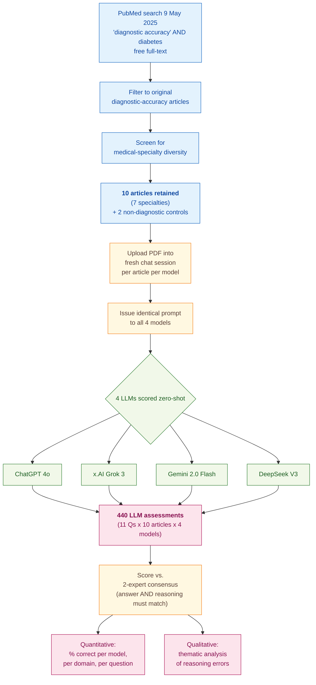

> [!success] **TL;DR**
> This is a careful, transparent snapshot of how four free chatbots perform at one slice of risk-of-bias appraisal, and the qualitative error analysis is the paper's most durable contribution — it names specific reasoning failures (consecutive sampling under case-control, exclusion-stage confusion) that any future LLM-for-systematic-review tool will need to fix. The headline 72.95% accuracy should not be taken as a benchmark for LLM capability, because the small sample, single prompt, and free-tier model versions all push the estimate toward a lower bound.

## Structured abstract

> [!info] A plain-language summary built from this paper's discourse-graph nodes. Numbers and findings link back to specific EVD nodes — click any link to drill in.

### Question

Can off-the-shelf chatbots judge how trustworthy a medical study is the same way a trained methodologist would? The authors test four popular general-purpose large language models on QUADAS-2, a standard checklist for rating risk of bias in diagnostic-accuracy studies. They feed each model the same 10 papers and the same prompt, then score every answer against a two-expert human consensus. See [[QUE - How does LLM performance vary across specific structured tasks in systematic review and evidence appraisal workflows?]].

### Methods

**Design.** The authors ran a cross-sectional benchmark of four LLMs against a two-expert consensus reference, paired with a qualitative analysis of the reasoning errors the models made.

**Tools.** Four general-purpose chatbots accessed through their free public web interfaces — ChatGPT 4o (OpenAI), x.AI Grok 3, Gemini 2.0 Flash (Google), and DeepSeek V3. The rubric was QUADAS-2 (Whiting et al. 2011), a standard checklist for diagnostic-accuracy studies covering four domains — patient selection, index test, reference standard, and flow and timing — with 11 yes/no/unclear signaling questions in total. The full per-article LLM responses were captured in Supplementary Table S1.

**Procedure.** The authors searched PubMed on 9 May 2025 for diagnostic-accuracy studies on diabetes, kept only original research with free full text, and screened for medical-specialty diversity. They uploaded each paper as a PDF into a fresh chat session for every model, so no model could carry context from one article to the next. They sent every model the exact same prompt, asking it to answer each QUADAS-2 signaling question and give a low, high, or unclear risk-of-bias verdict per domain, plus written reasoning. Two human authors independently scored every paper and resolved disagreements by consensus to set the reference. An LLM answer counted as correct only if both the answer and the supporting argument matched the human reference.

**Sample.** PubMed search returned candidate diagnostic-accuracy articles, screened for specialty diversity, leaving 10 retained articles spanning seven medical fields (cardiology, gastroenterology, neurology, rheumatology, sleep medicine, vascular surgery, and ophthalmology), plus 2 non-diagnostic control articles handled separately. The unit of analysis is the signaling-question assessment: 10 articles times 11 questions times 4 models equals 440 LLM assessments. Two authors from a medical informatics and biostatistics department served as the human reference raters.

### Findings

- **The four chatbots got about three out of four answers right on average.** Across 110 signaling-question assessments per model, the mean correct rate was 72.95%. Grok 3 led at 77.27% (85/110), followed by ChatGPT 4o at 75.45%, DeepSeek V3 at 71.82%, and Gemini 2.0 Flash at 67.27%. Accuracy varied sharply by QUADAS-2 domain: flow and timing was easiest at 80.63%, while reference standard was hardest at 63.75%. About 3% of "right" answers were actually backed by wrong reasoning — a small but real reminder that matching the verdict does not mean understanding the study. [[EVD - Mean correct QUADAS-2 assessment rate across four LLMs was 72.95% with Grok 3 highest at 77.27% and Gemini 2.0 Flash lowest at 67.27% - @leucutaRiskBiasAssessment2025]]

- **The mistakes followed a pattern, not random noise.** In the patient-selection domain — the second-hardest at 65.83% — the models made four recurring kinds of error. They misunderstood "consecutive sampling" inside case-control or subgroup studies, treating it as logically impossible. They drew unjustified inferences from what authors did or did not say, treating silence as proof. They picked one of two contradictory author statements rather than calling the design uninterpretable. And they misjudged whether a study population (for example, "patients with suspected disease") was representative. The models also confused exclusions made when picking patients with exclusions made when running the analysis, which belong in a different QUADAS-2 domain. [[EVD - LLMs demonstrated systematic reasoning errors in QUADAS-2 patient selection domain including misinterpreting consecutive sampling and case-control design - @leucutaRiskBiasAssessment2025]]

### Claim supported

These findings support the broader claim that [[CLM - LLMs achieve moderate accuracy on structured quality appraisal tasks but cannot yet substitute for expert human judgment]], and the more specific point that [[CLM - LLM performance on structured checklist tasks varies substantially by item type with simpler factual items showing higher agreement than items requiring methodological judgment]]. For someone considering plugging an off-the-shelf chatbot into a systematic-review workflow, the message is: a 73% mean accuracy with systematic blind spots on study-design judgment is not safe to run unsupervised. These tools could realistically pre-screen or assist a human reviewer, but every domain-level verdict still needs a methodologist to check.

### Caveats

- **Only one prompt was tested across all four models.** The authors deliberately used a single, simple prompt to mimic a non-expert user, with no per-model tuning. Better prompts almost certainly would lift accuracy, so the 67–77% range is best read as a floor rather than a ceiling. [[CVT - A single standardized prompt was used across all LLMs without prompt engineering potentially underestimating LLM capabilities in QUADAS-2 assessment]]

- **Only the free public web versions of each chatbot were tested.** Paid tiers, API access, and newer model snapshots may behave differently. The numbers reflect what a typical clinician-researcher with a free account would see, not the frontier of each vendor's stack. [[CVT - Only publicly available web-based LLM interfaces were used rather than APIs potentially missing superior performance of paid or fine-tuned model versions]]

### Methods at a glance

---

## Critical appraisal

> [!info] Risk-of-bias and validity assessment across five domains, synthesized from this paper's discourse-graph nodes. Covers *methodological quality* — the TRIPOD-LLM table below covers *reporting compliance* instead.
> <dl class="callout-legend">
> <dt>● Low risk</dt><dd>No meaningful threat to this domain identified</dd>
> <dt>◐ Some concerns</dt><dd>A real but non-fatal limitation</dd>
> <dt>○ High risk</dt><dd>A significant, unaddressed threat to validity</dd>
> </dl>

| Domain | Rating | Justification |
| --- | :---: | --- |
| **Construct validity** — does the metric actually measure the construct? | 🟡 | "Percent correct" is a sensible first-pass metric, but the construct of interest — "is this LLM safe to use for risk-of-bias appraisal?" — is not the same as "does the LLM match the human verdict on average". The strict scoring rule (answer plus reasoning must both match) helps, and the qualitative error analysis [[EVD - LLMs demonstrated systematic reasoning errors in QUADAS-2 patient selection domain including misinterpreting consecutive sampling and case-control design - @leucutaRiskBiasAssessment2025]] shows the systematic blind spots that raw accuracy hides. No precision/recall, no inter-rater statistic between LLM and human, and no domain-level risk-of-bias judgment was scored end-to-end. |
| **Internal validity** — could the comparison be biased? | 🟢 | The four models saw identical prompts on identical PDFs in fresh sessions, with no context carryover. The human reference was set by two-rater consensus before LLM scoring. There is no plausible test-set contamination risk for QUADAS-2 verdicts on these specific 2024–2025 articles, and the strict "answer plus reasoning" rule rules out lucky guesses. The main residual concern is that the human reference itself rests on only two raters with no reported pre-consensus agreement (TRIPOD-LLM 8b ⚠️). |
| **External validity** — do findings generalize? | 🔴 | Three large constraints. First, the corpus is 10 papers — a small, opportunistic sample drawn from a diabetes-keyword PubMed search. Second, only one prompt was tested per model, deliberately a "naive user" prompt; see [[CVT - A single standardized prompt was used across all LLMs without prompt engineering potentially underestimating LLM capabilities in QUADAS-2 assessment]]. Third, only free public web versions of the four models were tested; see [[CVT - Only publicly available web-based LLM interfaces were used rather than APIs potentially missing superior performance of paid or fine-tuned model versions]]. The findings describe one slice of model-times-prompt space, not the capability ceiling. |
| **Statistical rigor** — appropriate uncertainty + comparisons? | 🔴 | Results are reported as raw counts and percentages with no confidence intervals, no significance tests between models, no inter-rater agreement statistic between LLM and human, and no multiple-comparison correction across the 4 models times 4 domains times 11 signaling questions matrix. With only 20–40 assessments per domain per model, the apparent ranking of models is well within sampling noise, and Gemini's 50% on patient selection (n=30) has wide error bars the paper does not show. |
| **Reproducibility** — code, data, determinism? | 🟡 | Supplementary Table S1 contains the full per-article LLM responses, the prompt is reproduced verbatim, and the models and study window are named (TRIPOD-LLM 14e ✅). But four web-UI chatbots with undisclosed temperature, top-p, seed, and system-prompt settings (TRIPOD-LLM 6c ⚠️) are intrinsically non-deterministic; rerunning today against floating model versions would not reproduce the numbers exactly. No code repository applies because no code was written. |

**Bottom line.** This is a careful, transparent snapshot of how four free chatbots perform at one slice of risk-of-bias appraisal, and the qualitative error analysis is the paper's most durable contribution — it names specific reasoning failures (consecutive sampling under case-control, exclusion-stage confusion) that any future LLM-for-systematic-review tool will need to fix. The headline 72.95% accuracy should not be taken as a benchmark for LLM capability, because the small sample, single prompt, and free-tier model versions all push the estimate toward a lower bound. Before a result like this is deployment-ready, a real evaluation would need many more articles, multiple prompts per model, frozen API model snapshots, confidence intervals, and a domain-level risk-of-bias verdict scored against an inter-rater statistic — not just a percent-correct table.

> [!tip] **Applicable external appraisal frameworks beyond TRIPOD-LLM** (already covered by the table below): **MI-CLAIM** (Norgeot et al. 2020) for clinical-AI minimum information · **MINIMAR** (Hernandez-Boussard et al. 2020) for medical-AI reporting · **PROBAST+AI** (Wolff et al. 2019 base; AI extension in development) for prediction-model risk of bias · **STARD-AI** and **QUADAS-AI** (in development) for AI-assisted diagnostic-accuracy assessment.

---

## TRIPOD-LLM reporting summary

> [!info] Reporting compliance for this paper, mapped to the TRIPOD-LLM checklist (Title/Abstract/Introduction items 1–4, Methods items 5a–15, Results items 16a–18). Item 17 (Performance) is reported per-EVD; see each EVD's `## Other Notes`.
> 

> ●Fully reported
> ◐Partial / unclear
> ○Not reported
> –Not applicable
> 

| # | Item | ✓ | Quote |
| --- | --- | :---: | --- |
| **1** | Title | ✅ | *"Risk of Bias Assessment of Diagnostic Accuracy Studies Using QUADAS 2 by Large Language Models"* `Title` |
| **2** | Abstract | ➖ | Assessed separately under TRIPOD-LLM's own Abstract extension, not scored here |
| **3a** | Background — context + rationale | ✅ | *"Diagnostic accuracy studies are essential in assessing the performance of medical tests. They inform clinical decision-making during diagnostic time and guide treatment strategies. To ensure the validity of these studies, methodological tools for assessing the risk of bias (RoB) have been developed in the framework of evidence-based medicine."* `§1, p.1` |
| **3b** | Background — target population | ⚠️ | *"For this to be effective for medical diagnosis, it is essential that they acquire the ability to critically appraise scientific literature."* `§1, p.2` — the population of diagnostic-accuracy studies being appraised is not explicitly scoped in the background beyond this |
| **4** | Objectives | ✅ | *"the aim of the study was to assess the capability of LLMs to evaluate the risk of bias in diagnostic accuracy studies, using QUADAS2, in comparison to human experts. The specific objectives were to evaluate the accuracy of the LLMs' responses to QUADAS-2 signaling questions, identify the best-performing models, and characterize common reasoning errors made by LLMs."* `§1, p.2` |
| **5a** | Data sources | ✅ | *"Ten diagnostic accuracy articles were selected from Pubmed, using the following search strategy: ("diagnostic accuracy" [Title/Abstract]) AND (diabetes [Title/Abstract]), with the most recent papers first."* `§2.1, p.2` |
| **5b** | Data points + distribution | ✅ | *"Out of 110 signaling questions assessments (11 questions for each of the 10 articles) by the four AI models, the mean percentage of correct assessments ... of all the models was 72.95%."* `§3.3, p.9` |
| **5c** | Date range of data | ⚠️ | *"The search strategy was performed on 9 May 2025."* `§2.1, p.2` — exact publication-date span of the 10 retained articles not given in the text |
| **5d** | Pre-processing / quality checks | ⚠️ | *"Each article was uploaded as a PDF file, sourced from either the publisher's site or PubMed Central."* `§2.4, p.3` — no PDF-conversion or extraction verification reported |
| **5e** | Missing / imbalanced data | ⚠️ | *"please provide the answer as yes/no/unclear/not applicable"* `§2.4, p.3` — "not applicable" was a permitted response option, but class imbalance per signaling question is not otherwise addressed |
| **6a** | LLM name + version | ⚠️ | *"Four artificial intelligence generative large language models were used with their public web-based interfaces, for the AI assessment: ChatGPT 4o model, X.AI Grok 3 model, Gemini 2.0 flash model, and the DeepSeek V3 model."* `§2.4, p.3` — specific model build dates / API versions not reported |
| **6b** | Development process | ➖ | Not applicable — no development; off-the-shelf zero-shot use of public LLM web interfaces |
| **6c** | Inference settings / prompting | ⚠️ | *"For all the models, the prompt was the same: 'I will provide a scientific article, and I want you to use the QUADAS 2 assessment tool to assess the risk of bias for this article. Please wait for me to ask the signaling questions for each domain...'"* `§2.4, p.3` — temperature/top_p/seed/system prompt not stated |
| **6d** | Output | ✅ | *"for the risk of bias, provide the answer as low, high, unclear, without any comments. After this answer, please provide the rationale for your answers"* `§2.4, p.3` |
| **6e** | Classification thresholds | ➖ | Not applicable — LLMs return categorical labels directly, no probability thresholding |
| **7a** | Quality metrics | ⚠️ | *"Categorical data were presented as counts and percentages."* `§2.7, p.3` — no precision/recall/F1, inter-rater statistic, confidence intervals, or significance tests |
| **7b** | Relevance to downstream use | ⚠️ | *"LLMs may serve as complementary tools in systematic reviews, with compulsory human supervision."* `Abstract, p.1` — no formal downstream-utility analysis (e.g. reviewer time saved) |
| **7c** | Outcome definition | ✅ | *"An assessment made by an LLM was considered correct only if it matched the human expert's answer and included a proper argument. Identical answers to the human expert answer with an incorrect argument behind the answer were not considered correct."* `§2.7, p.3` |
| **7d** | Subjective interpretation | ⚠️ | *"In case there were reasoning errors, the errors were documented. All errors were grouped by domain and signaling questions and presented qualitatively."* `§2.6, p.3` — single-team categorization, no inter-rater agreement on the qualitative themes |
| **7e** | Comparison | ⚠️ | *"The most accurate model was Grok 3, followed by ChatGPT 4o, DeepSeek V3, and Gemini 2.0 flash (Table 2, Figure 1), ranging from 74.45% to 67.27%."* `§3.3, p.9` — four LLMs compared head-to-head, no non-LLM baseline (e.g. random / majority class) |
| **8a** | Annotation guidelines | ✅ | *"The selected articles were evaluated using QUADAS-2 tool [2]. This instrument evaluates risk of bias and applicability concerns across four domains: patient selection, index test, reference standard, and flow and timing."* `§2.2, p.2` |
| **8b** | Annotators + IAA | ⚠️ | *"The human assessment was performed by two authors who independently assessed the quality of the articles and resolved their discrepancies by discussion and consensus."* `§2.3, p.2` — no quantitative inter-rater agreement (κ) reported |
| **8c** | Annotator background | ⚠️ | *"Department of Medical Informatics and Biostatistics, Iuliu Hațieganu University of Medicine and Pharmacy, 400349 Cluj-Napoca, Romania"* `Affiliations, p.1` — specific clinical-methodology training of the two assessors not detailed |
| **9a** | Prompt design | ⚠️ | *"we used only one single standardized prompt to ensure comparability across LLMs… We used a simple prompt to enact a scenario where researchers that are not trained in prompt engineering would use LLMs"* `§4.1 Limitations, p.17` |
| **9b** | Prompt-development data | ❌ | Not reported |
| **10** | Summarization | ➖ | Not applicable — RoB classification, not summarization |
| **11** | Instruction tuning / alignment | ➖ | Not applicable — no fine-tuning; off-the-shelf models |
| **12** | Compute | ⚠️ | *"The time of processing the PDF file was adequate and similar between ChatGPT 4o, Grok 3, and Gemini 2.0 flash, but longer for DeepSeek V3."* `§3.4.4, p.14` — qualitative only, no wall-clock numbers or API cost |
| **13** | Ethical approval | ➖ | *"Institutional Review Board Statement: Not applicable."* `Institutional Review Board Statement, p.18` — no human-subjects data; analysis on published articles |
| **14a** | Funding | ✅ | *"This research received no external funding."* `Funding, p.18` |
| **14b** | Conflicts of interest | ✅ | *"The authors declare no conflicts of interest."* `Conflicts of Interest, p.18` |
| **14c** | Protocol | ❌ | Not reported |
| **14d** | Registration | ➖ | Not applicable — not a registered clinical study |
| **14e** | Data availability | ✅ | *"Data are contained within the article or Supplementary Material."* `Data Availability Statement, p.18` |
| **14f** | Code availability | ➖ | Not applicable — no code was developed (web-UI prompting only) |
| **15** | Patient/public involvement | ➖ | Not applicable |
| **16a** | Flow of data | ✅ | *"Only original articles on diagnostic accuracy assessment were included. Reviews, systematic reviews, editorials, and protocols were excluded. The articles were selected from various medical fields to ensure diversity."* `§2.1, p.2` |
| **16b** | Characteristics | ✅ | *"There were two articles in cardiology: coronary artery disease [15] and carotid atherosclerosis [16]; two in the gastroenterology field: liver diseases [17,18]; one in neurology: diabetic neuropathy [19]; one in rheumatology: knee osteoarthritis [20]; one in sleep medicine: obstructive sleep apnea [21]; one in vascular surgery: peripheral artery disease [22]; and two in ophthalmology [23,24]."* `§3.1, p.3` |
| **16c** | Distribution comparison | ➖ | Not applicable — no clinical-outcome subgroup comparison |
| **16d** | N per analysis | ✅ | *"Domain Patient Selection (n = 30) Index Test (n = 20) Reference Standard (n = 20) Flow and Timing (n = 40)"* `Table 3, p.9` |
| **17** | Performance | `per-EVD` | Reported per-EVD. See each EVD's `## Other Notes`. |
| **18** | LLM updating | ➖ | Not applicable — no model updating reported; one-shot evaluation of fixed model versions |
