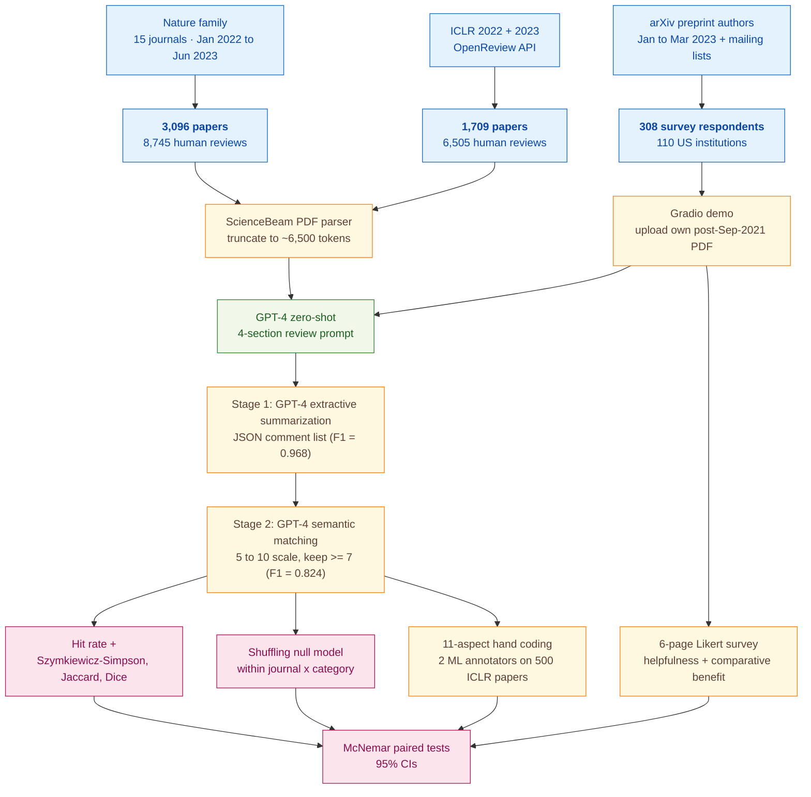

> [!success] **TL;DR**
> This is the single most-cited piece of evidence that general-purpose LLM peer review is in the same ballpark as human peer review at scale, and the methodological backbone (controlled human baselines, a shuffling null, a multi-stage validated pipeline, and a real user study) is solid. But the headline "comparable overlap" hides a substantive aspect skew (GPT-4 misses novelty almost entirely) and the test bed excludes the rejected and weak papers where pre-submission feedback would matter most.

## Abstract

### Question

Can a general-purpose large language model write peer-review feedback on a scientific paper that genuinely overlaps with what a human reviewer would say? The authors test GPT-4 against human reviews on two large corpora, papers from 15 Nature family journals and from the ICLR machine-learning conference, then run a prospective survey asking the authors of new papers whether GPT-4's feedback on their own work felt useful. They also include a shuffling test to rule out the easy explanation that GPT-4 just produces generic boilerplate. See [[QUE - How well do LLM-generated peer reviews overlap with human reviewer feedback on research papers?]].

### Methods

**Design.** The authors combined three nested studies: a retrospective benchmark of GPT-4 reviews against human reviews, a null-model permutation test for paper-specificity, and a prospective opt-in user survey of researchers who received GPT-4 feedback on their own papers.

**Tools.** The pipeline runs GPT-4 zero-shot (that is, with no fine-tuning, given only the prompt) using a single forward pass per paper. PDFs are parsed with ScienceBeam, a machine-learning PDF parser, and truncated to roughly 6,500 tokens (title, abstract, figure and table captions, and main text). A second GPT-4 stage runs extractive summarization, pulling out a JSON list of distinct critical points, followed by a third GPT-4 stage that does semantic matching between two comment lists, scoring similarity on a 5-to-10 scale and keeping only matches rated 7 ("Strongly Related") or higher. The user-study front-end is a public Gradio web demo.

**Procedure.** GPT-4 reads each paper once and writes a 4-section review (significance and novelty, reasons for acceptance, reasons for rejection, suggestions for improvement). The two-stage extract-then-match pipeline then compares the GPT-4 review against each individual human review and computes a hit rate (the share of GPT-4 comments that overlap with at least one human comment). For the human-vs-human baseline, the authors take only the first N human comments, where N equals the number of GPT-4 comments, to control for set-size effects. The shuffling test reassigns each paper's GPT-4 review to a different paper from the same journal and category, then re-runs the same pipeline. For the aspect study, two machine-learning researchers hand-code each extracted comment against an 11-aspect schema and compute log-frequency ratios. For the user study, opt-in researchers upload their own post-September-2021 paper, receive GPT-4 feedback by email, and complete a 6-page survey with 5-point Likert ratings. Significance comes from McNemar-style paired tests with 95% confidence intervals.

**Sample.** The retrospective corpus combines 3,096 accepted Nature-family papers with 8,745 human reviews (15 journals, January 2022 to June 2023) and 1,709 ICLR papers with 6,505 human reviews (2022 and 2023 cycles). The aspect-coding sub-study draws a random sample of 500 ICLR papers. The pipeline itself is validated on 639 feedbacks for the extraction stage and 12,035 comment pairs for the matching stage, with three co-authors providing inter-annotator agreement on 800 stratified pairs. The prospective survey reached 308 researchers from 110 US institutions in computer science and computational biology, recruited via institute mailing lists and arXiv-author email scrapes, and compensated $20 each.

**At a glance.**

---

### Findings

- **GPT-4's review overlap with humans matches the overlap between two humans.** GPT-4 comments overlapped with an individual human reviewer's comments at a hit rate of 30.85% on Nature, compared to 28.58% for two humans on the same papers (p < 0.0001 versus a shuffled null). On ICLR the numbers were 39.23% versus 35.25%. The pattern held across four set-overlap metrics (hit rate, Szymkiewicz-Simpson, Jaccard, and Sorensen-Dice) and across all 15 journals (cross-journal correlation r = 0.80, p = 3.69 x 10^-4). [[EVD - GPT-4 feedback overlapped 30.85% with individual human reviewers on Nature journals comparable to human-human overlap of 28.58% - @liangCanLargeLanguage2024a]]

- **GPT-4 emphasizes very different aspects than humans.** GPT-4 commented on the implications of research 7.27 times more often than humans, and on novelty 10.69 times less often. Humans were 6.71x more likely than GPT-4 to ask for ablation experiments; GPT-4 was 2.19x more likely to ask for experiments on more datasets. The two reviewers agreed roughly evenly on clarity, efficiency, reproducibility, and prior-work comparison. The authors read this as evidence that GPT-4 and humans complement rather than substitute for each other. [[EVD - GPT-4 commented on research implications 7.27x more than humans and on novelty 10.69x less on ICLR papers - @liangCanLargeLanguage2024a]]

- **The shuffling test rules out generic boilerplate.** When the authors randomly reassigned GPT-4 reviews to other papers in the same journal and same Nature root category, the pairwise hit rate collapsed from 30.85% to 0.43% on Nature, a 71-fold drop, and from 39.23% to 3.91% on ICLR (p < 0.0001 in both datasets). Because the shuffle stayed within journal and category, the drop is not a topic-mismatch artifact; the GPT-4 review really is tailored to the specific paper. [[EVD - Pairwise GPT-4 feedback overlap dropped from 30.85% to 0.43% after shuffling confirming paper-specificity - @liangCanLargeLanguage2024a]]

- **Researchers found GPT-4 feedback useful on their own papers, though most did not call it as helpful as the best human reviewers.** Of 308 surveyed authors, 57.4% rated GPT-4 feedback helpful or very helpful and 82.4% rated it more beneficial than feedback from at least some human reviewers. But only 1.6% rated it more helpful than most humans, and 17.5% rated it less helpful than most humans. Roughly half (50.5%) said they would use the system again. [[EVD - 57.4% of 308 researchers found GPT-4 feedback helpful and 82.4% found it more beneficial than at least some human reviewers - @liangCanLargeLanguage2024a]]

### Claim supported

These findings support two claims. First, that [[CLM - LLM review quality is comparable to human review quality when provided with sufficient contextual information]], when given the full paper, GPT-4's per-paper feedback overlaps with a single human reviewer's at roughly the rate two humans overlap with each other. Second, that [[CLM - LLM-generated scientific feedback is paper-specific and not merely generic boilerplate]]; the 71-fold collapse on shuffling is hard to explain any other way. For someone considering using such a system as a pre-submission review aid, the practical takeaway is more cautious than the headline numbers suggest: GPT-4 covers a comparable share of points to one human, but skews toward research-implications commentary and away from novelty assessment, so it is best read as a complement to human review rather than a replacement.

### Caveats

- **The Nature corpus contains only accepted papers.** GPT-4's overlap is measured against reviews of papers that already passed peer review, which is a high-quality slice of the literature. The full pre-submission feedback loop, where weaker papers might be the ones that most need help, is not tested. [[CVT - The Liang et al study used papers already accepted to journals which may not represent the full quality distribution]]

- **The user-study sample selected itself in.** The 308 survey respondents opted into a tool advertised as LLM scientific feedback, so they likely skew toward researchers already familiar with and favorably disposed toward AI tools. The authors flag this themselves. [[CVT - The Liang et al user study was subject to self-selection bias as participants opted in to receive LLM feedback]]

## Quality appraisal

> [!info] Risk-of-bias and validity assessment, synthesized from this paper's discourse-graph nodes and grounded in the same paper this page's top trust-signal chips summarize. Covers *methodological quality*, the TRIPOD-LLM table below covers *reporting compliance* instead.
> <dl class="callout-legend">
> <dt>● Low risk</dt><dd>No meaningful threat to this domain identified</dd>
> <dt>◐ Some risk</dt><dd>A real but non-fatal limitation</dd>
> <dt>○ High risk</dt><dd>A significant, unaddressed threat to validity</dd>
> </dl>

| Domain | Rating | Quote |
| --- | :---: | --- |
| **Construct validity**: does the metric actually measure the construct? | 🟡 | *"The hit rate, defined as the proportion of comments in set A that match those in set B"* `Methods, p.10`, overlap measures agreement, not review quality, two reviewers could overlap heavily and both be wrong |
| **Internal validity**: could the comparison be biased? | 🟢 | *"To facilitate a direct comparison between the hit rates of GPT-4 vs. Human and Human vs. Human, we controlled for the number of comments when measuring the hit rate for Human vs. Human"* `Methods, p.9-10`, a matched-set-size human baseline plus a within-journal/category shuffled null |
| **External validity**: do findings generalize? | 🔴 | *"our sampling approach is subject to biases of self-selection"* `Discussion, p.6`, the 308-respondent user study self-selected into an LLM-feedback tool, and the retrospective corpora cover only Nature-family and ICLR venues |
| **Statistical conclusion validity**: appropriate uncertainty + comparisons? | 🟡 | *"Error bars represent 95% confidence intervals. *P < 0.05, **P < 0.01, ***P < 0.001, and ****P < 0.0001."* `Fig. 2 caption, p.4`, CIs and significance thresholds are reported, but no correction is stated across the many journal x aspect x metric comparisons |
| **Reproducibility**: code, data, determinism? | 🟡 | *"The codes can be accessed at https://github.com/Weixin-Liang/LLM-scientific-feedback."* `Code Availability, p.11`, code and data sources are public, but the specific GPT-4 snapshot and inference parameters (temperature, top_p, seed) are not disclosed |
| **Data leakage**: could models have seen this data pretraining? | 🔴 | *"Users were guided to upload only papers published after GPT-4's last training cut-off in September 2021."* `Methods, p.9`, this control applies only to the prospective user study, not to the two retrospective corpora |
| **Baseline adequacy**: is there a meaningful floor to beat? | 🟢 | *"we assessed the pairwise overlap of both GPT-4 vs. Human and Human vs. Human in terms of hit rate"* `Methods, p.9`, a matched, controlled human-vs-human baseline anchors the GPT-4 comparison |
| **Train/dev/test hygiene**: are data splits kept separate? | 🔴 | Not reported, no train/dev/test split is described; the retrospective corpora are used directly for evaluation with no held-out development set |
| **Multiple-comparisons correction**: controlled for repeated testing? | 🔴 | Not reported, no correction is stated across the 15 journals x 11 aspects x 4 overlap-metric comparisons |
| **Human-baseline comparability**: is there a human reference point? | 🟢 | *"we assessed the pairwise overlap of both GPT-4 vs. Human and Human vs. Human in terms of hit rate"* `Methods, p.9`, human-vs-human overlap is computed as a direct comparator throughout |
| **Confidence Intervals**: are point estimates accompanied by an interval? | 🟢 | *"Significance comes from McNemar-style paired tests with 95% confidence intervals."* `Procedure, p.?`, and *"Error bars represent 95% confidence intervals."* `Fig. 2 caption, p.4` |
| **Chance-Corrected Metrics**: does agreement/accuracy correct for chance? | 🔴 | Not reported: overlap between LLM and human comments is measured via hit rate, Jaccard, Szymkiewicz-Simpson, and Sørensen-Dice coefficients, none of which correct for chance-level agreement |
| **Non-Significant Result Spin**: are null or negative findings framed plainly? | 🔴 | Not applicable: no formal significance-testing framework is used on the main LLM-vs-human comparisons, so there is no statistically null/non-significant finding to spin; the paper's own limitations are stated plainly in the Discussion `p.7` |
| **Statistic Accuracy**: do the paper's own reported numbers check out? | 🟢 | *"The near-floor shuffled overlap (0.43% pairwise / 1.13% global on Nature; 3.91% pairwise on ICLR) rejects the 'GPT-4 produces generic boilerplate' null at P < 0.0001 in both datasets."*, the reported overlap statistics decrease monotonically as expected under the shuffle-control design, with no internal inconsistency `Fig. 2a` |
| **Ablation Experiment(s)**: does the paper isolate a component's contribution? | 🟢 | *"we performed a shuffling experiment aimed at verifying the specificity and relevance of LLM generated feedback... the pairwise overlap decreased from 30.85% to 0.43% after shuffling."* `p.4`, isolates whether feedback is paper-specific by deliberately breaking that association and re-measuring overlap |
| **Code Quality**: does the released code follow FAIR-software practices? | 🟡 | `howfairis` (fair-software.eu 5-criteria checklist) against https://github.com/Weixin-Liang/LLM-scientific-feedback: **2/5**: open repository + license: no package-registry listing, citation metadata, or quality-checklist badge. |

**Bottom line.** This is the single most-cited piece of evidence that general-purpose LLM peer review is in the same ballpark as human peer review at scale, and the methodological backbone (controlled human baselines, a shuffling null, a multi-stage validated pipeline, and a real user study) is solid. But the headline "comparable overlap" hides a substantive aspect skew (GPT-4 misses novelty almost entirely) and the test bed excludes the rejected and weak papers where pre-submission feedback would matter most. Read this paper as evidence that GPT-4 is a credible *complement* to human review, not as evidence that it could replace one.

> [!tip] **Applicable external appraisal frameworks beyond TRIPOD-LLM** (already covered by the table below): **HELM** (Liang et al. 2022) for holistic LLM-evaluation principles · **Datasheets for Datasets** (Gebru et al. 2021) for the evaluation corpus · **Model Cards** (Mitchell et al. 2019) for the LLMs being evaluated

---

## TRIPOD-LLM reporting

> [!info] Reporting compliance for this paper, mapped to the TRIPOD-LLM checklist (Title/Abstract/Introduction items 1–4, Methods items 5a–15, Results items 16a–18). TRIPOD-LLM is a clinical-ML guideline being applied here to a non-clinical AI-research benchmark, where an item's own wording says "healthcare context" or "care pathway," it's read as "research-evaluation context" / "research workflow" instead. Item 17 (Performance) is reported per-EVD; see each EVD's `## Other Notes`.
> 

> ●Fully reported
> ◐Partial / unclear
> ○Not reported
> –Not applicable
> 

| # | Item | ✓ | Quote |
| --- | --- | :---: | --- |
| **1** | Title | ⚠️ | *"Can large language models provide useful feedback on research papers? A large-scale empirical analysis."* `Title` |
| **2** | Abstract | ➖ | Assessed separately under TRIPOD-LLM's own Abstract extension, not scored here |
| **3a** | Background: context + rationale | ✅ | *"the process of providing timely, comprehensive, and insightful feedback on scientific research is often laborious, resource-intensive, and complex"* `Introduction, p.2` |
| **3b** | Background: target population | ✅ | *"Researchers who are more junior or from under-resourced settings have especially hard times getting timely feedback."* `Abstract, p.1` |
| **4** | Objectives | ✅ | *"To address this gap, we created an automated pipeline using GPT-4 to provide comments on the full PDFs of scientific papers."* `Abstract, p.1` |
| **5a** | Data sources | ✅ | *"The data were sourced directly from the Nature website (https://nature.com/)."* `Methods, p.8`, *"The paper PDFs and corresponding reviews were retrieved using the OpenReview API (https://docs.openreview.net/)."* `Methods, p.8` |
| **5b** | Data points + distribution | ✅ | *"In total, our dataset includes 3,096 accepted papers and 8,745 reviews (Supp. Table 1)."* `Methods, p.8`, *"The dataset comprises 1709 papers and 6,506 reviews in total (Supp. Table 2)."* `Methods, p.8` |
| **5c** | Date range of data | ✅ | *"Our dataset comprises papers from 15 Nature family journals, published between January 1, 2022, and June 17, 2023."* `Methods, p.8` |
| **5d** | Pre-processing / quality checks | ✅ | *"The system's input was the academic paper in PDF format, which was then parsed with the machine-learning-based ScienceBeam PDF parser."* `Methods, p.8` |
| **5e** | Missing / imbalanced data | ⚠️ | *"we controlled for the number of comments when measuring the hit rate for Human vs. Human. Specifically, we considered only the first N comments made by the first human"* `Methods, p.10`, *"we employed stratified sampling, drawing 400 pairs identified as matches by the pipeline and 400 as non-matches"* `Methods, p.9`; no explicit handling of missing reviewer reports beyond restricting to journals with public review |
| **6a** | LLM name + version | ⚠️ | *"We prototyped a pipeline to generate scientific feedback using OpenAI's GPT-4"* `Methods, p.8`, specific snapshot/version (e.g., gpt-4-0314 vs. gpt-4-0613) not disclosed |
| **6b** | Development process | ✅ | *"our system only leverages zero-shot learning of GPT-4 without fine-tuning on additional datasets"* `Discussion, p.7` |
| **6c** | Inference settings / prompting | ⚠️ | *"the initial 6,500 tokens of the extracted title, abstract, figure and table captions, and main text were utilized to construct the prompt for GPT-4"* `Methods, p.8–9`, temperature, top_p, seed, and system prompt not reported |
| **6d** | Output | ✅ | *"we instructed GPT-4 to generate a structured outline of scientific feedback"* `Methods, p.9` |
| **6e** | Classification thresholds | ✅ | *"we only retained matches ranked "7. Strongly Related" or above for subsequent analyses"* `Methods, p.9` |
| **7a** | Quality metrics | ✅ | *"Hit Rate = \|A∩B\| / \|A\|"* `Methods, p.10`: *"we also evaluated three additional metrics: the Szymkiewicz-Simpson overlap coefficient, the Jaccard index, and the Sørensen-Dice coefficient"* `Methods, p.10` |
| **7b** | Relevance to downstream use | ⚠️ | *"This could be especially helpful for researchers who lack access to timely quality feedback mechanisms"* `Discussion, p.7`, no measurable improvement in downstream paper quality (revision uptake, acceptance) is evaluated |
| **7c** | Outcome definition | ✅ | *"The hit rate, defined as the proportion of comments in set A that match those in set B"* `Methods, p.10` |
| **7d** | Subjective interpretation | ✅ | *"Two co-authors assessed each feedback and its corresponding list of extracted comments"* `Methods, p.9`, *"understand stakeholder's subjective perceptions of the framework"* `Introduction, p.3` |
| **7e** | Comparison | ✅ | *"To facilitate a direct comparison between the hit rates of GPT-4 vs. Human and Human vs. Human, we controlled for the number of comments"* `Methods, p.10` |
| **8a** | Annotation guidelines | ⚠️ | *"Each aspect was defined by its underlying emphasis, such as novelty, research implications, suggestions for additional experiments, and more."* `Methods, p.10`, full written codebook not in main text |
| **8b** | Annotators + IAA | ⚠️ | *"The data showed 89.8% pairwise agreement and an F1 score of 88.7%, indicating the reliability of the semantic text matching stage."* `Methods, p.9`, no quantitative IAA reported for the 11-aspect ICLR aspect-coding sub-study |
| **8c** | Annotator background | ⚠️ | *"two researchers with a background in machine learning performed the annotations"* `Methods, p.10`, no further demographic detail |
| **9a** | Prompt design | ⚠️ | *"Following the reviewer report instructions from machine learning conferences...and Nature family journals...we provided specific instructions to generate four feedback sections"* `Methods, p.9`, *"the architecture and prompt used in our study only represent one of the many possible forms"* `Discussion, p.7` |
| **9b** | Prompt-development data | ❌ | *"we have spent significant efforts in improving the performance of our GPT-4 feedback pipeline (and achieved reasonable utility)"* `Discussion, p.7`, no held-out prompt-development set or data documented |
| **10** | Summarization | ✅ | *"we employed an extractive text summarization approach...Each feedback text, either from the LLM or a human, was processed by GPT-4 to extract a list of the points of comments raised in the text"* `Methods, p.9`, *"resulted in an F1 score of 0.968"* `Methods, p.9` |
| **11** | Instruction tuning / alignment | ➖ | Not applicable: GPT-4 used zero-shot; no fine-tuning, RLHF, or instruction tuning performed by the authors |
| **12** | Compute | ❌ | Not reported: no GPU-hours, API-call counts, or cost figures disclosed |
| **13** | Ethical approval | ✅ | *"The study has been approved by Stanford University's Institutional Review Board."* `Methods, p.11` |
| **14a** | Funding | ✅ | *"J.Z. is supported by the National Science Foundation (CCF 1763191 and CAREER 1942926), the US National Institutes of Health (P30AG059307 and U01MH098953) and grants from the Silicon Valley Foundation and the Chan-Zuckerberg Initiative."* `Acknowledgements, p.11` |
| **14b** | Conflicts of interest | ❌ | Not reported: no competing-interests / conflicts statement appears in the manuscript text reviewed |
| **14c** | Protocol | ❌ | Not reported: no pre-registered protocol referenced |
| **14d** | Registration | ➖ | Not applicable: not a clinical trial |
| **14e** | Data availability | ⚠️ | *"The data were sourced directly from the Nature website (https://nature.com/)."* `Methods, p.8`, *"retrieved using the OpenReview API (https://docs.openreview.net/)"* `Methods, p.8`; user-study survey responses not stated to be publicly released |
| **14f** | Code availability | ✅ | *"The codes can be accessed at https://github.com/Weixin-Liang/LLM-scientific-feedback."* `Code Availability, p.11` |
| **15** | Patient/public involvement | ➖ | Not applicable: no patient-facing application |
| **16a** | Flow of data | ⚠️ | *"The first dataset, sourced from Nature family journals, includes 8,745 comments from human reviewers for 3,096 accepted papers across 15 Nature family journals"* `Methods, p.8`, *"The second dataset comprises 6,505 comments from human reviewers for 1,709 papers from the International Conference on Learning Representations (ICLR)"* `Methods, p.8`; no explicit CONSORT-style exclusions diagram for the survey arm |
| **16b** | Characteristics | ✅ | *"Within this period, our dataset includes 773 accepted papers from Nature with 2,324 reviews, 810 sampled accepted papers from Nature Communications with 2,250 reviews, and many others."* `Methods, p.8` |
| **16c** | Distribution comparison | ➖ | Not applicable in the clinical-subgroup sense. The closest analogues, per-journal and per-decision overlap stratifications, are reported (Fig. 2c, d). |
| **16d** | N per analysis | ✅ | *"Using a stratified sampling method, we included 55 Oral (with 200 reviews), 173 Spotlight (664 reviews), 197 Poster (752 reviews), 213 rejected (842 reviews), and 182 withdrawn (710 reviews) papers from 2022."* `Methods, p.8` |
| **17** | Performance | `per-EVD` | Reported per-EVD. See each EVD's `## Other Notes`. |
| **18** | LLM updating | ➖ | Not applicable. No LLM updating, fine-tuning, or retraining over time is reported. |
