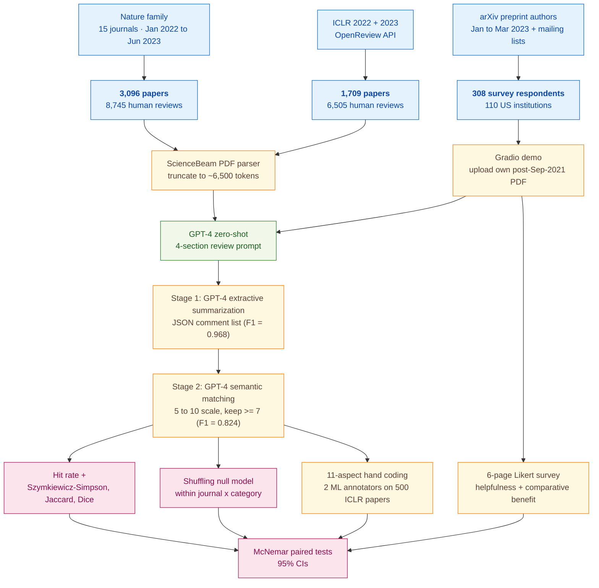
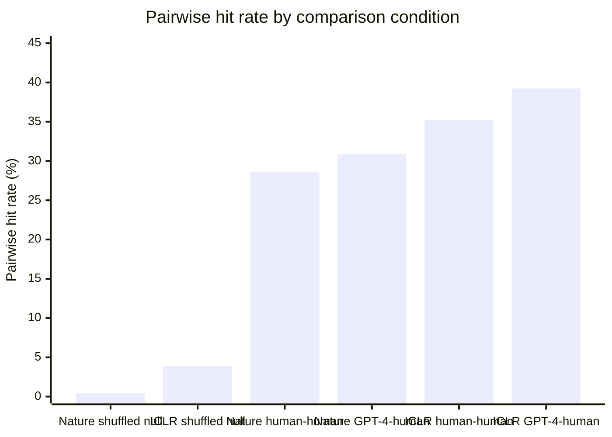
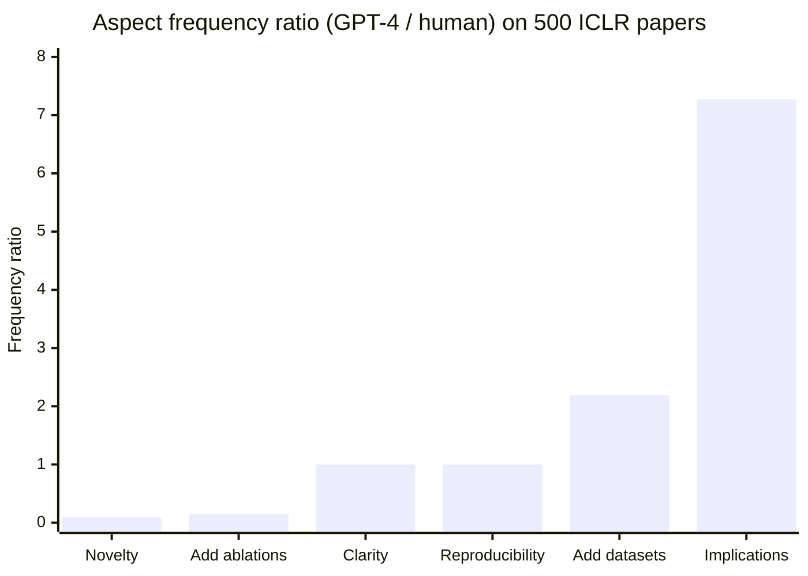
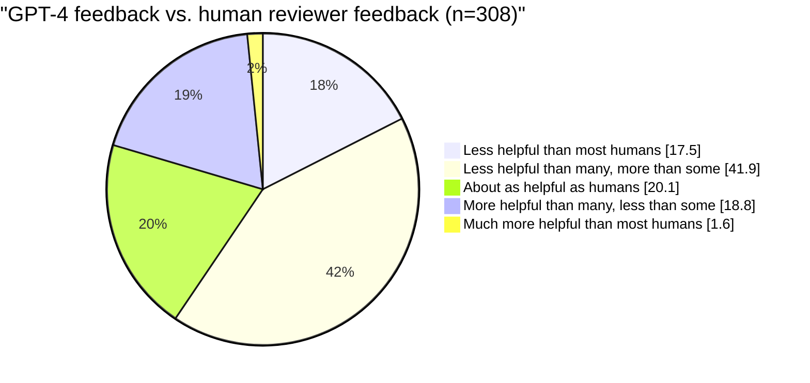

> [!success] **TL;DR**
> This is the single most-cited piece of evidence that general-purpose LLM peer review is in the same ballpark as human peer review at scale, and the methodological backbone — controlled human baselines, a shuffling null, a multi-stage validated pipeline, and a real user study — is solid. But the headline "comparable overlap" hides a substantive aspect skew (GPT-4 misses novelty almost entirely) and the test bed excludes the rejected and weak papers where pre-submission feedback would matter most.

## Structured abstract

> [!info] A plain-language summary built from this paper's discourse-graph nodes. Numbers and findings link back to specific EVD nodes — click any link to drill in.

### Question

Can a general-purpose large language model write peer-review feedback on a scientific paper that genuinely overlaps with what a human reviewer would say? The authors test GPT-4 against human reviews on two large corpora — papers from 15 Nature family journals and from the ICLR machine-learning conference — then run a prospective survey asking the authors of new papers whether GPT-4's feedback on their own work felt useful. They also include a shuffling test to rule out the easy explanation that GPT-4 just produces generic boilerplate. See [[QUE - How well do LLM-generated peer reviews overlap with human reviewer feedback on research papers?]].

### Methods

**Design.** The authors combined three nested studies: a retrospective benchmark of GPT-4 reviews against human reviews, a null-model permutation test for paper-specificity, and a prospective opt-in user survey of researchers who received GPT-4 feedback on their own papers.

**Tools.** The pipeline runs **GPT-4** zero-shot — that is, with no fine-tuning, given only the prompt — using a single forward pass per paper. PDFs are parsed with **ScienceBeam**, a machine-learning PDF parser, and truncated to roughly 6,500 tokens (title, abstract, figure and table captions, and main text). A second GPT-4 stage runs **extractive summarization** — pulling out a JSON list of distinct critical points — followed by a third GPT-4 stage that does **semantic matching** between two comment lists, scoring similarity on a 5-to-10 scale and keeping only matches rated 7 ("Strongly Related") or higher. The user-study front-end is a public **Gradio** web demo.

**Procedure.** GPT-4 reads each paper once and writes a 4-section review (significance and novelty, reasons for acceptance, reasons for rejection, suggestions for improvement). The two-stage extract-then-match pipeline then compares the GPT-4 review against each individual human review and computes a **hit rate** (the share of GPT-4 comments that overlap with at least one human comment). For the human-vs-human baseline, the authors take only the first N human comments — where N equals the number of GPT-4 comments — to control for set-size effects. The shuffling test reassigns each paper's GPT-4 review to a different paper from the same journal and category, then re-runs the same pipeline. For the aspect study, two machine-learning researchers hand-code each extracted comment against an 11-aspect schema and compute log-frequency ratios. For the user study, opt-in researchers upload their own post-September-2021 paper, receive GPT-4 feedback by email, and complete a 6-page survey with 5-point Likert ratings. Significance comes from McNemar-style paired tests with 95% confidence intervals.

**Sample.** The retrospective corpus combines **3,096 accepted Nature-family papers with 8,745 human reviews** (15 journals, January 2022 to June 2023) and **1,709 ICLR papers with 6,505 human reviews** (2022 and 2023 cycles). The aspect-coding sub-study draws a random sample of **500 ICLR papers**. The pipeline itself is validated on 639 feedbacks for the extraction stage and 12,035 comment pairs for the matching stage, with three co-authors providing inter-annotator agreement on 800 stratified pairs. The prospective survey reached **308 researchers from 110 US institutions** in computer science and computational biology, recruited via institute mailing lists and arXiv-author email scrapes, and compensated $20 each.

### Findings

- **GPT-4's review overlap with humans matches the overlap between two humans.** GPT-4 comments overlapped with an individual human reviewer's comments at a hit rate of **30.85%** on Nature, compared to **28.58%** for two humans on the same papers (p < 0.0001 versus a shuffled null). On ICLR the numbers were 39.23% versus 35.25%. The pattern held across four set-overlap metrics (hit rate, Szymkiewicz-Simpson, Jaccard, and Sorensen-Dice) and across all 15 journals (cross-journal correlation r = 0.80, p = 3.69 x 10^-4). [[EVD - GPT-4 feedback overlapped 30.85% with individual human reviewers on Nature journals comparable to human-human overlap of 28.58% - @liangCanLargeLanguage2024a]]

- **GPT-4 emphasizes very different aspects than humans.** GPT-4 commented on the **implications of research 7.27 times more often** than humans, and on **novelty 10.69 times less often**. Humans were 6.71x more likely than GPT-4 to ask for ablation experiments; GPT-4 was 2.19x more likely to ask for experiments on more datasets. The two reviewers agreed roughly evenly on clarity, efficiency, reproducibility, and prior-work comparison. The authors read this as evidence that GPT-4 and humans complement rather than substitute for each other. [[EVD - GPT-4 commented on research implications 7.27x more than humans and on novelty 10.69x less on ICLR papers - @liangCanLargeLanguage2024a]]

- **The shuffling test rules out generic boilerplate.** When the authors randomly reassigned GPT-4 reviews to other papers in the same journal and same Nature root category, the pairwise hit rate **collapsed from 30.85% to 0.43%** on Nature — a 71-fold drop — and from 39.23% to 3.91% on ICLR (p < 0.0001 in both datasets). Because the shuffle stayed within journal and category, the drop is not a topic-mismatch artifact; the GPT-4 review really is tailored to the specific paper. [[EVD - Pairwise GPT-4 feedback overlap dropped from 30.85% to 0.43% after shuffling confirming paper-specificity - @liangCanLargeLanguage2024a]]

- **Researchers found GPT-4 feedback useful on their own papers — though most did not call it as helpful as the best human reviewers.** Of 308 surveyed authors, **57.4% rated GPT-4 feedback helpful or very helpful** and **82.4% rated it more beneficial than feedback from at least some human reviewers**. But only 1.6% rated it more helpful than most humans, and 17.5% rated it less helpful than most humans. Roughly half (50.5%) said they would use the system again. [[EVD - 57.4% of 308 researchers found GPT-4 feedback helpful and 82.4% found it more beneficial than at least some human reviewers - @liangCanLargeLanguage2024a]]

### Claim supported

These findings support two claims. First, that [[CLM - LLM review quality is comparable to human review quality when provided with sufficient contextual information]] — when given the full paper, GPT-4's per-paper feedback overlaps with a single human reviewer's at roughly the rate two humans overlap with each other. Second, that [[CLM - LLM-generated scientific feedback is paper-specific and not merely generic boilerplate]] — the 71-fold collapse on shuffling is hard to explain any other way. For someone considering using such a system as a pre-submission review aid, the practical takeaway is more cautious than the headline numbers suggest: GPT-4 covers a comparable share of points to one human, but skews toward research-implications commentary and away from novelty assessment, so it is best read as a complement to human review rather than a replacement.

### Caveats

- **The Nature corpus contains only accepted papers.** GPT-4's overlap is measured against reviews of papers that already passed peer review, which is a high-quality slice of the literature. The full pre-submission feedback loop, where weaker papers might be the ones that most need help, is not tested. [[CVT - The Liang et al study used papers already accepted to journals which may not represent the full quality distribution]]

- **The user-study sample selected itself in.** The 308 survey respondents opted into a tool advertised as LLM scientific feedback, so they likely skew toward researchers already familiar with and favorably disposed toward AI tools. The authors flag this themselves. [[CVT - The Liang et al user study was subject to self-selection bias as participants opted in to receive LLM feedback]]

### Methods at a glance

### Results at a glance

Pairwise hit rate (the share of one reviewer's comments that overlap with another's, higher is better) — GPT-4-vs-human is on par with human-vs-human, while the shuffled null collapses to near zero:

Aspect-emphasis ratio (GPT-4 frequency divided by human frequency) — a value of 1 means equal emphasis; values above 1 mean GPT-4 over-emphasizes, below 1 mean GPT-4 under-emphasizes:

Survey-rated comparative benefit of GPT-4 feedback versus the human reviewers respondents had previously received (n = 308):

---

## Critical appraisal

> [!info] A risk-of-bias and validity assessment across five domains, synthesized from this paper's discourse-graph nodes. Each domain gets a rating (🟢 Low risk · 🟡 Some concerns · 🔴 High risk) plus a brief, EVD-grounded justification. The TRIPOD-LLM table below covers *reporting compliance*; this section covers *methodological quality*.

| Domain | Rating | Justification |
| --- | :---: | --- |
| **Construct validity** — does the metric actually measure the construct? | 🟡 | Hit rate (share of GPT-4 comments matching a human's) measures overlap, not review *quality* — two reviewers can overlap heavily and both be wrong. The aspect study reveals what the headline number hides: GPT-4 commented on novelty 10.69x less than humans, an aspect that is central to peer-review utility, so "comparable overlap" does not equal "comparable review". The user-study Likert ratings cover perceived helpfulness, not measurable downstream improvement (revision uptake, acceptance, error catches). |
| **Internal validity** — could the comparison be biased? | 🟢 | Comparisons are tightly controlled. Human-vs-human baselines truncate to N comments to match GPT-4's set size; the shuffled null preserves journal and Nature root category to rule out topic mismatch; all papers post-date the September 2021 GPT-4 training cutoff to limit memorization. The extract-and-match pipeline is itself validated against human coding (extraction F1 = 0.968, matching F1 = 0.824, three-annotator IAA F1 = 0.887). The biggest residual risk is that GPT-4 is judging both its own and the humans' comments in the matching stage — an LLM-judging-LLM scenario, although calibrated against human IAA. |
| **External validity** — do findings generalize? | 🔴 | Three large constraints. (1) The Nature corpus contains only **accepted** papers (see [[CVT - The Liang et al study used papers already accepted to journals which may not represent the full quality distribution]]) — performance on weaker pre-submission drafts is not tested. (2) The user study's 308 respondents opted in to an LLM-feedback tool, skewing toward AI-favorable researchers (see [[CVT - The Liang et al user study was subject to self-selection bias as participants opted in to receive LLM feedback]]). (3) Both retrospective corpora cover only English-language top-tier venues in life sciences and machine learning — generalization to other disciplines, languages, or quality strata is untested. |
| **Statistical rigor** — appropriate uncertainty + comparisons? | 🟡 | Headline contrasts use paired tests with 95% CIs and report p < 0.0001 against the shuffled null. Cross-journal and cross-decision Pearson correlations are reported. But the paper does not correct for multiple comparisons across 15 journals x 11 aspects x 4 overlap metrics, does not report inter-annotator agreement on the 11-aspect coding (the basis of the 7.27x and 10.69x headline ratios), and does not place CIs on individual aspect ratios. |
| **Reproducibility** — code, data, determinism? | 🟡 | Code is public at github.com/Weixin-Liang/LLM-scientific-feedback (TRIPOD-LLM 14f ✅) and the source data are sourced from public Nature pages and the OpenReview API. But the specific GPT-4 snapshot (e.g., gpt-4-0314 vs gpt-4-0613) is not disclosed (TRIPOD-LLM 6a ⚠️), nor are temperature, top_p, seed, or system prompt (TRIPOD-LLM 6c ⚠️), so the exact run-to-run numbers cannot be reproduced even with identical inputs. The 308 user-study survey responses are not stated to be publicly released. |

**Bottom line.** This is the single most-cited piece of evidence that general-purpose LLM peer review is in the same ballpark as human peer review at scale, and the methodological backbone — controlled human baselines, a shuffling null, a multi-stage validated pipeline, and a real user study — is solid. But the headline "comparable overlap" hides a substantive aspect skew (GPT-4 misses novelty almost entirely) and the test bed excludes the rejected and weak papers where pre-submission feedback would matter most. Read this paper as evidence that GPT-4 is a credible *complement* to human review, not as evidence that it could replace one.

> [!tip] **Applicable external appraisal frameworks beyond TRIPOD-LLM** (already covered by the table below): **HELM** (Liang et al. 2022) for holistic LLM-evaluation principles · **Datasheets for Datasets** (Gebru et al. 2021) for the evaluation corpus · **Model Cards** (Mitchell et al. 2019) for the LLMs being evaluated

---

## TRIPOD-LLM reporting summary

> [!info] Reporting compliance for this paper, mapped to the TRIPOD-LLM checklist (Methods items 5a–15 and Results items 16a–18). Compliance icons: ✅ fully reported · ⚠️ partially reported / unclear · ❌ should be reported but not reported · ➖ not applicable to this study. Item 17 (Performance) is reported per-EVD; see each EVD's `## Other Notes`.

| # | Item | ✓ | Reported in this study |
| --- | --- | :---: | --- |
| **5a** | Data sources | ✅ | Three datasets: (i) 15 Nature family journals via nature.com (Supp. Table 1); (ii) ICLR 2022 + 2023 via OpenReview API (Supp. Table 2); (iii) prospective survey of 308 arXiv-recruited authors. |
| **5b** | Data points + distribution | ✅ | Nature: 3,096 papers / 8,745 reviews (per-journal counts in Supp. Table 1; mean 12,444 paper tokens / 1,338 review tokens). ICLR: 1,709 papers / 6,505 reviews stratified by Oral/Spotlight/Poster/Reject/Withdrawn (Supp. Table 2; mean 5,841 paper tokens / 672 review tokens, Supp. Table 4). Aspect sub-study: 500 ICLR papers. |
| **5c** | Date range of data | ✅ | Nature: papers published Jan 1, 2022 – Jun 17, 2023. ICLR: 2022 + 2023 conference cycles. Survey: arXiv preprints from Jan–Mar 2023 (recruitment window); user-uploaded papers restricted to post-Sep 2021. |
| **5d** | Pre-processing / quality checks | ✅ | PDFs parsed with ScienceBeam (ML-based PDF parser); inputs truncated to first 6,500 tokens (title + abstract + figure/table captions + main text). Pipeline F1 validated for both extraction and matching stages (Supp. Table 3). |
| **5e** | Missing / imbalanced data | ⚠️ | Imbalance addressed by controlling for the number of comments when comparing GPT-4-vs-human against human-vs-human (set A truncated to first N comments). Stratified sampling of 800 pairs (400 matched + 400 not-matched) for IAA. No explicit handling of missing reviewer reports beyond restricting to journals with public review. |
| **6a** | LLM name + version | ⚠️ | "OpenAI's GPT-4" cited via the GPT-4 Technical Report (ref 19). Specific snapshot/version (e.g., gpt-4-0314 / gpt-4-0613) not disclosed. |
| **6b** | Development process | ✅ | Zero-shot, no fine-tuning; single forward pass per paper. Authors explicitly note "our system only leverages zero-shot learning of GPT-4 without fine-tuning on additional datasets." |
| **6c** | Inference settings / prompting | ⚠️ | Prompt structure described and a schematic prompt shown in Supp. Fig. 5 + Supp. Fig. 12 (4-section reviewer outline). Token budget (8,192) and input budget (~6,500 tokens) reported. Temperature, top_p, seed, and system prompt not reported. |
| **6d** | Output | ✅ | Structured natural-language feedback in 4 sections: significance & novelty, potential reasons for acceptance, potential reasons for rejection, suggestions for improvement. Downstream pipeline parses into JSON `{ID: comment}` lists. |
| **6e** | Classification thresholds | ✅ | Semantic-matching pipeline outputs a 5–10 similarity rating; only matches rated ≥ 7 ("Strongly Related") retained. Authors note 5–6 ratings introduced variability misaligned with humans. |
| **7a** | Quality metrics | ✅ | Hit rate (|A∩B|/|A|), Szymkiewicz–Simpson, Jaccard, Sørensen–Dice (Supp. Fig. 2). Pipeline-validation F1 / precision / recall reported for each stage. Pearson r for cross-journal and cross-decision consistency. Likert distributions for the user study. |
| **7b** | Relevance to downstream | ⚠️ | Downstream framing is "useful feedback for authors before submission"; user-study Likert ratings (helpfulness, willingness to reuse) provide partial downstream signal, but no measurable improvement in downstream paper quality (revision uptake, acceptance) is evaluated. |
| **7c** | Outcome definition | ✅ | Two outcomes operationalized: (a) automated semantic overlap between GPT-4 and human review comments; (b) self-reported helpfulness / comparative benefit on 5-point Likert scales. |
| **7d** | Subjective interpretation | ✅ | Multi-annotator coding for both pipeline-validation tasks (2 co-authors for extraction, 3 for matching IAA). User-study Likert ratings explicitly characterized as "subjective perceptions." |
| **7e** | Comparison | ✅ | GPT-4 vs. human reviewer (controlled for N comments); GPT-4 vs. shuffled GPT-4 (null model); GPT-4 vs. human across journals and ICLR decision strata; aspect-by-aspect log-frequency comparison; user-study comparison vs. perceived human reviewer feedback. |
| **8a** | Annotation guidelines | ⚠️ | 11-aspect annotation schema described (developed from ML peer-review literature + initial annotator exploration) and example codings shown (Supp. Tables 5, 6, 7). Pipeline-validation rubric (TP / FN / FP for extraction; matched-yes/no for matching) described. Full written codebook not in main text. |
| **8b** | Annotators + IAA | ⚠️ | Pipeline-validation IAA on matching stage: 89.8% pairwise agreement, F1 = 0.887 (3 annotators on 800 stratified pairs). For the 11-aspect ICLR aspect-coding sub-study, IAA / κ between the 2 ML-background annotators is not reported. |
| **8c** | Annotator background | ⚠️ | Aspect annotators described as "two researchers with a background in machine learning"; pipeline-validation annotators described as "co-authors." No further demographic detail. |
| **9a** | Prompt design | ⚠️ | Prompt schematic shown in Supp. Fig. 5 and Supp. Fig. 12; structure (4-section outline mirroring leading conferences and Nature reviewer instructions) described. Authors note "the architecture and prompt used in our study only represent one of the many possible forms" and acknowledge no systematic prompt engineering. |
| **9b** | Prompt-development data | ❌ | No held-out prompt-development set described. Authors describe "significant efforts in improving the performance of our GPT-4 feedback pipeline" but do not document the development data. |
| **10** | Summarization | ✅ | Stage 1 of the pipeline is GPT-4-based extractive summarization of feedback into JSON comment lists; references prior summarization literature (Luhn 1958, Edmundson 1969, TextRank, LexRank). Pipeline F1 = 0.968. |
| **11** | Instruction tuning / alignment | ➖ | Not applicable. GPT-4 used zero-shot; no fine-tuning, RLHF, or instruction tuning performed by the authors. |
| **12** | Compute | ❌ | Not reported. No GPU-hours, API-call counts, or cost figures disclosed. |
| **13** | Ethical approval | ✅ | Stanford University IRB approval reported for the prospective user study (p. 11). System ethics statement embedded in the Gradio demo discouraging direct use of LLM content for review-related tasks. |
| **14a** | Funding | ✅ | NSF (CCF 1763191; CAREER 1942926); NIH (P30AG059307; U01MH098953); Silicon Valley Foundation; Chan-Zuckerberg Initiative (J.Z.). Stanford Interdisciplinary Graduate Fellowship (H.C.). |
| **14b** | Conflicts of interest | ❌ | No competing-interests / conflicts statement appears in the manuscript text reviewed. |
| **14c** | Protocol | ❌ | No pre-registered protocol referenced. |
| **14d** | Registration | ➖ | Not applicable (not a clinical trial). |
| **14e** | Data availability | ⚠️ | Source data sourced from public Nature website + OpenReview API (URLs cited). User-study survey responses are not stated to be publicly released. No explicit data-availability statement aggregating the released artifacts. |
| **14f** | Code availability | ✅ | github.com/Weixin-Liang/LLM-scientific-feedback (URL printed in the Code Availability section, p. 11). |
| **15** | Patient/public involvement | ➖ | Not applicable (no patient-facing application). |
| **16a** | Flow of data | ⚠️ | Nature: 3,096 papers / 8,745 reviews flow into the pipeline. ICLR: 1,709 / 6,505 with stratified sampling counts in Supp. Table 2. Survey: 308 respondents from 110 institutions. No explicit CONSORT-style exclusions diagram for the survey (e.g., emails sent → opened → uploaded paper → completed survey). |
| **16b** | Characteristics | ✅ | Per-journal paper / review counts (Supp. Table 1); per-decision counts for ICLR (Supp. Table 2); mean token lengths per dataset (Supp. Table 4); user-study covariates (publishing experience, professional status — Supp. Figs. 3, 4). |
| **16c** | Distribution comparison | ➖ | Not applicable in the clinical-subgroup sense. The closest analogues — per-journal and per-decision overlap stratifications — are reported (Fig. 2c, d). |
| **16d** | N per analysis | ✅ | Nature overlap: 3,096 papers. ICLR overlap: 1,709 papers. Aspect-coding sub-study: 500 ICLR papers. Pipeline validation: 639 feedbacks (extraction); 760 feedback pairs / 12,035 comment pairs (matching); 800 stratified pairs (IAA). User study: 308 respondents. |
| **17** | Performance | (per-EVD) | Reported per-EVD. See each EVD's `## Other Notes`. |
| **18** | LLM updating | ➖ | Not applicable. No LLM updating, fine-tuning, or retraining over time is reported. |
