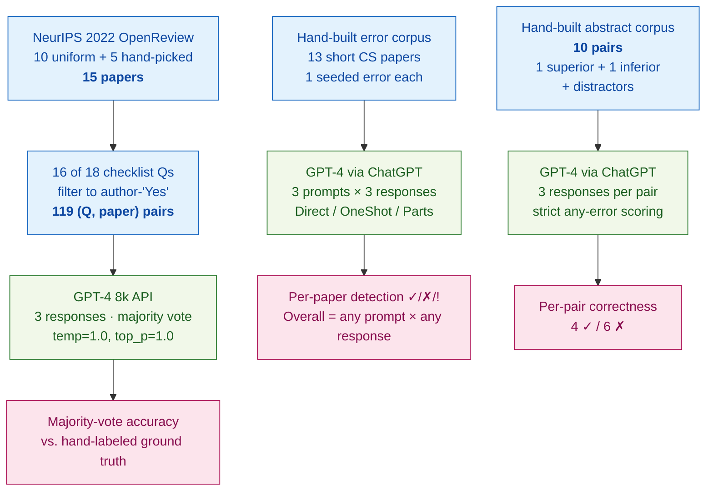

> [!success] **TL;DR**
> This is an exploratory pilot, framed as such; it shows GPT-4 can plausibly help with the most structured reviewing subtask (checklist verification at 87%, or 93% if you exclude figure-only items) while failing at the least structured one (picking the better abstract, where it lands below chance under strict scoring). The numbers are too small and too domain-restricted to support deployment decisions, but the failure modes (prompt injection, positive-result bias, algorithm-name effects) are concrete enough to inform what guardrails any future reviewer-assistant tool would need.

## Abstract

### Question

Can a large language model help review computer science papers? The authors break "reviewing" into three concrete jobs: spotting deliberately-planted errors in short papers, verifying author-completed conference checklists, and picking the better of two abstracts. The goal is to learn whether GPT-4 can serve as a useful reviewer assistant, not whether it can replace human reviewers outright. See [[QUE - Can LLMs identify errors in scientific papers?]].

### Methods

**Design.** The authors ran three small, controlled studies on three hand-built corpora: a constructed-error benchmark, a checklist-verification benchmark against hand-labeled ground truth, and an adversarial abstract-comparison benchmark.

**Tools.** GPT-4 was used in all three studies. The checklist study called the OpenAI API directly (`gpt-4`, 8k context, queried May 20–23 2023, with `temperature=1.0` and `top_p=1.0` chosen by a small pilot sweep). The error-detection and abstract-comparison studies used GPT-4 through the ChatGPT web interface (May 3 and May 12 2023 builds), so the inference settings were ChatGPT defaults. The authors also piloted eight other LLMs (Bard, Vicuna, Koala, Alpaca, LLaMa, Dolly, OpenAssistant, StableLM) on the error task. Three prompt templates appear in the error study: `Prompt-Direct` (just the paper, no example), `Prompt-OneShot` (paper plus one worked example of an erroneous paper and a sample review), and `Prompt-Parts` (paper fed one sentence at a time so the model can flag errors incrementally).

**Procedure.** For the error study, the authors hand-wrote 13 short CS papers, each one seeded with one specific error, and then queried GPT-4 three times for each (paper, prompt) combination. A paper counted as "caught" if any of the three responses flagged the planted error. For the checklist study, the authors sampled 15 NeurIPS 2022 papers from OpenReview, picked 16 of 18 checklist questions per paper, and kept only items where authors had answered "Yes", leaving 119 question-paper pairs. The first author hand-labeled each pair as Yes / No / N/A, then re-labeled them a second time for calibration. GPT-4 was queried three times per pair, and the majority answer was scored against the human label. For the abstract study, the authors wrote 10 abstract pairs in which one is plainly better; some pairs added distractors like buzzwords, a Nobel-laureate byline, or a literal prompt-injection sentence. GPT-4 picked one abstract per query, three responses per pair, and a pair counted as "wrong" if any response chose the inferior abstract (a strict scoring rule, since the right answer was meant to be obvious).

**Sample.** Three small corpora, all hand-built. Error study: 13 short papers (no exclusions). Checklist study: 15 papers chosen from NeurIPS 2022 OpenReview, 10 by uniform random sampling and 5 hand-picked to cover the crowdsourcing/human-subjects checklist category, yielding 240 candidate question-paper pairs, filtered to 119 author-"Yes" pairs for analysis. Abstract study: 10 hand-built abstract pairs, one per intervention type. The unit of analysis is the {paper}, {question, paper} pair, or {abstract pair}; a single CS graduate student (the first author) provided checklist labels.

### Findings

- **GPT-4 caught half of the planted errors.** Across the 13 short papers, GPT-4 detected the planted error in 7 of 13 papers when given any chance across three prompt templates (53.8%). The strongest single template was `Prompt-Parts` (paper fed sentence-by-sentence), at 7 of 13. Every paper GPT-4 missed lacked a complete proof, meaning detection would have required outside knowledge rather than a local deductive check. The other 8 LLMs the authors tried failed on every paper. [[EVD - GPT-4 correctly detected errors in 7 of 13 constructed short CS papers - @liuReviewerGPTExploratoryStudy2023]]

- **GPT-4 verified NeurIPS checklists about as accurately as the authors themselves.** GPT-4's majority-vote answers matched the hand-labeled ground truth on 86.6% of the 119 question-paper pairs. By coincidence, the author-submitted checklists matched the same ground truth at 86.6% as well, but the errors barely overlapped: GPT-4 disagreed with 75% (12 of 16) of the items where authors were wrong, and 56.3% (9 of 16) of GPT-4's mistakes were on items the authors got right. Half of GPT-4's errors involved questions whose answers required reading figures (which the text-only prompt could not see); excluding those raised accuracy to 92.8%. [[EVD - GPT-4 achieved 86.6% majority-vote accuracy on 119 NeurIPS checklist question-paper pairs - @liuReviewerGPTExploratoryStudy2023]]

- **GPT-4 picked the wrong abstract more often than the right one.** On 10 hand-built abstract pairs where one paper is plainly stronger, GPT-4 picked the inferior one in 6 of 10 cases (60% error). Failures included a positive-result bias, mis-reading parameter ranges, mis-reading lower bounds, falling for a literal prompt-injection sentence, getting swayed by bombastic language, and being influenced by the algorithm's name. The four successes covered null-result interpretation, upper bounds, buzzwords, and a Nobel-laureate author byline. [[EVD - GPT-4 made errors in 6 of 10 abstract comparison pairs favoring the inferior abstract - @liuReviewerGPTExploratoryStudy2023]]

### Claim supported

Together these three studies support [[CLM - LLMs show promise for targeted reviewing subtasks but are not yet capable of functioning as standalone peer reviewers]] and [[CLM - Targeted question prompting elicits substantially better LLM performance than open-ended review generation]]. The practical takeaway: a tool that hits 87% on a structured checklist could plausibly help a program chair flag suspect items for human attention, but a tool that picks the wrong abstract 60% of the time, and falls for a prompt injection, should not be allowed near acceptance decisions.

### Caveats

- **The checklist ground truth came from author self-reports.** The first author labeled checklist items by reading the paper and deferring to the author's submitted answer when unsure. Because authors and the ground truth match 86.6% by construction, GPT-4's 86.6% accuracy may partly measure agreement with author self-assessment rather than objective compliance. [[CVT - Checklist ground truth relied on author-stated responses rather than independent verification]]

- **Only GPT-4 worked at all on error detection.** Eight other LLMs (Bard, Vicuna, Koala, Alpaca, LLaMa, Dolly, OpenAssistant, StableLM) caught zero of 13 errors in the pilot, so all reported results pertain to GPT-4 only. The findings do not generalize to the broader open-source ecosystem of the time. [[CVT - Only GPT-4 was tested for error detection as all other LLMs failed entirely]]

- **The error and abstract corpora are author-built, not real submissions.** The 13 short papers and 10 abstract pairs were written by the authors with errors deliberately inserted, so the test set has no true negatives, no real-paper length, and no real-reviewer ambiguity. Performance on real conference submissions is unknown. [[CVT - The error detection study used constructed short papers rather than real manuscript submissions]]

### Methods at a glance

---

## Quality appraisal

> [!info] Risk-of-bias and validity assessment, synthesized from this paper's discourse-graph nodes and grounded in the same paper this page's top trust-signal chips summarize. Covers *methodological quality*, the TRIPOD-LLM table below covers *reporting compliance* instead.
> <dl class="callout-legend">
> <dt>● Low risk</dt><dd>No meaningful threat to this domain identified</dd>
> <dt>◐ Some risk</dt><dd>A real but non-fatal limitation</dd>
> <dt>○ High risk</dt><dd>A significant, unaddressed threat to validity</dd>
> </dl>

| Domain | Rating | Quote |
| --- | :---: | --- |
| **Construct validity**: does the metric actually measure the construct? | 🟡 | *"author-submitted checklists also match the ground truth 86.6% of the time"* `§4.2, p.28`, the checklist headline coincidentally matches the author self-report rate, so accuracy alone doesn't isolate genuine compliance-checking from agreement with author claims |
| **Internal validity**: could the comparison be biased? | 🟡 | *"we consider it as a ✓ if any of the responses to any of the prompts was a ✓"* `§3.2, p.5` vs. *"we consider it as a × if any of the responses to any of the prompts was a ×"* `§5.3, p.33`, the error study uses a lenient any-hit rule while the abstract study uses a strict any-miss rule |
| **External validity**: do findings generalize? | 🔴 | *"we constructed 13 short papers, intentionally infusing each of them with a key error"* `§1, p.1`, small hand-built CS-only corpora (13 papers, 10 abstract pairs) with errors the authors planted themselves |
| **Statistical Conclusion Validity**: appropriate uncertainty + comparisons? | 🔴 | Not reported, no confidence intervals, significance tests, or multiple-comparison correction appear across the three studies |
| **Reproducibility**: code, data, determinism? | 🟡 | *"we access the GPT-4 model through ChatGPT (May 3 and May 12 builds)"* `§3.1, p.5`, code and data are public at github.com/niharshah/ReviewerGPT2023, but two of three studies ran on undocumented ChatGPT web-UI settings rather than the pinned API |
| **Data leakage**: could models have seen this data pretraining? | 🟡 | *"The papers we selected were published in NeurIPS after the GPT-4 training data cutoff, so it is unlikely that the model had previously seen their checklists."* `§4.1, p.27`, addressed for the checklist study only, not for the error-detection or abstract-comparison corpora |
| **Baseline adequacy**: is there a meaningful floor to beat? | 🟡 | *"author-submitted checklists also match the ground truth 86.6% of the time"* `§4.2, p.28`, a real comparator exists for the checklist task, but the error-detection and abstract studies have no equivalent baseline |
| **Train/dev/test hygiene**: are data splits kept separate? | 🟡 | *"for a separate NeurIPS 2022 paper and for one checklist question from each checklist category, we evaluated GPT-4's responses varying the temperature hyperparameter"* `§4.1, p.28`, hyperparameters were tuned on a held-out paper kept separate from the 15-paper evaluation set, but no such separation is described for the other two studies |
| **Multiple-comparisons correction**: controlled for repeated testing? | 🔴 | Not reported, no correction is stated across the three studies, three prompt templates, and 16 checklist questions |
| **Human-baseline comparability**: is there a human reference point? | 🟢 | *"author-submitted checklists also match the ground truth 86.6% of the time, although the mismatches may potentially be due to later paper revisions"* `§4.2, p.28`, the authors' own checklist answers serve as a direct human comparator |
| **Confidence Intervals**: are point estimates accompanied by an interval? | 🔴 | Not reported: accuracy/hit-rate percentages across constructed test cases carry no interval |
| **Chance-Corrected Metrics**: does agreement/accuracy correct for chance? | 🔴 | Not reported: results are reported as raw accuracy/hit-rate percentages across constructed test cases |
| **Non-Significant Result Spin**: are null or negative findings framed plainly? | 🔴 | Not applicable: no statistical tests are run on the paper's own results, so there is no null/non-significant finding to potentially spin |
| **Ablation Experiment(s)**: does the paper isolate a component's contribution? | 🟡 | Three prompting strategies (Prompt-Direct, Prompt-OneShot, Prompt-Parts) are compared per task with per-response performance tabulated `Table 1, p.4-6`, a prompt-variant comparison, not a systematic ablation of a pipeline/system component |
| **AI Writing Check**: does the paper's own prose read as AI-generated? | 🟢 | Independent recheck run because this source has 2+ high-risk validity domains and low TRIPOD-LLM reporting compliance. Pangram v4.0 AI-text detector (Bulk API job `blk_67300368bbd040638643bc4a30458fb3`): *"We believe this text is mainly human-written, with some AI content."* (8.6% AI-generated, 0% AI-assisted), the flagged spans coincide with the paper's own Appendix (sample GPT-4-generated peer reviews the authors quote as worked examples of their prompting method), not the authors' own prose |
| **Code Quality**: does the released code follow FAIR-software practices? | 🔴 | `howfairis` (fair-software.eu 5-criteria checklist) against https://github.com/niharshah/ReviewerGPT2023: **1/5**: open repository only: no license, package-registry listing, citation metadata, or quality-checklist badge. |
| **Data Quality**: is the released dataset FAIR? | 🔴 | FAIR-Checker (12 semantic-web metrics, 0-2 each) against https://github.com/niharshah/ReviewerGPT2023: **4/24**. |

**Bottom line.** This is an exploratory pilot, framed as such; it shows GPT-4 can plausibly help with the most structured reviewing subtask (checklist verification at 87%, or 93% if you exclude figure-only items) while failing at the least structured one (picking the better abstract, where it lands below chance under strict scoring). The numbers are too small and too domain-restricted to support deployment decisions, but the failure modes (prompt injection, positive-result bias, algorithm-name effects) are concrete enough to inform what guardrails any future reviewer-assistant tool would need.

> [!tip] **Applicable external appraisal frameworks beyond TRIPOD-LLM** (already covered by the table below): **HELM** (Liang et al. 2022) for holistic LLM-evaluation principles · **Datasheets for Datasets** (Gebru et al. 2021) for the evaluation corpus · **Model Cards** (Mitchell et al. 2019) for the LLMs being evaluated

---

## TRIPOD-LLM reporting summary

> [!info] Reporting compliance for this paper, mapped to the TRIPOD-LLM checklist (Title/Abstract/Introduction items 1–4, Methods items 5a–15, Results items 16a–18). TRIPOD-LLM is a clinical-ML guideline being applied here to a non-clinical AI-research benchmark, where an item's own wording says "healthcare context" or "care pathway," it's read as "research-evaluation context" / "research workflow" instead. Item 17 (Performance) is reported per-EVD; see each EVD's `## Other Notes`.
> 

> ●Fully reported
> ◐Partial / unclear
> ○Not reported
> –Not applicable
> 

| # | Item | ✓ | Quote |
| --- | --- | :---: | --- |
| **1** | Title | ⚠️ | *"ReviewerGPT? An Exploratory Study on Using Large Language Models for Paper Reviewing"* `Title, p.1` |
| **2** | Abstract | ➖ | Assessed separately under TRIPOD-LLM's own Abstract extension, not scored here |
| **3a** | Background: context + rationale | ✅ | *"Peer review is highly strained due to fast increasing numbers of submissions and overburdening of reviewers"* `§1, p.1` |
| **3b** | Background: target population | ⚠️ | *"can they be used for reviewing scientific papers (or proposals)?"* `§1, p.1` |
| **4** | Objectives | ✅ | *"we conduct an exploratory study on whether and how LLMs can be used for reviewing"* `§1, p.1` |
| **5a** | Data sources | ✅ | *"We constructed 13 short papers (detailed in Section 3.3). In each of these papers, we deliberately inserted an error"* `§3.1, p.4` |
| **5b** | Data points + distribution | ✅ | *"across 119 {checklist question, paper} pairs, the LLM had an 86.6% accuracy"* `Abstract, p.1` |
| **5c** | Date range of data | ⚠️ | *"We queried GPT-4 through the gpt-4 model in the OpenAI API ... (accessed 5/20/23 - 5/23/23)"* `footnote 5, p.28`, construction dates for the short papers and abstract pairs not given |
| **5d** | Pre-processing / quality checks | ✅ | *"for each {question, paper} pair, we selected the section(s) in the paper that best correspond to each question, and only provided those section(s) in the prompt"* `§4.1, p.27` |
| **5e** | Missing / imbalanced data | ✅ | *"we only consider questions where the authors labeled \"Yes\" in their original checklist, as these are the items that the authors claim to have completed"* `§4.1, p.27` |
| **6a** | LLM name + version | ✅ | *"we access the GPT-4 model through ChatGPT (May 3 and May 12 builds)"* `§3.1, p.5` |
| **6b** | Development process | ➖ | Not applicable: no model training or fine-tuning; off-the-shelf inference only |
| **6c** | Inference settings / prompting | ✅ | *"we evaluated GPT-4's responses varying the temperature hyperparameter in {0, 0.1, 0.2, . . . , 2.0} and the top p hyperparameter in {0, 0.1, 0.2, . . . , 1.0}... we use (1.0, 1.0) as the hyperparameter settings"* `§4.1, p.28` |
| **6d** | Output | ✅ | *"please answer the following question with yes, no, or n/a and provide a brief justification for your answer"* `§4.1, p.28` |
| **6e** | Classification thresholds | ✅ | *"we consider it as a ✓ if any of the responses to any of the prompts was a ✓"* `§3.2, p.5` |
| **7a** | Quality metrics | ✅ | *"compared to the hand-labeled ground truth, GPT-4 achieves 86.6% accuracy across 119 examples"* `§4.2, p.28` |
| **7b** | Relevance to downstream use | ⚠️ | *"Delegating tasks such as verifying checklists to the LLM can help reduce the burden on (human) reviewers."* `§6, p.48`, no formal downstream-utility analysis (e.g., reviewer time saved) |
| **7c** | Outcome definition | ✅ | *"we consider it as a ✓ if any of the responses to any of the prompts was a ✓. This is because in practice, one can obtain multiple responses to multiple prompts and flag the paper if any of them detect an error."* `§3.2, p.5` |
| **7d** | Subjective interpretation | ⚠️ | *"Each entry is manually labeled by one computer science graduate student (first author of the present paper)"* `§4.1, p.27`, single labeler, no second rater |
| **7e** | Comparison | ✅ | *"author-submitted checklists also match the ground truth 86.6% of the time"* `§4.2, p.28` |
| **8a** | Annotation guidelines | ✅ | *"we performed both a keyword search and a full scan of the paper contents to form a preliminary ground truth label"* `§4.1, p.27` |
| **8b** | Annotators + IAA | ❌ | Not reported: single annotator (first author); no second labeler or inter-annotator agreement statistic given |
| **8c** | Annotator background | ✅ | *"with a past publication in the NeurIPS conference and experience as workflow chair in a top CS conference"* `§4.1, p.27` |
| **9a** | Prompt design | ✅ | *"System prompt: You are a computer science researcher currently reviewing a paper titled \"[paper title]\" for the NeurIPS computer science conference."* `§4.1, p.28` |
| **9b** | Prompt-development data | ✅ | *"for a separate NeurIPS 2022 paper and for one checklist question from each checklist category, we evaluated GPT-4's responses varying the temperature hyperparameter"* `§4.1, p.28` |
| **10** | Summarization | ➖ | Not applicable: no summarization endpoint evaluated |
| **11** | Instruction tuning / alignment | ➖ | Not applicable: no model training, fine-tuning, or alignment performed |
| **12** | Compute | ⚠️ | *"we used the standard GPT-4 model with 8k tokens for the context. Due to limits on the token count, we were not able to pass in entire papers to the model."* `§4.1, p.27-28`, no GPU/API cost or wall-clock reported |
| **13** | Ethical approval | ➖ | Not applicable: no human-subjects data collected by the authors; no IRB/ethics-committee statement present for this paper's own study |
| **14a** | Funding | ✅ | *"This work was supported by NSF CAREER 1942124."* `Acknowledgments, p.49` |
| **14b** | Conflicts of interest | ❌ | Not reported |
| **14c** | Protocol | ❌ | Not reported |
| **14d** | Registration | ➖ | Not applicable: not a registered clinical study |
| **14e** | Data availability | ✅ | *"More details on the code implementation, manual labels, the pilot, and all of GPT-4's responses in the experiment are available at https://github.com/niharshah/ReviewerGPT2023."* `§4.1, p.28` |
| **14f** | Code availability | ✅ | *"Additional responses from the LLM are available at https://github.com/niharshah/ReviewerGPT2023."* `§5.3, p.33` |
| **15** | Patient/public involvement | ➖ | Not applicable |
| **16a** | Flow of data | ✅ | *"After removing two checklist items (Appendix B.1), we list the remaining 16 NeurIPS 2023 checklist items"* `§B.2, p.59` |
| **16b** | Characteristics | ✅ | *"Table 2: Accuracy of GPT-4 on papers and checklist questions."* `Table 2, p.29` |
| **16c** | Distribution comparison | ➖ | Not applicable: no clinical-outcome subgroup comparison |
| **16d** | N per analysis | ✅ | *"we selected 15 papers from the NeurIPS 2022 conference OpenReview platform"* `§4.1, p.27` |
| **17** | Performance | `per-EVD` | Reported per-EVD. See each EVD's `## Other Notes`. |
| **18** | LLM updating | ➖ | Not applicable: no model updating reported |
