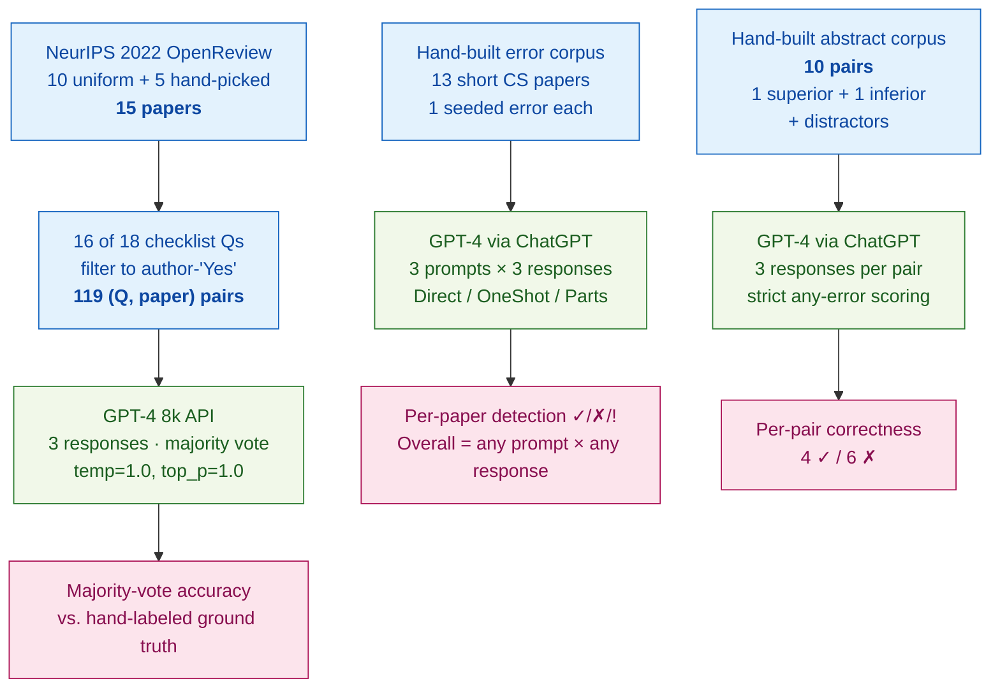

> [!success] **TL;DR**
> This is an exploratory pilot, framed as such — it shows GPT-4 can plausibly help with the most structured reviewing subtask (checklist verification at 87%, or 93% if you exclude figure-only items) while failing at the least structured one (picking the better abstract, where it lands below chance under strict scoring). The numbers are too small and too domain-restricted to support deployment decisions, but the failure modes (prompt injection, positive-result bias, algorithm-name effects) are concrete enough to inform what guardrails any future reviewer-assistant tool would need.

## Structured abstract

> [!info] A plain-language summary built from this paper's discourse-graph nodes. Numbers and findings link back to specific EVD nodes — click any link to drill in.

### Question

Can a large language model help review computer science papers? The authors break "reviewing" into three concrete jobs: spotting deliberately-planted errors in short papers, verifying author-completed conference checklists, and picking the better of two abstracts. The goal is to learn whether GPT-4 can serve as a useful reviewer assistant, not whether it can replace human reviewers outright. See [[QUE - Can LLMs identify errors in scientific papers?]].

### Methods

**Design.** The authors ran three small, controlled studies on three hand-built corpora: a constructed-error benchmark, a checklist-verification benchmark against hand-labeled ground truth, and an adversarial abstract-comparison benchmark.

**Tools.** GPT-4 was used in all three studies. The checklist study called the OpenAI API directly (`gpt-4`, 8k context, queried May 20–23 2023, with `temperature=1.0` and `top_p=1.0` chosen by a small pilot sweep). The error-detection and abstract-comparison studies used GPT-4 through the ChatGPT web interface (May 3 and May 12 2023 builds), so the inference settings were ChatGPT defaults. The authors also piloted eight other LLMs (Bard, Vicuna, Koala, Alpaca, LLaMa, Dolly, OpenAssistant, StableLM) on the error task. Three prompt templates appear in the error study: `Prompt-Direct` (just the paper, no example), `Prompt-OneShot` (paper plus one worked example of an erroneous paper and a sample review), and `Prompt-Parts` (paper fed one sentence at a time so the model can flag errors incrementally).

**Procedure.** For the error study, the authors hand-wrote 13 short CS papers — each one seeded with one specific error — and then queried GPT-4 three times for each (paper, prompt) combination. A paper counted as "caught" if any of the three responses flagged the planted error. For the checklist study, the authors sampled 15 NeurIPS 2022 papers from OpenReview, picked 16 of 18 checklist questions per paper, and kept only items where authors had answered "Yes" — leaving 119 question-paper pairs. The first author hand-labeled each pair as Yes / No / N/A, then re-labeled them a second time for calibration. GPT-4 was queried three times per pair, and the majority answer was scored against the human label. For the abstract study, the authors wrote 10 abstract pairs in which one is plainly better; some pairs added distractors like buzzwords, a Nobel-laureate byline, or a literal prompt-injection sentence. GPT-4 picked one abstract per query, three responses per pair, and a pair counted as "wrong" if any response chose the inferior abstract (a strict scoring rule, since the right answer was meant to be obvious).

**Sample.** Three small corpora, all hand-built. Error study: 13 short papers (no exclusions). Checklist study: 15 papers chosen from NeurIPS 2022 OpenReview — 10 by uniform random sampling and 5 hand-picked to cover the crowdsourcing/human-subjects checklist category — yielding 240 candidate question-paper pairs, filtered to **119 author-"Yes" pairs** for analysis. Abstract study: 10 hand-built abstract pairs, one per intervention type. The unit of analysis is the {paper}, {question, paper} pair, or {abstract pair}; a single CS graduate student (the first author) provided checklist labels.

### Findings

- **GPT-4 caught half of the planted errors.** Across the 13 short papers, GPT-4 detected the planted error in 7 of 13 papers when given any chance across three prompt templates (53.8%). The strongest single template was `Prompt-Parts` (paper fed sentence-by-sentence), at 7 of 13. Every paper GPT-4 missed lacked a complete proof — meaning detection would have required outside knowledge rather than a local deductive check. The other 8 LLMs the authors tried failed on every paper. [[EVD - GPT-4 correctly detected errors in 7 of 13 constructed short CS papers - @liuReviewerGPTExploratoryStudy2023]]

- **GPT-4 verified NeurIPS checklists about as accurately as the authors themselves.** GPT-4's majority-vote answers matched the hand-labeled ground truth on 86.6% of the 119 question-paper pairs. By coincidence, the author-submitted checklists matched the same ground truth at 86.6% as well — but the errors barely overlapped: GPT-4 disagreed with 75% (12 of 16) of the items where authors were wrong, and 56.3% (9 of 16) of GPT-4's mistakes were on items the authors got right. Half of GPT-4's errors involved questions whose answers required reading figures (which the text-only prompt could not see); excluding those raised accuracy to 92.8%. [[EVD - GPT-4 achieved 86.6% majority-vote accuracy on 119 NeurIPS checklist question-paper pairs - @liuReviewerGPTExploratoryStudy2023]]

- **GPT-4 picked the wrong abstract more often than the right one.** On 10 hand-built abstract pairs where one paper is plainly stronger, GPT-4 picked the inferior one in 6 of 10 cases (60% error). Failures included a positive-result bias, mis-reading parameter ranges, mis-reading lower bounds, falling for a literal prompt-injection sentence, getting swayed by bombastic language, and being influenced by the algorithm's name. The four successes covered null-result interpretation, upper bounds, buzzwords, and a Nobel-laureate author byline. [[EVD - GPT-4 made errors in 6 of 10 abstract comparison pairs favoring the inferior abstract - @liuReviewerGPTExploratoryStudy2023]]

### Claim supported

Together these three studies support [[CLM - LLMs show promise for targeted reviewing subtasks but are not yet capable of functioning as standalone peer reviewers]] and [[CLM - Targeted question prompting elicits substantially better LLM performance than open-ended review generation]]. The practical takeaway: a tool that hits 87% on a structured checklist could plausibly help a program chair flag suspect items for human attention, but a tool that picks the wrong abstract 60% of the time — and falls for a prompt injection — should not be allowed near acceptance decisions.

### Caveats

- **The checklist ground truth came from author self-reports.** The first author labeled checklist items by reading the paper and deferring to the author's submitted answer when unsure. Because authors and the ground truth match 86.6% by construction, GPT-4's 86.6% accuracy may partly measure agreement with author self-assessment rather than objective compliance. [[CVT - Checklist ground truth relied on author-stated responses rather than independent verification]]

- **Only GPT-4 worked at all on error detection.** Eight other LLMs (Bard, Vicuna, Koala, Alpaca, LLaMa, Dolly, OpenAssistant, StableLM) caught zero of 13 errors in the pilot, so all reported results pertain to GPT-4 only. The findings do not generalize to the broader open-source ecosystem of the time. [[CVT - Only GPT-4 was tested for error detection as all other LLMs failed entirely]]

- **The error and abstract corpora are author-built, not real submissions.** The 13 short papers and 10 abstract pairs were written by the authors with errors deliberately inserted, so the test set has no true negatives, no real-paper length, and no real-reviewer ambiguity. Performance on real conference submissions is unknown. [[CVT - The error detection study used constructed short papers rather than real manuscript submissions]]

### Methods at a glance

---

## Critical appraisal

> [!info] A risk-of-bias and validity assessment across five domains, synthesized from this paper's discourse-graph nodes. Each domain gets a rating (🟢 Low risk · 🟡 Some concerns · 🔴 High risk) plus a brief, EVD-grounded justification. The TRIPOD-LLM table below covers *reporting compliance*; this section covers *methodological quality*.

| Domain | Rating | Justification |
| --- | :---: | --- |
| **Construct validity** — does the metric actually measure the construct? | 🟡 | Each task uses a sensible operationalization (planted-error detection, Yes/No/N/A label match, pick-the-better-abstract), but accuracy alone is a thin proxy for reviewer utility. The checklist study's 86.6% headline coincidentally matches the author self-report rate, so the metric does not isolate "compliance with the checklist as intended" from "agreement with author claims" — see [[CVT - Checklist ground truth relied on author-stated responses rather than independent verification]]. |
| **Internal validity** — could the comparison be biased? | 🟡 | The error-detection and abstract studies use asymmetric scoring rules (lenient any-of-3 for errors; strict any-error-of-3 for abstracts), which inflates the gap between studies. The checklist baseline is the authors' own submitted answers — there is no independent human-reviewer baseline. There is no prompt-injection control in the abstract study (only one injection pair), so the failure mode is illustrative, not estimated. |
| **External validity** — do findings generalize? | 🔴 | Small hand-built corpora dominate two of three studies (n=13 papers, n=10 abstract pairs), and all three corpora are CS-domain only. The error and abstract studies use papers the authors wrote themselves with errors inserted — see [[CVT - The error detection study used constructed short papers rather than real manuscript submissions]]. The error-detection finding is single-model: only GPT-4 produced any signal in the pilot — see [[CVT - Only GPT-4 was tested for error detection as all other LLMs failed entirely]]. |
| **Statistical rigor** — appropriate uncertainty + comparisons? | 🔴 | No confidence intervals, no significance tests, no multiple-comparison correction across the three studies × 16 questions × multiple prompts. Sample sizes (n=10, n=13, n=119 with severe class imbalance) are too small to support precise claims. A single annotator labels all 119 checklist pairs, so inter-annotator agreement is undefined. |
| **Reproducibility** — code, data, determinism? | 🟡 | All three datasets and GPT-4 raw responses are public at github.com/niharshah/ReviewerGPT2023 (TRIPOD-LLM 14e ✅, 14f ✅). However, two of the three studies use ChatGPT (May 3 / May 12 2023 builds) rather than the API, with sampling parameters undocumented. With temperature=1.0 in the API study and ChatGPT defaults elsewhere, exact replication of the Yes/No/N/A majority-vote outcomes is not possible. |

**Bottom line.** This is an exploratory pilot, framed as such — it shows GPT-4 can plausibly help with the most structured reviewing subtask (checklist verification at 87%, or 93% if you exclude figure-only items) while failing at the least structured one (picking the better abstract, where it lands below chance under strict scoring). The numbers are too small and too domain-restricted to support deployment decisions, but the failure modes (prompt injection, positive-result bias, algorithm-name effects) are concrete enough to inform what guardrails any future reviewer-assistant tool would need.

> [!tip] **Applicable external appraisal frameworks beyond TRIPOD-LLM** (already covered by the table below): **HELM** (Liang et al. 2022) for holistic LLM-evaluation principles · **Datasheets for Datasets** (Gebru et al. 2021) for the evaluation corpus · **Model Cards** (Mitchell et al. 2019) for the LLMs being evaluated

---

## TRIPOD-LLM reporting summary

> [!info] Reporting compliance for this paper, mapped to the TRIPOD-LLM checklist (Methods items 5a–15 and Results items 16a–18). Compliance icons: ✅ fully reported · ⚠️ partially reported / unclear · ❌ should be reported but not reported · ➖ not applicable to this study. Item 17 (Performance) is reported per-EVD; see each EVD's `## Other Notes`.

| # | Item | ✓ | Reported in this study |
| --- | --- | :---: | --- |
| **5a** | Data sources | ✅ | Three hand-built datasets: (i) 13 short CS papers each seeded with one error (constructed by authors); (ii) 15 NeurIPS 2022 papers from OpenReview (10 uniform-sampled + 5 hand-picked for crowdsourcing/human-subjects category) with author checklists; (iii) 10 hand-built abstract pairs spanning 10 intervention types. All released at github.com/niharshah/ReviewerGPT2023. |
| **5b** | Data points + distribution | ✅ | (i) 13 short papers across 13 topics (bias/fairness, regression, sorting × 2, noisy pairwise comparisons × 2, classification, game theory, ECC, optimization, clustering, distinguishing styles × 2). (ii) 119 unique {checklist question, paper} pairs from 240 candidates (15 papers × 16 questions, restricted to author-"Yes"). (iii) 10 abstract pairs (1 per intervention type). |
| **5c** | Date range of data | ⚠️ | NeurIPS 2022 papers (post-GPT-4 training cutoff). Short papers and abstract pairs newly hand-constructed in 2023; exact construction dates not given. GPT-4 queried 5/20/23–5/23/23 for the checklist study; ChatGPT May 3 / May 12 2023 builds for the other two studies. |
| **5d** | Pre-processing / quality checks | ⚠️ | Checklist study: per-question paper sections were hand-selected as the only context (due to 8k token limit); first author manually labeled each pair, then re-labeled all questions a second pass for calibration. Short-paper and abstract studies: no preprocessing (entire short paper / abstracts fed verbatim). No automated quality checks. |
| **5e** | Missing / imbalanced data | ⚠️ | Checklist study restricted to items where authors answered "Yes," excluding "No" / "N/A" — explicit and rationalized. Severe class imbalance (no Yes/No/N/A breakdown by ground-truth class reported). Short-paper corpus is all "contains-error" (no clean controls). Abstract corpus is all "one-superior" (no equivalent-pair controls). |
| **6a** | LLM name + version | ⚠️ | GPT-4 used in all three studies, but two access modalities: (a) `gpt-4` 8k via OpenAI API for checklist study (accessed 5/20–5/23/23); (b) GPT-4 via ChatGPT, May 3 and May 12 2023 builds for short-paper and abstract studies. Pilot also evaluated Bard, Vicuna, Koala, Alpaca, LLaMa, Dolly, OpenAssistant, StableLM (versions not pinned). |
| **6b** | Development process | ➖ | No model training or fine-tuning. Pure inference-time evaluation of off-the-shelf models. |
| **6c** | Inference settings / prompting | ⚠️ | Checklist study: temperature=1.0, top_p=1.0 (selected via pilot sweep over `temperature ∈ {0…2.0}` and `top_p ∈ {0…1.0}`); 8k context; 3 responses per pair. Short-paper and abstract studies: ChatGPT defaults; sampling parameters not reported. Number of responses (3) reported throughout. System prompts and user-prompt templates fully shown for all three tasks. |
| **6d** | Output | ✅ | Checklist: Yes/No/N/A + brief justification, majority-voted across 3 responses. Short papers: free-text "step-by-step" check, scored ✓/✗/! by authors. Abstracts: free-text "step-by-step" recommendation of which abstract to accept, scored ✓/✗ by authors. |
| **6e** | Classification thresholds | ⚠️ | Checklist: majority vote over 3 responses; if all 3 differ, marked incorrect. Short papers: ✓ if any of 3 responses detected error (lenient); Overall ✓ if any prompt × any response detected. Abstracts: Overall ✗ if any of 3 responses was wrong (strict). Asymmetric scoring rules acknowledged. |
| **7a** | Quality metrics | ⚠️ | Accuracy (proportion correct) for all three studies. Per-paper / per-question breakdowns shown in tables. No precision/recall/F1; no calibration; no confidence intervals; no significance tests. |
| **7b** | Relevance to downstream | ⚠️ | Discussion frames LLMs as reviewer assistants, not standalone reviewers. No formal downstream-utility analysis (e.g., reviewer time saved, reviewer-LLM agreement on real submissions). |
| **7c** | Outcome definition | ✅ | Each task's success criterion (correct Yes/No/N/A; error-detected; superior-abstract-chosen) is explicitly defined per section. |
| **7d** | Subjective interpretation | ⚠️ | Checklist ground truth labeled by 1 annotator (CS grad student, NeurIPS author, top-CS workflow chair); no second labeler, no IAA. Short-paper / abstract ground truth defined by construction (authors inserted the errors), so no rater interpretation needed. |
| **7e** | Comparison | ⚠️ | Pilot compares GPT-4 against Bard / Vicuna / Koala / Alpaca / LLaMa / Dolly / OpenAssistant / StableLM on the 13 short papers (all 0/13). Checklist study compares GPT-4 vs. author-submitted answers (both 86.6% but disagreeing). No human-reviewer baseline. No statistical significance testing. |
| **8a** | Annotation guidelines | ⚠️ | Checklist labeling protocol described in prose (keyword search + full scan + cross-check vs. author answer + defer to author when unsure + second-pass re-labeling). No formal codebook released. |
| **8b** | Annotators + IAA | ❌ | Single annotator (first author) for checklist ground truth. No second annotator, no IAA. |
| **8c** | Annotator background | ✅ | "one computer science graduate student (first author of the present paper) with a past publication in the NeurIPS conference and experience as workflow chair in a top CS conference." |
| **9a** | Prompt design | ✅ | Three prompt templates (Direct / OneShot / Parts) for short-paper task fully shown verbatim. Checklist system + user prompts fully shown. Abstract-comparison prompt fully shown. |
| **9b** | Prompt-development data | ⚠️ | Checklist hyperparameter pilot used "a separate NeurIPS 2022 paper and one checklist question from each checklist category." Short-paper and abstract prompts described as informed by author intuition (Appendix A pilot), no held-out development set. |
| **10** | Summarization | ➖ | Not applicable. |
| **11** | Instruction tuning / alignment | ➖ | No fine-tuning or alignment performed; off-the-shelf inference only. |
| **12** | Compute | ❌ | Not reported. Authors note 8k token limit forced section selection ("Due to limits on the token count, we were not able to pass in entire papers to the model"). |
| **13** | Ethical approval | ➖ | Not applicable (no human-subjects data; analysis on author-constructed papers and publicly released NeurIPS submissions). |
| **14a** | Funding | ✅ | NSF CAREER 1942124. |
| **14b** | Conflicts of interest | ❌ | Not declared. |
| **14c** | Protocol | ❌ | Not reported (no pre-registered protocol). |
| **14d** | Registration | ➖ | Not registered (not a clinical study). |
| **14e** | Data availability | ✅ | All 13 short papers, 10 abstract pairs, and 119 checklist {question, paper} labels public at github.com/niharshah/ReviewerGPT2023. NeurIPS papers via OpenReview; checklist questions at neurips.cc. |
| **14f** | Code availability | ✅ | "More details on the code implementation, manual labels, the pilot, and all of GPT-4's responses in the experiment are available at github.com/niharshah/ReviewerGPT2023." |
| **15** | Patient/public involvement | ➖ | Not applicable. |
| **16a** | Flow of data | ⚠️ | Checklist: 15 papers → 16 questions/paper = 240 candidate pairs → 119 retained (author-"Yes" only). Short-paper and abstract studies: full enumeration (no flow diagram needed). |
| **16b** | Characteristics | ⚠️ | Topic spans listed for short papers and intervention-type lists for abstracts; for the checklist study, paper titles shown in Table 2 but no descriptive stats (subject area distribution, accept/reject mix, paper length). |
| **16c** | Distribution comparison | ➖ | Not applicable (no clinical-outcome subgroup analysis). |
| **16d** | N per analysis | ✅ | N=13 short papers; N=119 checklist pairs (15 papers × 16 questions filtered to "Yes"); N=10 abstract pairs. All explicitly stated. |
| **17** | Performance | (per-EVD) | Reported per-EVD. See each EVD's `## Other Notes`. |
| **18** | LLM updating | ➖ | Not applicable (no model updating reported). |
