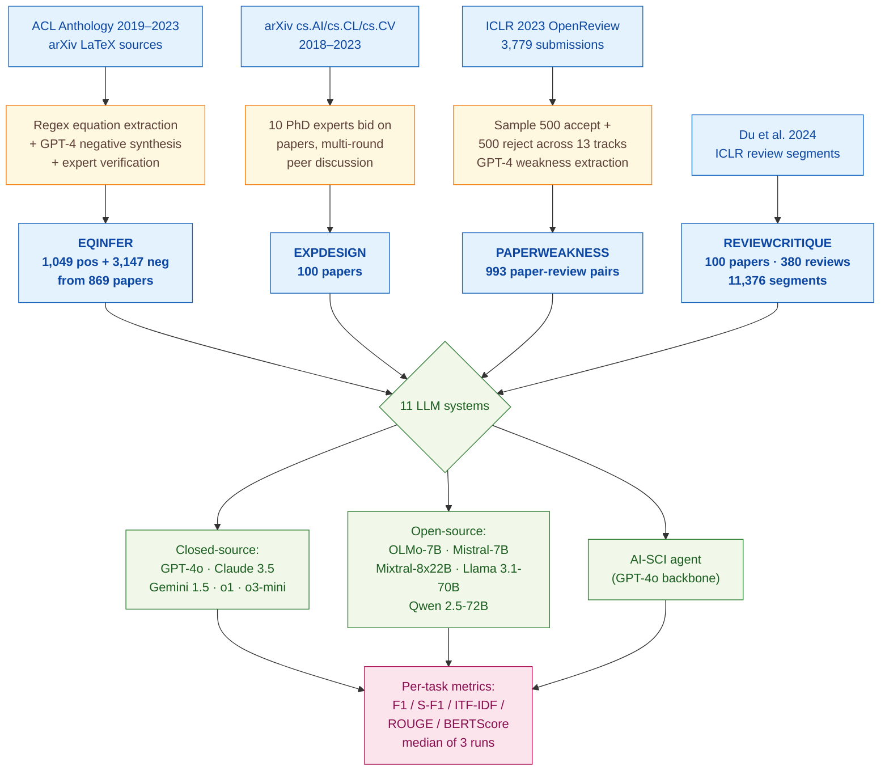

> [!success] **TL;DR**
> AAAR-1.0 is a useful, deliberately hard benchmark that puts a clear ceiling on what current LLMs can do as automatic AI-paper reviewers — the headline numbers (47.98% F1 on equation correctness, 5.95 ITF-IDF on weaknesses versus 7.69 for humans, 21.99% F1 on flagging deficient review segments) all say the same thing: not deployment-ready.

## Structured abstract

> [!info] A plain-language summary built from this paper's discourse-graph nodes. Numbers and findings link back to specific EVD nodes — click any link to drill in.

### Question

Can today's large language models (LLMs) actually do the hard parts of an AI researcher's job — checking whether an equation in a paper is correct, listing the experiments needed to validate an idea, finding real weaknesses in a draft, and judging whether a human review is reliable? The authors build a four-task benchmark called AAAR-1.0 and run 11 systems on it, comparing closed-source models (such as GPT-4o, Claude 3.5 Sonnet, Gemini 1.5 Pro, and the o1/o3 reasoning models) against open-source models (such as Llama 3.1, Qwen 2.5, and Mixtral). They also pit each LLM against expert human researchers on the same papers. See [[QUE - How effectively can LLMs perform expert-level AI research tasks such as equation inference, experiment design, and review critique?]].

### Methods

**Design.** The authors run a cross-sectional benchmark across four tasks built on top of papers from arXiv, the ACL Anthology, and ICLR 2023 OpenReview, and compare 11 off-the-shelf LLM systems on the same instances using a mix of automatic and human-judged metrics.

**Tools.** The closed-source models are GPT-4o (gpt-4o-2024-08-06), Claude 3.5 Sonnet, Gemini 1.5 Pro, and OpenAI's reasoning models o1-preview and o3-mini. The open-source models are OLMo-7B, Mistral-7B, Mixtral-8x22B-MoE, Llama 3.1-70B, and Qwen 2.5-72B. The authors call the closed-source models through **LiteLLM** (a unified API wrapper) and run open-source models on **VLLM** (a fast inference server) on 8 NVIDIA A100 GPUs. They also test **AI-SCI**, an agentic prompting framework from Lu et al. 2024, on top of GPT-4o. They use **SentenceBERT** (a sentence-similarity model) to compare LLM-generated weakness lists against reviewer-written ones, and they propose a new diversity score called **ITF-IDF** — Inverse-Term-Frequency × Inverse-Document-Frequency — that rewards weaknesses that are both informative within a paper and specific across papers.

**Procedure.** For EQINFER (equation inference), the authors first crawl 1,762 papers' LaTeX sources, extract real ("positive") equations, then prompt GPT-4 at high temperature to write three plausible-but-wrong ("negative") versions of each. GPT-4 filters out negatives that contradict the surrounding text, and 5 PhD-student experts hand-check every remaining pair. The LLMs then see 1,000 words before and 1,000 words after each masked equation and must label it real or fake. For EXPDESIGN, GPT-4 strips potentially leaking sentences from each paper and the LLM proposes the experiments needed to validate the paper's claims. For PAPERWEAKNESS, the authors split each long paper into 2,000-or-3,000-word pieces (open versus closed source), prompt the LLM to flag weaknesses in each piece, then merge the pieces into a final list — a "split-combine" workaround for limited context windows. For REVIEWCRITIQUE, they reuse Du et al. 2024's labels and run two prompting strategies — Labeling-All (label every segment) and Select-Deficient (only flag the bad ones) — then ensemble the two with an "Either No" rule. Each model runs three times and the median is reported.

**Sample.** EQINFER ends up with 1,049 positive plus 3,147 negative equations from 869 source papers (4,196 instances). EXPDESIGN keeps 100 papers, with about 5.7 experiments each, hand-curated by 10 senior PhD experts via a multi-round bidding-and-discussion process. PAPERWEAKNESS samples 1,000 ICLR 2023 papers (500 accepted, 500 rejected) balanced across 13 tracks, then drops papers without extracted weaknesses to land on **993 instances**, each carrying about 3.8 reviewers and 4.8 weaknesses per reviewer. REVIEWCRITIQUE inherits **11,376 review segments** from 380 reviews of 100 ICLR papers, labeled by 40+ AI-research experts in Du et al. 2024.

### Findings

- **Closed-source models lead the deficient-segment task — but absolute accuracy is dismal.** On REVIEWCRITIQUE, the best system (Claude Opus with the "Either No" ensemble) hits an F1 of just 21.99% on flagging deficient review segments — F1 runs from 0 to 100 and higher is better. Recall (42.12%) far exceeds precision (16.94%), meaning the model raises the alarm too often and is right less than one time in five. GPT-4 and Gemini 1.5 land at 20.66% and 20.34%; the best open-source model (Llama3-70B) reaches 18.43%. Across the board, the LLMs over-predict deficiency. [[EVD - Claude Opus achieved highest ReviewCritique F1 of 21.99% on AAAR across 11376 review segments - @louAAAR10AssessingAIs2025]]

- **LLM-written weaknesses are vague compared to real reviewer weaknesses.** Human reviewers score 7.69 on the authors' diversity metric ITF-IDF — higher means weaknesses are both informative inside a paper and specific across papers. The best LLM, GPT-4o, scores only 5.95, and weaker open-source systems land between 0.98 and 2.60. Surface-level overlap with reviewer weaknesses is similar across LLMs (S-F1 around 42 to 49 out of 100), so the gap is not about wording — it is about depth. The AI-SCI agent framework on top of GPT-4o makes things worse, dropping ITF-IDF to 2.23. [[EVD - Human review weakness diversity ITF-IDF was 7.69 while best LLM GPT-4o scored only 5.95 on AAAR PaperWeakness task - @louAAAR10AssessingAIs2025]]

- **On equation correctness, the best model barely beats a "say yes to everything" baseline.** A trivial baseline that predicts every candidate equation as correct scores 40% F1 because the dataset is 1-to-3 positives-to-negatives. The best LLM, o3-mini, reaches only 47.98% F1 — about 8 points above the baseline. Most open-source models cannot beat the baseline at all; Mixtral's 40.90% F1 comes from predicting almost everything as positive (recall 93.80%, precision 26.15%). Adding context length from 100 to 1,500 words barely moves performance. [[EVD - o3-mini achieved best F1 of 47.98% on AAAR EqInfer barely above the 40% all-positive baseline - @louAAAR10AssessingAIs2025]]

### Claim supported

These findings collectively support [[CLM - Current LLMs are not yet qualified as reliable automatic reviewers for scientific papers]] and the narrower [[CLM - LLMs cannot reliably identify scientific paper limitations at the level of human expert reviewers]]. For someone considering deploying an LLM as a co-reviewer at a venue like ICLR, the practical message is blunt: even the strongest closed-source model misses roughly 4 in 5 deficient review segments and writes weaknesses that are noticeably less specific than those of an actual reviewer. AI-assisted reviewing may be a useful drafting aid, but it is not a substitute for a careful human read.

### Caveats

- **Benchmark papers may already be in the models' training data.** The papers come from arXiv and OpenReview, both public crawl targets. Any LLM that already saw these papers during pretraining could be remembering rather than reasoning, which inflates the headline numbers. [[CVT - The AAAR data leakage problem from LLM training corpus was not resolved]]

- **Equations and experiments are evaluated as text only — no figures or rendered tables.** EQINFER and EXPDESIGN feed the LLM raw LaTeX source with no rendered figures, so weaknesses that hinge on a chart, a missing axis, or a visual inconsistency cannot be flagged. The PAPERWEAKNESS task does include figures, but the equation and experiment-design results are blind to non-textual content. [[CVT - The AAAR benchmark excluded non-textual inputs such as figures that are integral to scientific evaluation]]

### Methods at a glance

---

## Critical appraisal

> [!info] A risk-of-bias and validity assessment across five domains, synthesized from this paper's discourse-graph nodes. Each domain gets a rating (🟢 Low risk · 🟡 Some concerns · 🔴 High risk) plus a brief, EVD-grounded justification. The TRIPOD-LLM table below covers *reporting compliance*; this section covers *methodological quality*.

| Domain | Rating | Justification |
| --- | :---: | --- |
| **Construct validity** — does the metric actually measure the construct? | 🟡 | EQINFER turns "can the model do equation reasoning?" into a binary classification at a fixed 1:3 positive-to-negative ratio, which lets a trivial all-positive baseline reach 40% F1 and obscures whether the LLM is reasoning or just biased toward "yes" (see Mixtral's 93.80% recall vs. 26.15% precision). The new ITF-IDF metric for weakness diversity is bespoke and not externally validated against reviewer perception. REVIEWCRITIQUE F1 is reasonable but the sentence-segment unit ignores that one good critique can subsume several flagged "deficient" segments. |
| **Internal validity** — could the comparison be biased? | 🟡 | All models see the same instances, are run three times with the median taken, and use unified APIs (LiteLLM and VLLM). However, GPT-4 itself is used both to synthesize EQINFER negatives and to extract PAPERWEAKNESS labels — meaning the test sets contain artifacts of one of the systems being evaluated. No statistical-significance test is reported across models. See [[CVT - The AAAR data leakage problem from LLM training corpus was not resolved]]: the closed-source models likely saw arXiv and OpenReview content during pretraining, biasing the comparison upward. |
| **External validity** — do findings generalize? | 🔴 | The corpus is restricted to AI/ML/NLP/CV papers from a narrow window of venues (ACL Anthology, arXiv cs.AI/cs.CL/cs.CV, ICLR 2023). Conclusions about "expert-level AI research" may not transfer to other fields. EQINFER and EXPDESIGN inputs are LaTeX text only, with no figures or rendered tables — see [[CVT - The AAAR benchmark excluded non-textual inputs such as figures that are integral to scientific evaluation]]. The "human reference" for PAPERWEAKNESS is ICLR 2023 reviewers, whose own quality is variable. |
| **Statistical rigor** — appropriate uncertainty + comparisons? | 🔴 | Every model is run three times and the median is reported, but no confidence intervals, no paired significance tests across model pairs, and no multiple-comparison correction across 11 systems × 4 tasks × multiple metrics. EXPDESIGN human evaluation rests on N=15 papers × 3 annotators and N=20 papers × 5 annotators with no quantitative inter-annotator agreement (kappa or alpha) reported. EQINFER's narrow 8-point gap over the all-positive baseline is reported without any test of whether that gap is robust to sampling. |
| **Reproducibility** — code, data, determinism? | 🟡 | The project webpage (renzelou.github.io/AAAR-1.0) commits to data release and the open-source stack (VLLM, LiteLLM, pylatexenc, NLTK) is named. But inference parameters for the closed-source LLMs (temperature, top_p, seed, system prompt) are not disclosed for the evaluation prompts, only "high temperature" is stated for the GPT-4 negative-equation synthesis, and the closed-source API costs and total compute are not reported. Closed-source model snapshots are dated where possible (e.g. gpt-4o-2024-08-06), which helps. |

**Bottom line.** AAAR-1.0 is a useful, deliberately hard benchmark that puts a clear ceiling on what current LLMs can do as automatic AI-paper reviewers — the headline numbers (47.98% F1 on equation correctness, 5.95 ITF-IDF on weaknesses versus 7.69 for humans, 21.99% F1 on flagging deficient review segments) all say the same thing: not deployment-ready. The two biggest threats to the conclusions are external validity (a single subfield, text-only inputs) and the unresolved data-leakage question; until both are addressed with held-out post-cutoff evaluations and figure-aware tasks, the absolute numbers should be read as upper bounds rather than honest estimates of LLM ability.

> [!tip] **Applicable external appraisal frameworks beyond TRIPOD-LLM** (already covered by the table below): **HELM** (Liang et al. 2022) for holistic LLM-evaluation principles · **Datasheets for Datasets** (Gebru et al. 2021) for the evaluation corpus · **Model Cards** (Mitchell et al. 2019) for the LLMs being evaluated

---

## TRIPOD-LLM reporting summary

> [!info] Reporting compliance for this paper, mapped to the TRIPOD-LLM checklist (Methods items 5a–15 and Results items 16a–18). Compliance icons: ✅ fully reported · ⚠️ partially reported / unclear · ❌ should be reported but not reported · ➖ not applicable to this study. Item 17 (Performance) is reported per-EVD; see each EVD's `## Other Notes`.

| # | Item | ✓ | Reported in this study |
| --- | --- | :---: | --- |
| **5a** | Data sources | ✅ | EQINFER: ACL Anthology 2019–2023 papers' arXiv LaTeX sources (1,762 papers). EXPDESIGN: ≥10k arXiv papers from cs.AI/cs.CL/cs.CV (2018–2023) at well-known venues. WEAKNESS: 3,779 ICLR 2023 anonymous OpenReview submissions across 13 tracks. REVIEWCRITIQUE: 100 ICLR papers + 380 reviews reused from Du et al. 2024. |
| **5b** | Data points + distribution | ✅ | EQINFER: 1,049 positive + 3,147 negative equations from 869 papers (1:3 ratio). EXPDESIGN: 100 instances from 100 papers; avg 5.7 experiments + explanations per paper. WEAKNESS: 993 instances; avg 3.8 reviewers/paper, 4.8 weaknesses/reviewer, 39.1 words/weakness; 13 ICLR tracks balanced. REVIEWCRITIQUE: 11,376 review segments. Score distribution + track distribution shown in Figure 3. |
| **5c** | Date range of data | ⚠️ | EQINFER source papers 2019–2023 (ACL Anthology); EXPDESIGN papers 2018–2023; WEAKNESS papers from ICLR 2023. Reviewer/training-data cutoffs not given. Inference run dates not disclosed. |
| **5d** | Pre-processing / quality checks | ✅ | EQINFER: LaTeX cleaning (strip comments, merge cross-referenced .tex files, regex equation extraction); GPT-4 filtering of context-unaligned negatives; expert verification of grammar + semantic distinctness. EXPDESIGN: GPT-4 used to delete sentences potentially leaking experiments from the input (~9.8% sentences deleted). WEAKNESS: GPT-4 extracts verbatim weaknesses from raw reviewer comments (manually checked on 200 cases — ≤1% missed). Papers parsed via VILA + PDFFigures-2.0. |
| **5e** | Missing / imbalanced data | ⚠️ | EQINFER intentionally 1:3 positive:negative; All-Positive baseline (40% F1) reported. WEAKNESS keeps repeated weaknesses across reviewers (acknowledged to underestimate human ITF-IDF). EXPDESIGN small-N (100) called out as a Limitations bullet. No formal missingness analysis. |
| **6a** | LLM name + version | ✅ | Closed: gpt-4-1106-preview, gpt-4o-2024-08-06, claude-3-5-sonnet-20240620, gemini-1.5-pro-002, o1-preview-2024-09-12, o3-mini. Open: OLMo-7B, Falcon-40B, Gemma-2-27B, Mistral-7B-Instruct-v0.3, Mixtral-8x22B-Instruct-v0.1, Llama 3.1-70B, Qwen 2.5-72B (with HuggingFace URLs). Plus AI-SCI agent framework (Lu et al. 2024) on GPT-4o. |
| **6b** | Development process | ✅ | No model fine-tuning. Off-the-shelf inference only; LiteLLM unifies API calls; VLLM unifies open-source endpoints. |
| **6c** | Inference settings / prompting | ⚠️ | Per-task input lengths fixed (EQINFER: 2,000 words; EXPDESIGN: 2,000 open / 3,000 closed; WEAKNESS: 2,000 open / 3,000 closed via split-combine; multimodal LMMs also tested). Each model run thrice and median taken. Prompt templates in Appendix E (Figures 11–13). Temperature, top_p, seed, and system prompt not reported in main text for the evaluation prompts (only "high temperature" stated for negative-equation synthesis with GPT-4). |
| **6d** | Output | ✅ | EQINFER: binary {positive, negative} label. EXPDESIGN: free-text experiment list + explanations. WEAKNESS: free-text weakness list. REVIEWCRITIQUE: per-segment {reliable_or_not, explanation} triples or {id, explanation} tuples. |
| **6e** | Classification thresholds | ➖ | Not applicable — outputs are direct categorical labels or free text; no probability thresholding. |
| **7a** | Quality metrics | ✅ | EQINFER: F1, Precision, Recall. EXPDESIGN: En-F1, En-Precision, En-Recall (LLM-judged), S-Match (SentenceBERT), ROUGE-L, ROUGE-1; human Acc. ratio. WEAKNESS: S-F1, S-Precision, S-Recall (eqs. 4–5), ITF-IDF (eq. 6). REVIEWCRITIQUE: per-segment Precision/Recall/F1, plus ROUGE-1/2/L and BERTScore on explanations. |
| **7b** | Relevance to downstream | ⚠️ | All four tasks are framed as proxies for "researcher daily activities," but no downstream-utility analysis (e.g., reviewer time savings, decision-flip analysis) is reported. |
| **7c** | Outcome definition | ✅ | Each task's outcome is defined task-by-task (binary equation correctness; experiment-list overlap; weakness-list specificity & coverage; per-segment review reliability). Ground truth from human annotators or original-paper authors. |
| **7d** | Subjective interpretation | ✅ | Human evaluation panels reported (3 annotators on novel-experiment necessity in Table 3; 5 annotators on EXPDESIGN explanation acceptance in Table 5; 40+ AI experts on REVIEWCRITIQUE labels via Du et al. 2024). |
| **7e** | Comparison | ✅ | Open vs. closed-source LLM comparison across all tasks; baselines include All-Positive (EQINFER), Copy Input (EXPDESIGN), Human Review (WEAKNESS); ablations on context length (Fig. 4–5), split-combine vs. no-split (Table 12), one-by-one vs. whole-list prompting (Table 4), multimodal input (Tables 14–15), AI-SCI agent vs. plain LLM. No formal significance test reported. |
| **8a** | Annotation guidelines | ✅ | EQINFER expert criteria: grammatical correctness + negative-positive distinctness, with TeXLive compilation check. EXPDESIGN: 2 annotation questions ("What did this experiment do?" / "Why did the paper authors conduct this?") + 3 peer-review criteria. Novel-experiment necessity rubric uses three levels A/B/C. Annotation platform screenshot in Figure 7 (Appendix D). |
| **8b** | Annotators + IAA | ⚠️ | Numbers reported (10 EXPDESIGN annotators after bidding, 5 PhD-student EQINFER experts, 3 PhD novel-experiment evaluators with disagreement-arbitration, 5 explanation evaluators). Multi-round peer-discussion procedure described but no quantitative IAA (kappa, alpha) reported for any task. |
| **8c** | Annotator background | ✅ | Annotators required to be senior PhD students with ≥1 peer-reviewed publication at leading AI venues, ≥4 years AI research experience, frequent conference reviewers; 10 EXPDESIGN experts selected via bidding from a larger invited pool. |
| **9a** | Prompt design | ⚠️ | Prompt templates shown in Appendix E (Figures 11–13). Two prompting strategies (Labeling-All / Select-Deficient) compared for REVIEWCRITIQUE, plus split-combine for WEAKNESS, and one-by-one vs. whole-list for EXPDESIGN. No systematic prompt-engineering search reported. |
| **9b** | Prompt-development data | ❌ | No held-out prompt-development set or pilot prompts described. |
| **10** | Summarization | ➖ | Not applicable (no summarization endpoint evaluated as primary outcome). |
| **11** | Instruction tuning / alignment | ➖ | Not applicable — no model training, fine-tuning, or alignment performed. Off-the-shelf instruct models used. |
| **12** | Compute | ⚠️ | Open-source inference: 8× NVIDIA A100 GPUs, PyTorch 2.4.0, CUDA 12.1, VLLM. SentenceBERT runs in ~1GB on a single A100. Closed-source API costs/tokens not reported. Total wall-clock not reported. |
| **13** | Ethical approval | ➖ | Not applicable (no human-subjects clinical/personal data; analysis on published papers and OpenReview comments). Impact Statement included on p. 11. |
| **14a** | Funding | ❌ | No funding statement found in the paper. |
| **14b** | Conflicts of interest | ❌ | Not declared. |
| **14c** | Protocol | ❌ | Not reported. |
| **14d** | Registration | ➖ | Not applicable (not a clinical study). |
| **14e** | Data availability | ✅ | Project webpage https://renzelou.github.io/AAAR-1.0/ disclosed; data committed to be released. |
| **14f** | Code availability | ⚠️ | VLLM (github.com/vllm-project/vllm) and LiteLLM (github.com/BerriAI/litellm) cited as tooling; pylatexenc + NLTK named for preprocessing. Authors' own evaluation code not explicitly linked, but project webpage implies release. |
| **15** | Patient/public involvement | ➖ | Not applicable. |
| **16a** | Flow of data | ✅ | EQINFER: 1,762 papers → 3,877 raw equations → after GPT-4 filter + expert exam (27.6% dropped) → 1,049 positive + 3,147 negative from 869 papers. EXPDESIGN: ≥10k arXiv papers → bidding by 10 experts → 100 papers, 10 each → multi-round peer discussion → 100 final instances. WEAKNESS: 3,779 ICLR 2023 submissions → 1,000 sampled (500/500 accept/reject across 13 tracks) → GPT-4 weakness extraction → 993 instances after dropping no-weakness papers. REVIEWCRITIQUE: 100 papers / 380 reviews / 11,376 segments reused from Du et al. 2024. |
| **16b** | Characteristics | ✅ | Per-task statistics tables: Table 9 (EQINFER input/output lengths), Table 10 (EXPDESIGN context/figure counts), Table 11 (WEAKNESS reviewers, weaknesses, lengths). WEAKNESS score & track distribution in Figure 3 (most papers score 5–8; uniform across 13 tracks; min 33 papers in Infrastructure track). |
| **16c** | Distribution comparison | ➖ | Not applicable — no clinical-outcome subgroup comparison; ICLR accept/reject is a balancing variable in WEAKNESS construction, not an outcome. |
| **16d** | N per analysis | ✅ | EQINFER: N=4,196 equations evaluated. EXPDESIGN: N=100 instances; novel-experiment human eval N=15 papers × 3 annotators; explanation human eval N=20 papers × 5 annotators. WEAKNESS: N=993 instances. REVIEWCRITIQUE: N=11,376 segments. Median-of-3 runs per model. |
| **17** | Performance | (per-EVD) | Reported per-EVD. See each EVD's `## Other Notes`. |
| **18** | LLM updating | ➖ | Not applicable (no model updating reported; off-the-shelf inference only). |
