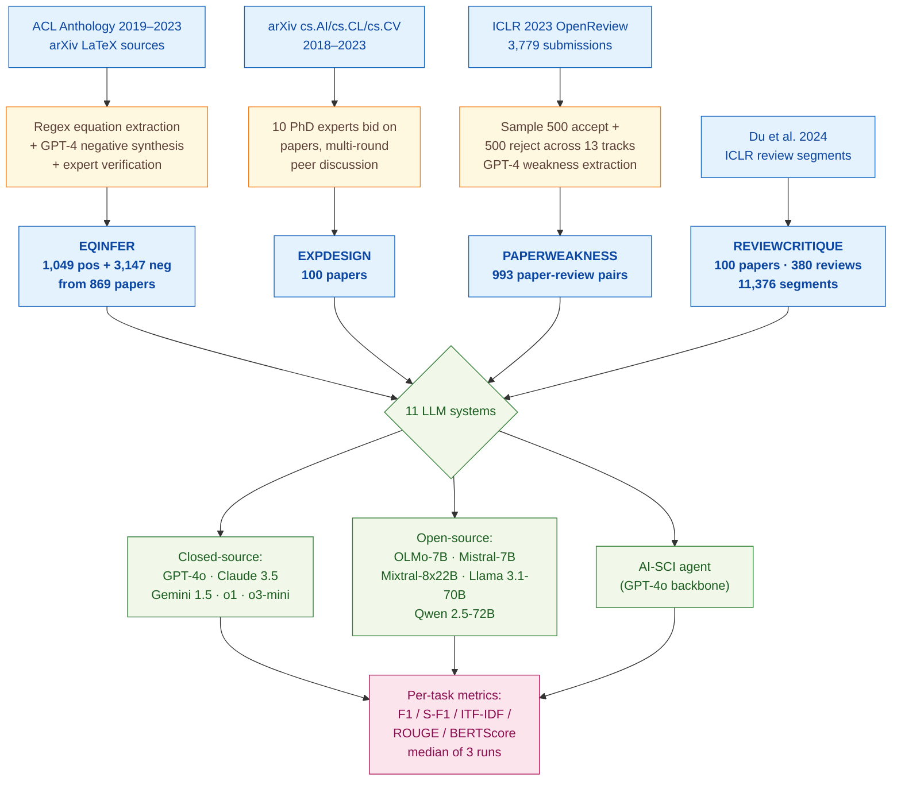

> [!success] **TL;DR**
> AAAR-1.0 is a useful, deliberately hard benchmark that puts a clear ceiling on what current LLMs can do as automatic AI-paper reviewers; the headline numbers (47.98% F1 on equation correctness, 5.95 ITF-IDF on weaknesses versus 7.69 for humans, 21.99% F1 on flagging deficient review segments) all say the same thing: not deployment-ready.

## Structured abstract

> [!info] A plain-language summary built from this paper's discourse-graph nodes. Numbers and findings link back to specific EVD nodes: click any link to drill in.

### Question

Can today's large language models (LLMs) actually do the hard parts of an AI researcher's job: checking whether an equation in a paper is correct, listing the experiments needed to validate an idea, finding real weaknesses in a draft, and judging whether a human review is reliable? The authors build a four-task benchmark called AAAR-1.0 and run 11 systems on it, comparing closed-source models (such as GPT-4o, Claude 3.5 Sonnet, Gemini 1.5 Pro, and the o1/o3 reasoning models) against open-source models (such as Llama 3.1, Qwen 2.5, and Mixtral). They also pit each LLM against expert human researchers on the same papers. See [[QUE - How effectively can LLMs perform expert-level AI research tasks such as equation inference, experiment design, and review critique?]].

### Methods

**Design.** The authors run a cross-sectional benchmark across four tasks built on top of papers from arXiv, the ACL Anthology, and ICLR 2023 OpenReview, and compare 11 off-the-shelf LLM systems on the same instances using a mix of automatic and human-judged metrics.

**Tools.** The closed-source models are GPT-4o (gpt-4o-2024-08-06), Claude 3.5 Sonnet, Gemini 1.5 Pro, and OpenAI's reasoning models o1-preview and o3-mini. The open-source models are OLMo-7B, Mistral-7B, Mixtral-8x22B-MoE, Llama 3.1-70B, and Qwen 2.5-72B. The authors call the closed-source models through LiteLLM (a unified API wrapper) and run open-source models on VLLM (a fast inference server) on 8 NVIDIA A100 GPUs. They also test AI-SCI, an agentic prompting framework from Lu et al. 2024, on top of GPT-4o. They use SentenceBERT (a sentence-similarity model) to compare LLM-generated weakness lists against reviewer-written ones, and they propose a new diversity score called ITF-IDF (Inverse-Term-Frequency × Inverse-Document-Frequency) that rewards weaknesses that are both informative within a paper and specific across papers.

**Procedure.** For EQINFER (equation inference), the authors first crawl 1,762 papers' LaTeX sources, extract real ("positive") equations, then prompt GPT-4 at high temperature to write three plausible-but-wrong ("negative") versions of each. GPT-4 filters out negatives that contradict the surrounding text, and 5 PhD-student experts hand-check every remaining pair. The LLMs then see 1,000 words before and 1,000 words after each masked equation and must label it real or fake. For EXPDESIGN, GPT-4 strips potentially leaking sentences from each paper and the LLM proposes the experiments needed to validate the paper's claims. For PAPERWEAKNESS, the authors split each long paper into 2,000-or-3,000-word pieces (open versus closed source), prompt the LLM to flag weaknesses in each piece, then merge the pieces into a final list, a "split-combine" workaround for limited context windows. For REVIEWCRITIQUE, they reuse Du et al. 2024's labels and run two prompting strategies: Labeling-All (label every segment) and Select-Deficient (only flag the bad ones), then ensemble the two with an "Either No" rule. Each model runs three times and the median is reported.

**Sample.** EQINFER ends up with 1,049 positive plus 3,147 negative equations from 869 source papers (4,196 instances). EXPDESIGN keeps 100 papers, with about 5.7 experiments each, hand-curated by 10 senior PhD experts via a multi-round bidding-and-discussion process. PAPERWEAKNESS samples 1,000 ICLR 2023 papers (500 accepted, 500 rejected) balanced across 13 tracks, then drops papers without extracted weaknesses to land on 993 instances, each carrying about 3.8 reviewers and 4.8 weaknesses per reviewer. REVIEWCRITIQUE inherits 11,376 review segments from 380 reviews of 100 ICLR papers, labeled by 40+ AI-research experts in Du et al. 2024.

### Findings

- **Closed-source models lead the deficient-segment task. Absolute accuracy is dismal.** On REVIEWCRITIQUE, the best system (Claude Opus with the "Either No" ensemble) hits an F1 of just 21.99% on flagging deficient review segments: F1 runs from 0 to 100 and higher is better. Recall (42.12%) far exceeds precision (16.94%), meaning the model raises the alarm too often and is right less than one time in five. GPT-4 and Gemini 1.5 land at 20.66% and 20.34%; the best open-source model (Llama3-70B) reaches 18.43%. Across the board, the LLMs over-predict deficiency. [[EVD - Claude Opus achieved highest ReviewCritique F1 of 21.99% on AAAR across 11376 review segments - @louAAAR10AssessingAIs2025]]

- **LLM-written weaknesses are vague compared to real reviewer weaknesses.** Human reviewers score 7.69 on the authors' diversity metric ITF-IDF: higher means weaknesses are both informative inside a paper and specific across papers. The best LLM, GPT-4o, scores only 5.95, and weaker open-source systems land between 0.98 and 2.60. Surface-level overlap with reviewer weaknesses is similar across LLMs (S-F1 around 42 to 49 out of 100), so the gap is not about wording; it is about depth. The AI-SCI agent framework on top of GPT-4o makes things worse, dropping ITF-IDF to 2.23. [[EVD - Human review weakness diversity ITF-IDF was 7.69 while best LLM GPT-4o scored only 5.95 on AAAR PaperWeakness task - @louAAAR10AssessingAIs2025]]

- **On equation correctness, the best model barely beats a "say yes to everything" baseline.** A trivial baseline that predicts every candidate equation as correct scores 40% F1 because the dataset is 1-to-3 positives-to-negatives. The best LLM, o3-mini, reaches only 47.98% F1, about 8 points above the baseline. Most open-source models cannot beat the baseline at all; Mixtral's 40.90% F1 comes from predicting almost everything as positive (recall 93.80%, precision 26.15%). Adding context length from 100 to 1,500 words barely moves performance. [[EVD - o3-mini achieved best F1 of 47.98% on AAAR EqInfer barely above the 40% all-positive baseline - @louAAAR10AssessingAIs2025]]

### Claim supported

These findings collectively support [[CLM - Current LLMs are not yet qualified as reliable automatic reviewers for scientific papers]] and the narrower [[CLM - LLMs cannot reliably identify scientific paper limitations at the level of human expert reviewers]]. For someone considering deploying an LLM as a co-reviewer at a venue like ICLR, the practical message is blunt: even the strongest closed-source model misses roughly 4 in 5 deficient review segments and writes weaknesses that are noticeably less specific than those of an actual reviewer. AI-assisted reviewing may be a useful drafting aid, but it is not a substitute for a careful human read.

### Caveats

- **Benchmark papers may already be in the models' training data.** The papers come from arXiv and OpenReview, both public crawl targets. Any LLM that already saw these papers during pretraining could be remembering rather than reasoning, which inflates the headline numbers. [[CVT - The AAAR data leakage problem from LLM training corpus was not resolved]]

- **Equations and experiments are evaluated as text only: no figures or rendered tables.** EQINFER and EXPDESIGN feed the LLM raw LaTeX source with no rendered figures, so weaknesses that hinge on a chart, a missing axis, or a visual inconsistency cannot be flagged. The PAPERWEAKNESS task does include figures, but the equation and experiment-design results are blind to non-textual content. [[CVT - The AAAR benchmark excluded non-textual inputs such as figures that are integral to scientific evaluation]]

### Methods at a glance

---

## Quality appraisal

> [!info] Risk-of-bias and validity assessment, synthesized from this paper's discourse-graph nodes and grounded in the same paper this page's top trust-signal chips summarize. Covers *methodological quality*; the TRIPOD-LLM table below covers *reporting compliance* instead.
> <dl class="callout-legend">
> <dt>● Low risk</dt><dd>No meaningful threat to this domain identified</dd>
> <dt>◐ Some risk</dt><dd>A real but non-fatal limitation</dd>
> <dt>○ High risk</dt><dd>A significant, unaddressed threat to validity</dd>
> </dl>

| Domain | Rating | Quote |
| --- | :---: | --- |
| **Construct validity**: does the metric actually measure the construct? | 🟡 | *"a simple baseline that predicts all equations as positive achieves 40% F1 (due to the 1:3 of positive and negative equations)"* `§5.1, p.7`, a fixed 1:3 class ratio lets a trivial baseline reach 40% F1, obscuring whether a model is reasoning or just biased toward "yes" |
| **Internal validity**: could the comparison be biased? | 🟡 | *"we prompt GPT-4 to synthesize a negative equation based on the paper context"* `§3.1, p.3`, *"we further employ GPT-4 to extract all the weaknesses from each reviewer's comments"* `§3.2, p.4`; GPT-4 is used to construct part of the test data for tasks GPT-4 is also evaluated on |
| **External validity**: do findings generalize? | 🔴 | *"we first obtain the accepted paper list from ACL Anthology, from year 2019 to 2023"* `§3.1, p.3`, corpus restricted to a single subfield (AI/ML/NLP/CV) and a narrow venue window |
| **Statistical rigor**: appropriate uncertainty + comparisons? | 🔴 | *"we run each model thrice during our experiments, selecting the median result from these repeated runs"* `Appendix B.2, p.16`, no confidence intervals, paired significance tests, or multiple-comparison correction reported alongside this |
| **Reproducibility**: code, data, determinism? | 🟡 | *"Project Webpage: https://renzelou.github.io/AAAR-1.0/"* `p.1`, data-release commitment stated, but inference parameters (temperature, top_p, seed) for the evaluation prompts are not disclosed |
| **Data leakage**: could models have seen this data pretraining? | 🔴 | *"LLMs may be trained on the same source data utilized in our benchmark... we acknowledge this potential data leakage"* `§6 Limitations, p.11` |
| **Baseline adequacy**: is there a meaningful floor to beat? | 🟢 | *"a simple baseline that predicts all equations as positive achieves 40% F1"* `§5.1, p.7`, a concrete, reported naive baseline that most open-source LLMs fail to beat |
| **Train/dev/test hygiene**: are data splits kept separate? | 🔴 | Not reported, no train/dev/test split is described for any of the four tasks |
| **Multiple-comparisons correction**: controlled for repeated testing? | 🔴 | Not reported, 11 systems × 4 tasks × multiple metrics are compared with no stated correction |
| **Human-baseline comparability**: is there a human reference point? | 🟢 | *"there is still a considerable gap in the weakness diversity between the LLMs and human experts"* `§5.3, p.8`, human experts serve as a direct comparator on the PAPERWEAKNESS task |
| **Confidence Intervals**: are point estimates accompanied by an interval? | 🔴 | Not reported — *"selecting the median result from these repeated runs"* `Appendix B.2, p.16` reports a point estimate with no interval around it |
| **Chance-Corrected Metrics**: does agreement/accuracy correct for chance? | 🔴 | Not reported — all metrics are F1/precision/recall/S-Match/ROUGE/ITF-IDF; no kappa or MCC is reported anywhere |
| **Non-Significant Result Spin**: are null or negative findings framed plainly? | 🔴 | Not applicable — no formal significance tests are run; the informal "not significant" performance-gap claim ("the best LLM on this task only obtains 47.98%") is stated plainly, not spun `p.7` |

**Bottom line.** AAAR-1.0 is a useful, deliberately hard benchmark that puts a clear ceiling on what current LLMs can do as automatic AI-paper reviewers; the headline numbers (47.98% F1 on equation correctness, 5.95 ITF-IDF on weaknesses versus 7.69 for humans, 21.99% F1 on flagging deficient review segments) all say the same thing: not deployment-ready. The two biggest threats to the conclusions are external validity (a single subfield, text-only inputs) and the unresolved data-leakage question; until both are addressed with held-out post-cutoff evaluations and figure-aware tasks, the absolute numbers should be read as upper bounds rather than honest estimates of LLM ability.

> [!tip] **Applicable external appraisal frameworks beyond TRIPOD-LLM** (already covered by the table below): **HELM** (Liang et al. 2022) for holistic LLM-evaluation principles · **Datasheets for Datasets** (Gebru et al. 2021) for the evaluation corpus · **Model Cards** (Mitchell et al. 2019) for the LLMs being evaluated

---

## TRIPOD-LLM reporting summary

> [!info] Reporting compliance for this paper, mapped to the TRIPOD-LLM checklist (Title/Abstract/Introduction items 1–4, Methods items 5a–15, Results items 16a–18). TRIPOD-LLM is a clinical-ML guideline being applied here to a non-clinical AI-research benchmark, where an item's own wording says "healthcare context" or "care pathway," it's read as "research-evaluation context" / "research workflow" instead. Item 17 (Performance) is reported per-EVD; see each EVD's `## Other Notes`.
> 

> ●Fully reported
> ◐Partial / unclear
> ○Not reported
> –Not applicable
> 

| # | Item | ✓ | Quote |
| --- | --- | :---: | --- |
| **1** | Title | ⚠️ | *"AAAR-1.0: Assessing AI's Potential to Assist Research"* `Title` |
| **2** | Abstract | ➖ | Assessed separately under TRIPOD-LLM's own Abstract extension, not scored here |
| **3a** | Background: context + rationale | ✅ | *"researchers still face demanding, cognitively intensive tasks such as staying current through extensive paper reading, ... conducting rigorous experiments to substantiate claims, and managing an increasing volume of peer reviews."* `§1, p.1` |
| **3b** | Background: target population | ⚠️ | *"AAAR-1.0 ... is researcher-oriented, mirroring the primary activities that researchers engage in on a daily basis."* `§1, p.1` |
| **4** | Objectives | ✅ | *"we introduce AAAR-1.0, a benchmark dataset designed to evaluate LLM performance in four fundamental, expertise-intensive research tasks"* `Abstract, p.1` |
| **5a** | Data sources | ✅ | *"we first obtain the accepted paper list from ACL Anthology, from year 2019 to 2023. Next, we search each paper on arXiv to crawl its LaTeX source"* `§3.1, p.3` |
| **5b** | Data points + distribution | ✅ | *"# of positive equations: 1,049 · # of negative equations: 3,147 · # of source papers: 869"* `Table 9, p.15` |
| **5c** | Date range of data | ⚠️ | *"from year 2019 to 2023"* `§3.1, p.3`, model training/pretraining cutoff dates not stated |
| **5d** | Pre-processing / quality checks | ✅ | *"We then clean the LaTeX sources by deleting all the comments and combining multiple cross-referred .tex files into a main file."* `§3.1, p.3` |
| **5e** | Missing / imbalanced data | ⚠️ | *"We shed light on two limitations of this work: ... the data size for some tasks, such as ExpDesign, is relatively small"* `§6 Limitations, p.11` |
| **6a** | LLM name + version | ✅ | *"we use the gpt-4o-2024-08-06, gpt-4-1106-preview, o1-preview-2024-09-12, gemini-1.5-pro-002, and claude-3-5-sonnet-20240620 for the closed-source LLMs"* `Appendix B.2, p.16` |
| **6b** | Development process | ✅ | *"We use VLLM to unify the inference endpoints of all the above models... We use LiteLLM to unify the API calling for all these LLMs."* `Appendix B.2, p.16` |
| **6c** | Inference settings / prompting | ⚠️ | *"we run each model thrice during our experiments, selecting the median result from these repeated runs"* `Appendix B.2, p.16`, temperature/top_p/seed/system prompt not stated for the evaluation prompts |
| **6d** | Output | ✅ | *"we formulate EqInfer ... as a binary inference task"* `§3.1, p.3` |
| **6e** | Classification thresholds | ➖ | Not applicable, outputs are direct categorical labels or free text, no probability thresholding |
| **7a** | Quality metrics | ✅ | *"we adopt F1 as the classification criterion... we develop several novel task-specific metrics in addition to the conventional ROUGE"* `§4, p.6` |
| **7b** | Relevance to downstream use | ❌ | Not reported |
| **7c** | Outcome definition | ✅ | *"f(.) represents the LLM prompting, where we prompt LLM to decide whether each predicted experiment item (pᵢ) is entailed by the whole ground-truth list (g)"* `§4 Eq.1, p.6` |
| **7d** | Subjective interpretation | ✅ | *"we randomly sample 15 papers from the ExpDesign and ask 3 experts to manually review the model-generated novel experiments"* `§5.2, p.7` |
| **7e** | Comparison | ✅ | *"a simple baseline that predicts all equations as positive achieves 40% F1"* `§5.1, p.7` |
| **8a** | Annotation guidelines | ✅ | *"the annotator has to concisely answer two questions: i) What did this experiment do? ii) Why did the paper authors conduct this experiment?"* `§3.2 ②, p.4` |
| **8b** | Annotators + IAA | ⚠️ | *"we invite a total of 10 qualified experts to participate in our data collection procedure"* `§3.2 ②, p.4`, no quantitative inter-annotator agreement (κ/α) reported |
| **8c** | Annotator background | ✅ | *"be a senior Ph.D. student with at least 1 peer-reviewed publication in leading AI venues; ii) have more than 4 years of AI research experience; iii) frequently serve as conference reviewers"* `§3.2 ②, p.4` |
| **9a** | Prompt design | ✅ | *"we attach all the prompts used in this work, including prompts in data collection and model prediction"* `Appendix E, p.18` |
| **9b** | Prompt-development data | ❌ | Not reported |
| **10** | Summarization | ➖ | Not applicable, no summarization endpoint evaluated as a primary outcome |
| **11** | Instruction tuning / alignment | ➖ | Not applicable, no model training, fine-tuning, or alignment performed |
| **12** | Compute | ⚠️ | *"we use Pytorch 2.4.0 with CUDA 12.1, and use 8 NVIDIA A100 GPUs for the LLMs inference"* `Appendix B.2, p.16`, closed-source API cost/token counts and total wall-clock not reported |
| **13** | Ethical approval | ➖ | *"Our study explores whether LLMs can assist human researchers in AI research."* `Impact Statement, p.11`, no IRB/ethics-committee statement present (not human-subjects research) |
| **14a** | Funding | ❌ | Not reported |
| **14b** | Conflicts of interest | ❌ | Not reported |
| **14c** | Protocol | ❌ | Not reported |
| **14d** | Registration | ➖ | Not applicable, not a registered clinical study |
| **14e** | Data availability | ✅ | *"Project Webpage: https://renzelou.github.io/AAAR-1.0/"* `p.1` |
| **14f** | Code availability | ⚠️ | *"We use VLLM to unify the inference endpoints... We use LiteLLM to unify the API calling"* `Appendix B.2, p.16`, authors' own evaluation code not explicitly linked |
| **15** | Patient/public involvement | ➖ | Not applicable |
| **16a** | Flow of data | ✅ | *"After this strict examination, a total of 1,049 pairs are eventually kept (27.6% pairs are filtered)"* `§3.1 ④, p.4` |
| **16b** | Characteristics | ✅ | *"# of instances: 993 · # of source papers: 993 · ave. # of reviewers per paper: 3.8"* `Table 11, p.17` |
| **16c** | Distribution comparison | ➖ | Not applicable, no clinical-outcome subgroup comparison |
| **16d** | N per analysis | ✅ | *"we randomly select 20 out of 100 papers and ask 5 annotators"* `§5.2 Q3, p.8` |
| **17** | Performance | `per-EVD` | Reported per-EVD. See each EVD's `## Other Notes`. |
| **18** | LLM updating | ➖ | Not applicable, no model updating reported |
