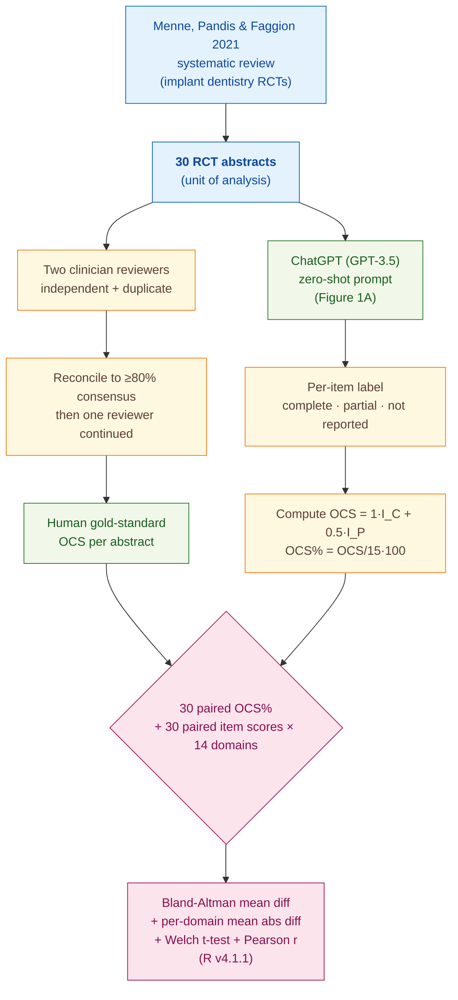

> [!success] **TL;DR**
> The headline finding — a 4.92-percentage-point average gap between ChatGPT and humans — overstates how well ChatGPT actually mirrors human judgement. The per-domain Pearson r values show ChatGPT and humans hitting similar averages by picking the same modal label, not by tracking which abstracts are well-reported, and on the binary "conclusion" item the model and humans disagree a lot.

## Structured abstract

> [!info] A plain-language summary built from this paper's discourse-graph nodes. Numbers and findings link back to specific EVD nodes — click any link to drill in.

### Question

Can a general-purpose chatbot grade how well a medical trial's abstract follows reporting standards as well as a trained clinician can? The authors test ChatGPT (running GPT-3.5) on 30 abstracts from implant-dentistry randomised controlled trials, scoring each one against the CONSORT-A checklist — a 15-item rulebook for what an abstract should report. They compare ChatGPT's per-item scores to a human consensus benchmark. See [[QUE - How accurately does ChatGPT score medical literature abstracts compared to human evaluators on reporting standards?]].

### Methods

**Design.** The authors ran a cross-sectional method-comparison study, treating two clinician reviewers as the gold standard and asking ChatGPT to score the same 30 abstracts under a single fixed prompt.

**Tools.** They used **ChatGPT** (described only as "GPT3.5 model" — no specific snapshot like `gpt-3.5-turbo-0613` and no inference date). The grading rubric was the **CONSORT-A** checklist — 15 items covering trial design, participants, intervention, objective, outcomes, randomisation, blinding, harms, conclusion, registration, and funding. Each item is scored "completely reported" (1 point), "partially reported" (0.5 points), or "not reported" (0 points). Statistics ran in **R v4.1.1**, and agreement was measured using **Bland-Altman analysis** — a standard method-comparison plot that shows the average gap between two raters and how far apart they tend to drift.

**Procedure.** The authors re-used 30 abstracts that a 2021 systematic review by Menne and colleagues had already CONSORT-A-scored. Two clinicians independently re-scored them, reconciling disagreements until they hit at least 80% consensus, after which one reviewer continued alone. The authors then fed each abstract to ChatGPT with one zero-shot prompt — the model saw the full CONSORT-A definitions and was asked to label each of the 15 items, then compute an overall compliance score (OCS) out of 15 and an OCS percentage. Each abstract was scored by ChatGPT once. The authors compared the 30 paired OCS percentages with Bland-Altman, then broke results down per CONSORT-A domain using mean absolute difference, Welch's two-sample t-test, and Pearson's correlation coefficient (Pearson's r runs from -1 to 1; values near 0 mean no linear relationship).

**Sample.** The unit of analysis was a single trial abstract. The corpus came from one prior systematic review on implant-dentistry randomised controlled trials, yielding **30 abstracts** with no exclusions reported. Two clinician reviewers (specialty and training stage not described) provided the human gold standard.

### Findings

- **ChatGPT's overall scores tracked humans within about 5 percentage points.** On the headline metric — overall compliance percentage averaged across all 15 items — ChatGPT and the human reviewers differed by a mean of 4.92 percentage points (Bland-Altman analysis, n = 30 paired abstracts). On the 100-point OCS scale, that gap is roughly three-quarters of one CONSORT-A item. The reported 95% confidence interval is printed as "(0.62%, 0.37%)", which is internally inconsistent and likely a typesetting error in the paper. [[EVD - ChatGPT and human evaluators differed by mean 4.92% in overall compliance score on CONSORT-A - @robertsComparativeStudyChatGPT2023]]

- **The "conclusion" item is where ChatGPT diverged most.** Per-domain analysis showed the largest mean absolute disagreement on the *conclusion* item — ChatGPT and humans differed by 0.764 points on this single 0-to-1 score (p < 0.001 — unlikely to be chance). Other large gaps appeared on randomisation (0.633), outcome methods (0.553), and funding (0.411). The smallest gap was blinding (0.034, but not statistically significant). The "conclusion" item is essentially binary in practice — a conclusion is either stated or not — so ChatGPT and the humans appear to disagree on what counts as "stated." [[EVD - ChatGPT diverged most from humans in the conclusion domain with mean difference 0.764 on CONSORT-A - @robertsComparativeStudyChatGPT2023]]

- **Per-abstract agreement collapsed on the items that matter most.** Pearson's r is the most demanding agreement test: it asks whether ChatGPT and humans rise and fall together across abstracts, not just whether they hit the same average. By the authors' own magnitude bands (very weak < 0.2; weak 0.2 to 0.39; moderate 0.40 to 0.59), no domain reached "moderate" significance. The intervention domain scored r = 0.02 and the objective domain r = 0.06 — essentially no relationship. Even the two domains the prose calls "strong" — harms (r = 0.32) and trial registration (r = 0.34) — fall in the authors' own "weak" band. The combination of small mean differences with near-zero r values suggests ChatGPT and humans hit similar averages by picking the same modal label, not by tracking the same per-abstract signal. [[EVD - ChatGPT-human correlation was weakest in intervention and objective CONSORT-A domains r equals 0.02 and 0.06 - @robertsComparativeStudyChatGPT2023]]

### Claim supported

These findings support the broader claim that [[CLM - LLMs can help automate appraisal of medical literature for reporting standard compliance]]. The endorsement should be read narrowly: ChatGPT can produce an aggregate compliance percentage that lands near a human's, but it does not appear to track *which* abstracts are well-reported. A journal or database that wanted to use this as a screening widget would need to validate against per-item agreement, not just overall scores.

### Caveats

- **The model only ever saw abstracts, not full papers.** GPT-3.5's context-window limits forced the authors to score abstracts rather than full reports, so nothing in this study tells us how the same approach would handle full-text reporting quality. [[CVT - ChatGPT evaluation was restricted to abstracts only due to token length constraints]]

- **Only GPT-3.5 was tested — no GPT-4 or other LLMs.** The discrepancies the authors observed could be specific to GPT-3.5 rather than a fundamental limit of LLMs. Without a head-to-head against GPT-4 or open-weights alternatives, the result cannot be projected to current frontier models. [[CVT - The Roberts study used only GPT-3.5 and did not test GPT-4 or other LLMs]]

### Methods at a glance

---

## Critical appraisal

> [!info] A risk-of-bias and validity assessment across five domains, synthesized from this paper's discourse-graph nodes. Each domain gets a rating (🟢 Low risk · 🟡 Some concerns · 🔴 High risk) plus a brief, EVD-grounded justification. The TRIPOD-LLM table below covers *reporting compliance*; this section covers *methodological quality*.

| Domain                                                                   | Rating | Justification                                                                                                                                                                                                                                                                                                                                                                                                                                                                  |
| ------------------------------------------------------------------------ | :----: | ---------------------------------------------------------------------------------------------------------------------------------------------------------------------------------------------------------------------------------------------------------------------------------------------------------------------------------------------------------------------------------------------------------------------------------------------------------------------------- |
| **Construct validity** — does the metric actually measure the construct? |   🔴   | The headline Bland-Altman mean difference of 4.92% can be near-zero even when the model and humans disagree on every individual abstract — averages cancel out. The deployment-relevant construct ("does this tool flag the abstracts that under-report?") maps to per-abstract Pearson r, where most domains fall in the "very weak" band (r ≈ 0.02–0.15). The paper's own prose also mislabels "weak" correlations (r = 0.32–0.34) as "strong," inflating the apparent fit. |
| **Internal validity** — could the comparison be biased?                  |   🟡   | The same 30 abstracts were scored by both raters with the same checklist, which is sound. But the "human gold standard" reduced to a single reviewer after the calibration phase, and ChatGPT was run only once per abstract — no inter-rater reliability metric (Cohen's κ or ICC) on the human side, no intra-model variability check on the LLM side. The authors also did not test prompt-component ablations, so we cannot tell what part of the prompt drives outputs.   |
| **External validity** — do findings generalize?                          |   🔴   | All 30 abstracts come from one systematic review in one specialty (implant dentistry RCTs). Only abstracts were tested — full-text reporting quality is out of scope (see [[CVT - ChatGPT evaluation was restricted to abstracts only due to token length constraints]]). Only GPT-3.5 was tested; nothing here transfers to GPT-4 or current frontier models (see [[CVT - The Roberts study used only GPT-3.5 and did not test GPT-4 or other LLMs]]).                          |
| **Statistical rigor** — appropriate uncertainty + comparisons?           |   🔴   | The reported 95% CI on the headline Bland-Altman mean difference is "(0.62%, 0.37%)" — the lower bound exceeds the upper bound, so the printed CI is unusable. Per-domain CIs in Table 1 are similarly inconsistent with their point estimates (e.g., conclusion 0.764 falls outside its reported CI 0.186–0.280). No multiple-comparison correction across 14 domains × 3 tests, no power analysis on n = 30, and no formal limits-of-agreement reported.                      |
| **Reproducibility** — code, data, determinism?                           |   🔴   | The 30 abstracts and ChatGPT outputs are not shared (TRIPOD-LLM 14e ❌), no R-analysis code is released (14f ❌), no model version pin (e.g., `gpt-3.5-turbo-0613`) is given (6a ⚠️), and inference parameters (temperature, top_p, seed, system prompt) are not reported (6c ⚠️). With GPT-3.5 already deprecated, the exact model behaviour described here is not re-runnable.                                                                                                |

**Bottom line.** The headline finding — a 4.92-percentage-point average gap between ChatGPT and humans — overstates how well ChatGPT actually mirrors human judgement. The per-domain Pearson r values show ChatGPT and humans hitting similar averages by picking the same modal label, not by tracking which abstracts are well-reported, and on the binary "conclusion" item the model and humans disagree a lot. Before this approach is deployment-ready, the authors would need a model-version pin, released data and code, prompt-engineering ablations, GPT-4 or current-frontier replication, and validation outside implant-dentistry abstracts.

> [!tip] **Applicable external appraisal frameworks beyond TRIPOD-LLM** (already covered by the table below): **MI-CLAIM** (Norgeot et al. 2020) for clinical-AI minimum information · **MINIMAR** (Hernandez-Boussard et al. 2020) for medical-AI reporting · **PROBAST+AI** (Wolff et al. 2019 base; AI extension in development) for prediction-model risk of bias

---

## TRIPOD-LLM reporting summary

> [!info] Reporting compliance for this paper, mapped to the TRIPOD-LLM checklist (Methods items 5a–15 and Results items 16a–18). Compliance icons: ✅ fully reported · ⚠️ partially reported / unclear · ❌ should be reported but not reported · ➖ not applicable to this study. Item 17 (Performance) is reported per-EVD; see each EVD's `## Other Notes`.

| # | Item | ✓ | Reported in this study |
| --- | --- | :---: | --- |
| **5a** | Data sources | ✅ | Abstracts from a previously published systematic review on implant dentistry (Menne, Pandis & Faggion 2021, *J Periodontol*); selected because the original authors had already scored them against CONSORT-A. |
| **5b** | Data points + distribution | ⚠️ | 30 RCT abstracts in the implant-dentistry domain. Per-domain distribution of "completely / partially / not reported" labels not provided. |
| **5c** | Date range of data | ❌ | Publication-year range of the 30 abstracts not reported; ChatGPT inference date not reported (paper accepted Sept 2023 — so before GPT-3.5 deprecation). |
| **5d** | Pre-processing / quality checks | ⚠️ | Two clinician reviewers independently extracted human scores with ≥80% consensus reconciliation, then one reviewer continued. No pre-processing of the abstracts themselves described (e.g., truncation, formatting). |
| **5e** | Missing / imbalanced data | ❌ | No discussion of class imbalance per CONSORT-A item, missing items, or refusals/non-responses from ChatGPT. |
| **6a** | LLM name + version | ⚠️ | "GPT3.5 model" / "ChatGPT3" — no version pin (e.g., gpt-3.5-turbo-0613), no API vs. ChatGPT web-UI clarification, no inference timestamp. |
| **6b** | Development process | ➖ | No model development; off-the-shelf evaluation only. |
| **6c** | Inference settings / prompting | ⚠️ | Prompt template shown in Figure 1A (zero-shot, item-by-item CONSORT-A definitions, asks for I_C/I_P/I_N counts and OCS%). Inference parameters (temperature, top_p, system prompt, seed, max tokens, single vs. multi-turn) not reported. |
| **6d** | Output | ✅ | Per-item label (completely / partially / not reported); aggregated I_C, I_P, I_N counts; OCS out of 15 and OCS%. |
| **6e** | Classification thresholds | ➖ | Not applicable — categorical 3-level labels with hard scoring rule (1 / 0.5 / 0). |
| **7a** | Quality metrics | ⚠️ | Bland-Altman mean difference + 95% CI on overall OCS%; per-domain mean absolute difference, Welch's two-sample t-test, Pearson's r. No per-domain accuracy / F1 / Cohen's κ vs. human gold reported. |
| **7b** | Relevance to downstream | ⚠️ | Discussion proposes integration into medical databases as an abstract-screening widget but no formal downstream-utility analysis (e.g., screening time savings, sensitivity at acceptable specificity). |
| **7c** | Outcome definition | ✅ | OCS = compliance score against CONSORT-A 15-item abstract reporting checklist; computed identically for human and ChatGPT. Pearson r magnitude bands defined (very weak <0.2, weak 0.2–0.39, etc.). |
| **7d** | Subjective interpretation | ⚠️ | Human evaluator scoring was reconciled to ≥80% consensus, but inter-rater reliability metrics (κ, ICC) not reported. ChatGPT runs not repeated to assess intra-model variability. |
| **7e** | Comparison | ✅ | ChatGPT (GPT-3.5) vs. two human clinician reviewers (treated as gold standard). No comparison against GPT-4, other LLMs, or other appraisal tools. |
| **8a** | Annotation guidelines | ✅ | CONSORT-A definitions for each of the 15 items reproduced verbatim in the prompt (Figure 1A), and used by both humans and ChatGPT. |
| **8b** | Annotators + IAA | ⚠️ | Two clinician reviewers; reconciliation threshold ≥80% reported. Numeric IAA not reported. After reconciliation, "subsequent data extraction was conducted solely by one reviewer" — so part of the human-gold corpus is single-rater. |
| **8c** | Annotator background | ⚠️ | Described only as "two clinician reviewers"; specialty, training stage, CONSORT experience not reported. |
| **9a** | Prompt design | ⚠️ | Single zero-shot prompt shown in full (Figure 1A); no prompt-engineering search, no ablation of prompt components, no few-shot variant tested. |
| **9b** | Prompt-development data | ❌ | No information on whether the prompt was iterated on a development set; appears to be a single fixed template. |
| **10** | Summarization | ➖ | Not applicable. |
| **11** | Instruction tuning / alignment | ➖ | Not applicable — no fine-tuning. |
| **12** | Compute | ❌ | Not reported. |
| **13** | Ethical approval | ➖ | Not applicable (uses already-published abstracts; "Ethics approval Not applicable" stated). |
| **14a** | Funding | ✅ | Swansea University; Welsh Clinical Academic Training Fellowship (SRA, TDD); Paton Masser grant from BAPRAS (SRA); ISW affiliations with Health and Care Research Wales / Scar Free Foundation noted. No award numbers. |
| **14b** | Conflicts of interest | ✅ | "Competing interests None declared." |
| **14c** | Protocol | ❌ | Not reported. |
| **14d** | Registration | ➖ | Not applicable (not a clinical study). |
| **14e** | Data availability | ❌ | The 30 abstracts and ChatGPT outputs are not shared; no data-availability statement. |
| **14f** | Code availability | ❌ | No prompt repository, R-analysis code, or output release; only the prompt screenshot in Figure 1A. |
| **15** | Patient/public involvement | ➖ | Not applicable. |
| **16a** | Flow of data | ⚠️ | 30 abstracts evaluated by both humans and ChatGPT; no exclusions mentioned but a flow diagram is not provided. |
| **16b** | Characteristics | ⚠️ | Only domain (implant dentistry RCTs) and source (Menne et al. 2021) given; no descriptive characteristics of the 30 abstracts (year range, journals, intervention types). |
| **16c** | Distribution comparison | ➖ | Not applicable (no clinical-outcome subgroup analysis). |
| **16d** | N per analysis | ⚠️ | n=30 abstracts implied for Bland-Altman and per-domain analyses; not stated explicitly per-row in Table 1. |
| **17** | Performance | (per-EVD) | Reported per-EVD. See each EVD's `## Other Notes`. |
| **18** | LLM updating | ➖ | Not applicable (no model updating reported). |
