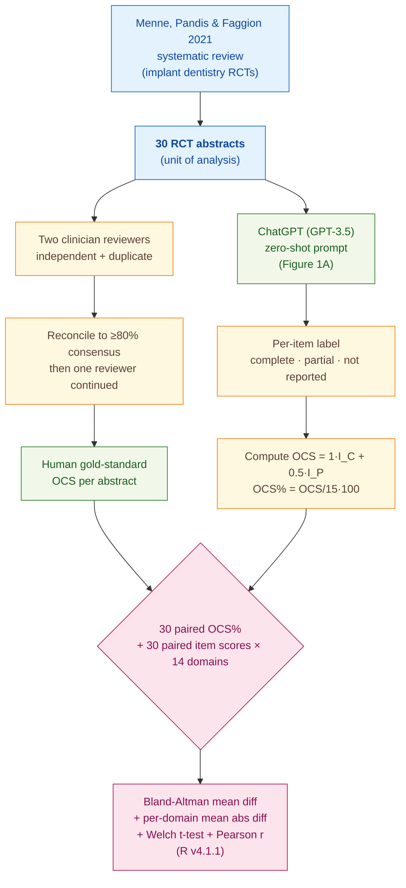

> [!success] **TL;DR**
> The headline finding — a 4.92-percentage-point average gap between ChatGPT and humans — overstates how well ChatGPT actually mirrors human judgement. The per-domain Pearson r values show ChatGPT and humans hitting similar averages by picking the same modal label, not by tracking which abstracts are well-reported, and on the binary "conclusion" item the model and humans disagree a lot.

## Structured abstract

> [!info] A plain-language summary built from this paper's discourse-graph nodes. Numbers and findings link back to specific EVD nodes — click any link to drill in.

### Question

Can a general-purpose chatbot grade how well a medical trial's abstract follows reporting standards as well as a trained clinician can? The authors test ChatGPT (running GPT-3.5) on 30 abstracts from implant-dentistry randomised controlled trials, scoring each one against the CONSORT-A checklist — a 15-item rulebook for what an abstract should report. They compare ChatGPT's per-item scores to a human consensus benchmark. See [[QUE - How accurately does ChatGPT score medical literature abstracts compared to human evaluators on reporting standards?]].

### Methods

**Design.** The authors ran a cross-sectional method-comparison study, treating two clinician reviewers as the gold standard and asking ChatGPT to score the same 30 abstracts under a single fixed prompt.

**Tools.** They used ChatGPT (described only as "GPT3.5 model" — no specific snapshot like `gpt-3.5-turbo-0613` and no inference date). The grading rubric was the CONSORT-A checklist — 15 items covering trial design, participants, intervention, objective, outcomes, randomisation, blinding, harms, conclusion, registration, and funding. Each item is scored "completely reported" (1 point), "partially reported" (0.5 points), or "not reported" (0 points). Statistics ran in R v4.1.1, and agreement was measured using Bland-Altman analysis — a standard method-comparison plot that shows the average gap between two raters and how far apart they tend to drift.

**Procedure.** The authors re-used 30 abstracts that a 2021 systematic review by Menne and colleagues had already CONSORT-A-scored. Two clinicians independently re-scored them, reconciling disagreements until they hit at least 80% consensus, after which one reviewer continued alone. The authors then fed each abstract to ChatGPT with one zero-shot prompt — the model saw the full CONSORT-A definitions and was asked to label each of the 15 items, then compute an overall compliance score (OCS) out of 15 and an OCS percentage. Each abstract was scored by ChatGPT once. The authors compared the 30 paired OCS percentages with Bland-Altman, then broke results down per CONSORT-A domain using mean absolute difference, Welch's two-sample t-test, and Pearson's correlation coefficient (Pearson's r runs from -1 to 1; values near 0 mean no linear relationship).

**Sample.** The unit of analysis was a single trial abstract. The corpus came from one prior systematic review on implant-dentistry randomised controlled trials, yielding 30 abstracts with no exclusions reported. Two clinician reviewers (specialty and training stage not described) provided the human gold standard.

### Findings

- **ChatGPT's overall scores tracked humans within about 5 percentage points.** On the headline metric — overall compliance percentage averaged across all 15 items — ChatGPT and the human reviewers differed by a mean of 4.92 percentage points (Bland-Altman analysis, n = 30 paired abstracts). On the 100-point OCS scale, that gap is roughly three-quarters of one CONSORT-A item. The reported 95% confidence interval is printed as "(0.62%, 0.37%)", which is internally inconsistent and likely a typesetting error in the paper. [[EVD - ChatGPT and human evaluators differed by mean 4.92% in overall compliance score on CONSORT-A - @robertsComparativeStudyChatGPT2023]]

- **The "conclusion" item is where ChatGPT diverged most.** Per-domain analysis showed the largest mean absolute disagreement on the *conclusion* item — ChatGPT and humans differed by 0.764 points on this single 0-to-1 score (p < 0.001 — unlikely to be chance). Other large gaps appeared on randomisation (0.633), outcome methods (0.553), and funding (0.411). The smallest gap was blinding (0.034, but not statistically significant). The "conclusion" item is essentially binary in practice — a conclusion is either stated or not — so ChatGPT and the humans appear to disagree on what counts as "stated." [[EVD - ChatGPT diverged most from humans in the conclusion domain with mean difference 0.764 on CONSORT-A - @robertsComparativeStudyChatGPT2023]]

- **Per-abstract agreement collapsed on the items that matter most.** Pearson's r is the most demanding agreement test: it asks whether ChatGPT and humans rise and fall together across abstracts, not just whether they hit the same average. By the authors' own magnitude bands (very weak < 0.2; weak 0.2 to 0.39; moderate 0.40 to 0.59), no domain reached "moderate" significance. The intervention domain scored r = 0.02 and the objective domain r = 0.06 — essentially no relationship. Even the two domains the prose calls "strong" — harms (r = 0.32) and trial registration (r = 0.34) — fall in the authors' own "weak" band. The combination of small mean differences with near-zero r values suggests ChatGPT and humans hit similar averages by picking the same modal label, not by tracking the same per-abstract signal. [[EVD - ChatGPT-human correlation was weakest in intervention and objective CONSORT-A domains r equals 0.02 and 0.06 - @robertsComparativeStudyChatGPT2023]]

### Claim supported

These findings support the broader claim that [[CLM - LLMs can help automate appraisal of medical literature for reporting standard compliance]]. The endorsement should be read narrowly: ChatGPT can produce an aggregate compliance percentage that lands near a human's, but it does not appear to track *which* abstracts are well-reported. A journal or database that wanted to use this as a screening widget would need to validate against per-item agreement, not just overall scores.

### Caveats

- **The model only ever saw abstracts, not full papers.** GPT-3.5's context-window limits forced the authors to score abstracts rather than full reports, so nothing in this study tells us how the same approach would handle full-text reporting quality. [[CVT - ChatGPT evaluation was restricted to abstracts only due to token length constraints]]

- **Only GPT-3.5 was tested — no GPT-4 or other LLMs.** The discrepancies the authors observed could be specific to GPT-3.5 rather than a fundamental limit of LLMs. Without a head-to-head against GPT-4 or open-weights alternatives, the result cannot be projected to current frontier models. [[CVT - The Roberts study used only GPT-3.5 and did not test GPT-4 or other LLMs]]

### Methods at a glance

---

## Quality appraisal

> [!info] Risk-of-bias and validity assessment, synthesized from this paper's discourse-graph nodes and grounded in the same paper this page's top trust-signal chips summarize. Covers *methodological quality* — the TRIPOD-LLM table below covers *reporting compliance* instead.
> <dl class="callout-legend">
> <dt>● Low risk</dt><dd>No meaningful threat to this domain identified</dd>
> <dt>◐ Some risk</dt><dd>A real but non-fatal limitation</dd>
> <dt>○ High risk</dt><dd>A significant, unaddressed threat to validity</dd>
> </dl>

| Domain | Rating | Quote |
| --- | :---: | --- |
| **Construct validity**: does the metric actually measure the construct? | 🔴 | *"Bland-Altman analysis showed a mean difference of 4.92% (95% CI 0.62%, 0.37%) in OCS between human evaluation and ChatGPT"* `Abstract, p.1`, a headline average-gap statistic can look small even when per-abstract agreement (Pearson r) is near zero |
| **Internal validity**: could the comparison be biased? | 🟡 | *"Subsequent data extraction was conducted solely by one reviewer."* `Methods, p.1`, the human gold standard reduces to a single reviewer after calibration, with no inter-rater reliability metric reported on either side |
| **External validity**: do findings generalize? | 🔴 | *"a previously published paper... abstracts from a systematic review on implant dentistry"* `Methods, p.1`, all 30 abstracts come from one specialty and only GPT-3.5 (not GPT-4) was tested |
| **Statistical rigor**: appropriate uncertainty + comparisons? | 🔴 | *"a mean difference of 4.92% (95% CI 0.62%, 0.37%)"* `Abstract, p.1`, the printed CI's lower bound exceeds its upper bound, and no multiple-comparison correction is stated across the 14 domains x 3 tests |
| **Reproducibility**: code, data, determinism? | 🔴 | *"This was performed using the GPT3.5 model."* `Methods, p.1`, no version pin (e.g., gpt-3.5-turbo-0613), no inference parameters, and no data/code availability statement |
| **Data leakage**: could models have seen this data pretraining? | 🔴 | Not reported, no discussion of whether the CONSORT-A abstracts or their published reporting-quality scores could have appeared in ChatGPT's training data |
| **Baseline adequacy**: is there a meaningful floor to beat? | 🔴 | Not reported, no naive or chance-level baseline score is computed against which the 4.92% mean difference or per-domain gaps can be judged |
| **Train/dev/test hygiene**: are data splits kept separate? | 🔴 | Not reported, no train/dev/test split is described; ChatGPT scores the same 30 abstracts once with no held-out development set |
| **Multiple-comparisons correction**: controlled for repeated testing? | 🔴 | Not reported, 14 CONSORT-A domains × mean-difference, t-test, and Pearson r are compared with no stated correction |
| **Human-baseline comparability**: is there a human reference point? | 🟢 | *"performed independently and in duplicate by two clinician reviewers across a sample of 30 abstracts. Discrepancies were systematically addressed through discussion until a consensus of at least 80% was achieved."* `Methods, p.1`, a calibrated human consensus score is the direct comparator for every ChatGPT score |
| **Confidence Intervals**: are point estimates accompanied by an interval? | 🟡 | *"Bland-Altman analysis revealed a mean difference of 4.92% (95% CI 0.62%, 0.37%) in OCS between human evaluation and ChatGPT."* `Abstract, p.1`, but the printed interval's lower bound exceeds its upper bound — a likely typesetting/sign error, so the interval as printed cannot be taken at face value |
| **Chance-Corrected Metrics**: does agreement/accuracy correct for chance? | 🔴 | Not reported — only Pearson's r and Welch's t-test are used to assess agreement, not a chance-corrected statistic |
| **Non-Significant Result Spin**: are null or negative findings framed plainly? | 🟡 | The abstract's conclusion ("LLMs like ChatGPT can help automate appraisal of medical literature") oversells what the paper's own per-domain table shows: several domains have weak-to-negligible correlation (e.g. Objective r=0.06, p<0.001; Number analysed r=0.04, p=0.434 — not significant), and even the "strongest" correlations (r=0.32–0.34) are conventionally weak-to-moderate `Abstract, p.1; Table 1, p.2` |
| **Statistic Accuracy**: do the paper's own reported numbers check out? | 🔴 | *"The reported 95% CI on the Bland-Altman mean difference is printed as '(0.62%, 0.37%)'"* — the lower bound exceeds the upper bound, an internally inconsistent interval and likely typesetting/sign error `Abstract, p.1` |

**Bottom line.** The headline finding — a 4.92-percentage-point average gap between ChatGPT and humans — overstates how well ChatGPT actually mirrors human judgement. The per-domain Pearson r values show ChatGPT and humans hitting similar averages by picking the same modal label, not by tracking which abstracts are well-reported, and on the binary "conclusion" item the model and humans disagree a lot. Before this approach is deployment-ready, the authors would need a model-version pin, released data and code, prompt-engineering ablations, GPT-4 or current-frontier replication, and validation outside implant-dentistry abstracts.

> [!tip] **Applicable external appraisal frameworks beyond TRIPOD-LLM** (already covered by the table below): **MI-CLAIM** (Norgeot et al. 2020) for clinical-AI minimum information · **MINIMAR** (Hernandez-Boussard et al. 2020) for medical-AI reporting · **PROBAST+AI** (Wolff et al. 2019 base; AI extension in development) for prediction-model risk of bias

---

## TRIPOD-LLM reporting summary

> [!info] Reporting compliance for this paper, mapped to the TRIPOD-LLM checklist (Title/Abstract/Introduction items 1–4, Methods items 5a–15, Results items 16a–18). TRIPOD-LLM is a clinical-ML guideline being applied here to a non-clinical short report — where an item's own wording says "healthcare context" or "care pathway," it's read as "research-evaluation context" / "clinical-appraisal workflow" instead. Item 17 (Performance) is reported per-EVD; see each EVD's `## Other Notes`.
> 

> ●Fully reported
> ◐Partial / unclear
> ○Not reported
> –Not applicable
> 

| # | Item | ✓ | Quote |
| --- | --- | :---: | --- |
| **1** | Title | ✅ | *"Comparative study of ChatGPT and human evaluators on the assessment of medical literature according to recognised reporting standards"* `Title` |
| **2** | Abstract | ➖ | Assessed separately under TRIPOD-LLM's own Abstract extension, not scored here |
| **3a** | Background — context + rationale | ✅ | *"In the dynamic landscape of medical research, clinicians face the daunting challenge of staying abreast of the latest advancements amid their demanding clinical responsibilities."* `Introduction, p.1` |
| **3b** | Background — target population | ⚠️ | *"The use of large language models (LLMs) like ChatGPT has the potential to automate this evaluation, thereby aiding clinicians in making informed decisions."* `Introduction, p.1` |
| **4** | Objectives | ✅ | *"The objective of this study is to compare the proficiency of ChatGPT3, the third iteration of OpenAI's GPT model, in scoring abstracts against human evaluation as the benchmark."* `Introduction, p.1` |
| **5a** | Data sources | ✅ | *"In this study, we used a previously published paper as the basis of our comparison with ChatGPT. In their study, abstracts from a systematic review on implant dentistry were scored using the Consolidated Standards of Reporting Trials for Abstracts (CONSORT-A) statement by the human authors of the study."* `Methods, p.1` |
| **5b** | Data points + distribution | ⚠️ | *"across a sample of 30 abstracts"* `Methods, p.1` — per-domain distribution of "completely / partially / not reported" labels not provided |
| **5c** | Date range of data | ❌ | Not reported |
| **5d** | Pre-processing / quality checks | ✅ | *"The processes of selection and data extraction were performed independently and in duplicate by two clinician reviewers across a sample of 30 abstracts. Discrepancies were systematically addressed through discussion until a consensus of at least 80% was achieved."* `Methods, p.1` |
| **5e** | Missing / imbalanced data | ❌ | Not reported |
| **6a** | LLM name + version | ⚠️ | *"This was performed using the GPT3.5 model."* `Methods, p.1` — no version pin (e.g., gpt-3.5-turbo-0613), no API vs. web-UI clarification, no inference timestamp |
| **6b** | Development process | ➖ | Not applicable — no model development; off-the-shelf evaluation only |
| **6c** | Inference settings / prompting | ⚠️ | *"ChatGPT was used to score the same set of abstracts, using a prompt to assess for each domain within the CONSORT-A checklist (figure 1)."* `Methods, p.1` — temperature/top_p/seed/system prompt not stated |
| **6d** | Output | ✅ | *"An overall compliance score (OCS) was given out of 15, along with an OCS percentage (figure 1B)."* `Methods, p.1` |
| **6e** | Classification thresholds | ➖ | *"The human evaluators scored each item as fully reported, partially reported or not reported."* `Methods, p.1` — not applicable, categorical labels with no probability thresholding |
| **7a** | Quality metrics | ✅ | *"Bland-Altman analysis assessed agreement between human and AI-generated OCS percentages. Additional error analysis included mean difference of OCS subscores, Welch's t-test and Pearson's correlation coefficient."* `Abstract, p.1` |
| **7b** | Relevance to downstream use | ⚠️ | *"Possible applications of ChatGPT include integration within medical databases for abstract evaluation."* `Abstract, p.1` — no formal downstream-utility analysis (e.g., screening time savings, sensitivity at acceptable specificity) |
| **7c** | Outcome definition | ✅ | *"r, 0-0.19 very weak, 0.2-0.39 weak, 0.40-0.59 moderate, 0.6-0.79 strong and 0.8-1 very strong correlation."* `Methods, p.3` |
| **7d** | Subjective interpretation | ⚠️ | *"Discrepancies were systematically addressed through discussion until a consensus of at least 80% was achieved."* `Methods, p.1` — no numeric inter-rater reliability (κ/ICC) reported; ChatGPT not re-run to assess intra-model variability |
| **7e** | Comparison | ✅ | *"This study compares the proficiency of ChatGPT3 against human evaluation in scoring abstracts to determine its potential as a tool for evidence synthesis."* `Abstract, p.1` |
| **8a** | Annotation guidelines | ✅ | *"The CONSORT-A checklist scores abstract reporting standards based on well-defined definitions for subsections such as trial design, blinding and randomisation."* `Methods, p.1` |
| **8b** | Annotators + IAA | ⚠️ | *"Subsequent data extraction was conducted solely by one reviewer."* `Methods, p.1` — no quantitative inter-annotator agreement (κ/α) reported |
| **8c** | Annotator background | ⚠️ | *"performed independently and in duplicate by two clinician reviewers"* `Methods, p.1` — specialty, training stage, and CONSORT experience not reported |
| **9a** | Prompt design | ⚠️ | *"(A) Example prompt used to generate the OCS as per CONSORT-A criteria."* `Figure 1, p.2` — single zero-shot prompt shown, no ablation or few-shot variant tested |
| **9b** | Prompt-development data | ❌ | Not reported |
| **10** | Summarization | ➖ | Not applicable — no summarization endpoint evaluated |
| **11** | Instruction tuning / alignment | ➖ | Not applicable — no model training, fine-tuning, or alignment performed |
| **12** | Compute | ❌ | Not reported |
| **13** | Ethical approval | ➖ | *"Ethics approval Not applicable."* `p.4` — not human-subjects research |
| **14a** | Funding | ✅ | *"The research conducted herein was funded by Swansea University. SRA and TDD are funded by the Welsh Clinical Academic Training Fellowship (no award number). SRA received a Paton Masser grant from the British Association of Plastic, Reconstructive and Aesthetic Surgeons to support this work (no award number)."* `p.4` |
| **14b** | Conflicts of interest | ✅ | *"Competing interests None declared."* `p.4` |
| **14c** | Protocol | ❌ | Not reported |
| **14d** | Registration | ➖ | Not applicable — not a registered clinical study |
| **14e** | Data availability | ❌ | Not reported |
| **14f** | Code availability | ❌ | Not reported |
| **15** | Patient/public involvement | ➖ | *"Patient consent for publication Not required."* `p.4` — not applicable |
| **16a** | Flow of data | ⚠️ | *"across a sample of 30 abstracts"* `Methods, p.1` — no exclusions mentioned, no flow diagram provided |
| **16b** | Characteristics | ⚠️ | *"abstracts from a systematic review on implant dentistry"* `Methods, p.1` — no descriptive characteristics of the 30 abstracts (year range, journals, intervention types) |
| **16c** | Distribution comparison | ➖ | Not applicable — no clinical-outcome subgroup comparison |
| **16d** | N per analysis | ⚠️ | *"across a sample of 30 abstracts"* `Methods, p.1` — n=30 implied throughout but not stated explicitly per-row in Table 1 |
| **17** | Performance | `per-EVD` | Reported per-EVD. See each EVD's `## Other Notes`. |
| **18** | LLM updating | ➖ | Not applicable — no model updating reported |
