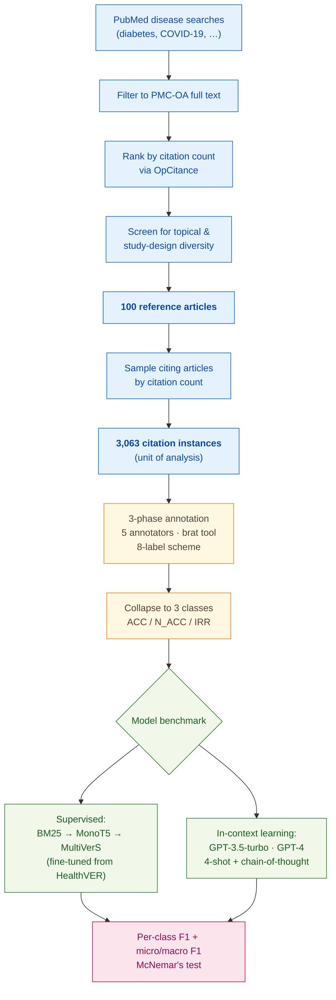

> [!success] **TL;DR**
> The supervised pipeline (MultiVerS top-20, F1 = 0.43 on NOT_ACCURATE) is currently the strongest option for citation-integrity screening, but neither it nor GPT-4 reaches a precision/recall profile that would survive deployment in a real journal-screening workflow. The most actionable improvement is better evidence-sentence retrieval: the oracle gap of 0.43 → 0.57 on the NOT_ACCURATE class shows where future work should focus.

## Structured abstract

> [!info] A plain-language summary built from this paper's discourse-graph nodes. Numbers and findings link back to specific EVD nodes — click any link to drill in.

### Question

Can a computer program automatically catch  moments where one paper claims another paper said X, but the cited paper never actually said X, or *citation integrity errors*? The authors focus on biomedical research, where these errors can distort clinical evidence and slip past human reviewers. They compare two approaches head-to-head: a smaller language model fine-tuned specifically for this task, versus a large general-purpose model (GPT-4) shown a handful of worked examples. See [[QUE - Can NLP models automatically identify citation integrity errors in biomedical publications?]].

### Methods

**Design.** The authors built three nested studies on one shared dataset: a hand-labeled corpus, a check on how well annotators agreed with each other, and a head-to-head benchmark of two model families on the same labels.

**Tools.** Annotators used the **brat** tagging tool with a custom 8-label scheme — one "accurate" label plus seven categories of error. For modeling, the authors fine-tuned **MultiVerS** (a published claim-verification model from Wadden et al. 2022) starting from a checkpoint pre-trained on **HealthVER**, a medical fact-checking dataset. They pulled candidate evidence sentences from each cited paper using a classic search algorithm (**BM25**) followed by a neural reranker (**MonoT5**). As an alternative approach, they tested OpenAI's **GPT-3.5-turbo-0613** and **GPT-4**, prompting each with the task description, four worked examples, and a request to think step-by-step before answering.

**Procedure.** The annotation ran in three phases. In Phase 1, all five annotators labeled the same 10 papers, then reconciled their disagreements — a calibration round. In Phase 2, annotators worked in pairs across 20 more papers and resolved their differences. In Phase 3, each annotator labeled 14 of the remaining 70 papers alone, and a second annotator double-checked every one. For the model benchmark, the pipeline first pulls the top 60 candidate sentences from each cited paper, MonoT5 reranks them, and the top 5, 10, or 20 sentences feed into MultiVerS. MultiVerS then predicts one of three labels — ACCURATE, NOT_ACCURATE, or IRRELEVANT. The GPT models saw the same task description plus four worked examples (one ACCURATE, one IRRELEVANT, two NOT_ACCURATE) and one test case. The authors used **McNemar's test** to check whether one model genuinely beat another or just got lucky.

**Sample.** The authors searched PubMed for highly-cited papers on specific diseases (diabetes, COVID-19, and others), filtered to those available as open-access full text, and kept the top **100 reference articles**. They then sampled articles citing each of those 100, producing **3,063 citation instances** as the unit of analysis. Five graduate and undergraduate life-sciences students did the labeling.

### Findings

- **Citation errors are common.** Roughly 4 in 10 citations contained some error: 18% major (the citing paper contradicted or misrepresented the source) and 21% minor (oversimplifications, misquoted numbers, or ambiguous multi-citation style). Per paper, minor errors outnumbered major ones at a level unlikely to be chance (p=0.0085). Review articles and original research papers showed similar error rates (p=0.095 — no real difference). [[EVD - 39.18% of 3063 annotated biomedical citation instances contained accuracy errors - @sarolAssessingCitationIntegrity2024]]

- **The human labels themselves were noisy.** Different annotators agreed at only a "fair" level on which error type to assign (Cohen's kappa = 0.18 to 0.31, where 1.0 means perfect agreement and 0 means chance). They got somewhat better after the calibration phase: agreement on which sentences counted as the relevant evidence rose from 0.20 to 0.37. This label noise puts a ceiling on how well any model trained on this data can perform. [[EVD - Inter-annotator agreement on citation accuracy labels was only kappa 0.18-0.31 in annotation phases 1-2 - @sarolAssessingCitationIntegrity2024]]

- **The fine-tuned model only reached modest accuracy.** The best MultiVerS variant scored 0.59 micro-F1 and 0.52 macro-F1 (F1 runs from 0 to 1; higher is better; macro-F1 is harder because it weighs each label equally rather than by frequency). When the authors handed the model the *correct* citation context and *correct* evidence sentences instead of search-retrieved ones, performance jumped to 0.75 / 0.78 — meaning the real bottleneck is finding the right evidence, not classifying it. [[EVD - Best NLP model MultiVerS top-20 achieved micro-F1 0.59 and macro-F1 0.52 on citation accuracy classification - @sarolAssessingCitationIntegrity2024]]

- **GPT-4 spotted accurate citations easily but missed inaccurate ones almost completely.** GPT-4 reached F1 = 0.80 on flagging accurate citations — the easy case. But on flagging inaccurate citations — the case any real deployment cares about — it scored only **F1 = 0.09**. GPT-3.5 did even worse at 0.05. Both significantly underperformed the fine-tuned MultiVerS on the error class. [[EVD - GPT-4 achieved F1 0.80 for accurate citations but only 0.09 for not-accurate citations - @sarolAssessingCitationIntegrity2024]]

### Claim supported

These findings support the broader claim that [[CLM - Citation quotation errors are subtle and currently challenging for NLP models to identify automatically]]. Neither approach is yet ready for real use: a tool that misses 90% of inaccurate citations is not a tool a journal would deploy.

### Caveats

- **The training labels carry real disagreement.** Because annotators agreed only at a fair level, the "ground truth" the models learn from contains genuine label noise — and the same noise applies to the test labels the models are scored against. [[CVT - Low inter-annotator agreement on citation accuracy labels limited quality of training and evaluation data]]

- **Citations to tables, figures, and supplementary material were excluded.** The corpus only covers citations whose supporting evidence lives in the main body of the cited paper. Many real citations point to numbers in tables or panels in figures — and we don't know how either model would do on those harder cases. [[CVT - Sarol et al. excluded citation cases where evidence appeared in tables figures or supplementary material]]

### Methods at a glance

---

## Critical appraisal

> [!info] A risk-of-bias and validity assessment across five domains, synthesized from this paper's discourse-graph nodes. Each domain gets a rating (🟢 Low risk · 🟡 Some concerns · 🔴 High risk) plus a brief, EVD-grounded justification. The TRIPOD-LLM table below covers *reporting compliance*; this section covers *methodological quality*.

| Domain                                                                   | Rating | Justification                                                                                                                                                                                                                                                                                                                                                                                                       |
| ------------------------------------------------------------------------ | :----: | ------------------------------------------------------------------------------------------------------------------------------------------------------------------------------------------------------------------------------------------------------------------------------------------------------------------------------------------------------------------------------------------------------------------- |
| **Construct validity** — does the metric actually measure the construct? |   🟡   | Macro-F1 with three labels (ACC / N_ACC / IRR) under-resolves the eight-category error scheme that the authors themselves argue is more useful in practice. The deployment-relevant construct ("would this tool catch real citation errors?") maps to the NOT_ACCURATE F1 specifically — not to micro-F1, which is dominated by the majority ACCURATE class.                                                        |
| **Internal validity** — could the comparison be biased?                  |   🟢   | Models compared on the same held-out test set; significance via McNemar's test; oracle conditions establish an upper bound. The fine-tuned MultiVerS doesn't benefit from any test-set contamination (HealthVER is medical fact-checking, not citation integrity). The closed-source GPT models *could* have seen some PMC-OA papers in pretraining, but the task formulation (per-citation labels) is novel.       |
| **External validity** — do findings generalize?                          |   🔴   | Three large constraints. (1) Citations whose evidence sits in tables, figures, or Supplementary Material are excluded — common in biomedical writing. (2) Reference-article topics restricted to specific diseases sourced from PubMed. (3) Annotators' "fair" inter-annotator agreement on the error labels means the "ground truth" itself is a noisy approximation of what an expert reader would call an error. |
| **Statistical rigor** — appropriate uncertainty + comparisons?           |   🟡   | McNemar's test is appropriate for paired model predictions on the same test set, and significance levels are reported. But the paper does not provide confidence intervals on F1, no multiple-comparison correction across the seven model conditions × three classes, and no per-domain power analysis given the small NOT_ACCURATE sample.                                                                        |
| **Reproducibility** — code, data, determinism?                           |   🟢   | Annotated corpus and the best NLP model are publicly released at github.com/ScienceNLP-Lab/Citation-Integrity (TRIPOD-LLM 14e ✅, 14f ✅). GPT inference parameters (temperature, seed, top-p) are not disclosed (TRIPOD-LLM 6c ⚠️), so the GPT-4 numbers carry irreducible run-to-run variance.                                                                                                                      |

**Bottom line.** The supervised pipeline (MultiVerS top-20, F1 = 0.43 on NOT_ACCURATE) is currently the strongest option for citation-integrity screening, but neither it nor GPT-4 reaches a precision/recall profile that would survive deployment in a real journal-screening workflow. The most actionable improvement is better evidence-sentence retrieval: the oracle gap of 0.43 → 0.57 on the NOT_ACCURATE class shows where future work should focus.

> [!tip] **Applicable external appraisal frameworks beyond TRIPOD-LLM** (already covered by the table below): **HELM** (Liang et al. 2022) for holistic LLM-evaluation principles · **Datasheets for Datasets** (Gebru et al. 2021) for the evaluation corpus · **Model Cards** (Mitchell et al. 2019) for the LLMs being evaluated · **PROBAST+AI** for the supervised MultiVerS classifier.

---

## TRIPOD-LLM reporting summary

> [!info] Reporting compliance for this paper, mapped to the TRIPOD-LLM checklist (Methods items 5a–15 and Results items 16a–18). Compliance icons: ✅ fully reported · ⚠️ partially reported / unclear · ❌ should be reported but not reported · ➖ not applicable to this study. Item 17 (Performance) is reported per-EVD; see each EVD's `## Other Notes`.

| # | Item | ✓ | Reported in this study |
| --- | --- | :---: | --- |
| **5a** | Data sources | ✅ | 100 highly-cited PMC-OA reference articles + their PMC-OA citing articles. Rationale: enable open release of training/evaluation data. |
| **5b** | Data points + distribution | ✅ | 3063 citation instances; 3420 citation-context sentences; 3791 evidence sentences. Median 27 citations/ref (range 11–74; IQR 8.25); median 22 citing articles/ref (range 5–29; IQR 6). Mix of primary research and review articles; topics span diabetes, COVID-19, and other PubMed disease searches. |
| **5c** | Date range of data | ❌ | Not explicitly reported. Models inferenced February 2024; OpenAI training cutoffs not disclosed. |
| **5d** | Pre-processing / quality checks | ✅ | OpCitance pipeline located citation markers in PMC-OA citing full text; paragraph extracted with marker pre-highlighted for annotators. |
| **5e** | Missing / imbalanced data | ⚠️ | Citations whose evidence was in tables, figures, or Supplementary Material were excluded. Class imbalance (60.82% ACCURATE vs 39.18% errors) reflected in metrics; not algorithmically rebalanced. |
| **6a** | LLM name + version | ✅ | GPT-3.5-turbo-0613, GPT-4 (OpenAI, Feb 2024 inference); MultiVerS (Wadden et al. 2022, Longformer-based) fine-tuned from HealthVER; BM25 + MonoT5 reranker; PubMedBERT (citation-context baseline). |
| **6b** | Development process | ✅ | MultiVerS pretrained on HealthVER, then fine-tuned on Sarol training split with rationale-classifier loss weight = 0; three-way classification head. PubMedBERT fine-tuned for sentence-level citation-context classification. |
| **6c** | Inference settings / prompting | ⚠️ | GPT prompt structure described (task instruction + 3 class definitions + 4 demonstrations + XML/markdown delimiters + chain-of-thought reasoning request); inference parameters (temperature, top_p, seed, max tokens, system prompt) not reported. MultiVerS hyperparameters in Supplementary Material. |
| **6d** | Output | ✅ | Predicted 3-way label (ACCURATE / NOT_ACCURATE / IRRELEVANT) plus free-text reasoning for GPT models. |
| **6e** | Classification thresholds | ✅ | 8 fine-grained labels collapsed to 3: ACC ← {ACCURATE, INDIRECT}; N_ACC ← {CONTRADICT, NOT_SUBSTANTIATE, OVERSIMPLIFY, MISQUOTE, ETIQUETTE}; IRR ← IRRELEVANT. No probability thresholds reported. |
| **7a** | Quality metrics | ✅ | Precision, recall, F1 (per class); micro-F1 and macro-F1. Sentence retrieval: Recall@{1,5,10,20} and MRR. |
| **7b** | Relevance to downstream | ⚠️ | Macro-F1 emphasizes the rare NOT_ACCURATE class; no formal downstream-utility analysis (e.g., screening time savings, false-positive tolerance) reported. |
| **7c** | Outcome definition | ✅ | Citation accuracy at the citation-instance level, gold-labeled by humans; predicted via Python pipeline against held-out citations. |
| **7d** | Subjective interpretation | ✅ | Annotator qualifications described; pairwise IAA reported (κ): citation context 0.96; evidence sentence 0.20→0.37; accuracy labels 0.18–0.31. |
| **7e** | Comparison | ✅ | MultiVerS variants (titles+abstracts, top-5/10/20, top-20+gold, oracle gold-evidence, oracle gold-context+evidence) vs. GPT-3.5-turbo vs. GPT-4. McNemar's test for pairwise significance. |
| **8a** | Annotation guidelines | ✅ | Initial guidelines drafted by investigators, refined throughout. Detailed guidelines + brat-interface screenshots in Supplementary Material. 8-category label scheme + category-priority rule for multi-error cases. |
| **8b** | Annotators + IAA | ✅ | 5 annotators. Phase 1: all 5 on the same 10 articles (5-way overlap). Phase 2: paired annotation of 20 articles, 8/annotator (each pair overlap). Phase 3: individual annotation of 70 articles, 14/annotator, each set cross-checked. Pairwise IAA averaged on phases 1–2 (30 articles). |
| **8c** | Annotator background | ✅ | Graduate and undergraduate students in life sciences with prior experience reading life-sciences papers. |
| **9a** | Prompt design | ⚠️ | Manual prompt template described; only "slight variations" tried — no systematic prompt-engineering search. |
| **9b** | Prompt-development data | ✅ | Demonstrations selected from Sarol training set (1 ACC, 1 IRR, 2 N_ACC). |
| **10** | Summarization | ➖ | Not applicable. |
| **11** | Instruction tuning / alignment | ✅ | MultiVerS fine-tuned on HealthVER then Sarol training split. GPT models not fine-tuned in main analysis (one supplementary GPT-3.5-turbo fine-tuning experiment with mixed results). |
| **12** | Compute | ❌ | Not reported. Authors note GPT was capped at top-5 evidence sentences "due to computational costs of longer evidence segments." |
| **13** | Ethical approval | ➖ | Not applicable (no human-subjects data; analysis on published articles). |
| **14a** | Funding | ✅ | US Office of Research Integrity (ORI) grant ORIIR220073. |
| **14b** | Conflicts of interest | ✅ | None declared. |
| **14c** | Protocol | ❌ | Not reported. |
| **14d** | Registration | ➖ | Not registered (not a clinical study). |
| **14e** | Data availability | ✅ | Annotated corpus public at github.com/ScienceNLP-Lab/Citation-Integrity. |
| **14f** | Code availability | ✅ | Best NLP model + pipeline public at the same repository. |
| **15** | Patient/public involvement | ➖ | Not applicable. |
| **16a** | Flow of data | ✅ | 100 reference articles → 3063 citation instances annotated. First 30 (phases 1–2) used for IAA; remaining 70 (phase 3) individually annotated and cross-checked. |
| **16b** | Characteristics | ✅ | Median 27 citations/ref article (range 11–74; IQR 8.25); median 22 citing articles/ref (range 5–29; IQR 6); mix of primary research, review, meta-analysis, longitudinal study designs; topics span diabetes, COVID-19, etc. |
| **16c** | Distribution comparison | ➖ | Not applicable (no clinical-outcome subgroup analysis). |
| **16d** | N per analysis | ⚠️ | IAA: 30 reference articles. NLP model evaluation: full corpus split into train/test — split sizes not reported in main text. |
| **17** | Performance | (per-EVD) | Reported per-EVD. See each Sarol EVD's `## Other Notes` for the EVD-specific F1 / kappa / prevalence numbers. |
| **18** | LLM updating | ➖ | Not applicable (no model updating reported). |
