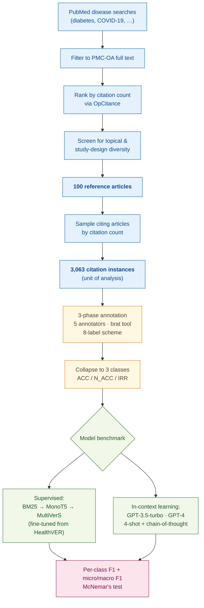

> [!success] **TL;DR**
> The supervised pipeline (MultiVerS top-20, F1 = 0.43 on NOT_ACCURATE) is currently the strongest option for citation-integrity screening, but neither it nor GPT-4 reaches a precision/recall profile that would survive deployment in a real journal-screening workflow. The most actionable improvement is better evidence-sentence retrieval: the oracle gap of 0.43 → 0.57 on the NOT_ACCURATE class shows where future work should focus.

## Structured abstract

> [!info] A plain-language summary built from this paper's discourse-graph nodes. Numbers and findings link back to specific EVD nodes — click any link to drill in.

### Question

Can a computer program automatically catch  moments where one paper claims another paper said X, but the cited paper never actually said X, or *citation integrity errors*? The authors focus on biomedical research, where these errors can distort clinical evidence and slip past human reviewers. They compare two approaches head-to-head: a smaller language model fine-tuned specifically for this task, versus a large general-purpose model (GPT-4) shown a handful of worked examples. See [[QUE - Can NLP models automatically identify citation integrity errors in biomedical publications?]].

### Methods

**Design.** The authors built three nested studies on one shared dataset: a hand-labeled corpus, a check on how well annotators agreed with each other, and a head-to-head benchmark of two model families on the same labels.

**Tools.** Annotators used the brat tagging tool with a custom 8-label scheme — one "accurate" label plus seven categories of error. For modeling, the authors fine-tuned MultiVerS (a published claim-verification model from Wadden et al. 2022) starting from a checkpoint pre-trained on HealthVER, a medical fact-checking dataset. They pulled candidate evidence sentences from each cited paper using a classic search algorithm (BM25) followed by a neural reranker (MonoT5). As an alternative approach, they tested OpenAI's GPT-3.5-turbo-0613 and GPT-4, prompting each with the task description, four worked examples, and a request to think step-by-step before answering.

**Procedure.** The annotation ran in three phases. In Phase 1, all five annotators labeled the same 10 papers, then reconciled their disagreements — a calibration round. In Phase 2, annotators worked in pairs across 20 more papers and resolved their differences. In Phase 3, each annotator labeled 14 of the remaining 70 papers alone, and a second annotator double-checked every one. For the model benchmark, the pipeline first pulls the top 60 candidate sentences from each cited paper, MonoT5 reranks them, and the top 5, 10, or 20 sentences feed into MultiVerS. MultiVerS then predicts one of three labels — ACCURATE, NOT_ACCURATE, or IRRELEVANT. The GPT models saw the same task description plus four worked examples (one ACCURATE, one IRRELEVANT, two NOT_ACCURATE) and one test case. The authors used McNemar's test to check whether one model genuinely beat another or just got lucky.

**Sample.** The authors searched PubMed for highly-cited papers on specific diseases (diabetes, COVID-19, and others), filtered to those available as open-access full text, and kept the top 100 reference articles. They then sampled articles citing each of those 100, producing 3,063 citation instances as the unit of analysis. Five graduate and undergraduate life-sciences students did the labeling.

### Findings

- **Citation errors are common.** Roughly 4 in 10 citations contained some error: 18% major (the citing paper contradicted or misrepresented the source) and 21% minor (oversimplifications, misquoted numbers, or ambiguous multi-citation style). Per paper, minor errors outnumbered major ones at a level unlikely to be chance (p=0.0085). Review articles and original research papers showed similar error rates (p=0.095 — no real difference). [[EVD - 39.18% of 3063 annotated biomedical citation instances contained accuracy errors - @sarolAssessingCitationIntegrity2024]]

- **The human labels themselves were noisy.** Different annotators agreed at only a "fair" level on which error type to assign (Cohen's kappa = 0.18 to 0.31, where 1.0 means perfect agreement and 0 means chance). They got somewhat better after the calibration phase: agreement on which sentences counted as the relevant evidence rose from 0.20 to 0.37. This label noise puts a ceiling on how well any model trained on this data can perform. [[EVD - Inter-annotator agreement on citation accuracy labels was only kappa 0.18-0.31 in annotation phases 1-2 - @sarolAssessingCitationIntegrity2024]]

- **The fine-tuned model only reached modest accuracy.** The best MultiVerS variant scored 0.59 micro-F1 and 0.52 macro-F1 (F1 runs from 0 to 1; higher is better; macro-F1 is harder because it weighs each label equally rather than by frequency). When the authors handed the model the *correct* citation context and *correct* evidence sentences instead of search-retrieved ones, performance jumped to 0.75 / 0.78 — meaning the real bottleneck is finding the right evidence, not classifying it. [[EVD - Best NLP model MultiVerS top-20 achieved micro-F1 0.59 and macro-F1 0.52 on citation accuracy classification - @sarolAssessingCitationIntegrity2024]]

- **GPT-4 spotted accurate citations easily but missed inaccurate ones almost completely.** GPT-4 reached F1 = 0.80 on flagging accurate citations — the easy case. But on flagging inaccurate citations — the case any real deployment cares about — it scored only F1 = 0.09. GPT-3.5 did even worse at 0.05. Both significantly underperformed the fine-tuned MultiVerS on the error class. [[EVD - GPT-4 achieved F1 0.80 for accurate citations but only 0.09 for not-accurate citations - @sarolAssessingCitationIntegrity2024]]

### Claim supported

These findings support the broader claim that [[CLM - Citation quotation errors are subtle and currently challenging for NLP models to identify automatically]]. Neither approach is yet ready for real use: a tool that misses 90% of inaccurate citations is not a tool a journal would deploy.

### Caveats

- **The training labels carry real disagreement.** Because annotators agreed only at a fair level, the "ground truth" the models learn from contains genuine label noise — and the same noise applies to the test labels the models are scored against. [[CVT - Low inter-annotator agreement on citation accuracy labels limited quality of training and evaluation data]]

- **Citations to tables, figures, and supplementary material were excluded.** The corpus only covers citations whose supporting evidence lives in the main body of the cited paper. Many real citations point to numbers in tables or panels in figures — and we don't know how either model would do on those harder cases. [[CVT - Sarol et al. excluded citation cases where evidence appeared in tables figures or supplementary material]]

### Methods at a glance

---

## Quality appraisal

> [!info] Risk-of-bias and validity assessment, synthesized from this paper's discourse-graph nodes and grounded in the same paper this page's top trust-signal chips summarize. Covers *methodological quality* — the TRIPOD-LLM table below covers *reporting compliance* instead.
> <dl class="callout-legend">
> <dt>● Low risk</dt><dd>No meaningful threat to this domain identified</dd>
> <dt>◐ Some risk</dt><dd>A real but non-fatal limitation</dd>
> <dt>○ High risk</dt><dd>A significant, unaddressed threat to validity</dd>
> </dl>

| Domain | Rating | Quote |
| --- | :---: | --- |
| **Construct validity**: does the metric actually measure the construct? | 🟡 | *"We consolidated our labels into the three categories used by MultiVerS"* `§2.5.3, p.4`, collapsing the eight-category error scheme to three labels under-resolves what the authors themselves treat as the more informative error taxonomy |
| **Internal validity**: could the comparison be biased? | 🟢 | *"We assess whether the performance differences between the baseline MultiVerS model and the other models are statistically significant using McNemar's test."* `§2.6, p.5`, paired significance testing on a shared held-out test set, with oracle conditions establishing an upper bound |
| **External validity**: do findings generalize? | 🔴 | *"We excluded cases in which the relevant evidence was in tables/figures or in Supplementary Material, which is fairly common."* `§4.3, p.7`, a common real-world evidence location is excluded from the corpus entirely |
| **Statistical Conclusion Validity**: appropriate uncertainty + comparisons? | 🟡 | *"the differences of model performances from the baseline were not statistically significant"* `Table 2 note, p.3`, McNemar's test is applied appropriately for paired comparisons, but no confidence intervals on F1 or multiple-comparison correction across the model conditions are reported |
| **Reproducibility**: code, data, determinism? | 🟢 | *"We make the corpus and the best-performing NLP model publicly available at https://github.com/ScienceNLP-Lab/Citation-Integrity/."* `Abstract, p.1`, corpus and model are public, though GPT inference parameters (temperature, seed, top-p) are not disclosed |
| **Data leakage**: could models have seen this data pretraining? | 🟡 | *"The models were evaluated in February, 2024."* `§2.5.4, p.4`, no discussion of whether GPT-3.5/GPT-4 could have seen the underlying highly-cited PMC-OA reference articles during pretraining, though the per-citation accuracy labels themselves are novel annotations |
| **Baseline adequacy**: is there a meaningful floor to beat? | 🟢 | *"We compare this approach with a simple yet effective baseline, which simply uses the citance as the citation context."* `§2.5.1, p.3`, a concrete naive baseline anchors the sentence-retrieval and classification comparisons |
| **Train/dev/test hygiene**: are data splits kept separate? | 🟡 | *"For our baseline experiments, we used our training set to fine-tune the MultiVerS model trained on HealthVER"* `§2.5.3, p.3`, a training set is explicitly named, but the split methodology (how test instances are kept separate) is not described in the main text |
| **Multiple-comparisons correction**: controlled for repeated testing? | 🔴 | Not reported, no correction is stated across the seven model conditions × three classes compared via McNemar's test |
| **Human-baseline comparability**: is there a human reference point? | 🔴 | Not reported, the models are scored against human-annotated ground truth labels but no human was tasked with performing the citation-accuracy classification itself as a comparator |
| **Confidence Intervals**: are point estimates accompanied by an interval? | 🔴 | Not reported — *"[McNemar's test result] was...significant"* `Table 2 note, p.3` gives a significance verdict with no interval on the underlying F1 gap |
| **Chance-Corrected Metrics**: does agreement/accuracy correct for chance? | 🟢 | *"Cohen's kappa (κ) was used for all tasks."* `Methods, p.4`, reported at 0.18–0.31 across the annotation phases |
| **Non-Significant Result Spin**: are null or negative findings framed plainly? | 🔴 | Not applicable — no significance tests are run on the model comparisons; McNemar's test is applied appropriately where used, with no apparent reframing |
| **Statistic Accuracy**: do the paper's own reported numbers check out? | 🟢 | The paper's Cohen's kappa values (0.18–0.31 across annotation phases) fall within the valid 0–1 range, and the reported table totals are internally consistent with the stated per-label counts `Table 1, p.5` |
| **Ablation Experiment(s)**: does the paper isolate a component's contribution? | 🟢 | Table 4 systematically varies the evidence-retrieval input (title+abstract, top-5/10/20 sentences, +annotated evidence, oracle) and reports the resulting F1 for each variant, isolating the retrieval component's contribution `p.6` |

**Bottom line.** The supervised pipeline (MultiVerS top-20, F1 = 0.43 on NOT_ACCURATE) is currently the strongest option for citation-integrity screening, but neither it nor GPT-4 reaches a precision/recall profile that would survive deployment in a real journal-screening workflow. The most actionable improvement is better evidence-sentence retrieval: the oracle gap of 0.43 → 0.57 on the NOT_ACCURATE class shows where future work should focus.

> [!tip] **Applicable external appraisal frameworks beyond TRIPOD-LLM** (already covered by the table below): **HELM** (Liang et al. 2022) for holistic LLM-evaluation principles · **Datasheets for Datasets** (Gebru et al. 2021) for the evaluation corpus · **Model Cards** (Mitchell et al. 2019) for the LLMs being evaluated · **PROBAST+AI** for the supervised MultiVerS classifier.

---

## TRIPOD-LLM reporting summary

> [!info] Reporting compliance for this paper, mapped to the TRIPOD-LLM checklist (Title/Abstract/Introduction items 1–4, Methods items 5a–15, Results items 16a–18). TRIPOD-LLM is a clinical-ML guideline being applied here to a non-clinical AI-research benchmark — where an item's own wording says "healthcare context" or "care pathway," it's read as "research-evaluation context" / "research workflow" instead. Item 17 (Performance) is reported per-EVD; see each EVD's `## Other Notes`.
> 

> ●Fully reported
> ◐Partial / unclear
> ○Not reported
> –Not applicable
> 

| # | Item | ✓ | Quote |
| --- | --- | :---: | --- |
| **1** | Title | ✅ | *"Assessing citation integrity in biomedical publications: corpus annotation and NLP models"* `Title` |
| **2** | Abstract | ➖ | Assessed separately under TRIPOD-LLM's own Abstract extension, not scored here |
| **3a** | Background — context + rationale | ✅ | *"Citations are foundational to science. It is through citations that scientific claims gain credibility, propagate, and become accepted as facts."* `§1, p.1` |
| **3b** | Background — target population | ✅ | *"We manually annotated 100 highly-cited biomedical publications (reference articles) and citations to them."* `Abstract, p.1` |
| **4** | Objectives | ✅ | *"we focus on quotation errors, errors in citation content that can distort the scientific evidence and that are hard to detect for humans. We construct a corpus and propose natural language processing (NLP) methods to identify such errors in biomedical publications."* `Abstract, p.1` |
| **5a** | Data sources | ✅ | *"We collected 100 highly-cited research articles available in full text from the PubMed Central Open Access Subset (PMC-OA) to form our reference article set."* `§2.1, p.2` |
| **5b** | Data points + distribution | ✅ | *"A total of 3063 citation instances corresponding 3420 citation context sentences and 3791 evidence sentences were annotated (1.12 context and 1.24 evidence sentences per citation)."* `§3.1, p.5` |
| **5c** | Date range of data | ❌ | *"The models were evaluated in February, 2024."* `§2.5.4, p.5` — the date range of the underlying annotated corpus itself is not reported, nor are OpenAI's training/pretraining cutoff dates |
| **5d** | Pre-processing / quality checks | ✅ | *"we employed the process used in OpCitance to locate the citation marker in the citing article. For annotation, we extracted the paragraph containing the citation marker and highlighted the citation marker of interest in the paragraph."* `§2.1, p.2` |
| **5e** | Missing / imbalanced data | ⚠️ | *"We excluded cases in which the relevant evidence was in tables/figures or in Supplementary Material, which is fairly common."* `§4.3, p.7` — class imbalance (60.82% ACCURATE vs. 39.18% errors) `Table 1, p.5` is reflected in metrics but not algorithmically rebalanced |
| **6a** | LLM name + version | ✅ | *"We evaluated two LLMs from OpenAI (GPT-3.5-turbo-0613 and GPT-4) for citation accuracy classification."* `§2.5.4, p.4` |
| **6b** | Development process | ✅ | *"For our baseline experiments, we used our training set to fine-tune the MultiVerS model trained on HealthVER (Sarrouti et al. 2021)."* `§2.5.3, p.4` |
| **6c** | Inference settings / prompting | ⚠️ | *"The prompt consists of a detailed task instruction along with descriptions of three classes, which is followed by four demonstrations selected from the training set (one each for ACCURATE and IRRELEVANT, and two for NOT_ACCURATE)."* `§2.5.4, p.4-5` — inference parameters (temperature, top_p, seed, max tokens) not reported |
| **6d** | Output | ✅ | *"to return a prediction (ACCURATE, NOT_ACCURATE, or IRRELEVANT) along with their reasoning for the prediction"* `§2.5.4, p.4-5` |
| **6e** | Classification thresholds | ✅ | *"We consolidated our labels into the three categories used by MultiVerS. Specifically, we mapped the ACCURATE and INDIRECT labels to Support; CONTRADICT, NOT_SUBSTANTIATE, OVERSIMPLIFY, MISQUOTE, and ETIQUETTE to Refute; and IRRELEVANT to Not Enough Information."* `§2.5.3, p.4` |
| **7a** | Quality metrics | ✅ | *"We report standard evaluation metrics, precision, recall, and their harmonic mean, F1 score, for citation context identification and accuracy classification tasks... we use recall@k and mean reciprocal rank (MRR)."* `§2.6, p.5` |
| **7b** | Relevance to downstream use | ⚠️ | *"such models could help authors in improving their citation practices and journals in scrutinizing submitted manuscripts more effectively for citation integrity errors"* `§5, p.7` — no formal downstream-utility analysis (e.g. screening time savings, false-positive tolerance) reported |
| **7c** | Outcome definition | ✅ | *"Citation accuracy classification: Based on the citation context and evidence sentences, determine whether the citation is supported by the evidence sentences (accurate) or is inconsistent with them (error)."* `§2.2, p.2-3` |
| **7d** | Subjective interpretation | ✅ | *"We calculated average pairwise inter-annotator agreement using Cohen's κ for citation context, evidence sentence, and citation accuracy annotations over the first two phases of annotation (30 reference articles)."* `§3.2, p.5` |
| **7e** | Comparison | ✅ | *"We assess whether the performance differences between the baseline MultiVerS model and the other models are statistically significant using McNemar's test."* `§2.6, p.5` |
| **8a** | Annotation guidelines | ✅ | *"Initial annotation guidelines were developed by the investigators, and they were extended and refined throughout the annotation process."* `§2.3, p.3` |
| **8b** | Annotators + IAA | ✅ | *"Annotation was performed in three phases, and five annotators were involved in the annotation process."* `§2.3, p.3` — pairwise IAA on accuracy labels *"0.18–0.31"* `§3.2, p.5` |
| **8c** | Annotator background | ✅ | *"Annotators were graduate and undergraduate students in life sciences with experience in reading life sciences papers."* `§2.3, p.3` |
| **9a** | Prompt design | ⚠️ | *"we only experimented with slight variations on a manual prompt and better prompting strategies, specifically focusing on NOT_ACCURATE, could yield better results"* `§4.2, p.7` |
| **9b** | Prompt-development data | ✅ | *"four demonstrations selected from the training set (one each for ACCURATE and IRRELEVANT, and two for NOT_ACCURATE)"* `§2.5.4, p.4-5` |
| **10** | Summarization | ➖ | Not applicable — no summarization endpoint evaluated as a primary outcome |
| **11** | Instruction tuning / alignment | ✅ | *"For our baseline experiments, we used our training set to fine-tune the MultiVerS model trained on HealthVER"* `§2.5.3, p.4` — *"We performed additional experiments (fine-tuning, binary task formulation) with GPT-3.5-turbo, which showed mixed results"* `§4.2, p.7` |
| **12** | Compute | ❌ | *"GPT models use the top five sentences only, due to computational costs of longer evidence segments."* `§3.3.3, p.5` — no GPU/CPU hardware, wall-clock time, or API cost figures reported |
| **13** | Ethical approval | ➖ | Not applicable — no human-subjects data; analysis performed on published articles |
| **14a** | Funding | ✅ | *"This study was supported by the Office of Research Integrity (ORI) of the US Department of Health and Human Services (HHS) (grant number: ORIIR220073)."* `Funding, p.8` |
| **14b** | Conflicts of interest | ✅ | *"No competing interest is declared."* `Conflict of interest, p.7` |
| **14c** | Protocol | ❌ | Not reported |
| **14d** | Registration | ➖ | Not applicable — not a registered clinical study |
| **14e** | Data availability | ✅ | *"We make the corpus and the best-performing NLP model publicly available at https://github.com/ScienceNLP-Lab/Citation-Integrity/."* `Abstract, p.1` |
| **14f** | Code availability | ✅ | *"We make the corpus and the best-performing NLP model publicly available at https://github.com/ScienceNLP-Lab/Citation-Integrity/."* `Abstract, p.1` |
| **15** | Patient/public involvement | ➖ | Not applicable |
| **16a** | Flow of data | ✅ | *"A total of 3063 citation instances corresponding 3420 citation context sentences and 3791 evidence sentences were annotated"* `§3.1, p.5` — *"In the third phase, each annotator individually annotated citations to 14 articles, for a total of 70 articles."* `§2.3, p.3` |
| **16b** | Characteristics | ✅ | *"The median number of citations per reference article was 27 (range: 11–74, IQR: 8.25). The median number of citing articles per reference article was 22 (range: 5–29, IQR: 6)."* `§3.1, p.5` |
| **16c** | Distribution comparison | ➖ | Not applicable — no clinical-outcome subgroup comparison |
| **16d** | N per analysis | ⚠️ | *"The first 30 reference articles (phases one and two) were included in calculation."* `§2.4, p.4` — NLP model evaluation split sizes not reported in main text |
| **17** | Performance | `per-EVD` | Reported per-EVD. See each EVD's `## Other Notes`. |
| **18** | LLM updating | ➖ | Not applicable — no model updating reported |
