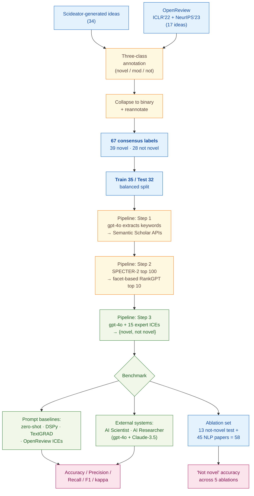

> [!success] **TL;DR**
> The Idea Novelty Checker is a well-engineered RAG pipeline and the ablation cleanly shows that LLM-based re-ranking, especially facet-based, is the load-bearing component. But the headline 0.81 accuracy is built on 32 ideas labeled by the same two authors who built the in-context examples, with no confidence intervals or significance tests, so the "13% higher than prior systems" claim should be read as a promising signal rather than evidence of deployable novelty assessment.

## Abstract

### Question

Can a computer program automatically tell whether a research idea is genuinely new, by comparing it to past work, in a way that lines up with what expert reviewers say? The authors target the bottleneck in tools that automatically generate research ideas; there is no good way to filter out ideas that already exist in the literature. They build a retrieval-augmented generation (RAG) system (a setup where a language model first looks up relevant papers, then judges novelty against them) and benchmark it head-to-head against zero-shot prompts, two prompt-optimization methods, and two prior systems on the same expert-labeled test set. See [[QUE - Can an LLM-based RAG system reliably evaluate the novelty of scientific ideas compared to expert judgment?]].

### Methods

**Design.** The authors run a within-paper benchmark: they hand-label a small dataset of research ideas, hold out a test split, and compare seven prompting strategies plus two external systems on the same labels, followed by a component-removal ablation that isolates which retrieval steps matter most.

**Tools.** The pipeline is built on gpt-4o (OpenAI's general-purpose model, used in August and September 2024) for three roles: keyword extraction, paper re-ranking, and final novelty judgment. Candidate papers come from the Semantic Scholar Search and Snippet APIs (a public scholarly search service). SPECTER-2 (a paper-embedding model from Cohan and colleagues) shortlists candidates by similarity. RankGPT (an LLM-based re-ranker from Sun and colleagues) then re-orders them using a *facet-based* scheme, comparing ideas on purpose, mechanism, evaluation, and application. Two prompt-optimizer baselines, DSPy and TextGRAD, automatically tune the wording of the novelty prompt. The ablation swaps in o3-mini (a smaller OpenAI reasoning model) for the final novelty step.

**Procedure.** The authors first ran a formative study where two expert annotators (the first and second authors) labeled 51 ideas under a three-class scheme (novel, moderately novel, not novel), then collapsed labels to binary (novel or not novel) and reannotated. The pipeline then works in three steps. First, gpt-4o extracts keywords and candidate titles from an input idea, queries Semantic Scholar, and pools the results. Second, SPECTER-2 keeps the top 100 by embedding similarity, and RankGPT re-ranks them facet by facet to produce the top 10. Third, gpt-4o judges novelty given the idea, the top 10 papers, and 15 expert-labeled worked examples (called in-context examples; the model is shown solved cases at inference time, with no fine-tuning). The authors compared their checker against zero-shot, Anthropic-prompt-generator, DSPy, TextGRAD, OpenReview-derived examples, AI Scientist (Lu and colleagues), and AI Researcher (Si and colleagues, with both gpt-4o and Claude-3.5-Sonnet). The ablation removed one pipeline component at a time and measured the accuracy drop on the "not novel" class.

**Sample.** The authors sourced 51 research ideas, 34 generated by Scideator (Radensky and colleagues' idea-generation tool) plus 17 from accepted and rejected OpenReview submissions to ICLR 2022 and NeurIPS 2023. After expert reannotation they kept 67 consensus-labeled examples (39 novel, 28 not novel), which they split into 35 training and 32 test ideas with balanced classes. The ablation set added 45 already-published NLP papers as guaranteed-not-novel cases, giving 58 ideas. The unit of analysis is one idea. Two annotators provided all gold labels, the first and second authors of the paper themselves, both NLP and scientific-discovery researchers.

### Findings

- **The full pipeline beat every prompting baseline.** The Idea Novelty Checker reached 0.81 accuracy, 0.79 F1, and Cohen's kappa = 0.59 on the 32-idea test set (F1 runs from 0 to 1 and balances precision against recall, higher is better; Cohen's kappa runs from 0 to 1, where 1.0 means perfect agreement and 0 means chance). The best non-expert baseline (TextGRAD) reached only 0.78 accuracy and 0.76 F1, and zero-shot prompting reached 0.68. Expert-labeled in-context examples, showing the model solved cases drawn from the formative study, drove most of the gain. [[EVD - Idea Novelty Checker achieved accuracy 0.81 F1 0.79 Cohen kappa 0.59 outperforming baselines on expert-annotated dataset - @shahidLiteratureGroundedNoveltyAssessment2025]]

- **An off-the-shelf competing system performed near chance.** AI Scientist's novelty prompt scored 0.47 accuracy, 0.44 F1, and kappa = 0.05, close to random guessing, when run on the same ideas with the same top-10 papers. The system defaulted to "not novel" on 18 of 32 test ideas (56%) because it could not reach a decision in its iterative loop. AI Researcher fared better with gpt-4o (F1 = 0.75, kappa = 0.52) but collapsed to F1 = 0.56 with Claude-3.5-Sonnet, showing the prompt is highly backbone-sensitive. [[EVD - AI Scientist achieved accuracy 0.47 F1 0.44 kappa 0.05 on same novelty evaluation test set - @shahidLiteratureGroundedNoveltyAssessment2025]]

- **The re-ranker is doing most of the work.** On the 58-idea ablation set, the full pipeline correctly flagged 89.66% of "not novel" ideas. Removing only the facet-based re-ranking (keeping general-relevance RankGPT) crashed accuracy to 13.79%; removing the LLM re-ranker entirely dropped it to 10.34%. Keyword retrieval alone scored 5.17%. The ablation pulls apart two layered effects, having any LLM re-ranker matters far more than facet-awareness on its own, but together they are decisive. [[EVD - Removing facet-based RankGPT re-ranker dropped not-novel prediction accuracy from 89.66% to 13.79% - @shahidLiteratureGroundedNoveltyAssessment2025]]

### Claim supported

These findings support two related claims: [[CLM - Expert-annotated in-context examples significantly improve LLM novelty classification accuracy over zero-shot and prompt-optimized baselines]] and [[CLM - Facet-based LLM re-ranking is critical for identifying the most relevant papers for novelty evaluation]]. For someone considering deploying this in a triage workflow (say, helping an idea-generation tool flag stale ideas before a human looks at them) the result is encouraging but premature: 0.81 accuracy on 32 ideas is suggestive, not confirmatory, and depends on having expert-labeled examples in the same domain.

### Caveats

- **The test set is tiny.** Sixty-seven consensus labels and 32 test ideas leave little room for stable estimates; one or two flipped labels would visibly move every metric. [[CVT - Shahid et al. novelty evaluation used only 67 consensus-labeled examples with a test set of 32 ideas]]

- **The same two people wrote training labels and test labels.** The first and second authors annotated everything, and many test ideas came from the same generator (Scideator) that produced training ideas, so the model is partly being judged on "does it match these specific annotators' view of novelty". [[CVT - Same expert annotators who labeled training examples also classified test ideas introducing potential circularity]]

- **Tiny prompt changes flip the answer.** The authors themselves report that nearly identical prompts produced accuracies ranging from 0 to 0.6, which makes the headline numbers hard to replicate without the exact wording. [[CVT - LLM novelty evaluation is highly sensitive to prompt variations making results difficult to replicate]]

### Methods at a glance

---

## Quality appraisal

> [!info] Risk-of-bias and validity assessment, synthesized from this paper's discourse-graph nodes and grounded in the same paper this page's top trust-signal chips summarize. Covers *methodological quality*, the TRIPOD-LLM table below covers *reporting compliance* instead.
> <dl class="callout-legend">
> <dt>● Low risk</dt><dd>No meaningful threat to this domain identified</dd>
> <dt>◐ Some risk</dt><dd>A real but non-fatal limitation</dd>
> <dt>○ High risk</dt><dd>A significant, unaddressed threat to validity</dd>
> </dl>

| Domain | Rating | Quote |
| --- | :---: | --- |
| **Construct validity**: does the metric actually measure the construct? | 🟡 | *"The experts achieved a moderate agreement (Cohen's Kappa = 0.64)."* `§3, p.3`, the gold-standard labels themselves only reach moderate agreement, so binary novelty is partly a coin flip on hard cases |
| **Internal validity**: could the comparison be biased? | 🔴 | *"the same annotators who provided the in-context examples also classified the test ideas. This could potentially give our approach an advantage in understanding our view of novelty."* `§8, p.9` |
| **External validity**: do findings generalize? | 🔴 | *"our study engaged experts who evaluated 51 ideas, comprising of 46 generated by the Scideator system (Radensky et al.) and 5 adapted from accepted and rejected papers from OpenReview (ICLR 22, NeurIPS 23)."* `§3, p.3`, corpus restricted to NLP/ML ideas from a single generator plus two venues |
| **Statistical Conclusion Validity**: appropriate uncertainty + comparisons? | 🔴 | *"our novelty checker achieves approximately 13% higher agreement than existing approaches"* `Abstract, p.1`, no confidence intervals or significance tests reported alongside this headline gap on a 32-idea test set |
| **Reproducibility**: code, data, determinism? | 🟡 | *"We plan to release our code and expert-collected data1 to support work in automatic scientific discovery"* `§1, p.2`, data/code-release commitment stated, but inference parameters (temperature, top_p, seed) are not disclosed |
| **Data leakage**: could models have seen this data pretraining? | 🔴 | Not reported, no discussion of whether gpt-4o's pretraining could already include the source ideas or papers |
| **Baseline adequacy**: is there a meaningful floor to beat? | 🟢 | *"we employed a zero-shot prompt as a straightforward baseline"* `§5, p.5`, a concrete zero-shot baseline is reported and beaten by every configuration of the full pipeline |
| **Train/dev/test hygiene**: are data splits kept separate? | 🟢 | *"We split into training and test sets (35 for training and 32 for testing) with a balanced distribution of novel and non-novel ideas."* `§5, p.5` |
| **Multiple-comparisons correction**: controlled for repeated testing? | 🔴 | Not reported, seven prompting baselines and two external systems are compared against the full pipeline with no stated correction |
| **Human-baseline comparability**: is there a human reference point? | 🔴 | Not reported, expert annotators supply gold labels and in-context examples but no independent human-performed novelty judgment is measured as a comparison baseline |
| **Confidence Intervals**: are point estimates accompanied by an interval? | 🔴 | Not reported: accuracy/F1/kappa figures (0.81, 0.79, 0.59) are given as point estimates with no interval `§3, p.3` |
| **Chance-Corrected Metrics**: does agreement/accuracy correct for chance? | 🟢 | *"The experts achieved a moderate agreement (Cohen's Kappa = 0.64)."* `§3, p.3`, and Table 1 reports Cohen's kappa (0.59 for the full pipeline, 0.05 for AI Scientist, 0.52 for AI Researcher) as the primary model-comparison metric |
| **Non-Significant Result Spin**: are null or negative findings framed plainly? | 🔴 | Not applicable: no significance testing is performed on the paper's own results, so there is no null finding to spin |
| **Statistic Accuracy**: do the paper's own reported numbers check out? | 🔴 | Table 1's AI Scientist row reports Accuracy=0.47, Precision=0.55, Recall=0.53, F1=0.44 (Shahid et al., 2025, p. 7), recomputing F1 from the stated precision/recall (2PR/(P+R) ≈ 0.54) does not match the reported F1 of 0.44 |
| **AI Writing Check**: does the paper's own prose read as AI-generated? | 🟢 | Independent recheck run because the Statistic Accuracy check above flagged an inconsistency. Pangram v3.3.2 AI-text detector: *"We believe that this document is primarily human-written, with a small amount of AI-assisted content detected"* (0% AI-generated, 4.4% AI-assisted, 1/27 segments AI-assisted). [Dashboard](https://www.pangram.com/history/63224e20-bbc6-40c6-80fe-937c422d2650) |
| **Ablation Experiment(s)**: does the paper isolate a component's contribution? | 🟢 | *"Removing facet-based RankGPT re-ranker dropped not-novel prediction accuracy from 89.66% to 13.79%"*; the re-ranker component is removed and the resulting performance drop measured directly |
| **Code Quality**: does the released code follow FAIR-software practices? | 🔴 | `howfairis` (fair-software.eu 5-criteria checklist) against https://github.com/simra-shahid/idea_novelty_checker: **1/5**: open repository only: no license, package-registry listing, citation metadata, or quality-checklist badge. |
| **Data Quality**: is the released dataset FAIR? | 🔴 | FAIR-Checker (12 semantic-web metrics, 0-2 each) against https://github.com/simra-shahid/idea_novelty_checker: **4/24**. |

**Bottom line.** The Idea Novelty Checker is a well-engineered RAG pipeline and the ablation cleanly shows that LLM-based re-ranking, especially facet-based, is the load-bearing component. But the headline 0.81 accuracy is built on 32 ideas labeled by the same two authors who built the in-context examples, with no confidence intervals or significance tests, so the "13% higher than prior systems" claim should be read as a promising signal rather than evidence of deployable novelty assessment. Before this is ready for use in a real idea-triage workflow, future work needs an independent expert panel, a larger and cross-domain test set, and reported uncertainty on every metric.

> [!tip] **Applicable external appraisal frameworks beyond TRIPOD-LLM** (already covered by the table below): **HELM** (Liang et al. 2022) for holistic LLM-evaluation principles · **Datasheets for Datasets** (Gebru et al. 2021) for the evaluation corpus · **Model Cards** (Mitchell et al. 2019) for the LLMs being evaluated · **PROBAST+AI** for the supervised RAG classifier.

---

## TRIPOD-LLM reporting summary

> [!info] Reporting compliance for this paper, mapped to the TRIPOD-LLM checklist (Title/Abstract/Introduction items 1–4, Methods items 5a–15, Results items 16a–18). Item 17 (Performance) is reported per-EVD; see each EVD's `## Other Notes`.
> 

> ●Fully reported
> ◐Partial / unclear
> ○Not reported
> –Not applicable
> 

| # | Item | ✓ | Quote |
| --- | --- | :---: | --- |
| **1** | Title | ✅ | *"Literature-Grounded Novelty Assessment of Scientific Ideas"* `Title` |
| **2** | Abstract | ➖ | Assessed separately under TRIPOD-LLM's own Abstract extension, not scored here |
| **3a** | Background: context + rationale | ✅ | *"Novelty evaluation is foundational for determining whether ideas in scientific research, product development, or creative ideation introduce meaningful innovation relative to prior work. Yet, as the volume of published literature grows exponentially, manual verification of originality becomes impractical."* `§1, p.1` |
| **3b** | Background: target population | ✅ | *"Manual evaluation of novelty through literature review is labor-intensive, prone to error due to subjectivity, and impractical at scale."* `Abstract, p.1` |
| **4** | Objectives | ✅ | *"To address these issues, we propose the Idea Novelty Checker, an LLM-based retrieval-augmented generation (RAG) framework that leverages a two-stage retrieve-then-rerank approach."* `Abstract, p.1` |
| **5a** | Data sources | ✅ | *"our study engaged experts who evaluated 51 ideas, comprising of 46 generated by the Scideator system (Radensky et al.) and 5 adapted from accepted and rejected papers from OpenReview (ICLR 22, NeurIPS 23)."* `§3, p.3` |
| **5b** | Data points + distribution | ✅ | *"From our formative study, we collected 67 consensus-labeled examples (39 labeled as novel and 28 as non-novel). We split into training and test sets (35 for training and 32 for testing) with a balanced distribution of novel and non-novel ideas."* `§5, p.5` |
| **5c** | Date range of data | ⚠️ | *"We used the model ''gpt-4o'' during August and September 2024."* `p.6, footnote 7`, LLM inference window reported; publication dates of the source ideas/papers not enumerated |
| **5d** | Pre-processing / quality checks | ✅ | *"candidate papers were initially gathered using keyword-based queries and subsequently re-ranked using an LLM-based reranker (Sun et al.) according to their overall relevance to the idea."* `§3, p.3` |
| **5e** | Missing / imbalanced data | ⚠️ | *"Of the 8 instances of disagreement, in 4 cases one expert overlooked details from the paper, in 2 cases the experts differed in their perception of subtle contributions to novelty, and in the remaining 2 cases no specific comments were provided."* `§3, p.3` |
| **6a** | LLM name + version | ⚠️ | *"The default language model for the idea keyword extraction (LLMquery), re-ranking process (LLMrankgpt), and novelty evaluation (LLMnovelty) is gpt-4o"* `§5, p.6`, exact OpenAI snapshot string not specified |
| **6b** | Development process | ✅ | *"we use SPECTER-2 (Cohan et al.) as the default embedding model. Initially, we retrieve the top N =100 papers using these embeddings, from which the top k =10 most relevant papers are selected"* `Implementation Settings, p.6` |
| **6c** | Inference settings / prompting | ⚠️ | *"We experimented with various numbers of in-context examples... and found that the best performance was achieved using 15 idea examples (random seed 100)."* `Implementation Settings, p.6`, temperature, top_p, max tokens not reported |
| **6d** | Output | ✅ | *"The LLM outputs a binary classification (novel or not novel) accompanied by reasoning based on the top-k retrieved literature."* `§4.2, p.5` |
| **6e** | Classification thresholds | ➖ | Not applicable: output is a direct categorical label {novel, not novel}, no probability thresholding |
| **7a** | Quality metrics | ✅ | *"Accuracy Precision Recall F1 Cohen Kappa"* `Table 1, p.7` |
| **7b** | Relevance to downstream use | ⚠️ | *"This shortcoming makes it difficult for researchers to distinguish novel ideas from incremental contributions or subtle cases of plagiarism"* `§1, p.1`, motivates a triage use case but no downstream-utility study is reported |
| **7c** | Outcome definition | ✅ | *"An idea is considered novel if it differs from all retrieved papers in at least one core facet for the topic at hand-namely, purpose (i.e., a distinct objective), mechanism (i.e., a distinct technical approach), or evaluation (i.e., a distinct validation method)."* `§3, p.3` |
| **7d** | Subjective interpretation | ⚠️ | *"we observed fewer disagreements and achieved a higher agreement rate (Cohen's Kappa = 0.68)."* `§3, p.3` |
| **7e** | Comparison | ✅ | *"In our experiments, we compared Idea Novelty Checker with baselines such as zero-shot prompting, prompt optimization approaches (DSPY and TextGRAD), and expert-based OpenReview examples."* `§1, p.1` |
| **8a** | Annotation guidelines | ⚠️ | *"In this study, experts were instructed to base their judgments solely on the provided papers, and the categories were simplified to just two: novel and not novel."* `§3, p.3` |
| **8b** | Annotators + IAA | ⚠️ | *"The experts achieved a moderate agreement (Cohen's Kappa = 0.64)."* `§3, p.3` |
| **8c** | Annotator background | ⚠️ | *"the first and second authors reviewed the novelty of ideas based on the most relevant papers."* `§3, p.3` |
| **9a** | Prompt design | ✅ | *"We also applied popular prompt optimization techniques such as DSPy (Khattab et al.) and TextGRAD (Yuksekgonul et al.), which optimize the prompt instructions using a train/validation split created from formative study examples."* `§5, p.5` |
| **9b** | Prompt-development data | ✅ | *"Figures in Appendices 5, 6, and 7 present the accuracy of various prompts optimized with TextGrad on our dataset (train=25, validation = 10, test = 32)."* `§6.4, p.8` |
| **10** | Summarization | ➖ | Not applicable: classification task, not summarization |
| **11** | Instruction tuning / alignment | ➖ | Not applicable: no model fine-tuning or instruction-tuning performed; all LLMs used via prompting |
| **12** | Compute | ❌ | Not reported |
| **13** | Ethical approval | ➖ | Not applicable: no human-subjects data; expert annotations were produced by the paper's own authors |
| **14a** | Funding | ❌ | Not reported |
| **14b** | Conflicts of interest | ❌ | Not reported |
| **14c** | Protocol | ❌ | Not reported |
| **14d** | Registration | ➖ | Not applicable: not a clinical study |
| **14e** | Data availability | ⚠️ | *"We plan to release our code and expert-collected data1 to support work in automatic scientific discovery"* `§1, p.2`, repository named as `github.com/simra-shahid/idea_novelty_checker` (footnote 1); availability at preprint time not verified |
| **14f** | Code availability | ⚠️ | *"All prompts are provided in the anonymised codebase."* `p.5, footnote 6` |
| **15** | Patient/public involvement | ➖ | Not applicable |
| **16a** | Flow of data | ✅ | *"we conducted ablation studies using 58 ideas (comprising 13 'not novel' instances from our test set and 45 NLP papers from the literature)."* `§6.2, p.6` |
| **16b** | Characteristics | ✅ | *"our study engaged experts who evaluated 51 ideas, comprising of 46 generated by the Scideator system (Radensky et al.) and 5 adapted from accepted and rejected papers from OpenReview (ICLR 22, NeurIPS 23)."* `§3, p.3` |
| **16c** | Distribution comparison | ➖ | Not applicable: no clinical-outcome subgroup analysis |
| **16d** | N per analysis | ✅ | *"on our dataset (train=25, validation = 10, test = 32)."* `§6.4, p.8` |
| **17** | Performance | `per-EVD` | Reported per-EVD. See each EVD's `## Other Notes` for the EVD-specific accuracy / precision / recall / F1 / κ tables. |
| **18** | LLM updating | ➖ | Not applicable: no model updating reported; gpt-4o snapshot used Aug–Sep 2024 with no retraining |
