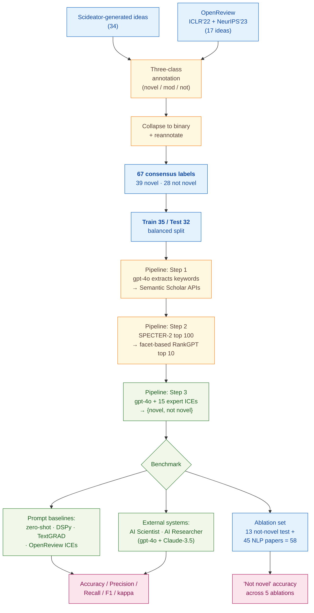

> [!success] **TL;DR**
> The Idea Novelty Checker is a well-engineered RAG pipeline and the ablation cleanly shows that LLM-based re-ranking — especially facet-based — is the load-bearing component. But the headline 0.81 accuracy is built on 32 ideas labeled by the same two authors who built the in-context examples, with no confidence intervals or significance tests, so the "13% higher than prior systems" claim should be read as a promising signal rather than evidence of deployable novelty assessment.

## Structured abstract

> [!info] A plain-language summary built from this paper's discourse-graph nodes. Numbers and findings link back to specific EVD nodes — click any link to drill in.

### Question

Can a computer program automatically tell whether a research idea is genuinely new, by comparing it to past work, in a way that lines up with what expert reviewers say? The authors target the bottleneck in tools that automatically generate research ideas — there is no good way to filter out ideas that already exist in the literature. They build a retrieval-augmented generation (RAG) system — a setup where a language model first looks up relevant papers, then judges novelty against them — and benchmark it head-to-head against zero-shot prompts, two prompt-optimization methods, and two prior systems on the same expert-labeled test set. See [[QUE - Can an LLM-based RAG system reliably evaluate the novelty of scientific ideas compared to expert judgment?]].

### Methods

**Design.** The authors run a within-paper benchmark: they hand-label a small dataset of research ideas, hold out a test split, and compare seven prompting strategies plus two external systems on the same labels — followed by a component-removal ablation that isolates which retrieval steps matter most.

**Tools.** The pipeline is built on **gpt-4o** (OpenAI's general-purpose model, used in August and September 2024) for three roles: keyword extraction, paper re-ranking, and final novelty judgment. Candidate papers come from the **Semantic Scholar Search and Snippet APIs** (a public scholarly search service). **SPECTER-2** (a paper-embedding model from Cohan and colleagues) shortlists candidates by similarity. **RankGPT** (an LLM-based re-ranker from Sun and colleagues) then re-orders them using a *facet-based* scheme — comparing ideas on purpose, mechanism, evaluation, and application. Two prompt-optimizer baselines — **DSPy** and **TextGRAD** — automatically tune the wording of the novelty prompt. The ablation swaps in **o3-mini** (a smaller OpenAI reasoning model) for the final novelty step.

**Procedure.** The authors first ran a formative study where two expert annotators (the first and second authors) labeled 51 ideas under a three-class scheme (novel, moderately novel, not novel), then collapsed labels to binary (novel or not novel) and reannotated. The pipeline then works in three steps. First, gpt-4o extracts keywords and candidate titles from an input idea, queries Semantic Scholar, and pools the results. Second, SPECTER-2 keeps the top 100 by embedding similarity, and RankGPT re-ranks them facet by facet to produce the top 10. Third, gpt-4o judges novelty given the idea, the top 10 papers, and 15 expert-labeled worked examples (called in-context examples — the model is shown solved cases at inference time, with no fine-tuning). The authors compared their checker against zero-shot, Anthropic-prompt-generator, DSPy, TextGRAD, OpenReview-derived examples, AI Scientist (Lu and colleagues), and AI Researcher (Si and colleagues, with both gpt-4o and Claude-3.5-Sonnet). The ablation removed one pipeline component at a time and measured the accuracy drop on the "not novel" class.

**Sample.** The authors sourced **51 research ideas** — 34 generated by Scideator (Radensky and colleagues' idea-generation tool) plus 17 from accepted and rejected OpenReview submissions to ICLR 2022 and NeurIPS 2023. After expert reannotation they kept **67 consensus-labeled examples** (39 novel, 28 not novel), which they split into **35 training and 32 test ideas** with balanced classes. The ablation set added 45 already-published NLP papers as guaranteed-not-novel cases, giving 58 ideas. The unit of analysis is one idea. Two annotators provided all gold labels — the first and second authors of the paper themselves, both NLP and scientific-discovery researchers.

### Findings

- **The full pipeline beat every prompting baseline.** The Idea Novelty Checker reached 0.81 accuracy, 0.79 F1, and Cohen's kappa = 0.59 on the 32-idea test set (F1 runs from 0 to 1 and balances precision against recall, higher is better; Cohen's kappa runs from 0 to 1, where 1.0 means perfect agreement and 0 means chance). The best non-expert baseline (TextGRAD) reached only 0.78 accuracy and 0.76 F1, and zero-shot prompting reached 0.68. Expert-labeled in-context examples — showing the model solved cases drawn from the formative study — drove most of the gain. [[EVD - Idea Novelty Checker achieved accuracy 0.81 F1 0.79 Cohen kappa 0.59 outperforming baselines on expert-annotated dataset - @shahidLiteratureGroundedNoveltyAssessment2025]]

- **An off-the-shelf competing system performed near chance.** AI Scientist's novelty prompt scored 0.47 accuracy, 0.44 F1, and kappa = 0.05 — close to random guessing — when run on the same ideas with the same top-10 papers. The system defaulted to "not novel" on 18 of 32 test ideas (56%) because it could not reach a decision in its iterative loop. AI Researcher fared better with gpt-4o (F1 = 0.75, kappa = 0.52) but collapsed to F1 = 0.56 with Claude-3.5-Sonnet, showing the prompt is highly backbone-sensitive. [[EVD - AI Scientist achieved accuracy 0.47 F1 0.44 kappa 0.05 on same novelty evaluation test set - @shahidLiteratureGroundedNoveltyAssessment2025]]

- **The re-ranker is doing most of the work.** On the 58-idea ablation set, the full pipeline correctly flagged 89.66% of "not novel" ideas. Removing only the facet-based re-ranking (keeping general-relevance RankGPT) crashed accuracy to 13.79%; removing the LLM re-ranker entirely dropped it to 10.34%. Keyword retrieval alone scored 5.17%. The ablation pulls apart two layered effects — having any LLM re-ranker matters far more than facet-awareness on its own, but together they are decisive. [[EVD - Removing facet-based RankGPT re-ranker dropped not-novel prediction accuracy from 89.66% to 13.79% - @shahidLiteratureGroundedNoveltyAssessment2025]]

### Claim supported

These findings support two related claims: [[CLM - Expert-annotated in-context examples significantly improve LLM novelty classification accuracy over zero-shot and prompt-optimized baselines]] and [[CLM - Facet-based LLM re-ranking is critical for identifying the most relevant papers for novelty evaluation]]. For someone considering deploying this in a triage workflow — say, helping an idea-generation tool flag stale ideas before a human looks at them — the result is encouraging but premature: 0.81 accuracy on 32 ideas is suggestive, not confirmatory, and depends on having expert-labeled examples in the same domain.

### Caveats

- **The test set is tiny.** Sixty-seven consensus labels and 32 test ideas leave little room for stable estimates; one or two flipped labels would visibly move every metric. [[CVT - Shahid et al. novelty evaluation used only 67 consensus-labeled examples with a test set of 32 ideas]]

- **The same two people wrote training labels and test labels.** The first and second authors annotated everything, and many test ideas came from the same generator (Scideator) that produced training ideas — so the model is partly being judged on "does it match these specific annotators' view of novelty". [[CVT - Same expert annotators who labeled training examples also classified test ideas introducing potential circularity]]

- **Tiny prompt changes flip the answer.** The authors themselves report that nearly identical prompts produced accuracies ranging from 0 to 0.6, which makes the headline numbers hard to replicate without the exact wording. [[CVT - LLM novelty evaluation is highly sensitive to prompt variations making results difficult to replicate]]

### Methods at a glance

---

## Critical appraisal

> [!info] A risk-of-bias and validity assessment across five domains, synthesized from this paper's discourse-graph nodes. Each domain gets a rating (🟢 Low risk · 🟡 Some concerns · 🔴 High risk) plus a brief, EVD-grounded justification. The TRIPOD-LLM table below covers *reporting compliance*; this section covers *methodological quality*.

| Domain | Rating | Justification |
| --- | :---: | --- |
| **Construct validity** — does the metric actually measure the construct? | 🟡 | Binary novelty collapses a genuinely fuzzy three-class judgment ("novel / moderately novel / not novel") into a yes/no, and Cohen's kappa = 0.59 only barely clears the "moderate agreement" threshold — meaning the gold standard itself is partly a coin flip on hard cases. The authors' deployment framing (triage of generator output) maps better to the "not novel" class, which is exactly what the ablation set targets, but main-table F1 still mixes both classes. |
| **Internal validity** — could the comparison be biased? | 🔴 | The same two annotators wrote both the in-context examples and the test labels, and many test ideas came from the same Scideator generator that produced training ideas — so the system is partly being scored on agreement with two specific people's idea of novelty (see [[CVT - Same expert annotators who labeled training examples also classified test ideas introducing potential circularity]]). The AI Scientist comparison is weakened by its 56% default-to-"not novel" failure rate (18 of 32 ideas), which is a system-design artifact rather than a genuine novelty judgment. |
| **External validity** — do findings generalize? | 🔴 | The 32-idea test set is drawn almost entirely from NLP and machine-learning ideas (Scideator + ICLR/NeurIPS), and the gold labels reflect two researchers in that field. There is no evidence the pipeline transfers to other disciplines, longer ideas, or ideas evaluated by domain experts outside NLP. |
| **Statistical rigor** — appropriate uncertainty + comparisons? | 🔴 | No confidence intervals, no significance tests across the seven prompting baselines and three external systems, and no multiple-comparison correction — yet the headline claim is "approximately 13% higher agreement than existing approaches" on n=32. With a test set this small, a 13-point F1 gap is well within sampling noise, and the paper does not bound it. |
| **Reproducibility** — code, data, determinism? | 🟡 | The authors pledge release of code and data at github.com/simra-shahid/idea_novelty_checker (TRIPOD-LLM 14e ⚠️, 14f ⚠️) but availability at preprint time is not verified. GPT inference parameters (temperature, top_p, seed) are not reported (TRIPOD-LLM 6c ⚠️), and the paper itself documents that nearly identical prompts produced accuracies ranging from 0 to 0.6 (see [[CVT - LLM novelty evaluation is highly sensitive to prompt variations making results difficult to replicate]]) — so even with the prompts published, run-to-run variance is irreducible. |

**Bottom line.** The Idea Novelty Checker is a well-engineered RAG pipeline and the ablation cleanly shows that LLM-based re-ranking — especially facet-based — is the load-bearing component. But the headline 0.81 accuracy is built on 32 ideas labeled by the same two authors who built the in-context examples, with no confidence intervals or significance tests, so the "13% higher than prior systems" claim should be read as a promising signal rather than evidence of deployable novelty assessment. Before this is ready for use in a real idea-triage workflow, future work needs an independent expert panel, a larger and cross-domain test set, and reported uncertainty on every metric.

> [!tip] **Applicable external appraisal frameworks beyond TRIPOD-LLM** (already covered by the table below): **HELM** (Liang et al. 2022) for holistic LLM-evaluation principles · **Datasheets for Datasets** (Gebru et al. 2021) for the evaluation corpus · **Model Cards** (Mitchell et al. 2019) for the LLMs being evaluated · **PROBAST+AI** for the supervised RAG classifier.

---

## TRIPOD-LLM reporting summary

> [!info] Reporting compliance for this paper, mapped to the TRIPOD-LLM checklist (Methods items 5a–15 and Results items 16a–18). Compliance icons: ✅ fully reported · ⚠️ partially reported / unclear · ❌ should be reported but not reported · ➖ not applicable to this study. Item 17 (Performance) is reported per-EVD; see each EVD's `## Other Notes`.

| # | Item | ✓ | Reported in this study |
| --- | --- | :---: | --- |
| **5a** | Data sources | ✅ | Ideas: 34 generated by Scideator (Radensky et al.); 17 from accepted/rejected OpenReview submissions (ICLR'22, NeurIPS'23). Retrieval corpus: Semantic Scholar Search API + Snippet API + recommendations API. OpenReview baseline pool: ~8,156 reviews discussing idea novelty pulled via the OpenReview API. Ablation also adds 45 NLP papers from the literature as already-published (not-novel) ideas. |
| **5b** | Data points + distribution | ✅ | Formative-study labeled set: 67 binary-consensus examples (39 novel / 28 non-novel); train 35 / test 32 with balanced novel/non-novel distribution. Ablation set: 58 ideas (13 'not novel' from test + 45 NLP papers). OpenReview baseline: 20 sampled idea-review pairs (5 used in best setup). |
| **5c** | Date range of data | ❌ | Not explicitly reported. OpenReview submissions drawn from ICLR'22 + NeurIPS'23. Models inferenced August–September 2024; OpenAI training cutoffs not disclosed. |
| **5d** | Pre-processing / quality checks | ⚠️ | Ideas reannotated under a controlled three-class framework (novel / moderately novel / not novel) then collapsed to binary. OpenReview submissions filtered for those discussing idea novelty; reviews "manually selected" for ones evaluating the core idea rather than the entire paper. Idea inputs reformatted with a style-change prompt for cross-system fairness. No automated quality checks reported. |
| **5e** | Missing / imbalanced data | ⚠️ | Train/test split chosen to be balanced (vs. raw 39/28). Ablation deliberately excludes "novel" cases because their classification depends on retrieved papers. AI Scientist's failure-to-decide imputed as "not novel" (system default), which the authors flag as confounding agreement rates. |
| **6a** | LLM name + version | ⚠️ | gpt-4o for LLM_query, LLM_rankgpt, LLM_novelty (used Aug–Sep 2024); o3-mini for novelty in the ablation; Claude-3.5-Sonnet additionally evaluated for the AI Researcher comparison. SPECTER-2 as embedding model. Exact OpenAI snapshot strings (e.g., "gpt-4o-2024-08-06") not specified. |
| **6b** | Development process | ✅ | RAG architecture with three steps (retrieval → two-stage re-rank → in-context novelty classification); no fine-tuning of any LLM. DSPy and TextGRAD prompt-optimizer baselines trained for 12 prompt iterations on a train(25)/validation(10) split; DSPy used 2 bootstrapped examples; in-context-example count tuned (best n=15, random seed 100). |
| **6c** | Inference settings / prompting | ⚠️ | High-level prompt structure described and full TextGRAD-optimized prompts shown in Figures 5–7; exact decoding parameters (temperature, top_p, max tokens, system prompt, seed for LLM calls) not reported. |
| **6d** | Output | ✅ | Binary {novel, not novel} label + free-text reasoning. AI Scientist comparison uses string-matching on "decision made: novel/not novel"; defaults to not-novel on failure. |
| **6e** | Classification thresholds | ✅ | No probability thresholds — categorical label decoded directly from LLM output. Three-class formative-study scheme (novel / moderately novel / not novel) collapsed to binary by treating "moderately novel" as novel for second-round annotation; then binary used downstream. |
| **7a** | Quality metrics | ✅ | Accuracy, precision, recall, F1, Cohen's κ for the binary classification (Table 1). Ablation reports "not novel" accuracy only (Table 2) plus top-10 paper overlap and average rank shift (Table 3). |
| **7b** | Relevance to downstream | ⚠️ | Authors motivate the task as helping researchers triage truly novel from incremental ideas, but no downstream-utility study (e.g., human time savings, false-novel review burden) is reported. |
| **7c** | Outcome definition | ✅ | Binary novelty label (novel iff the idea differs from all retrieved papers in at least one core facet — purpose, mechanism, evaluation — or uniquely combines facets, or applies them to a new application domain). Gold labels = expert consensus from the formative study. |
| **7d** | Subjective interpretation | ⚠️ | Cohen's κ = 0.64 reported for the three-class formative annotation by the two expert authors and 0.68 after restricting to relevant papers and collapsing to binary. No external/blind raters; the same two authors who labeled training examples also produced the test labels. |
| **7e** | Comparison | ✅ | Idea Novelty Checker compared to: zero-shot, Anthropic prompt-generator–refined zero-shot, DSPy (with/without reasoning), TextGRAD, OpenReview-example baseline, AI Scientist (Lu et al.), AI Researcher (Si et al.) with both gpt-4o and Claude-3.5-Sonnet. Ablation compares 5 pipeline variants. |
| **8a** | Annotation guidelines | ⚠️ | Three-class framework described in Section 3 (novel / moderately novel / not novel), then a binary scheme keyed on facet-based novelty (purpose / mechanism / evaluation / unique combination / new application domain). No detailed written annotation manual or code-book released. |
| **8b** | Annotators + IAA | ⚠️ | Two annotators (first + second authors). Cohen's κ = 0.64 (three-class, first round) and 0.68 (binary, second round restricted to relevant papers). 8 disagreements analyzed in second round (4 missed details / 2 differing perceptions / 2 unspecified). |
| **8c** | Annotator background | ⚠️ | Annotators are the first and second authors of the paper (researchers in NLP / scientific-discovery tools). Specific subject-matter expertise per idea topic not detailed. |
| **9a** | Prompt design | ✅ | Manual zero-shot prompt + Anthropic-generator-refined version + DSPy-optimized + TextGRAD-optimized + 12 TextGRAD prompt variants enumerated in Figures 5–7 with validation accuracies. Final novelty prompt incorporates 15 expert in-context examples (idea + papers + class + reasoning). |
| **9b** | Prompt-development data | ✅ | Train/validation split from the formative study (train=25, validation=10, test=32) used for DSPy and TextGRAD optimization; 15 idea-paper pairs (random seed 100) used as in-context examples for the novelty checker. |
| **10** | Summarization | ➖ | Not applicable (classification task, not summarization). |
| **11** | Instruction tuning / alignment | ➖ | No instruction tuning; all LLMs used off-the-shelf via prompting. |
| **12** | Compute | ❌ | Not reported. No GPU/TPU hours, API spend, or wall-clock time disclosed. |
| **13** | Ethical approval | ➖ | Not applicable (no human-subjects data; expert annotations by paper authors). |
| **14a** | Funding | ❌ | Not reported in the paper text. (Affiliations: Microsoft, University of Washington, Allen Institute for AI.) |
| **14b** | Conflicts of interest | ❌ | Not reported. |
| **14c** | Protocol | ❌ | No pre-registered protocol; arXiv preprint only. |
| **14d** | Registration | ➖ | Not applicable (not a clinical study). |
| **14e** | Data availability | ⚠️ | Authors state plan to release expert-collected data at github.com/simra-shahid/idea_novelty_checker (footnote 1); availability at time of preprint not verified. |
| **14f** | Code availability | ⚠️ | Same repository pledged; "All prompts are provided in the anonymised codebase" (footnote 6). |
| **15** | Patient/public involvement | ➖ | Not applicable. |
| **16a** | Flow of data | ✅ | 51 formative-study ideas (34 Scideator + 17 OpenReview) → 67 binary-consensus labels (39 novel / 28 not novel) → 35 train / 32 test. Ablation: 13 not-novel test ideas + 45 NLP-paper not-novel ideas = 58. |
| **16b** | Characteristics | ⚠️ | Sources of ideas described (Scideator, OpenReview ICLR'22 / NeurIPS'23). No further characterisation by topic, length, or generator-model condition. |
| **16c** | Distribution comparison | ➖ | Not applicable (no clinical-outcome subgroup analysis). |
| **16d** | N per analysis | ✅ | Main classification: n=32 test ideas (Table 1). Ablation: n=58 ideas (Table 2). TextGRAD optimisation: train=25 / val=10 / test=32 (Section 6.4 / Figures 5–7). |
| **17** | Performance | (per-EVD) | Reported per-EVD. See each EVD's `## Other Notes` for the EVD-specific accuracy / precision / recall / F1 / κ tables. |
| **18** | LLM updating | ➖ | Not applicable (no model updating reported; gpt-4o snapshot used Aug–Sep 2024 with no retraining). |
