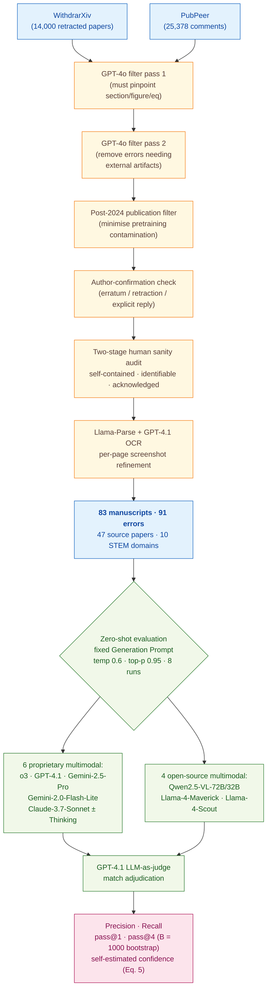

> [!success] **TL;DR**
> SPOT is a careful benchmark and the head-to-head design is fair, but the conclusion that "no current model is dependable for academic error verification" rests on a sample of 91 errors that lean toward author-acknowledged, locatable, math-heavy mistakes. The single-digit precision and near-zero calibration are striking enough that the directional claim — frontier LLMs are not yet trustworthy auto-reviewers — likely survives any reasonable expansion of the benchmark.

## Structured abstract

> [!info] A plain-language summary built from this paper's discourse-graph nodes. Numbers and findings link back to specific EVD nodes — click any link to drill in.

### Question

Can today's best general-purpose AI models read a scientific paper and reliably flag the kinds of mistakes that would normally trigger a correction notice or a retraction? The authors build a small but carefully curated test set of 83 published manuscripts containing 91 author-confirmed errors, then run thirteen frontier multimodal LLMs (large language models that can read both text and images) against it under a single fixed prompt. The headline question is practical: are these models good enough to act as junior co-scientists who catch real errors before a paper goes out? See [[QUE - Can state-of-the-art LLMs reliably detect errors in published scientific manuscripts?]].

### Methods

**Design.** The authors built a new benchmark called SPOT and ran a head-to-head, zero-shot evaluation of thirteen off-the-shelf multimodal LLMs on it, with a separate calibration sub-analysis on the six proprietary models.

**Tools.** SPOT was assembled from two seed sources: WithdrarXiv (a public collection of 14,000 retracted arXiv papers) and PubPeer (an anonymous post-publication peer-review website). The authors used GPT-4o for two automated filtering passes, Llama-Parse plus GPT-4.1 to convert PDFs into clean Markdown plus per-page screenshots, and a custom Streamlit annotation app for the human sanity check. The thirteen evaluated models include six proprietary multimodals — o3 (OpenAI's reasoning model, 2025-04-16), GPT-4.1, Gemini-2.5-Pro, Gemini-2.0-Flash-Lite, Claude-3.7-Sonnet, and Claude-3.7-Sonnet:Thinking — and four open-source ones — Qwen2.5-VL-72B/32B, Llama-4-Maverick, and Llama-4-Scout. GPT-4.1 was reused as an LLM-as-judge (a model that scores another model's outputs) for match adjudication.

**Procedure.** The authors built SPOT in five stages. First, they pulled retraction notices and PubPeer comments from the two seed sources. Second, two GPT-4o filtering passes kept only comments that named a specific section, figure, equation, or table and removed errors that needed external artifacts to verify. Third, they kept only errors the original authors had explicitly confirmed — either through a PubPeer reply admitting the mistake or through a self-retraction. Fourth, two rounds of human review checked that each error was self-contained, identifiable, and explicitly acknowledged. Fifth, Llama-Parse plus GPT-4.1 cleaned up the PDF text and every flagged page got a manual audit. For each (model, paper) pair, the authors ran 8 independent inferences at temperature 0.6 and top-p 0.95, asking each model to play "scientific-rigor auditor" and emit JSON with the location and description of every error. GPT-4.1 then judged whether each predicted error matched a benchmark annotation. Performance metrics include precision, recall, and pass@K (the chance that at least one of K independent runs catches a given error), with K bootstrapped 1000 times from the 8 runs.

**Sample.** WithdrarXiv shrank from 14,000 entries to 1,855 after the first GPT-4o filter and 58 after a post-2024 publication-date filter; PubPeer shrank from 25,378 to 215. After author-confirmation and the two-stage human sanity check, the final SPOT benchmark contained 83 manuscripts with 91 author-confirmed errors drawn from 47 source papers across ten STEM domains. The unit of analysis is the (paper, annotated error) pair. Errors break down into six categories: Equation/Proof (37), Figure Duplication (27), Data Inconsistency (18), Statistical Reporting (4), Reagent Identity (3), and Experiment Setup (2). Severity split: 59 errata and 32 retractions. Human annotators were the paper's own authors plus a second author-led audit group; case-study expert review used "a researcher with related publications or a PhD-trained postdoc" in mathematics and materials science.

### Findings

- **Even the best model misses about four out of five errors.** o3 — OpenAI's reasoning model — topped the leaderboard with 6.1% precision (when it flags an error it is right about 6% of the time), 21.1% recall (it catches roughly 1 in 5 known errors), and 37.8% pass@4 (the chance it catches a given error in at least one of four independent tries). Every other model came in well below o3, and the four open-source models collapsed to near zero — Llama-4-Maverick reached only 0.9% recall, a 20.2-percentage-point gap behind o3 on pass@4. The same Llama-4 model is competitive with o3 on standard benchmarks like MathVista and GPQA-Diamond, so SPOT is uniquely hard for open-source systems. [[EVD - o3 achieved best SPOT performance with 6.1% precision 21.1% recall and 37.8% pass@4 - @sonWhenAICoScientists2025]]

- **No model is good at every error type — reasoning helps with math, hurts on figures.** o3 dominated equation and proof errors (62.6% pass@4) and statistical reporting (88.4% pass@4 on a tiny sample of 4 errors), but scored a flat 0% on figure-duplication errors. Gemini-2.5-Pro showed the same blind spot. Surprisingly, the non-reasoning GPT-4.1 hit 44.4% pass@4 on figure duplication, beating every reasoning model. No model solved a single Experiment Setup error (0/2 across all six proprietary systems). The pattern suggests that reasoning training trades off against visual-similarity detection. [[EVD - o3 achieved 62.6% pass@4 on equation-proof errors while scoring near 0% on figure duplication - @sonWhenAICoScientists2025]]

- **Models cannot tell when they are right.** Across 498 (model × paper) evaluations of the six proprietary models, only two cases reached full self-estimated confidence (where a model catches the error in all 8 of its 8 runs) — and both came from o3. The authors compute confidence as an objective frequency from the 8 runs, not the model's own verbalised certainty, which makes the result harder to dismiss as bluster. The kernel density of confidences peaks near zero for every model, and confidence correlates only weakly with pass@4 — meaning a high confidence score is not a reliable signal that the prediction is correct. A user cannot filter for the rare correct flags. [[EVD - LLM confidence approaches zero across 498 model-instance SPOT evaluations with only 2 full-confidence cases - @sonWhenAICoScientists2025]]

### Claim supported

These findings support two related claims. The strongest is [[CLM - Current LLMs fall far short of requirements for dependable AI-assisted academic error verification]] — at single-digit precision and confidence near zero, no model is close to a tool a journal or co-author could trust to surface real mistakes. The second is [[CLM - Proprietary reasoning models substantially outperform open-source models on scientific error detection]] — the o3-vs-open-source gap on SPOT is wider than on any other benchmark the authors tested. For a researcher considering using one of these models as an automated proof-reader, the practical takeaway is that current systems will miss roughly four out of every five real errors and, when they do flag something, will be wrong about 94% of the time.

### Caveats

- **The benchmark is small and some error types have only a handful of cases.** SPOT contains 83 manuscripts and 91 errors, with as few as 2 examples in the Experiment Setup category and 3 in Reagent Identity. Per-category numbers therefore have very high variance, and cross-model comparisons in those small cells should be read as suggestive rather than definitive. [[CVT - SPOT benchmark comprised only 83 manuscripts with 91 errors limiting statistical power]]

- **Only author-acknowledged errors made it in.** The authors deliberately excluded any error the original authors did not formally admit through an erratum or retraction. This filter raises label quality but probably under-represents the harder, contested, or quietly-buried errors that a deployed verifier would most need to catch. The headline numbers may therefore be optimistic relative to real-world performance. [[CVT - SPOT only included papers with explicitly author-confirmed errors potentially excluding harder-to-detect genuine errors]]

### Methods at a glance

---

## Quality appraisal

> [!info] Risk-of-bias and validity assessment, synthesized from this paper's discourse-graph nodes and grounded in the same paper this page's top trust-signal chips summarize. Covers *methodological quality* — the TRIPOD-LLM table below covers *reporting compliance* instead.
> <dl class="callout-legend">
> <dt>● Low risk</dt><dd>No meaningful threat to this domain identified</dd>
> <dt>◐ Some risk</dt><dd>A real but non-fatal limitation</dd>
> <dt>○ High risk</dt><dd>A significant, unaddressed threat to validity</dd>
> </dl>

| Domain | Rating | Quote |
| --- | :---: | --- |
| **Construct validity**: does the metric actually measure the construct? | 🟢 | *"users concerned about model hallucinations or the impact of unannotated flags should focus on Precision."* `§2.3, p.5`, metrics are explicitly mapped to the user decision they inform |
| **Internal validity**: could the comparison be biased? | 🟡 | *"GPT-4.1 is used to compare predicted error descriptions against benchmark annotations as a similarity check; the LLM does not evaluate the errors' correctness or severity."* `§2.3 n.4, p.4`, but GPT-4.1 judges its own outputs and those of its OpenAI sibling o3, with no inter-rater agreement reported between the judge and the domain experts |
| **External validity**: do findings generalize? | 🔴 | *"we manually validate if remaining flagged issues fulfill three conditions: (1) self-contained, (2) identifiable, and (3) explicitly acknowledged by the original authors."* `§2.1, p.3`, this filter skews the sample toward locatable, author-acknowledged errors |
| **Statistical rigor**: appropriate uncertainty + comparisons? | 🟡 | *"we draw K runs without replacement from the eight, repeat this resampling B = 1000 times, and report the mean and standard deviation of the resulting bootstrap distribution for K ∈ {1, 4}."* `§2.3, p.5`, but no formal significance testing or multiple-comparison correction across the 13 models is reported |
| **Reproducibility**: code, data, determinism? | 🟡 | *"62 (74.7 %) are openly accessible under a CC license; we publicly share our fully preprocessed versions via the Hugging Face Hub."* `Appendix E, p.29`, the remaining 21 manuscripts stay paywalled |
| **Data leakage**: could models have seen this data pretraining? | 🟡 | *"We only select papers published from 2024, minimizing the potential contamination with parametric knowledge during evaluation"* `§1, p.1` |
| **Baseline adequacy**: is there a meaningful floor to beat? | 🔴 | Not reported, no naive or majority-class baseline is compared against the 13 evaluated LLMs |
| **Train/dev/test hygiene**: are data splits kept separate? | 🔴 | Not reported, SPOT is an evaluation-only benchmark with no held-out tuning split described |
| **Multiple-comparisons correction**: controlled for repeated testing? | 🔴 | Not reported, 13 models × 6 error categories × multiple metrics are compared with no stated correction |
| **Human-baseline comparability**: is there a human reference point? | 🟡 | *"A domain expert evaluated each paper, either a researcher with relevant publications or a PhD-trained postdoc in the field. Reviewers are provided the LLM-flagged 'errors' from o3 and Gemini 2.5 Pro alongside the official withdrawal notices."* `§4, p.7` |

**Bottom line.** SPOT is a careful benchmark and the head-to-head design is fair, but the conclusion that "no current model is dependable for academic error verification" rests on a sample of 91 errors that lean toward author-acknowledged, locatable, math-heavy mistakes. The single-digit precision and near-zero calibration are striking enough that the directional claim — frontier LLMs are not yet trustworthy auto-reviewers — likely survives any reasonable expansion of the benchmark. Before any deployment, the field needs a larger SPOT-like corpus that includes contested errors, balanced error categories, and an inter-rater statistic between the LLM judge and human experts.

> [!tip] **Applicable external appraisal frameworks beyond TRIPOD-LLM** (already covered by the table below): **HELM** (Liang et al. 2022) for holistic LLM-evaluation principles · **Datasheets for Datasets** (Gebru et al. 2021) for the evaluation corpus · **Model Cards** (Mitchell et al. 2019) for the LLMs being evaluated

---

## TRIPOD-LLM reporting summary

> [!info] Reporting compliance for this paper, mapped to the TRIPOD-LLM checklist (Title/Abstract/Introduction items 1–4, Methods items 5a–15, Results items 16a–18). TRIPOD-LLM is a clinical-ML guideline being applied here to a non-clinical AI-research benchmark — where an item's own wording says "healthcare context" or "care pathway," it's read as "research-evaluation context" / "research workflow" instead. Item 17 (Performance) is reported per-EVD; see each EVD's `## Other Notes`.
> 

> ●Fully reported
> ◐Partial / unclear
> ○Not reported
> –Not applicable
> 

| # | Item | ✓ | Quote |
| --- | --- | :---: | --- |
| **1** | Title | ✅ | *"When AI Co-Scientists Fail: SPOT-a Benchmark for Automated Verification of Scientific Research"* `Title, p.1` |
| **2** | Abstract | ➖ | Assessed separately under TRIPOD-LLM's own Abstract extension, not scored here |
| **3a** | Background — context + rationale | ✅ | *"their utility in the backward pass of academic verification or as verifiers remains underexplored, a blind spot in which most systems lean on LLM judges [16] without validation on their credibility in reviewing scientific research."* `§1, p.1` |
| **3b** | Background — target population | ✅ | *"we introduce SPOT (Scientific Paper Error Detection), a complex multi-modal academic error verification benchmark, comprising 83 up-to-date manuscripts spanning ten scientific fields"* `§1, p.1` |
| **4** | Objectives | ✅ | *"In this work, we explore a complementary application: using LLMs as verifiers to automate the academic verification of scientific manuscripts."* `Abstract, p.1` |
| **5a** | Data sources | ✅ | *"We source our seed manuscripts from two major repositories"* `§2.1, p.2` |
| **5b** | Data points + distribution | ✅ | *"The final SPOT benchmark comprises 83 manuscripts with 91 annotated errors."* `§2.1, p.3` |
| **5c** | Date range of data | ✅ | *"we filter for papers published after 2024, yielding 58 WITHDRARXIV and 215 PubPeer samples."* `§2.1, p.3` |
| **5d** | Pre-processing / quality checks | ✅ | *"The first retains comment-manuscript pairs that unambiguously pinpoint a specific section, figure, equation, or table"* `§2.1, p.3` |
| **5e** | Missing / imbalanced data | ⚠️ | *"figure-duplication instances initially overwhelmed the dataset, so we filtered based on severity and paper category to prevent a single type from dominating."* `§2.2, p.3` |
| **6a** | LLM name + version | ✅ | *"we evaluate six proprietary models: OpenAI o3, GPT-4.1, Google Gemini 2.5 Pro, Gemini 2.0 Flash Lite, Anthropic Claude 3.7 Sonnet:Thinking, and Claude 3.7 Sonnet and four open models: Qwen 2.5-VL-72B/32B-Instruct, and Llama 4 Maverick/Scout."* `§3, p.5` |
| **6b** | Development process | ➖ | *"We do not train our own models, but prompts and generation configurations for inference are provided in Appendix F."* `NeurIPS Checklist Q6, p.18` |
| **6c** | Inference settings / prompting | ✅ | *"For each model, we adopt the provider's recommended parameters when available; otherwise, we use a sampling temperature of 0.6, top-p of 0.95, a repetition penalty of 1.0, and enforce a minimum of 8 and a maximum of 8192 tokens."* `Appendix F.1, p.30` |
| **6d** | Output | ✅ | *"location": "Section 2.1","* ... *"description": "Claim that 'all X are Y' is ..."* `Appendix F.2, p.32` |
| **6e** | Classification thresholds | ➖ | Not applicable — generative outputs, no probability thresholds; match adjudication is binary via the GPT-4.1 evaluation prompt |
| **7a** | Quality metrics | ✅ | *"We mainly evaluate verification performance through precision, recall, and pass@K."* `§2.3, p.4` |
| **7b** | Relevance to downstream use | ✅ | *"users concerned about model hallucinations or the impact of unannotated flags should focus on Precision."* `§2.3, p.5` |
| **7c** | Outcome definition | ✅ | *"A predicted error is counted as a true positive (TP) only when the model's reported location matches a benchmark annotation and an LLM confirms they indicate the same error."* `§2.3, p.4` |
| **7d** | Subjective interpretation | ⚠️ | *"A domain expert evaluated each paper, either a researcher with relevant publications or a PhD-trained postdoc in the field."* `§4, p.7` — no inter-rater agreement statistic between expert and the GPT-4.1 judge |
| **7e** | Comparison | ✅ | *"Multi-modality ablation for 13 models: recall and pass@4 (in %) are reported as mean (std) over eight independent trials."* `Table 3, p.7` |
| **8a** | Annotation guidelines | ✅ | *"we manually validate if remaining flagged issues fulfill three conditions: (1) self-contained, (2) identifiable, and (3) explicitly acknowledged by the original authors."* `§2.1, p.3` |
| **8b** | Annotators + IAA | ⚠️ | *"with part of the authors as human annotators, we manually validate"* ... *"the second group conducted a comprehensive audit of all annotations to ensure consistent application of these standards."* `§2.1, p.3` — no quantitative inter-annotator agreement (κ/α) reported |
| **8c** | Annotator background | ⚠️ | *"A domain expert evaluated each paper, either a researcher with relevant publications or a PhD-trained postdoc in the field."* `§4, p.7` — background of the main-annotation authors themselves not further specified |
| **9a** | Prompt design | ✅ | *"You are a scientific-rigor auditor. You will receive the parsed contents of a research paper."* `Appendix F.2, p.32` |
| **9b** | Prompt-development data | ❌ | Not reported |
| **10** | Summarization | ➖ | Not applicable — no summarization endpoint evaluated as a primary outcome |
| **11** | Instruction tuning / alignment | ➖ | *"We do not train custom models."* `NeurIPS Checklist Q11, p.20` — off-the-shelf instruction-tuned models evaluated without further alignment |
| **12** | Compute | ⚠️ | *"Our experiments are conducted entirely through APIs."* ... *"Total API expenditures amount to approximately $5,000."* `NeurIPS Checklist Q8, p.19` — no GPU/CPU details since no local inference is run |
| **13** | Ethical approval | ➖ | *"Paper does not involve crowdsourcing nor research with human subjects."* `NeurIPS Checklist Q15, p.21` |
| **14a** | Funding | ❌ | Not reported |
| **14b** | Conflicts of interest | ❌ | Not reported |
| **14c** | Protocol | ❌ | Not reported |
| **14d** | Registration | ➖ | Not applicable — not a registered clinical study |
| **14e** | Data availability | ⚠️ | *"62 (74.7 %) are openly accessible under a CC license; we publicly share our fully preprocessed versions via the Hugging Face Hub."* `Appendix E, p.29` — remaining 21 manuscripts (25.3%) are paywalled and not redistributed |
| **14f** | Code availability | ✅ | *"git clone https://github.com/guijinSON/ai4s_r2.git"* `Appendix E, p.31` |
| **15** | Patient/public involvement | ➖ | Not applicable |
| **16a** | Flow of data | ✅ | *"reducing our pool to 1,855 WITHDRARXIV and 25,378 PubPeer samples."* `§2.1, p.3` |
| **16b** | Characteristics | ✅ | *"76 manuscripts out of 83 contain a single error, six contain two, and one paper has the maximum of three annotated errors."* `§2.2, p.4` |
| **16c** | Distribution comparison | ➖ | Not applicable — no clinical-outcome subgroup comparison |
| **16d** | N per analysis | ✅ | *"With 83 papers and 91 total errors we generate N = 8 independent runs per paper."* `§2.3, p.5` |
| **17** | Performance | `per-EVD` | Reported per-EVD. See each EVD's `## Other Notes`. |
| **18** | LLM updating | ➖ | Not applicable — no model updating reported |
