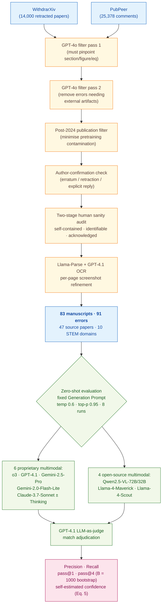

> [!success] **TL;DR**
> SPOT is a careful benchmark and the head-to-head design is fair, but the conclusion that "no current model is dependable for academic error verification" rests on a sample of 91 errors that lean toward author-acknowledged, locatable, math-heavy mistakes. The single-digit precision and near-zero calibration are striking enough that the directional claim — frontier LLMs are not yet trustworthy auto-reviewers — likely survives any reasonable expansion of the benchmark.

## Structured abstract

> [!info] A plain-language summary built from this paper's discourse-graph nodes. Numbers and findings link back to specific EVD nodes — click any link to drill in.

### Question

Can today's best general-purpose AI models read a scientific paper and reliably flag the kinds of mistakes that would normally trigger a correction notice or a retraction? The authors build a small but carefully curated test set of 83 published manuscripts containing 91 author-confirmed errors, then run thirteen frontier multimodal LLMs (large language models that can read both text and images) against it under a single fixed prompt. The headline question is practical: are these models good enough to act as junior co-scientists who catch real errors before a paper goes out? See [[QUE - Can state-of-the-art LLMs reliably detect errors in published scientific manuscripts?]].

### Methods

**Design.** The authors built a new benchmark called **SPOT** and ran a head-to-head, zero-shot evaluation of thirteen off-the-shelf multimodal LLMs on it, with a separate calibration sub-analysis on the six proprietary models.

**Tools.** SPOT was assembled from two seed sources: **WithdrarXiv** (a public collection of 14,000 retracted arXiv papers) and **PubPeer** (an anonymous post-publication peer-review website). The authors used **GPT-4o** for two automated filtering passes, **Llama-Parse** plus **GPT-4.1** to convert PDFs into clean Markdown plus per-page screenshots, and a custom **Streamlit** annotation app for the human sanity check. The thirteen evaluated models include six proprietary multimodals — **o3** (OpenAI's reasoning model, 2025-04-16), GPT-4.1, Gemini-2.5-Pro, Gemini-2.0-Flash-Lite, Claude-3.7-Sonnet, and Claude-3.7-Sonnet:Thinking — and four open-source ones — Qwen2.5-VL-72B/32B, Llama-4-Maverick, and Llama-4-Scout. GPT-4.1 was reused as an LLM-as-judge (a model that scores another model's outputs) for match adjudication.

**Procedure.** The authors built SPOT in five stages. First, they pulled retraction notices and PubPeer comments from the two seed sources. Second, two GPT-4o filtering passes kept only comments that named a specific section, figure, equation, or table and removed errors that needed external artifacts to verify. Third, they kept only errors the original authors had explicitly confirmed — either through a PubPeer reply admitting the mistake or through a self-retraction. Fourth, two rounds of human review checked that each error was self-contained, identifiable, and explicitly acknowledged. Fifth, Llama-Parse plus GPT-4.1 cleaned up the PDF text and every flagged page got a manual audit. For each (model, paper) pair, the authors ran 8 independent inferences at temperature 0.6 and top-p 0.95, asking each model to play "scientific-rigor auditor" and emit JSON with the location and description of every error. GPT-4.1 then judged whether each predicted error matched a benchmark annotation. Performance metrics include precision, recall, and pass@K (the chance that at least one of K independent runs catches a given error), with K bootstrapped 1000 times from the 8 runs.

**Sample.** WithdrarXiv shrank from 14,000 entries to 1,855 after the first GPT-4o filter and 58 after a post-2024 publication-date filter; PubPeer shrank from 25,378 to 215. After author-confirmation and the two-stage human sanity check, the final SPOT benchmark contained **83 manuscripts with 91 author-confirmed errors** drawn from 47 source papers across ten STEM domains. The unit of analysis is the (paper, annotated error) pair. Errors break down into six categories: Equation/Proof (37), Figure Duplication (27), Data Inconsistency (18), Statistical Reporting (4), Reagent Identity (3), and Experiment Setup (2). Severity split: 59 errata and 32 retractions. Human annotators were the paper's own authors plus a second author-led audit group; case-study expert review used "a researcher with related publications or a PhD-trained postdoc" in mathematics and materials science.

### Findings

- **Even the best model misses about four out of five errors.** o3 — OpenAI's reasoning model — topped the leaderboard with 6.1% precision (when it flags an error it is right about 6% of the time), 21.1% recall (it catches roughly 1 in 5 known errors), and 37.8% pass@4 (the chance it catches a given error in at least one of four independent tries). Every other model came in well below o3, and the four open-source models collapsed to near zero — Llama-4-Maverick reached only 0.9% recall, a 20.2-percentage-point gap behind o3 on pass@4. The same Llama-4 model is competitive with o3 on standard benchmarks like MathVista and GPQA-Diamond, so SPOT is uniquely hard for open-source systems. [[EVD - o3 achieved best SPOT performance with 6.1% precision 21.1% recall and 37.8% pass@4 - @sonWhenAICoScientists2025]]

- **No model is good at every error type — reasoning helps with math, hurts on figures.** o3 dominated equation and proof errors (62.6% pass@4) and statistical reporting (88.4% pass@4 on a tiny sample of 4 errors), but scored a flat 0% on figure-duplication errors. Gemini-2.5-Pro showed the same blind spot. Surprisingly, the non-reasoning GPT-4.1 hit 44.4% pass@4 on figure duplication, beating every reasoning model. No model solved a single Experiment Setup error (0/2 across all six proprietary systems). The pattern suggests that reasoning training trades off against visual-similarity detection. [[EVD - o3 achieved 62.6% pass@4 on equation-proof errors while scoring near 0% on figure duplication - @sonWhenAICoScientists2025]]

- **Models cannot tell when they are right.** Across 498 (model × paper) evaluations of the six proprietary models, only two cases reached full self-estimated confidence (where a model catches the error in all 8 of its 8 runs) — and both came from o3. The authors compute confidence as an objective frequency from the 8 runs, not the model's own verbalised certainty, which makes the result harder to dismiss as bluster. The kernel density of confidences peaks near zero for every model, and confidence correlates only weakly with pass@4 — meaning a high confidence score is not a reliable signal that the prediction is correct. A user cannot filter for the rare correct flags. [[EVD - LLM confidence approaches zero across 498 model-instance SPOT evaluations with only 2 full-confidence cases - @sonWhenAICoScientists2025]]

### Claim supported

These findings support two related claims. The strongest is [[CLM - Current LLMs fall far short of requirements for dependable AI-assisted academic error verification]] — at single-digit precision and confidence near zero, no model is close to a tool a journal or co-author could trust to surface real mistakes. The second is [[CLM - Proprietary reasoning models substantially outperform open-source models on scientific error detection]] — the o3-vs-open-source gap on SPOT is wider than on any other benchmark the authors tested. For a researcher considering using one of these models as an automated proof-reader, the practical takeaway is that current systems will miss roughly four out of every five real errors and, when they do flag something, will be wrong about 94% of the time.

### Caveats

- **The benchmark is small and some error types have only a handful of cases.** SPOT contains 83 manuscripts and 91 errors, with as few as 2 examples in the Experiment Setup category and 3 in Reagent Identity. Per-category numbers therefore have very high variance, and cross-model comparisons in those small cells should be read as suggestive rather than definitive. [[CVT - SPOT benchmark comprised only 83 manuscripts with 91 errors limiting statistical power]]

- **Only author-acknowledged errors made it in.** The authors deliberately excluded any error the original authors did not formally admit through an erratum or retraction. This filter raises label quality but probably under-represents the harder, contested, or quietly-buried errors that a deployed verifier would most need to catch. The headline numbers may therefore be optimistic relative to real-world performance. [[CVT - SPOT only included papers with explicitly author-confirmed errors potentially excluding harder-to-detect genuine errors]]

### Methods at a glance

---

## Critical appraisal

> [!info] A risk-of-bias and validity assessment across five domains, synthesized from this paper's discourse-graph nodes. Each domain gets a rating (🟢 Low risk · 🟡 Some concerns · 🔴 High risk) plus a brief, EVD-grounded justification. The TRIPOD-LLM table below covers *reporting compliance*; this section covers *methodological quality*.

| Domain                                                                   | Rating | Justification                                                                                                                                                                                                                                                                                                                                                                                                       |
| ------------------------------------------------------------------------ | :----: | ------------------------------------------------------------------------------------------------------------------------------------------------------------------------------------------------------------------------------------------------------------------------------------------------------------------------------------------------------------------------------------------------------------------- |
| **Construct validity** — does the metric actually measure the construct? |   🟢   | The authors map metrics to user role explicitly (precision for users worried about review overhead, recall for comprehensive coverage) and add pass@K plus a frequency-derived confidence estimate. The objective per-error confidence (8-run success rate via Eq. 5) is harder to game than verbalised self-confidence and tightly tracks the deployment construct of "would I trust this flag?".                  |
| **Internal validity** — could the comparison be biased?                  |   🟡   | All models share one fixed Generation Prompt, one match-adjudication judge (GPT-4.1), and the same 8-run protocol — a clean head-to-head. But GPT-4.1 judges its own outputs and those of its OpenAI sibling o3, with no inter-rater agreement reported between GPT-4.1 and the domain experts (TRIPOD 7d ⚠️). The post-2024 publication filter mitigates but cannot fully rule out training-data contamination.    |
| **External validity** — do findings generalize?                          |   🔴   | Two large constraints. (1) SPOT only contains errors the original authors explicitly admitted via erratum or retraction (see [[CVT - SPOT only included papers with explicitly author-confirmed errors potentially excluding harder-to-detect genuine errors]]) — a sample skewed toward mathematically clean, locatable mistakes. (2) Three of the six error categories have ≤4 examples, so per-category claims about model strengths and weaknesses do not generalize past the specific cases tested. |
| **Statistical rigor** — appropriate uncertainty + comparisons?           |   🟡   | Pass@K bootstrapped 1000 times with mean ± std reported, and 8 independent runs per (model, paper) is generous. But there is no formal significance testing across the 13 models × 6 categories, no multiple-comparison correction, and the 2 / 3 / 4-instance categories have variances large enough that any "best model" claim within them is essentially anecdotal — see [[CVT - SPOT benchmark comprised only 83 manuscripts with 91 errors limiting statistical power]]. |
| **Reproducibility** — code, data, determinism?                           |   🟡   | Generation and Evaluation prompts are reproduced verbatim, sampling parameters are reported, and 62 of 83 manuscripts (74.7%) are openly redistributed via Hugging Face under CC license. But 21 manuscripts remain paywalled (TRIPOD 14e ⚠️), funding and conflicts are not declared (14a/14b ❌), and proprietary API endpoints (o3, GPT-4.1, Gemini-2.5-Pro) are floating model versions whose behaviour can drift between runs. |

**Bottom line.** SPOT is a careful benchmark and the head-to-head design is fair, but the conclusion that "no current model is dependable for academic error verification" rests on a sample of 91 errors that lean toward author-acknowledged, locatable, math-heavy mistakes. The single-digit precision and near-zero calibration are striking enough that the directional claim — frontier LLMs are not yet trustworthy auto-reviewers — likely survives any reasonable expansion of the benchmark. Before any deployment, the field needs a larger SPOT-like corpus that includes contested errors, balanced error categories, and an inter-rater statistic between the LLM judge and human experts.

> [!tip] **Applicable external appraisal frameworks beyond TRIPOD-LLM** (already covered by the table below): **HELM** (Liang et al. 2022) for holistic LLM-evaluation principles · **Datasheets for Datasets** (Gebru et al. 2021) for the evaluation corpus · **Model Cards** (Mitchell et al. 2019) for the LLMs being evaluated

---

## TRIPOD-LLM reporting summary

> [!info] Reporting compliance for this paper, mapped to the TRIPOD-LLM checklist (Methods items 5a–15 and Results items 16a–18). Compliance icons: ✅ fully reported · ⚠️ partially reported / unclear · ❌ should be reported but not reported · ➖ not applicable to this study. Item 17 (Performance) is reported per-EVD; see each EVD's `## Other Notes`.

| # | Item | ✓ | Reported in this study |
| --- | --- | :---: | --- |
| **5a** | Data sources | ✅ | Two seed repositories: WithdrarXiv (14,000 retracted-paper dataset) and PubPeer (anonymous post-publication peer-review). Authors briefly attempted bioRxiv/medRxiv but dropped them due to low yield. |
| **5b** | Data points + distribution | ✅ | Final SPOT benchmark: 83 manuscripts × 91 author-confirmed errors from 47 paper sources. Mean tokens/manuscript 12,887 (std 7,421; max/min 46,441/1,207). Mean images/manuscript 17.5 (std 20.1; max/min 80/0). Six error categories: Equation/Proof (37), Figure Duplication (27), Data Inconsistency (18), Statistical Reporting (4), Reagent Identity (3), Experiment Setup (2). Severity: 59 errata vs. 32 retractions. Ten domains (Mathematics, Physics, Biology, Chemistry, Materials Science, Medicine, Environmental Science, Engineering, Computer Science, Multidisciplinary). |
| **5c** | Date range of data | ✅ | Authors filter for papers "published from 2024 onward" to minimise contamination against parametric knowledge; corpus dates concentrate in 2024 with ten papers from 2025 and three pre-2023 retained because their first error notices appeared in March 2024 (Appendix E, Figure 19). |
| **5d** | Pre-processing / quality checks | ✅ | Five-stage pipeline: (1) seed collection from WithdrarXiv + PubPeer; (2) two GPT-4o (gpt-4o-2024-08-06) automated filtering passes — first retains comments unambiguously pinpointing a section/figure/equation/table, second removes errors requiring external artifacts; (3) author-confirmation validation (PubPeer responses or WithdrarXiv self-retractions); (4) two-stage human sanity check against three conditions (self-contained, identifiable, explicitly acknowledged); (5) Llama-Parse + GPT-4.1 OCR refinement followed by manual audit of every flagged page. |
| **5e** | Missing / imbalanced data | ⚠️ | Heavy class imbalance acknowledged (37 Equation/Proof vs. 2 Experiment Setup); authors filtered figure-duplication instances "based on severity and paper category to prevent a single type from dominating" but did not algorithmically rebalance. API call failures or token-limit cutoffs marked incorrect (each call retried up to 3 times). |
| **6a** | LLM name + version | ✅ | Six proprietary multimodal models: o3 (2025-04-16), GPT-4.1 (2025-04-14), Gemini-2.5-Pro (preview-03-25), Gemini-2.0-Flash-Lite (001), Claude-3.7-Sonnet:Thinking (20250219:Think), Claude-3.7-Sonnet (20250219). Four open-source: Qwen2.5-VL-72B/32B-Instruct, Llama-4-Maverick, Llama-4-Scout. Text-only ablation adds DeepSeek-R1, DeepSeek-V3 (0324), Qwen3-235B-A22B. Pipeline LLMs: GPT-4o (gpt-4o-2024-08-06) for filtering; GPT-4.1 for OCR refinement and as evaluation judge; Llama-Parse for initial PDF parsing. |
| **6b** | Development process | ➖ | No model training. Authors explicitly state: "We do not train our own models" (NeurIPS checklist Q6). |
| **6c** | Inference settings / prompting | ✅ | Generation Prompt and Evaluation Prompt provided verbatim in Appendix F. Sampling temperature 0.6, top-p 0.95, repetition penalty 1.0, min 8 / max 8192 output tokens; provider-recommended defaults used when available. o4-mini reasoning effort varied across low/medium/high in the test-time-scaling ablation. All models accessed via APIs (OpenRouter as fallback); each call retried up to 3 times. |
| **6d** | Output | ✅ | Structured JSON: `{"has_error": <bool>, "errors": [{"location": "<Section/Figure/Equation/Table id>", "description": "<text>"}]}` preceded by `<analysis>` walkthrough; full prompt template in Appendix F.2. |
| **6e** | Classification thresholds | ➖ | Not applicable — generative outputs, no probability thresholds. Match adjudication binary via GPT-4.1 evaluation prompt. |
| **7a** | Quality metrics | ✅ | Precision, Recall, pass@1, pass@4 (mean ± std over 8 independent runs; pass@K bootstrapped 1000 times drawing K runs without replacement). Calibration assessed via mean reported confidence vs. pass@4. |
| **7b** | Relevance to downstream | ✅ | Authors explicitly map metrics to user role: precision for users worried about hallucination/review overhead; recall for users wanting comprehensive coverage. Confidence-calibration analysis frames whether outputs can be trusted in practice. |
| **7c** | Outcome definition | ✅ | TP defined precisely: predicted error counts only when (a) reported location matches a benchmark annotation AND (b) GPT-4.1 confirms the descriptions indicate the same error. FP = non-matching predictions; FN = annotations the model missed. |
| **7d** | Subjective interpretation | ⚠️ | Match adjudication delegated to GPT-4.1 (LLM-as-judge); authors note GPT-4.1 "does not evaluate the errors' correctness or severity." Domain-expert case studies (mathematics, materials science) provide qualitative validation but no inter-rater agreement statistic between expert and GPT-4.1 judge. |
| **7e** | Comparison | ✅ | 13 models compared head-to-head on multimodal protocol; same 6 models compared on text-only subset (48 instances) plus 3 unimodal LLMs (DeepSeek-R1/V3, Qwen3-235B-A22B). Cross-benchmark comparison (Figure 3) places o3 vs. Llama-4-Maverick on MathVista, MMLU-Pro, GPQA-Diamond, MMMU, HLE, SPOT. Test-time-scaling ablation on o4-mini (low/med/high reasoning effort). Long-context vs. segment-only ablation on 36 instances (Figure 9). |
| **8a** | Annotation guidelines | ✅ | Annotators verified each flagged issue against three conditions — self-contained, identifiable, explicitly author-acknowledged. Streamlit annotation app (figure 20) with six guided questions per error, source link, severity proxy (erratum vs. retraction). Sample platform image in Appendix E (Figure 21). |
| **8b** | Annotators + IAA | ⚠️ | Two-stage process: "part of the authors as human annotators" performed first-pass validation; a "second group conducted a comprehensive audit … to ensure consistent application of these standards." Disputed cases referred back to original paper authors. No quantitative IAA (κ, α) reported. |
| **8c** | Annotator background | ⚠️ | Annotators are co-authors of the paper; for the Case Study expert review, "either a researcher with related publications or a PhD-trained postdoc in the field" reviewed mathematics and materials-science papers. Other domain backgrounds not enumerated. |
| **9a** | Prompt design | ✅ | Single, fixed Generation Prompt (scientific-rigor auditor persona; explicit JSON output schema; analysis-then-response structure) and single Evaluation Prompt (LLM-as-judge match adjudication). Both reproduced verbatim in Appendix F.2. No prompt-engineering search reported. |
| **9b** | Prompt-development data | ❌ | Not reported how the prompts were iteratively developed or piloted. |
| **10** | Summarization | ➖ | Not applicable. |
| **11** | Instruction tuning / alignment | ➖ | Not applicable — authors evaluate off-the-shelf instruction-tuned models without further alignment. |
| **12** | Compute | ⚠️ | No GPU/CPU details; total API expenditure reported as "approximately $5,000" (NeurIPS checklist Q8). Llama-4-Maverick (402B) explicitly noted as too large to host locally. |
| **13** | Ethical approval | ➖ | Not applicable (no human-subjects data; analysis on published manuscripts). NeurIPS Q15 (IRB) marked NA. |
| **14a** | Funding | ❌ | Not reported in main text or appendices. |
| **14b** | Conflicts of interest | ❌ | Not reported. |
| **14c** | Protocol | ❌ | No pre-registered protocol. |
| **14d** | Registration | ➖ | Not applicable (not a clinical study). |
| **14e** | Data availability | ⚠️ | SPOT-MetaData released at huggingface.co/datasets/amphora/SPOT-MetaData. Of 83 manuscripts, 62 (74.7%) openly shared via Hugging Face under CC license; remaining 21 (25.3%) paywalled and not redistributed (preprocessing pipeline released so others can regenerate). |
| **14f** | Code availability | ✅ | Streamlit annotation app at github.com/guijinSON/ai4s_r2; preprocessing pipeline + benchmark "provided through supplementary materials" (NeurIPS Q5). |
| **15** | Patient/public involvement | ➖ | Not applicable. |
| **16a** | Flow of data | ✅ | Pipeline yields documented stage-by-stage: WithdrarXiv 14,000 → 1,855 (filter 1) → 58 (post-2024 filter); PubPeer 25,378 → 215 (post-2024 filter). After author-confirmation + sanity check → final 83 manuscripts / 91 errors. |
| **16b** | Characteristics | ✅ | Per-paper token/image distributions in Table 1; error-by-domain bar chart in Figure 2; severity split (errata 59 / retractions 32); 76/83 papers contain a single error, 6 contain two, 1 contains three. |
| **16c** | Distribution comparison | ➖ | Not applicable (no patient subgroup analysis). Cross-domain and cross-error-category breakdowns reported in Tables 4–13 (per-model detailed results). |
| **16d** | N per analysis | ✅ | Main multimodal eval: 83 papers × 8 runs = 664 runs/model. Multimodal vs. text-only ablation: 48 instances. Long-context ablation: 36 instances (Equation/Proof excluded). Test-time scaling: 3 independent trials per o4-mini reasoning level. |
| **17** | Performance | (per-EVD) | Reported per-EVD. See each Son EVD's `## Other Notes` for the EVD-specific precision / recall / pass@K / confidence numbers. |
| **18** | LLM updating | ➖ | Not applicable (off-the-shelf models, no updating reported). |
