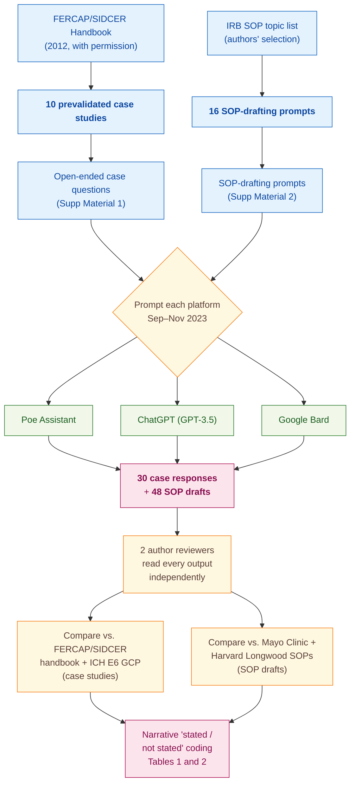

> [!success] **TL;DR**
> The paper is best read as a case-report-style proof of concept: three popular chatbots can produce plausible IRB outputs but quietly drop high-stakes details (the quorum rule, the conditional post-trial-access logic). Before any of these tools is used to prescreen real protocols, the field needs a quantitative rubric, blinded inter-rater agreement, larger and more diverse case banks, and tests against current frontier models — none of which this study provides.

## Structured abstract

> [!info] A plain-language summary built from this paper's discourse-graph nodes. Numbers and findings link back to specific EVD nodes — click any link to drill in.

### Question

Can off-the-shelf chatbots stand in for a member of an Institutional Review Board (IRB) — the human committee that reviews the ethics of clinical research — and can they draft the standard operating procedures (SOPs) that govern how IRBs run? The authors prompt three popular AI platforms with 10 prevalidated ethics case studies and 16 SOP-writing tasks, then compare the answers to two well-known reference SOPs and the international good-clinical-practice rulebook. See [[QUE - Can AI platforms emulate IRB member decision-making and draft standard operating procedures for ethical review?]].

### Methods

**Design.** The authors ran a single cross-sectional observational study between September and November 2023, in which three off-the-shelf AI platforms answered the same fixed set of ethics case studies and SOP-drafting prompts, with two human authors then qualitatively comparing the outputs against published gold-standard references.

**Tools.** The three AI platforms were Poe Assistant, ChatGPT (running on the GPT-3.5 model architecture from OpenAI), and Google Bard. The case studies came from the FERCAP/SIDCER Handbook of Case Studies on Ethical Issues in Health Research — a 2012 training resource published by two regional networks of ethics committees in Asia and the Western Pacific. SOP outputs were graded against the publicly available Mayo Clinic IRB Policy Manual (2023) and the Harvard Longwood Medical Area SOPs (2023). The international clinical-research rulebook ICH E6 — short for "International Council for Harmonisation, guideline E6 on Good Clinical Practice" — served as the second normative reference.

**Procedure.** The authors first obtained permission from FERCAP and SIDCER to use the 10 case studies. They then typed the open-ended questions attached to each case into each of the three platforms and saved the free-text replies. Separately, they used a second set of prompts (provided in Electronic Supplementary Material 2) to ask each platform to draft an SOP for each of 16 IRB-relevant topics — for example, how to handle conflicts of interest, when a study can be exempted from review, or how to monitor a clinical trial site. Two authors then independently read every output and checked it against the FERCAP/SIDCER handbook plus ICH E6 (for cases) or against the Mayo Clinic and Harvard SOPs (for drafts). Disagreements were resolved by discussion. The authors recorded results as narrative "stated or not stated" entries in Tables 1 and 2 — they did not compute any accuracy score, F1, or inter-rater agreement statistic.

**Sample.** The unit of analysis is one AI response. Ten case studies times three platforms produced 30 case responses, and 16 SOP topics times three platforms produced 48 SOP drafts. No platform-response was excluded. The two human reviewers were the two paper authors — one a Professor of Pharmacology and Therapeutics with prior IRB service, the other a Specialist Dentist; both have published in evidence-based medicine.

### Findings

- **All three chatbots produced an on-topic answer for every case.** Across the 10 FERCAP/SIDCER case studies, each of Poe Assistant, ChatGPT, and Google Bard returned a coherent reply that engaged the ethical issues at hand — covering GCP violations, IRB shortcomings, conflicts of interest, undue inducements, vulnerability, serious adverse event reporting, and expedited-review eligibility. Importantly, "responded successfully" means on-topic, not correct: Table 1 still flagged nine distinct domains in which at least one platform missed a GCP-relevant sub-issue. [[EVD - Three AI platforms responded correctly to all 10 IRB case study queries - @sridharanAssessingDecisionMakingCapabilities2024]]

- **Every chatbot wrote SOPs that hit the standard skeleton.** All 48 drafts contained the five fundamental SOP sections: purpose, scope, definitions, procedures, and responsibilities. The wording differed but the core content was strikingly similar across platforms. Table 2 captured seven SOP topics where the platforms diverged in clinically meaningful ways — for example, on conflict-of-interest handling, Poe Assistant said the conflicted member could still join the discussion (only barred from voting), while ChatGPT and Bard correctly required the conflicted member to leave the room. [[EVD - AI platforms drafted SOPs covering fundamental sections with variations across platforms - @sridharanAssessingDecisionMakingCapabilities2024]]

- **No chatbot mentioned the quorum rule for full board reviews.** A core IRB rule — that an initial protocol cannot be reviewed at a full board meeting unless a minimum number of members are present, called a quorum — was missing from all three SOPs for "management of initial protocol submissions." Both Mayo Clinic and Harvard Longwood SOPs require it. The same blind spot showed up in the conflict-of-interest section, where none of the three platforms mentioned that a conflicted member should not be counted toward the quorum. [[EVD - None of three AI platforms recognized quorum requirement for initial proposal review - @sridharanAssessingDecisionMakingCapabilities2024]]

- **Every chatbot fumbled the post-trial-access case.** Case Study 10 asked when a sponsor must provide post-trial access to an investigational herbal medicine. The expected GCP-grounded answer is conditional: post-trial access is owed when the intervention has been shown beneficial, but for an unproven herbal product the obligation does not attach. Zero of the three platforms surfaced that conditional logic. This was the only case (of 10) in which all three platforms failed simultaneously, making it the paper's flagship failure mode. [[EVD - All AI platforms failed to address post-trial herbal medicine access in case study 10 - @sridharanAssessingDecisionMakingCapabilities2024]]

### Claim supported

Together, these findings support the broader claim that [[CLM - AI tools can augment IRB decision-making and improve review efficiency but cannot replace human oversight]]. For an IRB chair considering using one of these chatbots as a prescreening assistant, the practical takeaway is that the tools will reliably draft a plausible-looking SOP or case response, but a trained human reviewer still has to catch the structural gaps — the quorum rule, the conditional GCP logic, the COI quorum exclusion — that the models silently omit.

### Caveats

- **Three platforms and ten cases is a thin slice.** The benchmark covers only Poe Assistant, ChatGPT (GPT-3.5), and Google Bard against 10 prevalidated case studies from a single 2012 handbook. The authors describe the work as a preliminary attempt; results may not transfer to newer models (GPT-4, Claude, Gemini) or to live IRB scenarios drawn from local jurisdictions. [[CVT - Study used only three AI platforms evaluated on ten case studies limiting generalizability of IRB capability findings]]

### Methods at a glance

---

## Critical appraisal

> [!info] A risk-of-bias and validity assessment across five domains, synthesized from this paper's discourse-graph nodes. Each domain gets a rating (🟢 Low risk · 🟡 Some concerns · 🔴 High risk) plus a brief, EVD-grounded justification. The TRIPOD-LLM table below covers *reporting compliance*; this section covers *methodological quality*.

| Domain                                                                   | Rating | Justification                                                                                                                                                                                                                                                                                                                                                                                                       |
| ------------------------------------------------------------------------ | :----: | ------------------------------------------------------------------------------------------------------------------------------------------------------------------------------------------------------------------------------------------------------------------------------------------------------------------------------------------------------------------------------------------------------------------- |
| **Construct validity** — does the metric actually measure the construct? |   🔴   | The paper reports "stated / not stated" tallies and a narrative "successfully responded" judgment, with no quantitative rubric, no per-sub-issue scoring, and no operational definition of correctness. The headline "trio of AI platforms successfully responded to queries from all case studies" conflates on-topic engagement with GCP-correct reasoning — the very property an IRB-augmentation tool needs.   |
| **Internal validity** — could the comparison be biased?                  |   🟡   | Two authors independently assessed every output against published gold-standard references (FERCAP/SIDCER handbook, ICH E6, Mayo Clinic and Harvard SOPs), which is a reasonable check. But the FERCAP/SIDCER handbook has been publicly available since 2012, so its expected answers may have been ingested into the training data of all three platforms — a possible leakage path the authors do not address.  |
| **External validity** — do findings generalize?                          |   🔴   | Three platforms (Poe, GPT-3.5, Bard), 10 case studies from a single 2012 handbook, 16 author-chosen SOP topics, two author-reviewers from a single institution — see [[CVT - Study used only three AI platforms evaluated on ten case studies limiting generalizability of IRB capability findings]]. Findings cannot be assumed to transfer to GPT-4-class models, to non-FERCAP cases, or to local IRB regulations. |
| **Statistical rigor** — appropriate uncertainty + comparisons?           |   🔴   | No quantitative metrics, no confidence intervals, no significance tests, no inter-rater agreement reported. Cross-platform differences are described qualitatively in Table 2 with no test for whether the patterns are stable or chance-level. With n = 3 platforms × 10 cases there would be little power for inferential statistics anyway, but this also means the paper cannot rank the platforms.             |
| **Reproducibility** — code, data, determinism?                           |   🟡   | Prompts and full outputs are released as Electronic Supplementary Material 1–4, which is a real strength for a 2024 LLM paper. But specific model snapshots, dates of API calls, temperature, and other inference parameters are not disclosed (TRIPOD-LLM 6a ⚠️, 6c ❌), so the exact outputs are not re-derivable, and floating-version models like Bard make even approximate reruns hard.                      |

**Bottom line.** The paper is best read as a case-report-style proof of concept: three popular chatbots can produce plausible IRB outputs but quietly drop high-stakes details (the quorum rule, the conditional post-trial-access logic). Before any of these tools is used to prescreen real protocols, the field needs a quantitative rubric, blinded inter-rater agreement, larger and more diverse case banks, and tests against current frontier models — none of which this study provides.

> [!tip] **Applicable external appraisal frameworks beyond TRIPOD-LLM** (already covered by the table below): **MI-CLAIM** (Norgeot et al. 2020) for clinical-AI minimum information · **MINIMAR** (Hernandez-Boussard et al. 2020) for medical-AI reporting · **PROBAST+AI** (Wolff et al. 2019 base; AI extension in development) for prediction-model risk of bias

---

## TRIPOD-LLM reporting summary

> [!info] Reporting compliance for this paper, mapped to the TRIPOD-LLM checklist (Methods items 5a–15 and Results items 16a–18). Compliance icons: ✅ fully reported · ⚠️ partially reported / unclear · ❌ should be reported but not reported · ➖ not applicable to this study. Item 17 (Performance) is reported per-EVD; see each EVD's `## Other Notes`.

| # | Item | ✓ | Reported in this study |
| --- | --- | :---: | --- |
| **5a** | Data sources | ✅ | 10 prevalidated case studies from the FERCAP/SIDCER Handbook of Case Studies on Ethical Issues in Health Research (FERCAP/SIDCER, 2012); 16 prompted IRB SOP topics. Reference SOPs: Mayo Clinic IRB Policy Manual (2023) and Harvard Longwood Medical Area SOPs (2023). Normative reference: ICH E6 GCP guidelines. |
| **5b** | Data points + distribution | ⚠️ | 10 case studies × 3 platforms = 30 case responses; 16 SOP topics × 3 platforms = 48 SOP drafts. Per-case / per-SOP word counts, response lengths, or topic distributions not reported. |
| **5c** | Date range of data | ⚠️ | LLM-prompting period reported as September–November 2023. Training-data cutoffs of Poe Assistant, ChatGPT (GPT-3.5), and Google Bard not disclosed. FERCAP/SIDCER handbook published 2012. |
| **5d** | Pre-processing / quality checks | ❌ | No prompt preprocessing, output normalization, or quality-screening procedure described. |
| **5e** | Missing / imbalanced data | ➖ | Not applicable — all 30 case responses and 48 SOP drafts were obtained successfully; no missing-data handling required. |
| **6a** | LLM name + version | ⚠️ | Three platforms named: Poe Assistant©, ChatGPT© ("based on the GPT-3.5 architecture developed by OpenAI"), Google Bard©. Specific model versions / snapshot dates / API endpoints not disclosed. |
| **6b** | Development process | ➖ | Not applicable — off-the-shelf consumer LLMs evaluated as-is; no fine-tuning or development by authors. |
| **6c** | Inference settings / prompting | ❌ | Inference parameters (temperature, top_p, max tokens, system prompt, seed, single vs. multi-turn) not reported. Prompts themselves provided in Electronic Supplementary Materials 1 and 2 but not in main text. |
| **6d** | Output | ✅ | Free-text natural-language responses (case-study answers + drafted SOPs). Full outputs provided in Electronic Supplementary Materials 3 and 4. |
| **6e** | Classification thresholds | ➖ | Not applicable — no probabilistic / classification model; outputs are free-text. |
| **7a** | Quality metrics | ❌ | No quantitative metrics (accuracy, F1, BLEU, ROUGE, rubric scores, etc.) computed. Findings reported as narrative "stated / not stated" comparisons in Tables 1 and 2. |
| **7b** | Relevance to downstream | ⚠️ | Authors argue qualitative coverage is the relevant outcome for IRB decision-support; no formal downstream-utility analysis (e.g., review time saved, decision-quality change). |
| **7c** | Outcome definition | ⚠️ | Outcome implicit: whether the AI output addresses each ethical sub-issue called out by the FERCAP/SIDCER handbook / ICH E6 GCP. No explicit operational definition or scoring rubric. |
| **7d** | Subjective interpretation | ⚠️ | Two authors independently assessed outputs and verified against handbook + ICH E6, but no inter-rater agreement metric (κ, %-agreement) is reported, and no reconciliation procedure is described. |
| **7e** | Comparison | ✅ | Three-way comparison across Poe Assistant, ChatGPT, and Google Bard, plus comparison of SOP drafts against Mayo Clinic and Harvard Longwood reference SOPs. No statistical test of differences. |
| **8a** | Annotation guidelines | ❌ | No annotation rubric, codebook, or scoring guideline reported for the "stated / not stated" coding in Tables 1–2. |
| **8b** | Annotators + IAA | ⚠️ | Two annotators (the two authors); independent assessment stated, but no IAA, no disagreement-resolution procedure, and no per-rater results reported. |
| **8c** | Annotator background | ⚠️ | Authors are a Professor of Pharmacology & Therapeutics with prior IRB service (KS) and a Specialist Dentist (GS), both with publications in evidence-based medicine. Specific IRB / GCP credentials and years of relevant experience not formally tabulated. |
| **9a** | Prompt design | ⚠️ | Prompts described as "open-ended questions" from the FERCAP/SIDCER handbook (case studies) and "specific prompts" for SOPs; full text in Supplementary Materials 1 and 2. No prompt-engineering iteration, no system prompt, no few-shot examples disclosed. |
| **9b** | Prompt-development data | ❌ | No held-out prompt-development set; case studies appear to be both prompt source and evaluation set. |
| **10** | Summarization | ➖ | Not applicable — no summarization task. |
| **11** | Instruction tuning / alignment | ➖ | Not applicable — off-the-shelf models, no fine-tuning. |
| **12** | Compute | ❌ | Not reported. |
| **13** | Ethical approval | ➖ | Authors state ethics committee approval was not necessary "Due to the nature of the study" (no human subjects). |
| **14a** | Funding | ✅ | "The authors received no financial support for the research, authorship, and/or publication of this article." |
| **14b** | Conflicts of interest | ✅ | "The authors declared no actual or potential conflicts of interest." |
| **14c** | Protocol | ❌ | No pre-specified protocol referenced. |
| **14d** | Registration | ➖ | Not applicable (not a clinical study). |
| **14e** | Data availability | ⚠️ | Case-study details (Supp 1), prompts (Supp 2), full case-study outputs (Supp 3), and SOP outputs (Supp 4) provided as supplementary material. No structured public dataset / repository. |
| **14f** | Code availability | ❌ | No code reported (manual prompting workflow; nothing to release). |
| **15** | Patient/public involvement | ➖ | Not applicable. |
| **16a** | Flow of data | ⚠️ | Implicit: 10 cases × 3 platforms and 16 SOPs × 3 platforms; no formal flow diagram, no exclusions reported. |
| **16b** | Characteristics | ⚠️ | Case studies enumerated by title (Role of REC, Emergency Room Research, Scientific Soundness, COI, Healthy Volunteers, Observational Study, Behavioral Research, Traditional Medicine, Recruitment & Informed Consent, Post-Trial Access). SOP topics enumerated. Per-case difficulty / topic categorization not provided. |
| **16c** | Distribution comparison | ➖ | Not applicable — no clinical-outcome subgroup comparison. |
| **16d** | N per analysis | ✅ | 10 case studies and 16 SOPs administered to each of 3 platforms; consistent N across analyses. |
| **17** | Performance | (per-EVD) | Reported per-EVD. See each EVD's `## Other Notes`. |
| **18** | LLM updating | ➖ | Not applicable — no model updating performed. Authors discuss locally-hosted vs. cloud trade-offs in Discussion but no update is implemented. |
