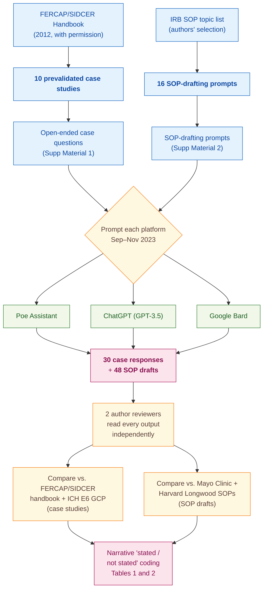

> [!success] **TL;DR**
> The paper is best read as a case-report-style proof of concept: three popular chatbots can produce plausible IRB outputs but quietly drop high-stakes details (the quorum rule, the conditional post-trial-access logic). Before any of these tools is used to prescreen real protocols, the field needs a quantitative rubric, blinded inter-rater agreement, larger and more diverse case banks, and tests against current frontier models — none of which this study provides.

## Structured abstract

> [!info] A plain-language summary built from this paper's discourse-graph nodes. Numbers and findings link back to specific EVD nodes — click any link to drill in.

### Question

Can off-the-shelf chatbots stand in for a member of an Institutional Review Board (IRB) — the human committee that reviews the ethics of clinical research — and can they draft the standard operating procedures (SOPs) that govern how IRBs run? The authors prompt three popular AI platforms with 10 prevalidated ethics case studies and 16 SOP-writing tasks, then compare the answers to two well-known reference SOPs and the international good-clinical-practice rulebook. See [[QUE - Can AI platforms emulate IRB member decision-making and draft standard operating procedures for ethical review?]].

### Methods

**Design.** The authors ran a single cross-sectional observational study between September and November 2023, in which three off-the-shelf AI platforms answered the same fixed set of ethics case studies and SOP-drafting prompts, with two human authors then qualitatively comparing the outputs against published gold-standard references.

**Tools.** The three AI platforms were Poe Assistant, ChatGPT (running on the GPT-3.5 model architecture from OpenAI), and Google Bard. The case studies came from the FERCAP/SIDCER Handbook of Case Studies on Ethical Issues in Health Research — a 2012 training resource published by two regional networks of ethics committees in Asia and the Western Pacific. SOP outputs were graded against the publicly available Mayo Clinic IRB Policy Manual (2023) and the Harvard Longwood Medical Area SOPs (2023). The international clinical-research rulebook ICH E6 — short for "International Council for Harmonisation, guideline E6 on Good Clinical Practice" — served as the second normative reference.

**Procedure.** The authors first obtained permission from FERCAP and SIDCER to use the 10 case studies. They then typed the open-ended questions attached to each case into each of the three platforms and saved the free-text replies. Separately, they used a second set of prompts (provided in Electronic Supplementary Material 2) to ask each platform to draft an SOP for each of 16 IRB-relevant topics — for example, how to handle conflicts of interest, when a study can be exempted from review, or how to monitor a clinical trial site. Two authors then independently read every output and checked it against the FERCAP/SIDCER handbook plus ICH E6 (for cases) or against the Mayo Clinic and Harvard SOPs (for drafts). Disagreements were resolved by discussion. The authors recorded results as narrative "stated or not stated" entries in Tables 1 and 2 — they did not compute any accuracy score, F1, or inter-rater agreement statistic.

**Sample.** The unit of analysis is one AI response. Ten case studies times three platforms produced 30 case responses, and 16 SOP topics times three platforms produced 48 SOP drafts. No platform-response was excluded. The two human reviewers were the two paper authors — one a Professor of Pharmacology and Therapeutics with prior IRB service, the other a Specialist Dentist; both have published in evidence-based medicine.

### Findings

- **All three chatbots produced an on-topic answer for every case.** Across the 10 FERCAP/SIDCER case studies, each of Poe Assistant, ChatGPT, and Google Bard returned a coherent reply that engaged the ethical issues at hand — covering GCP violations, IRB shortcomings, conflicts of interest, undue inducements, vulnerability, serious adverse event reporting, and expedited-review eligibility. Importantly, "responded successfully" means on-topic, not correct: Table 1 still flagged nine distinct domains in which at least one platform missed a GCP-relevant sub-issue. [[EVD - Three AI platforms responded correctly to all 10 IRB case study queries - @sridharanAssessingDecisionMakingCapabilities2024]]

- **Every chatbot wrote SOPs that hit the standard skeleton.** All 48 drafts contained the five fundamental SOP sections: purpose, scope, definitions, procedures, and responsibilities. The wording differed but the core content was strikingly similar across platforms. Table 2 captured seven SOP topics where the platforms diverged in clinically meaningful ways — for example, on conflict-of-interest handling, Poe Assistant said the conflicted member could still join the discussion (only barred from voting), while ChatGPT and Bard correctly required the conflicted member to leave the room. [[EVD - AI platforms drafted SOPs covering fundamental sections with variations across platforms - @sridharanAssessingDecisionMakingCapabilities2024]]

- **No chatbot mentioned the quorum rule for full board reviews.** A core IRB rule — that an initial protocol cannot be reviewed at a full board meeting unless a minimum number of members are present, called a quorum — was missing from all three SOPs for "management of initial protocol submissions." Both Mayo Clinic and Harvard Longwood SOPs require it. The same blind spot showed up in the conflict-of-interest section, where none of the three platforms mentioned that a conflicted member should not be counted toward the quorum. [[EVD - None of three AI platforms recognized quorum requirement for initial proposal review - @sridharanAssessingDecisionMakingCapabilities2024]]

- **Every chatbot fumbled the post-trial-access case.** Case Study 10 asked when a sponsor must provide post-trial access to an investigational herbal medicine. The expected GCP-grounded answer is conditional: post-trial access is owed when the intervention has been shown beneficial, but for an unproven herbal product the obligation does not attach. Zero of the three platforms surfaced that conditional logic. This was the only case (of 10) in which all three platforms failed simultaneously, making it the paper's flagship failure mode. [[EVD - All AI platforms failed to address post-trial herbal medicine access in case study 10 - @sridharanAssessingDecisionMakingCapabilities2024]]

### Claim supported

Together, these findings support the broader claim that [[CLM - AI tools can augment IRB decision-making and improve review efficiency but cannot replace human oversight]]. For an IRB chair considering using one of these chatbots as a prescreening assistant, the practical takeaway is that the tools will reliably draft a plausible-looking SOP or case response, but a trained human reviewer still has to catch the structural gaps — the quorum rule, the conditional GCP logic, the COI quorum exclusion — that the models silently omit.

### Caveats

- **Three platforms and ten cases is a thin slice.** The benchmark covers only Poe Assistant, ChatGPT (GPT-3.5), and Google Bard against 10 prevalidated case studies from a single 2012 handbook. The authors describe the work as a preliminary attempt; results may not transfer to newer models (GPT-4, Claude, Gemini) or to live IRB scenarios drawn from local jurisdictions. [[CVT - Study used only three AI platforms evaluated on ten case studies limiting generalizability of IRB capability findings]]

### Methods at a glance

---

## Quality appraisal

> [!info] Risk-of-bias and validity assessment, synthesized from this paper's discourse-graph nodes and grounded in the same paper this page's top trust-signal chips summarize. Covers *methodological quality* — the TRIPOD-LLM table below covers *reporting compliance* instead.
> <dl class="callout-legend">
> <dt>● Low risk</dt><dd>No meaningful threat to this domain identified</dd>
> <dt>◐ Some risk</dt><dd>A real but non-fatal limitation</dd>
> <dt>○ High risk</dt><dd>A significant, unaddressed threat to validity</dd>
> </dl>

| Domain | Rating | Quote |
| --- | :---: | --- |
| **Construct validity**: does the metric actually measure the construct? | 🔴 | *"The trio of AI platforms successfully responded to queries from all case studies, as detailed in Electronic Supplementary Material 3."* `§Results, p.85`, "successfully responded" conflates on-topic engagement with GCP-correct reasoning, with no quantitative rubric behind it |
| **Internal validity**: could the comparison be biased? | 🟡 | *"Two authors independently assessed the AI outputs, and the veracity was verified using the FERCAP/SIDCER handbook and the ICH E6 GCP guidelines"* `§Study Procedure, p.84–85` |
| **External validity**: do findings generalize? | 🔴 | *"the present study is a preliminary attempt, and future studies should focus on exploring AI's potential in quantifying different types of risks and comparing the potential benefits."* `§General Discussion, p.88` |
| **Statistical rigor**: appropriate uncertainty + comparisons? | 🔴 | Not reported, no quantitative metric, confidence interval, significance test, or inter-rater agreement statistic appears anywhere in the paper |
| **Reproducibility**: code, data, determinism? | 🟡 | *"Supplemental material for this article is available online."* `p.89`, prompts and outputs released, but model snapshots and inference parameters are not disclosed |
| **Data leakage**: could models have seen this data pretraining? | 🔴 | Not reported, no discussion of whether the 2012 FERCAP/SIDCER case studies could already be in the platforms' training data |
| **Baseline adequacy**: is there a meaningful floor to beat? | 🔴 | Not reported, no naive or majority-vote baseline is compared against the three platforms' answers |
| **Train/dev/test hygiene**: are data splits kept separate? | 🔴 | Not reported, no data-split concept applies or is discussed for the fixed case-study/SOP prompt set |
| **Multiple-comparisons correction**: controlled for repeated testing? | 🔴 | Not reported, three platforms × 10 cases × 16 SOP topics are compared narratively with no stated correction |
| **Human-baseline comparability**: is there a human reference point? | 🔴 | Not reported, the two author-reviewers judge AI outputs against published references but no independent human-authored response is scored under the same rubric |
| **Confidence Intervals**: are point estimates accompanied by an interval? | 🔴 | Not reported — no quantitative metric of any kind is computed, so no interval is possible |
| **Chance-Corrected Metrics**: does agreement/accuracy correct for chance? | 🔴 | Not reported — comparisons are purely qualitative "stated/not stated" judgments (Table 1-2), with no statistic computed at all |
| **Non-Significant Result Spin**: are null or negative findings framed plainly? | 🔴 | Not applicable — no significance testing is performed at all, so there is no null finding to spin |
| **Ablation Experiment(s)**: does the paper isolate a component's contribution? | 🔴 | Not reported — a qualitative 10-case-study comparison of three AI platforms' SOP outputs; no system component is removed or varied and re-measured |

**Bottom line.** The paper is best read as a case-report-style proof of concept: three popular chatbots can produce plausible IRB outputs but quietly drop high-stakes details (the quorum rule, the conditional post-trial-access logic). Before any of these tools is used to prescreen real protocols, the field needs a quantitative rubric, blinded inter-rater agreement, larger and more diverse case banks, and tests against current frontier models — none of which this study provides.

> [!tip] **Applicable external appraisal frameworks beyond TRIPOD-LLM** (already covered by the table below): **MI-CLAIM** (Norgeot et al. 2020) for clinical-AI minimum information · **MINIMAR** (Hernandez-Boussard et al. 2020) for medical-AI reporting · **PROBAST+AI** (Wolff et al. 2019 base; AI extension in development) for prediction-model risk of bias

---

## TRIPOD-LLM reporting summary

> [!info] Reporting compliance for this paper, mapped to the TRIPOD-LLM checklist (Title/Abstract/Introduction items 1–4, Methods items 5a–15, Results items 16a–18). TRIPOD-LLM is a clinical-ML guideline being applied here to a non-clinical AI-research benchmark — where an item's own wording says "healthcare context" or "care pathway," it's read as "research-evaluation context" / "research workflow" instead. Item 17 (Performance) is reported per-EVD; see each EVD's `## Other Notes`.
> 

> ●Fully reported
> ◐Partial / unclear
> ○Not reported
> –Not applicable
> 

| # | Item | ✓ | Quote |
| --- | --- | :---: | --- |
| **1** | Title | ✅ | *"Assessing the Decision-Making Capabilities of Artificial Intelligence Platforms as Institutional Review Board Members"* `Title, p.83` |
| **2** | Abstract | ➖ | Assessed separately under TRIPOD-LLM's own Abstract extension, not scored here |
| **3a** | Background — context + rationale | ✅ | *"Institutional review boards (IRBs) play a pivotal role in safeguarding the interests of both research participants and researchers... Notwithstanding widespread agreement on the need for IRBs to scrutinize research involving human subjects, accumulating evidence suggests inefficiencies within the IRB review framework"* `§Introduction, p.83` |
| **3b** | Background — target population | ⚠️ | *"we scrutinized the ability of three AI platforms to emulate the decision-making processes of IRB members across 10 prototypical, prevalidated case scenarios"* `§Introduction, p.84` |
| **4** | Objectives | ✅ | *"This study assesses the abilities of three artificial intelligence (AI) platforms to address IRB challenges and draft essential SOPs."* `Abstract, p.83` |
| **5a** | Data sources | ✅ | *"The AI platforms were prompted with ten case studies with open-ended questions from the FERCAP/SIDCER Handbook of Case Studies on Ethical Issues in Health Research (FERCAP/SIDCER, 2012)"* `§Study Procedure, p.84`; *"Two authors independently assessed the outputs of SOPs and compared them with the IRB SOPs from the Mayo Clinic (IRB Mayo Clinic, 2023) and Harvard Medical School"* `§Study Procedure, p.85` |
| **5b** | Data points + distribution | ⚠️ | *"The AI platforms were prompted with ten case studies"* `§Study Procedure, p.84`; the SOP task list enumerates 16 topics (Constitution of IRB and IRB membership … Quality assurance of IRB functions) `§Study Procedure, p.84–85` — no explicit stated count of resulting responses/drafts, and no per-case or per-SOP word counts |
| **5c** | Date range of data | ⚠️ | *"The present work represents a cross-sectional, observational study that was carried out during September to November 2023."* `§Study Design, p.84` — training-data cutoffs of Poe Assistant, ChatGPT, and Google Bard not disclosed |
| **5d** | Pre-processing / quality checks | ❌ | Not reported |
| **5e** | Missing / imbalanced data | ➖ | Not applicable — no missing-data handling is described; all prompted case studies and SOP topics appear to have produced responses |
| **6a** | LLM name + version | ⚠️ | *"ChatGPT©: This language model is based on the GPT-3.5 architecture developed by OpenAI."* `§Study Procedure, p.84` — Poe Assistant and Google Bard described only generically, no version numbers or snapshot dates for any platform |
| **6b** | Development process | ➖ | Not applicable — off-the-shelf consumer platforms evaluated as-is; no fine-tuning or development by authors |
| **6c** | Inference settings / prompting | ❌ | Not reported |
| **6d** | Output | ✅ | *"The trio of AI platforms successfully responded to queries from all case studies, as detailed in Electronic Supplementary Material 3."* `§Results, p.85`; *"The SOP-related outputs from the AI platforms are set out in Electronic Supplementary Material 4."* `§Results, p.85` |
| **6e** | Classification thresholds | ➖ | Not applicable — no probabilistic / classification model; outputs are free text |
| **7a** | Quality metrics | ❌ | Not reported |
| **7b** | Relevance to downstream use | ⚠️ | *"AI platforms could aid IRB decision-making and improve review efficiency. However, human oversight remains critical for ensuring the accuracy of AI-generated solutions."* `Abstract, p.83` |
| **7c** | Outcome definition | ⚠️ | *"The accuracy of the AI outputs was assessed against good clinical practice (GCP) guidelines."* `Abstract, p.83` — no explicit scoring rubric |
| **7d** | Subjective interpretation | ⚠️ | *"Two authors independently assessed the AI outputs, and the veracity was verified using the FERCAP/SIDCER handbook and the ICH E6 GCP guidelines"* `§Study Procedure, p.84–85` — no inter-rater agreement metric reported |
| **7e** | Comparison | ✅ | *"variations in the responses of the AI platforms emerged, as presented in Table 1"* `§Results, p.85`; *"Distinctive differences in the SOPs crafted by the AI tools are presented in Table 2."* `§Results, p.85` |
| **8a** | Annotation guidelines | ❌ | Not reported |
| **8b** | Annotators + IAA | ⚠️ | *"Two authors independently assessed the AI outputs"* `§Study Procedure, p.84` — no quantitative inter-annotator agreement (κ/α) reported |
| **8c** | Annotator background | ⚠️ | *"Dr. Kannan Sridharan is currently Professor and Chair of the Department of Pharmacology & Therapeutics in Arabian Gulf University, Bahrain. Prof. Kannan Sridharan has served in IRBs at various capacities"* `Author Biographies, p.91`; *"Dr. Gowri Sivaramakrishnan is currently the Specialist Dentist in the Kingdom of Bahrain and has published several articles related to Evidence-Based Medicine."* `Author Biographies, p.91` |
| **9a** | Prompt design | ⚠️ | *"The AI platforms were prompted with ten case studies with open-ended questions"* `§Study Procedure, p.84`; *"we used specific prompts (Electronic Supplementary Material 2) of the AI platforms to generate the SOPs"* `§Study Procedure, p.84` — full prompt text only in supplementary material |
| **9b** | Prompt-development data | ❌ | Not reported |
| **10** | Summarization | ➖ | Not applicable — no summarization endpoint evaluated |
| **11** | Instruction tuning / alignment | ➖ | Not applicable — no model training, fine-tuning, or alignment performed |
| **12** | Compute | ❌ | Not reported |
| **13** | Ethical approval | ➖ | *"Due to the nature of the study, it was not necessary to seek ethics committee approval."* `§Study Design, p.84`; *"Ethics Approval and Informed Consent: Not applicable."* `p.89` |
| **14a** | Funding | ✅ | *"The authors received no financial support for the research, authorship, and/or publication of this article."* `Funding, p.89` |
| **14b** | Conflicts of interest | ✅ | *"The authors declared no actual or potential conflicts of interest with respect to the research, authorship, and/or publication of this article."* `Declaration of Conflicting Interests, p.89` |
| **14c** | Protocol | ❌ | Not reported |
| **14d** | Registration | ➖ | Not applicable — not a registered clinical study |
| **14e** | Data availability | ⚠️ | *"Supplemental material for this article is available online."* `p.89` — case-study details (ESM 1), SOP prompts (ESM 2), and full outputs (ESM 3, ESM 4) referenced but no structured public dataset / repository |
| **14f** | Code availability | ❌ | Not reported |
| **15** | Patient/public involvement | ➖ | Not applicable |
| **16a** | Flow of data | ⚠️ | *"The trio of AI platforms successfully responded to queries from all case studies"* `§Results, p.85` — no formal flow diagram or exclusion count reported |
| **16b** | Characteristics | ⚠️ | *"Case Study 1: Role of the REC; Case Study 2: Emergency Room Research; Case Study 3: Scientific Soundness; Case Study 4: Conflict of Interest (COI); Case Study 5: Research on Healthy Volunteers; Case Study 6: Observational Study; Case Study 7: Behavioral Research; Case Study 8: Traditional Medicine; Case Study 9: Recruitment and Informed Consent; and Case Study 10: Post-Trial Access."* `§Study Procedure, p.84` |
| **16c** | Distribution comparison | ➖ | Not applicable — no clinical-outcome subgroup comparison |
| **16d** | N per analysis | ✅ | *"The AI platforms were prompted with ten case studies"* `§Study Procedure, p.84`, each administered to all three platforms; the SOP-drafting task list enumerates 16 topics, also administered to all three platforms `§Study Procedure, p.84–85` |
| **17** | Performance | `per-EVD` | Reported per-EVD. See each EVD's `## Other Notes`. |
| **18** | LLM updating | ➖ | Not applicable — *"one significant drawback of such locally operated AI models is their lack of internet connectivity, which poses difficulties in updating them with the most recent ethical guidelines"* `§General Discussion, p.88` — discussed as a trade-off, no update performed |
