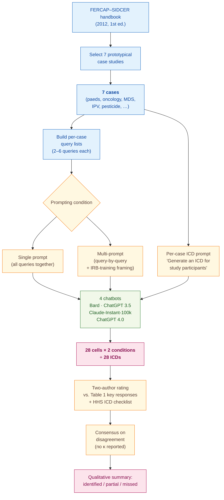

> [!success] **TL;DR**
> This is a useful exploratory pilot — it demonstrates that off-the-shelf chatbots can produce structurally complete IRB-style answers and ICD drafts on teaching cases, and that splitting prompts apart helps. It is not evidence that any of these tools are ready to pre-screen real proposals.

## Structured abstract

> [!info] A plain-language summary built from this paper's discourse-graph nodes. Numbers and findings link back to specific EVD nodes — click any link to drill in.

### Question

Can today's general-purpose chatbots spot the same ethical issues that an Institutional Review Board (IRB) member would flag in a clinical research proposal, and can they draft a usable informed consent document (ICD) for participants? The authors put four off-the-shelf chatbots through seven worked teaching cases and compare their answers against the expected key responses listed in a published ethics handbook. They also test whether asking each question one at a time (multi-prompt) elicits better answers than asking everything at once (single-prompt). See [[QUE - Can LLMs identify potential ethical issues in clinical research proposals and generate informed consent documents?]].

### Methods

**Design.** The authors ran an observational, cross-sectional pilot evaluation between October and November 2023. They scored each chatbot's free-text answers against a fixed rubric, with two raters reaching consensus.

**Tools.** The authors evaluated four cloud chatbots as-is: Google Bard, ChatGPT 3.5, Claude-Instant-100k, and ChatGPT 4.0 (the last paid; the first three free at the time). The seven evaluation cases came from the FERCAP–SIDCER handbook of case studies on ethical issues in health research — a published teaching resource from the Forum for Ethical Review Committees in the Asian and Western Pacific Region. The ICD rubric came from the US Department of Health and Human Services Office for Human Research Protections (HHS OHRP) informed-consent checklist.

**Procedure.** The authors selected seven prototypical cases covering paediatric vaccines, dose-optimisation in Tourette syndrome, oncology Phase II, placebo-controlled myelodysplastic syndrome (MDS) trials, intimate partner violence (IPV) qualitative work, and pesticide-exposure research. For each case they posed a fixed list of queries about eligibility, sample size, vulnerability, risk–benefit, placebo justification, and ICD content (six queries for cases 1–2, five for cases 3, 4, 6, four for case 7, and two for case 5). Each chatbot saw the queries twice: first concatenated as a single prompt, then one at a time as a multi-prompt dialogue, plus an extra "training IRB members" framing query. The authors then asked each chatbot to draft an ICD for each case using a single short prompt. Two authors rated every output independently against the expected key responses in Table 1 and the HHS checklist, then resolved disagreements by consensus. The comparison stays qualitative — no precision, recall, F1, or kappa is reported, and no statistical test compares single-prompt to multi-prompt outputs.

**Sample.** The unit of analysis is a chatbot–case cell. Seven cases times four chatbots gives 28 cells per prompting condition (56 cells across both conditions), plus 28 generated ICDs. No exclusions are reported; every chatbot answered every query. The two raters were the paper's two authors — one from a medical-school pharmacology department (Arabian Gulf University), one from a primary-care centre in Bahrain. Rater background in IRB review or rating-task expertise is not described.

### Findings

- **All four chatbots answered every case and gave broadly similar responses.** All four chatbots produced answers to every query for all seven cases under a single prompt. The authors describe the responses as "homogeneous" on study-design appropriateness, risks and benefits, vulnerability, and ICD content. Failure patterns clustered by case rather than by model — for example, none of the four chatbots flagged the inappropriate non-randomised design in case 4, and none flagged the school-site coercion risk in case 3. [[EVD - All four LLMs answered all seven IRB ethics case queries with homogeneous responses - @sridharanLeveragingArtificialIntelligence2025]]

- **Every generated ICD covered the fundamental elements but used too much jargon.** All 28 chatbot-generated ICDs (4 chatbots times 7 cases) included every fundamental element on the HHS checklist and stayed under the 1250-word readability ceiling. But every chatbot used technical language ("tardive dyskinesia", "myelodysplastic syndrome", "Yale Global Tic Severity Scale") despite the recommended 8th-grade reading level. None mentioned the planned number of participants. ChatGPT 3.5 and ChatGPT 4.0 inappropriately included eligibility criteria in every ICD. Google Bard and Claude-Instant-100k omitted IRB contact details. [[EVD - All four LLMs included fundamental ICD elements for all seven case scenarios - @sridharanLeveragingArtificialIntelligence2025]]

- **Single-prompt answers missed key safety topics that multi-prompt answers caught.** Under a single prompt, the chatbots performed "suboptimally" on placebo-arm suitability, risk-mitigation strategies, and potential risks to participants. For example, in the MDS placebo case (case 5), only Google Bard flagged that placebo was questionable given iron-overload risk under a single prompt. Asking the same questions one at a time produced more complete answers across all four chatbots and all three domains — Claude-Instant-100k revised its weak placebo justification, and ChatGPT 4.0 newly recommended an independent data-monitoring committee, post-study drug access, and an independent advocate for child participants in case 2. The improvement was qualitative — no statistical test was performed — and "some omissions related to a single prompt were observed even with multiple prompts". [[EVD - LLMs performed suboptimally identifying placebo arm suitability and risk mitigation in single prompt - @sridharanLeveragingArtificialIntelligence2025]]

### Claim supported

These findings support [[CLM - AI tools can augment IRB decision-making and improve review efficiency but cannot replace human oversight]] and [[CLM - Multiple prompts elicit more complete and nuanced LLM outputs for ethical review tasks than single prompts]]. For someone considering a chatbot as an IRB pre-screen, the practical takeaway is narrow: the tools are useful for a first-pass jargon-heavy ICD draft and for surfacing standard ethical considerations, but they reliably miss specific risks (placebo suitability, risk mitigation, coercion) unless prompted query-by-query, and even then a human reviewer has to plug the gaps.

### Caveats

- **Pilot design with seven cases and only cloud chatbots.** The evaluation rests on a small handful of teaching scenarios from a single published handbook, which limits how confidently the results generalize to real proposals. Cloud-only chatbot use also rules out testing how the tools handle multicentric studies where cultural, linguistic, and geographical differences matter. [[CVT - LLM evaluation used only cloud-based models on pilot sample of seven cases limiting multicentric and cultural applicability]]

### Methods at a glance

---

## Quality appraisal

> [!info] Risk-of-bias and validity assessment, synthesized from this paper's discourse-graph nodes and grounded in the same paper this page's top trust-signal chips summarize. Covers *methodological quality* — the TRIPOD-LLM table below covers *reporting compliance* instead.
> <dl class="callout-legend">
> <dt>● Low risk</dt><dd>No meaningful threat to this domain identified</dd>
> <dt>◐ Some risk</dt><dd>A real but non-fatal limitation</dd>
> <dt>○ High risk</dt><dd>A significant, unaddressed threat to validity</dd>
> </dl>

| Domain | Rating | Quote |
| --- | :---: | --- |
| **Construct validity**: does the metric actually measure the construct? | 🔴 | *"Table 2 summarises the key findings from the outputs of the LLMs following a single prompt."* `p.127`, a qualitative identified/partial/missed call with no precision, recall, F1, or kappa reported |
| **Internal validity**: could the comparison be biased? | 🟡 | *"Two authors independently evaluated the response of four LLMs, and a consensus was reached."* `p.127`, no blinded or external rater, and no statistical test compares single-prompt to multi-prompt outputs |
| **External validity**: do findings generalize? | 🔴 | *"Seven case studies were selected from the FERCAP-SIDCER handbook of case studies on ethical issues in health research published by the Forum for Ethical Review Committees in the Asian and Western Pacific Region (FERCAP) and the Strategic Initiative for Developing Capacity in Ethical Review (SIDCER)."* `Study procedure, p.127` |
| **Statistical rigor**: appropriate uncertainty + comparisons? | 🔴 | Not reported, no inter-rater agreement statistic, confidence interval, or significance test is provided despite the two-rater, four-chatbot design |
| **Reproducibility**: code, data, determinism? | 🟡 | *"All data relevant to the study are included in the article or uploaded as online supplemental information."* `p.133`, queries and outputs released, but model checkpoints and inference settings are not reported |
| **Data leakage**: could models have seen this data pretraining? | 🔴 | Not reported, no discussion of whether the 2012 FERCAP-SIDCER cases could already be in the four chatbots' training data |
| **Baseline adequacy**: is there a meaningful floor to beat? | 🔴 | Not reported, no naive or majority-vote baseline is compared against the four chatbots' answers |
| **Train/dev/test hygiene**: are data splits kept separate? | 🔴 | Not reported, no data-split concept applies or is discussed for the fixed seven-case query set |
| **Multiple-comparisons correction**: controlled for repeated testing? | 🔴 | Not reported, four chatbots × seven cases × two prompting conditions are compared narratively with no stated correction |
| **Human-baseline comparability**: is there a human reference point? | 🟡 | *"A short description of key responses expected from the LLMs for each case scenario is provided in table 1."* `p.127`, an expert-authored reference standard, though not a live human performing the task alongside the models |

**Bottom line.** This is a useful exploratory pilot — it demonstrates that off-the-shelf chatbots can produce structurally complete IRB-style answers and ICD drafts on teaching cases, and that splitting prompts apart helps. It is not evidence that any of these tools are ready to pre-screen real proposals. Before the result is deployment-ready, the authors (or a follow-up) would need to test on a larger, real-proposal sample with blinded expert raters, report inter-rater agreement and per-chatbot quantitative metrics, and pin model versions and inference settings so the comparison can be reproduced.

> [!tip] **Applicable external appraisal frameworks beyond TRIPOD-LLM** (already covered by the table below): **MI-CLAIM** (Norgeot et al. 2020) for clinical-AI minimum information · **MINIMAR** (Hernandez-Boussard et al. 2020) for medical-AI reporting · **PROBAST+AI** (Wolff et al. 2019 base; AI extension in development) for prediction-model risk of bias

---

## TRIPOD-LLM reporting summary

> [!info] Reporting compliance for this paper, mapped to the TRIPOD-LLM checklist (Title/Abstract/Introduction items 1–4, Methods items 5a–15, Results items 16a–18). Item 17 (Performance) is reported per-EVD; see each EVD's `## Other Notes`.
> 

> ●Fully reported
> ◐Partial / unclear
> ○Not reported
> –Not applicable
> 

| # | Item | ✓ | Quote |
| --- | --- | :---: | --- |
| **1** | Title | ✅ | *"Leveraging artificial intelligence to detect ethical concerns in medical research: a case study"* `Title` |
| **2** | Abstract | ➖ | Assessed separately under TRIPOD-LLM's own Abstract extension, not scored here |
| **3a** | Background — context + rationale | ✅ | *"Institutional review boards (IRBs) have been criticised for delays in approvals for research proposals due to inadequate or inexperienced IRB staff."* `Abstract, p.126` |
| **3b** | Background — target population | ✅ | *"Artificial intelligence (AI), particularly large language models (LLMs), has significant potential to assist IRB members in a prompt and efficient reviewing process."* `Abstract, p.126` |
| **4** | Objectives | ✅ | *"we designed the present study to identify and compare the ability of four LLMs to recognise potential ethical issues in seven prototypical case studies. Additionally, we have evaluated the ability of these AI tools to conceive informed consent documents (ICDs) for the same case scenarios."* `Introduction, p.126` |
| **5a** | Data sources | ✅ | *"Seven case studies were selected from the FERCAP-SIDCER handbook of case studies on ethical issues in health research published by the Forum for Ethical Review Committees in the Asian and Western Pacific Region (FERCAP) and the Strategic Initiative for Developing Capacity in Ethical Review (SIDCER)."* `Study procedure, p.127` |
| **5b** | Data points + distribution | ✅ | *"Six queries were posed for case scenarios 1 and 2; five for scenarios 3, 4, and 6; four for scenario 7 and two for scenario 5."* `p.127` |
| **5c** | Date range of data | ✅ | *"The present study was conducted as an observational, cross-sectional design between October and November 2023."* `Study design, p.126` |
| **5d** | Pre-processing / quality checks | ⚠️ | *"Approval from FERCAP-SIDCER was obtained by the authors for reproducing these cases for the purpose of this research study."* `p.127` — no textual pre-processing pipeline described |
| **5e** | Missing / imbalanced data | ✅ | *"All four LLMs were able to provide answers to questions related to all seven cases following a single prompt"* `Results, p.127` |
| **6a** | LLM name + version | ⚠️ | *"Google Bard©. Available: https://bard.google.com/chat [Accessed 01 Feb 2024]."* `Ref 14, p.134` — access dates given for all 4 platforms; exact model checkpoints not specified |
| **6b** | Development process | ➖ | Not applicable — off-the-shelf cloud chatbots used as-is; no fine-tuning, RAG, or system-prompt engineering by the authors |
| **6c** | Inference settings / prompting | ❌ | Not reported |
| **6d** | Output | ✅ | *"All four LLMs were able to provide answers to questions related to all seven cases following a single prompt"* `Results, p.127` |
| **6e** | Classification thresholds | ➖ | Not applicable — no probabilistic classifier; outputs are open-ended text rated qualitatively |
| **7a** | Quality metrics | ⚠️ | *"Table 2 summarises the key findings from the outputs of the LLMs following a single prompt."* `p.127` — qualitative identified/not-identified summary, no precision/recall/F1/κ |
| **7b** | Relevance to downstream use | ✅ | *"AI can be a promising screening tool, and IRBs can even advise the investigators to screen their clinical research proposals through AI tools to identify a large majority of ethical issues."* `Discussion, p.132` |
| **7c** | Outcome definition | ✅ | *"Two authors independently evaluated the response of four LLMs, and a consensus was reached. Additionally, the veracity of the LLM outputs was verified with the answers provided in the FERCAP-SIDCER handbook of case studies"* `p.127` |
| **7d** | Subjective interpretation | ⚠️ | *"Two authors independently evaluated the response of four LLMs, and a consensus was reached."* `p.127` — no κ or percent-agreement statistic reported |
| **7e** | Comparison | ✅ | *"We compared the responses of the LLMs with a single prompt containing all of the queries together and multiple prompts in which each query was posted one by one, such as engaging in a series of dialogue."* `p.127` |
| **8a** | Annotation guidelines | ✅ | *"A short description of key responses expected from the LLMs for each case scenario is provided in table 1."* `p.127` |
| **8b** | Annotators + IAA | ⚠️ | *"Two authors independently evaluated the response of four LLMs, and a consensus was reached."* `p.127` — no quantitative inter-annotator agreement reported |
| **8c** | Annotator background | ⚠️ | *"Department of Pharmacology & Therapeutics, College of Medicine and Medical Sciences, Arabian Gulf University, Manama, Bahrain"* / *"Primary Health Care Centers, Manama, Bahrain"* `p.126` |
| **9a** | Prompt design | ⚠️ | *"Below is the summary of a research proposal. Can you generate an ICD for the study participants?"* `p.127` |
| **9b** | Prompt-development data | ❌ | Not reported |
| **10** | Summarization | ➖ | Not applicable |
| **11** | Instruction tuning / alignment | ➖ | Not applicable — off-the-shelf chatbots; no fine-tuning or RLHF performed by the authors |
| **12** | Compute | ⚠️ | *"Currently, ChatGPT 4.0 costs US$20 per month"* `Discussion, p.132` — subscription cost noted; no token counts, GPU/CPU usage, or latency reported |
| **13** | Ethical approval | ➖ | *"Since this study did not involve any interaction with humans or data from humans, approval from an ethics committee was not sought."* `p.126-127` |
| **14a** | Funding | ✅ | *"The authors have not declared a specific grant for this research from any funding agency in the public, commercial or not-for-profit sectors."* `p.133` |
| **14b** | Conflicts of interest | ✅ | *"Competing interests None declared."* `p.133` |
| **14c** | Protocol | ❌ | Not reported |
| **14d** | Registration | ➖ | Not applicable — not a clinical study |
| **14e** | Data availability | ✅ | *"All data relevant to the study are included in the article or uploaded as online supplemental information."* `p.133` |
| **14f** | Code availability | ➖ | Not applicable — no analytic code beyond manual rating; no programmatic API pipeline |
| **15** | Patient/public involvement | ➖ | *"Patient consent for publication Not applicable."* `p.133` |
| **16a** | Flow of data | ✅ | *"Details of the case scenarios and the queries posed to the LLMs are detailed in online supplemental file 1."* `p.127` |
| **16b** | Characteristics | ✅ | *"Seven case studies were selected from the FERCAP-SIDCER handbook of case studies on ethical issues in health research"* `Study procedure, p.127` |
| **16c** | Distribution comparison | ➖ | Not applicable — no clinical-outcome subgroup comparison |
| **16d** | N per analysis | ✅ | *"Six queries were posed for case scenarios 1 and 2; five for scenarios 3, 4, and 6; four for scenario 7 and two for scenario 5."* `p.127` |
| **17** | Performance | `per-EVD` | Reported per-EVD. See each EVD's `## Other Notes`. |
| **18** | LLM updating | ➖ | Not applicable — no model updating or retraining performed |
