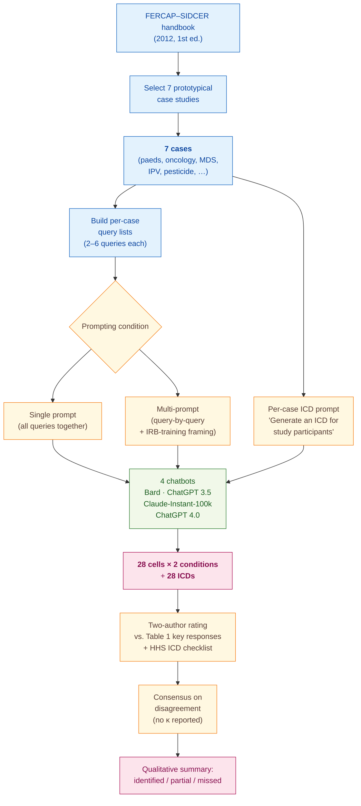

> [!success] **TL;DR**
> This is a useful exploratory pilot — it demonstrates that off-the-shelf chatbots can produce structurally complete IRB-style answers and ICD drafts on teaching cases, and that splitting prompts apart helps. It is not evidence that any of these tools are ready to pre-screen real proposals.

## Structured abstract

> [!info] A plain-language summary built from this paper's discourse-graph nodes. Numbers and findings link back to specific EVD nodes — click any link to drill in.

### Question

Can today's general-purpose chatbots spot the same ethical issues that an Institutional Review Board (IRB) member would flag in a clinical research proposal, and can they draft a usable informed consent document (ICD) for participants? The authors put four off-the-shelf chatbots through seven worked teaching cases and compare their answers against the expected key responses listed in a published ethics handbook. They also test whether asking each question one at a time (multi-prompt) elicits better answers than asking everything at once (single-prompt). See [[QUE - Can LLMs identify potential ethical issues in clinical research proposals and generate informed consent documents?]].

### Methods

**Design.** The authors ran an observational, cross-sectional pilot evaluation between October and November 2023. They scored each chatbot's free-text answers against a fixed rubric, with two raters reaching consensus.

**Tools.** The authors evaluated four cloud chatbots as-is: Google Bard, ChatGPT 3.5, Claude-Instant-100k, and ChatGPT 4.0 (the last paid; the first three free at the time). The seven evaluation cases came from the FERCAP–SIDCER handbook of case studies on ethical issues in health research — a published teaching resource from the Forum for Ethical Review Committees in the Asian and Western Pacific Region. The ICD rubric came from the US Department of Health and Human Services Office for Human Research Protections (HHS OHRP) informed-consent checklist.

**Procedure.** The authors selected seven prototypical cases covering paediatric vaccines, dose-optimisation in Tourette syndrome, oncology Phase II, placebo-controlled myelodysplastic syndrome (MDS) trials, intimate partner violence (IPV) qualitative work, and pesticide-exposure research. For each case they posed a fixed list of queries about eligibility, sample size, vulnerability, risk–benefit, placebo justification, and ICD content (six queries for cases 1–2, five for cases 3, 4, 6, four for case 7, and two for case 5). Each chatbot saw the queries twice: first concatenated as a single prompt, then one at a time as a multi-prompt dialogue, plus an extra "training IRB members" framing query. The authors then asked each chatbot to draft an ICD for each case using a single short prompt. Two authors rated every output independently against the expected key responses in Table 1 and the HHS checklist, then resolved disagreements by consensus. The comparison stays qualitative — no precision, recall, F1, or kappa is reported, and no statistical test compares single-prompt to multi-prompt outputs.

**Sample.** The unit of analysis is a chatbot–case cell. Seven cases times four chatbots gives 28 cells per prompting condition (56 cells across both conditions), plus 28 generated ICDs. No exclusions are reported; every chatbot answered every query. The two raters were the paper's two authors — one from a medical-school pharmacology department (Arabian Gulf University), one from a primary-care centre in Bahrain. Rater background in IRB review or rating-task expertise is not described.

### Findings

- **All four chatbots answered every case and gave broadly similar responses.** All four chatbots produced answers to every query for all seven cases under a single prompt. The authors describe the responses as "homogeneous" on study-design appropriateness, risks and benefits, vulnerability, and ICD content. Failure patterns clustered by case rather than by model — for example, none of the four chatbots flagged the inappropriate non-randomised design in case 4, and none flagged the school-site coercion risk in case 3. [[EVD - All four LLMs answered all seven IRB ethics case queries with homogeneous responses - @sridharanLeveragingArtificialIntelligence2025]]

- **Every generated ICD covered the fundamental elements but used too much jargon.** All 28 chatbot-generated ICDs (4 chatbots times 7 cases) included every fundamental element on the HHS checklist and stayed under the 1250-word readability ceiling. But every chatbot used technical language ("tardive dyskinesia", "myelodysplastic syndrome", "Yale Global Tic Severity Scale") despite the recommended 8th-grade reading level. None mentioned the planned number of participants. ChatGPT 3.5 and ChatGPT 4.0 inappropriately included eligibility criteria in every ICD. Google Bard and Claude-Instant-100k omitted IRB contact details. [[EVD - All four LLMs included fundamental ICD elements for all seven case scenarios - @sridharanLeveragingArtificialIntelligence2025]]

- **Single-prompt answers missed key safety topics that multi-prompt answers caught.** Under a single prompt, the chatbots performed "suboptimally" on placebo-arm suitability, risk-mitigation strategies, and potential risks to participants. For example, in the MDS placebo case (case 5), only Google Bard flagged that placebo was questionable given iron-overload risk under a single prompt. Asking the same questions one at a time produced more complete answers across all four chatbots and all three domains — Claude-Instant-100k revised its weak placebo justification, and ChatGPT 4.0 newly recommended an independent data-monitoring committee, post-study drug access, and an independent advocate for child participants in case 2. The improvement was qualitative — no statistical test was performed — and "some omissions related to a single prompt were observed even with multiple prompts". [[EVD - LLMs performed suboptimally identifying placebo arm suitability and risk mitigation in single prompt - @sridharanLeveragingArtificialIntelligence2025]]

### Claim supported

These findings support [[CLM - AI tools can augment IRB decision-making and improve review efficiency but cannot replace human oversight]] and [[CLM - Multiple prompts elicit more complete and nuanced LLM outputs for ethical review tasks than single prompts]]. For someone considering a chatbot as an IRB pre-screen, the practical takeaway is narrow: the tools are useful for a first-pass jargon-heavy ICD draft and for surfacing standard ethical considerations, but they reliably miss specific risks (placebo suitability, risk mitigation, coercion) unless prompted query-by-query, and even then a human reviewer has to plug the gaps.

### Caveats

- **Pilot design with seven cases and only cloud chatbots.** The evaluation rests on a small handful of teaching scenarios from a single published handbook, which limits how confidently the results generalize to real proposals. Cloud-only chatbot use also rules out testing how the tools handle multicentric studies where cultural, linguistic, and geographical differences matter. [[CVT - LLM evaluation used only cloud-based models on pilot sample of seven cases limiting multicentric and cultural applicability]]

### Methods at a glance

---

## Critical appraisal

> [!info] A risk-of-bias and validity assessment across five domains, synthesized from this paper's discourse-graph nodes. Each domain gets a rating (🟢 Low risk · 🟡 Some concerns · 🔴 High risk) plus a brief, EVD-grounded justification. The TRIPOD-LLM table below covers *reporting compliance*; this section covers *methodological quality*.

| Domain                                                                   | Rating | Justification                                                                                                                                                                                                                                                                                                                                                                                                       |
| ------------------------------------------------------------------------ | :----: | ------------------------------------------------------------------------------------------------------------------------------------------------------------------------------------------------------------------------------------------------------------------------------------------------------------------------------------------------------------------------------------------------------------------|
| **Construct validity** — does the metric actually measure the construct? |   🔴   | The "metric" is a qualitative identified / partial / missed call by two raters against an expected-key-response list. There is no precision, recall, F1, kappa, or any quantitative aggregate per chatbot. The construct of interest — "would this chatbot help an IRB catch real ethical issues?" — is not directly measured; the proxy (matches to a teaching-handbook key) over-fits to the handbook's framing. |
| **Internal validity** — could the comparison be biased?                  |   🟡   | The same two authors built the rubric, ran the prompts, and rated the outputs, with no blinded or external rater. No statistical test compares single-prompt to multi-prompt outputs, so the headline "multi-prompt is better" claim rests on the authors' qualitative read of their own data. The cross-chatbot comparison is reasonably symmetric — same queries, same rubric — but rating drift is unaddressed. |
| **External validity** — do findings generalize?                          |   🔴   | Seven teaching cases from a single 2012 handbook, four cloud chatbots accessed once in late 2023, two raters from one institution, and the authors themselves flag that multicentric and culturally specific proposals were not tested (see [[CVT - LLM evaluation used only cloud-based models on pilot sample of seven cases limiting multicentric and cultural applicability]]). Generalisation to real IRB workloads is not supported. |
| **Statistical rigor** — appropriate uncertainty + comparisons?           |   🔴   | No inter-rater agreement statistic (kappa or percent agreement) is reported despite a two-rater design. No confidence intervals, no significance testing, no multiple-comparison adjustment across the 4 chatbots × 7 cases × multiple domains. The single-vs-multi-prompt comparison is descriptive only.                                                                                                          |
| **Reproducibility** — code, data, determinism?                           |   🟡   | Queries, raw outputs, and generated ICDs are released as supplemental files 1–4, which is genuinely helpful. But exact model checkpoints (e.g. which gpt-3.5-turbo build), inference settings (temperature, top-p, seed, system prompt), and chat-history management are not reported, so re-running the prompts will not reliably reproduce the outputs given chatbot drift.                                       |

**Bottom line.** This is a useful exploratory pilot — it demonstrates that off-the-shelf chatbots can produce structurally complete IRB-style answers and ICD drafts on teaching cases, and that splitting prompts apart helps. It is not evidence that any of these tools are ready to pre-screen real proposals. Before the result is deployment-ready, the authors (or a follow-up) would need to test on a larger, real-proposal sample with blinded expert raters, report inter-rater agreement and per-chatbot quantitative metrics, and pin model versions and inference settings so the comparison can be reproduced.

> [!tip] **Applicable external appraisal frameworks beyond TRIPOD-LLM** (already covered by the table below): **MI-CLAIM** (Norgeot et al. 2020) for clinical-AI minimum information · **MINIMAR** (Hernandez-Boussard et al. 2020) for medical-AI reporting · **PROBAST+AI** (Wolff et al. 2019 base; AI extension in development) for prediction-model risk of bias

---

## TRIPOD-LLM reporting summary

> [!info] Reporting compliance for this paper, mapped to the TRIPOD-LLM checklist (Methods items 5a–15 and Results items 16a–18). Compliance icons: ✅ fully reported · ⚠️ partially reported / unclear · ❌ should be reported but not reported · ➖ not applicable to this study. Item 17 (Performance) is reported per-EVD; see each EVD's `## Other Notes`.

| # | Item | ✓ | Reported in this study |
| --- | --- | :---: | --- |
| **5a** | Data sources | ✅ | 7 prototypical case studies from the FERCAP–SIDCER handbook of case studies on ethical issues in health research (1st ed., 2012); evaluation reference materials = FERCAP–SIDCER handbook + US HHS OHRP informed-consent checklist. Reproduction permission obtained from FERCAP–SIDCER. |
| **5b** | Data points + distribution | ⚠️ | 7 cases × 4 LLMs = 28 LLM-case cells per prompting condition (single + multiple = 56). Queries per case: 6 (cases 1, 2), 5 (cases 3, 4, 6), 4 (case 7), 2 (case 5). No distribution of case topics by population/intervention category beyond per-case description. |
| **5c** | Date range of data | ⚠️ | Study conducted October–November 2023; LLM platforms accessed/cited Nov 2023–Feb 2024 (Bard 01 Feb 2024; ChatGPT 3.5 01 Feb 2024; Claude-Instant-100k 04 Feb 2024; ChatGPT 4.0 04 Feb 2024). Case-study source dated 2012. LLM training-data cut-offs not disclosed. |
| **5d** | Pre-processing / quality checks | ⚠️ | Cases used as published in the FERCAP–SIDCER handbook with reproduction permission. No textual pre-processing pipeline described; no input-text normalisation reported. |
| **5e** | Missing / imbalanced data | ⚠️ | All 28 cells answered (no missing LLM responses). Case-level coverage imbalance (some cases probed with 6 queries, others with 2) acknowledged structurally but not adjusted for in analysis. |
| **6a** | LLM name + version | ⚠️ | Google Bard, ChatGPT 3.5, Claude-Instant-100k, ChatGPT 4.0 named with access URLs and access dates, but exact model checkpoints (e.g., gpt-3.5-turbo-0613 vs. -1106) not specified. |
| **6b** | Development process | ➖ | Not applicable — off-the-shelf cloud chatbots used as-is; no fine-tuning, RAG, or system-prompt engineering. |
| **6c** | Inference settings / prompting | ❌ | No temperature, top-p, max-tokens, seed, system prompt, or chat-history-management settings reported. Only the natural-language query text and prompt structure (single vs. multiple) are described. |
| **6d** | Output | ✅ | Free-text natural-language responses to ethics queries (Tables 2–3) and free-text generated ICDs (Table 4 + supplemental file 4). |
| **6e** | Classification thresholds | ➖ | Not applicable (no probabilistic classifier; outputs are open-ended text rated qualitatively). |
| **7a** | Quality metrics | ⚠️ | Qualitative agreement against expected key responses, summarised as identified / partially identified / not identified per cell. No precision/recall/F1, no κ, no quantitative summary score per LLM. |
| **7b** | Relevance to downstream | ⚠️ | Authors discuss IRB pre-screening and ICD drafting use-cases, but no measurement of downstream impact (e.g., reviewer time saved, IRB decision change). |
| **7c** | Outcome definition | ⚠️ | Outcomes operationalised as identification of expected ethical issues per Table 1 and presence of HHS ICD elements. Pass/fail thresholds are implicit (rater consensus). |
| **7d** | Subjective interpretation | ⚠️ | Two authors independently rated; consensus on disagreement. No κ, percent agreement, or other IAA statistic reported. |
| **7e** | Comparison | ✅ | Cross-LLM comparison (4 platforms head-to-head per case + per ICD element) and within-LLM comparison (single-prompt vs. multiple-prompt). |
| **8a** | Annotation guidelines | ✅ | Expected key responses for each case documented in Table 1; HHS checklist + FERCAP–SIDCER handbook used as ICD-element rubrics. |
| **8b** | Annotators + IAA | ⚠️ | Two authors (KS, GS) rated independently, then "a consensus was reached"; no IAA statistic (κ, percent agreement) reported. |
| **8c** | Annotator background | ⚠️ | KS = Department of Pharmacology & Therapeutics, College of Medicine and Medical Sciences, Arabian Gulf University; GS = Primary Health Care Centers, Manama, Bahrain. IRB experience or rating-task expertise not described. |
| **9a** | Prompt design | ⚠️ | Generic, fixed natural-language queries derived from case scenarios; an additional "training IRB members" framing prompt verbatim quoted (p. 128); ICD prompt verbatim quoted ("Below is the summary of a research proposal. Can you generate an ICD for the study participants?"). No systematic prompt-engineering search. |
| **9b** | Prompt-development data | ❌ | No description of pilot prompts, prompt iteration, or held-out development cases. |
| **10** | Summarization | ➖ | Not applicable. |
| **11** | Instruction tuning / alignment | ➖ | Not applicable — no fine-tuning or RLHF performed by authors. |
| **12** | Compute | ❌ | Not reported. |
| **13** | Ethical approval | ➖ | "Since this study did not involve any interaction with humans or data from humans, approval from an ethics committee was not sought." (p. 126) |
| **14a** | Funding | ✅ | "The authors have not received any specific grant for this research from any funding agency in the public, commercial or not-for-profit sectors." |
| **14b** | Conflicts of interest | ✅ | "Competing interests: None declared." |
| **14c** | Protocol | ❌ | No protocol or pre-analysis plan published or referenced. |
| **14d** | Registration | ➖ | Not registered (not a clinical study). |
| **14e** | Data availability | ✅ | "All data relevant to the study are included in the article or uploaded as online supplemental information." Online supplemental files 1–4 contain queries, single-prompt outputs, multi-prompt outputs, and ICDs. |
| **14f** | Code availability | ➖ | Not applicable — no analytic code beyond manual rating; no programmatic API pipeline. |
| **15** | Patient/public involvement | ➖ | Not applicable (no patients/public involved; case studies are pedagogical). |
| **16a** | Flow of data | ⚠️ | FERCAP–SIDCER handbook (case count not stated) → 7 cases selected → 28 LLM-case cells × 2 prompting conditions analysed; no exclusions. Selection criteria for the 7 cases not explicitly stated. |
| **16b** | Characteristics | ✅ | Each case characterised in Table 1 with population, intervention, design, and expected key responses. Spans paediatric vaccine trials, dose-optimisation, oncology Phase II, MDS placebo-controlled, IPV qualitative study, pesticide-exposure cross-sectional. |
| **16c** | Distribution comparison | ➖ | Not applicable (no clinical-outcome subgroup comparison). |
| **16d** | N per analysis | ✅ | Table 2 covers 28 single-prompt cells; Table 3 covers multi-prompt incremental findings across the same 28 cells; Table 4 covers 28 generated ICDs. |
| **17** | Performance | (per-EVD) | Reported per-EVD. See each EVD's `## Other Notes`. |
| **18** | LLM updating | ➖ | Not applicable (no model updating or retraining performed). |
