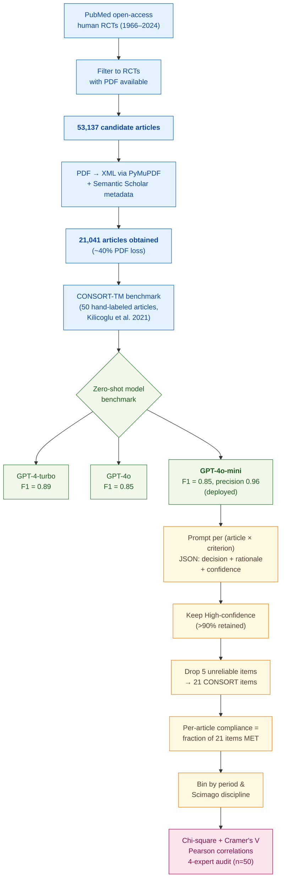

> [!success] **TL;DR**
> GPT-4o-mini's CONSORT-TM performance (F1 = 0.85, precision = 0.96, climbing to F1 = 0.95 on High-confidence predictions) is genuinely impressive and credibly state-of-the-art for zero-shot CONSORT scoring, that result is the paper's strongest contribution and is robust enough to inform a "warn the author at submission" tool.

## Abstract

### Question

How well do randomized clinical trials report the design choices that readers need to judge whether the trial's results can be trusted, and can a general-purpose language model do the checking automatically across tens of thousands of papers? The authors target the CONSORT 2010 checklist, a 25-item reporting standard for clinical trials, and ask both a model question (which off-the-shelf GPT model is best at scoring an article against the checklist?) and an epidemiology question (how has reporting compliance changed over six decades and across medical specialties?). They benchmark three OpenAI models on a hand-labeled corpus, then deploy the winner across more than 21,000 trials. See [[QUE - How has CONSORT reporting quality changed over time across medical disciplines and what LLM approaches can evaluate it at scale?]].

### Methods

**Design.** The authors ran a two-stage study: a zero-shot LLM benchmark on a hand-labeled gold-standard corpus, followed by a large-scale cross-sectional and temporal-trend analysis of CONSORT reporting compliance across nearly six decades of open-access trials.

**Tools.** The authors prompted three OpenAI models (GPT-4-turbo, GPT-4o, and GPT-4o-mini) through a HIPAA-compliant Microsoft Azure deployment (HIPAA is a US health-data privacy law). They converted PDF articles to XML using PyMuPDF (an open-source PDF-parsing library), pulled article metadata from Semantic Scholar, and mapped journals to medical disciplines using Scimago (a journal classification database). The benchmark target was the CONSORT-TM corpus from Kilicoglu et al. 2021; a public dataset of 50 trial articles whose sentences are hand-labeled against 37 CONSORT items by six annotators. Statistics ran in Python 3.8 with chi-square tests, Cramer's V effect sizes, and Pearson correlations.

**Procedure.** For each article, the authors re-prompted the model once per CONSORT criterion. The prompt fed the model the entire article text plus a single criterion definition, and asked for a JSON reply with four fields: criterion name, chain-of-thought rationale, MET or NOT MET decision, and a self-reported confidence rating of Low, Medium, or High (chain-of-thought means the model writes out its reasoning before answering). The authors compared all three GPT models on the 50-article CONSORT-TM benchmark using precision, recall, and F1, and pitted them against the prior state-of-the-art zero-shot result from Lan Jiang et al. 2024. They picked GPT-4o-mini for deployment based on its balance of accuracy and computational cost. They then ran GPT-4o-mini across 21,041 trial PDFs, kept only the High-confidence predictions (which retained more than 90% of articles), and dropped 5 of the 25 CONSORT items that the model could not reliably assess. Per-article compliance was computed as the fraction of the remaining 21 items marked MET. The authors then binned articles by publication period and discipline and tested differences with chi-square. Four human experts (one clinician, three data scientists) hand-checked GPT-4o-mini's outputs on 50 randomly chosen articles.

**Sample.** The authors searched PubMed for human-subjects RCTs available as open-access full text, identified 53,137 candidate trials, and successfully obtained PDFs for 21,041 articles (a roughly 40% loss). All 21,041 articles became the unit of analysis for the large-scale phase. Articles spanned four periods: 1966–1990 (n=2,771), 1990–2000 (n=1,969), 2000–2010 (n=3,765), and 2010–2024 (n=10,447). A 1,790-article subset was further enriched with trial-design metadata from ClinicalTrials.gov.

**At a glance.**

---

### Findings

- **The cheap small model matched the big one.** All three GPT models beat the prior state-of-the-art on CONSORT-TM by more than 40 percentage points on F1 (F1 runs from 0 to 1; higher is better; it balances precision and recall). GPT-4-turbo led with F1 = 0.89, while GPT-4o-mini matched GPT-4o at F1 = 0.85 with the highest precision of the three (0.96, meaning when it says an item is MET, it is right 96% of the time). When the authors restricted to the model's High-confidence predictions, GPT-4o-mini reached F1 = 0.95. Four human experts agreed with GPT-4o-mini's outputs on 92% of cases (83% Correct plus 9% Partially correct). [[EVD - GPT-4o-mini achieved F1 0.85 precision 0.96 on CONSORT-TM outperforming prior state-of-the-art by over 40 percent - @srinivasanEvaluatingReportingQuality2025a]]

- **Reporting has improved a lot, but still falls short.** Across 21,041 trials, the share of CONSORT items reported per article climbed from 27.3% in 1966–1990 to 56.1% in 2010–2024. Each consecutive period beat the last by a wide margin (relative gains of 24%, 33%, and 25%; all p < 0.0001, meaning the differences are extremely unlikely to be chance). Even so, the most recent period sits below 60%, meaning a typical modern trial still leaves out four of every ten checklist items. [[EVD - Overall CONSORT compliance rose from 27.3 percent in 1966-1990 to 56.1 percent in 2010-2024 across 21041 RCTs - @srinivasanEvaluatingReportingQuality2025a]]

- **The most reproducibility-critical items are the most missing.** Only 9.7% of trials described how the random sequence was generated, only 15.25% described how that sequence was concealed from researchers (allocation concealment, the safeguard against rigging which patient gets which treatment), and only 2.22% told readers where to find the trial protocol. By contrast, more than 95% of articles reported the scientific background. The items that matter most for judging whether a trial's results are trustworthy are the items authors leave out most often. [[EVD - Randomization sequence generation reported in only 9.7 percent and allocation concealment in 15.25 percent of RCTs - @srinivasanEvaluatingReportingQuality2025a]]

- **Reporting quality varies sharply by specialty.** The best-reporting field (urology and nephrology, 63.35% of items met) reports nearly twice as many checklist items as the worst (pharmacology, 35.16%). Critical care (62.27%) and gastroenterology and hepatology (60.28%) sit near the top; radiology (40.46%) and pharmacology sit at the bottom. The 28-percentage-point spread suggests that journal-level editorial culture, not the underlying trial science, drives much of the difference. [[EVD - CONSORT compliance varied from 35.16 percent in pharmacology to 63.35 percent in urology-nephrology - @srinivasanEvaluatingReportingQuality2025a]]

### Claim supported

These findings together support two claims: that an off-the-shelf small language model can score trial reporting against a 25-item checklist accurately enough to deploy at scale ([[CLM - LLMs can achieve state-of-the-art CONSORT compliance assessment performance through zero-shot prompting at scale]]), and that decades of CONSORT-driven progress have not closed the gap on the items that matter most for trial credibility ([[CLM - RCT reporting quality has improved substantially over decades but critical methodological gaps persist across all disciplines]]). For someone considering deploying this kind of tool (say, a journal that wants to flag missing CONSORT items at submission) a precision of 0.96 on the High-confidence subset is plausibly good enough for a "warn the author" workflow, but the 8% Partially-correct and 8% Incorrect rates from the human audit mean a hard reject decision should still go through a human.

### Caveats

- **The corpus is open-access only and checks presence, not accuracy.** The 21,041-article corpus is restricted to PubMed open-access PDFs, which over-represent certain journals and disciplines. The model also asks "is this CONSORT item mentioned?" rather than "is the mention accurate or complete?", so a one-sentence randomization claim with no detail counts the same as a thorough description. [[CVT - CONSORT analysis restricted to open-access articles and assessed presence not accuracy of reporting elements]]

## Quality appraisal

> [!info] Risk-of-bias and validity assessment, synthesized from this paper's discourse-graph nodes and grounded in the same paper this page's top trust-signal chips summarize. Covers *methodological quality*, the TRIPOD-LLM table below covers *reporting compliance* instead.
> <dl class="callout-legend">
> <dt>● Low risk</dt><dd>No meaningful threat to this domain identified</dd>
> <dt>◐ Some risk</dt><dd>A real but non-fatal limitation</dd>
> <dt>○ High risk</dt><dd>A significant, unaddressed threat to validity</dd>
> </dl>

| Domain | Rating | Quote |
| --- | :---: | --- |
| **Construct validity**: does the metric actually measure the construct? | 🔴 | *"our assessment focused on the presence of reporting elements rather than their quality or accuracy"* `§5 Discussion and Future Work, p.9` |
| **Internal validity**: could the comparison be biased? | 🟡 | *"we identified four CONSORT items that our model had difficulty accurately assessing... Therefore, we excluded these four items from our final analysis to ensure the reliability of our findings"* `§4.2, p.5` |
| **External validity**: do findings generalize? | 🔴 | *"our analysis was limited to open-access articles, which may not be representative of all published RCTs"* `§5 Discussion and Future Work, p.9` |
| **Statistical conclusion validity**: appropriate uncertainty + comparisons? | 🟡 | *"Statistical significance was evaluated using chi-square tests for categorical comparisons and Pearson correlation for continuous relationships, with effect sizes calculated using Cramer's V"* `§3.5, p.5` |
| **Reproducibility**: code, data, determinism? | 🟡 | *"The complete dataset of 21,041 RCT assessments has been made publicly available for research purposes here: https://github.com/ScienceNLP-Lab/RCT-Transparency"* `§3.1, p.4` |
| **Data leakage**: could models have seen this data pretraining? | 🔴 | Not reported, the paper never discusses whether the CONSORT-TM benchmark or the 21,041-article PubMed corpus (1966–2024) could overlap with GPT-4/GPT-4o-mini's pretraining data |
| **Baseline adequacy**: is there a meaningful floor to beat? | 🟢 | *"a subsequent evaluation of GPT-4's zero-shot capabilities on our target dataset achieved limited performance (F1 score: 0.51) [Jiang et al., 2024]"* `§2 Related Work, p.2` |
| **Train/dev/test hygiene**: are data splits kept separate? | 🔴 | Not reported, the CONSORT-TM validation set (50 articles) and the 21,041-article application corpus are described but no formal train/dev/test partitioning is discussed |
| **Multiple-comparisons correction**: controlled for repeated testing? | 🔴 | Not reported, dozens of per-item, per-discipline, and per-period chi-square/Cramer's V comparisons are run with no stated correction for multiple testing |
| **Human-baseline comparability**: is there a human reference point? | 🟢 | *"with results validated by expert human annotators showing 92.24% agreement across 50 papers"* `Abstract, p.1` |
| **Confidence Intervals**: are point estimates accompanied by an interval? | 🟢 | *"The mean compliance rate increased from 27.3% (95% CI: 27.0-27.6%) in 1966-1990 to 33.9% (95% CI: 33.5-34.3%) in 1990-2000..."* (Srinivasan et al., 2025, p. 6), with 95% CIs reported for every period-compliance estimate in Table 2 |
| **Chance-Corrected Metrics**: does agreement/accuracy correct for chance? | 🔴 | Not reported: the paper's own model-evaluation metrics are exclusively Accuracy/Precision/Recall/F1/Micro-F1 (Table 1-2); a prior corpus's Krippendorff's alpha is cited as background, not used as this paper's own reported metric |
| **Non-Significant Result Spin**: are null or negative findings framed plainly? | 🟢 | *"though the very small effect sizes indicate limited practical significance"* `p.9`, and *"the proportion of variance explained was modest"* `p.14`, the paper explicitly guards against overselling its own statistically-significant trend results |
| **Statistic Accuracy**: do the paper's own reported numbers check out? | 🟢 | *"The mean compliance rate increased from 27.3% (95% CI: 27.0-27.6%)..."* (Srinivasan et al., 2025, p. 6), each reported interval is correctly ordered and consistent with its point estimate across all four periods in Table 2 |
| **Ablation Experiment(s)**: does the paper isolate a component's contribution? | 🔴 | Not reported: Table 1 compares three end-to-end GPT variants and Table 2 stratifies by confidence level, but neither removes/varies a single pipeline component to isolate its contribution, model-comparison and post-hoc filtering, not ablation |
| **Code Quality**: does the released code follow FAIR-software practices? | 🟡 | `howfairis` (fair-software.eu 5-criteria checklist) against https://github.com/ScienceNLP-Lab/RCT-Transparency: **2/5**: open repository + license: no package-registry listing, citation metadata, or quality-checklist badge. |
| **Data Quality**: is the released dataset FAIR? | 🔴 | FAIR-Checker (12 semantic-web metrics, 0-2 each) against https://github.com/ScienceNLP-Lab/RCT-Transparency: **6/24**, includes a +2 top-up for having a real license file, since FAIR-Checker can't see repo content on GitHub pages. |

**Bottom line.** GPT-4o-mini's CONSORT-TM performance (F1 = 0.85, precision = 0.96, climbing to F1 = 0.95 on High-confidence predictions) is genuinely impressive and credibly state-of-the-art for zero-shot CONSORT scoring, that result is the paper's strongest contribution and is robust enough to inform a "warn the author at submission" tool. The epidemiological story (six-decade trend, disciplinary spread, critical-item gaps) is more fragile: it rests on a presence-not-accuracy metric applied to an open-access subset, so the absolute compliance numbers should be read as lower bounds with substantial measurement noise rather than precise prevalence estimates. Before deployment as a reject-decision aid, the tool would need a stricter metric that distinguishes mentioned from adequately described, plus a calibration study on closed-access journals.

> [!tip] **Applicable external appraisal frameworks beyond TRIPOD-LLM** (already covered by the table below): **MI-CLAIM** (Norgeot et al. 2020) for clinical-AI minimum information · **MINIMAR** (Hernandez-Boussard et al. 2020) for medical-AI reporting · **PROBAST+AI** (Wolff et al. 2019 base; AI extension in development) for prediction-model risk of bias

---

## TRIPOD-LLM reporting

> [!info] Reporting compliance for this paper, mapped to the TRIPOD-LLM checklist (Title/Abstract/Introduction items 1–4, Methods items 5a–15, Results items 16a–18). Item 17 (Performance) is reported per-EVD; see each EVD's `## Other Notes`.
> 

> ●Fully reported
> ◐Partial / unclear
> ○Not reported
> –Not applicable
> 

| # | Item | ✓ | Quote |
| --- | --- | :---: | --- |
| **1** | Title | ❌ | *"Evaluating the Reporting Quality of 21,041 Randomized Controlled Trial Articles"* `Title`; the title does not disclose that an LLM was used to perform the evaluation |
| **2** | Abstract | ➖ | Assessed separately under TRIPOD-LLM's own Abstract extension, not scored here |
| **3a** | Background: context + rationale | ✅ | *"Poor reporting is a persistent issue potentially obscuring biases, complicating replication efforts and ultimately undermining the trustworthiness of biomedical science"* `§1, p.2` |
| **3b** | Background: target population | ⚠️ | *"In this paper, we leverage LLMs to evaluate CONSORT reporting in RCT publications at scale."* `§1, p.2`, target population (RCT publications, journal editors, researchers) named through the paper's stated purpose rather than an explicit population statement |
| **4** | Objectives | ✅ | *"We demonstrate that GPT-4o-mini used out of the box achieves state-of-the-art performance in evaluating RCT quality (F1 score: 0.85; precision: 0.96)"* `Abstract, p.1` |
| **5a** | Data sources | ✅ | *"For model evaluation, we used a previously curated dataset called the CONSORT-TM corpus [Kilicoglu et al., 2021] for this study. It consists of 50 RCT publications annotated at the sentence level with 37 CONSORT checklist items."* `§3.1, p.3` |
| **5b** | Data points + distribution | ✅ | *"Articles spanned four time periods: 1966-1990 (n = 2,771), 1990-2000 (n = 1,969), 2000-2010 (n = 3,765), and 2010-2024 (n = 10,447)."* `§3.1, p.3` |
| **5c** | Date range of data | ⚠️ | *"For large-scale analysis, we identified 53,137 open-access human RCTs from PubMed (1966-2024) and successfully obtained 21,041 full-text PDFs."* `§3.1, p.3`, model inference dates and OpenAI training-cutoff dates not stated |
| **5d** | Pre-processing / quality checks | ✅ | *"PDFs were converted to XML using PyMuPDF and enriched"* `§3.1, p.3`, *"with metadata via Semantic Scholar."* `§3.1, p.4` |
| **5e** | Missing / imbalanced data | ⚠️ | *"Second, our analysis was limited to open-access articles, which may not be representative of all published RCTs."* `§5, p.9`, the 53,137 → 21,041 loss on PDF acquisition (~40%) is reported as raw counts but the loss itself is not discussed as a possible source of bias beyond the open-access restriction |
| **6a** | LLM name + version | ⚠️ | *"we consider OpenAI's proprietary models GPT-4, GPT-4o and GPT-4o-mini"* `§3.2, p.4`, Table 1's "GPT-4" row is labeled "GPT-4-turbo"; no dated model snapshots (e.g., gpt-4o-mini-2024-07-18) given |
| **6b** | Development process | ✅ | *"We choose the zero-shot setting as it offers the simplest path towards real-world deployment - it requires minimal engineering, no data labeling, and it can instantly be adapted to any RCT."* `§3.2, p.4` |
| **6c** | Inference settings / prompting | ⚠️ | *"SYSTEM_PROMPT = \"You are a highly skilled medical research assistant with extensive knowledge of randomized controlled trials and CONSORT guidelines...\""* `Appendix, p.S-3`, temperature/top_p/seed not disclosed for the evaluation prompts |
| **6d** | Output | ✅ | *"1. Criterion: The specific criterion being assessed / 2. Rationale: Step-by-step reasoning... / 3. Decision: Output \"MET\"... / 4. Confidence: \"Low\", \"Medium\", or \"High\" confidence"* `§3.2, p.4` |
| **6e** | Classification thresholds | ✅ | *"Based on this clear performance stratification, we restricted all subsequent analyses to high-confidence predictions only."* `§4.2, p.5` |
| **7a** | Quality metrics | ✅ | *"The models were assessed based on their performance across standard binary classification metrics, including precision, recall, and both macro and micro F1 scores."* `§3.3, p.4` |
| **7b** | Relevance to downstream use | ⚠️ | *"Implementing automated pre-submission checks using approaches like ours could provide authors with immediate feedback before peer review, potentially improving reporting quality."* `§5, p.9`, no formal cost/utility/decision-impact analysis |
| **7c** | Outcome definition | ✅ | *"Output \"MET\" if the patient meets the criterion, or it can be inferred that they meet the criterion with common sense. Output \"NOT MET\" if the patient does not, or it is impossible to assess given the provided information"* `§3.2, p.4` |
| **7d** | Subjective interpretation | ✅ | *"conducted human validation using four experts (one clinician, three data scientists) who manually evaluated outputs from 50 randomly selected articles as Correct/Partially Correct/Incorrect"* `§3.3, p.4` |
| **7e** | Comparison | ✅ | *"All GPT models with our prompting scheme substantially outperformed the previous state-of-the-art on CONSORT-TM by over 40%"* `§4.1, p.5` |
| **8a** | Annotation guidelines | ⚠️ | *"we used a previously curated dataset called the CONSORT-TM corpus [Kilicoglu et al., 2021] for this study"* `§3.1, p.3`, CONSORT-TM's own annotation guidelines not re-described here; the 50-article expert-validation rubric (Correct/Partially Correct/Incorrect) is not formally defined |
| **8b** | Annotators + IAA | ⚠️ | *"Six annotators independently annotated 30 articles in pairs, and the calculated Krippendorff's α to measure inter-annotator agreement at the sentence level was 0.57."* `§3.1, p.3`, no IAA reported for the 4-expert validation panel |
| **8c** | Annotator background | ✅ | *"conducted human validation using four experts (one clinician, three data scientists)"* `§3.3, p.4` |
| **9a** | Prompt design | ⚠️ | *"# Task / Your job is to assess whether the given article meets the specified CONSORT criterion and provide justification for your assessment."* `Appendix, p.S-3`, no description of prompt-engineering iterations, ablations, or alternatives tried |
| **9b** | Prompt-development data | ❌ | Not reported |
| **10** | Summarization | ➖ | Not applicable: no summarization endpoint evaluated |
| **11** | Instruction tuning / alignment | ➖ | Not applicable: *"We choose the zero-shot setting"* `§3.2, p.4`, no fine-tuning performed |
| **12** | Compute | ⚠️ | *"We run the GPT models via a secure Azure PHI-compliant instance."* `§3.2, p.4`, GPU/token counts and total cost not reported |
| **13** | Ethical approval | ➖ | Not applicable |
| **14a** | Funding | ❌ | Not reported |
| **14b** | Conflicts of interest | ❌ | Not reported |
| **14c** | Protocol | ❌ | Not reported |
| **14d** | Registration | ➖ | Not applicable: not a registered clinical study |
| **14e** | Data availability | ✅ | *"The complete dataset of 21,041 RCT assessments has been made publicly available for research purposes here: https://github.com/ScienceNLP-Lab/RCT-Transparency"* `§3.1, p.4` |
| **14f** | Code availability | ⚠️ | *"The complete dataset of 21,041 RCT assessments has been made publicly available for research purposes here: https://github.com/ScienceNLP-Lab/RCT-Transparency"* `§3.1, p.4`, same repo cited for the dataset; pipeline/evaluation code not separately confirmed |
| **15** | Patient/public involvement | ➖ | Not applicable |
| **16a** | Flow of data | ✅ | *"For large-scale analysis, we identified 53,137 open-access human RCTs from PubMed (1966-2024) and successfully obtained 21,041 full-text PDFs."* `§3.1, p.3` |
| **16b** | Characteristics | ✅ | *"Articles spanned four time periods: 1966-1990 (n = 2,771), 1990-2000 (n = 1,969), 2000-2010 (n = 3,765), and 2010-2024 (n = 10,447)."* `§3.1, p.3` |
| **16c** | Distribution comparison | ➖ | Not applicable |
| **16d** | N per analysis | ✅ | *"For a subset (n = 1, 790), we extracted NCT numbers and obtained trial characteristics from ClinicalTrials.gov"* `§3.1, p.4` |
| **17** | Performance | `per-EVD` | Reported per-EVD. See each EVD's `## Other Notes`. |
| **18** | LLM updating | ➖ | Not applicable |
