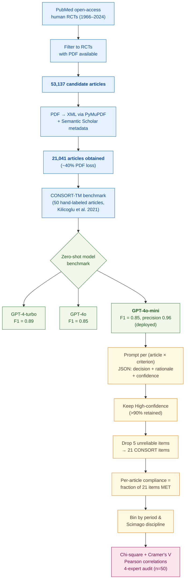

> [!success] **TL;DR**
> GPT-4o-mini's CONSORT-TM performance (F1 = 0.85, precision = 0.96, climbing to F1 = 0.95 on High-confidence predictions) is genuinely impressive and credibly state-of-the-art for zero-shot CONSORT scoring — that result is the paper's strongest contribution and is robust enough to inform a "warn the author at submission" tool.

## Structured abstract

> [!info] A plain-language summary built from this paper's discourse-graph nodes. Numbers and findings link back to specific EVD nodes — click any link to drill in.

### Question

How well do randomized clinical trials report the design choices that readers need to judge whether the trial's results can be trusted, and can a general-purpose language model do the checking automatically across tens of thousands of papers? The authors target the CONSORT 2010 checklist — a 25-item reporting standard for clinical trials — and ask both a model question (which off-the-shelf GPT model is best at scoring an article against the checklist?) and an epidemiology question (how has reporting compliance changed over six decades and across medical specialties?). They benchmark three OpenAI models on a hand-labeled corpus, then deploy the winner across more than 21,000 trials. See [[QUE - How has CONSORT reporting quality changed over time across medical disciplines and what LLM approaches can evaluate it at scale?]].

### Methods

**Design.** The authors ran a two-stage study: a zero-shot LLM benchmark on a hand-labeled gold-standard corpus, followed by a large-scale cross-sectional and temporal-trend analysis of CONSORT reporting compliance across nearly six decades of open-access trials.

**Tools.** The authors prompted three OpenAI models — **GPT-4-turbo**, **GPT-4o**, and **GPT-4o-mini** — through a HIPAA-compliant Microsoft Azure deployment (HIPAA is a US health-data privacy law). They converted PDF articles to XML using **PyMuPDF** (an open-source PDF-parsing library), pulled article metadata from **Semantic Scholar**, and mapped journals to medical disciplines using **Scimago** (a journal classification database). The benchmark target was the **CONSORT-TM corpus** from Kilicoglu et al. 2021 — a public dataset of 50 trial articles whose sentences are hand-labeled against 37 CONSORT items by six annotators. Statistics ran in Python 3.8 with chi-square tests, Cramer's V effect sizes, and Pearson correlations.

**Procedure.** For each article, the authors re-prompted the model once per CONSORT criterion. The prompt fed the model the entire article text plus a single criterion definition, and asked for a JSON reply with four fields: criterion name, chain-of-thought rationale, MET or NOT MET decision, and a self-reported confidence rating of Low, Medium, or High (chain-of-thought means the model writes out its reasoning before answering). The authors compared all three GPT models on the 50-article CONSORT-TM benchmark using precision, recall, and F1, and pitted them against the prior state-of-the-art zero-shot result from Lan Jiang et al. 2024. They picked GPT-4o-mini for deployment based on its balance of accuracy and computational cost. They then ran GPT-4o-mini across 21,041 trial PDFs, kept only the High-confidence predictions (which retained more than 90% of articles), and dropped 5 of the 25 CONSORT items that the model could not reliably assess. Per-article compliance was computed as the fraction of the remaining 21 items marked MET. The authors then binned articles by publication period and discipline and tested differences with chi-square. Four human experts (one clinician, three data scientists) hand-checked GPT-4o-mini's outputs on 50 randomly chosen articles.

**Sample.** The authors searched PubMed for human-subjects RCTs available as open-access full text, identified **53,137 candidate trials**, and successfully obtained PDFs for **21,041 articles** (a roughly 40% loss). All 21,041 articles became the unit of analysis for the large-scale phase. Articles spanned four periods: 1966–1990 (n=2,771), 1990–2000 (n=1,969), 2000–2010 (n=3,765), and 2010–2024 (n=10,447). A 1,790-article subset was further enriched with trial-design metadata from ClinicalTrials.gov.

### Findings

- **The cheap small model matched the big one.** All three GPT models beat the prior state-of-the-art on CONSORT-TM by more than 40 percentage points on F1 (F1 runs from 0 to 1; higher is better; it balances precision and recall). GPT-4-turbo led with F1 = 0.89, while GPT-4o-mini matched GPT-4o at F1 = 0.85 with the highest precision of the three (0.96 — meaning when it says an item is MET, it is right 96% of the time). When the authors restricted to the model's High-confidence predictions, GPT-4o-mini reached F1 = 0.95. Four human experts agreed with GPT-4o-mini's outputs on 92% of cases (83% Correct plus 9% Partially correct). [[EVD - GPT-4o-mini achieved F1 0.85 precision 0.96 on CONSORT-TM outperforming prior state-of-the-art by over 40 percent - @srinivasanEvaluatingReportingQuality2025a]]

- **Reporting has improved a lot, but still falls short.** Across 21,041 trials, the share of CONSORT items reported per article climbed from 27.3% in 1966–1990 to 56.1% in 2010–2024. Each consecutive period beat the last by a wide margin (relative gains of 24%, 33%, and 25%; all p < 0.0001 — meaning the differences are extremely unlikely to be chance). Even so, the most recent period sits below 60% — meaning a typical modern trial still leaves out four of every ten checklist items. [[EVD - Overall CONSORT compliance rose from 27.3 percent in 1966-1990 to 56.1 percent in 2010-2024 across 21041 RCTs - @srinivasanEvaluatingReportingQuality2025a]]

- **The most reproducibility-critical items are the most missing.** Only 9.7% of trials described how the random sequence was generated, only 15.25% described how that sequence was concealed from researchers (allocation concealment, the safeguard against rigging which patient gets which treatment), and only 2.22% told readers where to find the trial protocol. By contrast, more than 95% of articles reported the scientific background. The items that matter most for judging whether a trial's results are trustworthy are the items authors leave out most often. [[EVD - Randomization sequence generation reported in only 9.7 percent and allocation concealment in 15.25 percent of RCTs - @srinivasanEvaluatingReportingQuality2025a]]

- **Reporting quality varies sharply by specialty.** The best-reporting field (urology and nephrology, 63.35% of items met) reports nearly twice as many checklist items as the worst (pharmacology, 35.16%). Critical care (62.27%) and gastroenterology and hepatology (60.28%) sit near the top; radiology (40.46%) and pharmacology sit at the bottom. The 28-percentage-point spread suggests that journal-level editorial culture, not the underlying trial science, drives much of the difference. [[EVD - CONSORT compliance varied from 35.16 percent in pharmacology to 63.35 percent in urology-nephrology - @srinivasanEvaluatingReportingQuality2025a]]

### Claim supported

These findings together support two claims: that an off-the-shelf small language model can score trial reporting against a 25-item checklist accurately enough to deploy at scale ([[CLM - LLMs can achieve state-of-the-art CONSORT compliance assessment performance through zero-shot prompting at scale]]), and that decades of CONSORT-driven progress have not closed the gap on the items that matter most for trial credibility ([[CLM - RCT reporting quality has improved substantially over decades but critical methodological gaps persist across all disciplines]]). For someone considering deploying this kind of tool — say, a journal that wants to flag missing CONSORT items at submission — a precision of 0.96 on the High-confidence subset is plausibly good enough for a "warn the author" workflow, but the 8% Partially-correct and 8% Incorrect rates from the human audit mean a hard reject decision should still go through a human.

### Caveats

- **The corpus is open-access only and checks presence, not accuracy.** The 21,041-article corpus is restricted to PubMed open-access PDFs, which over-represent certain journals and disciplines. The model also asks "is this CONSORT item mentioned?" rather than "is the mention accurate or complete?" — so a one-sentence randomization claim with no detail counts the same as a thorough description. [[CVT - CONSORT analysis restricted to open-access articles and assessed presence not accuracy of reporting elements]]

### Methods at a glance

---

## Critical appraisal

> [!info] A risk-of-bias and validity assessment across five domains, synthesized from this paper's discourse-graph nodes. Each domain gets a rating (🟢 Low risk · 🟡 Some concerns · 🔴 High risk) plus a brief, EVD-grounded justification. The TRIPOD-LLM table below covers *reporting compliance*; this section covers *methodological quality*.

| Domain | Rating | Justification |
| --- | :---: | --- |
| **Construct validity** — does the metric actually measure the construct? | 🔴 | The model is trained to detect *whether* an item is mentioned, not whether it is reported correctly or completely — the authors say so plainly (see [[CVT - CONSORT analysis restricted to open-access articles and assessed presence not accuracy of reporting elements]]). A trial that says "patients were randomized" in passing scores the same as one that fully describes the random-sequence procedure. The headline "compliance" therefore over-states real reporting quality, and the temporal-trend story confounds genuine improvement with growing boilerplate use of CONSORT vocabulary. |
| **Internal validity** — could the comparison be biased? | 🟡 | The CONSORT-TM benchmark gives a defensible head-to-head between GPT-4-turbo, GPT-4o, and GPT-4o-mini, and the comparison to Lan Jiang et al.'s prior state-of-the-art uses the same gold-standard test set. But the inter-annotator agreement on CONSORT-TM (Krippendorff's α = 0.57 — moderate at best) caps how reliably any model can be scored, and the dropping of 5 items post-hoc because the model could not assess them well risks circular evaluation. The 92.24% expert-agreement number combines "Correct" and "Partially correct" — a loose definition of agreement. |
| **External validity** — do findings generalize? | 🔴 | The 21,041-article corpus is open-access PubMed only, missing roughly 40% of the candidate articles (PDF acquisition failed) and excluding all closed-access journals — likely the highest-circulation specialty journals. The Scimago discipline assignments inherit whatever bias lives in the open-access subset of each field. Findings about temporal trends and disciplinary spread should be read as "trends among open-access PubMed trials," not "trends in the global RCT literature". |
| **Statistical rigor** — appropriate uncertainty + comparisons? | 🟡 | The authors do report 95% confidence intervals on per-period compliance and use chi-square with Cramer's V effect sizes for group comparisons. But there is no multiple-comparison correction across the dozens of per-item, per-discipline, and per-period contrasts, no confidence intervals on F1 in the model benchmark, and no power analysis for the rare-but-important items (e.g., protocol access at 2.22%). The very large n masks the fact that many sub-comparisons rest on small effective sample sizes. |
| **Reproducibility** — code, data, determinism? | 🟡 | The 21,041-article assessment dataset is publicly released on GitHub and Hugging Face (apoorvasrinivasan/CONSORT-21K), and the CONSORT-TM corpus was already public — strong on data. But OpenAI inference parameters (temperature, top_p, seed, system prompt) are not reported, and the model identifiers are loose ("GPT-4", "GPT-4o", "GPT-4o-mini" without dated snapshots like gpt-4o-mini-2024-07-18). Anyone re-running the pipeline against a refreshed model snapshot will get different numbers and cannot tell whether the change is real drift or stochastic decoding. |

**Bottom line.** GPT-4o-mini's CONSORT-TM performance (F1 = 0.85, precision = 0.96, climbing to F1 = 0.95 on High-confidence predictions) is genuinely impressive and credibly state-of-the-art for zero-shot CONSORT scoring — that result is the paper's strongest contribution and is robust enough to inform a "warn the author at submission" tool. The epidemiological story (six-decade trend, disciplinary spread, critical-item gaps) is more fragile: it rests on a presence-not-accuracy metric applied to an open-access subset, so the absolute compliance numbers should be read as lower bounds with substantial measurement noise rather than precise prevalence estimates. Before deployment as a reject-decision aid, the tool would need a stricter metric that distinguishes mentioned from adequately described, plus a calibration study on closed-access journals.

> [!tip] **Applicable external appraisal frameworks beyond TRIPOD-LLM** (already covered by the table below): **MI-CLAIM** (Norgeot et al. 2020) for clinical-AI minimum information · **MINIMAR** (Hernandez-Boussard et al. 2020) for medical-AI reporting · **PROBAST+AI** (Wolff et al. 2019 base; AI extension in development) for prediction-model risk of bias

---

## TRIPOD-LLM reporting summary

> [!info] Reporting compliance for this paper, mapped to the TRIPOD-LLM checklist (Methods items 5a–15 and Results items 16a–18). Compliance icons: ✅ fully reported · ⚠️ partially reported / unclear · ❌ should be reported but not reported · ➖ not applicable to this study. Item 17 (Performance) is reported per-EVD; see each EVD's `## Other Notes`.

| # | Item | ✓ | Reported in this study |
| --- | --- | :---: | --- |
| **5a** | Data sources | ✅ | Two data sources: (1) CONSORT-TM evaluation corpus (Kilicoglu et al. 2021) — 50 RCT publications annotated at sentence level for 37 CONSORT items; (2) 21,041 open-access human RCTs from PubMed (1966–2024) for the large-scale analysis. PDFs converted to XML via PyMuPDF; metadata enriched via Semantic Scholar; trial characteristics for n=1,790 subset enriched via ClinicalTrials.gov. |
| **5b** | Data points + distribution | ✅ | Large-scale corpus: 21,041 articles split across four periods — 1966–1990 (n=2,771), 1990–2000 (n=1,969), 2000–2010 (n=3,765), 2010–2024 (n=10,447). Discipline distribution shown in Fig. 2C. CONSORT-TM corpus: 50 articles, 37 sentence-level item annotations. |
| **5c** | Date range of data | ✅ | Articles span 1966–2024 (publication dates). Model inference dates not explicitly disclosed; OpenAI training cutoffs not reported. |
| **5d** | Pre-processing / quality checks | ⚠️ | PDFs converted to XML via PyMuPDF; Semantic Scholar metadata enrichment; ClinicalTrials.gov enrichment for n=1,790 subset. No description of XML-extraction quality checks or text-cleaning steps. Confidence-level filtering used as a downstream quality check (>90% of articles retained). |
| **5e** | Missing / imbalanced data | ⚠️ | 53,137 → 21,041 articles after PDF-acquisition success (~40% loss). Restriction to open-access PMC introduces obvious sampling bias (acknowledged in Limitations). Class imbalance / per-item base-rate distribution not reported. Five CONSORT items dropped post-hoc because reported in <5% of articles or systematically misclassified (2a, 7b, 3b, 6b, 14b). |
| **6a** | LLM name + version | ⚠️ | "GPT-4", "GPT-4o", "GPT-4o-mini" referenced; in Table 1 the GPT-4 row is labeled "GPT-4-turbo". Specific dated model snapshots (e.g., gpt-4o-mini-2024-07-18) not given. |
| **6b** | Development process | ➖ | No model training; zero-shot evaluation only. |
| **6c** | Inference settings / prompting | ⚠️ | Prompt template shown in Fig. 1A and described verbally (task instruction + article + criterion + definition → JSON output). Inference parameters (temperature, top_p, seed, system prompt, max tokens) not reported. Azure PHI-compliant deployment noted. |
| **6d** | Output | ✅ | JSON with four fields: Criterion, Rationale (chain-of-thought), Decision (MET / NOT MET), Confidence (Low / Medium / High). |
| **6e** | Classification thresholds | ✅ | Binary MET / NOT MET classification with self-reported confidence stratification; only High-confidence predictions retained for deployment analysis (>90% of articles). No probability thresholds reported. |
| **7a** | Quality metrics | ✅ | Accuracy, precision, recall, F1, micro-F1 reported for binary classification (Table 1); confidence-stratified metrics in Table 2; chi-square + Cramer's V for downstream group comparisons; Pearson correlation for citation-impact analysis. |
| **7b** | Relevance to downstream | ⚠️ | Implicit — authors argue automated CONSORT assessment can power journal-submission tools and per-author feedback; no formal cost / utility / decision-impact analysis. |
| **7c** | Outcome definition | ✅ | Per-criterion binary MET / NOT MET against CONSORT-TM gold sentence-level annotations for benchmark; per-article CONSORT compliance = mean over 21 retained items for downstream. |
| **7d** | Subjective interpretation | ✅ | Self-reported model confidence used to filter; 4-expert (1 clinician, 3 data scientists) human validation of GPT-4o-mini outputs on 50 random articles (83.42% Correct, 8.82% Partial, 7.76% Incorrect; combined 92.24% "agreement"). |
| **7e** | Comparison | ✅ | Three OpenAI models compared head-to-head; baseline = Lan Jiang et al. (2024) zero-shot GPT-4 on the same dataset (F1 0.51 vs. their 0.85–0.89). |
| **8a** | Annotation guidelines | ⚠️ | CONSORT-TM annotation guidelines not described in this paper (referenced via Kilicoglu et al. 2021). For the 50-article expert validation, the Correct / Partially Correct / Incorrect rubric is not formally defined. |
| **8b** | Annotators + IAA | ⚠️ | CONSORT-TM: 6 annotators, sentence-level Krippendorff's α = 0.57 reported. Expert validation: 4 experts, no IAA reported (only aggregate Correct/Partial/Incorrect rates). |
| **8c** | Annotator background | ✅ | Expert validation panel: 1 clinician, 3 data scientists. CONSORT-TM annotator background per Kilicoglu et al. 2021 — not re-described here. |
| **9a** | Prompt design | ⚠️ | Prompt template shown in Fig. 1A and verbally described (task + article + criterion + definition; chain-of-thought rationale + confidence requested). No description of prompt-engineering iterations, ablations, or alternatives tried. |
| **9b** | Prompt-development data | ❌ | No prompt-development / dev-set strategy reported. |
| **10** | Summarization | ➖ | Not applicable. |
| **11** | Instruction tuning / alignment | ➖ | Not applicable (zero-shot, no fine-tuning). |
| **12** | Compute | ❌ | Not reported. Only "secure Azure PHI-compliant instance" mentioned; cost / GPU-hours / token counts absent. |
| **13** | Ethical approval | ➖ | Not applicable (analysis of published articles; no human-subjects data). |
| **14a** | Funding | ❌ | No funding statement in the preprint as read. |
| **14b** | Conflicts of interest | ❌ | No COI statement in the preprint as read. |
| **14c** | Protocol | ❌ | Not reported. |
| **14d** | Registration | ➖ | Not applicable (not a clinical study). |
| **14e** | Data availability | ✅ | Full dataset of 21,041 RCT assessments at github.com/ScienceNLP-Lab/RCT-Transparency and as huggingface dataset apoorvasrinivasan/CONSORT-21K. CONSORT-TM corpus public via the same GitHub repo. |
| **14f** | Code availability | ⚠️ | Same GitHub repo cited for "complete dataset" but explicit pipeline/code release not separately confirmed in the text. |
| **15** | Patient/public involvement | ➖ | Not applicable. |
| **16a** | Flow of data | ✅ | 53,137 PubMed open-access RCTs identified → 21,041 full-text PDFs obtained → CONSORT assessment via GPT-4o-mini → confidence-filtered to >90% of articles → expert validation on 50 of these → metadata enrichment (Semantic Scholar; ClinicalTrials.gov for n=1,790) → trend analysis. Shown in Fig. 1B. |
| **16b** | Characteristics | ✅ | Period bins (n per period); discipline (Scimago); trial phase; lead-sponsor type; FDA-regulated status; data-monitoring-committee presence; serious-adverse-event reporting; mortality reporting; continental region; blinding method (Fig. 3). |
| **16c** | Distribution comparison | ➖ | Not applicable (no clinical-outcome subgroup comparison; corpus characterization rather than clinical-population comparison). |
| **16d** | N per analysis | ✅ | Per-period n given; per-discipline groups shown in Fig. 2C; trial-characteristics subset n=1,790 (ClinicalTrials.gov enrichment). |
| **17** | Performance | (per-EVD) | Reported per-EVD. See each EVD's `## Other Notes`. |
| **18** | LLM updating | ➖ | Not applicable (no model updating reported). |
