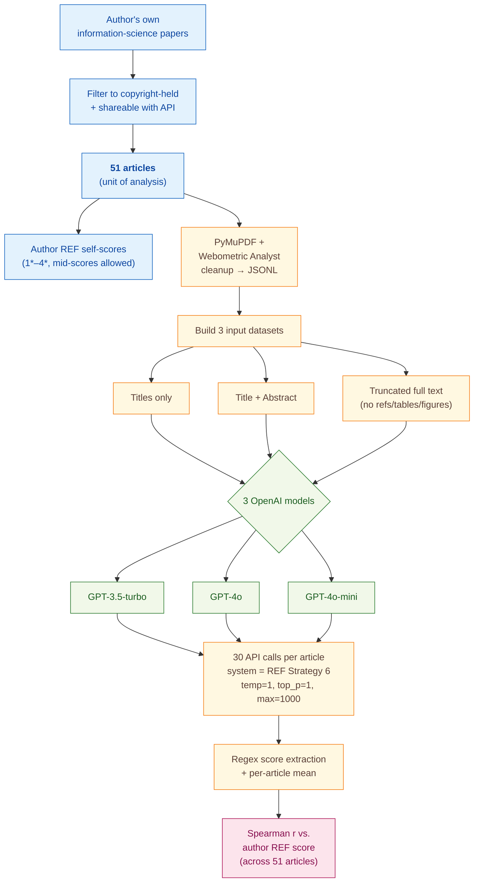

> [!success] **TL;DR**
> The result that abstracts beat full text — counterintuitive but consistent across three models — is a useful and cheap finding for anyone building LLM-assisted quality-screening tools. But the headline r=0.678 should be read as the upper bound of what a single expert can predict about his own work, not as evidence that ChatGPT can grade research at REF-panel quality.

## Structured abstract

> [!info] A plain-language summary built from this paper's discourse-graph nodes. Numbers and findings link back to specific EVD nodes — click any link to drill in.

### Question

When you ask ChatGPT to score how good a research paper is, what part of the paper should you actually feed it: the title, the title plus abstract, or the trimmed-down full text? The author tests three input formats across three OpenAI models and checks which one produces scores that line up best with a human expert's quality ratings. The benchmark is the UK's Research Excellence Framework (REF) — a national exercise that grades research on a 1* to 4* scale, where 4* means "world-leading". See [[QUE - What is the optimal input format for LLM-based research quality assessment?]].

### Methods

**Design.** The author ran a single-author convenience-sample experiment on 51 of his own information-science articles, comparing three OpenAI models against three input formats while holding the prompt and parameters constant.

**Tools.** The pipeline relied on the OpenAI ChatGPT API in three flavours — GPT-3.5-turbo, GPT-4o, and GPT-4o-mini (the cheaper, smaller GPT-4o variant). The system prompt was the full text of the REF 2019 Main Panel D scoring guidelines (used by UK reviewers in social sciences). PDFs were converted to text using PyMuPDF (an open-source PDF parser) plus Webometric Analyst (the author's own toolkit for cleaning headers, footers, and merging paragraphs). Score extraction used regex pattern-matching on the free-text reports the model wrote.

**Procedure.** The author first built three parallel input datasets from the same 51 papers: titles only, titles plus abstracts, and "truncated full text" (the body minus references, tables, figures, authors, and keywords). For each combination of model and input format, the author sent 30 separate API calls per article, with temperature set to 1 (the default) and a 1000-token output cap. Each call carried the same REF guidelines as a system prompt and a user prompt of "Score the following journal article: " followed by the text. The author then extracted the 1*–4* score from each free-text report using regex rules, averaged the 30 scores per article, and computed the Spearman rank correlation (Spearman r runs from -1 to 1; 1 means the model's ranking of papers perfectly matches the human's; 0 means no relationship) between the model's average score and his own REF score across all 51 papers. To check how many iterations are needed, the author also computed correlations for every k from 1 to 30 using subset permutations.

**Sample.** The author drew on his own information-science output, restricted to articles he held copyright over and could legally feed to the API, ending at 51 articles (a mix of published, prepared-for-submission, and rejected pieces). He scored each one himself on the REF 1*–4* scale, allowing half-stars for borderline cases. The unit of analysis is the article. There is one human rater — the author, who also wrote every paper.

### Findings

- **Title plus abstract beat full text across the board.** GPT-4o on title-plus-abstract reached a Spearman correlation of 0.678 with the author's REF scores after averaging 30 iterations — the highest the author has ever reported and above the prior benchmark of 0.51 from the ChatGPT-4 web interface on full PDFs. A linear regression mapping model scores onto the REF scale cut the average error by 31% versus simply guessing the corpus mean of 2.75. [[EVD - GPT-4o abstracts achieved Spearman r=0.67 with human quality scores on 51 information science articles the highest reported - @thelwallEvaluatingResearchQuality2024]]

- **Feeding more text actually hurt the model.** All three ChatGPT models scored worse on truncated full text than on title-plus-abstract. GPT-3.5-turbo dropped from 0.674 (abstracts) to 0.625 (full text), GPT-4o-mini dropped from 0.571 to 0.506, and GPT-4o was essentially tied at 0.678 versus 0.675. Title-only input dropped further — to 0.434 for GPT-3.5-turbo. The author's interpretation is that the abstract concentrates the originality and significance signals while the full text dilutes them with noise the model partially attends to. [[EVD - Full text input produced lower Spearman correlations than abstracts for all three ChatGPT models tested - @thelwallEvaluatingResearchQuality2024]]

### Claim supported

These findings collectively support the claim that [[CLM - Abstracts are the optimal input for LLM-based research quality assessment outperforming full text]]. The practical implication is counterintuitive but actionable: anyone building an LLM-assisted research-quality tool should default to feeding titles and abstracts rather than the whole paper, which is also faster and roughly 100x cheaper at API rates.

### Caveats

- **Single author, single field, self-scored ground truth.** The 51 articles are all written by the author and graded by the author against his own memory of the REF scale. The "human ground truth" is therefore one person's self-evaluation in one narrow subfield, not a panel-level REF score from independent reviewers. [[CVT - The Thelwall dataset consisted of 51 articles by a single author limiting generalizability to other researchers and fields]]

### Methods at a glance

---

## Quality appraisal

> [!info] Risk-of-bias and validity assessment, synthesized from this paper's discourse-graph nodes and grounded in the same paper this page's top trust-signal chips summarize. Covers *methodological quality* — the TRIPOD-LLM table below covers *reporting compliance* instead.
> <dl class="callout-legend">
> <dt>● Low risk</dt><dd>No meaningful threat to this domain identified</dd>
> <dt>◐ Some risk</dt><dd>A real but non-fatal limitation</dd>
> <dt>○ High risk</dt><dd>A significant, unaddressed threat to validity</dd>
> </dl>

| Domain | Rating | Quote |
| --- | :---: | --- |
| **Construct validity**: does the metric actually measure the construct? | 🟡 | *"it should not be used for peer review of conference papers or journal articles and also not for promotion and hiring decisions"* `§5 Conclusion, p.15` |
| **Internal validity**: could the comparison be biased? | 🟡 | *"ChatGPT might have learned that some of the articles had attracted attention online or were associated with highly regarded journals even if only fed with an article's title and abstract"* `§4 Discussion, p.12` |
| **External validity**: do findings generalize? | 🔴 | *"This study has many limitations, the most important of which is the restriction to a relatively small number of articles written by single person"* `§4 Discussion, p.12` |
| **Statistical rigor**: appropriate uncertainty + comparisons? | 🟡 | *"The standard deviation was calculated to estimate confidence intervals for the mean correlation from a single iteration with the t distribution"* `§2.5, p.6` |
| **Reproducibility**: code, data, determinism? | 🟡 | *"converted to text with PyMuPDF in Python (Convert_academic_pdf_to_jsonl.py in https://github.com/MikeThelwall/Python_misc)"* `§2.1, p.4` |
| **Data leakage**: could models have seen this data pretraining? | 🔴 | Not reported, the paper never assesses whether the 51 articles (several already published) were present in ChatGPT's pretraining data, though it speculates elsewhere that ChatGPT "might have learned that some of the articles had attracted attention online" |
| **Baseline adequacy**: is there a meaningful floor to beat? | 🟡 | *"They are nevertheless slightly better than the baseline strategy of assigning all articles the average score (2.75)"* `§3.4, p.11` |
| **Train/dev/test hygiene**: are data splits kept separate? | 🔴 | *"In machine learning it is typical to use separate development and training sets to allow an AI system to be configured with data that it is not tested on. This was not done in this case"* `§2.2, p.4` |
| **Multiple-comparisons correction**: controlled for repeated testing? | 🔴 | Not reported, correlations across nine model-by-input cells (Table 1) and seven system-prompt strategies (Figure 4) are compared with no stated correction for multiple testing |
| **Human-baseline comparability**: is there a human reference point? | 🟡 | *"the author's scores are less relevant than the scores of more independent and less expert (on this topic) senior researchers, who would be the ones forming the evaluations in the most important context"* `§2.1, p.4` |

**Bottom line.** The result that abstracts beat full text — counterintuitive but consistent across three models — is a useful and cheap finding for anyone building LLM-assisted quality-screening tools. But the headline r=0.678 should be read as the upper bound of what a single expert can predict about his own work, not as evidence that ChatGPT can grade research at REF-panel quality. Before this becomes deployment-ready, the experiment needs to repeat on a multi-author, multi-field corpus with independent reviewer panels and pinned model snapshots.

> [!tip] **Applicable external appraisal frameworks beyond TRIPOD-LLM** (already covered by the table below): **HELM** (Liang et al. 2022) for holistic LLM-evaluation principles · **Datasheets for Datasets** (Gebru et al. 2021) for the evaluation corpus · **Model Cards** (Mitchell et al. 2019) for the LLMs being evaluated

---

## TRIPOD-LLM reporting summary

> [!info] Reporting compliance for this paper, mapped to the TRIPOD-LLM checklist (Title/Abstract/Introduction items 1–4, Methods items 5a–15, Results items 16a–18). TRIPOD-LLM is a clinical-ML guideline being applied here to a non-clinical AI-research benchmark — where an item's own wording says "healthcare context" or "care pathway," it's read as "research-evaluation context" / "research workflow" instead. Item 17 (Performance) is reported per-EVD; see each EVD's `## Other Notes`.
> 

> ●Fully reported
> ◐Partial / unclear
> ○Not reported
> –Not applicable
> 

| # | Item | ✓ | Quote |
| --- | --- | :---: | --- |
| **1** | Title | ✅ | *"Evaluating Research Quality with Large Language Models: An Analysis of ChatGPT's Effectiveness with Different Settings and Inputs"* `Title` |
| **2** | Abstract | ➖ | Assessed separately under TRIPOD-LLM's own Abstract extension, not scored here |
| **3a** | Background — context + rationale | ✅ | *"Evaluating the quality of academic research is necessary for many national research evaluation exercises, such as in UK and New Zealand (Buckle & Creedy, 2024; Sivertsen, 2017), as well as for appointments, promotions, and tenure"* `§1, p.1` |
| **3b** | Background — target population | ⚠️ | *"The raw data for this paper is a set of 51 information science journal articles that have either been published or prepared for submission and subsequently rejected or not submitted."* `§2.1, p.3` — defines the study's own corpus but not a broader target population beyond the author's own field |
| **4** | Objectives | ✅ | *"RQ1: What is the optimal input for ChatGPT post-publication research quality assessment: full text, abstract, or title only?"* `§1, p.3` |
| **5a** | Data sources | ✅ | *"The raw data for this paper is a set of 51 information science journal articles that have either been published or prepared for submission and subsequently rejected or not submitted. All were written by the author, who has copyright"* `§2.1, p.3` |
| **5b** | Data points + distribution | ⚠️ | *"Table 2. Average humans scores and model average scores."* `Table 2, p.8` — corpus size (n=51) and overall human-score mean (2.75) reported, but per-article topic/length distribution and the count per REF score level are not tabulated |
| **5c** | Date range of data | ⚠️ | *"The queries were all submitted in July 2024."* `§2, p.3` — publication-date range of the 51 source articles not reported; only the API-inference month is given, and OpenAI training cutoffs are not disclosed |
| **5d** | Pre-processing / quality checks | ✅ | *"The PDF documents were converted to text with PyMuPDF in Python (Convert_academic_pdf_to_jsonl.py in https://github.com/MikeThelwall/Python_misc)."* `§2.1, p.4` |
| **5e** | Missing / imbalanced data | ⚠️ | *"For example, if two of the 30 scores for article 1 were missing, then the article 1 average score would be the average of the remaining 28."* `§2.4, p.5` |
| **6a** | LLM name + version | ⚠️ | *"ChatGPT 4o is slightly better than 3.5-turbo (0.66), and 4o-mini (0.66)."* `Findings, p.1` — model families named but no dated snapshot IDs; only "the queries were all submitted in July 2024" gives an inference window |
| **6b** | Development process | ➖ | Not applicable — off-the-shelf ChatGPT API models used with no fine-tuning or training of the LLMs themselves |
| **6c** | Inference settings / prompting | ✅ | *"The maximum temperature parameter was set to 1, the default, the top_p parameter was also set to its default of 1, and the max_tokens parameter was set to 1000"* `§2.2, p.5` |
| **6d** | Output | ✅ | *"Score the following journal article: "* `§2.2, p.5` — free-text report containing an embedded 1*–4* score |
| **6e** | Classification thresholds | ✅ | *"one rule was to extract the number between "Overall Score**: **" and "*""* `§2.4, p.5` |
| **7a** | Quality metrics | ✅ | *"Spearman correlations were used to assess the extent to which the 51 human scores agreed with the ChatGPT scores"* `§2.5, p.5` |
| **7b** | Relevance to downstream | ⚠️ | *"it should not be used for peer review of conference papers or journal articles and also not for promotion and hiring decisions"* `§5, p.15` — caution against real deployment given but no formal downstream-utility quantification |
| **7c** | Outcome definition | ✅ | *"All were written by the author, who has copyright, and were scored by him using the REF quality scale of 1*, 2*, 3* or 4* (REF, 2019)"* `§2.1, p.3` |
| **7d** | Subjective interpretation | ⚠️ | *"This dataset is not ideal since (a) it is part of a single author's output and therefore not representative even of its field, (b) the author's scores are less relevant than the scores of more independent and less expert (on this topic) senior researchers"* `§2.1, p.3` |
| **7e** | Comparison | ✅ | *"The results improve on the prior attempt to predict REF scores on the same set of articles with ChatGPT 4 using the web interface"* `§4.1, p.12` |
| **8a** | Annotation guidelines | ✅ | *"The main system prompt used was like that used in the previous paper and consists of the REF guidelines for the research area (Main Panel D)"* `§2.2, p.4` |
| **8b** | Annotators + IAA | ⚠️ | *"This study has many limitations, the most important of which is the restriction to a relatively small number of articles written by single person."* `§4, p.12` — single self-evaluator, no inter-annotator agreement possible |
| **8c** | Annotator background | ✅ | *"scored by him using the REF quality scale of 1*, 2*, 3* or 4* (REF, 2019), with which he is familiar"* `§2.1, p.3` |
| **9a** | Prompt design | ✅ | *"Six variations of the basic REF prompt were tested to assess whether alternative prompts might give better results."* `§2.3, p.5` |
| **9b** | Prompt-development data | ⚠️ | *"This exercise consisted: of (a) fruitless tests with different prompts to try to get the score prediction to be reported more consistently, and (b) fruitless experiments with attempts to get score predictions from DOIs or full text URLs."* `§2.2, p.4` |
| **10** | Summarization | ➖ | Not applicable — scoring task, not summarization |
| **11** | Instruction tuning / alignment | ➖ | Not applicable — off-the-shelf models, no fine-tuning or alignment performed |
| **12** | Compute | ⚠️ | *"API calls with ChatGPT 4o are ten times more expensive than calls with ChatGPT 3.5-turbo and twenty times more expensive than ChatGPT 4o-mini calls (as of July 2024)"* `§3.2, p.8` — cost ratio given but no token counts or wall-clock time |
| **13** | Ethical approval | ➖ | Not applicable — no human subjects beyond the investigator-author scoring his own work |
| **14a** | Funding | ❌ | Not reported |
| **14b** | Conflicts of interest | ❌ | Not reported |
| **14c** | Protocol | ❌ | Not reported |
| **14d** | Registration | ➖ | Not applicable — not a registered clinical study |
| **14e** | Data availability | ❌ | *"The scores given to these papers have never been disclosed to anyone else or uploaded to any Artificial Intelligence (AI) system."* `§2.1, p.3` — describes non-disclosure to date, but no future public-release plan is stated for the 51 texts or scores |
| **14f** | Code availability | ✅ | *"Convert_academic_pdf_to_jsonl.py in https://github.com/MikeThelwall/Python_misc"* `§2.1, p.4` |
| **15** | Patient/public involvement | ➖ | Not applicable |
| **16a** | Flow of data | ⚠️ | *"For each experiment, the ChatGPT completion requests were carried out consecutively and then repeated a further 29 times to give 30 scores for each article."* `§2, p.3` — iteration flow given, no diagram of API-call success/failure |
| **16b** | Characteristics | ⚠️ | *"the papers are relatively homogeneous in topic, giving more scope for AI to differentiate quality differences from topic differences."* `§2.1, p.3` |
| **16c** | Distribution comparison | ➖ | Not applicable — no train/test split or subgroup comparison |
| **16d** | N per analysis | ✅ | *"Averaging 2 or 28 iterations. In both cases there are 30x29=870 permutations of sets of iterations to average"* `§2.5, p.6` |
| **17** | Performance | `per-EVD` | Reported per-EVD. See each EVD's `## Other Notes` for the EVD-specific Spearman, MAD, and regression numbers. |
| **18** | LLM updating | ➖ | Not applicable — no model updating performed |
