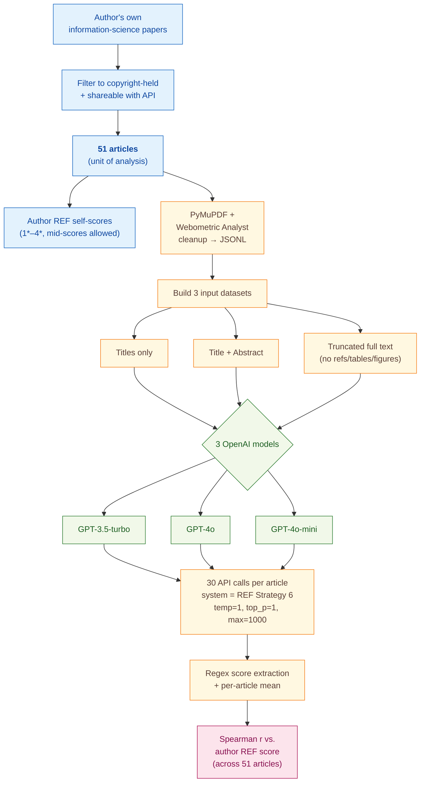

> [!success] **TL;DR**
> The result that abstracts beat full text — counterintuitive but consistent across three models — is a useful and cheap finding for anyone building LLM-assisted quality-screening tools. But the headline r=0.678 should be read as the upper bound of what a single expert can predict about his own work, not as evidence that ChatGPT can grade research at REF-panel quality.

## Structured abstract

> [!info] A plain-language summary built from this paper's discourse-graph nodes. Numbers and findings link back to specific EVD nodes — click any link to drill in.

### Question

When you ask ChatGPT to score how good a research paper is, what part of the paper should you actually feed it: the title, the title plus abstract, or the trimmed-down full text? The author tests three input formats across three OpenAI models and checks which one produces scores that line up best with a human expert's quality ratings. The benchmark is the UK's Research Excellence Framework (REF) — a national exercise that grades research on a 1* to 4* scale, where 4* means "world-leading". See [[QUE - What is the optimal input format for LLM-based research quality assessment?]].

### Methods

**Design.** The author ran a single-author convenience-sample experiment on 51 of his own information-science articles, comparing three OpenAI models against three input formats while holding the prompt and parameters constant.

**Tools.** The pipeline relied on the OpenAI ChatGPT API in three flavours — **GPT-3.5-turbo**, **GPT-4o**, and **GPT-4o-mini** (the cheaper, smaller GPT-4o variant). The system prompt was the full text of the **REF 2019 Main Panel D** scoring guidelines (used by UK reviewers in social sciences). PDFs were converted to text using **PyMuPDF** (an open-source PDF parser) plus **Webometric Analyst** (the author's own toolkit for cleaning headers, footers, and merging paragraphs). Score extraction used regex pattern-matching on the free-text reports the model wrote.

**Procedure.** The author first built three parallel input datasets from the same 51 papers: titles only, titles plus abstracts, and "truncated full text" (the body minus references, tables, figures, authors, and keywords). For each combination of model and input format, the author sent 30 separate API calls per article, with temperature set to 1 (the default) and a 1000-token output cap. Each call carried the same REF guidelines as a system prompt and a user prompt of "Score the following journal article: " followed by the text. The author then extracted the 1*–4* score from each free-text report using regex rules, averaged the 30 scores per article, and computed the **Spearman rank correlation** (Spearman r runs from -1 to 1; 1 means the model's ranking of papers perfectly matches the human's; 0 means no relationship) between the model's average score and his own REF score across all 51 papers. To check how many iterations are needed, the author also computed correlations for every k from 1 to 30 using subset permutations.

**Sample.** The author drew on his own information-science output, restricted to articles he held copyright over and could legally feed to the API, ending at **51 articles** (a mix of published, prepared-for-submission, and rejected pieces). He scored each one himself on the REF 1*–4* scale, allowing half-stars for borderline cases. The unit of analysis is the article. There is one human rater — the author, who also wrote every paper.

### Findings

- **Title plus abstract beat full text across the board.** GPT-4o on title-plus-abstract reached a Spearman correlation of **0.678** with the author's REF scores after averaging 30 iterations — the highest the author has ever reported and above the prior benchmark of 0.51 from the ChatGPT-4 web interface on full PDFs. A linear regression mapping model scores onto the REF scale cut the average error by 31% versus simply guessing the corpus mean of 2.75. [[EVD - GPT-4o abstracts achieved Spearman r=0.67 with human quality scores on 51 information science articles the highest reported - @thelwallEvaluatingResearchQuality2024]]

- **Feeding more text actually hurt the model.** All three ChatGPT models scored worse on truncated full text than on title-plus-abstract. GPT-3.5-turbo dropped from 0.674 (abstracts) to 0.625 (full text), GPT-4o-mini dropped from 0.571 to 0.506, and GPT-4o was essentially tied at 0.678 versus 0.675. Title-only input dropped further — to 0.434 for GPT-3.5-turbo. The author's interpretation is that the abstract concentrates the originality and significance signals while the full text dilutes them with noise the model partially attends to. [[EVD - Full text input produced lower Spearman correlations than abstracts for all three ChatGPT models tested - @thelwallEvaluatingResearchQuality2024]]

### Claim supported

These findings collectively support the claim that [[CLM - Abstracts are the optimal input for LLM-based research quality assessment outperforming full text]]. The practical implication is counterintuitive but actionable: anyone building an LLM-assisted research-quality tool should default to feeding titles and abstracts rather than the whole paper, which is also faster and roughly 100x cheaper at API rates.

### Caveats

- **Single author, single field, self-scored ground truth.** The 51 articles are all written by the author and graded by the author against his own memory of the REF scale. The "human ground truth" is therefore one person's self-evaluation in one narrow subfield, not a panel-level REF score from independent reviewers. [[CVT - The Thelwall dataset consisted of 51 articles by a single author limiting generalizability to other researchers and fields]]

### Methods at a glance

---

## Critical appraisal

> [!info] A risk-of-bias and validity assessment across five domains, synthesized from this paper's discourse-graph nodes. Each domain gets a rating (🟢 Low risk · 🟡 Some concerns · 🔴 High risk) plus a brief, EVD-grounded justification. The TRIPOD-LLM table below covers *reporting compliance*; this section covers *methodological quality*.

| Domain | Rating | Justification |
| --- | :---: | --- |
| **Construct validity** — does the metric actually measure the construct? | 🟡 | Spearman correlation captures *ranking agreement* with the author's self-assessed REF scores, not whether the model would actually be useful in a real REF panel. The author explicitly cautions against using individual scores for peer review or hiring, suggesting only aggregate department-level use — meaning the headline r=0.678 may overstate how deployment-ready the tool is. |
| **Internal validity** — could the comparison be biased? | 🟡 | Models, prompts, and parameters were held constant across input-format cells, and 30-iteration averaging stabilises estimates. But the closed-source GPT-4o was trained on a corpus that may include the author's own published papers, so part of the correlation could reflect memorisation rather than genuine quality assessment. The author acknowledges he cannot rule this out. |
| **External validity** — do findings generalize? | 🔴 | All 51 articles come from one author in one subfield (information science), graded by the same author from memory. The single-rater, single-field, self-scored design (see [[CVT - The Thelwall dataset consisted of 51 articles by a single author limiting generalizability to other researchers and fields]]) means we cannot tell whether the abstract-beats-full-text result holds for other authors, other fields, or against external reviewer panels. |
| **Statistical rigor** — appropriate uncertainty + comparisons? | 🟡 | The author reports correlations across 30 iterations and uses subset-permutation t-distribution intervals for the iteration sweep, which is appropriate. But Table 1's nine cells get no confidence intervals, no significance test for the abstract-vs.-full-text gap, and no multiple-comparison correction across the 9 model-by-input cells. With n=51, a Δr of 0.003 (GPT-4o Abs vs. Trunc) is well within sampling noise. |
| **Reproducibility** — code, data, determinism? | 🟡 | The conversion script and Webometric Analyst utilities are publicly linked at github.com/MikeThelwall/Python_misc, and the prompt is reproduced in full in Appendix 1. But the 51 article texts and per-article human-plus-model scores are not released, model snapshot IDs are not pinned beyond "July 2024", and temperature=1 makes runs non-deterministic. |

**Bottom line.** The result that abstracts beat full text — counterintuitive but consistent across three models — is a useful and cheap finding for anyone building LLM-assisted quality-screening tools. But the headline r=0.678 should be read as the upper bound of what a single expert can predict about his own work, not as evidence that ChatGPT can grade research at REF-panel quality. Before this becomes deployment-ready, the experiment needs to repeat on a multi-author, multi-field corpus with independent reviewer panels and pinned model snapshots.

> [!tip] **Applicable external appraisal frameworks beyond TRIPOD-LLM** (already covered by the table below): **HELM** (Liang et al. 2022) for holistic LLM-evaluation principles · **Datasheets for Datasets** (Gebru et al. 2021) for the evaluation corpus · **Model Cards** (Mitchell et al. 2019) for the LLMs being evaluated

---

## TRIPOD-LLM reporting summary

> [!info] Reporting compliance for this paper, mapped to the TRIPOD-LLM checklist (Methods items 5a–15 and Results items 16a–18). Compliance icons: ✅ fully reported · ⚠️ partially reported / unclear · ❌ should be reported but not reported · ➖ not applicable to this study. Item 17 (Performance) is reported per-EVD; see each EVD's `## Other Notes`.

| # | Item | ✓ | Reported in this study |
| --- | --- | :---: | --- |
| **5a** | Data sources | ✅ | 51 information-science journal articles authored by the investigator (published, prepared-for-submission, or rejected/not-submitted), available as PDF or Word. |
| **5b** | Data points + distribution | ⚠️ | Corpus size (n=51) and overall human-score mean (2.75) reported, but per-article topic/length distribution and the count per REF score level are not tabulated. |
| **5c** | Date range of data | ❌ | Publication-date range of the 51 articles not reported; only the API-inference month (July 2024) is given. OpenAI training cutoffs not disclosed. |
| **5d** | Pre-processing / quality checks | ✅ | PDF→text via PyMuPDF; Word→text via Save-As; Webometric Analyst utilities for header/footer removal and paragraph merging; manual checking of paragraph structure; conversion to JSONL for the API. Code path identified (Convert_academic_pdf_to_jsonl.py in github.com/MikeThelwall/Python_misc). |
| **5e** | Missing / imbalanced data | ⚠️ | Missing-score handling described (per-article averages drop missing iterations; e.g., article-1 mean from remaining 28 of 30). REF-score class imbalance across the 51 articles not reported. |
| **6a** | LLM name + version | ⚠️ | Model families named (GPT-3.5-turbo, GPT-4o, GPT-4o-mini) but no specific snapshot/version IDs (e.g., `gpt-4o-2024-08-06`); July 2024 inference window stated. |
| **6b** | Development process | ➖ | No model training/fine-tuning; off-the-shelf API models used as-is. |
| **6c** | Inference settings / prompting | ✅ | Single API call per request; system prompt = REF Strategy 6 (Appendix 1); user prompt = `"Score the following journal article: " + <text>`; temperature=1, top_p=1, max_tokens=1000. |
| **6d** | Output | ✅ | Free-text REF assessment containing a 1*–4* score (sometimes a range or per-criterion scores); extraction rules described; mid-scores allowed. |
| **6e** | Classification thresholds | ✅ | Score-extraction rules: number between `"Overall Score**: **"` and `"*"`; ranges → midpoint; missing rigour score → average of originality+significance; failed extraction → human entry. |
| **7a** | Quality metrics | ✅ | Spearman rank correlation (per (model × input × prompt × n-iter) cell); Mean Absolute Deviation (direct and after linear-regression scale transformation); MAD-improvement vs. baseline of guessing the corpus mean (2.75). |
| **7b** | Relevance to downstream | ⚠️ | Author explicitly cautions against using individual scores for peer review or hiring/promotion; suggests aggregate use (REF-style departmental comparisons) only if no systematic bias. No formal downstream-utility quantification. |
| **7c** | Outcome definition | ✅ | Per-article REF 1*–4* quality score (1*=nationally recognised … 4*=world-leading), allowing mid-scores (e.g., 3.5*). |
| **7d** | Subjective interpretation | ⚠️ | Subjective nature of REF scoring acknowledged (single self-evaluator); criteria from REF 2019 panel guidelines used as the prompt. No second-rater check or sensitivity analysis. |
| **7e** | Comparison | ✅ | Within-paper: 9 (model × input) cells in Table 1; 7 system-prompt strategies in Figure 4; 1–30 iteration sweep in Figures 1, 2, 5. Cross-paper: vs. ChatGPT-4 web interface 15-iter (Thelwall 2024, r=0.51) and vs. ML+bibliometric REF prediction (Thelwall et al. 2023, Pearson 0.084 for UoA 34, max 0.562 for Clinical Medicine). |
| **8a** | Annotation guidelines | ✅ | REF 2019 Main Panel D guidelines used both as the system prompt and as the human-scorer's reference standard. |
| **8b** | Annotators + IAA | ⚠️ | 1 annotator (the author); no IAA possible. Acknowledged as a limitation. |
| **8c** | Annotator background | ✅ | Author = Information School professor, the corpus author, and an experienced REF scorer; explicitly stated as familiar with the REF scale. |
| **9a** | Prompt design | ✅ | 7 system-prompt strategies systematically compared (Strategy 0 = brief, no justification; Strategies 1–5 = nested truncations of full REF instructions; Strategy 6 = full REF Main Panel D, Appendix 1). User prompt fixed across cells. |
| **9b** | Prompt-development data | ⚠️ | Prompts derived from REF 2019 panel-criteria text (cited). "Configuration exercise" mentioned (fruitless tests with alternative prompts and with DOI/URL inputs) but no held-out development split. |
| **10** | Summarization | ➖ | Not applicable (scoring task, not summarization). |
| **11** | Instruction tuning / alignment | ➖ | Off-the-shelf models; no fine-tuning or alignment performed. |
| **12** | Compute | ⚠️ | Cost ratio reported (4o ≈ 10× 3.5-turbo, ≈ 20× 4o-mini per call as of July 2024) but no token counts, wall-clock time, or hardware. |
| **13** | Ethical approval | ➖ | Not applicable (no human subjects beyond the investigator-author scoring his own work). |
| **14a** | Funding | ❌ | Not reported in the paper. |
| **14b** | Conflicts of interest | ❌ | Not reported in the paper. |
| **14c** | Protocol | ❌ | Not reported. |
| **14d** | Registration | ➖ | Not registered (not a clinical study). |
| **14e** | Data availability | ❌ | The 51 article texts and the per-article human + ChatGPT scores are not stated as publicly released; author notes scores "have never been disclosed to anyone else or uploaded to any AI system" prior to this study but does not announce a post-publication release. |
| **14f** | Code availability | ✅ | Conversion script (Convert_academic_pdf_to_jsonl.py), Webometric Analyst utilities for cleaning/extraction/correlation, and `correlation_and_regression.py` all linked at github.com/MikeThelwall/Python_misc and the Webometric Analyst site. |
| **15** | Patient/public involvement | ➖ | Not applicable. |
| **16a** | Flow of data | ⚠️ | Article count (51) and iteration count (30) given, but no flow diagram of API-call success/failure or per-cell missing-score counts. |
| **16b** | Characteristics | ⚠️ | Field (information science), authorship (single author), copyright status, and overall human-score mean (2.75) reported; no per-article publication year, length, or REF-score histogram. |
| **16c** | Distribution comparison | ➖ | Not applicable (no train/test split or subgroup comparison). |
| **16d** | N per analysis | ✅ | n=51 articles for every reported correlation; 30 iterations per (model × input × prompt) cell; permutation counts for n-iter subanalyses stated (e.g., 30×29=870 for 2/28 iterations; 1000 random permutations for 3–27). |
| **17** | Performance | (per-EVD) | Reported per-EVD. See each EVD's `## Other Notes` for the EVD-specific Spearman, MAD, and regression numbers. |
| **18** | LLM updating | ➖ | Not applicable (no model updating performed). |
