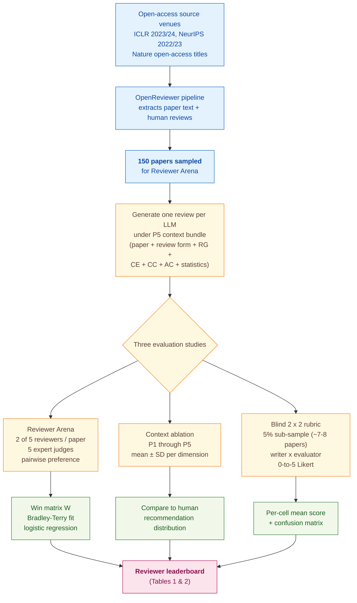

> [!success] **TL;DR**
> The paper makes a real contribution by showing that GPT-4 with a fully assembled venue-context bundle can produce reviews that judges prefer at roughly the same rate as human OpenReview reviews. But the headline "LLM ≥ human" rests on a 5-judge preference tournament over 150 papers, no confidence intervals, an 8-paper rubric sub-study with one human evaluator, and a context bundle that has to be rebuilt each year.

## Structured abstract

> [!info] A plain-language summary built from this paper's discourse-graph nodes. Numbers and findings link back to specific EVD nodes — click any link to drill in.

### Question

Can a large language model write peer reviews of machine-learning papers that are as good as the reviews human experts post on OpenReview? The authors set up a head-to-head contest between five "reviewers" — four LLMs and one human — and let expert judges pick which reviews they preferred. They also test what happens when you feed the LLM more of the venue's reviewing context, like the conference review form, code of ethics, and area-chair guidelines. See [[QUE - How do LLM-generated academic reviews compare to human reviews in quality and alignment with reviewer preferences?]].

### Methods

**Design.** The authors ran three nested studies on the same paper corpus: a pairwise-preference tournament called Reviewer Arena, a context-ablation comparing GPT-4 reviews against human reviews across five increasingly rich prompt bundles, and a small blind 2 × 2 cross-evaluation in which both humans and GPT-4 graded each other's reviews on a rubric.

**Tools.** Four commercial LLMs played the role of reviewer: GPT-4 Turbo (snapshot Turbo-2024-04-09), Claude 3 Opus, Gemini Pro (Bard), and Command R+. The fifth competitor was the human OpenReview reviewer of record. The ranking used a Bradley-Terry model — a logistic-regression method that turns pairwise win counts into a single score per competitor, the way chess Elo ratings work. The autoevaluation pass used PPI++, a statistical correction (Angelopoulos et al. 2023) that combines a few real human labels with many model-generated labels. Reviews were generated through the authors' OpenReviewer pipeline and judged on the in-house Reviewer Arena platform.

**Procedure.** The pipeline pulls open-access papers and their human reviews from OpenReview (ICLR and NeurIPS) and from open-access Nature journals. For each paper, the system generates one review per LLM under the full P5 context — paper text, review form, reviewer guide, code of ethics, code of conduct, area-chair guidelines, and prior-year statistics. The Reviewer Arena randomly assigns 2 of the 5 competitors to each paper, hides the authorship, and asks 5 expert evaluators which review they prefer. The authors tally wins into an N by N matrix, fit Bradley-Terry coefficients by minimizing binary cross-entropy under the constraint that Claude's score equals zero (so ranks are relative), and sort to produce the leaderboard. They repeat the protocol with GPT-4 Turbo as the judge for an autoevaluation pass. Separately, they ablate the prompt context P1 through P5 and compare GPT-4's average recommendation score against the human average. A final 5% sub-sample of the 150 papers feeds a blind 2 × 2 rubric study where each review (human-written or GPT-4 P5-written) is scored on three 0-to-5 questions by both a human ICLR 2023 reviewer and GPT-4.

**Sample.** The source pool spans ICLR 2024 (7,404 papers), ICLR 2023 (4,955), NeurIPS 2023 (12,345), NeurIPS 2022 (10,411), plus 16 open-access Nature titles. From this pool the authors sampled 150 papers for Reviewer Arena, each judged by 2 of 5 reviewers under the eyes of 5 expert human evaluators. The blind rubric sub-study used a 5% random subset of those 150 papers, roughly 7 to 8 papers, scored by 1 ICLR 2023 reviewer plus GPT-4.

### Findings

- **GPT-4 Turbo edged out humans in head-to-head review preference.** Across 150 papers and 5 expert judges, GPT-4 Turbo took rank 1 with a Bradley-Terry score of 0.558, ahead of the human OpenReview reviewer at 0.501. Command R+ came third (0.277), Claude 3 Opus fourth (0.000, the reference anchor), and Gemini Pro last (-0.522). When GPT-4 Turbo itself acted as the judge instead of humans, it still ranked itself first (0.179) but the gap to humans collapsed to 0.060 BT points, and the weaker models reordered substantially. [[EVD - GPT-4 Turbo ranked first in human preference for academic review quality with score 0.558 - @tyserAIDrivenReviewSystems2024]]

- **Adding area-chair guidelines is what makes GPT-4's scores match humans.** Without venue-specific stringency context, GPT-4 graded papers far too generously: human mean recommendation was 5.88 ± 1.61; GPT-4 with just paper text plus the review form (P1) averaged 7.21, and adding the reviewer guide (P2) and ethics codes (P3) pushed it slightly higher to 7.58 and 7.62. Only when the area-chair guidelines were added (P4) did the LLM swing to 4.61 — now too stringent. The full P5 bundle (adding prior-year statistics) settled at 5.36, within roughly half a point of the human average. The Confidence dimension, however, stayed skewed higher than human even at P5. [[EVD - LLM review recommendation scores exceeded human scores without area-chair context but matched with it - @tyserAIDrivenReviewSystems2024]]

- **Humans rated GPT-4 P5 reviews as comparable to human reviews on a rubric.** On a 0-to-5 rubric covering whether a review explains its score, guides authors to improve, and contains paper-specific content, the human evaluator rated human-written reviews at 4.80 / 4.66 / 4.53 and GPT-4 P5 reviews at 4.76 / 4.79 / 4.68 — statistically indistinguishable on a 7-to-8 paper sample. But when GPT-4 was the evaluator, it scored its own reviews higher (4.65) than human reviews (4.27) on the score-explanation question, a sign of self-enhancement bias. A confusion-matrix check showed the LLM was more prone to false-rejects than false-accepts: 22 papers the LLM rated 4 or below were actually rated 6 or above by humans, versus only 8 the other way. [[EVD - LLM reviews scored comparably to human reviews on all three expert evaluation criteria - @tyserAIDrivenReviewSystems2024]]

### Claim supported

These findings collectively support the claim that [[CLM - LLM review quality is comparable to human review quality when provided with sufficient contextual information]]. The practical caveat is that the comparability hinges almost entirely on the prompt: the LLM is over-generous out of the box, and only the carefully assembled venue-specific bundle of area-chair guidelines plus prior-year score statistics drags its calibration into the human range. A journal or conference deploying this would need to maintain those documents annually, and a 5-judge preference signal on 150 papers is a thin reed for the "as good as humans" headline.

### Caveats

- **The match-to-human result depends on yearly-updated venue documents and biased preference judgments.** The P5 context bundle relies on area-chair guidelines, codes of ethics, and prior-year statistics that each conference rewrites annually, so the calibration will drift. And human pairwise preferences are known to favor verbose, confident, and self-similar text — biases the authors only partially correct for. [[CVT - LLM review alignment findings based on venue-specific guidelines requiring yearly updates and subject to human preference biases]]

### Methods at a glance

---

## Quality appraisal

> [!info] Risk-of-bias and validity assessment across five domains, synthesized from this paper's discourse-graph nodes. Covers *methodological quality* — the TRIPOD-LLM table below covers *reporting compliance* instead.
> <dl class="callout-legend">
> <dt>● Low risk</dt><dd>No meaningful threat to this domain identified</dd>
> <dt>◐ Some risk</dt><dd>A real but non-fatal limitation</dd>
> <dt>○ High risk</dt><dd>A significant, unaddressed threat to validity</dd>
> </dl>

| Domain | Rating | Justification |
| --- | :---: | --- |
| **Construct validity** — does the metric actually measure the construct? | 🟡 | Bradley-Terry preference scores capture which review a judge *likes more*, not which review is more *correct*. The authors themselves flag that pairwise preference is colored by verbosity, position, length, and self-enhancement biases (see [[CVT - LLM review alignment findings based on venue-specific guidelines requiring yearly updates and subject to human preference biases]]). The recommendation-score match at P5 is calibration, not accuracy — it does not establish that the LLM is identifying the *same* papers as accept or reject as humans (the confusion matrix shows 22 false-rejects and 8 false-accepts on the rubric sub-sample). |
| **Internal validity** — could the comparison be biased? | 🔴 | Three serious threats. (1) The autoevaluation uses GPT-4 Turbo as judge of its own reviews, the classic LLM-judge-of-LLM problem; the gap to human compresses from 0.057 BT under human judges to 0.060 BT under GPT-4 self-judging only because Command R+ collapses, not because the gap is real. (2) The 2 of 5 random pairing in Reviewer Arena means each LLM faces only a fraction of all matchups, and per-cell sample sizes are not reported. (3) The blind rubric sub-study (~7-8 papers, 1 human evaluator described only as "an ICLR 2023 reviewer") leaves the score-comparability headline resting on a single rater. |
| **External validity** — do findings generalize? | 🔴 | The corpus is restricted to two ML conferences (ICLR, NeurIPS) plus open-access Nature journals; the authors do not report discipline mix or paper-type stratification. The P5 calibration depends on documents (area-chair guidelines, prior-year statistics) that the authors explicitly say "require yearly updates," so any deployment outside the calibrated venue-year would lose the match-to-human result. The 150-paper Arena set and the 7-to-8-paper rubric sub-set are too small to support generalization to a journal-screening workflow. |
| **Statistical rigor** — appropriate uncertainty + comparisons? | 🔴 | No confidence intervals on Bradley-Terry scores (a 0.558 vs. 0.501 gap with N=150 papers and 5 judges is plausibly within sampling noise). No inter-evaluator agreement reported for the 5 expert judges — the BT ranking treats their preferences as homogeneous. No multiple-comparison correction across the 5 review dimensions × 6 context conditions in Figure 14. The rubric sub-study reports means but no statistical tests at N ≈ 7 (per TRIPOD-LLM 16d ⚠️). |
| **Reproducibility** — code, data, determinism? | 🟡 | Live deployments exist at openreviewer.com, papersWithReviews.com, and reviewerarena.com (TRIPOD-LLM 14e ⚠️), and Listings 1–2 in Appendix P show the win-matrix and Bradley-Terry code. But no static dataset DOI is cited, no GitHub repository link appears in the text, and inference parameters for the Reviewer Arena LLMs (temperature, top_p, system prompt) are not reported (TRIPOD-LLM 6c ⚠️), so the GPT-4 review numbers carry irreducible run-to-run variance. |

**Bottom line.** The paper makes a real contribution by showing that GPT-4 with a fully assembled venue-context bundle can produce reviews that judges prefer at roughly the same rate as human OpenReview reviews. But the headline "LLM ≥ human" rests on a 5-judge preference tournament over 150 papers, no confidence intervals, an 8-paper rubric sub-study with one human evaluator, and a context bundle that has to be rebuilt each year. Anyone considering deployment should treat this as a feasibility demonstration on ML conference papers, not as evidence that LLM reviews are deployment-ready in any reviewing pipeline that cares about catching weak papers (where the confusion matrix shows GPT-4 mis-rejects 22 of the rubric sub-sample's strong submissions).

> [!tip] **Applicable external appraisal frameworks beyond TRIPOD-LLM** (already covered by the table below): **HELM** (Liang et al. 2022) for holistic LLM-evaluation principles · **Datasheets for Datasets** (Gebru et al. 2021) for the evaluation corpus · **Model Cards** (Mitchell et al. 2019) for the LLMs being evaluated

---

## TRIPOD-LLM reporting summary

> [!info] Reporting compliance for this paper, mapped to the TRIPOD-LLM checklist (Title/Abstract/Introduction items 1–4, Methods items 5a–15, Results items 16a–18). TRIPOD-LLM is a clinical-ML guideline being applied here to a non-clinical AI-research benchmark — where an item's own wording says "healthcare context" or "care pathway," it's read as "research-evaluation context" / "research workflow" instead. Item 17 (Performance) is reported per-EVD; see each EVD's `## Other Notes`.
> 

> ●Fully reported
> ◐Partial / unclear
> ○Not reported
> –Not applicable
> 

| # | Item | ✓ | Quote |
| --- | --- | :---: | --- |
| **1** | Title | ✅ | *"AI-Driven Review Systems: Evaluating LLMs in Scalable and Bias-Aware Academic Reviews"* `Title` |
| **2** | Abstract | ➖ | Assessed separately under TRIPOD-LLM's own Abstract extension, not scored here |
| **3a** | Background — context + rationale | ✅ | *"Automatic reviewing helps handle a large volume of papers, provides early feedback and quality control, reduces bias, and allows the analysis of trends."* `Abstract, p.1` |
| **3b** | Background — target population | ✅ | *"Paper reviews are used by researchers and academics, students, lecturers, innovators and entrepreneurs, policymakers and funding agencies, science journalists, and the general public to navigate research, analyze trends, find educational purposes, and find collaborators."* `Abstract, p.1` |
| **4** | Objectives | ✅ | *"We evaluate the alignment of automatic paper reviews with human reviews using an arena of human preferences by pairwise comparisons."* `Abstract, p.1` |
| **5a** | Data sources | ✅ | *"We deploy a system called Papers with Reviews illustrated in Figure 2 that collects around five hundred academic papers daily from arXiv and around a thousand open-access Nature journal papers monthly."* `§2, p.3` |
| **5b** | Data points + distribution | ⚠️ | *"Table 3: Number of papers collected by venue, with open reviews."* `Table 3, p.10` — source-pool sizes given (ICLR 2024: 7,404; ICLR 2023: 4,955; NeurIPS 2023: 12,345; NeurIPS 2022: 10,411), but discipline/topic distribution for the 150-paper Reviewer Arena sample is not characterized |
| **5c** | Date range of data | ⚠️ | *"Human, GPT-4 (Turbo-2024-04-09), Claude 3 Opus, Gemini Pro (Bard), and Command R+."* `§3, p.4` — only the GPT-4 Turbo snapshot date is given; ICLR/NeurIPS submission-date ranges and OpenReview pull dates are not explicitly stated |
| **5d** | Pre-processing / quality checks | ❌ | Not reported |
| **5e** | Missing / imbalanced data | ❌ | Not reported |
| **6a** | LLM name + version | ✅ | *"Human, GPT-4 (Turbo-2024-04-09), Claude 3 Opus, Gemini Pro (Bard), and Command R+."* `§3, p.4` |
| **6b** | Development process | ⚠️ | *"We experimented with three open weight LLMs: Gemma-2-9b-it, Llama-3.1-8b, and Mistral-Nemo-Instruct-2407. We quantize these models into 4 bits."* `Appendix N, p.38` — describes the fine-tuning models only; Reviewer Arena LLMs used as-is |
| **6c** | Inference settings / prompting | ⚠️ | *"P1 includes the full paper text (P) and conference review form (RF). P2 adds the reviewer guide (RG). P3 adds the code of ethics (CE) and code of conduct (CC). P4 adds guidelines for the area chair (AC). P5 adds the statistics of the previous year's conference."* `Appendix D, p.13` — context bundles defined, but temperature/top_p/system prompt for the Reviewer Arena LLMs not reported |
| **6d** | Output | ✅ | *"Figure 14 shows the average and standard deviation scores of the human reviewers and LLM review for paper correctness, technical novelty and significance, empirical novelty and significance, overall recommendation score, and confidence."* `Appendix D, p.13` |
| **6e** | Classification thresholds | ➖ | Not applicable — primary outputs are continuous review scores and pairwise preferences, not classification labels |
| **7a** | Quality metrics | ✅ | *"This work quantifies and ranks reviewers based on observed match outcomes using a win matrix, Bradley-Terry (BT) model coefficients, and logistic regression."* `§3, p.4` |
| **7b** | Relevance to downstream | ⚠️ | *"For authors to improve their papers: adequately citing related work, clarity, soundness etc."* `§1, p.2` — qualitative downstream use cases described but no formal utility analysis (e.g., reviewer-time savings) |
| **7c** | Outcome definition | ✅ | *"Table 1: Human preference ranking of reviewers."* `Table 1, p.5` |
| **7d** | Subjective interpretation | ⚠️ | *"LLMs exhibit various biases that can affect their judgment. For instance, models may exhibit position bias, favoring the first option presented, or verbosity bias, where longer, more detailed responses are preferred irrespective of quality"* `§3, p.5` |
| **7e** | Comparison | ✅ | *"Using GPT-4 instead of a human evaluator to choose between two reviews allows to use the PPI++ estimate (Angelopoulos, Duchi, and Zrnic 2023) of the BT coefficients."* `§3, p.5` |
| **8a** | Annotation guidelines | ❌ | *"The evaluators were asked which of the two reviews for each paper they preferred."* `§3, p.4` — describes the task given to evaluators, but no formal preference-judgment guideline document or training is reported |
| **8b** | Annotators + IAA | ❌ | *"To evaluate the quality of the LLM-generated reviews, five expert evaluators were provided with 150 papers together with two anonymous reviews for each paper."* `§3, p.4` — no inter-annotator agreement reported |
| **8c** | Annotator background | ⚠️ | *"The human review writer is an ICLR 2023 reviewer."* `Appendix E, p.14` — no discipline, seniority, demographics, or recruitment process reported for the five Reviewer Arena evaluators |
| **9a** | Prompt design | ⚠️ | *"We explored four types of review questions: (i) Fixed questions for a conference or journal: for example, ICLR and NeurIPS papers (Appendix B) have fixed review forms with questions;"* `§4, p.6` — question-selection strategies described; no systematic prompt-engineering search reported |
| **9b** | Prompt-development data | ❌ | Not reported |
| **10** | Summarization | ✅ | *"We use GPT-4 to extract points of summaries of human and LLM reviews."* `§4, p.6` |
| **11** | Instruction tuning / alignment | ✅ | *"We perform data augmentation, hyperparameter tuning, and bias correction."* `Appendix N, p.38` |
| **12** | Compute | ❌ | Not reported |
| **13** | Ethical approval | ⚠️ | *"Table 13 describes preventive actions for ethical and transparent use of LLMs in the peer review process."* `Appendix M, p.37` — ethical safeguards for the system are proposed, but no IRB/ethics-board approval is reported for the human evaluators |
| **14a** | Funding | ❌ | Not reported |
| **14b** | Conflicts of interest | ❌ | Not reported |
| **14c** | Protocol | ❌ | Not reported |
| **14d** | Registration | ➖ | Not applicable — not a clinical study |
| **14e** | Data availability | ⚠️ | *"We make the reviews of publicly available arXiv and open-access Nature journal papers available online, along with a free service which helps authors review and revise their research papers"* `Abstract, p.1` — live deployments cited, but no static dataset DOI/archive |
| **14f** | Code availability | ⚠️ | *"Listing 1: Compute win rate matrix from preferences."* `Appendix P, p.40` — key functions shown in-text; no GitHub repository link in the manuscript |
| **15** | Patient/public involvement | ➖ | Not applicable |
| **16a** | Flow of data | ⚠️ | *"To evaluate the quality of the LLM-generated reviews, five expert evaluators were provided with 150 papers together with two anonymous reviews for each paper."* `§3, p.4` — per-condition N for the Figure 14 ablation not explicitly reported |
| **16b** | Characteristics | ⚠️ | *"Table 4: Nature journal IDs and their corresponding names."* `Table 4, p.10` — source venues named, but per-paper characteristics (length, subfield, accept/reject status) not tabulated for the 150-paper Arena set |
| **16c** | Distribution comparison | ➖ | Not applicable — no clinical-subgroup comparison; authors do compare LLM-vs.-human score distributions: *"Figures 30 and 31 show that GPT-4 P5 score distributions are similar to human scores"* `Appendix L, p.36` |
| **16d** | N per analysis | ⚠️ | *"Table 5 shows the average evaluation results on a randomized sample of 5% of the papers evaluated by human experts."* `Appendix E, p.14` |
| **17** | Performance | `per-EVD` | Reported per-EVD. See each EVD's `## Other Notes` for the EVD-specific BT scores, recommendation means/SDs, and 2 × 2 rubric scores. |
| **18** | LLM updating | ⚠️ | *"These venue-dependent documents result in our review score distributions being similar to human distributions and yielding quality reviews using the full range of scores; however, they require yearly updates."* `§5, p.7` |
