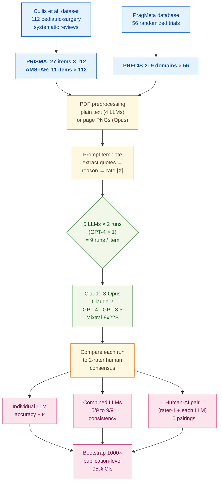

> [!success] **TL;DR**
> The strongest result here, that a single human paired with one LLM matches or beats two humans on PRISMA and AMSTAR, is methodologically credible within the pediatric-surgery dataset and the specific model snapshots tested. Before treating this as a deployable workflow, two things need to follow: a prospective replication on freshly-rated papers (to neutralize web-contamination concerns) and a real time-on-task measurement (to confirm the "spared work" actually translates into wall-clock savings rather than just deferred decisions).

## Structured abstract

> [!info] A plain-language summary built from this paper's discourse-graph nodes. Numbers and findings link back to specific EVD nodes: click any link to drill in.

### Question

Can large language models (LLMs) take over part of the slow, expert-driven work of judging how well a medical research paper is reported, how methodologically sound it is, and how relevant it is to real-world clinical practice? The authors compare five LLMs against expert human raters on three widely-used appraisal tools, then test whether pairing one human with one LLM (or pooling several LLMs together) lifts accuracy beyond what either does alone. See [[QUE - Can LLMs replace or augment human raters in evidence appraisal using PRISMA AMSTAR and PRECIS-2 tools?]].

### Methods

**Design.** The authors ran a cross-sectional benchmark comparing four conditions on three appraisal tools: human raters versus consensus, individual LLMs alone, several LLMs combined by majority vote, and a single human paired with a single LLM.

**Tools.** They tested five LLMs: Claude-3-Opus and Claude-2 (Anthropic), GPT-4 and GPT-3.5 (OpenAI), and Mixtral-8x22B (an open-source mixture-of-experts model from Mistral AI). The three appraisal instruments were PRISMA (a 27-item reporting checklist for systematic reviews), AMSTAR (an 11-item methodology checklist for systematic reviews), and PRECIS-2 (a 9-domain rubric scoring how pragmatic versus explanatory a randomized trial is). Quote-fidelity scoring used parasail (sequence alignment) and rapidfuzz (string similarity) in Python 3.11.4. Statistics ran in R 4.3 with 1,000 publication-level bootstrap resamples for 95% confidence intervals.

**Procedure.** The authors queried each LLM through its API at temperature 0, which forces the most consistent output the model can produce. For every item on every paper, the prompt asked the LLM to first extract one to three relevant quotes from the full text, then explain its reasoning, then assign a rating. Claude-3-Opus saw page-level PNG images of each paper and read them with its built-in vision capability. The other four LLMs saw plain text only. Each prompt was run twice to measure intrarater reliability (GPT-4 only on 25% of papers because of its high cost). The authors then combined the nine total LLM runs in two ways: a "consistency" ensemble that only kept ratings agreed on by at least k of 9 runs and deferred the rest, and a human-AI pair where items the human and LLM agreed on were accepted and disagreements were deferred to a second human. Statistical superiority was declared when bootstrap confidence intervals did not overlap.

**Sample.** For PRISMA and AMSTAR the authors used 112 systematic reviews and meta-analyses in pediatric surgery, with prior expert ratings shared by Cullis and colleagues. For PRECIS-2 they used 56 randomized controlled trials from the PragMeta database. The unit of analysis was a single rating (one item on one paper), giving up to 3,024 PRISMA ratings, 1,232 AMSTAR ratings, and 504 PRECIS-2 ratings. Two human raters per paper produced the consensus that the LLMs were graded against: British pediatric surgeons for PRISMA and AMSTAR; an experienced systematic reviewer plus either a trained MSc epidemiology student or a senior pragmatic-trial expert for PRECIS-2.

### Findings

- **No single LLM came close to a human expert.** On PRISMA, accuracy ran from 63% (GPT-3.5) to 70% (Claude-3-Opus), versus 89% for a human rater. On AMSTAR, the range was 53% to 74%, again versus 89%. On PRECIS-2, every LLM landed between 38% (GPT-4) and 55% (GPT-3.5), versus 75% for a human. Cohen's kappa, which runs from 0 (chance agreement) to 1 (perfect), stayed near zero on PRECIS-2 for every model. [[EVD - Individual LLM accuracy ranged 63-70 percent for PRISMA and 53-74 percent for AMSTAR versus 89 percent for humans - @woelfleBenchmarkingHumanAICollaboration2024]]

- **Pairing one human with one LLM beat either alone.** The best human-AI pair reached 96% accuracy on PRISMA (versus 89% for a single human) and 95% on AMSTAR. For 8 of the 10 possible pairings on PRISMA and AMSTAR, the human plus LLM beat both human raters with non-overlapping confidence intervals. The trade-off is that 25% to 41% of items get flagged for a second human to look at. But on items they keep, the team is right roughly 1 wrong per 25 spared on PRISMA. PRECIS-2 saw far smaller gains: only 1 of 10 pairings significantly beat a single human. [[EVD - Human-AI collaboration achieved up to 96 percent accuracy for PRISMA and 95 percent for AMSTAR surpassing individual human raters - @woelfleBenchmarkingHumanAICollaboration2024]]

- **Combining nine LLM runs by majority vote worked, but at the cost of deferring most items.** Pooling all nine runs and keeping only the ratings that 5 of 9 (or more) LLMs agreed on reached 75% accuracy on PRISMA and 74% on AMSTAR. Tightening the threshold to 9 of 9 pushed PRISMA accuracy to 88% and AMSTAR to 89%, but at that strictness 74% to 84% of items get deferred: meaning the ensemble hands most decisions back to humans. PRECIS-2 stayed weak: 64% to 79% accuracy with kappa from 0.11 to 0.49. [[EVD - Combined LLMs with consistency approach reached 75-88 percent accuracy for PRISMA while deferring 4-74 percent of ratings - @woelfleBenchmarkingHumanAICollaboration2024]]

- **Human raters themselves disagree a lot on harder tools.** Two expert raters agreed on 91% of PRISMA items (kappa 0.84, "almost perfect"), 88% of AMSTAR items (kappa 0.77, "substantial"), but only 57% of PRECIS-2 items (weighted kappa 0.29, "fair"). The same difficulty gradient that hurts humans hurts the LLMs, suggesting the bottleneck on PRECIS-2 is task complexity rather than model capability. [[EVD - Human inter-rater reliability dropped from 91 percent on PRISMA to 57 percent on PRECIS-2 - @woelfleBenchmarkingHumanAICollaboration2024]]

- **GPT-4 cost roughly 100 times more than the open-source Mixtral.** Per 100 papers, Mixtral-8x22B cost about $1.20 and GPT-4-32k cost about $115. GPT-3.5 was the fastest at about 10 seconds per paper; GPT-4 was the slowest at about 2 minutes per paper. Given Mixtral matched or beat GPT-4 on accuracy in several conditions, the cost gap is decision-relevant for anyone considering deployment at scale. [[EVD - GPT-4 cost approximately 100x more than Mixtral-8x22B per 100 papers in evidence appraisal - @woelfleBenchmarkingHumanAICollaboration2024]]

- **The LLMs quoted the source text faithfully when they quoted it at all.** The median string-similarity between an LLM-extracted quote and the closest matching span in the source paper was 99% across all three tools. Sub-100% matches mostly came from removing reference markers or brackets. The exception was a small subset of cases where Claude-3-Opus, Claude-2, or Mixtral quoted from the prompt's briefing material rather than the target paper. [[EVD - Median quote similarity with original full text was 99 percent across LLM extracted quotes - @woelfleBenchmarkingHumanAICollaboration2024]]

### Claim supported

These findings support [[CLM - Human-AI collaboration outperforms individual LLMs and can match or exceed human rater accuracy for evidence appraisal tasks]]. For practical deployment, the takeaway is narrow but real: a single human rater paired with an LLM can plausibly replace a second human rater for reporting and methodology checklists (PRISMA, AMSTAR), where most disagreements get caught by deferral. For harder, more interpretive judgments like PRECIS-2 pragmatism scoring, neither individual LLMs nor human-AI pairs reach a level that would justify replacing the second human.

### Caveats

- **Only two human raters defined the "ground truth".** Two-rater consensus is not a robust gold standard, and the LLMs' agreement scores are bounded by whatever idiosyncrasies those particular raters share. [[CVT - Evidence appraisal benchmark used only two human raters and datasets skewed toward pragmatic trials limiting PRECIS-2 findings]]

- **The PRECIS-2 dataset skewed heavily pragmatic.** The 56 trials in PragMeta contain mostly pragmatic and few explanatory designs, which means models that default to "pragmatic" will look better than they would on a balanced dataset, and the surprising win by GPT-3.5 and Mixtral over GPT-4 may not survive rebalancing. [[CVT - Evidence appraisal benchmark used only two human raters and datasets skewed toward pragmatic trials limiting PRECIS-2 findings]]

- **Four of five LLMs were blind to figures and image-rendered tables.** Only Claude-3-Opus could see the page images. The other four read text-only extractions, so they could not use PRISMA flow diagrams or image-rendered tables that humans routinely consult. This handicaps text-only models and likely understates what current vision-capable LLMs can do. [[CVT - Most LLMs were text-only and blind to figures and image-rendered tables relevant for evidence appraisal]]

- **The evaluation datasets were already on the open web.** The Cullis pediatric-surgery ratings and the PragMeta PRECIS-2 ratings are publicly available, so any LLM trained on web crawls could plausibly have seen the labels during pretraining. Tabular CSV ratings are unlikely training material, but the risk cannot be ruled out without prospective replication. [[CVT - Human consensus datasets used as comparators were openly available online raising train test contamination concerns]]

- **No human time-on-task data was recorded.** The whole efficiency argument for human-AI collaboration rests on saving the second rater work, but the datasets contain no measurements of how long humans took. If a second rater still has to read the full paper regardless of which items the LLM arbitrates, the time saving could be small or zero. [[CVT - The benchmark datasets did not record human time on task preventing quantification of efficiency gains]]

### Methods at a glance

---

## Quality appraisal

> [!info] Risk-of-bias and validity assessment, synthesized from this paper's discourse-graph nodes and grounded in the same paper this page's top trust-signal chips summarize. Covers *methodological quality*; the TRIPOD-LLM table below covers *reporting compliance* instead.
> <dl class="callout-legend">
> <dt>● Low risk</dt><dd>No meaningful threat to this domain identified</dd>
> <dt>◐ Some risk</dt><dd>A real but non-fatal limitation</dd>
> <dt>○ High risk</dt><dd>A significant, unaddressed threat to validity</dd>
> </dl>

| Domain | Rating | Quote |
| --- | :---: | --- |
| **Construct validity**: does the metric actually measure the construct? | 🟡 | *"Finally, the presented datasets do not contain information on how long it took the human raters to assess each publication and item individually and how long the consensus process took (''time on task'')."* `§4.1, p.10`, the deployment claim is workload reduction, but the construct that would measure it isn't captured |
| **Internal validity**: could the comparison be biased? | 🟡 | *"Claude-3-Opus was the only multimodal model we employed."* `§2.2, p.2`, model identity is confounded with input modality; the other four LLMs saw text only |
| **External validity**: do findings generalize? | 🔴 | *"we used human assessments of PRISMA and AMSTAR for 112 systematic reviews and meta-analyses in the field of pediatric surgery"* `§2.1, p.2`, a single specialty shared by one research group |
| **Statistical rigor**: appropriate uncertainty + comparisons? | 🟢 | *"Bootstrapping with 1000 resamples on the publication-level was performed to derive 95% CIs."* `§2.3.1, p.3` |
| **Reproducibility**: code, data, determinism? | 🟢 | *"Codes and data are openly available on GitHub [29]."* `§2.3.3, p.5`, exact model versions and query timeframes are also reported in Table 1 |
| **Data leakage**: could models have seen this data pretraining? | 🟡 | *"there is a general concern about ''train/test contamination'' or ''data leakage'' with all LLM benchmarks... Nevertheless, only prospective replication of these results with new human consensus datasets would eliminate the risk"* `§4.1, p.9` |
| **Baseline adequacy**: is there a meaningful floor to beat? | 🟢 | *"The independent assessment by at least 2 human raters is the standard in systematic reviews"* `§2.1, p.2`, a well-established, independently-sourced human-consensus reference, not a synthetic baseline |
| **Train/dev/test hygiene**: are data splits kept separate? | ➖ | Not applicable, no model training or fine-tuning is performed; all LLMs are evaluated zero-shot against pre-existing human-consensus ratings |
| **Multiple-comparisons correction**: controlled for repeated testing? | 🟡 | *"ratings consistent between a human rater and LLMs showed significantly better accuracies than human raters alone for 8 of 10 possible collaboration-pairs for PRISMA and AMSTAR"* `§4, p.9`, "significant" is declared per-pairing via non-overlapping bootstrap CIs, with no explicit correction across the 10 pairings tested |
| **Human-baseline comparability**: is there a human reference point? | 🟢 | *"Human inter-rater reliability measured by agreement was 91%, 88%, and 57% and by kappa 0.84, 0.77, and 0.29 for PRISMA, AMSTAR, and PRECIS-2, respectively."* `§3.2, p.8`, human raters are the primary comparator throughout, not an afterthought |
| **Confidence Intervals**: are point estimates accompanied by an interval? | 🟢 | *"Bootstrapping with 1000 resamples on the publication-level was performed to derive 95% CIs."* `§2.3.1, p.3`, applied to every accuracy/kappa/deferring-fraction figure in Table 2-3 |
| **Chance-Corrected Metrics**: does agreement/accuracy correct for chance? | 🟢 | *"Human inter-rater reliability measured by agreement was 91%, 88%, and 57% and by kappa 0.84, 0.77, and 0.29 for PRISMA, AMSTAR, and PRECIS-2, respectively."* `§3.2, p.8`, with Cohen's kappa reported for every LLM-vs-human comparison throughout Table 2-3 |
| **Non-Significant Result Spin**: are null or negative findings framed plainly? | 🟢 | *"Individual LLMs performed significantly worse than humans for all three evidence appraisal tools."* `pp.8-9`, and *"For PRECIS-2, there was still substantial improvement in accuracy but statistically significant in only 1 of 10 collaboration-pairs"* — the weak PRECIS-2 result is not reframed as a success |
| **Statistic Accuracy**: do the paper's own reported numbers check out? | 🟢 | The paper's kappa values (0.84 PRISMA, 0.77 AMSTAR, 0.29 PRECIS-2) fall within the valid 0–1 range and are internally consistent with the paper's own stated agreement-level bands `§3.2, p.8` |

**Bottom line.** The strongest result here, that a single human paired with one LLM matches or beats two humans on PRISMA and AMSTAR, is methodologically credible within the pediatric-surgery dataset and the specific model snapshots tested. Before treating this as a deployable workflow, two things need to follow: a prospective replication on freshly-rated papers (to neutralize web-contamination concerns) and a real time-on-task measurement (to confirm the "spared work" actually translates into wall-clock savings rather than just deferred decisions). The PRECIS-2 results, by contrast, are not yet ready for any deployment claim: the underlying task is too noisy even for human experts.

> [!tip] **Applicable external appraisal frameworks beyond TRIPOD-LLM** (already covered by the table below): **MI-CLAIM** (Norgeot et al. 2020) for clinical-AI minimum information · **MINIMAR** (Hernandez-Boussard et al. 2020) for medical-AI reporting · **PROBAST+AI** (Wolff et al. 2019 base; AI extension in development) for prediction-model risk of bias

---

## TRIPOD-LLM reporting summary

> [!info] Reporting compliance for this paper, mapped to the TRIPOD-LLM checklist (Title/Abstract/Introduction items 1–4, Methods items 5a–15, Results items 16a–18). Item 17 (Performance) is reported per-EVD; see each EVD's `## Other Notes`.
> 

> ●Fully reported
> ◐Partial / unclear
> ○Not reported
> –Not applicable
> 

| # | Item | ✓ | Quote |
| --- | --- | :---: | --- |
| **1** | Title | ✅ | *"Benchmarking Human-AI Collaboration for Common Evidence Appraisal Tools"* `Title` |
| **2** | Abstract | ➖ | Assessed separately under TRIPOD-LLM's own Abstract extension, not scored here |
| **3a** | Background: context + rationale | ✅ | *"The assessment of reporting, methodological rigor, and design features of biomedical research is essential for evidence-based medicine. However, these evaluations require extensive resources."* `§1, p.1` |
| **3b** | Background: target population | ✅ | *"The independent assessment by at least 2 human raters is the standard in systematic reviews (eg, for Cochrane reviews [13]), and is also commonly used to assess reporting and methodological rigor (eg, using PRISMA [14] and AMSTAR [14,15]), or study designs (eg, using PRECIS-2 [16])."* `§2.1, p.2` |
| **4** | Objectives | ✅ | *"Our objectives were to quantify the agreement of 5 individual LLMs with human consensus in the assessment of evidence appraisal tools of different levels of complexity: reporting (PRISMA) and methodological rigor (AMSTAR) of systematic reviews, and degree of pragmatism of clinical trials (PRECIS-2)."* `§1, p.2` |
| **5a** | Data sources | ✅ | *"we used human assessments of PRISMA and AMSTAR for 112 systematic reviews and meta-analyses in the field of pediatric surgery (data kindly shared by Cullis and colleagues)"* `§2.1, p.2` |
| **5b** | Data points + distribution | ✅ | *"Five LLMs (Claude-3-Opus, Claude-2, GPT-4, GPT-3.5, Mixtral-8x22B) assessed 112 systematic reviews applying the PRISMA and AMSTAR criteria and 56 randomized controlled trials applying PRECIS-2."* `Abstract, p.1` |
| **5c** | Date range of data | ⚠️ | *"April 2024 via Anthropic"* `Table 1, p.3`, LLM query timeframe reported per model (Aug 2023–Apr 2024); publication date range of the appraised systematic reviews/trials themselves not reported |
| **5d** | Pre-processing / quality checks | ✅ | *"API querying, extraction of ratings, fixing minor formatting issues, and quantification of quote accuracy were performed in Python 3.11.4 using the parasail and rapidfuzz libraries"* `§2.3.3, p.5` |
| **5e** | Missing / imbalanced data | ⚠️ | *"Claude-3-Opus could persistently not process 3 of 112 (2.7%) publications for PRISMA and AMSTAR because of the output being blocked by Anthropic's content filtering policy or being too long."* `§3.1.4, p.8` |
| **6a** | LLM name + version | ✅ | *"We used 4 proprietary LLMs (Anthropic's Claude-3-Opus and Claude-2 [18,19] and OpenAI's GPT-4 and GPT-3.5 [20,21]) and 1 open-source LLM (Mistral AI's Mixtral-8x22B [22])"* `§2.2, p.2` |
| **6b** | Development process | ➖ | *"The 4 other models could only process full text (extracted by us) and no images."* `§2.2, p.3`, no model training or fine-tuning; zero-shot evaluation only |
| **6c** | Inference settings / prompting | ⚠️ | *"All application programming interface (API) queries were performed with minimal randomness (''temperature'' 0) to allow the highest possible intrarater reliability."* `§2.3.2, p.5`, top-p, max tokens, seed, retry logic not detailed |
| **6d** | Output | ✅ | *"1. Extract 1-3 relevant quotes from the full text. 2. Explain your reasoning in 1 paragraph. 3. Give a score X from 1 (very explanatory) to 5 (very pragmatic) in square brackets"* `Box 1, p.6` |
| **6e** | Classification thresholds | ✅ | *"responses 1 and 2 (''very'' and ''mostly explanatory'') were pooled to ''1/2'' and responses 4 and 5 (''very'' and ''mostly pragmatic'') to ''4/5'' and a weighted version of Cohen's kappa was used"* `§2.3.1, p.3` |
| **7a** | Quality metrics | ✅ | *"Our main outcome was agreement with human consensus measured by accuracy (agreement fraction, i.e., the proportion of identical ratings between rater and human consensus) and Cohen's kappa."* `§2.3.1, p.3` |
| **7b** | Relevance to downstream use | ✅ | *"Conversely, this would spare the second human rater 65% of responses when accepting 96% accuracy"* `§3.1.4, p.7` |
| **7c** | Outcome definition | ✅ | *"Items where the LLM aligned with the human rater were compared to human consensus. Inconsistent items were considered uncertain and thus ''deferred to a second human rater''."* `§2.3.1, p.5` |
| **7d** | Subjective interpretation | ✅ | *"We performed LLM prompts twice ... and compared the ratings of each of the 2 runs. Due to the nature of LLMs, these duplicate runs are not independent, which is why we consider their agreement ''intrarater reliability''."* `§2.3.2, p.5` |
| **7e** | Comparison | ✅ | *"We performed 4 analyses for each of the 3 evidence appraisal tools (PRISMA, AMSTAR, PRECIS-2)"* `§2.3.1, p.3` |
| **8a** | Annotation guidelines | ➖ | Not applicable, no new annotation phase; the authors reused existing PRISMA/AMSTAR ratings (Cullis et al.) and PRECIS-2 ratings (PragMeta) as already collected |
| **8b** | Annotators + IAA | ✅ | *"Human inter-rater reliability measured by agreement was 91%, 88%, and 57% and by kappa 0.84, 0.77, and 0.29 for PRISMA, AMSTAR, and PRECIS-2, respectively."* `§3.2, p.8` |
| **8c** | Annotator background | ✅ | *"The 2 raters were content experts (British pediatric surgeons)."* `§2.1, p.2` |
| **9a** | Prompt design | ⚠️ | *"Details on LLM queries, prompt engineering, and the extraction of ratings and quotes can be found the Supplementary Methods."* `§2.2, p.3` |
| **9b** | Prompt-development data | ❌ | Not reported |
| **10** | Summarization | ➖ | Not applicable, no summarization endpoint evaluated |
| **11** | Instruction tuning / alignment | ➖ | Not applicable, no model fine-tuning or alignment performed; zero-shot evaluation only |
| **12** | Compute | ⚠️ | *"Mixtral-8x22B was the most affordable model with a median of $1.20 per 100 papers and GPT-4 the most expensive one with a median of $115.00."* `§3.3, p.8`, cost and response time reported; GPU/CPU type, token counts, and energy not reported |
| **13** | Ethical approval | ➖ | Not applicable, no human-subjects data; study analyzes only published articles and previously-released human ratings (no explicit ethics statement in the manuscript) |
| **14a** | Funding | ✅ | *"The research activities of RC2NB (Research Center for Clinical Neuroimmunology and Neuroscience Basel) are supported by the University Hospital and the University of Basel and the Foundation Clinical Neuroimmunology and Neuroscience Basel, including grants from Novartis and Roche."* `p.1` |
| **14b** | Conflicts of interest | ✅ | *"There are no competing interests for any author."* `Declaration of competing interest, p.10` |
| **14c** | Protocol | ❌ | Not reported |
| **14d** | Registration | ➖ | Not applicable, not a clinical study |
| **14e** | Data availability | ✅ | *"All data are openly available: https://github.com/timwoelfle/Evidence-Appraisal-AI."* `Data availability, p.10` |
| **14f** | Code availability | ✅ | *"Codes and data are openly available on GitHub [29]."* `§2.3.3, p.5` |
| **15** | Patient/public involvement | ➖ | Not applicable |
| **16a** | Flow of data | ⚠️ | *"Claude-3-Opus, GPT-3.5, and Mixtral-8x22B had to be reprompted several times for up to 13% of publications until success."* `§3.1.4, p.8` |
| **16b** | Characteristics | ✅ | *"56 randomized controlled trials within the PragMeta database"* `§2.1, p.2` |
| **16c** | Distribution comparison | ➖ | Not applicable, no clinical-outcome subgroup comparison |
| **16d** | N per analysis | ✅ | *"2686/3024 (89%, 87%e90%)"* `Table 2, p.5` |
| **17** | Performance | `per-EVD` | Reported per-EVD. See each Woelfle EVD's `## Other Notes`. |
| **18** | LLM updating | ➖ | Not applicable, no model updating; zero-shot evaluation of frozen LLMs at fixed query timeframes |
