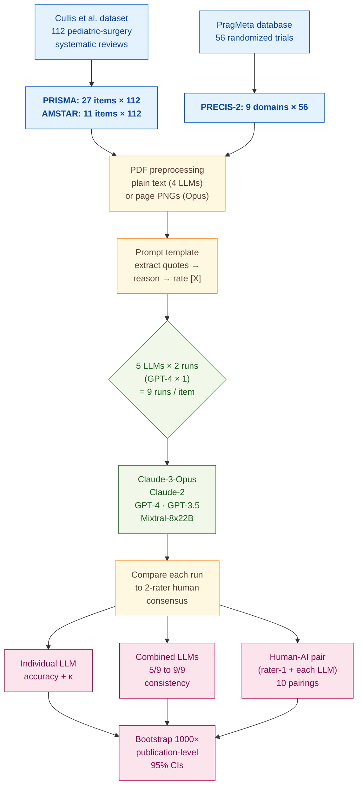

> [!success] **TL;DR**
> The strongest result here — that a single human paired with one LLM matches or beats two humans on PRISMA and AMSTAR — is methodologically credible within the pediatric-surgery dataset and the specific model snapshots tested. Before treating this as a deployable workflow, two things need to follow: a prospective replication on freshly-rated papers (to neutralize web-contamination concerns) and a real time-on-task measurement (to confirm the "spared work" actually translates into wall-clock savings rather than just deferred decisions).

## Structured abstract

> [!info] A plain-language summary built from this paper's discourse-graph nodes. Numbers and findings link back to specific EVD nodes — click any link to drill in.

### Question

Can large language models (LLMs) take over part of the slow, expert-driven work of judging how well a medical research paper is reported, how methodologically sound it is, and how relevant it is to real-world clinical practice? The authors compare five LLMs against expert human raters on three widely-used appraisal tools, then test whether pairing one human with one LLM (or pooling several LLMs together) lifts accuracy beyond what either does alone. See [[QUE - Can LLMs replace or augment human raters in evidence appraisal using PRISMA AMSTAR and PRECIS-2 tools?]].

### Methods

**Design.** The authors ran a cross-sectional benchmark comparing four conditions on three appraisal tools: human raters versus consensus, individual LLMs alone, several LLMs combined by majority vote, and a single human paired with a single LLM.

**Tools.** They tested five LLMs: Claude-3-Opus and Claude-2 (Anthropic), GPT-4 and GPT-3.5 (OpenAI), and Mixtral-8x22B (an open-source mixture-of-experts model from Mistral AI). The three appraisal instruments were PRISMA (a 27-item reporting checklist for systematic reviews), AMSTAR (an 11-item methodology checklist for systematic reviews), and PRECIS-2 (a 9-domain rubric scoring how pragmatic versus explanatory a randomized trial is). Quote-fidelity scoring used **parasail** (sequence alignment) and **rapidfuzz** (string similarity) in Python 3.11.4. Statistics ran in R 4.3 with 1,000 publication-level bootstrap resamples for 95% confidence intervals.

**Procedure.** The authors queried each LLM through its API at temperature 0, which forces the most consistent output the model can produce. For every item on every paper, the prompt asked the LLM to first extract one to three relevant quotes from the full text, then explain its reasoning, then assign a rating. Claude-3-Opus saw page-level PNG images of each paper and read them with its built-in vision capability. The other four LLMs saw plain text only. Each prompt was run twice to measure intrarater reliability (GPT-4 only on 25% of papers because of its high cost). The authors then combined the nine total LLM runs in two ways: a "consistency" ensemble that only kept ratings agreed on by at least k of 9 runs and deferred the rest, and a human-AI pair where items the human and LLM agreed on were accepted and disagreements were deferred to a second human. Statistical superiority was declared when bootstrap confidence intervals did not overlap.

**Sample.** For PRISMA and AMSTAR the authors used 112 systematic reviews and meta-analyses in pediatric surgery, with prior expert ratings shared by Cullis and colleagues. For PRECIS-2 they used 56 randomized controlled trials from the PragMeta database. The unit of analysis was a single rating (one item on one paper), giving up to 3,024 PRISMA ratings, 1,232 AMSTAR ratings, and 504 PRECIS-2 ratings. Two human raters per paper produced the consensus that the LLMs were graded against: British pediatric surgeons for PRISMA and AMSTAR; an experienced systematic reviewer plus either a trained MSc epidemiology student or a senior pragmatic-trial expert for PRECIS-2.

### Findings

- **No single LLM came close to a human expert.** On PRISMA, accuracy ran from 63% (GPT-3.5) to 70% (Claude-3-Opus), versus 89% for a human rater. On AMSTAR, the range was 53% to 74%, again versus 89%. On PRECIS-2, every LLM landed between 38% (GPT-4) and 55% (GPT-3.5), versus 75% for a human. Cohen's kappa, which runs from 0 (chance agreement) to 1 (perfect), stayed near zero on PRECIS-2 for every model. [[EVD - Individual LLM accuracy ranged 63-70 percent for PRISMA and 53-74 percent for AMSTAR versus 89 percent for humans - @woelfleBenchmarkingHumanAICollaboration2024]]

- **Pairing one human with one LLM beat either alone.** The best human-AI pair reached 96% accuracy on PRISMA (versus 89% for a single human) and 95% on AMSTAR. For 8 of the 10 possible pairings on PRISMA and AMSTAR, the human plus LLM beat both human raters with non-overlapping confidence intervals. The trade-off is that 25% to 41% of items get flagged for a second human to look at — but on items they keep, the team is right roughly 1 wrong per 25 spared on PRISMA. PRECIS-2 saw far smaller gains: only 1 of 10 pairings significantly beat a single human. [[EVD - Human-AI collaboration achieved up to 96 percent accuracy for PRISMA and 95 percent for AMSTAR surpassing individual human raters - @woelfleBenchmarkingHumanAICollaboration2024]]

- **Combining nine LLM runs by majority vote worked, but at the cost of deferring most items.** Pooling all nine runs and keeping only the ratings that 5 of 9 (or more) LLMs agreed on reached 75% accuracy on PRISMA and 74% on AMSTAR. Tightening the threshold to 9 of 9 pushed PRISMA accuracy to 88% and AMSTAR to 89%, but at that strictness 74% to 84% of items get deferred — meaning the ensemble hands most decisions back to humans. PRECIS-2 stayed weak: 64% to 79% accuracy with kappa from 0.11 to 0.49. [[EVD - Combined LLMs with consistency approach reached 75-88 percent accuracy for PRISMA while deferring 4-74 percent of ratings - @woelfleBenchmarkingHumanAICollaboration2024]]

- **Human raters themselves disagree a lot on harder tools.** Two expert raters agreed on 91% of PRISMA items (kappa 0.84, "almost perfect"), 88% of AMSTAR items (kappa 0.77, "substantial"), but only 57% of PRECIS-2 items (weighted kappa 0.29, "fair"). The same difficulty gradient that hurts humans hurts the LLMs, suggesting the bottleneck on PRECIS-2 is task complexity rather than model capability. [[EVD - Human inter-rater reliability dropped from 91 percent on PRISMA to 57 percent on PRECIS-2 - @woelfleBenchmarkingHumanAICollaboration2024]]

- **GPT-4 cost roughly 100 times more than the open-source Mixtral.** Per 100 papers, Mixtral-8x22B cost about $1.20 and GPT-4-32k cost about $115. GPT-3.5 was the fastest at about 10 seconds per paper; GPT-4 was the slowest at about 2 minutes per paper. Given Mixtral matched or beat GPT-4 on accuracy in several conditions, the cost gap is decision-relevant for anyone considering deployment at scale. [[EVD - GPT-4 cost approximately 100x more than Mixtral-8x22B per 100 papers in evidence appraisal - @woelfleBenchmarkingHumanAICollaboration2024]]

- **The LLMs quoted the source text faithfully when they quoted it at all.** The median string-similarity between an LLM-extracted quote and the closest matching span in the source paper was 99% across all three tools. Sub-100% matches mostly came from removing reference markers or brackets. The exception was a small subset of cases where Claude-3-Opus, Claude-2, or Mixtral quoted from the prompt's briefing material rather than the target paper. [[EVD - Median quote similarity with original full text was 99 percent across LLM extracted quotes - @woelfleBenchmarkingHumanAICollaboration2024]]

### Claim supported

These findings support [[CLM - Human-AI collaboration outperforms individual LLMs and can match or exceed human rater accuracy for evidence appraisal tasks]]. For practical deployment, the takeaway is narrow but real: a single human rater paired with an LLM can plausibly replace a second human rater for reporting and methodology checklists (PRISMA, AMSTAR), where most disagreements get caught by deferral. For harder, more interpretive judgments like PRECIS-2 pragmatism scoring, neither individual LLMs nor human-AI pairs reach a level that would justify replacing the second human.

### Caveats

- **Only two human raters defined the "ground truth".** Two-rater consensus is not a robust gold standard, and the LLMs' agreement scores are bounded by whatever idiosyncrasies those particular raters share. [[CVT - Evidence appraisal benchmark used only two human raters and datasets skewed toward pragmatic trials limiting PRECIS-2 findings]]

- **The PRECIS-2 dataset skewed heavily pragmatic.** The 56 trials in PragMeta contain mostly pragmatic and few explanatory designs, which means models that default to "pragmatic" will look better than they would on a balanced dataset — and the surprising win by GPT-3.5 and Mixtral over GPT-4 may not survive rebalancing. [[CVT - Evidence appraisal benchmark used only two human raters and datasets skewed toward pragmatic trials limiting PRECIS-2 findings]]

- **Four of five LLMs were blind to figures and image-rendered tables.** Only Claude-3-Opus could see the page images. The other four read text-only extractions, so they could not use PRISMA flow diagrams or image-rendered tables that humans routinely consult. This handicaps text-only models and likely understates what current vision-capable LLMs can do. [[CVT - Most LLMs were text-only and blind to figures and image-rendered tables relevant for evidence appraisal]]

- **The evaluation datasets were already on the open web.** The Cullis pediatric-surgery ratings and the PragMeta PRECIS-2 ratings are publicly available, so any LLM trained on web crawls could plausibly have seen the labels during pretraining. Tabular CSV ratings are unlikely training material, but the risk cannot be ruled out without prospective replication. [[CVT - Human consensus datasets used as comparators were openly available online raising train test contamination concerns]]

- **No human time-on-task data was recorded.** The whole efficiency argument for human-AI collaboration rests on saving the second rater work, but the datasets contain no measurements of how long humans took. If a second rater still has to read the full paper regardless of which items the LLM arbitrates, the time saving could be small or zero. [[CVT - The benchmark datasets did not record human time on task preventing quantification of efficiency gains]]

### Methods at a glance

---

## Critical appraisal

> [!info] A risk-of-bias and validity assessment across five domains, synthesized from this paper's discourse-graph nodes. Each domain gets a rating (🟢 Low risk · 🟡 Some concerns · 🔴 High risk) plus a brief, EVD-grounded justification. The TRIPOD-LLM table below covers *reporting compliance*; this section covers *methodological quality*.

| Domain | Rating | Justification |
| --- | :---: | --- |
| **Construct validity** — does the metric actually measure the construct? | 🟡 | Accuracy against a 2-rater human consensus is a defensible proxy for "agrees with experts," but the central deployment claim is workload reduction for the second rater — and the datasets contain no human time-on-task data, so the construct that actually matters cannot be measured (see [[CVT - The benchmark datasets did not record human time on task preventing quantification of efficiency gains]]). The accuracy-by-deferral framing is the right shape for the question, however, and the authors do quantify the practical "1 wrong per N spared" trade-off. |
| **Internal validity** — could the comparison be biased? | 🟡 | The same prompt, temperature, and held-out test set apply to every LLM, and the bootstrap CIs control for paper-level variance. But four of five models are text-only while Claude-3-Opus sees page images (see [[CVT - Most LLMs were text-only and blind to figures and image-rendered tables relevant for evidence appraisal]]), confounding model identity with input modality. GPT-4 is run only on 25% of papers due to cost, so its CIs are wider and not strictly comparable to the other models. |
| **External validity** — do findings generalize? | 🔴 | Three real constraints. (1) PRISMA and AMSTAR results come from a single specialty (pediatric surgery) shared by one research group. (2) The PRECIS-2 dataset is heavily skewed toward pragmatic trials (see [[CVT - Evidence appraisal benchmark used only two human raters and datasets skewed toward pragmatic trials limiting PRECIS-2 findings]]), and the authors flag that GPT-3.5 and Mixtral's surprising lead over GPT-4 may not survive rebalancing. (3) Both datasets are openly available on the web, so train-test contamination cannot be ruled out for closed-source models (see [[CVT - Human consensus datasets used as comparators were openly available online raising train test contamination concerns]]). |
| **Statistical rigor** — appropriate uncertainty + comparisons? | 🟢 | 1,000-resample publication-level bootstrap 95% CIs are reported for every accuracy and kappa; "significantly better" is declared only on non-overlapping CIs. Weighted kappa is used appropriately for the ordinal PRECIS-2 scale. No formal multiple-comparison correction is reported across the many model × tool × threshold combinations, but the bootstrap-CI-overlap rule is a conservative substitute. |
| **Reproducibility** — code, data, determinism? | 🟢 | All data, code, and an interactive dashboard are openly released at github.com/timwoelfle/Evidence-Appraisal-AI. Temperature is fixed at 0 and exact model versions (claude-3-opus-20240229, gpt-4-32k-0613, gpt-3.5-turbo-16k-0613, Mixtral-8x22b-instruct-v0.1, claude-2.0) plus query timeframes are reported. The remaining gap is undocumented inference settings (top-p, seeds, max tokens, retry logic) and reliance on closed APIs whose behavior may drift after this paper's snapshot. |

**Bottom line.** The strongest result here — that a single human paired with one LLM matches or beats two humans on PRISMA and AMSTAR — is methodologically credible within the pediatric-surgery dataset and the specific model snapshots tested. Before treating this as a deployable workflow, two things need to follow: a prospective replication on freshly-rated papers (to neutralize web-contamination concerns) and a real time-on-task measurement (to confirm the "spared work" actually translates into wall-clock savings rather than just deferred decisions). The PRECIS-2 results, by contrast, are not yet ready for any deployment claim — the underlying task is too noisy even for human experts.

> [!tip] **Applicable external appraisal frameworks beyond TRIPOD-LLM** (already covered by the table below): **MI-CLAIM** (Norgeot et al. 2020) for clinical-AI minimum information · **MINIMAR** (Hernandez-Boussard et al. 2020) for medical-AI reporting · **PROBAST+AI** (Wolff et al. 2019 base; AI extension in development) for prediction-model risk of bias

---

## TRIPOD-LLM reporting summary

> [!info] Reporting compliance for this paper, mapped to the TRIPOD-LLM checklist (Methods items 5a–15 and Results items 16a–18). Compliance icons: ✅ fully reported · ⚠️ partially reported / unclear · ❌ should be reported but not reported · ➖ not applicable to this study. Item 17 (Performance) is reported per-EVD; see each EVD's `## Other Notes`.

| # | Item | ✓ | Reported in this study |
| --- | --- | :---: | --- |
| **5a** | Data sources | ✅ | 112 systematic reviews & meta-analyses in pediatric surgery (data shared by Cullis et al.) for PRISMA + AMSTAR; 56 RCTs from the PragMeta database for PRECIS-2. Rationale: independent ratings from 2 human raters and their consensus were already available. |
| **5b** | Data points + distribution | ✅ | PRISMA: 27 items × 112 reviews = up to 3024 ratings; AMSTAR: 11 items × 112 = up to 1232; PRECIS-2: 9 domains × 56 RCTs = up to 504. PRISMA quotes: median 14/publication (range 5–17). AMSTAR: median 7 (range 4–8). PRECIS-2: median 10 (range 9–10). |
| **5c** | Date range of data | ❌ | Date range of the publications themselves not reported. (LLM querying timeframe is reported — Aug 2023 – Apr 2024.) |
| **5d** | Pre-processing / quality checks | ✅ | PDFs converted to plain text (4 text-only LLMs) or one PNG per page (Claude-3-Opus, multimodal). Minor formatting issues (e.g., forgotten squared brackets, "[Unclear]") fixed in Python; quote accuracy quantified with parasail + rapidfuzz. |
| **5e** | Missing / imbalanced data | ⚠️ | Per-LLM publication failures reported (Claude-3-Opus 3/112; GPT-4 3/112; GPT-3.5 3/112 + 2/56; Mixtral 1/112). Class imbalance acknowledged for PRECIS-2 (mostly pragmatic trials, few explanatory) but not algorithmically rebalanced. Human rater 2 missing on 15 publications for PRISMA + AMSTAR. |
| **6a** | LLM name + version | ✅ | claude-3-opus-20240229; claude-2.0; gpt-4-32k-0613; gpt-3.5-turbo-16k-0613; Mixtral-8x22b-instruct-v0.1. Context length, query timeframe, and API path reported in Table 1. |
| **6b** | Development process | ➖ | No model training/fine-tuning. Zero-shot evaluation only. |
| **6c** | Inference settings / prompting | ⚠️ | Temperature = 0 reported. System + user prompt structure shown for one item (Box 1, GPT-4 / PRECIS-2). Full prompt templates in Supplement. Top-p, max tokens, seeds, retry logic not detailed in the main text. |
| **6d** | Output | ✅ | Per-item: 1–3 extracted quotes + reasoning paragraph + categorical/ordinal score (no/yes/NA for PRISMA & AMSTAR; 1–5 or NA for PRECIS-2 with "[X]" syntax). |
| **6e** | Classification thresholds | ✅ | PRECIS-2 ordinal pairs collapsed: 1 + 2 → "1/2"; 4 + 5 → "4/5" for kappa. Combined-LLM consistency thresholds defined: 5/9, 6/9, 7/9, 8/9, 9/9 of the 9 LLM assessments. |
| **7a** | Quality metrics | ✅ | Accuracy (% identical) + Cohen's kappa (weighted for ordinal PRECIS-2) with 1000-resample publication-level bootstrap 95% CIs. Deferring fraction reported for combined-LLM and human–AI conditions. Quote similarity (median %) via parasail/rapidfuzz. |
| **7b** | Relevance to downstream | ✅ | Trade-off explicitly framed: "1 wrong response per ~25 spared" for PRISMA Claude-3-Opus pair; ~20 for AMSTAR; ~7 for PRECIS-2. Workload-saving framed as the key downstream utility for a second human rater. |
| **7c** | Outcome definition | ✅ | "Agreement with human consensus" defined as proportion of identical ratings between rater and the consensus of 2 human raters per publication. |
| **7d** | Subjective interpretation | ✅ | Authors discuss model "personality"/class imbalance for PRECIS-2 as plausible explanation for inverted ranking; flag risk of human consensus not being a "ground truth"; flag possible quoting from briefing materials. |
| **7e** | Comparison | ✅ | Four explicit comparators: (1) human raters vs consensus; (2) individual LLMs; (3) combined LLMs at 5/9–9/9 consistency; (4) human + LLM. Bootstrap-CI overlap used to flag statistical significance. |
| **8a** | Annotation guidelines | ➖ | No new annotation phase. Used existing PRISMA/AMSTAR ratings (Cullis et al.) and PRECIS-2 ratings (PragMeta) as released. |
| **8b** | Annotators + IAA | ✅ | 2 human raters per publication; rater-1-vs-rater-2 inter-rater reliability reported (91% / 88% / 57%; κ 0.84 / 0.77 / 0.29 weighted). |
| **8c** | Annotator background | ✅ | PRISMA + AMSTAR: 2 British pediatric surgeons (content experts). PRECIS-2: rater 1 = experienced systematic reviewer/metaresearcher; rater 2 = 1 of 2 post-graduate MSc students in epidemiology with PRECIS-2 training, or a senior clinical epidemiologist. |
| **9a** | Prompt design | ⚠️ | Single prompt template per tool, structured as "extract 1–3 quotes → reason → score [X]"; full text in Supplement. Authors note minor variations were *not* explored in the main analysis ("Testing more diverse prompt engineering techniques may further improve performance"). |
| **9b** | Prompt-development data | ❌ | No held-out prompt development set described; no iteration history reported. |
| **10** | Summarization | ➖ | Not applicable. |
| **11** | Instruction tuning / alignment | ➖ | No model fine-tuning or alignment performed. Zero-shot evaluation only. |
| **12** | Compute | ❌ | Compute not reported (cost in USD and wall-clock per-publication response time reported — Table 1 — but not GPU/CPU type, token counts, or energy). |
| **13** | Ethical approval | ➖ | Not applicable (no human subjects; analysis of published articles + previously-released human ratings). |
| **14a** | Funding | ✅ | RC2NB supported by University Hospital Basel, University of Basel, and Foundation Clinical Neuroimmunology and Neuroscience Basel; including grants from Novartis and Roche. |
| **14b** | Conflicts of interest | ✅ | "There are no competing interests for any author." |
| **14c** | Protocol | ❌ | No prospective protocol referenced; outlook section calls for *future* preregistered prospective evaluation. |
| **14d** | Registration | ➖ | Not applicable (not a clinical study). |
| **14e** | Data availability | ✅ | All data openly available at https://github.com/timwoelfle/Evidence-Appraisal-AI. Web dashboard for interactive exploration provided. |
| **14f** | Code availability | ✅ | All code openly available at the same GitHub repository; prompt templates in Supplement. |
| **15** | Patient/public involvement | ➖ | Not applicable. |
| **16a** | Flow of data | ⚠️ | Per-LLM processing failures reported in narrative (e.g., Claude-3-Opus 3/112; GPT-4 3/112). N for each Table 2 / Table 3 row given. No formal CONSORT/PRISMA-style flow diagram. |
| **16b** | Characteristics | ⚠️ | Datasets identified by source (Cullis pediatric-surgery reviews; PragMeta RCTs); explanatory-vs-pragmatic skew of PRECIS-2 dataset acknowledged. No tabular characteristics of the included publications (year range, journals, etc.). |
| **16c** | Distribution comparison | ➖ | Not applicable (no clinical-outcome subgroup analysis). |
| **16d** | N per analysis | ✅ | Tables 2 & 3 give per-row N (e.g., 1868/2943 for GPT-3.5 PRISMA; 173/194 for combined-LLM PRISMA at 9/9). |
| **17** | Performance | (per-EVD) | Reported per-EVD. See each Woelfle EVD's `## Other Notes`. |
| **18** | LLM updating | ➖ | Not applicable (no model updating; zero-shot evaluation of frozen LLMs at fixed query timeframes). |
