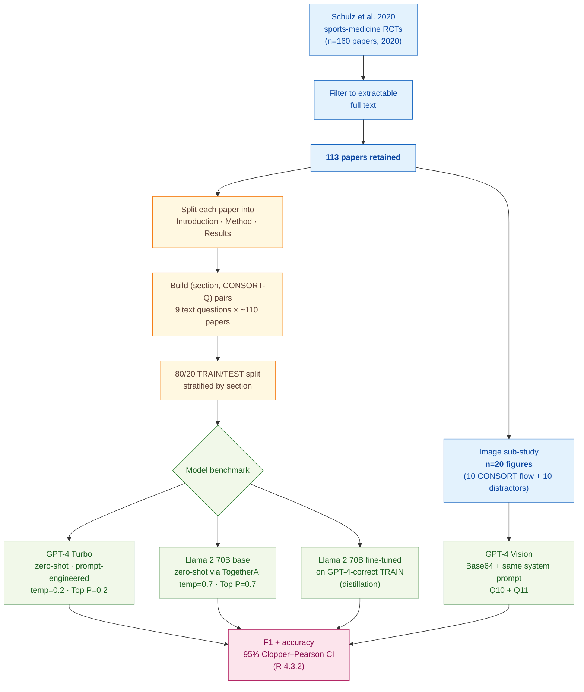

> [!success] **TL;DR**
> The headline "GPT-4 Turbo at 90% accuracy" is real on this dataset, and fine-tuning a 70-billion-parameter open-source model on GPT-4 outputs is a credible path to closing most of the closed-source gap (F1 0.84 vs. 0.89).

## Structured abstract

> [!info] A plain-language summary built from this paper's discourse-graph nodes. Numbers and findings link back to specific EVD nodes — click any link to drill in.

### Question

Can a large language model (LLM) read a published clinical trial report and tell whether the authors followed the standard reporting checklist? The authors focus on CONSORT — the Consolidated Standards of Reporting Trials, a 25-item checklist that journals use to judge whether a trial paper covers basic methodological essentials like randomisation, blinding, and effect sizes. They benchmark a closed-source model (OpenAI GPT-4 Turbo) against an open-source model (Meta Llama 2 70B), test fine-tuning on the open-source model, and add a small image sub-study using GPT-4 Vision on CONSORT participant flow diagrams. See [[QUE - How accurately can LLMs measure reporting guideline compliance in clinical trial reports?]].

### Methods

**Design.** The authors ran an exploratory retrospective benchmark: they took an existing human-labelled dataset of sports-medicine trial papers, fed each paper to several LLMs as a yes-or-no question-answering task, and compared the model answers against the human labels.

**Tools.** Three models were tested. GPT-4 Turbo is OpenAI's closed-source model accessed through an API, run with low-randomness settings (temperature = 0.2, Top P = 0.2 — both knobs that, near zero, push the model toward its single most-likely answer). Llama 2 70B is Meta's open-source 70-billion-parameter model, hosted on TogetherAI (a third-party inference and fine-tuning platform); the authors ran it at TogetherAI's defaults (temperature = 0.7, Top P = 0.7 — more random). GPT-4 Vision is OpenAI's multimodal extension that accepts images alongside text. The ground truth came from Schulz et al. 2020, a published systematic review that had already labelled 160 sports-medicine trial papers from 2020 against CONSORT items.

**Procedure.** The authors first downloaded the 160 Schulz et al. papers, kept the 113 that could be cleanly text-extracted, and split each paper into Introduction, Method, and Results sections to fit Llama 2's smaller context window. They then built (paper-section, CONSORT question) pairs for nine text questions. They split these pairs 80/20 into TRAIN and TEST, stratified by paper section. They iteratively engineered the prompt by handing the first ten wrong TRAIN answers back to ChatGPT and asking it to rewrite the instructions, then re-running. The final prompt asks the model to first summarise the relevant text and then answer YES or NO. They evaluated GPT-4 Turbo zero-shot on TEST. They then fine-tuned Llama 2 on the TRAIN examples that GPT-4 had answered correctly — a knowledge-distillation setup where GPT-4 acts as the teacher. Separately, they Base64-encoded 20 participant flow-diagram images and ran GPT-4 Vision on two image-only CONSORT items. All metrics use F1-score (runs from 0 to 1, where 1 is perfect; balances precision and recall) and classification accuracy with 95% Clopper–Pearson confidence intervals.

**Sample.** The sample-size flow ran from 160 sports-medicine trial papers from 2020, through 113 papers retained after extraction-error and file-access exclusions, to a pooled TEST confusion matrix of 198 (paper-section, question) instances for the headline GPT-4 Turbo number. The unit of analysis is the (paper-section, CONSORT-question) pair, not the paper. The image sub-study used 20 figures (10 true CONSORT flow diagrams plus 10 distractor figures), drawn from both TRAIN and TEST because the eligible pool was too small to split. No human raters were used in this paper — the labels were taken directly from Schulz et al. 2020.

### Findings

- **Fine-tuning closes most of the open-source gap.** The base Llama 2 70B reached only F1 = 0.63 with 64% accuracy (95% CI 57% to 71%) on the eight CONSORT text questions it could process. After fine-tuning on the GPT-4-correct TRAIN examples, the same model jumped to F1 = 0.84 with 83% accuracy (95% CI 77% to 88%) — a +0.21 F1 gain (+19 percentage points). The fine-tuned open-source model lands close to but does not match GPT-4 Turbo. [[EVD - Fine-tuned Llama 2 improved from F1=0.63 (64% accuracy) to F1=0.84 (83% accuracy) on CONSORT guideline questions - @wrightsonGPTRCTsUsing2025]]

- **GPT-4 Turbo gets to roughly 9 in 10 correct.** Pooled across the nine CONSORT text questions in the TEST set, GPT-4 Turbo scored F1 = 0.89 with 90% accuracy (95% CI 85% to 94%). Per-item F1 ranged from 1.00 on blinding (Q8) down to 0.57 on standardised effect sizes and confidence intervals (Q9) — the question that requires combining the Method and Results sections. The pooled confusion matrix showed 84 true-positives, 94 true-negatives, 13 false-negatives, and 7 false-positives. [[EVD - GPT-4 Turbo achieved F1=0.89 and 90% accuracy pooled across 9 CONSORT text questions on held-out clinical trial reports - @wrightsonGPTRCTsUsing2025]]

- **GPT-4 Vision spots flow diagrams but cannot audit them.** Asked "is this a CONSORT flow diagram?" GPT-4 Vision was perfect: 100% accuracy (95% CI 89% to 100%) and F1 = 1.00 across 20 images. But asked the harder follow-up — "does this diagram report the participants lost to follow-up and the reasons?" — it scored only 57% accuracy (95% CI 39% to 73%) with F1 = 0.58. The lower bound of that confidence interval (39%) sits below chance for a binary task, so the model essentially fails at fine-grained content extraction from the figure. [[EVD - GPT-4 Vision identified CONSORT flow diagrams with 100% accuracy but detected missing participant details at only 57% accuracy - @wrightsonGPTRCTsUsing2025]]

### Claim supported

Together these findings support [[CLM - LLMs can assess clinical trial reporting guideline adherence with acceptable accuracy approaching 90%]] — a closed-source model out of the box, and an open-source model with light fine-tuning, can both pass roughly 8 to 9 of 10 CONSORT text checks against human labels. For practical use, that means an LLM might plausibly act as a first-pass screen for journal editors or peer reviewers, but it is not yet a stand-alone replacement: GPT-4 Vision's collapse on fine-grained image questions and Llama 2's outright skipping of the effect-size item show real gaps that a deployed tool would still have to flag for human follow-up.

### Caveats

- **The open-source model could not see whole papers.** Llama 2's context window forced the authors to chop each paper into Introduction, Method, and Results sections, and to drop CONSORT question 9 (effect sizes) entirely because it required Method plus Results to be passed together. Performance on whole papers, or on items that span sections, may differ. [[CVT - The Llama 2 context window required splitting each paper into sections preventing whole-paper analysis]]

- **Only sports-medicine and orthopaedic papers were tested.** The 113 papers all come from one Schulz-et-al. systematic review of sports-medicine and orthopaedic journals from 2020. Other specialties — oncology, cardiology, psychiatry — use different vocabulary and reporting conventions, and the F1 = 0.89 headline may not hold up when applied to them. [[CVT - The study used only sports medicine and orthopaedic journal papers limiting generalizability to other medical fields]]

### Methods at a glance

---

## Critical appraisal

> [!info] A risk-of-bias and validity assessment across five domains, synthesized from this paper's discourse-graph nodes. Each domain gets a rating (🟢 Low risk · 🟡 Some concerns · 🔴 High risk) plus a brief, EVD-grounded justification. The TRIPOD-LLM table below covers *reporting compliance*; this section covers *methodological quality*.

| Domain | Rating | Justification |
| --- | :---: | --- |
| **Construct validity** — does the metric actually measure the construct? | 🟡 | Pooled F1 across nine binary YES/NO items is reasonable for a benchmark, but it conflates very different CONSORT constructs (e.g., "is there a hypothesis?" with "are standardised effect sizes reported?"). The deployment-relevant construct is per-item reliability — and Q9 (effect sizes) at F1 = 0.57 and Q11 (image details) at F1 = 0.58 show the headline F1 = 0.89 hides items where the tool is unreliable. |
| **Internal validity** — could the comparison be biased? | 🔴 | The authors flag potential **data leakage**: their TRAIN/TEST split is stratified by paper section, so the same paper can appear in TRAIN (e.g., its Introduction) and TEST (e.g., its Results). The fine-tuned Llama 2 is trained on GPT-4 outputs rather than human labels, capping it at GPT-4's ceiling. The Llama 2 evaluation also drops Q9 — GPT-4's worst question — so the Llama 2 vs. GPT-4 numbers are not strictly comparable. No paired test (e.g., McNemar's) between models is reported. |
| **External validity** — do findings generalize? | 🔴 | All 113 papers come from one Schulz-et-al. sports-medicine / orthopaedic systematic review (see [[CVT - The study used only sports medicine and orthopaedic journal papers limiting generalizability to other medical fields]]). The Llama 2 results require splitting papers into sections (see [[CVT - The Llama 2 context window required splitting each paper into sections preventing whole-paper analysis]]), so they don't speak to whole-paper performance. The image sub-study has n=20 with no held-out separation, and the OpenAI snapshot dates / Llama 2 weights version are not disclosed, so re-running the same code months later may yield different results. |
| **Statistical rigor** — appropriate uncertainty + comparisons? | 🟡 | 95% Clopper–Pearson confidence intervals are reported on accuracy (a strength for small samples), but no confidence intervals are given on F1 itself. No multiple-comparison correction is applied across the nine questions × three model conditions. The ±0.21 F1 jump after fine-tuning Llama 2 has no formal paired significance test. The image sub-study (n=20) is too small to support strong claims — Q11's lower CI bound (39%) is below chance. |
| **Reproducibility** — code, data, determinism? | 🟢 | Data, R 4.3.2 notebooks, Python 3.8.17 extraction code, prompt files, and image PubMed IDs are all on OSF (https://doi.org/10.17605/OSF.IO/4SHMT); the paper follows the MI-CLAIM checklist. The closed-source GPT-4 Turbo / Vision snapshot dates and random seeds are not disclosed (TRIPOD-LLM 5c, 6c — see the table below), which limits exact reruns, but the code-and-data release is otherwise unusually complete. |

**Bottom line.** The headline "GPT-4 Turbo at 90% accuracy" is real on this dataset, and fine-tuning a 70-billion-parameter open-source model on GPT-4 outputs is a credible path to closing most of the closed-source gap (F1 0.84 vs. 0.89). But the per-item breakdown, the section-stratified split, the single-specialty corpus, and the n=20 image sub-study all push this paper into "promising proof-of-concept" rather than "deployment-ready." Before any journal could trust an LLM for CONSORT screening, this design needs cross-specialty validation, a paper-level (not section-level) split, and per-item performance thresholds for the items that actually matter to reviewers.

> [!tip] **Applicable external appraisal frameworks beyond TRIPOD-LLM** (already covered by the table below): **MI-CLAIM** (Norgeot et al. 2020) for clinical-AI minimum information · **MINIMAR** (Hernandez-Boussard et al. 2020) for medical-AI reporting · **PROBAST+AI** (Wolff et al. 2019 base; AI extension in development) for prediction-model risk of bias · **CLAIM** (Mongan et al. 2020) for the GPT-4 Vision sub-study on CONSORT flow diagrams.

---

## TRIPOD-LLM reporting summary

> [!info] Reporting compliance for this paper, mapped to the TRIPOD-LLM checklist (Methods items 5a–15 and Results items 16a–18). Compliance icons: ✅ fully reported · ⚠️ partially reported / unclear · ❌ should be reported but not reported · ➖ not applicable to this study. Item 17 (Performance) is reported per-EVD; see each EVD's `## Other Notes`. Reporting was self-described as following the **MI-CLAIM** checklist (Norgeot et al. 2020), filed on OSF.

| # | Item | ✓ | Reported in this study |
| --- | --- | :---: | --- |
| **5a** | Data sources | ✅ | Subsample of Schulz et al. 2020 systematic review of sports-medicine RCTs (160 peer-reviewed papers from 2020). Open-access papers (n=24) extracted from PubMed Central; remainder from publisher EPUB / PDF. Rationale (open-source replicability) given for including Llama 2. |
| **5b** | Data points + distribution | ✅ | Table 1 reports per-question pair counts (108–113) and per-question Schulz-et-al. adherence (range 20%–77%). Online supplemental table S1 lists by-journal distribution. Image sub-study n=20 (10 CONSORT flow diagrams + 10 distractors). |
| **5c** | Date range of data | ⚠️ | All papers from publication year 2020 (via Schulz et al.); GPT-4 Turbo / Vision OpenAI snapshot dates and Llama 2 weights snapshot not disclosed. |
| **5d** | Pre-processing / quality checks | ✅ | Papers excluded if text extraction contained errors or electronic file inaccessible. Each paper split into Introduction / Method / Results to fit Llama 2 context window (Liu & Shah procedure). For Q9, Method + Results concatenated. |
| **5e** | Missing / imbalanced data | ⚠️ | Class imbalance noted implicitly (e.g., effect-size adherence 20%, blinding-detail adherence 26%); not algorithmically rebalanced. Some papers lacked specific sections, dropping per-question pair counts to 108. No validation set ("relatively low number of training examples"). |
| **6a** | LLM name + version | ⚠️ | OpenAI GPT-4 Turbo, GPT-4 Vision, and Meta Llama 2 70B named, but specific snapshot dates / weights versions not given. Pilot used GPT-3.5. |
| **6b** | Development process | ✅ | GPT-4 Turbo: zero-shot, prompt-engineered (no fine-tuning available at the time). Llama 2 70B: fine-tuned on TogetherAI using GPT-4-correctly-answered TRAIN examples. GPT-4 Vision: zero-shot. |
| **6c** | Inference settings / prompting | ⚠️ | GPT-4 Turbo: temperature=0.2, Top P=0.2, max 512 tokens. Llama 2 70B: TogetherAI default temperature=0.7, Top P=0.7. GPT-4 Vision settings not separately reported. Random seed not reported for any model. |
| **6d** | Output | ✅ | Generative QA — model summarises relevant text in step 1 then returns YES or NO in step 2; YES/NO compared to Schulz et al. ground truth. Response capped at 512 tokens. |
| **6e** | Classification thresholds | ✅ | Direct YES/NO output; no probability thresholds. Schulz et al. labels mapped to YES/NO and stored on OSF. |
| **7a** | Quality metrics | ✅ | Primary: F1-score. Secondary: classification accuracy (%) with 95% Clopper–Pearson CIs. Confusion matrix in Figure 1 for GPT-4 Turbo TEST; Llama 2 fine-tuned confusion matrix in supplemental Figure S2. |
| **7b** | Relevance to downstream | ⚠️ | Authors discuss editorial / peer-review use cases but do not quantify downstream utility (e.g., reviewer-time savings, false-positive tolerance). |
| **7c** | Outcome definition | ✅ | Adherence to 11 CONSORT-derived items (9 text + 2 image), each as a binary YES/NO outcome with Schulz et al.'s labels as ground truth. |
| **7d** | Subjective interpretation | ⚠️ | Ground truth is Schulz et al. 2020 (already labelled by external systematic-review authors); inter-rater reliability for those labels not re-reported here. Q11 image labels appear to be derived by Wrightson et al. without IAA. |
| **7e** | Comparison | ✅ | GPT-4 Turbo vs. base Llama 2 70B vs. fine-tuned Llama 2 70B on the same TEST split (8–9 questions). Pilot GPT-3.5 (86% accuracy) reported on OSF. No formal paired statistical test (e.g., McNemar's) between models. |
| **8a** | Annotation guidelines | ➖ | Annotation done by Schulz et al. 2020 (external dataset); Wrightson et al. did not re-annotate. Only image-Q11 labels appear author-derived; guideline not separately documented. |
| **8b** | Annotators + IAA | ➖ | Not applicable for the text analysis (external labels). For image-Q11, annotator(s) and IAA not reported. |
| **8c** | Annotator background | ➖ | Schulz et al.'s labels used; Wrightson et al.'s author backgrounds (sports-med / methodology / family practice / physiotherapy) listed in author affiliations. |
| **9a** | Prompt design | ✅ | Iterative prompt engineering documented in detail: started from OpenAI guidelines (persona + delimiters + step-list); used first 10 incorrectly-answered TRAIN examples to ask ChatGPT to revise; ran second revision round; pasted ChatGPT-suggested prompts verbatim. Final system prompt and per-question user prompts in supplemental Table S2. |
| **9b** | Prompt-development data | ✅ | TRAIN split (80% of text-question pairs) used for prompt engineering; specifically the first 10 incorrectly-answered TRAIN examples for each prompt-revision round. |
| **10** | Summarization | ⚠️ | Model required to summarise text relevant to the question (Step 1) before answering YES/NO (Step 2). Summary quality not separately evaluated. |
| **11** | Instruction tuning / alignment | ✅ | Llama 2 70B fine-tuned on TogetherAI using the GPT-4-correctly-answered TRAIN examples (distillation-style). GPT-4 not fine-tuned (capability not available at the time per authors). |
| **12** | Compute | ❌ | Not reported. Hosting platform (TogetherAI) named but compute time, GPU type, token usage, and API cost are not disclosed. |
| **13** | Ethical approval | ➖ | "Ethics approval: Not applicable." (Patient and public not involved; analysis on published trial reports.) |
| **14a** | Funding | ✅ | Canadian Institutes of Health Research (CIHR) Research Operating Grant (Scientific Directors) held by KMK. The funder had no role in design / conduct. |
| **14b** | Conflicts of interest | ✅ | "DM is a member of the BMJ North America Advisory Committee." No other competing interests declared. |
| **14c** | Protocol | ❌ | No pre-registered protocol mentioned; described as an "exploratory" analysis. Pilot study materials on OSF. |
| **14d** | Registration | ➖ | Not a clinical study; registration not applicable. |
| **14e** | Data availability | ✅ | "Data are available in a public, open access repository." MI-CLAIM checklist, raw data spreadsheets, R notebooks, prompt files, and PubMed IDs of image-analysis papers all on OSF (https://doi.org/10.17605/OSF.IO/4SHMT). |
| **14f** | Code availability | ✅ | R notebooks (R 4.3.2) and Python (3.8.17) extraction code on OSF, alongside data. |
| **15** | Patient/public involvement | ➖ | "Patients and the public were not involved in the design or conduct of this study." Stated explicitly. |
| **16a** | Flow of data | ✅ | 160 Schulz et al. papers → 113 included after extraction-error / file-access exclusions → text-question pairs split 80/20 TRAIN/TEST stratified by paper section → image sub-study n=20 drawn from TRAIN+TEST. |
| **16b** | Characteristics | ⚠️ | By-journal distribution in supplemental Figure S1 / Table S1 (sports-medicine and orthopaedics journals). No demographic / RCT-design characteristics of the included trials reported (since the paper evaluates reporting, not trial outcomes). |
| **16c** | Distribution comparison | ➖ | No clinical-outcome subgroup comparisons. |
| **16d** | N per analysis | ✅ | Per-question pair counts (108–113) in Table 1; image-analysis n=20 in Table 2 footnote; pooled-TEST confusion matrix N=198 in Figure 1; per-question TEST counts implicit in 95% CI widths in Table 2. |
| **17** | Performance | (per-EVD) | Reported per-EVD. See each EVD's `## Other Notes`. |
| **18** | LLM updating | ➖ | Not applicable — no recurring update / monitoring strategy proposed (closed-source GPT-4 versioning beyond authors' control; Llama 2 fine-tune is a one-shot). |
