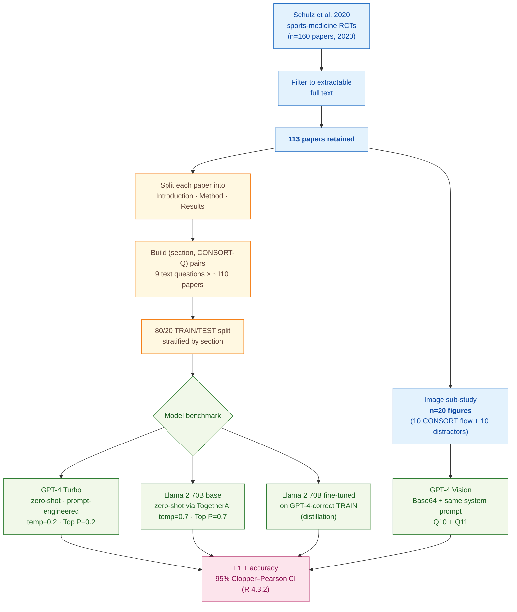

> [!success] **TL;DR**
> The headline "GPT-4 Turbo at 90% accuracy" is real on this dataset, and fine-tuning a 70-billion-parameter open-source model on GPT-4 outputs is a credible path to closing most of the closed-source gap (F1 0.84 vs. 0.89).

## Structured abstract

> [!info] A plain-language summary built from this paper's discourse-graph nodes. Numbers and findings link back to specific EVD nodes; click any link to drill in.

### Question

Can a large language model (LLM) read a published clinical trial report and tell whether the authors followed the standard reporting checklist? The authors focus on CONSORT, the Consolidated Standards of Reporting Trials, a 25-item checklist that journals use to judge whether a trial paper covers basic methodological essentials like randomisation, blinding, and effect sizes. They benchmark a closed-source model (OpenAI GPT-4 Turbo) against an open-source model (Meta Llama 2 70B), test fine-tuning on the open-source model, and add a small image sub-study using GPT-4 Vision on CONSORT participant flow diagrams. See [[QUE - How accurately can LLMs measure reporting guideline compliance in clinical trial reports?]].

### Methods

**Design.** The authors ran an exploratory retrospective benchmark: they took an existing human-labelled dataset of sports-medicine trial papers, fed each paper to several LLMs as a yes-or-no question-answering task, and compared the model answers against the human labels.

**Tools.** Three models were tested. GPT-4 Turbo is OpenAI's closed-source model accessed through an API, run with low-randomness settings (temperature = 0.2, Top P = 0.2, both knobs that, near zero, push the model toward its single most-likely answer). Llama 2 70B is Meta's open-source 70-billion-parameter model, hosted on TogetherAI (a third-party inference and fine-tuning platform); the authors ran it at TogetherAI's defaults (temperature = 0.7, Top P = 0.7, more random). GPT-4 Vision is OpenAI's multimodal extension that accepts images alongside text. The ground truth came from Schulz et al. 2020, a published systematic review that had already labelled 160 sports-medicine trial papers from 2020 against CONSORT items.

**Procedure.** The authors first downloaded the 160 Schulz et al. papers, kept the 113 that could be cleanly text-extracted, and split each paper into Introduction, Method, and Results sections to fit Llama 2's smaller context window. They then built (paper-section, CONSORT question) pairs for nine text questions. They split these pairs 80/20 into TRAIN and TEST, stratified by paper section. They iteratively engineered the prompt by handing the first ten wrong TRAIN answers back to ChatGPT and asking it to rewrite the instructions, then re-running. The final prompt asks the model to first summarise the relevant text and then answer YES or NO. They evaluated GPT-4 Turbo zero-shot on TEST. They then fine-tuned Llama 2 on the TRAIN examples that GPT-4 had answered correctly, a knowledge-distillation setup where GPT-4 acts as the teacher. Separately, they Base64-encoded 20 participant flow-diagram images and ran GPT-4 Vision on two image-only CONSORT items. All metrics use F1-score (runs from 0 to 1, where 1 is perfect; balances precision and recall) and classification accuracy with 95% Clopper–Pearson confidence intervals.

**Sample.** The sample-size flow ran from 160 sports-medicine trial papers from 2020, through 113 papers retained after extraction-error and file-access exclusions, to a pooled TEST confusion matrix of 198 (paper-section, question) instances for the headline GPT-4 Turbo number. The unit of analysis is the (paper-section, CONSORT-question) pair, not the paper. The image sub-study used 20 figures (10 true CONSORT flow diagrams plus 10 distractor figures), drawn from both TRAIN and TEST because the eligible pool was too small to split. No human raters were used in this paper; the labels were taken directly from Schulz et al. 2020.

### Findings

- **Fine-tuning closes most of the open-source gap.** The base Llama 2 70B reached only F1 = 0.63 with 64% accuracy (95% CI 57% to 71%) on the eight CONSORT text questions it could process. After fine-tuning on the GPT-4-correct TRAIN examples, the same model jumped to F1 = 0.84 with 83% accuracy (95% CI 77% to 88%), a +0.21 F1 gain (+19 percentage points). The fine-tuned open-source model lands close to but does not match GPT-4 Turbo. [[EVD - Fine-tuned Llama 2 improved from F1=0.63 (64% accuracy) to F1=0.84 (83% accuracy) on CONSORT guideline questions - @wrightsonGPTRCTsUsing2025]]

- **GPT-4 Turbo gets to roughly 9 in 10 correct.** Pooled across the nine CONSORT text questions in the TEST set, GPT-4 Turbo scored F1 = 0.89 with 90% accuracy (95% CI 85% to 94%). Per-item F1 ranged from 1.00 on blinding (Q8) down to 0.57 on standardised effect sizes and confidence intervals (Q9), the question that requires combining the Method and Results sections. The pooled confusion matrix showed 84 true-positives, 94 true-negatives, 13 false-negatives, and 7 false-positives. [[EVD - GPT-4 Turbo achieved F1=0.89 and 90% accuracy pooled across 9 CONSORT text questions on held-out clinical trial reports - @wrightsonGPTRCTsUsing2025]]

- **GPT-4 Vision spots flow diagrams but cannot audit them.** Asked "is this a CONSORT flow diagram?" GPT-4 Vision was perfect: 100% accuracy (95% CI 89% to 100%) and F1 = 1.00 across 20 images. But asked the harder follow-up, "does this diagram report the participants lost to follow-up and the reasons?", it scored only 57% accuracy (95% CI 39% to 73%) with F1 = 0.58. The lower bound of that confidence interval (39%) sits below chance for a binary task, so the model essentially fails at fine-grained content extraction from the figure. [[EVD - GPT-4 Vision identified CONSORT flow diagrams with 100% accuracy but detected missing participant details at only 57% accuracy - @wrightsonGPTRCTsUsing2025]]

### Claim supported

Together these findings support [[CLM - LLMs can assess clinical trial reporting guideline adherence with acceptable accuracy approaching 90%]], a closed-source model out of the box, and an open-source model with light fine-tuning, can both pass roughly 8 to 9 of 10 CONSORT text checks against human labels. For practical use, that means an LLM might plausibly act as a first-pass screen for journal editors or peer reviewers, but it is not yet a stand-alone replacement: GPT-4 Vision's collapse on fine-grained image questions and Llama 2's outright skipping of the effect-size item show real gaps that a deployed tool would still have to flag for human follow-up.

### Caveats

- **The open-source model could not see whole papers.** Llama 2's context window forced the authors to chop each paper into Introduction, Method, and Results sections, and to drop CONSORT question 9 (effect sizes) entirely because it required Method plus Results to be passed together. Performance on whole papers, or on items that span sections, may differ. [[CVT - The Llama 2 context window required splitting each paper into sections preventing whole-paper analysis]]

- **Only sports-medicine and orthopaedic papers were tested.** The 113 papers all come from one Schulz-et-al. systematic review of sports-medicine and orthopaedic journals from 2020. Other specialties (oncology, cardiology, psychiatry) use different vocabulary and reporting conventions, and the F1 = 0.89 headline may not hold up when applied to them. [[CVT - The study used only sports medicine and orthopaedic journal papers limiting generalizability to other medical fields]]

### Methods at a glance

---

## Quality appraisal

> [!info] Risk-of-bias and validity assessment, synthesized from this paper's discourse-graph nodes and grounded in the same paper this page's top trust-signal chips summarize. Covers *methodological quality*, the TRIPOD-LLM table below covers *reporting compliance* instead.
> <dl class="callout-legend">
> <dt>● Low risk</dt><dd>No meaningful threat to this domain identified</dd>
> <dt>◐ Some risk</dt><dd>A real but non-fatal limitation</dd>
> <dt>○ High risk</dt><dd>A significant, unaddressed threat to validity</dd>
> </dl>

| Domain | Rating | Quote |
| --- | :---: | --- |
| **Construct validity**: does the metric actually measure the construct? | 🟡 | *"Pooled across all questions and papers in the TEST dataset, the GPT-4 Turbo AI-LLM demonstrated acceptable performance (F1-score=0.89, accuracy (95% CI) = 90% (85% to 94%))"* `§Results, p.5` |
| **Internal validity**: could the comparison be biased? | 🔴 | *"The Llama 2 model was fine-tuned using the data from the GPT-4 Turbo analysis of the TRAIN dataset"* `Abstract, p.1` |
| **External validity**: do findings generalize? | 🔴 | *"The homogeneous nature of the clinical trials included in this dataset, and the poor adherence to reporting standards in sports medicine clinical trial reports... limits the generalisability of our findings to other fields"* `§Discussion, p.6` |
| **Statistical Conclusion Validity**: appropriate uncertainty + comparisons? | 🟡 | *"The model classification accuracy (the ratio of true positives to the total number of cases) and associated 95% CI were also calculated"* `§Analysis, p.5` |
| **Reproducibility**: code, data, determinism? | 🟢 | *"A completed MI-CLAIM checklist is available on the Open Science Framework (OSF, https://doi.org/10.17605/OSF.IO/4SHMT)"* `§Method, p.2` |
| **Data leakage**: could models have seen this data pretraining? | 🔴 | *"we stratified the TRAIN/TEST split by paper section, ensuring the same proportion of introduction, methods and results sections were in both datasets. This increases the possibilities of data leakage (shared data between papers in both datasets) influencing the results in the TEST dataset"* `§Discussion, p.6` |
| **Baseline adequacy**: is there a meaningful floor to beat? | 🟡 | *"The accuracy of the GPT-4 AI-LLM was slightly higher than that reported by Liu and Shah"* `§Discussion, p.5` |
| **Train/dev/test hygiene**: are data splits kept separate? | 🔴 | *"We did not create a validation data set because of the relatively low number of training examples"* `§Data, p.2` |
| **Multiple-comparisons correction**: controlled for repeated testing? | 🔴 | Not reported, accuracy and F1 across nine text questions plus two image questions, compared across three model conditions (GPT-4, Llama 2 base, Llama 2 fine-tuned), carry no stated correction for multiple testing |
| **Human-baseline comparability**: is there a human reference point? | 🔴 | Not reported, the "ground truth" for every question is inherited from Schulz et al.'s prior systematic review labels rather than an independent human comparator evaluated alongside the model within this study |
| **Confidence Intervals**: are point estimates accompanied by an interval? | 🟢 | *"the accuracy of the base model was low (F1-score=0.63, accuracy (95% CI) = 64% (57% to 71%)). Fine-tuning the model improved accuracy (F1-score=0.84, accuracy (95% CI) = 83% (77% to 88%))."* (Wrightson et al., 2025, p. 5), with 95% Clopper–Pearson CIs reported for every accuracy figure in the paper |
| **Chance-Corrected Metrics**: does agreement/accuracy correct for chance? | 🔴 | Not reported: only F1-score and accuracy (with 95% CI) are reported throughout; no kappa or MCC appears anywhere |
| **Non-Significant Result Spin**: are null or negative findings framed plainly? | 🟢 | *"asked the harder follow-up... it scored only 57% accuracy (95% CI 39% to 73%) with F1 = 0.58"* `p.6`, reported directly alongside the model's strong 100%-accuracy result on the easier sub-task, not minimized |
| **Ablation Experiment(s)**: does the paper isolate a component's contribution? | 🟢 | *"The Llama 2 model accuracy was initially poor (F1-score=0.63, accuracy (95% CI) = 64% (57% to 71%)) and improved with fine-tuning (F1-score=0.84, accuracy (95% CI) = 83% (77% to 88%))."* (Abstract, p. 1), base vs. fine-tuned model isolates the fine-tuning component's contribution |
| **Data Quality**: is the released dataset FAIR? | 🟢 | FAIR-Checker (12 semantic-web metrics, 0-2 each) against https://osf.io/4shmt: **16/24**. |

**Bottom line.** The headline "GPT-4 Turbo at 90% accuracy" is real on this dataset, and fine-tuning a 70-billion-parameter open-source model on GPT-4 outputs is a credible path to closing most of the closed-source gap (F1 0.84 vs. 0.89). But the per-item breakdown, the section-stratified split, the single-specialty corpus, and the n=20 image sub-study all push this paper into "promising proof-of-concept" rather than "deployment-ready." Before any journal could trust an LLM for CONSORT screening, this design needs cross-specialty validation, a paper-level (not section-level) split, and per-item performance thresholds for the items that actually matter to reviewers.

> [!tip] **Applicable external appraisal frameworks beyond TRIPOD-LLM** (already covered by the table below): **MI-CLAIM** (Norgeot et al. 2020) for clinical-AI minimum information · **MINIMAR** (Hernandez-Boussard et al. 2020) for medical-AI reporting · **PROBAST+AI** (Wolff et al. 2019 base; AI extension in development) for prediction-model risk of bias · **CLAIM** (Mongan et al. 2020) for the GPT-4 Vision sub-study on CONSORT flow diagrams.

---

## TRIPOD-LLM reporting summary

> [!info] Reporting compliance for this paper, mapped to the TRIPOD-LLM checklist (Title/Abstract/Introduction items 1–4, Methods items 5a–15, Results items 16a–18). Item 17 (Performance) is reported per-EVD; see each EVD's `## Other Notes`. Reporting was self-described as following the **MI-CLAIM** checklist (Norgeot et al. 2020), filed on OSF.
> 

> ●Fully reported
> ◐Partial / unclear
> ○Not reported
> –Not applicable
> 

| # | Item | ✓ | Quote |
| --- | --- | :---: | --- |
| **1** | Title | ✅ | *"GPT for RCTs? Using AI to determine adherence to clinical trial reporting guidelines"* `Title` |
| **2** | Abstract | ➖ | Assessed separately under TRIPOD-LLM's own Abstract extension, not scored here |
| **3a** | Background: context + rationale | ✅ | *"Poor reporting of clinical trials is common,1 threatens the reliability and credibility of medical research2 and affects patient care.3"* `§Introduction, p.1` |
| **3b** | Background: target population | ✅ | *"There is increasing interest in the rigour and transparency, or lack thereof, of sports medicine, exercise science and orthopaedic research."* `§Introduction, p.2` |
| **4** | Objectives | ✅ | *"This exploratory study aimed to determine how accurate a large language model generative artificial intelligence system (AI-LLM) was for determining reporting guideline compliance in a sample of sports medicine clinical trial reports."* `Abstract, p.1` |
| **5a** | Data sources | ✅ | *"We used a subsample of the dataset provided by Schulz et al.19 In their systematic review, Schulz et al analysed the reporting practices, including items from the CONSORT checklist, of 160 peer-reviewed scientific papers published in sports medicine journals in 2020."* `§Data, p.2` |
| **5b** | Data points + distribution | ✅ | *"The number of text-question pairs for each reporting guideline in the dataset, and the proportion of papers that adhered to each guideline"* `Table 1, p.3` |
| **5c** | Date range of data | ⚠️ | *"of 160 peer-reviewed scientific papers published in sports medicine journals in 2020"* `§Data, p.2`, GPT-4 / Llama 2 model snapshot dates not stated |
| **5d** | Pre-processing / quality checks | ✅ | *"Papers were removed from analysis if (a) the text extraction contained errors or (b) the electronic file was inaccessible."* `§Data, p.2` |
| **5e** | Missing / imbalanced data | ⚠️ | *"We did not create a validation data set because of the relatively low number of training examples."* `§Data, p.2` |
| **6a** | LLM name + version | ⚠️ | *"We tested three models: OpenAI's GPT-4 Turbo and GPT-4 Vision and Meta's Llama 2 70B."* `§Model choice and optimisation, p.4`, specific snapshot dates / weights versions not given |
| **6b** | Development process | ✅ | *"For the GPT-4 analysis, we used the following hyperparameter settings: temperature=0.2 and Top P=0.2. Unfortunately, at the time of this analysis, we did not have access to fine-tune the GPT-4 model. Model tuning in our study was achieved through iterative 'prompt engineering'."* `§Model choice and optimisation, p.4` |
| **6c** | Inference settings / prompting | ⚠️ | *"we used the following hyperparameter settings: temperature=0.2 and Top P=0.2"* `§Model choice and optimisation, p.4`, Llama 2 run at "the platform default hyperparameter values (temperature and Top P=0.7)"; random seed not reported for either model |
| **6d** | Output | ✅ | *"The model was required to summarise the text that was relevant to the question and answer YES or NO."* `§Method, p.4` |
| **6e** | Classification thresholds | ➖ | Not applicable: outputs are direct YES/NO categorical labels, no probability thresholding |
| **7a** | Quality metrics | ✅ | *"The primary outcome of this study was the F1-score (%) from the GPT-4 text analysis."* `§Analysis, p.5` |
| **7b** | Relevance to downstream use | ⚠️ | *"Using an AI-LLM may help journal editors, publishers, peer reviewers and authors check reporting guideline adherence quickly and accurately, which could reduce both editorial workloads and waste in research."* `§Discussion, p.5`, discussed but not quantified |
| **7c** | Outcome definition | ✅ | *"Each reporting guideline item was assessed using a generative question and answering format, where the model was prompted to answer a question, formulated using natural language, about the text/image extracted from each paper."* `§Method, p.4` |
| **7d** | Subjective interpretation | ⚠️ | *"The label ('ground truth') for each question ('YES' or 'NO') was extracted from the systematic analysis by Schulz et al."* `§Method, p.4`, ground truth inherited from an external systematic review, no re-reported inter-rater agreement |
| **7e** | Comparison | ✅ | *"As expected, the Open-AI model was more accurate than the open-source Llama 2 model. However, fine-tuning the Llama 2 model significantly improved its accuracy."* `§Discussion, p.5` |
| **8a** | Annotation guidelines | ➖ | Not applicable: labels inherited from Schulz et al. 2020's external systematic review; Wrightson et al. did not re-annotate |
| **8b** | Annotators + IAA | ➖ | Not applicable: external labels used for the text analysis; no annotator count or IAA reported for the image sub-study labels |
| **8c** | Annotator background | ➖ | Not applicable: Schulz et al.'s labels used as ground truth; Wrightson et al.'s own backgrounds are listed only as author affiliations |
| **9a** | Prompt design | ✅ | *"The system and user prompts were developed using the guidelines provided by OpenAI28 and included asking the model to adopt a persona (the system prompt), using delimiters to distinguish parts of the input and specifying the steps required to complete the task (the user prompt)."* `§Model choice and optimisation, p.4` |
| **9b** | Prompt-development data | ✅ | *"We subsequently took the first 10 examples from the training dataset that the model had incorrectly answered and used the OpenAI ChatGPT application to help us improve the system and user prompts"* `§Model choice and optimisation, p.4` |
| **10** | Summarization | ⚠️ | *"The model was required to summarise the text that was relevant to the question and answer YES or NO."* `§Method, p.4`, summary quality not separately evaluated |
| **11** | Instruction tuning / alignment | ✅ | *"The Llama 2 model was fine-tuned using the correctly answered questions from the GPT-4 analysis of the text training data."* `§Model choice and optimisation, p.4` |
| **12** | Compute | ⚠️ | *"the model was hosted on the TogetherAI platform (San Francisco, California, USA)"* `§Model choice and optimisation, p.4`, GPU type, token usage, and API cost not disclosed |
| **13** | Ethical approval | ➖ | *"Ethics approval Not applicable."* `p.6` |
| **14a** | Funding | ✅ | *"This work was supported by a Canadian Institutes of Health Research (CIHR) Research Operating Grant (Scientific Directors) held by KMK. The funder had no role in the design and conduct of the study."* `p.6` |
| **14b** | Conflicts of interest | ✅ | *"DM is a member of the BMJ North America Advisory Committee."* `p.6` |
| **14c** | Protocol | ❌ | Not reported |
| **14d** | Registration | ➖ | Not applicable: not a registered clinical study |
| **14e** | Data availability | ✅ | *"Data are available in a public, open access repository."* `p.6` |
| **14f** | Code availability | ✅ | *"Details for the data extraction are shown in the R notebooks located on the OSF."* `§Data, p.2` |
| **15** | Patient/public involvement | ➖ | *"Patients and the public were not involved in the design or conduct of this study."* `§Method, p.5` |
| **16a** | Flow of data | ✅ | *"Papers were removed from analysis if (a) the text extraction contained errors or (b) the electronic file was inaccessible."* `§Data, p.2`, 160 Schulz et al. papers → 113 retained → pairs split 80/20 TRAIN/TEST stratified by section |
| **16b** | Characteristics | ✅ | *"The breakdown of included papers (n=113) by publication name is shown in online supplemental figure S1."* `§Results, p.5` |
| **16c** | Distribution comparison | ➖ | Not applicable: no clinical-outcome subgroup comparisons |
| **16d** | N per analysis | ✅ | *"Analysis performed on a subset (n=20) of the dataset."* `Table 2, p.3` |
| **17** | Performance | `per-EVD` | Reported per-EVD. See each EVD's `## Other Notes`. |
| **18** | LLM updating | ➖ | Not applicable: no recurring update / monitoring strategy proposed |
