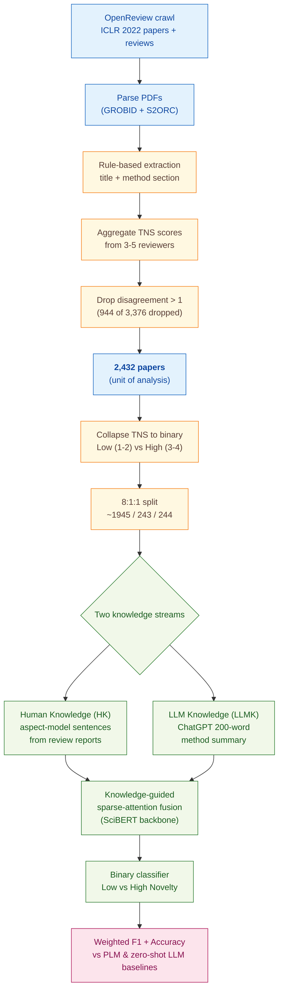

> [!success] **TL;DR**
> The 10-point F1 gain from fusing human and LLM knowledge is real and the ablation cleanly localizes it to the knowledge-guided module, that part is well demonstrated. But the comparison to LLM baselines is not fair (zero-shot, no tuning), the evaluation lives entirely inside one ML conference, and the headline metric averages over an imbalanced binary collapse of a noisy subjective label.

## Abstract

### Question

Can a computer judge how novel a research paper's method is, and does it do better when it has access to *both* what human reviewers wrote *and* what a large language model thinks? The authors focus on machine-learning papers from ICLR (a premier deep-learning conference), where reviewers already assign a 1-to-4 "Technical Novelty and Significance" (TNS) score. They compare their proposed knowledge-fusion model against five plain pretrained language models (PLMs) and four off-the-shelf large language models (LLMs) used zero-shot. See [[QUE - Can integrating LLM knowledge with human reviewer knowledge improve automated novelty prediction of academic papers?]].

### Methods

**Design.** The authors built a single supervised-learning benchmark on a new ICLR 2022 corpus, framed as binary classification (Low Novelty versus High Novelty), then ran a component ablation to see which piece of the model carries the gain.

**Tools.** The proposed model, "Ours-SciBERT", pairs SciBERT (a pretrained language model trained on scientific text) with a knowledge-guided sparse-attention module that fuses two information streams. The first stream is Human Knowledge (HK): novelty-related sentences pulled out of peer reviews using an aspect-annotation model from Yuan et al. (2022). The second stream is LLM Knowledge (LLMK): a short novelty summary generated by ChatGPT (gpt-3.5-turbo) at temperature 0, capped at 200 words. Baselines include four other PLMs (BERT, RoBERTa, XLNet, ALBERT) and four zero-shot LLMs (LLaMA-3.1-8B, ChatGPT, GPT-4o, Claude-3.5-sonnet). PDFs were parsed with GROBID and S2ORC (open-source scientific-document parsers).

**Procedure.** The authors crawled ICLR 2022 papers and reviews from OpenReview. They extracted each paper's method section using rule-based parsing, then averaged TNS scores from the 3 to 5 reviewers per paper. They dropped any paper where the highest and lowest reviewer scores differed by more than 1, and collapsed the 1-to-4 TNS scale into Low Novelty (TNS 1 to 2) versus High Novelty (TNS 3 to 4). They built HK by running the aspect annotation model on each review report. They built LLMK by prompting ChatGPT once per paper with the title plus method section. The fusion model encodes HK and LLMK with a shared SciBERT backbone, fuses them via sparse attention, and predicts a binary label. Training used the Adam optimizer at learning rate 1e-5, batch size 16, dropout 0.2, and 5 negative samples per instance. The authors report weighted F1 (F1 runs from 0 to 1; higher is better; "weighted" averages each class by its frequency) and accuracy on the held-out test split.

**Sample.** The authors crawled 3,376 ICLR 2022 papers, dropped 944 with reviewer disagreement greater than 1, and kept 2,432 papers as the unit of analysis. They split these 8:1:1 into roughly 1,945 train, 243 validation, and 244 test papers. The class breakdown skewed toward Low Novelty (n=1,425) over High Novelty (n=1,007). No human raters were recruited for this study; the labels come from the original ICLR reviewers.

### Findings

- **Fusing human and LLM knowledge wins by 10 F1 points.** The proposed Ours-SciBERT model with HK+LLMK inputs scored weighted F1 = 0.83 and accuracy = 0.84. The best PLM baseline using the same inputs (SciBERT alone) reached only F1 = 0.73 / accuracy = 0.74, and the best zero-shot LLM (GPT-4o) reached F1 = 0.68 / accuracy = 0.68. Smaller LLaMA-3.1 trailed at F1 = 0.44. The fusion advantage held across all five PLM backbones the authors tested. [[EVD - Ours-SciBERT with combined human and LLM knowledge achieved F1=0.83 and accuracy=0.84 on method novelty prediction - @wuAutomatedNoveltyEvaluationa]]

- **The knowledge-guided module is doing the heavy lifting.** Removing the sparse-attention fusion module dropped the model from F1 = 0.83 / accuracy = 0.84 to F1 = 0.73 / accuracy = 0.74, a 10-point fall on both metrics. Removing the Self-Attention Reduction prediction head cost only 4 points, and removing the basic self-attention block cost only 2 points. After ablation, the stripped-down model lands at the same level as a plain SciBERT baseline, suggesting the fusion module, not the backbone, is what generates the gain. [[EVD - Removing the knowledge-guided module from the novelty prediction model dropped accuracy from 0.84 to 0.74 - @wuAutomatedNoveltyEvaluationa]]

### Claim supported

These findings collectively support the claim that [[CLM - Combining human reviewer knowledge with LLM-generated method summaries improves automated novelty prediction beyond either source alone]]. For someone considering this in practice: the headline 0.83 weighted F1 is meaningful inside ICLR-style ML conferences, but the result depends on already having peer-review text, so this is a tool for *post-review* triage and meta-analysis, not for deciding novelty before reviewers have weighed in.

### Caveats

- **Zero-shot LLMs were never tuned for the task.** All four LLM baselines ran zero-shot at default settings, with no prompt engineering or few-shot examples. This understates what an off-the-shelf LLM could do with even minor tuning, which means the gap between the proposed fusion model and a plain LLM may be smaller than the headline numbers imply. [[CVT - LLMs were evaluated only under zero-shot conditions without prompt optimization or fine-tuning for novelty assessment]]

- **All 2,432 papers come from a single ML conference.** ICLR 2022 reviewers use specific vocabulary and rubrics for novelty, which may not transfer to biology, social science, medicine, or other peer-review systems. Whether the model would work on a non-ML domain, or even a non-ICLR ML venue, is untested. [[CVT - The novelty prediction dataset was limited to ICLR machine learning conference papers restricting generalizability to other academic domains]]

### Methods at a glance

---

## Quality appraisal

> [!info] Risk-of-bias and validity assessment, synthesized from this paper's discourse-graph nodes and grounded in the same paper this page's top trust-signal chips summarize. Covers *methodological quality*, the TRIPOD-LLM table below covers *reporting compliance* instead.
> <dl class="callout-legend">
> <dt>● Low risk</dt><dd>No meaningful threat to this domain identified</dd>
> <dt>◐ Some risk</dt><dd>A real but non-fatal limitation</dd>
> <dt>○ High risk</dt><dd>A significant, unaddressed threat to validity</dd>
> </dl>

| Domain | Rating | Quote |
| --- | :---: | --- |
| **Construct validity**: does the metric actually measure the construct? | 🟡 | *"the extremely imbalanced distribution of labels may lead to unfair prediction results. Therefore, in order to avoid this issue, we grouped scores 1 and 2 into one category, and scores 3 and 4 into another category."* `§3.2, p.14` |
| **Internal validity**: could the comparison be biased? | 🔴 | *"When calling the API, all parameters are default parameters. The experimental results of the LLMs are the averages obtained from three rounds of experiments conducted under zero-shot conditions."* `§5.2, p.20` |
| **External validity**: do findings generalize? | 🔴 | *"the data we used from ICLR is limited to the field of machine learning, introducing certain constraints to the generalizability of our findings."* `§6.2 Limitation, p.29` |
| **Statistical Conclusion Validity**: appropriate uncertainty + comparisons? | 🟡 | *"The results of the LLMs are the averages obtained from three rounds of testing."* `Table 2 note, p.21`, no confidence intervals, significance tests, or multiple-comparison correction reported alongside this |
| **Reproducibility**: code, data, determinism? | 🟢 | *"The code and dataset for this paper can be accessed at https://github.com/njust-winchy/method_novelty_predict."* `§1, p.6` |
| **Data leakage**: could models have seen this data pretraining? | 🔴 | Not reported, the paper does not discuss whether ICLR 2022 papers or reviews may have appeared in the ChatGPT/LLM pretraining corpora |
| **Baseline adequacy**: is there a meaningful floor to beat? | 🟡 | *"We selected the following five PLMs and commonly used LLMs as baselines to fully validate the performance of our method."* `§5.2, p.18` |
| **Train/dev/test hygiene**: are data splits kept separate? | 🟢 | *"We split our dataset by a ratio of 8:1:1 for training, development and testing."* `§5.1, p.18` |
| **Multiple-comparisons correction**: controlled for repeated testing? | 🔴 | Not reported, no correction is stated across the many model × input-combination comparisons in Tables 2–4 |
| **Human-baseline comparability**: is there a human reference point? | 🔴 | Not addressed, peer-reviewer TNS scores are used only as training/gold labels, not evaluated as a separately-run human comparator system |
| **Confidence Intervals**: are point estimates accompanied by an interval? | 🔴 | Not reported: *"the results of the LLMs are the averages obtained from three rounds of testing"* `Table 2 note, p.21` gives a point estimate with no interval |
| **Chance-Corrected Metrics**: does agreement/accuracy correct for chance? | 🔴 | Not reported: only F1 and accuracy are reported (Tables 2-4); no chance-corrected statistic appears anywhere |
| **Non-Significant Result Spin**: are null or negative findings framed plainly? | 🔴 | Not applicable: no significance testing is performed on the paper's own results, so there is no null finding to spin |
| **Ablation Experiment(s)**: does the paper isolate a component's contribution? | 🟢 | *"To better understand the effectiveness of each component of our method, we have done an ablation study as shown in Table 4... We systematically removed three components, namely, Self-Attention Reduction, Knowledge Guided, and Self Attention, to examine their individual impacts on the model."* `p.1463, §5.4` |
| **Code Quality**: does the released code follow FAIR-software practices? | 🔴 | `howfairis` (fair-software.eu 5-criteria checklist) against https://github.com/njust-winchy/method_novelty_predict: **1/5**: open repository only: no license, package-registry listing, citation metadata, or quality-checklist badge. |
| **Data Quality**: is the released dataset FAIR? | 🔴 | FAIR-Checker (12 semantic-web metrics, 0-2 each) against https://github.com/njust-winchy/method_novelty_predict: **4/24**. |

**Bottom line.** The 10-point F1 gain from fusing human and LLM knowledge is real and the ablation cleanly localizes it to the knowledge-guided module, that part is well demonstrated. But the comparison to LLM baselines is not fair (zero-shot, no tuning), the evaluation lives entirely inside one ML conference, and the headline metric averages over an imbalanced binary collapse of a noisy subjective label. Before this is deployment-ready as a triage tool, it would need at least: a tuned-LLM baseline, evaluation on a non-ICLR venue, and per-class metrics on High-Novelty papers.

> [!tip] **Applicable external appraisal frameworks beyond TRIPOD-LLM** (already covered by the table below): **HELM** (Liang et al. 2022) for holistic LLM-evaluation principles · **Datasheets for Datasets** (Gebru et al. 2021) for the evaluation corpus · **Model Cards** (Mitchell et al. 2019) for the LLMs being evaluated · **PROBAST+AI** for the supervised SciBERT-based novelty classifier.

---

## TRIPOD-LLM reporting summary

> [!info] Reporting compliance for this paper, mapped to the TRIPOD-LLM checklist (Title/Abstract/Introduction items 1–4, Methods items 5a–15, Results items 16a–18). TRIPOD-LLM is a clinical-ML guideline being applied here to a non-clinical AI-research benchmark, where an item's own wording says "healthcare context" or "care pathway," it's read as "research-evaluation context" / "research workflow" instead. Item 17 (Performance) is reported per-EVD; see each EVD's `## Other Notes`.
> 

> ●Fully reported
> ◐Partial / unclear
> ○Not reported
> –Not applicable
> 

| # | Item | ✓ | Quote |
| --- | --- | :---: | --- |
| **1** | Title | ✅ | *"Automated Novelty Evaluation of Academic Paper: A Collaborative Approach Integrating Human Expertise and Large Language Models"* `Title` |
| **2** | Abstract | ➖ | Assessed separately under TRIPOD-LLM's own Abstract extension, not scored here |
| **3a** | Background: context + rationale | ✅ | *"Because peer review (Siler et al., 2015) necessitates a comprehensive evaluation of a manuscript's novelty, reliability, clarity, and significance to maintain consistently high standards in academic publications. The rapid advancement of artificial intelligence ... has also opened possibilities for predicting the novelty of papers without relying on citations."* `§1, p.2` |
| **3b** | Background: target population | ✅ | *"The International Conference on Learning Representations (ICLR) is a premier conference in the field of machine learning. We wrote a web crawler code to retrieve a total of 3376 ICLR papers, each containing peer review comments and its decision, accepted (ACC), rejected (REJ), and withdrawn (WDR)."* `§3.1, p.11` |
| **4** | Objectives | ✅ | *"In this paper, we propose leveraging human knowledge and LLM to assist pretrained language models (PLMs, e.g. BERT etc.) in predicting the method novelty of papers."* `Abstract, p.1` |
| **5a** | Data sources | ✅ | *"We obtain our peer review data from the OpenReview platform. ... We wrote a web crawler code to retrieve a total of 3376 ICLR papers, each containing peer review comments and its decision"* `§3.1, p.11` |
| **5b** | Data points + distribution | ✅ | *"# TNS=1 0 29 22 51 · # TNS=2 195 737 442 1374 · # TNS=3 535 306 95 936 · # TNS=4 63 7 1 71 · # Papers 793 1079 560 2432"* `Table 1, p.13` |
| **5c** | Date range of data | ⚠️ | *"The peer review reports for International Conference on Learning Representations (ICLR) 2022 include the review text, Correctness, Technical Novelty and Significance, Empirical Novelty and Significance, Recommendation, and Confidence."* `§3.2, p.13`, exact crawl window and LLM API call dates not stated |
| **5d** | Pre-processing / quality checks | ✅ | *"We utilized the GROBID (2008-2022) and S2ORC (Lo et al., 2020) tools to parse the PDFs into JSON format. Subsequently, we manually defined numerous rules to extract the title and the methodology sections from the parsed PDFs."* `§3.2, p.11-12` |
| **5e** | Missing / imbalanced data | ⚠️ | *"we identified the maximum and minimum scores in each review report and exclude instances where the difference exceeds 1, signifying reviewer disagreement. These cases are subsequently removed from the dataset."* ... *"the extremely imbalanced distribution of labels may lead to unfair prediction results. Therefore ... we grouped scores 1 and 2 into one category, and scores 3 and 4 into another category."* `§3.2, p.14` |
| **6a** | LLM name + version | ✅ | *"Llama 3.1 is 8B version, ChatGPT's version is gpt-3.5-turbo-0125, GPT-4o's version is gpt-4o, Claude's version is claude-3-5-sonnet-all."* `§5.2, p.19-20` |
| **6b** | Development process | ✅ | *"We use Adam (Kingma & Ba, 2014) with an initial learning rate of 1e-5 and update parameters with a batch size of 16. The trained model represents the best-performing model based on the validation set results. We split our dataset by a ratio of 8:1:1 for training, development and testing."* `§5.1, p.18` |
| **6c** | Inference settings / prompting | ⚠️ | *"When calling the API, all parameters are default parameters. The experimental results of the LLMs are the averages obtained from three rounds of experiments conducted under zero-shot conditions."* `§5.2, p.20`, for LLMK generation: *"we set the temperature parameter to 0, while keeping all other parameters at their default settings"* `§3.2, p.12`, system prompt, top_p, seed not reported |
| **6d** | Output | ✅ | *"The goal of MNP is to develop a classification model f that assigns predefined novelty (Low novelty and High novelty) based on the review text and feedback."* `§4.1, p.16` |
| **6e** | Classification thresholds | ✅ | *"we retained only the scores for Technical Novelty and Significance (TNS) as the gold standard for novelty"* ... *"we grouped scores 1 and 2 into one category, and scores 3 and 4 into another category"* `§3.2, p.13-14`, no probability threshold reported (argmax of softmax) |
| **7a** | Quality metrics | ✅ | *"We adopt Accuracy and Weighted F1 as the evaluation metrics for our dataset to evaluate the performance of the model."* `§5.1, p.18` |
| **7b** | Relevance to downstream use | ⚠️ | *"In these cases, automated evaluation becomes essential to synthesize multiple reviewers' perspectives and offer readers a more objective and unified assessment."* `§6.3, p.30`, no formal downstream-utility experiment (e.g. reviewer time savings) reported |
| **7c** | Outcome definition | ✅ | *"Based on the collected dataset, we defined a new task: method novelty prediction (MNP)."* `§4.1, p.16` |
| **7d** | Subjective interpretation | ⚠️ | *"Through our manual assessment, the feedback generated by ChatGPT is relatively reliable."* `§3.2, p.12`, no IAA-style metric for TNS reviewer scoring itself |
| **7e** | Comparison | ✅ | *"The results are illustrated in Table 2."* ... *"we conducted an additional comparative experiment. In this section, we separately used the HK, MT and LLMK from the previous section as inputs"* `Table 2, p.20; Table 3, §5.3.2, p.23`, plus ablation `Table 4, p.25` and case study `Figure 5, §5.5, p.26` |
| **8a** | Annotation guidelines | ✅ | *"Yuan et al. (Yuan et al., 2022) followed the Annual Meeting of the Association for Computational Linguistics (ACL) review guidelines and utilized human annotators to label 1000 instances for aspects such as summarization, motivation, novelty, soundness, significance, replicability, meaningful comparisons, and clarity."* `§3.2, p.12-13` |
| **8b** | Annotators + IAA | ⚠️ | *"Each paper receives evaluations from three to four reviewers, and each reviewer assigns a Technical Novelty and Significance (TNS) score."* `§3.2, p.13-14`, no quantitative inter-annotator agreement (κ/α) reported, only the max-min ≤1 exclusion rule |
| **8c** | Annotator background | ⚠️ | *"the crucial data of novelty scores, provided by expert reviewers at ICLR 2022"* `§2.2, p.8`, no per-reviewer demographics or seniority data |
| **9a** | Prompt design | ✅ | *"we utilized the extracted title and methodology section of the papers to construct the prompt for ChatGPT. We requested ChatGPT to provide evaluations and summaries of the novelty of the methodology section, with a constraint of staying within 200 words."* `§3.2, p.12` |
| **9b** | Prompt-development data | ❌ | Not reported |
| **10** | Summarization | ✅ | *"We requested ChatGPT to provide evaluations and summaries of the novelty of the methodology section, with a constraint of staying within 200 words."* `§3.2, p.12` |
| **11** | Instruction tuning / alignment | ➖ | Not applicable: LLMs used off-the-shelf zero-shot; PLMs fine-tuned for the classification task but not instruction-tuned |
| **12** | Compute | ⚠️ | *"All models are run with V100 or RTX 4090 GPU."* `§5.1, p.18`, total compute, training time, and API cost not reported |
| **13** | Ethical approval | ➖ | Not applicable: no IRB/ethics-committee or impact statement found in the paper (analysis of public peer-review data; not human-subjects research) |
| **14a** | Funding | ✅ | *"This work is supported by the National Natural Science Foundation of China (Grant No. 72074113) and the Graduate Research and Practice Innovation Program of Jiangsu Province (Grant No. KYCX22 0497)"* `§8 Acknowledgment, p.32` |
| **14b** | Conflicts of interest | ❌ | Not reported |
| **14c** | Protocol | ❌ | Not reported |
| **14d** | Registration | ➖ | Not applicable: not a registered clinical study |
| **14e** | Data availability | ✅ | *"The code and dataset for this paper can be accessed at https://github.com/njust-winchy/method_novelty_predict."* `§1, p.6` |
| **14f** | Code availability | ✅ | *"The code and dataset for this paper can be accessed at https://github.com/njust-winchy/method_novelty_predict."* `§1, p.6` |
| **15** | Patient/public involvement | ➖ | Not applicable |
| **16a** | Flow of data | ✅ | *"We wrote a web crawler code to retrieve a total of 3376 ICLR papers"* ... *"Following all the aforementioned preprocessing steps, the final dataset consists of 2432 instances."* `§3.1, p.11; §3.2, p.14` |
| **16b** | Characteristics | ✅ | *"# TNS=1 0 29 22 51 · # TNS=2 195 737 442 1374 · # TNS=3 535 306 95 936 · # TNS=4 63 7 1 71 · # Papers 793 1079 560 2432"* `Table 1, p.13` |
| **16c** | Distribution comparison | ➖ | Not applicable: no clinical-outcome subgroup comparison |
| **16d** | N per analysis | ⚠️ | *"We split our dataset by a ratio of 8:1:1 for training, development and testing."* `§5.1, p.18`, exact train/val/test counts not numerically printed |
| **17** | Performance | `per-EVD` | Reported per-EVD. See each EVD's `## Other Notes`. |
| **18** | LLM updating | ➖ | Not applicable: no model updating reported |
