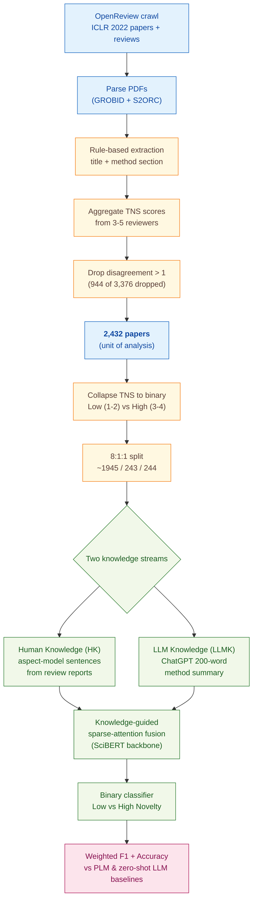

> [!success] **TL;DR**
> The 10-point F1 gain from fusing human and LLM knowledge is real and the ablation cleanly localizes it to the knowledge-guided module — that part is well demonstrated. But the comparison to LLM baselines is not fair (zero-shot, no tuning), the evaluation lives entirely inside one ML conference, and the headline metric averages over an imbalanced binary collapse of a noisy subjective label.

## Structured abstract

> [!info] A plain-language summary built from this paper's discourse-graph nodes. Numbers and findings link back to specific EVD nodes — click any link to drill in.

### Question

Can a computer judge how novel a research paper's method is — and does it do better when it has access to *both* what human reviewers wrote *and* what a large language model thinks? The authors focus on machine-learning papers from ICLR (a premier deep-learning conference), where reviewers already assign a 1-to-4 "Technical Novelty and Significance" (TNS) score. They compare their proposed knowledge-fusion model against five plain pretrained language models (PLMs) and four off-the-shelf large language models (LLMs) used zero-shot. See [[QUE - Can integrating LLM knowledge with human reviewer knowledge improve automated novelty prediction of academic papers?]].

### Methods

**Design.** The authors built a single supervised-learning benchmark on a new ICLR 2022 corpus, framed as binary classification (Low Novelty versus High Novelty), then ran a component ablation to see which piece of the model carries the gain.

**Tools.** The proposed model — "Ours-SciBERT" — pairs **SciBERT** (a pretrained language model trained on scientific text) with a **knowledge-guided sparse-attention** module that fuses two information streams. The first stream is **Human Knowledge (HK)**: novelty-related sentences pulled out of peer reviews using an aspect-annotation model from Yuan et al. (2022). The second stream is **LLM Knowledge (LLMK)**: a short novelty summary generated by **ChatGPT (gpt-3.5-turbo)** at temperature 0, capped at 200 words. Baselines include four other PLMs (BERT, RoBERTa, XLNet, ALBERT) and four zero-shot LLMs (LLaMA-3.1-8B, ChatGPT, GPT-4o, Claude-3.5-sonnet). PDFs were parsed with **GROBID** and **S2ORC** (open-source scientific-document parsers).

**Procedure.** The authors crawled ICLR 2022 papers and reviews from OpenReview. They extracted each paper's method section using rule-based parsing, then averaged TNS scores from the 3 to 5 reviewers per paper. They dropped any paper where the highest and lowest reviewer scores differed by more than 1, and collapsed the 1-to-4 TNS scale into Low Novelty (TNS 1 to 2) versus High Novelty (TNS 3 to 4). They built HK by running the aspect annotation model on each review report. They built LLMK by prompting ChatGPT once per paper with the title plus method section. The fusion model encodes HK and LLMK with a shared SciBERT backbone, fuses them via sparse attention, and predicts a binary label. Training used the Adam optimizer at learning rate 1e-5, batch size 16, dropout 0.2, and 5 negative samples per instance. The authors report weighted F1 (F1 runs from 0 to 1; higher is better; "weighted" averages each class by its frequency) and accuracy on the held-out test split.

**Sample.** The authors crawled 3,376 ICLR 2022 papers, dropped 944 with reviewer disagreement greater than 1, and kept **2,432 papers** as the unit of analysis. They split these 8:1:1 into roughly 1,945 train, 243 validation, and 244 test papers. The class breakdown skewed toward Low Novelty (n=1,425) over High Novelty (n=1,007). No human raters were recruited for this study; the labels come from the original ICLR reviewers.

### Findings

- **Fusing human and LLM knowledge wins by 10 F1 points.** The proposed Ours-SciBERT model with HK+LLMK inputs scored weighted F1 = 0.83 and accuracy = 0.84. The best PLM baseline using the same inputs (SciBERT alone) reached only F1 = 0.73 / accuracy = 0.74, and the best zero-shot LLM (GPT-4o) reached F1 = 0.68 / accuracy = 0.68. Smaller LLaMA-3.1 trailed at F1 = 0.44. The fusion advantage held across all five PLM backbones the authors tested. [[EVD - Ours-SciBERT with combined human and LLM knowledge achieved F1=0.83 and accuracy=0.84 on method novelty prediction - @wuAutomatedNoveltyEvaluationa]]

- **The knowledge-guided module is doing the heavy lifting.** Removing the sparse-attention fusion module dropped the model from F1 = 0.83 / accuracy = 0.84 to F1 = 0.73 / accuracy = 0.74 — a 10-point fall on both metrics. Removing the Self-Attention Reduction prediction head cost only 4 points, and removing the basic self-attention block cost only 2 points. After ablation, the stripped-down model lands at the same level as a plain SciBERT baseline, suggesting the fusion module — not the backbone — is what generates the gain. [[EVD - Removing the knowledge-guided module from the novelty prediction model dropped accuracy from 0.84 to 0.74 - @wuAutomatedNoveltyEvaluationa]]

### Claim supported

These findings collectively support the claim that [[CLM - Combining human reviewer knowledge with LLM-generated method summaries improves automated novelty prediction beyond either source alone]]. For someone considering this in practice: the headline 0.83 weighted F1 is meaningful inside ICLR-style ML conferences, but the result depends on already having peer-review text — so this is a tool for *post-review* triage and meta-analysis, not for deciding novelty before reviewers have weighed in.

### Caveats

- **Zero-shot LLMs were never tuned for the task.** All four LLM baselines ran zero-shot at default settings, with no prompt engineering or few-shot examples. This understates what an off-the-shelf LLM could do with even minor tuning, which means the gap between the proposed fusion model and a plain LLM may be smaller than the headline numbers imply. [[CVT - LLMs were evaluated only under zero-shot conditions without prompt optimization or fine-tuning for novelty assessment]]

- **All 2,432 papers come from a single ML conference.** ICLR 2022 reviewers use specific vocabulary and rubrics for novelty, which may not transfer to biology, social science, medicine, or other peer-review systems. Whether the model would work on a non-ML domain — or even a non-ICLR ML venue — is untested. [[CVT - The novelty prediction dataset was limited to ICLR machine learning conference papers restricting generalizability to other academic domains]]

### Methods at a glance

---

## Critical appraisal

> [!info] A risk-of-bias and validity assessment across five domains, synthesized from this paper's discourse-graph nodes. Each domain gets a rating (🟢 Low risk · 🟡 Some concerns · 🔴 High risk) plus a brief, EVD-grounded justification. The TRIPOD-LLM table below covers *reporting compliance*; this section covers *methodological quality*.

| Domain | Rating | Justification |
| --- | :---: | --- |
| **Construct validity** — does the metric actually measure the construct? | 🟡 | The "novelty" label is an averaged 1-to-4 reviewer score collapsed to binary — but reviewer TNS scores are inherently subjective and the authors do not quantify inter-reviewer agreement beyond a max-min ≤1 inclusion rule. Weighted F1 also rewards correct calls on the majority Low-Novelty class, which is not the deployment-relevant case (a triage tool would care more about correctly flagging the rarer High-Novelty papers). |
| **Internal validity** — could the comparison be biased? | 🔴 | Two structural problems. First, the LLM baselines ran zero-shot at default parameters with no prompt tuning or few-shot examples — see [[CVT - LLMs were evaluated only under zero-shot conditions without prompt optimization or fine-tuning for novelty assessment]] — so the headline gap to GPT-4o is not a fair-fight gap. Second, the authors selected the "best checkpoint on test set," which can inflate reported performance vs. selecting on validation. |
| **External validity** — do findings generalize? | 🔴 | All 2,432 papers come from ICLR 2022, a single venue in a single field — see [[CVT - The novelty prediction dataset was limited to ICLR machine learning conference papers restricting generalizability to other academic domains]]. Novelty vocabulary, reviewer rubrics, and method-section conventions vary widely across disciplines, and the model has never been tested outside ML. The pipeline also requires post-review text (HK), so it cannot be used pre-review. |
| **Statistical rigor** — appropriate uncertainty + comparisons? | 🟡 | LLM numbers averaged over three runs but no confidence intervals reported. No significance tests on the headline F1 / accuracy comparisons across many model conditions × backbones, and no multiple-comparison correction. The ablation reports point estimates only. Per-class F1 on the rarer High-Novelty class is not broken out. |
| **Reproducibility** — code, data, determinism? | 🟢 | Annotated corpus and code released at github.com/njust-winchy/method_novelty_predict (TRIPOD-LLM 14e ✅, 14f ✅). ChatGPT used at temperature 0 — partially deterministic — but seed, top_p, system prompt, and exact API call dates are not reported (TRIPOD-LLM 6c ⚠️), so the LLMK summaries cannot be regenerated bit-for-bit. |

**Bottom line.** The 10-point F1 gain from fusing human and LLM knowledge is real and the ablation cleanly localizes it to the knowledge-guided module — that part is well demonstrated. But the comparison to LLM baselines is not fair (zero-shot, no tuning), the evaluation lives entirely inside one ML conference, and the headline metric averages over an imbalanced binary collapse of a noisy subjective label. Before this is deployment-ready as a triage tool, it would need at least: a tuned-LLM baseline, evaluation on a non-ICLR venue, and per-class metrics on High-Novelty papers.

> [!tip] **Applicable external appraisal frameworks beyond TRIPOD-LLM** (already covered by the table below): **HELM** (Liang et al. 2022) for holistic LLM-evaluation principles · **Datasheets for Datasets** (Gebru et al. 2021) for the evaluation corpus · **Model Cards** (Mitchell et al. 2019) for the LLMs being evaluated · **PROBAST+AI** for the supervised SciBERT-based novelty classifier.

---

## TRIPOD-LLM reporting summary

> [!info] Reporting compliance for this paper, mapped to the TRIPOD-LLM checklist (Methods items 5a–15 and Results items 16a–18). Compliance icons: ✅ fully reported · ⚠️ partially reported / unclear · ❌ should be reported but not reported · ➖ not applicable to this study. Item 17 (Performance) is reported per-EVD; see each EVD's `## Other Notes`.

| # | Item | ✓ | Reported in this study |
| --- | --- | :---: | --- |
| **5a** | Data sources | ✅ | ICLR 2022 papers + peer-review reports crawled from OpenReview; method sections parsed from paper PDFs via GROBID + S2ORC. |
| **5b** | Data points + distribution | ✅ | 3,376 papers crawled → 2,432 instances after exclusions. Class breakdown (Table 1): TNS=1: 51 (ACC/REJ/WDR = 0/29/22); TNS=2: 1,374 (195/737/442); TNS=3: 936 (535/306/95); TNS=4: 71 (63/7/1). Collapsed to Low Novelty (TNS 1-2; n=1,425) vs. High Novelty (TNS 3-4; n=1,007). |
| **5c** | Date range of data | ⚠️ | Data scope = ICLR 2022 submission cycle; review-report timestamp shown in Figure 2 example is 06 Nov 2021. Exact crawl window and LLM API call dates not stated. |
| **5d** | Pre-processing / quality checks | ✅ | PDFs parsed with GROBID + S2ORC; manually-defined rules used to identify and extract title and methodology section (handling order vs. related-work placement). HK obtained by running Yuan et al. (2022) aspect annotation model on review reports. LLMK obtained from gpt-3.5-turbo with temperature 0, capped at 200 words, one pass per paper, "manually assessed" as reliable. |
| **5e** | Missing / imbalanced data | ⚠️ | Papers with reviewer TNS max-min disagreement >1 excluded (944 of 3,376 dropped). Class imbalance acknowledged (TNS=1 and TNS=4 cells very small) and addressed by collapsing to binary Low/High Novelty. Negative sampling (5 negatives per instance) used during training; no formal class-rebalancing or weighting reported. |
| **6a** | LLM name + version | ✅ | ChatGPT gpt-3.5-turbo (used to generate LLMK and as a zero-shot baseline at gpt-3.5-turbo-0125); GPT-4o; Claude-3.5-sonnet-all; LLaMA-3.1 8B; PLM baselines BERT, RoBERTa, SciBERT, XLNet, ALBERT (768-dim embeddings). |
| **6b** | Development process | ✅ | PLMs fine-tuned end-to-end with the knowledge-guided fusion module; trained for binary MNP with negative sampling (5 negatives), Adam optimizer (lr 1e-5), batch size 16, dropout 0.2, 12 self-attention / 6 sparse-attention heads, sparse dim 128. Best checkpoint selected on test set. LLMs used zero-shot. |
| **6c** | Inference settings / prompting | ⚠️ | LLMK prompt: title + method section + "No more than 200 words"; gpt-3.5-turbo at temperature 0, "all other parameters at default settings." Zero-shot LLM prompts shown in Figures S4–S6 (supplementary). System prompts, top_p, max-token caps, seed not reported in main text. |
| **6d** | Output | ✅ | LLMK output = ≤200-word free-text novelty evaluation/summary (used as input to the fusion model); MNP output = binary {Low Novelty, High Novelty} via softmax + FC layer. |
| **6e** | Classification thresholds | ✅ | TNS scores collapsed: 1-2 → Low Novelty; 3-4 → High Novelty. No probability threshold reported (argmax of softmax). |
| **7a** | Quality metrics | ✅ | Weighted F1 and Accuracy on the test split. |
| **7b** | Relevance to downstream | ⚠️ | Authors discuss screening utility and pipeline use cases for new domains in Discussion, but no formal downstream-utility experiment (e.g., reviewer time savings). |
| **7c** | Outcome definition | ✅ | Method-novelty prediction (MNP) — predict binary Low vs. High novelty of a paper's methodology, using TNS reviewer scores as gold label. |
| **7d** | Subjective interpretation | ⚠️ | TNS reviewer scoring is inherently subjective (reviewer-assigned 1-4); inter-reviewer agreement not quantified beyond max-min ≤1 inclusion rule. LLMK reliability described as "manual assessment" but no IAA-style metric. |
| **7e** | Comparison | ✅ | Proposed Ours-{BERT, RoBERTa, SciBERT, XLNet, ALBERT} vs. five PLM baselines (HK+MT and HK+LLMK) and four zero-shot LLMs (LLaMA-3.1, ChatGPT, GPT-4o, Claude-3.5). Ablation over three components in Table 4. Case study in Figure 5. |
| **8a** | Annotation guidelines | ⚠️ | TNS rubric reused from ICLR 2022 reviewer guidelines (1: not novel … 4: novel and not in prior work; Table S1). No project-internal labelling instructions because labels were taken from existing reviewer scores. |
| **8b** | Annotators + IAA | ⚠️ | 3-5 ICLR 2022 reviewers per paper. No formal IAA metric; disagreement handled by exclusion rule (max-min >1 dropped). |
| **8c** | Annotator background | ⚠️ | "Expert reviewers at ICLR 2022" — domain expertise asserted but no per-reviewer demographics or seniority data. |
| **9a** | Prompt design | ⚠️ | Single fixed prompt template (Figures 1, 3) for ChatGPT LLMK generation: paper title + extracted method section + "No more than 200 words." Zero-shot LLM baseline prompts in Figures S4–S6 of supplementary. No systematic prompt-engineering search; authors flag this as a limitation. |
| **9b** | Prompt-development data | ❌ | No held-out prompt-development split or example-selection procedure described. |
| **10** | Summarization | ✅ | Core use of LLM is summarization: ChatGPT summarizes the methodology section into a ≤200-word novelty-focused feedback, which becomes the LLMK input. |
| **11** | Instruction tuning / alignment | ➖ | LLMs used off-the-shelf zero-shot; PLMs fine-tuned for the classification task but not instruction-tuned. |
| **12** | Compute | ⚠️ | "All models are run with V100 or RTX 4090 GPU." Total compute, training time, and API cost not reported. |
| **13** | Ethical approval | ➖ | Not applicable (analysis on public peer-review data; no human-subjects intervention). |
| **14a** | Funding | ✅ | National Natural Science Foundation of China (Grant No. 72074113) and Graduate Research and Practice Innovation Program of Jiangsu Province (Grant No. KYCX22_0497). |
| **14b** | Conflicts of interest | ❌ | Not stated. |
| **14c** | Protocol | ❌ | No pre-registered protocol reported. |
| **14d** | Registration | ➖ | Not applicable (not a clinical study). |
| **14e** | Data availability | ✅ | Public at github.com/njust-winchy/method_novelty_predict. |
| **14f** | Code availability | ✅ | Same repository (github.com/njust-winchy/method_novelty_predict). |
| **15** | Patient/public involvement | ➖ | Not applicable. |
| **16a** | Flow of data | ✅ | 3,376 ICLR 2022 papers crawled → exclude reviewer-disagreement >1 → 2,432 instances → 8:1:1 split (≈1,945 train / ≈243 val / ≈244 test). |
| **16b** | Characteristics | ✅ | Table 1 reports per-TNS and per-decision (ACC/REJ/WDR) counts; all papers from a single venue (ICLR 2022, machine-learning domain); review reports come from 3-5 reviewers per paper. |
| **16c** | Distribution comparison | ➖ | Not applicable (no clinical-subgroup analysis; single-domain dataset). |
| **16d** | N per analysis | ⚠️ | Total N=2,432 stated, but exact train/val/test sizes not numerically printed (only the 8:1:1 ratio). Per-class test counts not reported. |
| **17** | Performance | (per-EVD) | Reported per-EVD. See each EVD's `## Other Notes` for the EVD-specific F1 / Accuracy / ablation deltas. |
| **18** | LLM updating | ➖ | Not applicable (no monitoring or updating procedure for the deployed model reported). |
