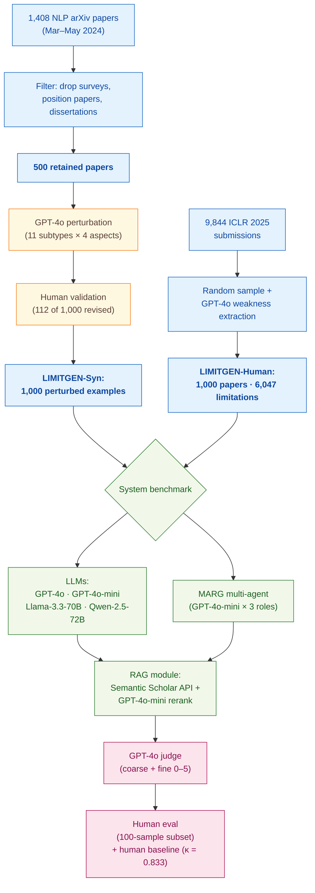

> [!success] **TL;DR**
> LIMITGEN is a well-designed benchmark with a credible human ceiling, and its central finding — RAG helps but does not close a roughly 22-point gap to human reviewers — is robust to the LLM-judge concern thanks to the 0.96 correlation with human evaluation. The result is not deployment-ready as a standalone reviewer: even the best system (MARG + RAG) still misses roughly one in five obvious flaws and the benchmark itself excludes most non-AI domains.

## Structured abstract

> [!info] A plain-language summary built from this paper's discourse-graph nodes. Numbers and findings link back to specific EVD nodes — click any link to drill in.

### Question

Can today's large language models (LLMs) act as early-stage peer reviewers and reliably point out the weaknesses in a scientific paper? The authors build a benchmark called LIMITGEN that tests four frontier LLMs and one multi-agent system on 1,000 NLP papers where specific flaws have been planted, plus 1,000 real ICLR 2025 submissions. They also test whether retrieval-augmented generation (RAG, where the model gets to look up related papers first) closes the gap to human expert reviewers. See [[QUE - Can LLMs identify critical limitations within scientific research papers?]].

### Methods

**Design.** The authors run a cross-sectional benchmark that scores five AI systems against a synthetic perturbation-based dataset and a real-paper dataset, with a human-expert ceiling for comparison. Each system is also re-scored after adding a RAG module so each model serves as its own before-and-after control.

**Tools.** The benchmark covers four frontier LLMs — GPT-4o and GPT-4o-mini (OpenAI's general-purpose models), Llama-3.3-70B (Meta's open-weight model), and Qwen-2.5-72B (Alibaba's open-weight model) — plus MARG, a published multi-agent system from D'Arcy et al. 2024 that splits the review job across a leader, a worker, and an expert agent (here all three are GPT-4o-mini). The dataset pipeline parses LaTeX with the `s2orc-doc2json` library. The RAG module pulls related papers from the Semantic Scholar Recommendation and Relevance APIs and reranks them with GPT-4o-mini. A separate GPT-4o instance acts as automated judge, deciding whether a generated limitation matches the planted one.

**Procedure.** First, the authors build LIMITGEN-Syn. They start with 1,408 NLP arXiv papers from March to May 2024, filter down to 500 high-quality experimental papers, and then ask GPT-4o to inject one of 11 specific limitation subtypes into each paper (for example, removing preprocessing details or swapping in an inappropriate dataset). Human annotators validate every perturbed example and revise 112 of them. Second, the authors build LIMITGEN-Human by sampling 1,000 ICLR 2025 submissions and using GPT-4o to extract and categorize the weaknesses already written by human reviewers. Third, each system generates its top-three limitations for a target aspect of each paper. GPT-4o then judges whether at least one of the three matches the planted subtype (this is "coarse-grained accuracy"). A second human evaluation on a 100-example sample backstops the automated judge. Fourth, the authors switch the RAG module on and rerun every system end-to-end. Two expert annotators also solve 50 examples themselves to set a human ceiling.

**Sample.** LIMITGEN-Syn flowed from 1,408 NLP papers to 500 retained papers to 1,000 perturbed examples (250 per aspect across 11 subtypes). LIMITGEN-Human flowed from 9,844 ICLR 2025 submissions to 1,000 sampled papers, yielding 6,047 ground-truth limitations (about six per paper). The unit of analysis is one paper plus one target aspect. Six NLP/AI experts (each with peer-reviewed publications) handled annotation, validation, and human evaluation; two of them produced the human-baseline scores.

### Findings

- **GPT-4o catches barely half the obvious flaws humans catch.** On LIMITGEN-Syn, GPT-4o reached 52.0% coarse-grained accuracy (the share of papers where its top-three limitations included the planted one) compared to 86.0% for human experts and 68.1% for the MARG multi-agent system. The other three LLMs trailed GPT-4o (Llama-3.3-70B at 45.7%, Qwen-2.5-72B at 47.1%, GPT-4o-mini at 49.1%). The two human raters agreed strongly with each other (Cohen's kappa = 0.833, where 1.0 means perfect agreement and 0 means chance). [[EVD - GPT-4o identified 52% coarse accuracy on LimitGen-Syn while human experts achieved 86% and MARG reached 68.1% - @xuCanLLMsIdentify2025]]

- **RAG helps every system but does not close the human gap.** Adding RAG lifted GPT-4o from 52.0% to 64.2% coarse accuracy (a 12.2 percentage-point gain) and lifted MARG from 68.1% to 77.9% (+9.8 points). Smaller open-weight models gained much less (Llama +2.4, Qwen +1.3 points). Even the best RAG-augmented system stayed roughly 8 to 22 points below the 86% human ceiling. The RAG benefit also held up in an out-of-domain user study: GPT-4o jumped from 31.3% to 50.0% on biomedical papers and from 37.5% to 56.3% on computer-networks papers. [[EVD - RAG augmentation improved GPT-4o limitation identification coarse accuracy by 12.2 percentage points on LimitGen-Syn - @xuCanLLMsIdentify2025]]

### Claim supported

Together these findings support two related claims: that [[CLM - LLMs cannot reliably identify scientific paper limitations at the level of human expert reviewers]] and that [[CLM - RAG augmentation improves LLM limitation identification by grounding generation in domain-relevant literature]]. The MARG result also reinforces the broader claim that [[CLM - Multi-agent LLM systems produce more specific and helpful scientific paper feedback than single-agent approaches]]. For someone considering deploying an LLM as a first-pass reviewer, the practical takeaway is straightforward: even with retrieval support, the best system here still misses roughly one in five obvious flaws and a much larger share of subtle ones, so it can complement but not replace a human reviewer.

### Caveats

- **The planted flaws may be easier to catch than real ones.** Because LIMITGEN-Syn injects flaws using a fixed taxonomy, the perturbations are by construction discrete and isolated. Real papers tend to have flaws that are tangled together and partly hidden, so accuracy on the synthetic set may not match accuracy in the wild. [[CVT - The LimitGen-Syn perturbation approach introduced artificial limitations that may not match organic research flaws]]

- **Almost all evaluation papers come from AI and NLP.** The taxonomy and benchmark were built by NLP researchers using NLP papers, so limitation categories that matter in biomedicine, physics, or social science (for example, sample-size justification or IRB issues) may be missing or misweighted. The 32-example out-of-domain user study is a useful sanity check but is too small to confirm broad generalization. [[CVT - The LimitGen benchmark focused only on AI research limiting applicability to other scientific domains]]

### Methods at a glance

---

## Quality appraisal

> [!info] Risk-of-bias and validity assessment, synthesized from this paper's discourse-graph nodes and grounded in the same paper this page's top trust-signal chips summarize. Covers *methodological quality* — the TRIPOD-LLM table below covers *reporting compliance* instead.
> <dl class="callout-legend">
> <dt>● Low risk</dt><dd>No meaningful threat to this domain identified</dd>
> <dt>◐ Some risk</dt><dd>A real but non-fatal limitation</dd>
> <dt>○ High risk</dt><dd>A significant, unaddressed threat to validity</dd>
> </dl>

| Domain | Rating | Quote |
| --- | :---: | --- |
| **Construct validity**: does the metric actually measure the construct? | 🟡 | *"a sample is deemed correct in the coarse-grained evaluation if at least one generated limitation accurately matches the subtype"* `§4.2, p.6` |
| **Internal validity**: could the comparison be biased? | 🟡 | *"In LIMITGEN-Syn, the correlation between the fine-grained score and accuracy is 0.96."* `§4.2 Reliability Assessment, p.7` |
| **External validity**: do findings generalize? | 🔴 | *"We chose AI as this is the field we are familiar with."* `§1 fn.1, p.2` |
| **Statistical Conclusion Validity**: appropriate uncertainty + comparisons? | 🔴 | Not reported, no confidence intervals, significance tests, or multiple-comparison correction are reported across the system × RAG-condition comparisons in Tables 3–5 |
| **Reproducibility**: code, data, determinism? | 🟡 | *"Data yale-nlp/LimitGen"* ... *"Code yale-nlp/LimitGen"* `p.1` |
| **Data leakage**: could models have seen this data pretraining? | 🔴 | *"focusing on those released between March 1, 2024, and May 31, 2024, a period likely outside the pretraining data cut-off for most current LLMs. This selection helps minimize potential data memorization issues that affect model evaluation."* `§3.3, p.5`, a stated mitigation attempt, not a verified guarantee that any tested model's actual training cutoff postdates the corpus |
| **Baseline adequacy**: is there a meaningful floor to beat? | 🟢 | *"Our architecture, following MARG (D'Arcy et al., 2024), consists of a set of chat-based LLM agents (GPT-4o-mini in this study)"* `§5.2, p.7`, MARG is a real published multi-agent baseline, not a trivial floor |
| **Train/dev/test hygiene**: are data splits kept separate? | 🔴 | Not reported, no train/dev/test split is described; LIMITGEN-Syn and LIMITGEN-Human are used entirely as evaluation sets with no held-out development partition |
| **Multiple-comparisons correction**: controlled for repeated testing? | 🔴 | Not reported, 5 checker systems × 2 RAG conditions × multiple metrics are compared with no stated correction |
| **Human-baseline comparability**: is there a human reference point? | 🟢 | *"Human 86.0% ... GPT-4o 52.0% ... MARG 68.1%"* `Table 3, p.8` |
| **Confidence Intervals**: are point estimates accompanied by an interval? | 🔴 | Not reported — Accuracy/Fine-grained/Jaccard figures (Table 3-4) and the Cohen's kappa on annotator agreement are given as point estimates with no interval |
| **Chance-Corrected Metrics**: does agreement/accuracy correct for chance? | 🟡 | *"The two human raters agreed strongly with each other (Cohen's kappa = 0.833, where 1.0 means perfect agreement and 0 means chance)."* `§4.1, p.5–6` — kappa validates the benchmark's own ground truth, but the LLM systems' own performance is scored via Accuracy/Fine-grained score/Jaccard instead, not a chance-corrected statistic |
| **Non-Significant Result Spin**: are null or negative findings framed plainly? | 🔴 | Not applicable — no formal significance test underlies the paper's headline comparison; the blunt framing of its own main finding ("GPT-4o can only identify about half of the limitations that humans consider very obvious") is plain, not spun, but falls outside this check's addressed/not-addressed distinction absent a formal test `§4.2, p.6` |
| **Statistic Accuracy**: do the paper's own reported numbers check out? | 🟢 | The reported Cohen's kappa (0.833 for LimitGen-Syn; 0.772/0.735/0.717 for LimitGen-Human) falls within the valid 0–1 range `§4.1, p.5–6` |
| **Ablation Experiment(s)**: does the paper isolate a component's contribution? | 🟢 | *"The results, as shown in Table 5, demonstrate that providing a broader set of relevant papers, as in the standard RAG method with the top 5 papers, improves the LLM's performance in generating accurate limitations compared to using only the top 3 or the last 5 retrieved papers."* `p.7, §6.2` |
| **Code Quality**: does the released code follow FAIR-software practices? | 🔴 | `howfairis` (fair-software.eu 5-criteria checklist) against https://github.com/yale-nlp/LimitGen: **1/5** — open repository only — no license, package-registry listing, citation metadata, or quality-checklist badge. |
| **Data Quality**: is the released dataset FAIR? | 🔴 | FAIR-Checker (12 semantic-web metrics, 0-2 each) against https://github.com/yale-nlp/LimitGen: **4/24**. |

**Bottom line.** LIMITGEN is a well-designed benchmark with a credible human ceiling, and its central finding — RAG helps but does not close a roughly 22-point gap to human reviewers — is robust to the LLM-judge concern thanks to the 0.96 correlation with human evaluation. The result is not deployment-ready as a standalone reviewer: even the best system (MARG + RAG) still misses roughly one in five obvious flaws and the benchmark itself excludes most non-AI domains. The most actionable improvements would be confidence intervals on the headline numbers and a substantially larger out-of-domain evaluation before generalizing to biomedical or social-science peer review.

> [!tip] **Applicable external appraisal frameworks beyond TRIPOD-LLM** (already covered by the table below): **HELM** (Liang et al. 2022) for holistic LLM-evaluation principles · **Datasheets for Datasets** (Gebru et al. 2021) for the evaluation corpus · **Model Cards** (Mitchell et al. 2019) for the LLMs being evaluated

---

## TRIPOD-LLM reporting summary

> [!info] Reporting compliance for this paper, mapped to the TRIPOD-LLM checklist (Title/Abstract/Introduction items 1–4, Methods items 5a–15, Results items 16a–18). TRIPOD-LLM is a clinical-ML guideline being applied here to a non-clinical AI-research benchmark — where an item's own wording says "healthcare context" or "care pathway," it's read as "research-evaluation context" / "research workflow" instead. Item 17 (Performance) is reported per-EVD; see each EVD's `## Other Notes`.
> 

> ●Fully reported
> ◐Partial / unclear
> ○Not reported
> –Not applicable
> 

| # | Item | ✓ | Quote |
| --- | --- | :---: | --- |
| **1** | Title | ✅ | *"Can LLMs Identify Critical Limitations within Scientific Research? A Systematic Evaluation on AI Research Papers"* `Title` |
| **2** | Abstract | ➖ | Assessed separately under TRIPOD-LLM's own Abstract extension, not scored here |
| **3a** | Background — context + rationale | ✅ | *"Peer review plays a crucial role in ensuring the quality and integrity of scientific research. However, it is often a time-consuming and expertise-intensive process, posing significant challenges, especially as the volume of published papers continues to grow."* `§1, p.1` |
| **3b** | Background — target population | ⚠️ | *"We chose AI as this is the field we are familiar with."* `§1 fn.1, p.2` |
| **4** | Objectives | ✅ | *"We propose LIMITGEN, a comprehensive benchmark specifically designed to assess the ability of models to identify and address limitations in scientific research, with a reliable and systematic evaluation framework."* `§1, p.2` |
| **5a** | Data sources | ✅ | *"We collect scientific papers from arXiv under the "Computation and Language" category, focusing on those released between March 1, 2024, and May 31, 2024"* `§3.3, p.5` |
| **5b** | Data points + distribution | ✅ | *"Scientific Paper Word Length 5,201.46 / 58,788 ... Paper Number 500 ... Example Number 1,000"* `Table 2, p.5` |
| **5c** | Date range of data | ✅ | *"focusing on those released between March 1, 2024, and May 31, 2024, a period likely outside the pretraining data cut-off for most current LLMs"* `§3.3, p.5` |
| **5d** | Pre-processing / quality checks | ✅ | *"we use the tool by Lo et al. (2020), which converts LaTeX source files into JSON format, capturing elements including the title, abstract, main sections, and appendix of each paper"* `§3.3, p.5` |
| **5e** | Missing / imbalanced data | ⚠️ | *"The current benchmark covers a limited time span, including some parts of 2024 and ICLR 2025, which may not fully represent the evolving landscape of research in the field."* `Limitations, p.10` |
| **6a** | LLM name + version | ✅ | *"(1) Proprietary LLMs, including GPT-4o and GPT-4o-mini (OpenAI, 2024); and (2) Open-source LLMs, including Llama-3.3-70B (AI@Meta, 2024), Qwen2.5-72B (Yang et al., 2024)"* `§5.1, p.7` |
| **6b** | Development process | ✅ | *"Our architecture, following MARG (D'Arcy et al., 2024), consists of a set of chat-based LLM agents (GPT-4o-mini in this study), each with its own chat history and prompt(s)."* `§5.2, p.7` |
| **6c** | Inference settings / prompting | ⚠️ | *"We require each model to generate the most significant limitations for an aspect of a paper."* `§5.1, p.7` — temperature/top_p/seed/model snapshot dates not disclosed |
| **6d** | Output | ✅ | *"a sample is deemed correct in the coarse-grained evaluation if at least one generated limitation accurately matches the subtype"* `§4.2, p.6` |
| **6e** | Classification thresholds | ✅ | *"If a generated limitation correctly identifies the subtype or has a successful match in the ground truth limitations, we further evaluate the content ... assigns scores to the generated limitations on from 1 to 5"* `§4.2, p.6` |
| **7a** | Quality metrics | ✅ | *"For LIMITGEN-Human, we refer to MARG (D'Arcy et al., 2024), evaluating recall, precision, and Jaccard Index to measure the overlap between generated and ground truth limitations for a paper."* `§4.2, p.6` |
| **7b** | Relevance to downstream use | ⚠️ | *"the first comprehensive benchmark for evaluating LLMs' capability to support early-stage feedback and complement human peer review"* `Abstract, p.1` — no formal downstream-utility analysis (reviewer time saved, acceptance rate of suggestions) reported |
| **7c** | Outcome definition | ✅ | *"For LIMITGEN-Syn, we use GPT-4o to classify the generated limitations and assess whether they correctly identify the intended subtype."* `§4.2, p.6` |
| **7d** | Subjective interpretation | ✅ | *"For each criterion, Likert-scale scores ranging from 1 to 5 are used. Given the paper and a limitation generated by LLM, human evaluators are asked to assign scores for each dimension."* `§4.1, p.6` |
| **7e** | Comparison | ✅ | *"Human 86.0% ... GPT-4o 52.0% ... MARG 68.1%"* `Table 3, p.8` |
| **8a** | Annotation guidelines | ✅ | *"All annotators are experts with several NLP/ML publications as shown in Table 7. To ensure quality, they follow detailed annotation guidelines, which provide clear instructions for the annotation process."* `Appendix A.3, p.13` |
| **8b** | Annotators + IAA | ✅ | *"we sample 50 fixed generated instances from LIMITGEN-Syn and LIMITGEN-Human, each independently assessed by two expert annotators. In LIMITGEN-Syn, the resulting Cohen's Kappa score is 0.833."* `§4.1, p.5–6` |
| **8c** | Annotator background | ✅ | *"ID # NLP/AI Publication ... 1 >10 ... 6 1-5"* `Table 7, p.14` |
| **9a** | Prompt design | ✅ | *"The prompts are provided in Figure 4 to Figure 14."* `§3.3, p.5` |
| **9b** | Prompt-development data | ❌ | Not reported |
| **10** | Summarization | ➖ | Not applicable — no summarization endpoint evaluated as a primary outcome |
| **11** | Instruction tuning / alignment | ➖ | Not applicable — no model training, fine-tuning, or alignment performed |
| **12** | Compute | ⚠️ | *"We are grateful to Nvidia Academic Grant Program for providing computing resources."* `Acknowledgments, p.10` — GPU-hours, token counts, and wall-clock not reported |
| **13** | Ethical approval | ⚠️ | *"We have carefully considered the ethical implications of our work, which focuses on identifying limitations in scientific papers."* `Ethical Considerations, p.10` — no IRB/ethics-committee statement present (not human-subjects research) |
| **14a** | Funding | ✅ | *"This project is supported by Tata Sons Private Limited, Tata Consultancy Services Limited, and Titan. We are grateful to Nvidia Academic Grant Program for providing computing resources."* `Acknowledgments, p.10` |
| **14b** | Conflicts of interest | ❌ | Not reported |
| **14c** | Protocol | ❌ | Not reported |
| **14d** | Registration | ➖ | Not applicable — not a registered clinical study |
| **14e** | Data availability | ✅ | *"Data yale-nlp/LimitGen"* `p.1` |
| **14f** | Code availability | ✅ | *"Code yale-nlp/LimitGen"* `p.1` |
| **15** | Patient/public involvement | ➖ | Not applicable |
| **16a** | Flow of data | ✅ | *"This filtering process led us to 500 papers. ... In practice, from 500 papers, a total of 1,000 examples were retained, including 112 that were revised by human annotators."* `§3.3, p.5` |
| **16b** | Characteristics | ✅ | *"Scientific Paper Word Length 8,255.38 / 1,8910 ... Number of Limitations per Paper 6.05 / 20 ... Paper Number 1,000"* `Table 2, p.5` |
| **16c** | Distribution comparison | ➖ | Not applicable — no train/test or clinical-subgroup distribution comparison |
| **16d** | N per analysis | ✅ | *"For human evaluation, we randomly sample 100 examples from the dataset."* `Table 3, p.8` |
| **17** | Performance | `per-EVD` | Reported per-EVD. See each EVD's `## Other Notes`. |
| **18** | LLM updating | ➖ | Not applicable — no model updating reported |
