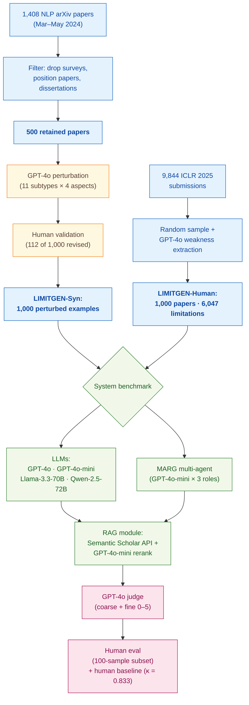
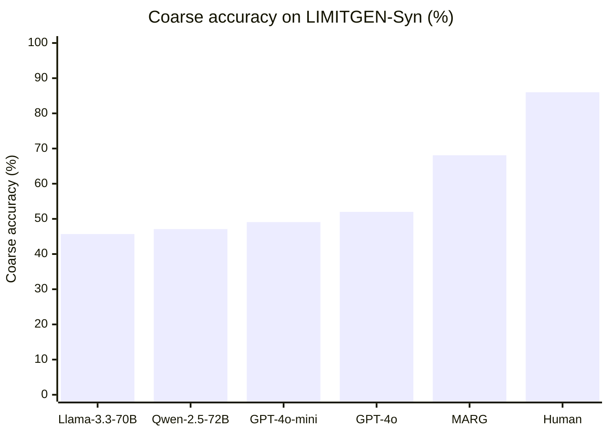
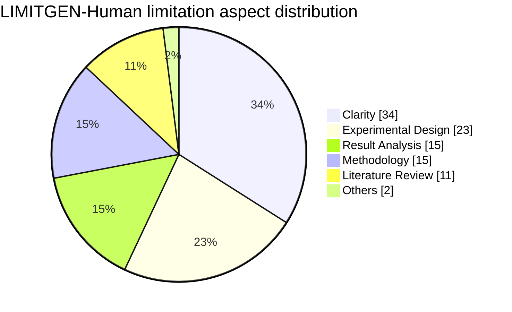

> [!success] **TL;DR**
> LIMITGEN is a well-designed benchmark with a credible human ceiling, and its central finding — RAG helps but does not close a roughly 22-point gap to human reviewers — is robust to the LLM-judge concern thanks to the 0.96 correlation with human evaluation. The result is not deployment-ready as a standalone reviewer: even the best system (MARG + RAG) still misses roughly one in five obvious flaws and the benchmark itself excludes most non-AI domains.

## Structured abstract

> [!info] A plain-language summary built from this paper's discourse-graph nodes. Numbers and findings link back to specific EVD nodes — click any link to drill in.

### Question

Can today's large language models (LLMs) act as early-stage peer reviewers and reliably point out the weaknesses in a scientific paper? The authors build a benchmark called LIMITGEN that tests four frontier LLMs and one multi-agent system on 1,000 NLP papers where specific flaws have been planted, plus 1,000 real ICLR 2025 submissions. They also test whether retrieval-augmented generation (RAG, where the model gets to look up related papers first) closes the gap to human expert reviewers. See [[QUE - Can LLMs identify critical limitations within scientific research papers?]].

### Methods

**Design.** The authors run a cross-sectional benchmark that scores five AI systems against a synthetic perturbation-based dataset and a real-paper dataset, with a human-expert ceiling for comparison. Each system is also re-scored after adding a RAG module so each model serves as its own before-and-after control.

**Tools.** The benchmark covers four frontier LLMs — GPT-4o and GPT-4o-mini (OpenAI's general-purpose models), Llama-3.3-70B (Meta's open-weight model), and Qwen-2.5-72B (Alibaba's open-weight model) — plus MARG, a published multi-agent system from D'Arcy et al. 2024 that splits the review job across a leader, a worker, and an expert agent (here all three are GPT-4o-mini). The dataset pipeline parses LaTeX with the `s2orc-doc2json` library. The RAG module pulls related papers from the Semantic Scholar Recommendation and Relevance APIs and reranks them with GPT-4o-mini. A separate GPT-4o instance acts as automated judge, deciding whether a generated limitation matches the planted one.

**Procedure.** First, the authors build LIMITGEN-Syn. They start with 1,408 NLP arXiv papers from March to May 2024, filter down to 500 high-quality experimental papers, and then ask GPT-4o to inject one of 11 specific limitation subtypes into each paper (for example, removing preprocessing details or swapping in an inappropriate dataset). Human annotators validate every perturbed example and revise 112 of them. Second, the authors build LIMITGEN-Human by sampling 1,000 ICLR 2025 submissions and using GPT-4o to extract and categorize the weaknesses already written by human reviewers. Third, each system generates its top-three limitations for a target aspect of each paper. GPT-4o then judges whether at least one of the three matches the planted subtype (this is "coarse-grained accuracy"). A second human evaluation on a 100-example sample backstops the automated judge. Fourth, the authors switch the RAG module on and rerun every system end-to-end. Two expert annotators also solve 50 examples themselves to set a human ceiling.

**Sample.** LIMITGEN-Syn flowed from 1,408 NLP papers to 500 retained papers to 1,000 perturbed examples (250 per aspect across 11 subtypes). LIMITGEN-Human flowed from 9,844 ICLR 2025 submissions to 1,000 sampled papers, yielding 6,047 ground-truth limitations (about six per paper). The unit of analysis is one paper plus one target aspect. Six NLP/AI experts (each with peer-reviewed publications) handled annotation, validation, and human evaluation; two of them produced the human-baseline scores.

### Findings

- **GPT-4o catches barely half the obvious flaws humans catch.** On LIMITGEN-Syn, GPT-4o reached 52.0% coarse-grained accuracy (the share of papers where its top-three limitations included the planted one) compared to 86.0% for human experts and 68.1% for the MARG multi-agent system. The other three LLMs trailed GPT-4o (Llama-3.3-70B at 45.7%, Qwen-2.5-72B at 47.1%, GPT-4o-mini at 49.1%). The two human raters agreed strongly with each other (Cohen's kappa = 0.833, where 1.0 means perfect agreement and 0 means chance). [[EVD - GPT-4o identified 52% coarse accuracy on LimitGen-Syn while human experts achieved 86% and MARG reached 68.1% - @xuCanLLMsIdentify2025]]

- **RAG helps every system but does not close the human gap.** Adding RAG lifted GPT-4o from 52.0% to 64.2% coarse accuracy (a 12.2 percentage-point gain) and lifted MARG from 68.1% to 77.9% (+9.8 points). Smaller open-weight models gained much less (Llama +2.4, Qwen +1.3 points). Even the best RAG-augmented system stayed roughly 8 to 22 points below the 86% human ceiling. The RAG benefit also held up in an out-of-domain user study: GPT-4o jumped from 31.3% to 50.0% on biomedical papers and from 37.5% to 56.3% on computer-networks papers. [[EVD - RAG augmentation improved GPT-4o limitation identification coarse accuracy by 12.2 percentage points on LimitGen-Syn - @xuCanLLMsIdentify2025]]

### Claim supported

Together these findings support two related claims: that [[CLM - LLMs cannot reliably identify scientific paper limitations at the level of human expert reviewers]] and that [[CLM - RAG augmentation improves LLM limitation identification by grounding generation in domain-relevant literature]]. The MARG result also reinforces the broader claim that [[CLM - Multi-agent LLM systems produce more specific and helpful scientific paper feedback than single-agent approaches]]. For someone considering deploying an LLM as a first-pass reviewer, the practical takeaway is straightforward: even with retrieval support, the best system here still misses roughly one in five obvious flaws and a much larger share of subtle ones, so it can complement but not replace a human reviewer.

### Caveats

- **The planted flaws may be easier to catch than real ones.** Because LIMITGEN-Syn injects flaws using a fixed taxonomy, the perturbations are by construction discrete and isolated. Real papers tend to have flaws that are tangled together and partly hidden, so accuracy on the synthetic set may not match accuracy in the wild. [[CVT - The LimitGen-Syn perturbation approach introduced artificial limitations that may not match organic research flaws]]

- **Almost all evaluation papers come from AI and NLP.** The taxonomy and benchmark were built by NLP researchers using NLP papers, so limitation categories that matter in biomedicine, physics, or social science (for example, sample-size justification or IRB issues) may be missing or misweighted. The 32-example out-of-domain user study is a useful sanity check but is too small to confirm broad generalization. [[CVT - The LimitGen benchmark focused only on AI research limiting applicability to other scientific domains]]

### Methods at a glance

### Results at a glance

Coarse-grained accuracy on LIMITGEN-Syn — the share of papers where the system's top-three limitations include the planted flaw. Higher is better; the human ceiling is 86%:

Effect of adding RAG to each system on LIMITGEN-Syn coarse accuracy. RAG helps the strongest systems most, but no system reaches the 86% human ceiling:

```mermaid
xychart-beta
    title "Coarse accuracy: base vs. +RAG (%)"
    x-axis ["Qwen", "Llama", "GPT-4o-mini", "GPT-4o", "MARG"]
    y-axis "Coarse accuracy (%)" 0 --> 100
    bar [47.1, 45.7, 49.1, 52.0, 68.1]
    bar [48.4, 48.1, 53.3, 64.2, 77.9]
```

Aspect distribution of the 6,047 ground-truth limitations in LIMITGEN-Human (ICLR 2025 reviewer comments). Clarity dominates while Literature Review is rare — this imbalance shapes what the benchmark actually measures:

---

## Critical appraisal

> [!info] A risk-of-bias and validity assessment across five domains, synthesized from this paper's discourse-graph nodes. Each domain gets a rating (🟢 Low risk · 🟡 Some concerns · 🔴 High risk) plus a brief, EVD-grounded justification. The TRIPOD-LLM table below covers *reporting compliance*; this section covers *methodological quality*.

| Domain | Rating | Justification |
| --- | :---: | --- |
| **Construct validity** — does the metric actually measure the construct? | 🟡 | Coarse-grained accuracy ("at least one of top-3 generated limitations matches the planted subtype") is a generous credit rule that maps loosely to the deployment construct of "useful first-pass review." The fine-grained 0–5 score and the LIMITGEN-Human Jaccard / faithfulness / soundness / importance ratings partly compensate, but the headline number can mask cases where the system outputs many shallow comments to game top-3 recall (see [[CVT - The LimitGen-Syn perturbation approach introduced artificial limitations that may not match organic research flaws]]). |
| **Internal validity** — could the comparison be biased? | 🟡 | The biggest risk is the LLM-judge-of-LLM problem: GPT-4o judges its own outputs and those of GPT-4o-mini, MARG (built on GPT-4o-mini), and the RAG pipeline (which also uses GPT-4o-mini). The authors mitigate this with a parallel 100-example human evaluation that correlates 0.96 with the automated judge on LIMITGEN-Syn, which is reassuring. Within-system base-vs-RAG comparisons are paired and well controlled. |
| **External validity** — do findings generalize? | 🔴 | Three compounding constraints. (1) Source papers are NLP-only on LIMITGEN-Syn and ICLR 2025 only on LIMITGEN-Human (see [[CVT - The LimitGen benchmark focused only on AI research limiting applicability to other scientific domains]]). (2) Synthetic perturbations follow a fixed 11-subtype taxonomy that simplifies the messy, intertwined flaws of real submissions (see [[CVT - The LimitGen-Syn perturbation approach introduced artificial limitations that may not match organic research flaws]]). (3) The out-of-domain user study covers only 32 examples in two adjacent domains. |
| **Statistical rigor** — appropriate uncertainty + comparisons? | 🔴 | No confidence intervals on accuracy or fine-grained scores, no significance testing across the five-system × two-condition comparison grid, and no multiple-comparison correction. Human evaluation is reported as a single point estimate on 100 examples per subset. The κ = 0.833 inter-annotator agreement is well-grounded, but the model comparisons themselves are only descriptive. |
| **Reproducibility** — code, data, determinism? | 🟡 | Dataset and code are released at `yale-nlp/LimitGen` under CC-BY-4.0 (TRIPOD-LLM 14e and 14f both ✅), and the Semantic Scholar retrieval pipeline is fully described. But proprietary OpenAI models with undisclosed snapshot dates (TRIPOD-LLM 6a ⚠️) and unreported decoding parameters such as temperature, seed, and top-p (TRIPOD-LLM 6c ⚠️) introduce irreducible run-to-run variance, especially for the GPT-4o judge. |

**Bottom line.** LIMITGEN is a well-designed benchmark with a credible human ceiling, and its central finding — RAG helps but does not close a roughly 22-point gap to human reviewers — is robust to the LLM-judge concern thanks to the 0.96 correlation with human evaluation. The result is not deployment-ready as a standalone reviewer: even the best system (MARG + RAG) still misses roughly one in five obvious flaws and the benchmark itself excludes most non-AI domains. The most actionable improvements would be confidence intervals on the headline numbers and a substantially larger out-of-domain evaluation before generalizing to biomedical or social-science peer review.

> [!tip] **Applicable external appraisal frameworks beyond TRIPOD-LLM** (already covered by the table below): **HELM** (Liang et al. 2022) for holistic LLM-evaluation principles · **Datasheets for Datasets** (Gebru et al. 2021) for the evaluation corpus · **Model Cards** (Mitchell et al. 2019) for the LLMs being evaluated

---

## TRIPOD-LLM reporting summary

> [!info] Reporting compliance for this paper, mapped to the TRIPOD-LLM checklist (Methods items 5a–15 and Results items 16a–18). Compliance icons: ✅ fully reported · ⚠️ partially reported / unclear · ❌ should be reported but not reported · ➖ not applicable to this study. Item 17 (Performance) is reported per-EVD; see each EVD's `## Other Notes`.

| # | Item | ✓ | Reported in this study |
| --- | --- | :---: | --- |
| **5a** | Data sources | ✅ | LIMITGEN-Syn: 1,408 NLP arXiv papers (cs.CL category) → 500 retained; perturbations generated by GPT-4o per a hand-designed taxonomy. LIMITGEN-Human: 9,844 ICLR 2025 submissions → 1,000 sampled; weakness sections parsed and itemized via GPT-4o. RAG: Semantic Scholar Recommendation + Relevance APIs. |
| **5b** | Data points + distribution | ✅ | LIMITGEN-Syn: 1,000 examples across 4 aspects (Methodology 250, Experimental Design 250, Result Analysis 250, Literature Review 250) and 11 subtypes (Table 8); avg paper word length 5,201 (max 58,788); avg limitation word length 34.45. LIMITGEN-Human: 1,000 papers, 6,047 limitations (avg 6.05/paper, max 20); aspect distribution Clarity 34%, Experimental Design 23%, Result Analysis 15%, Methodology 15%, Literature Review 11%, Others 2% (Figure 2). |
| **5c** | Date range of data | ✅ | LIMITGEN-Syn arXiv papers: 1 March 2024 – 31 May 2024 (chosen to be likely outside pretraining cutoff). LIMITGEN-Human: ICLR 2025 submissions. User-study papers: post-15 May 2024. |
| **5d** | Pre-processing / quality checks | ✅ | LaTeX → JSON via `s2orc-doc2json` (Lo et al. 2020). Surveys / position papers / dissertations excluded; low-quality papers omitted. LIMITGEN-Syn: each perturbation validated by a human annotator (3 explicit criteria); 112 of 1,000 examples revised. LIMITGEN-Human: GPT-4o filters reviews <20 words or lacking substantive suggestions, then categorizes remainder. |
| **5e** | Missing / imbalanced data | ⚠️ | Per-subtype counts in LIMITGEN-Syn are roughly balanced by design (~62–125 per subtype, Table 8). LIMITGEN-Human aspect distribution is uneven (Clarity 34% vs. Others 2%) and only methodology/experimental-design/result-analysis/literature-review limitations are retained as ground truth — Clarity and Others classes dropped without explicit imbalance handling. |
| **6a** | LLM name + version | ✅ | Evaluated systems: GPT-4o, GPT-4o-mini (OpenAI 2024), Llama-3.3-70B (AI@Meta 2024), Qwen-2.5-72B (Yang et al. 2024). Multi-agent: MARG (D'Arcy et al. 2024) instantiated with GPT-4o-mini agents. Automated judge: GPT-4o. RAG reranker / extractor: GPT-4o-mini. Specific API snapshots / dates not given. |
| **6b** | Development process | ✅ | No fine-tuning. All evaluated systems used out-of-the-box; MARG follows D'Arcy et al. 2024 architecture with leader / worker / expert agents. RAG pipeline newly designed for this paper. |
| **6c** | Inference settings / prompting | ⚠️ | Prompt structure described in text and Figures 4–16 (perturbation prompts, RAG-extraction prompt, ICLR-weakness-categorization prompt). Decoding parameters (temperature, top_p, seed, max tokens) not reported. Top-3 generated limitations used for coarse-grained scoring. |
| **6d** | Output | ✅ | Each system outputs a ranked list of natural-language limitations for a target aspect (top-3 used for scoring). Automated judge outputs match/no-match plus 1–5 fine-grained score. |
| **6e** | Classification thresholds | ✅ | "At least one of top-3 generated limitations matches subtype" → coarse-grained correct. Fine-grained: 1–5 Likert; coarse-failed examples assigned 0. No probability thresholds. |
| **7a** | Quality metrics | ✅ | Coarse-grained accuracy; fine-grained 0–5 score; Jaccard Index, recall, precision (LIMITGEN-Human); Likert faithfulness/soundness/importance (1–5). Reliability: Cohen's κ, system-level correlation between automated and human scores. |
| **7b** | Relevance to downstream | ⚠️ | Authors motivate the task as "early-stage feedback to complement human peer review" and conduct a small out-of-domain user study (Table 6), but no formal downstream-utility analysis (reviewer time saved, false-positive tolerance, author-acceptance of suggestions) is reported. |
| **7c** | Outcome definition | ✅ | Outcome = whether a generated limitation correctly identifies a known (perturbed or human-annotated) limitation subtype, plus quality of the limitation along faithfulness / soundness / importance dimensions. |
| **7d** | Subjective interpretation | ✅ | Detailed Likert rubrics (1–5) with anchored descriptors for faithfulness, soundness, and importance provided in Appendix A.3. IAA reported (κ = 0.833 on LIMITGEN-Syn; 0.772 / 0.735 / 0.717 on LIMITGEN-Human importance/faithfulness/soundness). |
| **7e** | Comparison | ✅ | 4 LLMs + MARG agent system + human baseline + RAG-augmented variants; automated judge correlated against human evaluation (system correlation 0.96 on Syn; 0.77/0.60/0.67 on Human). No formal significance testing reported. |
| **8a** | Annotation guidelines | ✅ | Source-paper-selection guidelines, perturbation-validation guidelines, and detailed 1–5 Likert rubrics provided in Appendix A.3. Perturbation prompts shown for each subtype in Figures 4–14. |
| **8b** | Annotators + IAA | ✅ | 6 annotators total (Table 7) split across data annotation / validation / human evaluation / human-baseline tasks. IAA on 50 fixed instances per subset: LIMITGEN-Syn κ = 0.833; LIMITGEN-Human importance/faithfulness/soundness = 0.772 / 0.735 / 0.717. |
| **8c** | Annotator background | ✅ | All annotators are NLP/AI experts with NLP/ML publications; Table 7 reports each annotator's publication count (1–5, 5–10, or >10) and their assigned roles. |
| **9a** | Prompt design | ⚠️ | Perturbation, RAG-extraction, and ICLR-categorization prompts shown in Figures 4–16. Limitation-generation prompts and judge-classifier prompts described in text but full templates not surfaced in main body. No systematic prompt-engineering search reported. |
| **9b** | Prompt-development data | ❌ | Not reported. Pilot analysis of peer reviews informed the taxonomy, but no held-out prompt-development split is described. |
| **10** | Summarization | ➖ | Not applicable. |
| **11** | Instruction tuning / alignment | ➖ | Not applicable — no fine-tuning or RLHF performed. |
| **12** | Compute | ⚠️ | Acknowledgments: "Nvidia Academic Grant Program for providing computing resources." No GPU-hours, token counts, or wall-clock numbers reported. |
| **13** | Ethical approval | ⚠️ | Ethical Considerations section discusses biases, misuse risks, CC-BY-4.0 licensing of source data, and intent to release dataset under CC-BY-4.0. No IRB review reported (likely not required as no human-subjects data). |
| **14a** | Funding | ✅ | Tata Sons Private Limited, Tata Consultancy Services Limited, Titan; Nvidia Academic Grant Program for compute. |
| **14b** | Conflicts of interest | ❌ | Not reported. (Co-authors include TCS Research staff; no explicit COI statement.) |
| **14c** | Protocol | ❌ | Not reported. |
| **14d** | Registration | ➖ | Not applicable (not a clinical study). |
| **14e** | Data availability | ✅ | Dataset released at `yale-nlp/LimitGen` under CC-BY-4.0. |
| **14f** | Code availability | ✅ | Code released at `yale-nlp/LimitGen`. |
| **15** | Patient/public involvement | ➖ | Not applicable (no patient/public stakeholders). |
| **16a** | Flow of data | ✅ | Syn: 1,408 NLP papers → exclude non-experimental / low-quality → 500 retained → perturbations applied → 1,000 examples (112 revised). Human: 9,844 ICLR 2025 → 1,000 sampled → GPT-4o filter and categorization → ground-truth limitations. |
| **16b** | Characteristics | ✅ | Table 2 reports avg/max scientific-paper word length, limitation word length, paper count, and limitations-per-paper for both subsets; Table 8 gives subtype counts; Figure 2 shows aspect distribution for LIMITGEN-Human. |
| **16c** | Distribution comparison | ➖ | Not applicable (no train/test or clinical-subgroup distribution comparison; both subsets used as evaluation only). |
| **16d** | N per analysis | ✅ | Coarse/fine automated eval: 1,000 LIMITGEN-Syn / 1,000 LIMITGEN-Human. Human evaluation: random sample of 100 per subset. Human baseline (Syn): 50 examples × 2 annotators. RAG-setting ablation (Table 5): 100 LIMITGEN-Human examples. User study (Table 6): 32 examples (5 papers × 2 domains × ~3 perturbations). |
| **17** | Performance | (per-EVD) | Reported per-EVD. See each EVD's `## Other Notes` for the EVD-specific coarse accuracy / fine score / Δ-with-RAG / Jaccard / faithfulness numbers. |
| **18** | LLM updating | ➖ | Not applicable (no model updating reported). |
