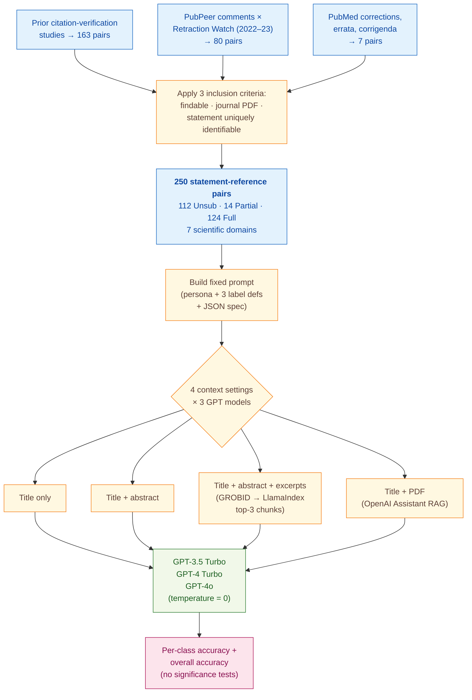

> [!success] **TL;DR**
> GPT-4 Turbo with retrieved excerpts hits 70.0% overall accuracy on a 250-pair benchmark — promising as a research signal, but well short of what a journal-screening pipeline would need. The two largest gaps to deployment are the small, narrow-domain corpus and the lack of any uncertainty estimates on the model-by-context comparisons; before treating "more context helps GPT-4 but hurts GPT-3.5" as a settled finding, a reader should want confidence intervals, a larger and more diverse benchmark, and disclosure of the OpenAI training-cutoff dates relative to the cited papers.

## Structured abstract

> [!info] A plain-language summary built from this paper's discourse-graph nodes. Numbers and findings link back to specific EVD nodes — click any link to drill in.

### Question

Can an off-the-shelf large language model (LLM) catch sentences in a scientific paper that misquote or misrepresent the work they cite, *without* any task-specific training? The authors call these mistakes *quotation errors* and ask whether modern GPT-class models can flag them when given just the citing sentence and varying amounts of context about the cited paper. They benchmark three OpenAI models across four levels of reference context, from "title only" up to "full PDF". See [[QUE - Can LLMs detect quotation errors in scientific papers without fine-tuning?]].

### Methods

**Design.** The authors ran a zero-shot evaluation — meaning the models received task instructions but no training examples — on a fixed, expert-labeled benchmark of 250 statement-and-reference pairs spanning seven scientific domains.

**Tools.** They tested three OpenAI models: **GPT-3.5 Turbo** (gpt-3.5-turbo-0125), **GPT-4 Turbo** (gpt-4-0125-preview), and **GPT-4o** (gpt-4o-2024-05-13). To pull supporting passages out of cited PDFs, they built a *retrieval-augmented generation (RAG)* pipeline — a setup where the model is fed relevant passages it can quote from. The pipeline used **GROBID** (a tool that turns PDF papers into structured text), **LlamaIndex** (a library that breaks text into chunks and ranks them by similarity to a query), and OpenAI's proprietary **Assistant API**, which has its own built-in PDF reader. As a comparison baseline they also ran **MultiVerS / SciFact models** from Wadden et al. 2020, an existing scientific claim-verification system.

**Procedure.** The authors built a 250-pair benchmark by combining three sources: pairs from earlier citation-verification studies, comments on the post-publication review site **PubPeer** cross-checked against **Retraction Watch**, and corrections published on PubMed. They wrote one fixed prompt — finalized before any experiments ran — that gave each model the role of "experienced scientific writer and editor", the three label definitions, and a JSON output template. They then ran each of the three models under four reference-context settings: title only, title plus abstract, title plus abstract plus the top-3 retrieved excerpts, and title plus the full PDF via the Assistant API. All twelve runs used temperature = 0, meaning the model picks its single most likely answer rather than sampling. They scored predictions by exact-match accuracy against the gold label, both per class and overall. They did not run any statistical-significance tests.

**Sample.** The final dataset has **250 statement-and-reference pairs**: 163 (65.2%) from prior citation-verification studies, 80 (32.0%) from PubPeer plus Retraction Watch, and 7 (2.8%) from PubMed corrections. The label split is 112 Unsubstantiated (44.8%), 124 Fully substantiated (49.6%), and only 14 Partially substantiated (5.6%). The unit of analysis is one citing sentence paired with one cited reference; no human annotators were recruited for this study because labels were inherited from the source datasets.

### Findings

- **GPT-3.5 Turbo gets *worse* the more context you give it.** Overall accuracy peaked at 68.0% in the proprietary "title plus PDF via Assistant" setting and at 66.0% with title only, then *fell* to 54.0% once excerpts were added. Accuracy on Fully-substantiated pairs collapsed from 73.4% (title) to 30.6% (title plus abstract plus excerpts). The authors explain this as the model treating any unrelated sentence in the reference as evidence of a mismatch. [[EVD - GPT-3.5 Turbo accuracy on quotation error detection peaked at 68.0% (title only) and dropped with additional context to 54.0% - @zhangDetectingReferenceErrors2024]]

- **GPT-4 Turbo benefits from more context and tops the table.** The best run was GPT-4 Turbo with title plus abstract plus retrieved excerpts at **70.0% overall accuracy** (Unsubstantiated 83.9%, Partially 21.4%, Fully 62.9%). Even with title only, GPT-4 Turbo caught 89.3% of Unsubstantiated cases, far above GPT-3.5 Turbo. GPT-4o's best run reached 68.0%. The newer models behave more cautiously and are more sensitive to small mismatches between a claim and its cited source. [[EVD - GPT-4 Turbo achieved 70.0% overall accuracy on quotation error detection with title plus abstract plus excerpts - @zhangDetectingReferenceErrors2024]]

### Claim supported

Together these findings support the claim that [[CLM - More capable GPT-class LLMs can detect quotation errors in scientific papers without fine-tuning but performance is imperfect and context-dependent]]. The practical takeaway: a 70% top-line accuracy still means roughly 3 in 10 citation pairs are mislabeled, and the dominant class (Unsubstantiated vs. Fully substantiated) drives most of the score. A journal that wanted to deploy this as a screening tool would still need a human reviewer in the loop.

### Caveats

- **The benchmark is mostly natural-science journal articles.** All 250 pairs come from journal venues, with biology, medicine, chemistry, and physics dominating. The findings may not transfer to conference papers, preprints, or to humanities and engineering work that this corpus barely covers. [[CVT - The quotation error dataset was predominantly from natural science journal articles limiting generalizability to conference papers and other publication channels]]

- **Each citation is treated as a single yes-or-no fact.** The three-label scheme assumes one statement cites one reference for one reason. Real citations often serve several purposes at once (e.g., a method reference plus a background claim), and forcing them into one bucket adds noise to both the gold labels and the model evaluation. [[CVT - The simple sentence-pair annotation scheme treated all reference pairs as equivalent despite multiple possible rationales for citation]]

### Methods at a glance

---

## Critical appraisal

> [!info] A risk-of-bias and validity assessment across five domains, synthesized from this paper's discourse-graph nodes. Each domain gets a rating (🟢 Low risk · 🟡 Some concerns · 🔴 High risk) plus a brief, EVD-grounded justification. The TRIPOD-LLM table below covers *reporting compliance*; this section covers *methodological quality*.

| Domain                                                                   | Rating | Justification                                                                                                                                                                                                                                                                                                                                                                                                  |
| ------------------------------------------------------------------------ | :----: | -------------------------------------------------------------------------------------------------------------------------------------------------------------------------------------------------------------------------------------------------------------------------------------------------------------------------------------------------------------------------------------------------------------- |
| **Construct validity** — does the metric actually measure the construct? |   🟡   | Overall accuracy on a class-imbalanced 3-way label (44.8% / 5.6% / 49.6%) overweights the easy Unsubstantiated-vs-Fully distinction and obscures performance on Partially substantiated, where the best model only reaches 35.7%. The deployment construct ("would this catch real citation errors?") aligns with Unsubstantiated accuracy specifically — and per-class numbers are reported, but not centred. |
| **Internal validity** — could the comparison be biased?                  |   🟡   | All twelve conditions share one held-out test set with temperature = 0 and a single fixed prompt, which makes the model and context comparisons fair. But the closed-source GPT models could plausibly have seen some of the citing or cited papers during pretraining (cutoffs not disclosed — see TRIPOD-LLM 5c ❌), and no significance tests were run across the 12 conditions (TRIPOD-LLM 7e).             |
| **External validity** — do findings generalize?                          |   🔴   | Three constraints stack. (1) The corpus is overwhelmingly natural-science journal articles, with humanities and engineering barely represented (see [[CVT - The quotation error dataset was predominantly from natural science journal articles limiting generalizability to conference papers and other publication channels]]). (2) The simple sentence-pair scheme collapses multi-purpose citations into one label (see [[CVT - The simple sentence-pair annotation scheme treated all reference pairs as equivalent despite multiple possible rationales for citation]]). (3) The 250-pair sample is small — only 14 Partially-substantiated cases, so per-class numbers there are very noisy. |
| **Statistical rigor** — appropriate uncertainty + comparisons?           |   🔴   | No confidence intervals, no significance tests, and no multiple-comparison correction across 12 model-by-context cells × 3 classes. With only 14 Partially-substantiated pairs, a single mislabeled item shifts that per-class accuracy by 7 points, so the headline pattern of "more context helps GPT-4 but hurts GPT-3.5" is reported without uncertainty bands.                                            |
| **Reproducibility** — code, data, determinism?                           |   🟡   | The 250-pair dataset is public on GitHub (TRIPOD-LLM 14e ✅) and temperature = 0 is reported. But other inference parameters (top_p, seed, system prompt, max_tokens) and the LlamaIndex embedding model are not disclosed (TRIPOD-LLM 6c ⚠️), the inference / RAG pipeline code is not explicitly released (14f ⚠️), and the proprietary OpenAI Assistant API hides its retrieval logic from inspection.       |

**Bottom line.** GPT-4 Turbo with retrieved excerpts hits 70.0% overall accuracy on a 250-pair benchmark — promising as a research signal, but well short of what a journal-screening pipeline would need. The two largest gaps to deployment are the small, narrow-domain corpus and the lack of any uncertainty estimates on the model-by-context comparisons; before treating "more context helps GPT-4 but hurts GPT-3.5" as a settled finding, a reader should want confidence intervals, a larger and more diverse benchmark, and disclosure of the OpenAI training-cutoff dates relative to the cited papers.

> [!tip] **Applicable external appraisal frameworks beyond TRIPOD-LLM** (already covered by the table below): **HELM** (Liang et al. 2022) for holistic LLM-evaluation principles · **Datasheets for Datasets** (Gebru et al. 2021) for the evaluation corpus · **Model Cards** (Mitchell et al. 2019) for the LLMs being evaluated

---

## TRIPOD-LLM reporting summary

> [!info] Reporting compliance for this paper, mapped to the TRIPOD-LLM checklist (Methods items 5a–15 and Results items 16a–18). Compliance icons: ✅ fully reported · ⚠️ partially reported / unclear · ❌ should be reported but not reported · ➖ not applicable to this study. Item 17 (Performance) is reported per-EVD; see each EVD's `## Other Notes`.

| # | Item | ✓ | Reported in this study |
| --- | --- | :---: | --- |
| **5a** | Data sources | ✅ | 250 statement-reference pairs from 3 channels: 163 (65.2%) from prior citation-verification studies (Lee & Lee 1999; Fenton et al. 2000; Gosling et al. 2004; Lukic et al. 2004; Buchan et al. 2005; Handoll & Atkinson 2015; Smith & Cumberledge 2020); 80 (32.0%) from PubPeer cross-referenced with Retraction Watch; 7 (2.8%) from PubMed corrections/errata/corrigenda. Public dataset on GitHub. |
| **5b** | Data points + distribution | ✅ | N=250 pairs. Labels: Unsubstantiated 112 (44.8%), Partially substantiated 14 (5.6%), Fully substantiated 124 (49.6%). Domains: Biology/Medicine 34.0%, Chemistry/Materials 22.8%, Physics 10.4%, Social Science 10.4%, Earth/Environmental 9.6%, Engineering 6.8%, CS 6.0%. Reference availability: has abstract 96.8%, has PDF 97.6%. Table 2. |
| **5c** | Date range of data | ❌ | Not reported for the underlying papers. PubPeer/Retraction Watch retractions sampled from 2022–2023; OpenAI training cutoffs not disclosed. |
| **5d** | Pre-processing / quality checks | ✅ | Three inclusion criteria: (1) digital versions findable via search engines; (2) reference is a journal article (PDF text-extractable); (3) the cited statement is uniquely identifiable in the citing article. PubPeer pairs cross-referenced with Retraction Watch retractions for "concerns about referencing or attributions". For dataset entries from prior studies, authors reviewed each citing article to relocate the labeled sentence. |
| **5e** | Missing / imbalanced data | ⚠️ | Class imbalance acknowledged (Partially substantiated only 5.6%); a secondary 2-class analysis collapsed Partially+Fully (Figure 1). Not algorithmically rebalanced. 8 pairs (3.2%) lack abstract; 6 (2.4%) lack PDF; 100% have either. |
| **6a** | LLM name + version | ✅ | gpt-3.5-turbo-0125, gpt-4-0125-preview, gpt-4o-2024-05-13. Wadden et al. (2020) SciFact baseline models also tested. |
| **6b** | Development process | ✅ | Zero-shot, no fine-tuning. RAG pipeline: GROBID PDF parsing → 256-token chunks (20-token overlap) via LlamaIndex → top-3 chunks by embedding similarity to statement. Also OpenAI Assistant API (proprietary RAG) with PDF attachment. |
| **6c** | Inference settings / prompting | ⚠️ | Temperature = 0 reported. JSON-format output with `label` + `explanation`. OpenAI Python API. Other parameters (top_p, seed, max_tokens, system prompt) not reported. Embedding model used by LlamaIndex not specified. |
| **6d** | Output | ✅ | JSON object with two keys: `label` ∈ {Fully substantiated, Partially substantiated, Unsubstantiated} and `explanation` (free text). |
| **6e** | Classification thresholds | ➖ | Not applicable — direct categorical generation, no probability thresholds. Secondary 2-class analysis collapses Partially+Fully (Figure 1). |
| **7a** | Quality metrics | ⚠️ | Per-class accuracy and overall accuracy reported (Table 3). Precision, recall, F1, kappa, AUC not reported. |
| **7b** | Relevance to downstream | ⚠️ | Authors note rareness + low practical importance of "Partially substantiated" motivates the 2-class collapse, and discuss cost/speed trade-offs of model versions and context lengths in production. No formal downstream-utility evaluation (e.g., editor-time savings). |
| **7c** | Outcome definition | ✅ | Quotation-error detection at the statement-reference pair level: predict label ∈ {Fully, Partially, Unsubstantiated} matching the gold label (definitions in Table 1). |
| **7d** | Subjective interpretation | ⚠️ | Labels assembled from external "expert" sources (prior verification studies, PubPeer, journal corrections). No new annotator pool, no IAA computed. Authors call the dataset "expert-annotated" but do not characterize the experts uniformly. |
| **7e** | Comparison | ✅ | 3 GPT versions × 4 information settings (12 conditions). Wadden et al. (2020) SciFact models tested for comparison but excluded from Table 3 because they predicted "Not Enough Information" for all pairs. No statistical-significance tests reported. |
| **8a** | Annotation guidelines | ⚠️ | 3 label definitions adopted from Smith & Cumberledge (2020) and Cobb et al. (2024); shown in Table 1. Authors did not run a fresh annotation pass — labels inherited from source datasets / venues. |
| **8b** | Annotators + IAA | ❌ | No new annotators, no IAA reported. Original-source annotator agreement not aggregated. |
| **8c** | Annotator background | ❌ | Heterogeneous and not characterized (mixture of prior-study experts, PubPeer commenters, journal correction authors). |
| **9a** | Prompt design | ✅ | Single prompt template (Appendix C) finalized before experiment. Persona ("experienced scientific writer and editor") + label definitions + JSON format spec + slot-filled fields (citing-article title, statement, reference title/abstract/excerpts). No prompt-engineering search reported. |
| **9b** | Prompt-development data | ❌ | Authors state the prompt was "finalized before the start of the experiment" but do not describe what data (if any) was used to develop / iterate it. No held-out development split distinct from the test set is described. |
| **10** | Summarization | ➖ | Not applicable. |
| **11** | Instruction tuning / alignment | ➖ | Not applicable — no fine-tuning or alignment performed by the authors. |
| **12** | Compute | ❌ | Not reported. |
| **13** | Ethical approval | ➖ | Not applicable (no human-subjects data; analysis on published articles + public PubPeer comments). |
| **14a** | Funding | ✅ | "The authors received no funding for this study." (Acknowledgments) |
| **14b** | Conflicts of interest | ❌ | Not stated. |
| **14c** | Protocol | ❌ | Not reported. |
| **14d** | Registration | ➖ | Not applicable (not a clinical study). |
| **14e** | Data availability | ✅ | Dataset public at github.com/tianmai-zhang/ReferenceErrorDetection. |
| **14f** | Code availability | ⚠️ | Same GitHub repository hosts the dataset; the paper does not explicitly state that the inference / RAG pipeline code is included. |
| **15** | Patient/public involvement | ➖ | Not applicable. |
| **16a** | Flow of data | ⚠️ | Source-channel breakdown reported (163 + 80 + 7 = 250); inclusion criteria reported. No explicit pre-screen-to-final flow numbers (e.g., how many candidate PubPeer comments were screened, how many failed inclusion). |
| **16b** | Characteristics | ✅ | Table 2: label distribution, domain distribution, reference availability. |
| **16c** | Distribution comparison | ➖ | Not applicable (no clinical-outcome subgroup analysis). |
| **16d** | N per analysis | ✅ | All 250 pairs evaluated in every condition; per-class denominators implied by Table 2 (Un=112, Partially=14, Fully=124). |
| **17** | Performance | (per-EVD) | Reported per-EVD. See each EVD's `## Other Notes`. |
| **18** | LLM updating | ➖ | Not applicable (no model updating reported). |
