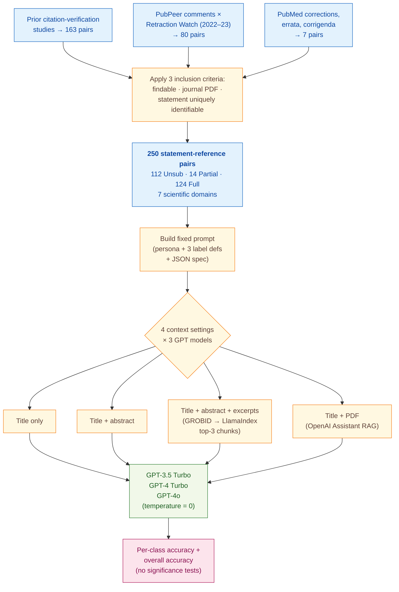

> [!success] **TL;DR**
> GPT-4 Turbo with retrieved excerpts hits 70.0% overall accuracy on a 250-pair benchmark — promising as a research signal, but well short of what a journal-screening pipeline would need. The two largest gaps to deployment are the small, narrow-domain corpus and the lack of any uncertainty estimates on the model-by-context comparisons; before treating "more context helps GPT-4 but hurts GPT-3.5" as a settled finding, a reader should want confidence intervals, a larger and more diverse benchmark, and disclosure of the OpenAI training-cutoff dates relative to the cited papers.

## Structured abstract

> [!info] A plain-language summary built from this paper's discourse-graph nodes. Numbers and findings link back to specific EVD nodes — click any link to drill in.

### Question

Can an off-the-shelf large language model (LLM) catch sentences in a scientific paper that misquote or misrepresent the work they cite, *without* any task-specific training? The authors call these mistakes *quotation errors* and ask whether modern GPT-class models can flag them when given just the citing sentence and varying amounts of context about the cited paper. They benchmark three OpenAI models across four levels of reference context, from "title only" up to "full PDF". See [[QUE - Can LLMs detect quotation errors in scientific papers without fine-tuning?]].

### Methods

**Design.** The authors ran a zero-shot evaluation — meaning the models received task instructions but no training examples — on a fixed, expert-labeled benchmark of 250 statement-and-reference pairs spanning seven scientific domains.

**Tools.** They tested three OpenAI models: GPT-3.5 Turbo (gpt-3.5-turbo-0125), GPT-4 Turbo (gpt-4-0125-preview), and GPT-4o (gpt-4o-2024-05-13). To pull supporting passages out of cited PDFs, they built a *retrieval-augmented generation (RAG)* pipeline — a setup where the model is fed relevant passages it can quote from. The pipeline used GROBID (a tool that turns PDF papers into structured text), LlamaIndex (a library that breaks text into chunks and ranks them by similarity to a query), and OpenAI's proprietary Assistant API, which has its own built-in PDF reader. As a comparison baseline they also ran MultiVerS / SciFact models from Wadden et al. 2020, an existing scientific claim-verification system.

**Procedure.** The authors built a 250-pair benchmark by combining three sources: pairs from earlier citation-verification studies, comments on the post-publication review site PubPeer cross-checked against Retraction Watch, and corrections published on PubMed. They wrote one fixed prompt — finalized before any experiments ran — that gave each model the role of "experienced scientific writer and editor", the three label definitions, and a JSON output template. They then ran each of the three models under four reference-context settings: title only, title plus abstract, title plus abstract plus the top-3 retrieved excerpts, and title plus the full PDF via the Assistant API. All twelve runs used temperature = 0, meaning the model picks its single most likely answer rather than sampling. They scored predictions by exact-match accuracy against the gold label, both per class and overall. They did not run any statistical-significance tests.

**Sample.** The final dataset has 250 statement-and-reference pairs: 163 (65.2%) from prior citation-verification studies, 80 (32.0%) from PubPeer plus Retraction Watch, and 7 (2.8%) from PubMed corrections. The label split is 112 Unsubstantiated (44.8%), 124 Fully substantiated (49.6%), and only 14 Partially substantiated (5.6%). The unit of analysis is one citing sentence paired with one cited reference; no human annotators were recruited for this study because labels were inherited from the source datasets.

### Findings

- **GPT-3.5 Turbo gets *worse* the more context you give it.** Overall accuracy peaked at 68.0% in the proprietary "title plus PDF via Assistant" setting and at 66.0% with title only, then *fell* to 54.0% once excerpts were added. Accuracy on Fully-substantiated pairs collapsed from 73.4% (title) to 30.6% (title plus abstract plus excerpts). The authors explain this as the model treating any unrelated sentence in the reference as evidence of a mismatch. [[EVD - GPT-3.5 Turbo accuracy on quotation error detection peaked at 68.0% (title only) and dropped with additional context to 54.0% - @zhangDetectingReferenceErrors2024]]

- **GPT-4 Turbo benefits from more context and tops the table.** The best run was GPT-4 Turbo with title plus abstract plus retrieved excerpts at 70.0% overall accuracy (Unsubstantiated 83.9%, Partially 21.4%, Fully 62.9%). Even with title only, GPT-4 Turbo caught 89.3% of Unsubstantiated cases, far above GPT-3.5 Turbo. GPT-4o's best run reached 68.0%. The newer models behave more cautiously and are more sensitive to small mismatches between a claim and its cited source. [[EVD - GPT-4 Turbo achieved 70.0% overall accuracy on quotation error detection with title plus abstract plus excerpts - @zhangDetectingReferenceErrors2024]]

### Claim supported

Together these findings support the claim that [[CLM - More capable GPT-class LLMs can detect quotation errors in scientific papers without fine-tuning but performance is imperfect and context-dependent]]. The practical takeaway: a 70% top-line accuracy still means roughly 3 in 10 citation pairs are mislabeled, and the dominant class (Unsubstantiated vs. Fully substantiated) drives most of the score. A journal that wanted to deploy this as a screening tool would still need a human reviewer in the loop.

### Caveats

- **The benchmark is mostly natural-science journal articles.** All 250 pairs come from journal venues, with biology, medicine, chemistry, and physics dominating. The findings may not transfer to conference papers, preprints, or to humanities and engineering work that this corpus barely covers. [[CVT - The quotation error dataset was predominantly from natural science journal articles limiting generalizability to conference papers and other publication channels]]

- **Each citation is treated as a single yes-or-no fact.** The three-label scheme assumes one statement cites one reference for one reason. Real citations often serve several purposes at once (e.g., a method reference plus a background claim), and forcing them into one bucket adds noise to both the gold labels and the model evaluation. [[CVT - The simple sentence-pair annotation scheme treated all reference pairs as equivalent despite multiple possible rationales for citation]]

### Methods at a glance

---

## Quality appraisal

> [!info] Risk-of-bias and validity assessment, synthesized from this paper's discourse-graph nodes and grounded in the same paper this page's top trust-signal chips summarize. Covers *methodological quality* — the TRIPOD-LLM table below covers *reporting compliance* instead.
> <dl class="callout-legend">
> <dt>● Low risk</dt><dd>No meaningful threat to this domain identified</dd>
> <dt>◐ Some risk</dt><dd>A real but non-fatal limitation</dd>
> <dt>○ High risk</dt><dd>A significant, unaddressed threat to validity</dd>
> </dl>

| Domain | Rating | Quote |
| --- | :---: | --- |
| **Construct validity**: does the metric actually measure the construct? | 🟡 | *"Considering both the rareness of Partially substantiated pairs in the dataset and their relatively low importance from a practical perspective, we then merged Partially and Fully substantiated predictions and performed a secondary analysis of model performance."* `§4, p.3` |
| **Internal validity**: could the comparison be biased? | 🟡 | *"All LLM experiments were conducted using OpenAI's Python API with temperature set to 0."* `§3, p.3`, identical conditions across all 12 model-by-context cells, but pretraining cutoffs relative to the cited papers are not disclosed |
| **External validity**: do findings generalize? | 🔴 | *"all statement-references pairs in our dataset came from journal articles and were predominantly in natural science domains. Such characteristics limit the generalizability of our findings to papers that are published through other channels (e.g., conferences and preprint platforms) or in research domains that are underrepresented in this study."* `§6 Limitation, p.5` |
| **Statistical rigor**: appropriate uncertainty + comparisons? | 🔴 | Not reported, no confidence intervals, significance tests, or multiple-comparison correction are reported across the 12 model-by-context accuracy comparisons in Table 3 |
| **Reproducibility**: code, data, determinism? | 🟡 | *"The evaluation dataset is available on GitHub"* `§3, p.2` |
| **Data leakage**: could models have seen this data pretraining? | 🔴 | Not reported, the paper does not discuss whether the citing or cited papers may have appeared in the OpenAI models' pretraining corpora |
| **Baseline adequacy**: is there a meaningful floor to beat? | 🟡 | *"The models for Wadden et al.'s (2020) scientific claim verification task predicted all statement-reference pairs in our dataset as 'Not Enough Information' when using abstracts as references, suggesting that these models may not be directly applicable to our quotation error detection task. Therefore, they are excluded from Table 3."* `§4, p.3` |
| **Train/dev/test hygiene**: are data splits kept separate? | 🟡 | *"The prompt template (Appendix C) was finalized before the start of the experiment."* `§3, p.2`, a fixed pre-registered prompt substitutes for a genuine train/dev/test split in this zero-shot evaluation |
| **Multiple-comparisons correction**: controlled for repeated testing? | 🔴 | Not reported, no correction is stated across the 12 model × context × 3-class comparisons in Table 3 |
| **Human-baseline comparability**: is there a human reference point? | 🔴 | Not addressed, no live human-expert reviewer was run alongside the LLMs; gold labels are inherited from prior citation-verification studies, PubPeer, and PubMed |
| **Confidence Intervals**: are point estimates accompanied by an interval? | 🔴 | Not reported — the 70.0% overall accuracy headline and per-condition accuracy figures carry no interval; the paper's own Discussion flags this gap directly, calling for "confidence intervals, a larger and more diverse benchmark" before the model-by-context comparison should be treated as settled `Discussion, p.5` |
| **Chance-Corrected Metrics**: does agreement/accuracy correct for chance? | 🔴 | Not reported — only accuracy by class and overall accuracy are reported `Table 3`; no chance-corrected statistic appears anywhere |
| **Non-Significant Result Spin**: are null or negative findings framed plainly? | 🟢 | *"Provision of more information or the Assistant pipeline did not necessarily improve LLM performance, especially for GPT-3.5 Turbo which performed much better on Fully substantiated cases in the title-only setting than with more information."* `p.3` — a counter-intuitive negative result stated plainly |

**Bottom line.** GPT-4 Turbo with retrieved excerpts hits 70.0% overall accuracy on a 250-pair benchmark — promising as a research signal, but well short of what a journal-screening pipeline would need. The two largest gaps to deployment are the small, narrow-domain corpus and the lack of any uncertainty estimates on the model-by-context comparisons; before treating "more context helps GPT-4 but hurts GPT-3.5" as a settled finding, a reader should want confidence intervals, a larger and more diverse benchmark, and disclosure of the OpenAI training-cutoff dates relative to the cited papers.

> [!tip] **Applicable external appraisal frameworks beyond TRIPOD-LLM** (already covered by the table below): **HELM** (Liang et al. 2022) for holistic LLM-evaluation principles · **Datasheets for Datasets** (Gebru et al. 2021) for the evaluation corpus · **Model Cards** (Mitchell et al. 2019) for the LLMs being evaluated

---

## TRIPOD-LLM reporting summary

> [!info] Reporting compliance for this paper, mapped to the TRIPOD-LLM checklist (Title/Abstract/Introduction items 1–4, Methods items 5a–15, Results items 16a–18). TRIPOD-LLM is a clinical-ML guideline being applied here to a non-clinical AI-research benchmark — where an item's own wording says "healthcare context" or "care pathway," it's read as "research-evaluation context" / "research workflow" instead. Item 17 (Performance) is reported per-EVD; see each EVD's `## Other Notes`.
> 

> ●Fully reported
> ◐Partial / unclear
> ○Not reported
> –Not applicable
> 

| # | Item | ✓ | Quote |
| --- | --- | :---: | --- |
| **1** | Title | ✅ | *"Detecting Reference Errors in Scientific Literature with Large Language Models"* `Title, p.1` |
| **2** | Abstract | ➖ | Assessed separately under TRIPOD-LLM's own Abstract extension, not scored here |
| **3a** | Background — context + rationale | ✅ | *"The reliability of referencing is usually taken for granted. However, previous citation verification studies in multiple scientific domains have revealed that reference errors of varying degrees are common in scientific papers, with prevalence rates ranging from 11% to 41%, depending on the domain, journal, and methodology"* `§1, p.1` |
| **3b** | Background — target population | ⚠️ | *"we prepared an expert-annotated, general-domain dataset of statement-reference pairs from journal articles"* `Abstract, p.1` |
| **4** | Objectives | ✅ | *"To fill this gap and encourage future attempts to automate reference error detection, this study performed a general-domain evaluation of the capability of LLMs to detect quotation errors in scientific papers."* `§2, p.2` |
| **5a** | Data sources | ✅ | *"Statement-reference pairs in the dataset were collected through the following channels: (1) 163 (65.2%) pairs are from previous citation verification studies... (2) 80 (32.0%) pairs are from PubPeer4, a platform for researchers to leave comments on others' publications... (3) 7 (2.8%) pairs are from corrections, errata, and corrigenda available in the PubMed database."* `Appendix B, p.7` |
| **5b** | Data points + distribution | ✅ | *"Unsubstantiated 112 (44.8) ... Partially substantiated 14 (5.6) ... Fully substantiated 124 (49.6)"* `Table 2, p.2` |
| **5c** | Date range of data | ⚠️ | *"we cross-referenced papers retracted in 2022 and 2023 due to 'concerns or issues about referencing or attributions'"* `Appendix B, p.7` — date range for the underlying cited/citing papers and OpenAI training-cutoff dates not stated |
| **5d** | Pre-processing / quality checks | ✅ | *"Three additional inclusion criteria were applied to the dataset to ensure data quality and experiment reproducibility. First, both the citing and the reference article should have digital versions that are findable through search engines."* `Appendix B, p.7` |
| **5e** | Missing / imbalanced data | ⚠️ | *"Considering both the rareness of Partially substantiated pairs in the dataset and their relatively low importance from a practical perspective, we then merged Partially and Fully substantiated predictions and performed a secondary analysis of model performance."* `§4, p.3` |
| **6a** | LLM name + version | ✅ | *"Three LLMs in OpenAI's GPT family were evaluated in the experiment: gpt-3.5-turbo-0125, gpt-4-0125-preview, and gpt-4o-2024-05-13."* `§3, p.3` |
| **6b** | Development process | ✅ | *"Local retrieval of excerpts from the main body of a reference followed a 3-step retrieval-augmented generation (RAG) (Gao et al., 2024) pipeline."* `§3, p.3` |
| **6c** | Inference settings / prompting | ⚠️ | *"All LLM experiments were conducted using OpenAI's Python API with temperature set to 0."* `§3, p.3` — top_p/seed/max_tokens and the LlamaIndex embedding model not stated |
| **6d** | Output | ✅ | *"LLMs were prompted to respond with a JSON object containing a predicted label and an explanation for their selection."* `§3, p.3` |
| **6e** | Classification thresholds | ➖ | Not applicable — direct categorical generation, no probability thresholds |
| **7a** | Quality metrics | ⚠️ | *"Model performance was measured by label accuracy."* `§3, p.3` — precision, recall, F1, kappa, and AUC not reported |
| **7b** | Relevance to downstream use | ⚠️ | *"We also quantified the relative contributions of model versions and increasing levels of context which could affect cost and speed in a production environment."* `p.4` |
| **7c** | Outcome definition | ✅ | *"a model should predict a label f(s, r) ∈ {Fully substantiated, Partially substantiated, Unsubstantiated} to indicate whether the statement-reference pair contains a quotation error"* `§2, p.2` |
| **7d** | Subjective interpretation | ⚠️ | *"The names and definitions of the labels follow previous citation verification studies (Smith and Cumberledge, 2020; Cobb et al., 2024)."* `§2, p.2` — no new annotator pool, no IAA computed |
| **7e** | Comparison | ✅ | *"The models for Wadden et al.'s (2020) scientific claim verification task predicted all statement-reference pairs in our dataset as 'Not Enough Information'... Therefore, they are excluded from Table 3."* `§4, p.3` |
| **8a** | Annotation guidelines | ✅ | *"The names and definitions of the labels follow previous citation verification studies... Complete definitions of the labels are listed in Table 1."* `§2, p.2` |
| **8b** | Annotators + IAA | ❌ | Not reported |
| **8c** | Annotator background | ❌ | Not reported |
| **9a** | Prompt design | ✅ | *"The prompt template (Appendix C) was finalized before the start of the experiment."* `§3, p.2` |
| **9b** | Prompt-development data | ❌ | Not reported — no description of what data, if any, was used to develop or iterate the prompt, and no held-out development split distinct from the test set |
| **10** | Summarization | ➖ | Not applicable |
| **11** | Instruction tuning / alignment | ⚠️ | *"large language models are able to detect erroneous citations with limited context and without fine-tuning"* `Abstract, p.1` |
| **12** | Compute | ❌ | Not reported |
| **13** | Ethical approval | ➖ | Not applicable — no human-subjects data; analysis on published articles and public PubPeer comments |
| **14a** | Funding | ✅ | *"The authors received no funding for this study."* `Acknowledgments, p.5` |
| **14b** | Conflicts of interest | ❌ | Not reported |
| **14c** | Protocol | ❌ | Not reported |
| **14d** | Registration | ➖ | Not applicable — not a registered clinical study |
| **14e** | Data availability | ✅ | *"The evaluation dataset is available on GitHub"* `§3, p.2` |
| **14f** | Code availability | ⚠️ | *"The evaluation dataset is available on GitHub"* `§3, p.2` — same repository hosts the dataset, but the paper does not explicitly state the inference/RAG pipeline code is included |
| **15** | Patient/public involvement | ➖ | Not applicable |
| **16a** | Flow of data | ⚠️ | *"Distributions of labels, domains, and reference availability in the dataset are summarized in Table 2."* `§3, p.2` — no explicit pre-screen-to-final flow counts |
| **16b** | Characteristics | ✅ | *"Biology or Medicine 85 (34.0) ... Chemistry or Material Science 57 (22.8) ... Physics 26 (10.4) ... Social Science 26 (10.4) ... Earth or Environmental Science 24 (9.6) ... Engineering 17 (6.8) ... Computer Science 15 (6.0)"* `Table 2, p.2` |
| **16c** | Distribution comparison | ➖ | Not applicable — no clinical-outcome subgroup comparison |
| **16d** | N per analysis | ✅ | *"Has abstract or PDF 250 (100)"* `Table 2, p.2` |
| **17** | Performance | `per-EVD` | Reported per-EVD. See each EVD's `## Other Notes`. |
| **18** | LLM updating | ⚠️ | *"During the progress of the study, new variants of Claude, Gemini, Llama, and GPT became available, some of which support a long enough context window to accept an entire reference article as input."* `§6 Limitation, p.5` |
